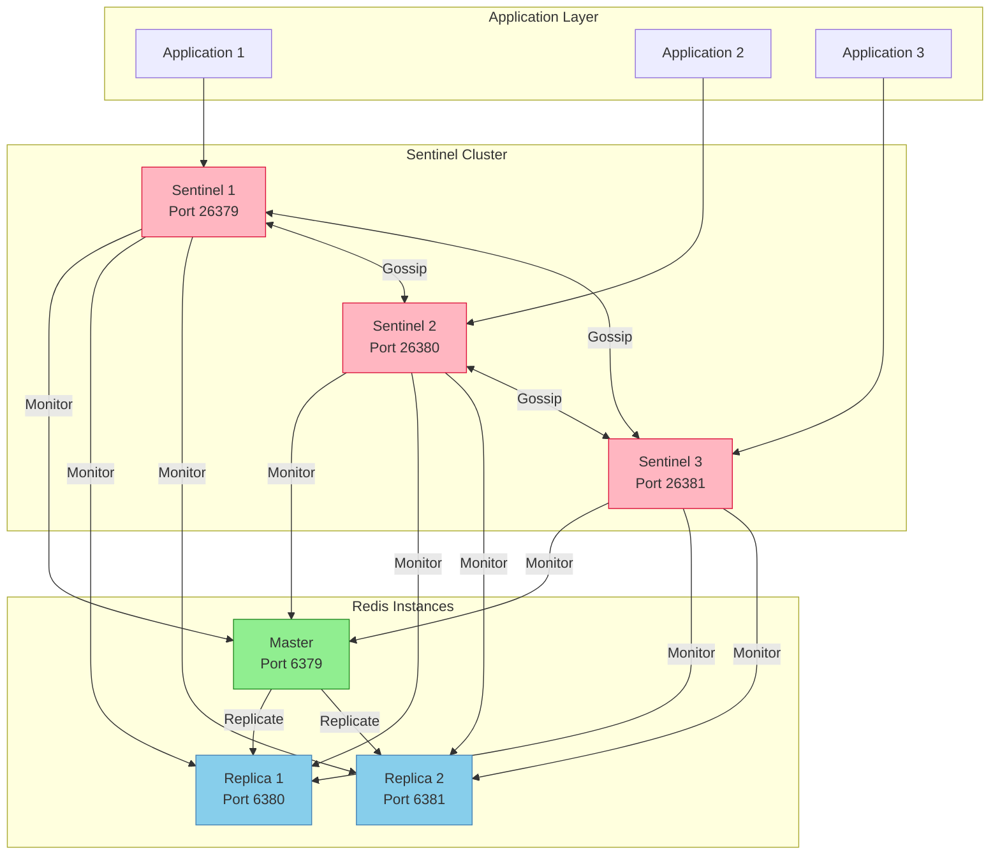
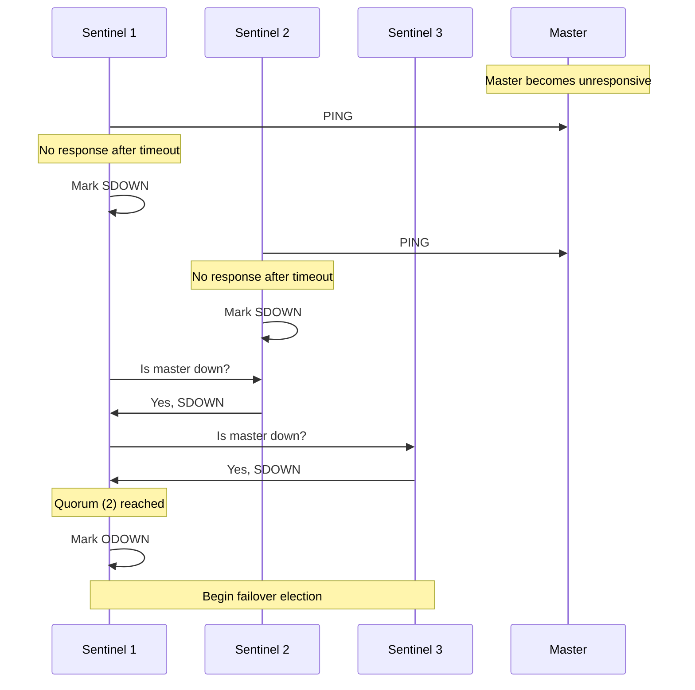
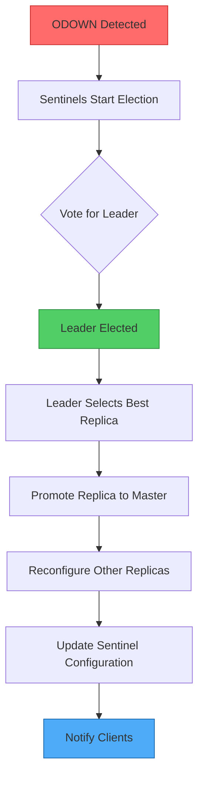
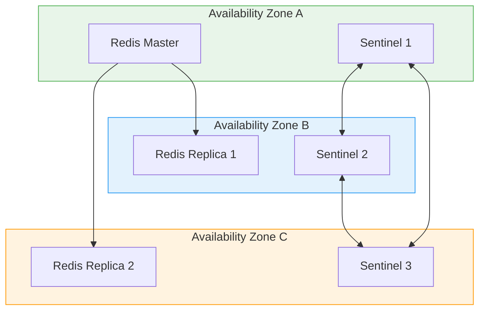
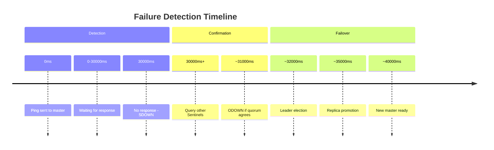
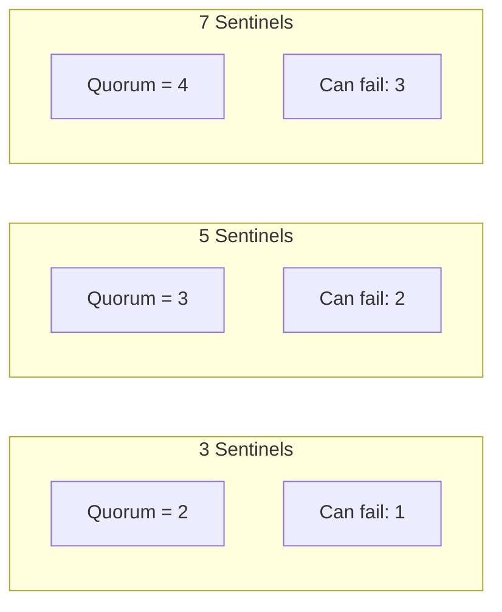

# How to Configure Redis Sentinel Automatic Failover

Author: [nawazdhandala](https://www.github.com/nawazdhandala)

Tags: Redis, Sentinel, High Availability, Failover

Description: A step-by-step guide to configuring Redis Sentinel for automatic failover. Learn about quorum settings, timing parameters, client reconnection strategies, split-brain prevention, and production deployment patterns.

---

Redis is often the backbone of modern application architectures, serving as a cache, session store, message broker, and more. When Redis goes down, applications can grind to a halt. Redis Sentinel solves this problem by providing automatic failover, ensuring your Redis deployment stays available even when individual nodes fail.

This guide walks through configuring Redis Sentinel from scratch, covering everything from basic setup to advanced production configurations. You will learn how to set up a fault-tolerant Redis cluster that automatically recovers from failures without human intervention.

## What is Redis Sentinel?

Redis Sentinel is a distributed system designed to manage Redis instances. It performs four primary functions:

1. **Monitoring**: Sentinel constantly checks if your master and replica instances are working as expected
2. **Notification**: Sentinel can notify administrators or other programs through an API when something goes wrong
3. **Automatic failover**: When a master is not working as expected, Sentinel can start a failover process where a replica is promoted to master
4. **Configuration provider**: Sentinel acts as a service discovery source for clients, providing the address of the current master



## Understanding the Failover Process

Before diving into configuration, it is important to understand how Sentinel detects failures and performs failover. This knowledge will help you tune the configuration parameters correctly.

### Subjective Down (SDOWN) vs Objective Down (ODOWN)

Sentinel uses two states to track instance failures:

- **SDOWN (Subjectively Down)**: A single Sentinel believes an instance is down because it did not respond within the configured timeout
- **ODOWN (Objectively Down)**: Multiple Sentinels agree that an instance is down (quorum reached)



### Failover Election Process

When ODOWN is reached, Sentinels elect a leader to perform the failover:



The leader selection for replica promotion considers:
1. **replica-priority**: Lower values have higher priority (0 means never promote)
2. **Replication offset**: Replicas with more data are preferred
3. **Run ID**: Lexicographically smaller as a tiebreaker

## Planning Your Deployment

### Minimum Requirements

For a production Sentinel deployment, you need:
- At least 3 Sentinel instances for proper quorum voting
- At least 1 master and 2 replicas for failover capability
- Sentinels deployed on separate physical or virtual machines

### Quorum Configuration

The quorum is the minimum number of Sentinels that must agree a master is down before failover begins. The table below shows recommended quorum values:

| Sentinels | Quorum | Can Tolerate Failures |
|-----------|--------|----------------------|
| 3         | 2      | 1 Sentinel           |
| 5         | 3      | 2 Sentinels          |
| 7         | 4      | 3 Sentinels          |

The formula is: `quorum = (N / 2) + 1` where N is the number of Sentinels.

### Network Topology Considerations

Deploy your Sentinels across different failure domains:



This topology ensures that a single availability zone failure cannot cause a split-brain scenario.

## Configuring the Redis Master

Start by configuring your Redis master instance. This configuration enables replication, persistence, and authentication.

The following configuration file sets up a Redis master with password authentication, AOF persistence for durability, and replication backlog for replica synchronization:

```conf
# redis-master.conf
# Redis Master Configuration for Sentinel-Managed Cluster

# Network Configuration
# Bind to all interfaces - restrict in production using firewall rules
bind 0.0.0.0
port 6379

# Enable protected mode when binding to all interfaces
protected-mode yes

# Authentication
# Set a strong password for client connections
requirepass your_strong_redis_password

# Master authentication for when this instance becomes a replica after failover
masterauth your_strong_redis_password

# Persistence Configuration
# Enable AOF for durability - recommended for Sentinel setups
appendonly yes
appendfilename "appendonly.aof"

# AOF fsync policy: everysec provides good balance of performance and durability
appendfsync everysec

# Directory for data files
dir /var/lib/redis

# RDB snapshots as backup
save 900 1
save 300 10
save 60 10000

# Memory Configuration
maxmemory 4gb
maxmemory-policy volatile-lru

# Replication Configuration
# Minimum replicas required for writes - prevents writing to isolated master
min-replicas-to-write 1
min-replicas-max-lag 10

# Replication backlog size - allows replicas to resync after brief disconnections
repl-backlog-size 64mb
repl-backlog-ttl 3600

# Client timeout - 0 means no timeout
timeout 0

# TCP keepalive for detecting dead connections
tcp-keepalive 300

# Logging
loglevel notice
logfile /var/log/redis/redis-master.log

# Process management
daemonize yes
pidfile /var/run/redis/redis-master.pid
```

## Configuring Redis Replicas

Each replica connects to the master and maintains a synchronized copy of the data. Create separate configuration files for each replica.

This replica configuration specifies the master to replicate from, enables read-only mode, and sets the replica priority for failover selection:

```conf
# redis-replica-1.conf
# Redis Replica 1 Configuration

# Network Configuration
bind 0.0.0.0
port 6380
protected-mode yes

# Authentication
requirepass your_strong_redis_password
masterauth your_strong_redis_password

# Replication - Connect to master
# Sentinel will update this automatically during failover
replicaof 192.168.1.10 6379

# Replica Settings
# Enable read-only mode - replicas should not accept writes
replica-read-only yes

# Serve stale data while syncing - prevents errors during initial sync
replica-serve-stale-data yes

# Replica priority for failover selection
# Lower values have higher priority, 0 means never promote
replica-priority 100

# Diskless replication - faster for slow disks or fast networks
repl-diskless-sync yes
repl-diskless-sync-delay 5

# Persistence
appendonly yes
appendfilename "appendonly.aof"
appendfsync everysec
dir /var/lib/redis/replica-1

save 900 1
save 300 10
save 60 10000

# Memory
maxmemory 4gb
maxmemory-policy volatile-lru

# Connection settings
timeout 0
tcp-keepalive 300

# Logging
loglevel notice
logfile /var/log/redis/redis-replica-1.log

# Process management
daemonize yes
pidfile /var/run/redis/redis-replica-1.pid
```

Create a similar configuration for the second replica, changing the port to 6381, the directory to replica-2, and optionally setting a different replica-priority value.

## Configuring Sentinel Instances

Sentinel configuration is where the magic happens. Each Sentinel needs to know about the master and the failover parameters.

This Sentinel configuration monitors the Redis master, defines the quorum for failover decisions, and sets timing parameters for failure detection:

```conf
# sentinel-1.conf
# Redis Sentinel 1 Configuration

# Network Configuration
port 26379
bind 0.0.0.0

# Sentinel data directory
dir /var/lib/redis/sentinel-1

# Logging
logfile /var/log/redis/sentinel-1.log
loglevel notice

# Process management
daemonize yes
pidfile /var/run/redis/sentinel-1.pid

# Monitor Configuration
# sentinel monitor <master-name> <ip> <port> <quorum>
# The quorum is the number of Sentinels that must agree the master is down
sentinel monitor mymaster 192.168.1.10 6379 2

# Authentication for connecting to Redis instances
sentinel auth-pass mymaster your_strong_redis_password

# Timing Configuration
# Milliseconds before master is considered down (SDOWN)
# 30 seconds is reasonable for most deployments
sentinel down-after-milliseconds mymaster 30000

# Number of replicas that can sync with new master simultaneously
# Higher values speed up failover but increase network and disk load
sentinel parallel-syncs mymaster 1

# Failover timeout in milliseconds
# Covers: time between failover attempts, replica replication time,
# time to cancel failover if taking too long
sentinel failover-timeout mymaster 180000

# Security - prevent runtime script changes
sentinel deny-scripts-reconfig yes

# Notification and Reconfiguration Scripts (optional)
# Called when Sentinel detects important events
# sentinel notification-script mymaster /opt/redis/scripts/notify.sh

# Called when clients need to update their master address
# sentinel client-reconfig-script mymaster /opt/redis/scripts/reconfig.sh

# NAT and Docker support
# If Sentinels are behind NAT, announce the public IP
# sentinel announce-ip 203.0.113.10
# sentinel announce-port 26379
```

Create similar configurations for sentinel-2 (port 26380) and sentinel-3 (port 26381).

## Understanding Key Timing Parameters

The timing parameters significantly affect failover behavior. Here is a detailed breakdown:

### down-after-milliseconds

This parameter controls how long Sentinel waits before marking an instance as SDOWN.



| Setting | Use Case |
|---------|----------|
| 5000ms  | Aggressive - fast detection, higher false positive risk |
| 30000ms | Balanced - good for most production environments |
| 60000ms | Conservative - for unstable networks |

### failover-timeout

This timeout affects multiple aspects of the failover process:

1. Time allowed to restart a failover after a previous failover attempt
2. Time for a replica to replicate from the new master before Sentinel considers failover complete
3. Time to cancel a failover that is taking too long
4. Maximum time before Sentinel retries a failed SLAVEOF command

### parallel-syncs

Controls how many replicas can sync with the new master simultaneously during failover:

| Value | Trade-off |
|-------|-----------|
| 1     | Slower failover, minimal impact on new master |
| 2-3   | Faster failover, moderate load on new master |
| All   | Fastest failover, highest load on new master |

## Starting the Cluster

With all configurations in place, start the services in the correct order.

This script creates the necessary directories, sets proper permissions, and starts all Redis and Sentinel instances:

```bash
#!/bin/bash
# start-redis-cluster.sh
# Script to start Redis Sentinel cluster

set -e

REDIS_USER="redis"
REDIS_PASSWORD="your_strong_redis_password"

echo "Creating directories..."
mkdir -p /var/lib/redis/master
mkdir -p /var/lib/redis/replica-1
mkdir -p /var/lib/redis/replica-2
mkdir -p /var/lib/redis/sentinel-1
mkdir -p /var/lib/redis/sentinel-2
mkdir -p /var/lib/redis/sentinel-3
mkdir -p /var/run/redis
mkdir -p /var/log/redis

echo "Setting permissions..."
chown -R $REDIS_USER:$REDIS_USER /var/lib/redis
chown -R $REDIS_USER:$REDIS_USER /var/run/redis
chown -R $REDIS_USER:$REDIS_USER /var/log/redis

echo "Starting Redis master..."
redis-server /etc/redis/redis-master.conf

echo "Waiting for master to be ready..."
sleep 3

echo "Verifying master is running..."
redis-cli -p 6379 -a $REDIS_PASSWORD ping

echo "Starting Redis replicas..."
redis-server /etc/redis/redis-replica-1.conf
redis-server /etc/redis/redis-replica-2.conf

echo "Waiting for replicas to sync..."
sleep 5

echo "Verifying replication..."
redis-cli -p 6379 -a $REDIS_PASSWORD info replication | grep connected_slaves

echo "Starting Sentinels..."
redis-sentinel /etc/redis/sentinel-1.conf
redis-sentinel /etc/redis/sentinel-2.conf
redis-sentinel /etc/redis/sentinel-3.conf

echo "Waiting for Sentinels to discover each other..."
sleep 10

echo "Cluster status:"
redis-cli -p 26379 sentinel master mymaster

echo "Redis Sentinel cluster started successfully!"
```

## Verifying the Cluster Status

After starting the cluster, verify that everything is working correctly.

The following commands check Sentinel status, quorum health, and replication state:

```bash
#!/bin/bash
# verify-cluster.sh
# Script to verify Redis Sentinel cluster health

SENTINEL_PORT=26379
MASTER_NAME="mymaster"

echo "=== Sentinel Master Info ==="
redis-cli -p $SENTINEL_PORT sentinel master $MASTER_NAME

echo ""
echo "=== Current Master Address ==="
redis-cli -p $SENTINEL_PORT sentinel get-master-addr-by-name $MASTER_NAME

echo ""
echo "=== Replica Information ==="
redis-cli -p $SENTINEL_PORT sentinel replicas $MASTER_NAME

echo ""
echo "=== Sentinel Peers ==="
redis-cli -p $SENTINEL_PORT sentinel sentinels $MASTER_NAME

echo ""
echo "=== Quorum Check ==="
redis-cli -p $SENTINEL_PORT sentinel ckquorum $MASTER_NAME

echo ""
echo "=== Master Replication Status ==="
MASTER_IP=$(redis-cli -p $SENTINEL_PORT sentinel get-master-addr-by-name $MASTER_NAME | head -1)
MASTER_PORT=$(redis-cli -p $SENTINEL_PORT sentinel get-master-addr-by-name $MASTER_NAME | tail -1)
redis-cli -h $MASTER_IP -p $MASTER_PORT -a your_strong_redis_password info replication
```

Expected output for a healthy cluster:

```
=== Current Master Address ===
1) "192.168.1.10"
2) "6379"

=== Quorum Check ===
OK 3 usable Sentinels. Quorum and failover authorization is possible.
```

## Client Configuration for Automatic Reconnection

Clients must be configured to work with Sentinel for seamless failover handling.

### Python Client with redis-py

This Python client connects through Sentinel and automatically follows master changes during failover:

```python
# redis_sentinel_client.py
# Python Redis client with Sentinel support

from redis.sentinel import Sentinel
from redis.exceptions import ConnectionError, TimeoutError
import time
import logging

logging.basicConfig(level=logging.INFO)
logger = logging.getLogger(__name__)

class RedisSentinelClient:
    """
    Redis client that connects through Sentinel for automatic failover support.
    Implements retry logic to handle brief connection issues during failover.
    """

    def __init__(self, sentinel_hosts, master_name, password, max_retries=3):
        """
        Initialize the Sentinel-aware Redis client.

        Args:
            sentinel_hosts: List of (host, port) tuples for Sentinel instances
            master_name: Name of the master as configured in Sentinel
            password: Redis authentication password
            max_retries: Number of retries for operations during failover
        """
        self.sentinel = Sentinel(
            sentinel_hosts,
            socket_timeout=5.0,
            socket_connect_timeout=5.0,
            password=password,
            sentinel_kwargs={'password': password}
        )
        self.master_name = master_name
        self.password = password
        self.max_retries = max_retries

    def get_master(self):
        """Get a connection to the current master."""
        return self.sentinel.master_for(
            self.master_name,
            socket_timeout=5.0,
            password=self.password,
            retry_on_timeout=True
        )

    def get_replica(self):
        """Get a connection to a replica for read operations."""
        return self.sentinel.slave_for(
            self.master_name,
            socket_timeout=5.0,
            password=self.password
        )

    def execute_with_retry(self, operation, *args, **kwargs):
        """
        Execute a Redis operation with retry logic for failover handling.

        During failover, operations may fail temporarily. This method retries
        with exponential backoff until the operation succeeds or max retries
        is reached.
        """
        last_error = None

        for attempt in range(self.max_retries):
            try:
                master = self.get_master()
                return operation(master, *args, **kwargs)
            except (ConnectionError, TimeoutError) as e:
                last_error = e
                wait_time = (2 ** attempt) * 0.5  # Exponential backoff
                logger.warning(
                    f"Operation failed (attempt {attempt + 1}/{self.max_retries}): {e}. "
                    f"Retrying in {wait_time}s..."
                )
                time.sleep(wait_time)

        raise last_error

    def set(self, key, value, ex=None):
        """Set a key with optional expiration."""
        def _set(client, k, v, expiration):
            return client.set(k, v, ex=expiration)
        return self.execute_with_retry(_set, key, value, ex)

    def get(self, key, use_replica=False):
        """
        Get a key value.

        Args:
            key: The key to retrieve
            use_replica: If True, read from a replica for better performance
        """
        if use_replica:
            try:
                replica = self.get_replica()
                return replica.get(key)
            except (ConnectionError, TimeoutError):
                logger.warning("Replica unavailable, falling back to master")

        def _get(client, k):
            return client.get(k)
        return self.execute_with_retry(_get, key)

    def discover_master(self):
        """Get the current master address."""
        return self.sentinel.discover_master(self.master_name)

    def discover_replicas(self):
        """Get the current replica addresses."""
        return self.sentinel.discover_slaves(self.master_name)


# Usage example
if __name__ == "__main__":
    sentinel_hosts = [
        ('192.168.1.20', 26379),
        ('192.168.1.21', 26380),
        ('192.168.1.22', 26381),
    ]

    client = RedisSentinelClient(
        sentinel_hosts=sentinel_hosts,
        master_name='mymaster',
        password='your_strong_redis_password'
    )

    # Check current master
    master = client.discover_master()
    print(f"Current master: {master[0]}:{master[1]}")

    # Check replicas
    replicas = client.discover_replicas()
    print(f"Available replicas: {len(replicas)}")

    # Write to master
    client.set('test_key', 'test_value', ex=3600)
    print("Written to master")

    # Read from replica
    value = client.get('test_key', use_replica=True)
    print(f"Read from replica: {value}")
```

### Node.js Client with ioredis

This Node.js client uses ioredis with built-in Sentinel support and automatic reconnection:

```javascript
// redis-sentinel-client.js
// Node.js Redis client with Sentinel support

const Redis = require('ioredis');

/**
 * Creates a Redis client that connects through Sentinel.
 * Handles automatic reconnection during failover events.
 */
function createSentinelClient(options = {}) {
  const {
    sentinels = [
      { host: '192.168.1.20', port: 26379 },
      { host: '192.168.1.21', port: 26380 },
      { host: '192.168.1.22', port: 26381 },
    ],
    masterName = 'mymaster',
    password = 'your_strong_redis_password',
    sentinelPassword = 'your_strong_redis_password',
  } = options;

  const redis = new Redis({
    sentinels,
    name: masterName,
    password,
    sentinelPassword,

    // Retry strategy with exponential backoff
    retryStrategy(times) {
      if (times > 10) {
        console.error('Max retries reached, giving up');
        return null; // Stop retrying
      }
      // Exponential backoff: 100ms, 200ms, 400ms, etc.
      const delay = Math.min(times * 100, 3000);
      console.log(`Retry attempt ${times}, waiting ${delay}ms`);
      return delay;
    },

    // Reconnect on READONLY errors (happens during failover)
    reconnectOnError(err) {
      const targetErrors = ['READONLY', 'LOADING', 'MASTERDOWN'];
      if (targetErrors.some((e) => err.message.includes(e))) {
        console.log('Reconnecting due to:', err.message);
        return true;
      }
      return false;
    },

    // Connection settings
    enableReadyCheck: true,
    maxRetriesPerRequest: 3,
    connectTimeout: 10000,
    commandTimeout: 5000,
  });

  // Event handlers for monitoring
  redis.on('connect', () => {
    console.log('Connected to Redis');
  });

  redis.on('ready', () => {
    console.log('Redis client ready');
  });

  redis.on('error', (err) => {
    console.error('Redis error:', err.message);
  });

  redis.on('close', () => {
    console.log('Redis connection closed');
  });

  redis.on('reconnecting', (delay) => {
    console.log(`Reconnecting to Redis in ${delay}ms...`);
  });

  // Sentinel-specific events
  redis.on('+switch-master', (newMaster) => {
    console.log('Master switched to:', newMaster);
  });

  redis.on('+sentinel', (sentinel) => {
    console.log('New Sentinel discovered:', sentinel);
  });

  redis.on('-sentinel', (sentinel) => {
    console.log('Sentinel removed:', sentinel);
  });

  return redis;
}

/**
 * Wrapper class for failover-resilient operations
 */
class ResilientRedisClient {
  constructor(redis) {
    this.redis = redis;
    this.maxRetries = 3;
  }

  async executeWithRetry(operation) {
    let lastError;

    for (let attempt = 1; attempt <= this.maxRetries; attempt++) {
      try {
        return await operation();
      } catch (error) {
        lastError = error;

        if (this.isRetryableError(error)) {
          console.log(`Operation failed (attempt ${attempt}): ${error.message}`);
          await this.sleep(Math.pow(2, attempt) * 100);
          continue;
        }

        throw error;
      }
    }

    throw lastError;
  }

  isRetryableError(error) {
    const retryableMessages = [
      'READONLY',
      'LOADING',
      'MASTERDOWN',
      'Connection is closed',
      'ECONNREFUSED',
    ];
    return retryableMessages.some((msg) => error.message.includes(msg));
  }

  sleep(ms) {
    return new Promise((resolve) => setTimeout(resolve, ms));
  }

  async set(key, value, options = {}) {
    return this.executeWithRetry(() => {
      if (options.ex) {
        return this.redis.set(key, value, 'EX', options.ex);
      }
      return this.redis.set(key, value);
    });
  }

  async get(key) {
    return this.executeWithRetry(() => this.redis.get(key));
  }

  async del(key) {
    return this.executeWithRetry(() => this.redis.del(key));
  }

  async hset(key, field, value) {
    return this.executeWithRetry(() => this.redis.hset(key, field, value));
  }

  async hget(key, field) {
    return this.executeWithRetry(() => this.redis.hget(key, field));
  }
}

// Usage example
async function main() {
  const redis = createSentinelClient();
  const client = new ResilientRedisClient(redis);

  try {
    // Write data
    await client.set('user:123', JSON.stringify({ name: 'John' }), { ex: 3600 });
    console.log('Data written successfully');

    // Read data
    const data = await client.get('user:123');
    console.log('Data read:', data);

    // Hash operations
    await client.hset('session:abc', 'user_id', '123');
    const userId = await client.hget('session:abc', 'user_id');
    console.log('Session user ID:', userId);
  } catch (error) {
    console.error('Operation failed:', error);
  }
}

module.exports = { createSentinelClient, ResilientRedisClient };

// Run if executed directly
if (require.main === module) {
  main();
}
```

### Go Client with go-redis

This Go client implements Sentinel support with connection pooling and proper error handling:

```go
// redis_sentinel_client.go
// Go Redis client with Sentinel support

package main

import (
	"context"
	"encoding/json"
	"fmt"
	"log"
	"time"

	"github.com/redis/go-redis/v9"
)

// SentinelConfig holds the configuration for Sentinel connection
type SentinelConfig struct {
	MasterName       string
	SentinelAddrs    []string
	Password         string
	SentinelPassword string
	PoolSize         int
	MinIdleConns     int
	DialTimeout      time.Duration
	ReadTimeout      time.Duration
	WriteTimeout     time.Duration
	MaxRetries       int
}

// DefaultSentinelConfig returns a config with sensible defaults
func DefaultSentinelConfig() *SentinelConfig {
	return &SentinelConfig{
		MasterName: "mymaster",
		SentinelAddrs: []string{
			"192.168.1.20:26379",
			"192.168.1.21:26380",
			"192.168.1.22:26381",
		},
		Password:         "your_strong_redis_password",
		SentinelPassword: "your_strong_redis_password",
		PoolSize:         50,
		MinIdleConns:     10,
		DialTimeout:      5 * time.Second,
		ReadTimeout:      3 * time.Second,
		WriteTimeout:     3 * time.Second,
		MaxRetries:       3,
	}
}

// NewSentinelClient creates a new Redis client that connects through Sentinel
func NewSentinelClient(config *SentinelConfig) *redis.Client {
	return redis.NewFailoverClient(&redis.FailoverOptions{
		MasterName:       config.MasterName,
		SentinelAddrs:    config.SentinelAddrs,
		Password:         config.Password,
		SentinelPassword: config.SentinelPassword,

		// Connection pool settings
		PoolSize:     config.PoolSize,
		MinIdleConns: config.MinIdleConns,

		// Timeout settings
		DialTimeout:  config.DialTimeout,
		ReadTimeout:  config.ReadTimeout,
		WriteTimeout: config.WriteTimeout,

		// Retry settings for failover resilience
		MaxRetries:      config.MaxRetries,
		MinRetryBackoff: 8 * time.Millisecond,
		MaxRetryBackoff: 512 * time.Millisecond,

		// Sentinel-specific options
		RouteByLatency: true,  // Route reads to lowest latency node
		RouteRandomly:  false, // Disable random routing
	})
}

// ResilientClient wraps the Redis client with additional resilience features
type ResilientClient struct {
	client     *redis.Client
	maxRetries int
}

// NewResilientClient creates a new resilient Redis client
func NewResilientClient(client *redis.Client, maxRetries int) *ResilientClient {
	return &ResilientClient{
		client:     client,
		maxRetries: maxRetries,
	}
}

// executeWithRetry executes an operation with exponential backoff retry
func (r *ResilientClient) executeWithRetry(ctx context.Context, operation func() error) error {
	var lastErr error

	for attempt := 0; attempt < r.maxRetries; attempt++ {
		err := operation()
		if err == nil {
			return nil
		}

		lastErr = err

		// Check if error is retryable
		if !r.isRetryableError(err) {
			return err
		}

		// Exponential backoff
		backoff := time.Duration(1<<uint(attempt)) * 100 * time.Millisecond
		log.Printf("Operation failed (attempt %d/%d): %v. Retrying in %v...",
			attempt+1, r.maxRetries, err, backoff)

		select {
		case <-time.After(backoff):
		case <-ctx.Done():
			return ctx.Err()
		}
	}

	return lastErr
}

// isRetryableError checks if an error should trigger a retry
func (r *ResilientClient) isRetryableError(err error) bool {
	if err == nil {
		return false
	}

	errMsg := err.Error()
	retryableErrors := []string{
		"READONLY",
		"LOADING",
		"MASTERDOWN",
		"connection refused",
		"connection reset",
	}

	for _, retryable := range retryableErrors {
		if contains(errMsg, retryable) {
			return true
		}
	}

	return false
}

func contains(s, substr string) bool {
	return len(s) >= len(substr) && (s == substr || len(s) > 0 && containsHelper(s, substr))
}

func containsHelper(s, substr string) bool {
	for i := 0; i <= len(s)-len(substr); i++ {
		if s[i:i+len(substr)] == substr {
			return true
		}
	}
	return false
}

// Set stores a key-value pair with optional expiration
func (r *ResilientClient) Set(ctx context.Context, key string, value interface{}, expiration time.Duration) error {
	return r.executeWithRetry(ctx, func() error {
		return r.client.Set(ctx, key, value, expiration).Err()
	})
}

// Get retrieves a value by key
func (r *ResilientClient) Get(ctx context.Context, key string) (string, error) {
	var result string
	err := r.executeWithRetry(ctx, func() error {
		var err error
		result, err = r.client.Get(ctx, key).Result()
		return err
	})
	return result, err
}

// SetJSON stores a JSON-serializable value
func (r *ResilientClient) SetJSON(ctx context.Context, key string, value interface{}, expiration time.Duration) error {
	data, err := json.Marshal(value)
	if err != nil {
		return fmt.Errorf("failed to marshal JSON: %w", err)
	}
	return r.Set(ctx, key, data, expiration)
}

// GetJSON retrieves and unmarshals a JSON value
func (r *ResilientClient) GetJSON(ctx context.Context, key string, dest interface{}) error {
	data, err := r.Get(ctx, key)
	if err != nil {
		return err
	}
	return json.Unmarshal([]byte(data), dest)
}

func main() {
	// Create client with default configuration
	config := DefaultSentinelConfig()
	redisClient := NewSentinelClient(config)
	defer redisClient.Close()

	// Create resilient wrapper
	client := NewResilientClient(redisClient, 3)
	ctx := context.Background()

	// Test connection
	pong, err := redisClient.Ping(ctx).Result()
	if err != nil {
		log.Fatalf("Failed to connect: %v", err)
	}
	log.Printf("Connected: %s", pong)

	// Store data
	err = client.Set(ctx, "user:123:name", "John Doe", time.Hour)
	if err != nil {
		log.Fatalf("Failed to set: %v", err)
	}
	log.Println("Data stored successfully")

	// Retrieve data
	name, err := client.Get(ctx, "user:123:name")
	if err != nil {
		log.Fatalf("Failed to get: %v", err)
	}
	log.Printf("Retrieved: %s", name)

	// Store JSON data
	user := map[string]interface{}{
		"id":    123,
		"name":  "John Doe",
		"email": "john@example.com",
	}
	err = client.SetJSON(ctx, "user:123:profile", user, time.Hour)
	if err != nil {
		log.Fatalf("Failed to set JSON: %v", err)
	}

	// Retrieve JSON data
	var retrievedUser map[string]interface{}
	err = client.GetJSON(ctx, "user:123:profile", &retrievedUser)
	if err != nil {
		log.Fatalf("Failed to get JSON: %v", err)
	}
	log.Printf("Retrieved user: %v", retrievedUser)
}
```

## Preventing Split-Brain Scenarios

Split-brain occurs when network partitions cause multiple Redis instances to believe they are the master. This can lead to data inconsistency and loss.

### Strategy 1: Configure min-replicas-to-write

This setting prevents the master from accepting writes when it cannot reach enough replicas:

```conf
# On the master
# Require at least 1 replica to acknowledge writes
min-replicas-to-write 1

# Replica must respond within 10 seconds to count as healthy
min-replicas-max-lag 10
```

This ensures that if the master becomes isolated, it stops accepting writes rather than creating divergent data.

### Strategy 2: Proper Quorum Configuration

Always configure your quorum to require a true majority:



### Strategy 3: Client-Side Verification

Implement write verification in your application:

```python
# split_brain_protection.py
# Client-side split-brain protection

from redis.sentinel import Sentinel
import time

def safe_write(sentinel, master_name, key, value, password):
    """
    Perform a write with split-brain protection.
    Verifies the master is still authoritative after writing.
    """
    master = sentinel.master_for(
        master_name,
        password=password,
        socket_timeout=3.0
    )

    # Perform the write
    master.set(key, value)

    # Brief delay for replication
    time.sleep(0.05)

    # Verify this master is still the authoritative one
    master_info = master.info('replication')

    # Check we are still the master
    if master_info['role'] != 'master':
        raise Exception("Write went to a demoted master - data may be lost")

    # Check we have connected replicas
    if master_info['connected_slaves'] < 1:
        raise Exception("Master is isolated - write may not be replicated")

    return True
```

## Testing Failover

Regular failover testing is essential to ensure your setup works correctly.

This script simulates a master failure and verifies automatic recovery:

```bash
#!/bin/bash
# test-failover.sh
# Comprehensive failover test script

SENTINEL_HOST="localhost"
SENTINEL_PORT="26379"
MASTER_NAME="mymaster"
REDIS_PASSWORD="your_strong_redis_password"

echo "=========================================="
echo "Redis Sentinel Failover Test"
echo "=========================================="

# Function to get current master
get_master() {
    redis-cli -h $SENTINEL_HOST -p $SENTINEL_PORT \
        sentinel get-master-addr-by-name $MASTER_NAME
}

# Function to check cluster health
check_health() {
    echo "Checking cluster health..."
    redis-cli -h $SENTINEL_HOST -p $SENTINEL_PORT \
        sentinel ckquorum $MASTER_NAME
}

# Get initial state
echo ""
echo "Step 1: Recording initial state"
echo "--------------------------------"
INITIAL_MASTER=$(get_master)
INITIAL_MASTER_IP=$(echo "$INITIAL_MASTER" | head -1)
INITIAL_MASTER_PORT=$(echo "$INITIAL_MASTER" | tail -1)
echo "Current master: $INITIAL_MASTER_IP:$INITIAL_MASTER_PORT"

check_health

# Write test data
echo ""
echo "Step 2: Writing test data"
echo "-------------------------"
redis-cli -h $INITIAL_MASTER_IP -p $INITIAL_MASTER_PORT \
    -a $REDIS_PASSWORD \
    SET failover_test_key "value_before_failover"
echo "Test data written"

# Trigger failover
echo ""
echo "Step 3: Triggering failover"
echo "---------------------------"
redis-cli -h $SENTINEL_HOST -p $SENTINEL_PORT \
    sentinel failover $MASTER_NAME
echo "Failover command sent"

# Wait for failover to complete
echo ""
echo "Step 4: Waiting for failover (30 seconds)"
echo "------------------------------------------"
for i in {1..30}; do
    NEW_MASTER=$(get_master)
    NEW_MASTER_IP=$(echo "$NEW_MASTER" | head -1)

    if [ "$NEW_MASTER_IP" != "$INITIAL_MASTER_IP" ]; then
        echo "Failover completed in $i seconds"
        break
    fi
    echo -n "."
    sleep 1
done
echo ""

# Verify new master
echo ""
echo "Step 5: Verifying new master"
echo "----------------------------"
FINAL_MASTER=$(get_master)
FINAL_MASTER_IP=$(echo "$FINAL_MASTER" | head -1)
FINAL_MASTER_PORT=$(echo "$FINAL_MASTER" | tail -1)
echo "New master: $FINAL_MASTER_IP:$FINAL_MASTER_PORT"

if [ "$FINAL_MASTER_IP" == "$INITIAL_MASTER_IP" ]; then
    echo "ERROR: Master did not change!"
    exit 1
fi

# Verify data persistence
echo ""
echo "Step 6: Verifying data persistence"
echo "-----------------------------------"
VALUE=$(redis-cli -h $FINAL_MASTER_IP -p $FINAL_MASTER_PORT \
    -a $REDIS_PASSWORD \
    GET failover_test_key)

if [ "$VALUE" == "value_before_failover" ]; then
    echo "Data persisted correctly"
else
    echo "ERROR: Data not found or corrupted!"
    echo "Expected: value_before_failover"
    echo "Got: $VALUE"
    exit 1
fi

# Check old master is now a replica
echo ""
echo "Step 7: Verifying old master became replica"
echo "--------------------------------------------"
sleep 5
OLD_MASTER_ROLE=$(redis-cli -h $INITIAL_MASTER_IP -p $INITIAL_MASTER_PORT \
    -a $REDIS_PASSWORD \
    INFO replication | grep role | cut -d: -f2 | tr -d '\r')

if [ "$OLD_MASTER_ROLE" == "slave" ]; then
    echo "Old master is now a replica (correct)"
else
    echo "WARNING: Old master role is: $OLD_MASTER_ROLE"
fi

# Final health check
echo ""
echo "Step 8: Final health check"
echo "--------------------------"
check_health

echo ""
echo "=========================================="
echo "Failover test completed successfully!"
echo "=========================================="
```

## Notification Scripts

Configure Sentinel to send alerts when important events occur.

This script sends notifications via webhook and logs all Sentinel events:

```bash
#!/bin/bash
# /opt/redis/scripts/sentinel-notify.sh
# Sentinel notification script for alerting

# Event parameters passed by Sentinel
EVENT_TYPE=$1
EVENT_DESCRIPTION=$2
MASTER_NAME=$3
ROLE=$4
IP=$5
PORT=$6

# Configuration
LOG_FILE="/var/log/redis/sentinel-events.log"
WEBHOOK_URL="https://your-webhook-endpoint.com/redis-alerts"
SLACK_WEBHOOK="https://hooks.slack.com/services/YOUR/WEBHOOK/URL"

# Log function
log_event() {
    echo "$(date '+%Y-%m-%d %H:%M:%S') [$EVENT_TYPE] $MASTER_NAME $ROLE $IP:$PORT - $EVENT_DESCRIPTION" >> $LOG_FILE
}

# Send webhook notification
send_webhook() {
    local severity=$1
    local message=$2

    curl -s -X POST "$WEBHOOK_URL" \
        -H "Content-Type: application/json" \
        -d "{
            \"event\": \"$EVENT_TYPE\",
            \"severity\": \"$severity\",
            \"master\": \"$MASTER_NAME\",
            \"ip\": \"$IP\",
            \"port\": \"$PORT\",
            \"message\": \"$message\",
            \"timestamp\": \"$(date -u +%Y-%m-%dT%H:%M:%SZ)\"
        }"
}

# Send Slack notification
send_slack() {
    local color=$1
    local message=$2

    curl -s -X POST "$SLACK_WEBHOOK" \
        -H "Content-Type: application/json" \
        -d "{
            \"attachments\": [{
                \"color\": \"$color\",
                \"title\": \"Redis Sentinel Alert\",
                \"fields\": [
                    {\"title\": \"Event\", \"value\": \"$EVENT_TYPE\", \"short\": true},
                    {\"title\": \"Master\", \"value\": \"$MASTER_NAME\", \"short\": true},
                    {\"title\": \"Instance\", \"value\": \"$IP:$PORT\", \"short\": true},
                    {\"title\": \"Details\", \"value\": \"$message\", \"short\": false}
                ],
                \"footer\": \"Sentinel Notification\",
                \"ts\": $(date +%s)
            }]
        }"
}

# Always log the event
log_event

# Handle different event types
case $EVENT_TYPE in
    "+odown")
        # Master is objectively down - critical
        send_webhook "critical" "Master $MASTER_NAME is DOWN - failover will begin"
        send_slack "danger" "Master is objectively down. Automatic failover initiating."
        ;;

    "-odown")
        # Master is no longer objectively down
        send_webhook "info" "Master $MASTER_NAME is back UP"
        send_slack "good" "Master is no longer considered down."
        ;;

    "+sdown")
        # Instance is subjectively down - warning
        send_webhook "warning" "Instance at $IP:$PORT is subjectively down"
        send_slack "warning" "This Sentinel cannot reach the instance."
        ;;

    "-sdown")
        # Instance is no longer subjectively down
        send_webhook "info" "Instance at $IP:$PORT is back up"
        ;;

    "+switch-master")
        # Failover completed - important
        send_webhook "info" "Failover completed: new master is $IP:$PORT"
        send_slack "#36a64f" "Failover complete. New master: $IP:$PORT"
        ;;

    "+failover-detected")
        # Another Sentinel started failover
        send_webhook "info" "Failover detected by another Sentinel"
        send_slack "warning" "Failover in progress..."
        ;;

    "+slave")
        # New replica detected
        send_webhook "info" "New replica added: $IP:$PORT"
        ;;

    "-slave")
        # Replica removed
        send_webhook "warning" "Replica removed: $IP:$PORT"
        ;;

    "+sentinel")
        # New Sentinel detected
        send_webhook "info" "New Sentinel added to quorum"
        ;;

    "-sentinel")
        # Sentinel removed
        send_webhook "warning" "Sentinel removed from quorum"
        send_slack "warning" "Sentinel instance left the quorum."
        ;;

    *)
        # Log other events but do not alert
        ;;
esac

exit 0
```

## Production Deployment Checklist

Use this checklist to ensure your Sentinel deployment is production-ready:

### Infrastructure

- [ ] Deployed at least 3 Sentinel instances
- [ ] Sentinels are on different physical hosts or availability zones
- [ ] Redis master and replicas have adequate resources (CPU, memory, disk)
- [ ] Network latency between nodes is under 10ms
- [ ] Firewall rules allow Sentinel ports (26379-26381) and Redis ports (6379-6381)

### Configuration

- [ ] Quorum is set to majority (e.g., 2 for 3 Sentinels)
- [ ] down-after-milliseconds is tuned for your network
- [ ] min-replicas-to-write is configured on master
- [ ] Authentication is enabled on all instances
- [ ] Separate data directories for each instance
- [ ] AOF persistence is enabled

### Monitoring

- [ ] Sentinel logs are being collected
- [ ] Notification scripts are configured and tested
- [ ] Alerts are set up for ODOWN events
- [ ] Replica lag monitoring is in place
- [ ] Memory usage monitoring is active

### Testing

- [ ] Manual failover test completed successfully
- [ ] Client reconnection verified during failover
- [ ] Data persistence verified after failover
- [ ] Split-brain scenario testing done
- [ ] Recovery from Sentinel failure tested

## Troubleshooting Common Issues

### Sentinels Not Discovering Each Other

Check that Sentinels can communicate:

```bash
# From Sentinel 1, check known Sentinels
redis-cli -p 26379 sentinel sentinels mymaster

# If empty, check network connectivity
telnet sentinel-2-ip 26380

# Verify Sentinel configuration
redis-cli -p 26379 sentinel master mymaster | grep num-other-sentinels
```

### Failover Not Triggering

Verify quorum can be reached:

```bash
# Check quorum status
redis-cli -p 26379 sentinel ckquorum mymaster

# Check if master is in ODOWN state
redis-cli -p 26379 sentinel master mymaster | grep flags

# Verify down-after-milliseconds has elapsed
redis-cli -p 26379 sentinel master mymaster | grep down-after
```

### Replicas Not Syncing After Failover

Check replica configuration and connectivity:

```bash
# Check replica status
redis-cli -p 6380 -a password info replication

# Verify masterauth is correct
redis-cli -p 6380 -a password config get masterauth

# Check if replica can reach new master
redis-cli -p 6380 -a password debug sleep 0
```

### Client Connection Issues

Verify client is using Sentinel-aware connection:

```bash
# Check current master from Sentinel
redis-cli -p 26379 sentinel get-master-addr-by-name mymaster

# Verify the master is accepting connections
redis-cli -h <master-ip> -p <master-port> -a password ping
```

## Conclusion

Redis Sentinel provides robust automatic failover capabilities that keep your Redis deployment highly available. The key points to remember are:

1. **Deploy at least 3 Sentinels** across different failure domains to ensure reliable quorum voting
2. **Configure quorum to majority** to prevent split-brain scenarios
3. **Tune timing parameters** based on your network characteristics and availability requirements
4. **Use Sentinel-aware clients** that can handle master address changes transparently
5. **Implement retry logic** in your application to handle brief connection issues during failover
6. **Test failover regularly** to ensure your configuration works as expected
7. **Monitor Sentinel health** and set up alerts for critical events

With proper configuration and monitoring, Redis Sentinel can maintain your Redis availability through hardware failures, network issues, and planned maintenance with minimal impact on your applications.

---

*Building a reliable infrastructure requires comprehensive monitoring. [OneUptime](https://oneuptime.com) provides Redis monitoring with automatic alerting for replication lag, memory issues, and Sentinel health, helping you maintain high availability for your Redis deployments.*
