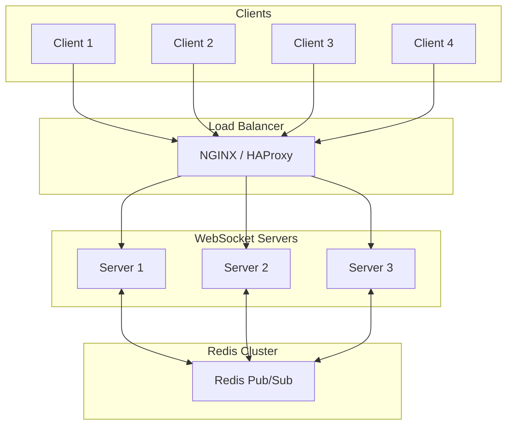

# How to Use Redis with WebSockets for Pub/Sub

Author: [nawazdhandala](https://github.com/nawazdhandala)

Tags: Redis, WebSockets, Pub/Sub, Real-time, Scaling

Description: Learn how to scale WebSocket applications using Redis pub/sub for message broadcasting across multiple server instances.

---

When you run a single WebSocket server, broadcasting messages is straightforward - all connected clients live in the same process memory. But as soon as you need to scale horizontally, things get tricky. A client connected to Server A cannot receive messages emitted from Server B unless you have a message broker in between. That is where Redis pub/sub comes in.

Redis pub/sub provides a lightweight, in-memory message broker that lets multiple WebSocket servers communicate with each other. When one server needs to broadcast a message, it publishes to a Redis channel. All other servers subscribe to that channel and forward the message to their connected clients.

## Why Redis for WebSocket Scaling?

| Approach | Pros | Cons |
|----------|------|------|
| Single server | Simple, no coordination needed | Cannot scale horizontally |
| Shared database polling | Easy to implement | High latency, database load |
| Redis pub/sub | Low latency, simple setup | Messages not persisted |
| Message queue (RabbitMQ, Kafka) | Durable, feature-rich | More complex setup |

For most real-time applications, Redis pub/sub hits the sweet spot - it is fast, simple to set up, and handles the ephemeral nature of WebSocket messages well. If you need message durability, look at Redis Streams instead.

## Redis Pub/Sub Basics

Before diving into WebSocket integration, let us understand how Redis pub/sub works.

```bash
npm install redis
```

### Publisher

```javascript
const { createClient } = require('redis');

async function publishMessages() {
  // Create a Redis client for publishing
  const publisher = createClient({
    url: process.env.REDIS_URL || 'redis://localhost:6379'
  });

  await publisher.connect();

  // Publish a message to the 'notifications' channel
  // All subscribers to this channel will receive this message
  await publisher.publish('notifications', JSON.stringify({
    type: 'alert',
    message: 'Server deployment complete',
    timestamp: Date.now()
  }));

  console.log('Message published');
  await publisher.quit();
}

publishMessages();
```

### Subscriber

```javascript
const { createClient } = require('redis');

async function subscribeToMessages() {
  // Create a dedicated client for subscribing
  // A client in subscribe mode cannot run other commands
  const subscriber = createClient({
    url: process.env.REDIS_URL || 'redis://localhost:6379'
  });

  await subscriber.connect();

  // Subscribe to the 'notifications' channel
  // The callback fires for every message published to this channel
  await subscriber.subscribe('notifications', (message) => {
    const data = JSON.parse(message);
    console.log('Received:', data);
  });

  console.log('Subscribed to notifications channel');
}

subscribeToMessages();
```

## Integrating Redis Pub/Sub with Socket.io

Socket.io has an official Redis adapter that handles all the pub/sub wiring for you. When you emit a message, the adapter automatically publishes it to Redis. All Socket.io servers subscribed to Redis receive the message and forward it to their connected clients.

```bash
npm install socket.io @socket.io/redis-adapter redis
```

### Server Setup

```javascript
const express = require('express');
const { createServer } = require('http');
const { Server } = require('socket.io');
const { createAdapter } = require('@socket.io/redis-adapter');
const { createClient } = require('redis');

async function createSocketServer() {
  const app = express();
  const httpServer = createServer(app);

  const io = new Server(httpServer, {
    cors: {
      origin: process.env.ALLOWED_ORIGINS?.split(',') || ['http://localhost:3000'],
      methods: ['GET', 'POST']
    }
  });

  // Create two Redis clients - pub/sub requires separate clients
  // because a subscribing client cannot publish
  const pubClient = createClient({ url: process.env.REDIS_URL });
  const subClient = pubClient.duplicate();

  // Connect both clients before attaching the adapter
  await Promise.all([pubClient.connect(), subClient.connect()]);

  // Attach the Redis adapter
  // Now all io.emit() calls are broadcast through Redis
  io.adapter(createAdapter(pubClient, subClient));

  // Handle connections
  io.on('connection', (socket) => {
    console.log(`Client connected: ${socket.id}`);

    // Join a room - rooms work across servers with Redis adapter
    socket.on('join-room', (roomId) => {
      socket.join(roomId);
      console.log(`${socket.id} joined room ${roomId}`);
    });

    // Broadcast to a room - reaches all clients in the room
    // even if they are connected to different servers
    socket.on('room-message', ({ roomId, message }) => {
      io.to(roomId).emit('message', {
        from: socket.id,
        message,
        timestamp: Date.now()
      });
    });

    socket.on('disconnect', () => {
      console.log(`Client disconnected: ${socket.id}`);
    });
  });

  const PORT = process.env.PORT || 3000;
  httpServer.listen(PORT, () => {
    console.log(`Socket.io server running on port ${PORT}`);
  });

  return { io, httpServer };
}

createSocketServer();
```

## Custom Pub/Sub Without Socket.io Adapter

Sometimes you need more control over message routing, or you are using a WebSocket library other than Socket.io. Here is how to implement pub/sub manually with the ws library.

```bash
npm install ws redis
```

```javascript
const WebSocket = require('ws');
const { createClient } = require('redis');
const http = require('http');

async function createCustomPubSubServer() {
  const server = http.createServer();
  const wss = new WebSocket.Server({ server });

  // Map to track which channels each client has subscribed to
  const clientSubscriptions = new Map();

  // Redis clients
  const publisher = createClient({ url: process.env.REDIS_URL });
  const subscriber = createClient({ url: process.env.REDIS_URL });

  await Promise.all([publisher.connect(), subscriber.connect()]);

  // Track all active channels across all clients
  const activeChannels = new Set();

  // Subscribe to a Redis channel and broadcast to WebSocket clients
  async function subscribeToChannel(channel) {
    if (activeChannels.has(channel)) return;

    activeChannels.add(channel);
    await subscriber.subscribe(channel, (message) => {
      // Find all clients subscribed to this channel
      wss.clients.forEach((client) => {
        if (client.readyState === WebSocket.OPEN) {
          const subs = clientSubscriptions.get(client) || new Set();
          if (subs.has(channel)) {
            client.send(JSON.stringify({
              channel,
              data: JSON.parse(message)
            }));
          }
        }
      });
    });
  }

  wss.on('connection', (ws) => {
    clientSubscriptions.set(ws, new Set());

    ws.on('message', async (raw) => {
      const msg = JSON.parse(raw);

      switch (msg.type) {
        case 'subscribe':
          // Client wants to subscribe to a channel
          const subs = clientSubscriptions.get(ws);
          subs.add(msg.channel);
          await subscribeToChannel(msg.channel);
          ws.send(JSON.stringify({ type: 'subscribed', channel: msg.channel }));
          break;

        case 'unsubscribe':
          // Client wants to unsubscribe from a channel
          clientSubscriptions.get(ws)?.delete(msg.channel);
          ws.send(JSON.stringify({ type: 'unsubscribed', channel: msg.channel }));
          break;

        case 'publish':
          // Client wants to publish a message to a channel
          await publisher.publish(msg.channel, JSON.stringify(msg.data));
          break;
      }
    });

    ws.on('close', () => {
      clientSubscriptions.delete(ws);
    });
  });

  const PORT = process.env.PORT || 3000;
  server.listen(PORT, () => {
    console.log(`WebSocket server running on port ${PORT}`);
  });
}

createCustomPubSubServer();
```

## Horizontal Scaling Architecture

Here is how the scaled architecture looks with Redis pub/sub.



## Connection Management

When scaling WebSocket servers, connection management becomes critical. Here is a pattern for tracking connections across servers using Redis.

```javascript
const { createClient } = require('redis');

class ConnectionManager {
  constructor(redisUrl, serverId) {
    this.redis = createClient({ url: redisUrl });
    this.serverId = serverId;
    this.TTL = 120; // Seconds before connection is considered stale
  }

  async connect() {
    await this.redis.connect();
  }

  // Register a connection when a client connects
  async registerConnection(userId, socketId) {
    const key = `connections:${userId}`;
    const value = JSON.stringify({
      serverId: this.serverId,
      socketId,
      connectedAt: Date.now()
    });

    // Store connection info with TTL
    // Use HSET for multiple connections per user (multiple tabs/devices)
    await this.redis.hSet(key, socketId, value);
    await this.redis.expire(key, this.TTL);
  }

  // Remove a connection when a client disconnects
  async removeConnection(userId, socketId) {
    const key = `connections:${userId}`;
    await this.redis.hDel(key, socketId);
  }

  // Check if a user has any active connections
  async isUserOnline(userId) {
    const key = `connections:${userId}`;
    const count = await this.redis.hLen(key);
    return count > 0;
  }

  // Get all connections for a user
  async getUserConnections(userId) {
    const key = `connections:${userId}`;
    const connections = await this.redis.hGetAll(key);
    return Object.values(connections).map(c => JSON.parse(c));
  }

  // Heartbeat to keep connection alive
  async heartbeat(userId) {
    const key = `connections:${userId}`;
    await this.redis.expire(key, this.TTL);
  }

  // Clean up all connections for this server (on shutdown)
  async cleanupServer() {
    // In production, use SCAN instead of KEYS for large datasets
    const keys = await this.redis.keys('connections:*');
    for (const key of keys) {
      const connections = await this.redis.hGetAll(key);
      for (const [socketId, value] of Object.entries(connections)) {
        const conn = JSON.parse(value);
        if (conn.serverId === this.serverId) {
          await this.redis.hDel(key, socketId);
        }
      }
    }
  }
}

// Usage with Socket.io
const connManager = new ConnectionManager(
  process.env.REDIS_URL,
  process.env.SERVER_ID || `server-${process.pid}`
);

io.on('connection', async (socket) => {
  const userId = socket.user?.id || socket.id;
  await connManager.registerConnection(userId, socket.id);

  // Heartbeat every 30 seconds
  const heartbeatInterval = setInterval(() => {
    connManager.heartbeat(userId);
  }, 30000);

  socket.on('disconnect', async () => {
    clearInterval(heartbeatInterval);
    await connManager.removeConnection(userId, socket.id);
  });
});

// Clean up on server shutdown
process.on('SIGTERM', async () => {
  await connManager.cleanupServer();
  process.exit(0);
});
```

## Load Balancer Configuration

For WebSocket scaling, you need sticky sessions so that the initial HTTP request and the WebSocket upgrade both reach the same server.

### NGINX Configuration

```nginx
upstream websocket_servers {
    ip_hash;  # Sticky sessions based on client IP
    server ws-server-1:3000;
    server ws-server-2:3000;
    server ws-server-3:3000;
}

server {
    listen 80;

    location /socket.io/ {
        proxy_pass http://websocket_servers;
        proxy_http_version 1.1;
        proxy_set_header Upgrade $http_upgrade;
        proxy_set_header Connection "upgrade";
        proxy_set_header Host $host;
        proxy_set_header X-Real-IP $remote_addr;
        proxy_read_timeout 86400;  # 24 hours for long-lived connections
    }
}
```

## Summary

| Component | Purpose |
|-----------|---------|
| Redis pub/sub | Message broker between server instances |
| Socket.io adapter | Automatic pub/sub integration |
| Connection manager | Track connections across servers |
| Sticky sessions | Route client requests to same server |

Redis pub/sub solves the fundamental problem of WebSocket scaling - coordinating messages across multiple server instances. With the Socket.io Redis adapter, you get this functionality with minimal code changes. For custom implementations, the pattern is straightforward: publish messages to Redis channels and subscribe to receive them across all server instances.

The key takeaway is that Redis pub/sub is perfect for ephemeral, real-time messages. If you need message durability or delivery guarantees, consider Redis Streams or a dedicated message queue like RabbitMQ.
