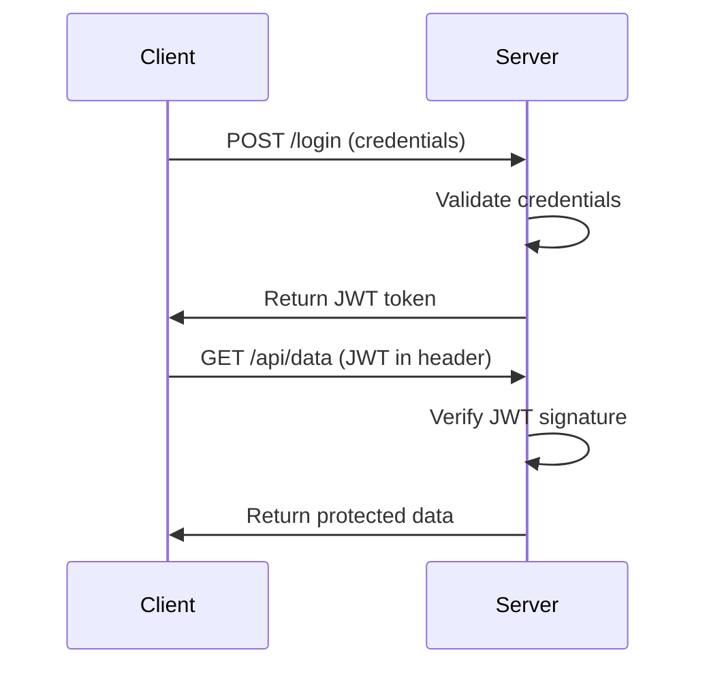

# How to Handle Authentication in REST APIs

Author: [nawazdhandala](https://github.com/nawazdhandala)

Tags: REST API, Authentication, JWT, OAuth, Security

Description: A comprehensive guide to REST API authentication methods including JWT, OAuth2, API keys, and session-based auth with best practices.

---

If you're building a REST API, authentication isn't optional - it's the first line of defense for your data and users. Get it wrong, and you're handing the keys to your kingdom to anyone who asks. In this guide, we'll walk through the most common authentication methods, when to use each one, and how to implement them properly.

## Why Authentication Matters

REST APIs are stateless by design. Every request needs to prove who's making it. Without proper authentication, you can't:

- Control who accesses your resources
- Track API usage per user
- Enforce rate limits
- Audit access patterns

Let's dive into the main authentication methods you'll encounter.

## 1. JWT (JSON Web Tokens)

JWTs are probably the most popular authentication method for modern APIs. They're self-contained tokens that carry user information and are cryptographically signed.

### How JWT Works



### Implementation Example (Node.js/Express)

```javascript
// Install: npm install jsonwebtoken express

const express = require('express');
const jwt = require('jsonwebtoken');

const app = express();
app.use(express.json());

// Secret key - in production, use environment variables
const JWT_SECRET = process.env.JWT_SECRET || 'your-secret-key';

// Login endpoint - generates a JWT
app.post('/login', (req, res) => {
  const { username, password } = req.body;

  // Validate credentials against your database
  // This is simplified - always hash passwords in production
  if (username === 'admin' && password === 'password123') {
    // Create token with user data and expiration
    const token = jwt.sign(
      { userId: 1, username: username, role: 'admin' },
      JWT_SECRET,
      { expiresIn: '1h' } // Token expires in 1 hour
    );

    return res.json({ token });
  }

  res.status(401).json({ error: 'Invalid credentials' });
});

// Middleware to verify JWT on protected routes
function authenticateToken(req, res, next) {
  // Get token from Authorization header
  const authHeader = req.headers['authorization'];
  const token = authHeader && authHeader.split(' ')[1]; // "Bearer TOKEN"

  if (!token) {
    return res.status(401).json({ error: 'No token provided' });
  }

  // Verify the token
  jwt.verify(token, JWT_SECRET, (err, decoded) => {
    if (err) {
      return res.status(403).json({ error: 'Invalid or expired token' });
    }

    // Attach user info to request object
    req.user = decoded;
    next();
  });
}

// Protected route example
app.get('/api/profile', authenticateToken, (req, res) => {
  // req.user contains the decoded JWT payload
  res.json({
    message: 'Protected data',
    user: req.user
  });
});

app.listen(3000, () => console.log('Server running on port 3000'));
```

## 2. OAuth 2.0

OAuth 2.0 is the industry standard for authorization. It's what powers "Login with Google" and similar flows. You're not storing passwords - you're delegating authentication to a trusted provider.

### OAuth 2.0 Flow Example (Using Passport.js)

```javascript
// Install: npm install passport passport-google-oauth20 express-session

const express = require('express');
const passport = require('passport');
const GoogleStrategy = require('passport-google-oauth20').Strategy;
const session = require('express-session');

const app = express();

// Configure session middleware
app.use(session({
  secret: 'session-secret',
  resave: false,
  saveUninitialized: false
}));

app.use(passport.initialize());
app.use(passport.session());

// Configure Google OAuth strategy
passport.use(new GoogleStrategy({
    clientID: process.env.GOOGLE_CLIENT_ID,
    clientSecret: process.env.GOOGLE_CLIENT_SECRET,
    callbackURL: '/auth/google/callback'
  },
  function(accessToken, refreshToken, profile, done) {
    // Find or create user in your database
    // profile contains Google user info (id, displayName, emails, etc.)
    const user = {
      googleId: profile.id,
      name: profile.displayName,
      email: profile.emails[0].value
    };
    return done(null, user);
  }
));

// Serialize user for session storage
passport.serializeUser((user, done) => done(null, user));
passport.deserializeUser((user, done) => done(null, user));

// Route to start OAuth flow
app.get('/auth/google',
  passport.authenticate('google', { scope: ['profile', 'email'] })
);

// OAuth callback route
app.get('/auth/google/callback',
  passport.authenticate('google', { failureRedirect: '/login' }),
  (req, res) => {
    // Successful authentication
    res.redirect('/dashboard');
  }
);

// Protected route - check if user is authenticated
app.get('/dashboard', (req, res) => {
  if (!req.isAuthenticated()) {
    return res.redirect('/login');
  }
  res.json({ user: req.user });
});
```

## 3. API Keys

API keys are simple and work well for server-to-server communication. They're just a unique string that identifies the caller.

```javascript
// Simple API key middleware
function validateApiKey(req, res, next) {
  const apiKey = req.headers['x-api-key'];

  if (!apiKey) {
    return res.status(401).json({ error: 'API key required' });
  }

  // Check if the API key exists in your database
  // In production, store hashed keys and compare hashes
  const validKeys = {
    'key-abc123': { clientName: 'Mobile App', rateLimit: 1000 },
    'key-xyz789': { clientName: 'Partner Service', rateLimit: 5000 }
  };

  const client = validKeys[apiKey];
  if (!client) {
    return res.status(403).json({ error: 'Invalid API key' });
  }

  // Attach client info to request
  req.client = client;
  next();
}

// Use the middleware
app.get('/api/data', validateApiKey, (req, res) => {
  res.json({
    message: 'Success',
    client: req.client.clientName
  });
});
```

## 4. Session-Based Authentication

The classic approach. Server creates a session after login and stores it (in memory, Redis, or a database). The client receives a session ID in a cookie.

```javascript
// Install: npm install express-session connect-redis redis

const session = require('express-session');
const RedisStore = require('connect-redis').default;
const { createClient } = require('redis');

// Create Redis client for session storage
const redisClient = createClient({ url: 'redis://localhost:6379' });
redisClient.connect();

app.use(session({
  store: new RedisStore({ client: redisClient }),
  secret: 'your-session-secret',
  resave: false,
  saveUninitialized: false,
  cookie: {
    secure: true,      // Only send over HTTPS
    httpOnly: true,    // Prevent JavaScript access
    maxAge: 3600000,   // 1 hour expiration
    sameSite: 'strict' // CSRF protection
  }
}));

// Login endpoint
app.post('/login', (req, res) => {
  const { username, password } = req.body;

  // Validate credentials
  if (validateUser(username, password)) {
    // Store user info in session
    req.session.userId = getUserId(username);
    req.session.authenticated = true;

    res.json({ message: 'Logged in successfully' });
  } else {
    res.status(401).json({ error: 'Invalid credentials' });
  }
});

// Check if session is authenticated
function requireAuth(req, res, next) {
  if (req.session && req.session.authenticated) {
    next();
  } else {
    res.status(401).json({ error: 'Please log in' });
  }
}
```

## Comparing Authentication Methods

| Method | Best For | Stateless | Complexity | Scalability |
|--------|----------|-----------|------------|-------------|
| JWT | SPAs, Mobile Apps | Yes | Medium | High |
| OAuth 2.0 | Third-party login, delegated access | Depends | High | High |
| API Keys | Server-to-server, public APIs | Yes | Low | High |
| Sessions | Traditional web apps | No | Low | Medium |

## Security Best Practices

1. **Always use HTTPS** - Authentication tokens over HTTP are asking for trouble.

2. **Store secrets properly** - Use environment variables, never hardcode secrets in your code.

3. **Set token expiration** - JWTs should expire. Use refresh tokens for long-lived sessions.

4. **Hash API keys** - Store hashed versions of API keys in your database, not plaintext.

5. **Implement rate limiting** - Protect against brute force attacks.

```javascript
// Simple rate limiting example
const rateLimit = require('express-rate-limit');

const loginLimiter = rateLimit({
  windowMs: 15 * 60 * 1000, // 15 minutes
  max: 5, // 5 attempts per window
  message: { error: 'Too many login attempts, try again later' }
});

app.post('/login', loginLimiter, loginHandler);
```

6. **Validate and sanitize inputs** - Never trust user input.

7. **Use secure cookie settings** - Set `httpOnly`, `secure`, and `sameSite` flags.

## Choosing the Right Method

- Building a single-page app or mobile app? Go with **JWT**.
- Need "Login with Google/Facebook"? Use **OAuth 2.0**.
- Building an API for developers to consume? **API keys** are your friend.
- Traditional server-rendered web app? **Sessions** work great.

Sometimes you'll combine methods. For example, OAuth for user login that generates a JWT for API access.

## Wrapping Up

Authentication is foundational to API security. The method you choose depends on your use case, but the principles stay the same: validate every request, protect your secrets, and never trust the client blindly.

Start simple, add complexity only when needed, and always keep security at the forefront of your design decisions.
