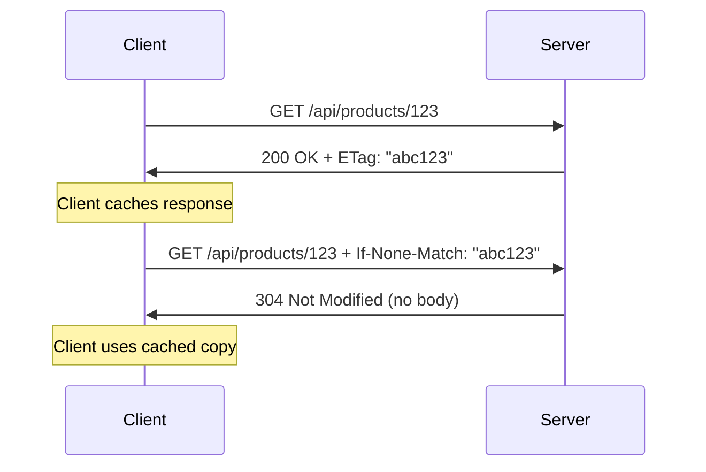

# How to Handle Caching in REST APIs

Author: [nawazdhandala](https://github.com/nawazdhandala)

Tags: REST API, Caching, HTTP, ETags, Performance

Description: Learn REST API caching strategies including HTTP cache headers, ETags, Cache-Control, and server-side caching patterns for optimal performance.

---

Caching is one of those things that can make or break your API's performance. Get it right, and your server handles 10x the traffic without breaking a sweat. Get it wrong, and users see stale data or your origin server melts under load.

The good news is that HTTP has built-in caching mechanisms that work well once you understand them. This guide covers the practical side of REST API caching - from the headers you need to set, to server-side strategies that actually work in production.

## HTTP Cache Headers

HTTP caching relies on response headers that tell clients and intermediaries how to cache responses. Here are the headers you will work with most often:

| Header | Purpose | Example |
|--------|---------|---------|
| Cache-Control | Primary caching directive | `max-age=3600, public` |
| ETag | Resource version identifier | `"abc123"` or `W/"abc123"` |
| Last-Modified | Timestamp of last change | `Wed, 01 Feb 2026 12:00:00 GMT` |
| Expires | Legacy expiration time | `Wed, 01 Feb 2026 13:00:00 GMT` |
| Vary | Cache key variations | `Accept-Encoding, Authorization` |

## Cache-Control Directives

The `Cache-Control` header is where you define caching behavior. Here is what each directive means:

```
Cache-Control: public, max-age=3600, s-maxage=7200, must-revalidate
```

| Directive | What it does |
|-----------|--------------|
| `public` | Any cache can store this response |
| `private` | Only the browser can cache this - not CDNs |
| `max-age=N` | Cache is fresh for N seconds |
| `s-maxage=N` | Override max-age for shared caches (CDNs) |
| `no-cache` | Must revalidate before using cached copy |
| `no-store` | Never cache this response |
| `must-revalidate` | Once stale, must revalidate before use |
| `immutable` | Content will never change - cache forever |

## Implementing Cache Headers in Express

Here is a practical Express middleware that sets appropriate cache headers based on route patterns:

```javascript
// cacheMiddleware.js
// Middleware that sets Cache-Control headers based on route type

const cacheMiddleware = (options = {}) => {
  return (req, res, next) => {
    // Skip caching for non-GET requests - only safe methods should be cached
    if (req.method !== 'GET') {
      res.set('Cache-Control', 'no-store');
      return next();
    }

    // Default cache settings - can be overridden per route
    const defaults = {
      public: true,
      maxAge: 300,        // 5 minutes for browsers
      sMaxAge: 600,       // 10 minutes for CDNs
      mustRevalidate: true
    };

    const settings = { ...defaults, ...options };

    // Build the Cache-Control header value
    const directives = [];

    directives.push(settings.public ? 'public' : 'private');
    directives.push(`max-age=${settings.maxAge}`);

    if (settings.sMaxAge && settings.public) {
      directives.push(`s-maxage=${settings.sMaxAge}`);
    }

    if (settings.mustRevalidate) {
      directives.push('must-revalidate');
    }

    res.set('Cache-Control', directives.join(', '));
    next();
  };
};

module.exports = cacheMiddleware;
```

Using the middleware in your routes:

```javascript
// routes/products.js
const express = require('express');
const router = express.Router();
const cacheMiddleware = require('./cacheMiddleware');

// Product list changes occasionally - cache for 5 minutes
router.get('/products', cacheMiddleware({ maxAge: 300, sMaxAge: 600 }), (req, res) => {
  // Return product list
});

// Individual product - cache longer, but allow CDN to serve stale while revalidating
router.get('/products/:id', cacheMiddleware({ maxAge: 600, sMaxAge: 3600 }), (req, res) => {
  // Return single product
});

// User-specific data - private cache only, shorter duration
router.get('/cart', cacheMiddleware({ public: false, maxAge: 60 }), (req, res) => {
  // Return user's cart
});
```

## ETags and Conditional Requests

ETags let clients ask "has this resource changed?" instead of downloading the whole thing again. This saves bandwidth and reduces server load.

```javascript
// etagMiddleware.js
const crypto = require('crypto');

// Generate ETag from response body
function generateETag(body) {
  return crypto
    .createHash('md5')
    .update(JSON.stringify(body))
    .digest('hex');
}

// Middleware that handles ETag generation and conditional requests
const etagMiddleware = () => {
  return (req, res, next) => {
    // Store the original json method
    const originalJson = res.json.bind(res);

    // Override res.json to add ETag handling
    res.json = (body) => {
      const etag = `"${generateETag(body)}"`;
      res.set('ETag', etag);

      // Check if client sent If-None-Match header
      const clientETag = req.get('If-None-Match');

      if (clientETag === etag) {
        // Resource hasn't changed - return 304 Not Modified
        return res.status(304).end();
      }

      // Resource changed or no ETag sent - return full response
      return originalJson(body);
    };

    next();
  };
};

module.exports = etagMiddleware;
```

How conditional requests work:



## Server-Side Caching with Redis

Client-side caching is great, but you also want to cache on the server to avoid hitting your database repeatedly.

```javascript
// redisCache.js
const Redis = require('ioredis');

const redis = new Redis({
  host: process.env.REDIS_HOST || 'localhost',
  port: process.env.REDIS_PORT || 6379,
});

// Cache wrapper that handles serialization and TTL
const cache = {
  // Get value from cache, returns null if not found or expired
  async get(key) {
    const data = await redis.get(key);
    if (!data) return null;

    try {
      return JSON.parse(data);
    } catch {
      return data;
    }
  },

  // Set value in cache with TTL in seconds
  async set(key, value, ttlSeconds = 300) {
    const serialized = typeof value === 'string' ? value : JSON.stringify(value);
    await redis.setex(key, ttlSeconds, serialized);
  },

  // Delete a specific key
  async del(key) {
    await redis.del(key);
  },

  // Delete all keys matching a pattern - useful for invalidation
  async invalidatePattern(pattern) {
    const keys = await redis.keys(pattern);
    if (keys.length > 0) {
      await redis.del(...keys);
    }
  }
};

module.exports = cache;
```

Using the cache in your service layer:

```javascript
// productService.js
const cache = require('./redisCache');
const db = require('./database');

const ProductService = {
  async getProduct(id) {
    const cacheKey = `product:${id}`;

    // Try cache first
    let product = await cache.get(cacheKey);

    if (product) {
      return product;  // Cache hit - return immediately
    }

    // Cache miss - fetch from database
    product = await db.query('SELECT * FROM products WHERE id = $1', [id]);

    if (product) {
      // Store in cache for 10 minutes
      await cache.set(cacheKey, product, 600);
    }

    return product;
  },

  async updateProduct(id, data) {
    // Update in database
    const product = await db.query(
      'UPDATE products SET name = $2, price = $3 WHERE id = $1 RETURNING *',
      [id, data.name, data.price]
    );

    // Invalidate the cache for this product
    await cache.del(`product:${id}`);

    // Also invalidate the product list cache
    await cache.del('products:list');

    return product;
  }
};

module.exports = ProductService;
```

## Cache Invalidation Strategies

Cache invalidation is famously hard. Here are three approaches that work in practice:

### 1. Time-Based Expiration

The simplest approach - let caches expire naturally. Works well when eventual consistency is acceptable.

```javascript
// Set TTL when caching
await cache.set('products:list', products, 300);  // Expires in 5 minutes
```

### 2. Event-Based Invalidation

Invalidate caches when the underlying data changes. More complex but ensures fresher data.

```javascript
// When a product is updated, invalidate related caches
async function onProductUpdated(productId) {
  await Promise.all([
    cache.del(`product:${productId}`),
    cache.del('products:list'),
    cache.invalidatePattern(`products:category:*`),  // Invalidate category listings
  ]);
}
```

### 3. Versioned Cache Keys

Include a version number in cache keys. Bump the version to invalidate everything at once.

```javascript
// Store version in Redis or config
const CACHE_VERSION = 'v2';

function getCacheKey(resource, id) {
  return `${CACHE_VERSION}:${resource}:${id}`;
}

// All old cache entries become orphaned when version changes
// They will expire naturally via TTL
```

## CDN Caching Configuration

When using a CDN like Cloudflare or Fastly, your Cache-Control headers control their behavior. Here are some patterns:

```javascript
// For static API responses that rarely change
res.set('Cache-Control', 'public, max-age=60, s-maxage=86400');
// Browser caches for 1 minute, CDN caches for 24 hours

// For personalized responses - bypass CDN
res.set('Cache-Control', 'private, max-age=0, no-store');
res.set('Vary', 'Authorization');  // Different cache per user

// For responses that can be stale briefly while fetching fresh
res.set('Cache-Control', 'public, max-age=60, stale-while-revalidate=300');
// CDN serves stale for up to 5 minutes while fetching new version
```

## What to Cache and What Not To

Not everything should be cached. Here is a quick reference:

| Resource Type | Cache Strategy |
|---------------|----------------|
| Static reference data | Long TTL (hours/days), immutable if versioned |
| Product listings | Medium TTL (5-15 minutes), invalidate on changes |
| Search results | Short TTL (1-5 minutes), vary by query params |
| User-specific data | Private cache only, short TTL or no-cache |
| Auth tokens | Never cache - use no-store |
| Real-time data | no-cache or no-store |

## Wrapping Up

Effective API caching comes down to understanding your data access patterns and choosing the right strategy for each resource type. Start with HTTP cache headers since they work across browsers, CDNs, and proxies with no extra infrastructure. Add server-side caching when you need to reduce database load.

The key is to start simple. Set reasonable Cache-Control headers, add ETags for bandwidth savings, and only introduce Redis or other caching layers when you have measured the need. Over-caching leads to stale data bugs that are hard to debug. Under-caching is easier to fix later.
