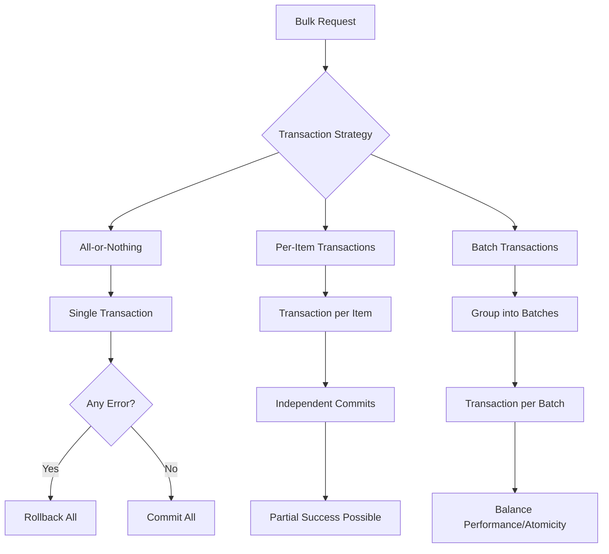
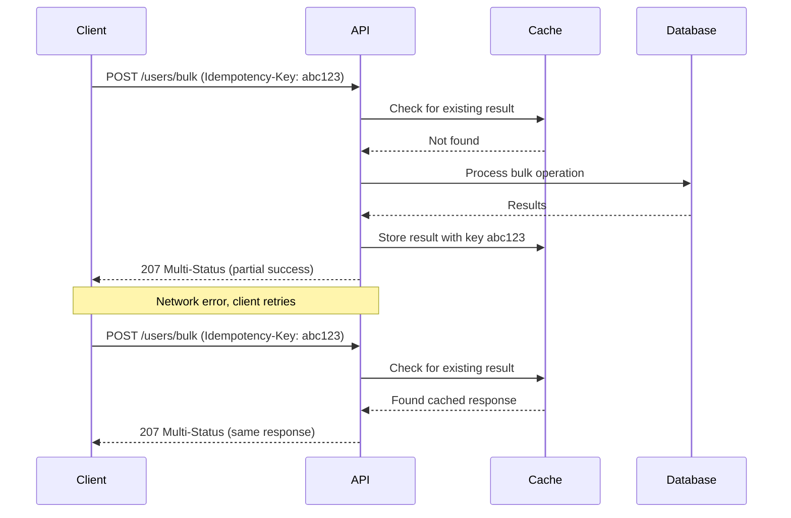
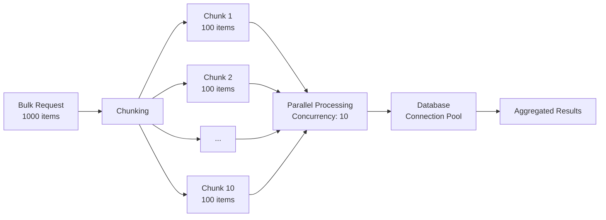

# How to Handle Partial Success in Bulk API Operations

Author: [nawazdhandala](https://github.com/nawazdhandala)

Tags: REST API, Bulk Operations, Error Handling, API Design, HTTP Status Codes

Description: Learn how to design and implement bulk API endpoints that handle partial success gracefully. This guide covers response formats, HTTP status codes, error reporting strategies, and client-side handling patterns for robust bulk operations.

---

Bulk APIs let clients create, update, or delete multiple resources in a single request. They reduce network overhead and improve performance when processing large datasets. But what happens when some operations succeed and others fail?

This is the partial success problem. Traditional REST semantics give us 2xx for success and 4xx/5xx for failure. Bulk operations need something more nuanced because the reality is messier: maybe 47 out of 50 items processed correctly, but 3 had validation errors.

This guide covers practical approaches to handling partial success in bulk APIs, from choosing the right HTTP status code to designing response formats that clients can actually work with.

## The Partial Success Problem

Consider a bulk create endpoint that accepts an array of items:

```json
POST /api/v1/users/bulk
Content-Type: application/json

[
  { "email": "alice@example.com", "name": "Alice" },
  { "email": "invalid-email", "name": "Bob" },
  { "email": "carol@example.com", "name": "Carol" }
]
```

Alice and Carol have valid data. Bob has an invalid email. What should the API return?

Option A: Fail the entire batch (all-or-nothing)
Option B: Process what you can and report partial success
Option C: Return early on first error

Each approach has trade-offs. All-or-nothing is simpler but forces clients to fix one error at a time. Fail-fast reduces wasted processing but has the same problem. Partial success is more complex but gives clients the most useful information.

## HTTP Status Codes for Bulk Operations

Choosing the right status code communicates the outcome clearly to clients.

| Scenario | Status Code | When to Use |
|----------|-------------|-------------|
| All items succeeded | 200 OK or 201 Created | Every operation completed successfully |
| All items failed | 400 Bad Request | Every operation failed validation |
| Mixed results | 207 Multi-Status | Some succeeded, some failed |
| Server error | 500 Internal Server Error | Processing failed unexpectedly |
| Batch too large | 413 Payload Too Large | Request exceeds size limits |

The 207 Multi-Status code (from WebDAV, RFC 4918) is the standard choice for partial success. It signals that the response body contains individual status codes for each operation.

## Response Format Design

A well-designed response format tells clients exactly what happened to each item. Here is a response structure that works well in practice:

```json
{
  "status": "partial_success",
  "summary": {
    "total": 3,
    "succeeded": 2,
    "failed": 1
  },
  "results": [
    {
      "index": 0,
      "status": "success",
      "code": 201,
      "data": {
        "id": "usr_abc123",
        "email": "alice@example.com",
        "name": "Alice"
      }
    },
    {
      "index": 1,
      "status": "error",
      "code": 400,
      "error": {
        "type": "validation_error",
        "message": "Invalid email format",
        "field": "email"
      }
    },
    {
      "index": 2,
      "status": "success",
      "code": 201,
      "data": {
        "id": "usr_def456",
        "email": "carol@example.com",
        "name": "Carol"
      }
    }
  ]
}
```

Key design decisions in this format:

1. **Index field**: Matches results to input items by position
2. **Individual status codes**: Each operation has its own HTTP-like status
3. **Summary section**: Quick overview without parsing all results
4. **Consistent structure**: Both success and error cases have the same shape

## Implementation in Node.js/Express

Here is a complete implementation of a bulk create endpoint with partial success handling.

The bulk handler processes each item independently and collects results:

```javascript
// bulkUserController.js
// Handles bulk user creation with partial success support

const { validateUser, createUser } = require('./userService');

async function bulkCreateUsers(req, res) {
  const items = req.body;

  // Validate the request is an array with reasonable size
  if (!Array.isArray(items)) {
    return res.status(400).json({
      error: 'Request body must be an array'
    });
  }

  if (items.length > 100) {
    return res.status(413).json({
      error: 'Batch size exceeds limit of 100 items'
    });
  }

  // Process each item and collect results
  const results = await Promise.all(
    items.map((item, index) => processItem(item, index))
  );

  // Calculate summary statistics
  const succeeded = results.filter(r => r.status === 'success').length;
  const failed = results.filter(r => r.status === 'error').length;

  // Choose appropriate HTTP status code based on outcomes
  let httpStatus;
  let overallStatus;

  if (failed === 0) {
    httpStatus = 201;
    overallStatus = 'success';
  } else if (succeeded === 0) {
    httpStatus = 400;
    overallStatus = 'failure';
  } else {
    httpStatus = 207;
    overallStatus = 'partial_success';
  }

  return res.status(httpStatus).json({
    status: overallStatus,
    summary: {
      total: items.length,
      succeeded,
      failed
    },
    results
  });
}
```

The item processor handles validation and creation for each individual item:

```javascript
// processItem.js
// Processes a single item in the bulk operation

async function processItem(item, index) {
  // First validate the input data
  const validation = validateUser(item);

  if (!validation.valid) {
    return {
      index,
      status: 'error',
      code: 400,
      error: {
        type: 'validation_error',
        message: validation.message,
        field: validation.field
      }
    };
  }

  try {
    // Attempt to create the resource
    const created = await createUser(item);

    return {
      index,
      status: 'success',
      code: 201,
      data: created
    };
  } catch (err) {
    // Handle database or service errors
    if (err.code === 'DUPLICATE_EMAIL') {
      return {
        index,
        status: 'error',
        code: 409,
        error: {
          type: 'conflict',
          message: 'Email already exists',
          field: 'email'
        }
      };
    }

    // Unexpected errors should be logged and reported generically
    console.error(`Bulk create error at index ${index}:`, err);

    return {
      index,
      status: 'error',
      code: 500,
      error: {
        type: 'internal_error',
        message: 'Failed to create user'
      }
    };
  }
}

module.exports = { processItem };
```

## Implementation in Python/FastAPI

Here is the same pattern implemented in FastAPI with Pydantic for validation.

Define the request and response models first:

```python
# models.py
# Pydantic models for bulk API request and response

from pydantic import BaseModel, EmailStr, Field
from typing import List, Optional, Union, Literal
from enum import Enum

class UserInput(BaseModel):
    """Input model for creating a single user"""
    email: EmailStr
    name: str = Field(min_length=1, max_length=100)

class SuccessResult(BaseModel):
    """Result model for successful operations"""
    index: int
    status: Literal["success"] = "success"
    code: int = 201
    data: dict

class ErrorDetail(BaseModel):
    """Structured error information"""
    type: str
    message: str
    field: Optional[str] = None

class ErrorResult(BaseModel):
    """Result model for failed operations"""
    index: int
    status: Literal["error"] = "error"
    code: int
    error: ErrorDetail

class BulkSummary(BaseModel):
    """Summary statistics for bulk operation"""
    total: int
    succeeded: int
    failed: int

class BulkResponse(BaseModel):
    """Complete response for bulk operations"""
    status: Literal["success", "partial_success", "failure"]
    summary: BulkSummary
    results: List[Union[SuccessResult, ErrorResult]]
```

The endpoint processes items concurrently using asyncio:

```python
# routes.py
# FastAPI bulk endpoint with partial success handling

import asyncio
from fastapi import APIRouter, HTTPException, status
from fastapi.responses import JSONResponse
from typing import List

from .models import UserInput, BulkResponse, BulkSummary
from .models import SuccessResult, ErrorResult, ErrorDetail
from .services import create_user, DuplicateEmailError

router = APIRouter()

# Maximum items allowed in a single bulk request
MAX_BATCH_SIZE = 100

@router.post("/users/bulk", response_model=BulkResponse)
async def bulk_create_users(items: List[UserInput]):
    """
    Create multiple users in a single request.
    Returns 207 Multi-Status for partial success.
    """
    if len(items) > MAX_BATCH_SIZE:
        raise HTTPException(
            status_code=status.HTTP_413_REQUEST_ENTITY_TOO_LARGE,
            detail=f"Batch size exceeds limit of {MAX_BATCH_SIZE} items"
        )

    # Process all items concurrently
    tasks = [
        process_single_item(item, index)
        for index, item in enumerate(items)
    ]
    results = await asyncio.gather(*tasks)

    # Calculate outcome statistics
    succeeded = sum(1 for r in results if r.status == "success")
    failed = len(results) - succeeded

    # Determine HTTP status and overall status
    if failed == 0:
        http_status = status.HTTP_201_CREATED
        overall_status = "success"
    elif succeeded == 0:
        http_status = status.HTTP_400_BAD_REQUEST
        overall_status = "failure"
    else:
        http_status = 207  # Multi-Status
        overall_status = "partial_success"

    response = BulkResponse(
        status=overall_status,
        summary=BulkSummary(
            total=len(items),
            succeeded=succeeded,
            failed=failed
        ),
        results=results
    )

    return JSONResponse(
        status_code=http_status,
        content=response.model_dump()
    )
```

Handle individual item processing with proper error catching:

```python
# services.py
# Business logic for processing individual items

from .models import SuccessResult, ErrorResult, ErrorDetail, UserInput

class DuplicateEmailError(Exception):
    """Raised when email already exists in database"""
    pass

async def process_single_item(item: UserInput, index: int):
    """
    Process a single user creation.
    Returns SuccessResult or ErrorResult based on outcome.
    """
    try:
        # Attempt to create the user in the database
        created_user = await create_user(item)

        return SuccessResult(
            index=index,
            code=201,
            data={
                "id": created_user.id,
                "email": created_user.email,
                "name": created_user.name
            }
        )

    except DuplicateEmailError:
        return ErrorResult(
            index=index,
            code=409,
            error=ErrorDetail(
                type="conflict",
                message="Email already exists",
                field="email"
            )
        )

    except Exception as e:
        # Log unexpected errors for debugging
        logger.exception(f"Bulk create error at index {index}")

        return ErrorResult(
            index=index,
            code=500,
            error=ErrorDetail(
                type="internal_error",
                message="Failed to create user"
            )
        )
```

## Transaction Strategies

When bulk operations modify a database, you need to decide on transaction boundaries.



Here is how to implement per-item transactions in Node.js with a database connection pool:

```javascript
// transactionStrategies.js
// Different transaction approaches for bulk operations

const { pool } = require('./database');

async function processWithPerItemTransactions(items) {
  // Each item gets its own transaction
  // Failures in one item do not affect others

  const results = [];

  for (let index = 0; index < items.length; index++) {
    const client = await pool.connect();

    try {
      await client.query('BEGIN');

      const created = await insertUser(client, items[index]);

      await client.query('COMMIT');

      results.push({
        index,
        status: 'success',
        code: 201,
        data: created
      });

    } catch (err) {
      await client.query('ROLLBACK');

      results.push({
        index,
        status: 'error',
        code: mapErrorToCode(err),
        error: formatError(err)
      });

    } finally {
      client.release();
    }
  }

  return results;
}

async function processWithAllOrNothing(items) {
  // Single transaction for all items
  // Any error rolls back everything

  const client = await pool.connect();
  const results = [];

  try {
    await client.query('BEGIN');

    for (let index = 0; index < items.length; index++) {
      const created = await insertUser(client, items[index]);
      results.push({
        index,
        status: 'success',
        code: 201,
        data: created
      });
    }

    await client.query('COMMIT');
    return { success: true, results };

  } catch (err) {
    await client.query('ROLLBACK');
    return {
      success: false,
      error: formatError(err),
      failedAtIndex: results.length
    };

  } finally {
    client.release();
  }
}
```

## Idempotency for Bulk Operations

Network failures during bulk operations are particularly problematic. If a client does not receive a response, did the operation succeed or fail? Idempotency keys solve this by letting clients safely retry.



Implementation with Redis for storing idempotency results:

```javascript
// idempotency.js
// Idempotency handling for bulk operations

const redis = require('./redis');

// Cache results for 24 hours
const IDEMPOTENCY_TTL = 86400;

async function withIdempotency(req, res, handler) {
  const idempotencyKey = req.headers['idempotency-key'];

  // If no idempotency key, process normally
  if (!idempotencyKey) {
    return handler(req, res);
  }

  const cacheKey = `idempotency:${idempotencyKey}`;

  // Check for existing result
  const cached = await redis.get(cacheKey);

  if (cached) {
    const { statusCode, body } = JSON.parse(cached);
    return res.status(statusCode).json(body);
  }

  // Process the request and capture the response
  const result = await handler(req, res);

  // Cache the result for future retries
  await redis.setex(
    cacheKey,
    IDEMPOTENCY_TTL,
    JSON.stringify({
      statusCode: result.statusCode,
      body: result.body
    })
  );

  return result;
}

module.exports = { withIdempotency };
```

## Client-Side Handling

Clients need to handle partial success responses appropriately. Here is a robust client implementation:

```javascript
// bulkApiClient.js
// Client library for handling bulk API responses

class BulkApiClient {
  constructor(baseUrl) {
    this.baseUrl = baseUrl;
  }

  async bulkCreate(endpoint, items, options = {}) {
    const response = await fetch(`${this.baseUrl}${endpoint}`, {
      method: 'POST',
      headers: {
        'Content-Type': 'application/json',
        ...(options.idempotencyKey && {
          'Idempotency-Key': options.idempotencyKey
        })
      },
      body: JSON.stringify(items)
    });

    const data = await response.json();

    // Handle different response scenarios
    if (response.status === 201) {
      // Complete success
      return {
        success: true,
        allSucceeded: true,
        data
      };
    }

    if (response.status === 207) {
      // Partial success - some items failed
      return {
        success: true,
        allSucceeded: false,
        data,
        failed: data.results.filter(r => r.status === 'error'),
        succeeded: data.results.filter(r => r.status === 'success')
      };
    }

    if (response.status === 400) {
      // All items failed
      return {
        success: false,
        allSucceeded: false,
        data,
        failed: data.results
      };
    }

    // Server error or other unexpected status
    throw new BulkApiError(
      `Unexpected status: ${response.status}`,
      response.status,
      data
    );
  }

  async bulkCreateWithRetry(endpoint, items, options = {}) {
    const { maxRetries = 3, retryDelay = 1000 } = options;

    // Generate idempotency key if not provided
    const idempotencyKey = options.idempotencyKey || generateUUID();

    for (let attempt = 1; attempt <= maxRetries; attempt++) {
      try {
        return await this.bulkCreate(endpoint, items, {
          ...options,
          idempotencyKey
        });

      } catch (err) {
        if (attempt === maxRetries) throw err;

        // Only retry on network or server errors
        if (err.status && err.status < 500) throw err;

        // Exponential backoff
        await sleep(retryDelay * Math.pow(2, attempt - 1));
      }
    }
  }
}

// Helper function for generating unique keys
function generateUUID() {
  return 'xxxxxxxx-xxxx-4xxx-yxxx-xxxxxxxxxxxx'.replace(/[xy]/g, c => {
    const r = Math.random() * 16 | 0;
    return (c === 'x' ? r : (r & 0x3 | 0x8)).toString(16);
  });
}

function sleep(ms) {
  return new Promise(resolve => setTimeout(resolve, ms));
}
```

Usage example showing how to handle partial success:

```javascript
// example-usage.js
// Example of handling bulk API partial success

const client = new BulkApiClient('https://api.example.com');

async function createUsers(users) {
  const result = await client.bulkCreateWithRetry('/api/v1/users/bulk', users);

  if (result.allSucceeded) {
    console.log(`Created ${result.data.summary.succeeded} users`);
    return result.data.results.map(r => r.data);
  }

  // Handle partial success
  console.log(`Created ${result.data.summary.succeeded} users`);
  console.log(`Failed to create ${result.data.summary.failed} users`);

  // Log detailed errors for failed items
  for (const failed of result.failed) {
    console.error(
      `Item ${failed.index}: ${failed.error.message}`,
      failed.error.field ? `(field: ${failed.error.field})` : ''
    );
  }

  // Return successfully created users
  return result.succeeded.map(r => r.data);
}
```

## Error Categorization

Not all errors are equal. Some are retryable, others require client changes. Categorizing errors helps clients respond appropriately:

```javascript
// errorCategories.js
// Categorize errors to help clients decide on retry strategy

const ERROR_CATEGORIES = {
  // Client must fix the input
  validation: {
    retryable: false,
    codes: [400],
    types: ['validation_error', 'invalid_format', 'missing_field']
  },

  // Client should retry with same input
  transient: {
    retryable: true,
    codes: [429, 503, 504],
    types: ['rate_limited', 'service_unavailable', 'timeout']
  },

  // Conflict that may resolve on its own
  conflict: {
    retryable: true,
    codes: [409],
    types: ['conflict', 'duplicate']
  },

  // Server issue, may be retryable
  server: {
    retryable: true,
    codes: [500, 502],
    types: ['internal_error', 'database_error']
  }
};

function categorizeError(errorResult) {
  const { code, error } = errorResult;

  for (const [category, config] of Object.entries(ERROR_CATEGORIES)) {
    if (config.codes.includes(code) || config.types.includes(error.type)) {
      return {
        category,
        retryable: config.retryable
      };
    }
  }

  return { category: 'unknown', retryable: false };
}

function getRetryableItems(bulkResponse) {
  // Extract items that can be safely retried
  return bulkResponse.results
    .filter(r => r.status === 'error')
    .filter(r => categorizeError(r).retryable)
    .map(r => r.index);
}
```

## Performance Optimization

Processing bulk operations efficiently requires careful attention to concurrency and resource usage.



Implementation with controlled concurrency:

```javascript
// bulkProcessor.js
// Efficient bulk processing with controlled concurrency

const pLimit = require('p-limit');

async function processBulkWithConcurrency(items, processor, options = {}) {
  const {
    concurrency = 10,  // Max parallel operations
    chunkSize = 100    // Items per chunk
  } = options;

  // Create concurrency limiter
  const limit = pLimit(concurrency);

  // Split into chunks for better memory management
  const chunks = chunkArray(items, chunkSize);

  const allResults = [];

  for (const chunk of chunks) {
    // Process chunk items with controlled concurrency
    const chunkResults = await Promise.all(
      chunk.map((item, localIndex) => {
        const globalIndex = allResults.length + localIndex;
        return limit(() => processor(item, globalIndex));
      })
    );

    allResults.push(...chunkResults);
  }

  return allResults;
}

function chunkArray(array, size) {
  const chunks = [];
  for (let i = 0; i < array.length; i += size) {
    chunks.push(array.slice(i, i + size));
  }
  return chunks;
}

module.exports = { processBulkWithConcurrency };
```

## API Documentation with OpenAPI

Document your bulk endpoints clearly so clients understand the partial success behavior:

```yaml
# openapi.yaml
# OpenAPI specification for bulk endpoint with partial success

paths:
  /api/v1/users/bulk:
    post:
      summary: Create multiple users
      description: |
        Creates multiple users in a single request.
        Returns 207 Multi-Status when some operations succeed and others fail.
        Use the Idempotency-Key header for safe retries.
      operationId: bulkCreateUsers
      parameters:
        - name: Idempotency-Key
          in: header
          required: false
          description: Unique key for idempotent requests (UUID recommended)
          schema:
            type: string
            format: uuid
      requestBody:
        required: true
        content:
          application/json:
            schema:
              type: array
              maxItems: 100
              items:
                $ref: '#/components/schemas/UserInput'
      responses:
        '201':
          description: All users created successfully
          content:
            application/json:
              schema:
                $ref: '#/components/schemas/BulkResponse'
        '207':
          description: Partial success - some users created, some failed
          content:
            application/json:
              schema:
                $ref: '#/components/schemas/BulkResponse'
        '400':
          description: All operations failed validation
          content:
            application/json:
              schema:
                $ref: '#/components/schemas/BulkResponse'
        '413':
          description: Request exceeds maximum batch size
          content:
            application/json:
              schema:
                $ref: '#/components/schemas/Error'

components:
  schemas:
    UserInput:
      type: object
      required:
        - email
        - name
      properties:
        email:
          type: string
          format: email
        name:
          type: string
          minLength: 1
          maxLength: 100

    BulkResponse:
      type: object
      properties:
        status:
          type: string
          enum: [success, partial_success, failure]
        summary:
          type: object
          properties:
            total:
              type: integer
            succeeded:
              type: integer
            failed:
              type: integer
        results:
          type: array
          items:
            oneOf:
              - $ref: '#/components/schemas/SuccessResult'
              - $ref: '#/components/schemas/ErrorResult'

    SuccessResult:
      type: object
      properties:
        index:
          type: integer
        status:
          type: string
          enum: [success]
        code:
          type: integer
        data:
          type: object

    ErrorResult:
      type: object
      properties:
        index:
          type: integer
        status:
          type: string
          enum: [error]
        code:
          type: integer
        error:
          type: object
          properties:
            type:
              type: string
            message:
              type: string
            field:
              type: string
```

## Testing Partial Success Scenarios

Thorough testing ensures your bulk endpoint handles edge cases correctly:

```javascript
// bulkUsers.test.js
// Test suite for bulk user creation endpoint

const request = require('supertest');
const app = require('../app');

describe('POST /api/v1/users/bulk', () => {
  describe('complete success', () => {
    it('returns 201 when all items succeed', async () => {
      const users = [
        { email: 'user1@test.com', name: 'User One' },
        { email: 'user2@test.com', name: 'User Two' }
      ];

      const response = await request(app)
        .post('/api/v1/users/bulk')
        .send(users);

      expect(response.status).toBe(201);
      expect(response.body.status).toBe('success');
      expect(response.body.summary.succeeded).toBe(2);
      expect(response.body.summary.failed).toBe(0);
    });
  });

  describe('partial success', () => {
    it('returns 207 when some items fail validation', async () => {
      const users = [
        { email: 'valid@test.com', name: 'Valid User' },
        { email: 'invalid-email', name: 'Invalid User' }
      ];

      const response = await request(app)
        .post('/api/v1/users/bulk')
        .send(users);

      expect(response.status).toBe(207);
      expect(response.body.status).toBe('partial_success');
      expect(response.body.summary.succeeded).toBe(1);
      expect(response.body.summary.failed).toBe(1);

      // Verify success result
      const successResult = response.body.results[0];
      expect(successResult.status).toBe('success');
      expect(successResult.code).toBe(201);
      expect(successResult.data.email).toBe('valid@test.com');

      // Verify error result
      const errorResult = response.body.results[1];
      expect(errorResult.status).toBe('error');
      expect(errorResult.code).toBe(400);
      expect(errorResult.error.type).toBe('validation_error');
    });

    it('preserves item order in results', async () => {
      const users = [
        { email: 'first@test.com', name: 'First' },
        { email: 'invalid', name: 'Second' },
        { email: 'third@test.com', name: 'Third' }
      ];

      const response = await request(app)
        .post('/api/v1/users/bulk')
        .send(users);

      expect(response.body.results[0].index).toBe(0);
      expect(response.body.results[1].index).toBe(1);
      expect(response.body.results[2].index).toBe(2);
    });
  });

  describe('complete failure', () => {
    it('returns 400 when all items fail', async () => {
      const users = [
        { email: 'invalid1', name: 'User' },
        { email: 'invalid2', name: 'User' }
      ];

      const response = await request(app)
        .post('/api/v1/users/bulk')
        .send(users);

      expect(response.status).toBe(400);
      expect(response.body.status).toBe('failure');
      expect(response.body.summary.succeeded).toBe(0);
    });
  });

  describe('idempotency', () => {
    it('returns same response for duplicate requests', async () => {
      const users = [{ email: 'idem@test.com', name: 'User' }];
      const idempotencyKey = 'test-key-123';

      const response1 = await request(app)
        .post('/api/v1/users/bulk')
        .set('Idempotency-Key', idempotencyKey)
        .send(users);

      const response2 = await request(app)
        .post('/api/v1/users/bulk')
        .set('Idempotency-Key', idempotencyKey)
        .send(users);

      expect(response1.body).toEqual(response2.body);
    });
  });

  describe('batch limits', () => {
    it('returns 413 when batch exceeds limit', async () => {
      const users = Array(101).fill({
        email: 'test@test.com',
        name: 'User'
      });

      const response = await request(app)
        .post('/api/v1/users/bulk')
        .send(users);

      expect(response.status).toBe(413);
    });
  });
});
```

## Summary

Handling partial success in bulk APIs requires careful design decisions:

1. **Use 207 Multi-Status** for mixed results to clearly signal partial success
2. **Include item indexes** in responses so clients can match results to inputs
3. **Provide detailed error information** including error type, message, and affected field
4. **Implement idempotency** to support safe client retries
5. **Document the behavior clearly** in your API specification
6. **Test edge cases** including all success, all failure, and mixed scenarios

The extra complexity is worth it. Clients get actionable information about what succeeded and what failed, enabling them to handle errors gracefully without losing the benefits of batch processing.

---

Properly handling partial success in bulk APIs is just one aspect of building reliable services. Monitoring your APIs in production helps you catch issues before they affect users.

[OneUptime](https://oneuptime.com) provides comprehensive API monitoring, alerting, and incident management. Track response times, error rates, and uptime across all your endpoints. When something goes wrong, get notified immediately and debug faster with detailed request logs and distributed tracing.
