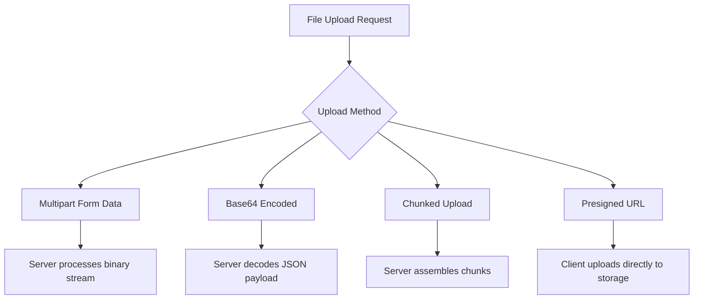
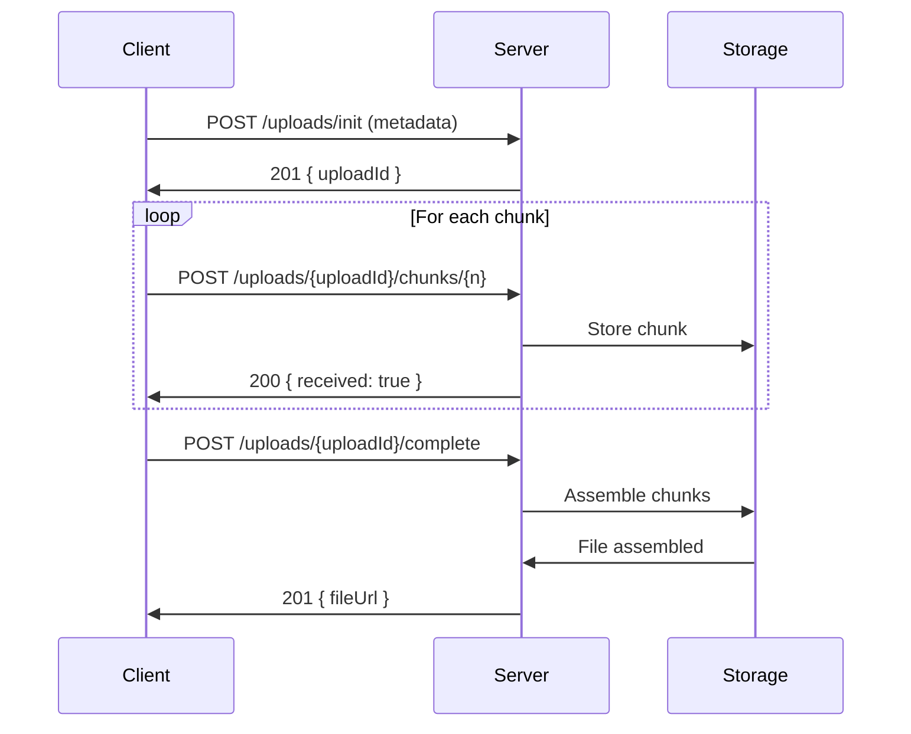
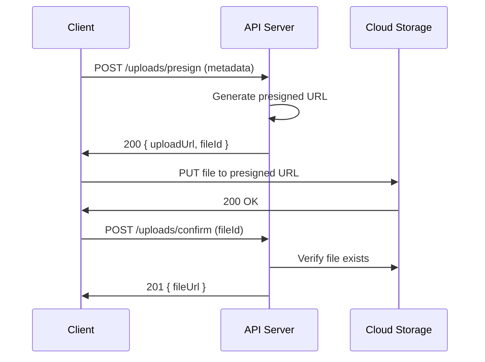
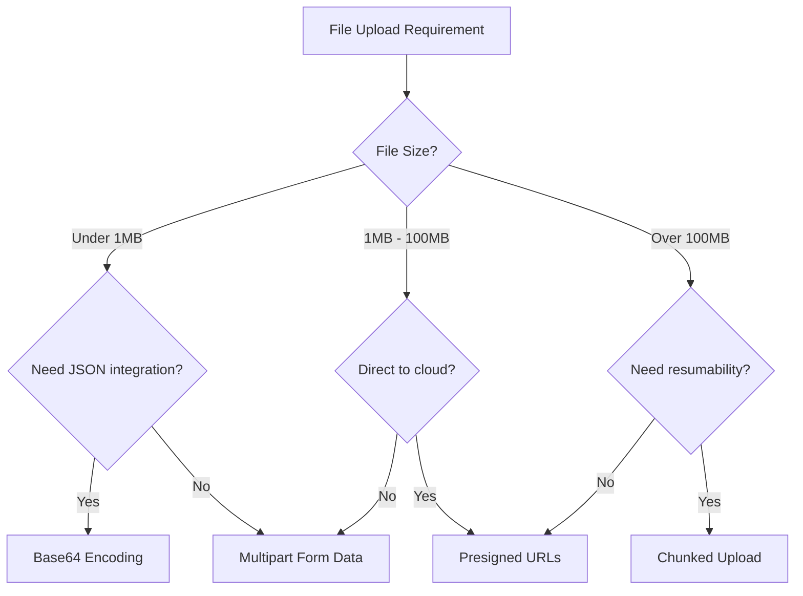

# How to Handle File Uploads in REST APIs

Author: [nawazdhandala](https://github.com/nawazdhandala)

Tags: REST API, File Upload, API Design, HTTP, Multipart

Description: Learn how to design and implement file uploads in REST APIs. This guide covers multipart form data, base64 encoding, chunked uploads, presigned URLs, and best practices for building scalable upload endpoints.

---

File uploads are a common requirement in REST APIs, yet they present unique challenges compared to standard JSON endpoints. Files are binary, often large, and require different handling strategies. This guide covers the patterns and best practices for handling file uploads in REST APIs effectively.

## Understanding File Upload Methods

REST APIs typically handle file uploads using one of four approaches:



Each approach has trade-offs in terms of complexity, performance, and use cases.

## Method 1: Multipart Form Data

Multipart form data is the most common approach for file uploads. It allows sending files along with additional metadata in a single request.

### How Multipart Works

The client sends a POST request with `Content-Type: multipart/form-data`. The request body contains multiple parts separated by a boundary string, where each part can be either a file or a form field.

This example shows how to handle multipart uploads in Express.js using the popular multer middleware:

```javascript
// server.js - Express.js multipart upload handler
const express = require('express');
const multer = require('multer');
const path = require('path');
const crypto = require('crypto');

const app = express();

// Configure storage with secure filename generation
// Using disk storage keeps memory usage low for large files
const storage = multer.diskStorage({
  destination: (req, file, cb) => {
    cb(null, '/uploads');
  },
  filename: (req, file, cb) => {
    // Generate a unique filename to prevent overwrites and path traversal
    const uniqueId = crypto.randomBytes(16).toString('hex');
    const ext = path.extname(file.originalname);
    cb(null, `${uniqueId}${ext}`);
  }
});

// Configure upload limits and file filtering
// Always validate file types to prevent malicious uploads
const upload = multer({
  storage,
  limits: {
    fileSize: 10 * 1024 * 1024, // 10MB limit
    files: 5 // Maximum 5 files per request
  },
  fileFilter: (req, file, cb) => {
    // Only allow specific MIME types
    const allowedTypes = ['image/jpeg', 'image/png', 'image/gif', 'application/pdf'];
    if (allowedTypes.includes(file.mimetype)) {
      cb(null, true);
    } else {
      cb(new Error('Invalid file type'), false);
    }
  }
});

// Single file upload endpoint
// The 'file' parameter matches the form field name from the client
app.post('/api/upload', upload.single('file'), (req, res) => {
  if (!req.file) {
    return res.status(400).json({ error: 'No file provided' });
  }

  res.status(201).json({
    id: req.file.filename,
    originalName: req.file.originalname,
    size: req.file.size,
    mimeType: req.file.mimetype,
    url: `/files/${req.file.filename}`
  });
});

// Multiple file upload endpoint
// Useful for batch operations like uploading a photo gallery
app.post('/api/upload/multiple', upload.array('files', 5), (req, res) => {
  if (!req.files || req.files.length === 0) {
    return res.status(400).json({ error: 'No files provided' });
  }

  const uploaded = req.files.map(file => ({
    id: file.filename,
    originalName: file.originalname,
    size: file.size,
    mimeType: file.mimetype,
    url: `/files/${file.filename}`
  }));

  res.status(201).json({ files: uploaded });
});

// Error handling middleware for multer errors
// Provides meaningful error messages to API clients
app.use((err, req, res, next) => {
  if (err instanceof multer.MulterError) {
    if (err.code === 'LIMIT_FILE_SIZE') {
      return res.status(413).json({ error: 'File too large' });
    }
    if (err.code === 'LIMIT_FILE_COUNT') {
      return res.status(400).json({ error: 'Too many files' });
    }
  }
  if (err.message === 'Invalid file type') {
    return res.status(415).json({ error: 'Unsupported file type' });
  }
  next(err);
});

app.listen(3000);
```

### Client-Side Implementation

This example shows how to upload files from a browser using the Fetch API:

```javascript
// client.js - Browser file upload
async function uploadFile(file) {
  // FormData automatically sets the correct Content-Type header
  // including the boundary string for multipart encoding
  const formData = new FormData();
  formData.append('file', file);

  // You can also append additional metadata
  formData.append('description', 'Profile photo');
  formData.append('category', 'avatars');

  const response = await fetch('/api/upload', {
    method: 'POST',
    body: formData
    // Do not set Content-Type header manually - browser handles it
  });

  if (!response.ok) {
    const error = await response.json();
    throw new Error(error.message || 'Upload failed');
  }

  return response.json();
}

// Usage with file input element
document.getElementById('fileInput').addEventListener('change', async (event) => {
  const file = event.target.files[0];

  try {
    const result = await uploadFile(file);
    console.log('Uploaded:', result);
  } catch (error) {
    console.error('Upload failed:', error);
  }
});
```

## Method 2: Base64 Encoding

Base64 encoding embeds file data directly in JSON payloads. This approach is simpler but increases payload size by approximately 33%.

### When to Use Base64

Base64 encoding works well for small files under 1MB, when you need to send file data with complex JSON metadata, or when your infrastructure does not support multipart parsing.

This example demonstrates handling base64-encoded uploads:

```javascript
// server.js - Base64 upload handler
const express = require('express');
const fs = require('fs').promises;
const crypto = require('crypto');
const path = require('path');

const app = express();

// Increase JSON body limit for base64 payloads
// Base64 encoding adds ~33% overhead, so adjust accordingly
app.use(express.json({ limit: '15mb' }));

app.post('/api/upload/base64', async (req, res) => {
  const { filename, mimeType, data } = req.body;

  // Validate required fields
  if (!filename || !mimeType || !data) {
    return res.status(400).json({
      error: 'Missing required fields: filename, mimeType, data'
    });
  }

  // Validate MIME type
  const allowedTypes = ['image/jpeg', 'image/png', 'image/gif', 'application/pdf'];
  if (!allowedTypes.includes(mimeType)) {
    return res.status(415).json({ error: 'Unsupported file type' });
  }

  try {
    // Remove data URL prefix if present
    // Clients often send "data:image/png;base64,..." format
    const base64Data = data.replace(/^data:[^;]+;base64,/, '');

    // Decode base64 to buffer
    const buffer = Buffer.from(base64Data, 'base64');

    // Validate file size after decoding
    const maxSize = 10 * 1024 * 1024; // 10MB
    if (buffer.length > maxSize) {
      return res.status(413).json({ error: 'File too large' });
    }

    // Generate secure filename
    const uniqueId = crypto.randomBytes(16).toString('hex');
    const ext = path.extname(filename);
    const savedFilename = `${uniqueId}${ext}`;
    const filePath = path.join('/uploads', savedFilename);

    // Write file to disk
    await fs.writeFile(filePath, buffer);

    res.status(201).json({
      id: savedFilename,
      originalName: filename,
      size: buffer.length,
      mimeType,
      url: `/files/${savedFilename}`
    });
  } catch (error) {
    console.error('Base64 upload error:', error);
    res.status(500).json({ error: 'Upload processing failed' });
  }
});

app.listen(3000);
```

### Client-Side Base64 Upload

This example shows how to convert a file to base64 and send it as JSON:

```javascript
// client.js - Base64 file upload
async function uploadFileAsBase64(file) {
  // Convert file to base64 string
  const base64Data = await fileToBase64(file);

  const response = await fetch('/api/upload/base64', {
    method: 'POST',
    headers: {
      'Content-Type': 'application/json'
    },
    body: JSON.stringify({
      filename: file.name,
      mimeType: file.type,
      data: base64Data
    })
  });

  if (!response.ok) {
    const error = await response.json();
    throw new Error(error.message || 'Upload failed');
  }

  return response.json();
}

// Helper function to convert File to base64 string
function fileToBase64(file) {
  return new Promise((resolve, reject) => {
    const reader = new FileReader();
    reader.onload = () => resolve(reader.result);
    reader.onerror = reject;
    reader.readAsDataURL(file);
  });
}
```

## Method 3: Chunked Uploads

Chunked uploads split large files into smaller pieces, enabling resumable uploads and better handling of network interruptions.



### Server Implementation for Chunked Uploads

This example implements a complete chunked upload system with resumability support:

```javascript
// server.js - Chunked upload handler
const express = require('express');
const fs = require('fs').promises;
const path = require('path');
const crypto = require('crypto');

const app = express();
app.use(express.json());

// Store upload state in memory (use Redis in production)
// This tracks which chunks have been received for each upload
const uploads = new Map();

// Initialize a new chunked upload
// Returns an uploadId that the client uses for subsequent requests
app.post('/api/uploads/init', async (req, res) => {
  const { filename, fileSize, mimeType, totalChunks } = req.body;

  // Validate required fields
  if (!filename || !fileSize || !totalChunks) {
    return res.status(400).json({
      error: 'Missing required fields: filename, fileSize, totalChunks'
    });
  }

  // Generate unique upload ID
  const uploadId = crypto.randomBytes(16).toString('hex');

  // Create temporary directory for chunks
  const chunkDir = path.join('/uploads/chunks', uploadId);
  await fs.mkdir(chunkDir, { recursive: true });

  // Store upload metadata
  uploads.set(uploadId, {
    filename,
    fileSize,
    mimeType,
    totalChunks,
    receivedChunks: new Set(),
    chunkDir,
    createdAt: Date.now(),
    expiresAt: Date.now() + 24 * 60 * 60 * 1000 // 24 hour expiry
  });

  res.status(201).json({
    uploadId,
    chunkSize: 5 * 1024 * 1024, // Recommended 5MB chunks
    expiresAt: uploads.get(uploadId).expiresAt
  });
});

// Upload a single chunk
// Uses raw body parsing for binary data
app.post('/api/uploads/:uploadId/chunks/:chunkNumber',
  express.raw({ type: 'application/octet-stream', limit: '6mb' }),
  async (req, res) => {
    const { uploadId, chunkNumber } = req.params;
    const chunkNum = parseInt(chunkNumber);

    // Validate upload exists
    const upload = uploads.get(uploadId);
    if (!upload) {
      return res.status(404).json({ error: 'Upload not found or expired' });
    }

    // Validate chunk number
    if (chunkNum < 1 || chunkNum > upload.totalChunks) {
      return res.status(400).json({ error: 'Invalid chunk number' });
    }

    // Check if chunk already received (idempotency)
    if (upload.receivedChunks.has(chunkNum)) {
      return res.status(200).json({
        chunkNumber: chunkNum,
        status: 'already_received'
      });
    }

    try {
      // Save chunk to disk
      const chunkPath = path.join(upload.chunkDir, `chunk_${chunkNum}`);
      await fs.writeFile(chunkPath, req.body);

      // Mark chunk as received
      upload.receivedChunks.add(chunkNum);

      res.status(200).json({
        chunkNumber: chunkNum,
        receivedChunks: upload.receivedChunks.size,
        totalChunks: upload.totalChunks,
        status: 'received'
      });
    } catch (error) {
      console.error('Chunk upload error:', error);
      res.status(500).json({ error: 'Failed to save chunk' });
    }
  }
);

// Get upload status (for resuming interrupted uploads)
// Client can check which chunks are missing and resume
app.get('/api/uploads/:uploadId/status', (req, res) => {
  const upload = uploads.get(req.params.uploadId);

  if (!upload) {
    return res.status(404).json({ error: 'Upload not found or expired' });
  }

  res.json({
    uploadId: req.params.uploadId,
    filename: upload.filename,
    totalChunks: upload.totalChunks,
    receivedChunks: Array.from(upload.receivedChunks),
    missingChunks: Array.from(
      { length: upload.totalChunks },
      (_, i) => i + 1
    ).filter(n => !upload.receivedChunks.has(n)),
    complete: upload.receivedChunks.size === upload.totalChunks
  });
});

// Complete the upload by assembling all chunks
// This should be called after all chunks are uploaded
app.post('/api/uploads/:uploadId/complete', async (req, res) => {
  const upload = uploads.get(req.params.uploadId);

  if (!upload) {
    return res.status(404).json({ error: 'Upload not found or expired' });
  }

  // Verify all chunks received
  if (upload.receivedChunks.size !== upload.totalChunks) {
    return res.status(400).json({
      error: 'Not all chunks received',
      received: upload.receivedChunks.size,
      expected: upload.totalChunks
    });
  }

  try {
    // Generate final filename
    const ext = path.extname(upload.filename);
    const finalFilename = `${crypto.randomBytes(16).toString('hex')}${ext}`;
    const finalPath = path.join('/uploads/files', finalFilename);

    // Assemble chunks in order
    const writeStream = require('fs').createWriteStream(finalPath);

    for (let i = 1; i <= upload.totalChunks; i++) {
      const chunkPath = path.join(upload.chunkDir, `chunk_${i}`);
      const chunkData = await fs.readFile(chunkPath);
      writeStream.write(chunkData);
    }

    writeStream.end();

    // Wait for write to complete
    await new Promise((resolve, reject) => {
      writeStream.on('finish', resolve);
      writeStream.on('error', reject);
    });

    // Cleanup chunks
    await fs.rm(upload.chunkDir, { recursive: true });
    uploads.delete(req.params.uploadId);

    res.status(201).json({
      id: finalFilename,
      originalName: upload.filename,
      size: upload.fileSize,
      mimeType: upload.mimeType,
      url: `/files/${finalFilename}`
    });
  } catch (error) {
    console.error('Assembly error:', error);
    res.status(500).json({ error: 'Failed to assemble file' });
  }
});

// Abort an upload and cleanup resources
app.delete('/api/uploads/:uploadId', async (req, res) => {
  const upload = uploads.get(req.params.uploadId);

  if (upload) {
    try {
      await fs.rm(upload.chunkDir, { recursive: true });
    } catch (error) {
      // Directory may not exist, ignore
    }
    uploads.delete(req.params.uploadId);
  }

  res.status(204).send();
});

app.listen(3000);
```

### Client-Side Chunked Upload

This example shows a robust chunked upload client with retry logic:

```javascript
// client.js - Chunked upload with retry support
class ChunkedUploader {
  constructor(file, options = {}) {
    this.file = file;
    this.chunkSize = options.chunkSize || 5 * 1024 * 1024; // 5MB
    this.maxRetries = options.maxRetries || 3;
    this.onProgress = options.onProgress || (() => {});

    this.uploadId = null;
    this.totalChunks = Math.ceil(file.size / this.chunkSize);
  }

  async upload() {
    // Initialize upload
    const initResponse = await fetch('/api/uploads/init', {
      method: 'POST',
      headers: { 'Content-Type': 'application/json' },
      body: JSON.stringify({
        filename: this.file.name,
        fileSize: this.file.size,
        mimeType: this.file.type,
        totalChunks: this.totalChunks
      })
    });

    if (!initResponse.ok) {
      throw new Error('Failed to initialize upload');
    }

    const { uploadId } = await initResponse.json();
    this.uploadId = uploadId;

    // Upload each chunk
    for (let i = 0; i < this.totalChunks; i++) {
      await this.uploadChunk(i + 1);
      this.onProgress({
        uploaded: i + 1,
        total: this.totalChunks,
        percent: Math.round(((i + 1) / this.totalChunks) * 100)
      });
    }

    // Complete upload
    const completeResponse = await fetch(`/api/uploads/${uploadId}/complete`, {
      method: 'POST'
    });

    if (!completeResponse.ok) {
      throw new Error('Failed to complete upload');
    }

    return completeResponse.json();
  }

  async uploadChunk(chunkNumber, retries = 0) {
    const start = (chunkNumber - 1) * this.chunkSize;
    const end = Math.min(start + this.chunkSize, this.file.size);
    const chunk = this.file.slice(start, end);

    try {
      const response = await fetch(
        `/api/uploads/${this.uploadId}/chunks/${chunkNumber}`,
        {
          method: 'POST',
          headers: { 'Content-Type': 'application/octet-stream' },
          body: chunk
        }
      );

      if (!response.ok) {
        throw new Error(`Chunk ${chunkNumber} upload failed`);
      }

      return response.json();
    } catch (error) {
      if (retries < this.maxRetries) {
        // Exponential backoff before retry
        await new Promise(r => setTimeout(r, Math.pow(2, retries) * 1000));
        return this.uploadChunk(chunkNumber, retries + 1);
      }
      throw error;
    }
  }

  // Resume an interrupted upload
  async resume(uploadId) {
    this.uploadId = uploadId;

    // Get upload status
    const statusResponse = await fetch(`/api/uploads/${uploadId}/status`);
    if (!statusResponse.ok) {
      throw new Error('Upload not found');
    }

    const status = await statusResponse.json();
    const { missingChunks } = status;

    // Upload missing chunks
    for (const chunkNumber of missingChunks) {
      await this.uploadChunk(chunkNumber);
      this.onProgress({
        uploaded: status.totalChunks - missingChunks.length + 1,
        total: status.totalChunks,
        percent: Math.round(
          ((status.totalChunks - missingChunks.length + 1) / status.totalChunks) * 100
        )
      });
    }

    // Complete upload
    const completeResponse = await fetch(`/api/uploads/${uploadId}/complete`, {
      method: 'POST'
    });

    return completeResponse.json();
  }
}

// Usage
const uploader = new ChunkedUploader(file, {
  onProgress: (progress) => {
    console.log(`Upload progress: ${progress.percent}%`);
  }
});

try {
  const result = await uploader.upload();
  console.log('Upload complete:', result);
} catch (error) {
  // Store uploadId for later resume
  localStorage.setItem('pendingUpload', uploader.uploadId);
  console.error('Upload failed, can be resumed');
}
```

## Method 4: Presigned URLs

Presigned URLs allow clients to upload files directly to cloud storage, bypassing your application server entirely. This reduces server load and improves upload performance.



### Server Implementation for Presigned URLs

This example uses AWS S3, but the pattern works with any cloud storage:

```javascript
// server.js - Presigned URL generation with S3
const express = require('express');
const { S3Client, PutObjectCommand, HeadObjectCommand } = require('@aws-sdk/client-s3');
const { getSignedUrl } = require('@aws-sdk/s3-request-presigner');
const crypto = require('crypto');

const app = express();
app.use(express.json());

// Configure S3 client
const s3 = new S3Client({
  region: process.env.AWS_REGION,
  credentials: {
    accessKeyId: process.env.AWS_ACCESS_KEY_ID,
    secretAccessKey: process.env.AWS_SECRET_ACCESS_KEY
  }
});

const BUCKET = process.env.S3_BUCKET;

// Store pending uploads (use Redis in production)
const pendingUploads = new Map();

// Generate presigned URL for upload
// Client will use this URL to upload directly to S3
app.post('/api/uploads/presign', async (req, res) => {
  const { filename, mimeType, fileSize } = req.body;

  // Validate file type
  const allowedTypes = ['image/jpeg', 'image/png', 'image/gif', 'application/pdf'];
  if (!allowedTypes.includes(mimeType)) {
    return res.status(415).json({ error: 'Unsupported file type' });
  }

  // Validate file size
  const maxSize = 100 * 1024 * 1024; // 100MB
  if (fileSize > maxSize) {
    return res.status(413).json({ error: 'File too large' });
  }

  // Generate unique file key
  const fileId = crypto.randomBytes(16).toString('hex');
  const ext = filename.split('.').pop();
  const key = `uploads/${fileId}.${ext}`;

  try {
    // Create presigned PUT URL
    // URL expires in 15 minutes - client must upload before expiry
    const command = new PutObjectCommand({
      Bucket: BUCKET,
      Key: key,
      ContentType: mimeType,
      ContentLength: fileSize
    });

    const uploadUrl = await getSignedUrl(s3, command, { expiresIn: 900 });

    // Store pending upload for verification
    pendingUploads.set(fileId, {
      key,
      filename,
      mimeType,
      fileSize,
      createdAt: Date.now(),
      expiresAt: Date.now() + 900000
    });

    res.json({
      fileId,
      uploadUrl,
      expiresAt: pendingUploads.get(fileId).expiresAt
    });
  } catch (error) {
    console.error('Presign error:', error);
    res.status(500).json({ error: 'Failed to generate upload URL' });
  }
});

// Confirm upload completion
// Client calls this after uploading to S3 to verify and register the file
app.post('/api/uploads/confirm', async (req, res) => {
  const { fileId } = req.body;

  const pending = pendingUploads.get(fileId);
  if (!pending) {
    return res.status(404).json({ error: 'Upload not found or expired' });
  }

  try {
    // Verify file exists in S3
    const command = new HeadObjectCommand({
      Bucket: BUCKET,
      Key: pending.key
    });

    const metadata = await s3.send(command);

    // Verify file size matches
    if (metadata.ContentLength !== pending.fileSize) {
      return res.status(400).json({ error: 'File size mismatch' });
    }

    // Remove from pending
    pendingUploads.delete(fileId);

    // Generate public URL
    const fileUrl = `https://${BUCKET}.s3.${process.env.AWS_REGION}.amazonaws.com/${pending.key}`;

    res.status(201).json({
      id: fileId,
      originalName: pending.filename,
      size: pending.fileSize,
      mimeType: pending.mimeType,
      url: fileUrl
    });
  } catch (error) {
    if (error.name === 'NotFound') {
      return res.status(400).json({ error: 'File not uploaded to storage' });
    }
    console.error('Confirm error:', error);
    res.status(500).json({ error: 'Failed to confirm upload' });
  }
});

app.listen(3000);
```

### Client-Side Presigned Upload

This example shows how to use presigned URLs from the browser:

```javascript
// client.js - Presigned URL upload
async function uploadWithPresignedUrl(file) {
  // Step 1: Get presigned URL from your API
  const presignResponse = await fetch('/api/uploads/presign', {
    method: 'POST',
    headers: { 'Content-Type': 'application/json' },
    body: JSON.stringify({
      filename: file.name,
      mimeType: file.type,
      fileSize: file.size
    })
  });

  if (!presignResponse.ok) {
    const error = await presignResponse.json();
    throw new Error(error.error || 'Failed to get upload URL');
  }

  const { fileId, uploadUrl } = await presignResponse.json();

  // Step 2: Upload file directly to cloud storage
  // Note: No authentication headers needed - the URL itself is the credential
  const uploadResponse = await fetch(uploadUrl, {
    method: 'PUT',
    headers: {
      'Content-Type': file.type,
      'Content-Length': file.size
    },
    body: file
  });

  if (!uploadResponse.ok) {
    throw new Error('Failed to upload to storage');
  }

  // Step 3: Confirm upload with your API
  const confirmResponse = await fetch('/api/uploads/confirm', {
    method: 'POST',
    headers: { 'Content-Type': 'application/json' },
    body: JSON.stringify({ fileId })
  });

  if (!confirmResponse.ok) {
    throw new Error('Failed to confirm upload');
  }

  return confirmResponse.json();
}
```

## Choosing the Right Method

The following decision tree helps you select the appropriate upload method based on your requirements:



### Method Comparison

| Method | Max Size | Resumable | Server Load | Complexity |
|--------|----------|-----------|-------------|------------|
| Multipart | 10-100MB | No | High | Low |
| Base64 | 1MB | No | High | Low |
| Chunked | Unlimited | Yes | Medium | High |
| Presigned | Unlimited | No | Low | Medium |

## Security Best Practices

### Validate File Types

Never trust the Content-Type header alone. Validate files by their magic bytes:

```javascript
// utils/fileValidation.js
const fileType = require('file-type');

// Validate file type by reading the file header (magic bytes)
// This prevents users from uploading malicious files with spoofed extensions
async function validateFileType(buffer, allowedTypes) {
  const detected = await fileType.fromBuffer(buffer);

  if (!detected) {
    return { valid: false, error: 'Could not determine file type' };
  }

  if (!allowedTypes.includes(detected.mime)) {
    return {
      valid: false,
      error: `File type ${detected.mime} not allowed`,
      detected: detected.mime
    };
  }

  return { valid: true, mimeType: detected.mime, extension: detected.ext };
}

// Usage in upload handler
app.post('/api/upload', upload.single('file'), async (req, res) => {
  const allowedTypes = ['image/jpeg', 'image/png', 'application/pdf'];

  // Read first 4100 bytes for file type detection
  const headerBuffer = req.file.buffer.slice(0, 4100);
  const validation = await validateFileType(headerBuffer, allowedTypes);

  if (!validation.valid) {
    return res.status(415).json({ error: validation.error });
  }

  // Proceed with upload
});
```

### Implement Rate Limiting

Protect your upload endpoints from abuse:

```javascript
// middleware/uploadRateLimit.js
const rateLimit = require('express-rate-limit');

// Limit upload requests per IP address
// This prevents denial of service through excessive uploads
const uploadLimiter = rateLimit({
  windowMs: 15 * 60 * 1000, // 15 minutes
  max: 50, // 50 uploads per window
  message: {
    error: 'Too many uploads, please try again later'
  },
  standardHeaders: true,
  legacyHeaders: false
});

// Limit total upload size per IP per day
// Prevents storage abuse
const dailyUploadLimiter = rateLimit({
  windowMs: 24 * 60 * 60 * 1000, // 24 hours
  max: 500 * 1024 * 1024, // 500MB per day
  keyGenerator: (req) => req.ip,
  handler: (req, res) => {
    res.status(429).json({
      error: 'Daily upload limit exceeded'
    });
  }
});

// Apply to upload routes
app.post('/api/upload', uploadLimiter, dailyUploadLimiter, uploadHandler);
```

### Scan for Malware

Integrate virus scanning for uploaded files:

```javascript
// middleware/virusScan.js
const NodeClam = require('clamscan');

// Initialize ClamAV scanner
// Requires ClamAV daemon running on the server
const scanner = new NodeClam().init({
  clamdscan: {
    socket: '/var/run/clamav/clamd.ctl'
  }
});

async function scanFile(filePath) {
  const clam = await scanner;
  const { isInfected, viruses } = await clam.scanFile(filePath);

  return {
    safe: !isInfected,
    threats: viruses || []
  };
}

// Usage in upload handler
app.post('/api/upload', upload.single('file'), async (req, res) => {
  // Scan uploaded file for viruses before processing
  const scanResult = await scanFile(req.file.path);

  if (!scanResult.safe) {
    // Delete infected file immediately
    await fs.unlink(req.file.path);

    return res.status(400).json({
      error: 'File failed security scan',
      threats: scanResult.threats
    });
  }

  // File is safe, continue processing
});
```

## Error Handling

Implement comprehensive error handling for upload operations:

```javascript
// middleware/uploadErrorHandler.js

// Centralized error handler for file uploads
// Provides consistent error responses across all upload endpoints
function uploadErrorHandler(err, req, res, next) {
  // Clean up any uploaded files on error
  if (req.file) {
    fs.unlink(req.file.path).catch(() => {});
  }
  if (req.files) {
    req.files.forEach(file => fs.unlink(file.path).catch(() => {}));
  }

  // Handle specific error types
  if (err.code === 'LIMIT_FILE_SIZE') {
    return res.status(413).json({
      error: 'File size exceeds limit',
      code: 'FILE_TOO_LARGE',
      maxSize: '10MB'
    });
  }

  if (err.code === 'LIMIT_FILE_COUNT') {
    return res.status(400).json({
      error: 'Too many files',
      code: 'TOO_MANY_FILES',
      maxFiles: 5
    });
  }

  if (err.code === 'LIMIT_UNEXPECTED_FILE') {
    return res.status(400).json({
      error: 'Unexpected field name',
      code: 'INVALID_FIELD'
    });
  }

  if (err.message === 'Invalid file type') {
    return res.status(415).json({
      error: 'File type not supported',
      code: 'UNSUPPORTED_TYPE',
      allowedTypes: ['image/jpeg', 'image/png', 'application/pdf']
    });
  }

  // Log unexpected errors
  console.error('Upload error:', err);

  res.status(500).json({
    error: 'Upload failed',
    code: 'INTERNAL_ERROR'
  });
}

module.exports = uploadErrorHandler;
```

## Response Design

Use consistent response structures for upload operations:

```javascript
// Success response for single file upload
{
  "data": {
    "id": "abc123def456",
    "type": "file",
    "attributes": {
      "originalName": "document.pdf",
      "size": 1048576,
      "mimeType": "application/pdf",
      "url": "https://cdn.example.com/files/abc123def456.pdf",
      "createdAt": "2026-02-02T10:30:00Z"
    }
  }
}

// Success response for multiple file upload
{
  "data": [
    {
      "id": "abc123",
      "type": "file",
      "attributes": {
        "originalName": "photo1.jpg",
        "size": 524288,
        "mimeType": "image/jpeg",
        "url": "https://cdn.example.com/files/abc123.jpg"
      }
    },
    {
      "id": "def456",
      "type": "file",
      "attributes": {
        "originalName": "photo2.jpg",
        "size": 1048576,
        "mimeType": "image/jpeg",
        "url": "https://cdn.example.com/files/def456.jpg"
      }
    }
  ],
  "meta": {
    "totalFiles": 2,
    "totalSize": 1572864
  }
}

// Error response
{
  "error": {
    "code": "FILE_TOO_LARGE",
    "message": "File size exceeds the maximum allowed limit",
    "details": {
      "maxSize": "10MB",
      "receivedSize": "15MB"
    }
  }
}
```

## Summary

File uploads in REST APIs require careful consideration of method selection, security, and error handling. Key takeaways:

- Use multipart form data for simple uploads under 100MB
- Use base64 encoding only for small files with complex JSON metadata
- Use chunked uploads for large files that need resumability
- Use presigned URLs to offload upload traffic to cloud storage
- Always validate file types by magic bytes, not just Content-Type
- Implement rate limiting to prevent abuse
- Consider virus scanning for user-uploaded content
- Return consistent, well-structured responses

For production applications, monitoring your file upload endpoints is critical. [OneUptime](https://oneuptime.com) provides comprehensive API monitoring that tracks upload success rates, latency, and error patterns. With OneUptime, you can set up alerts for failed uploads, monitor storage usage, and ensure your file handling infrastructure performs reliably under load.
