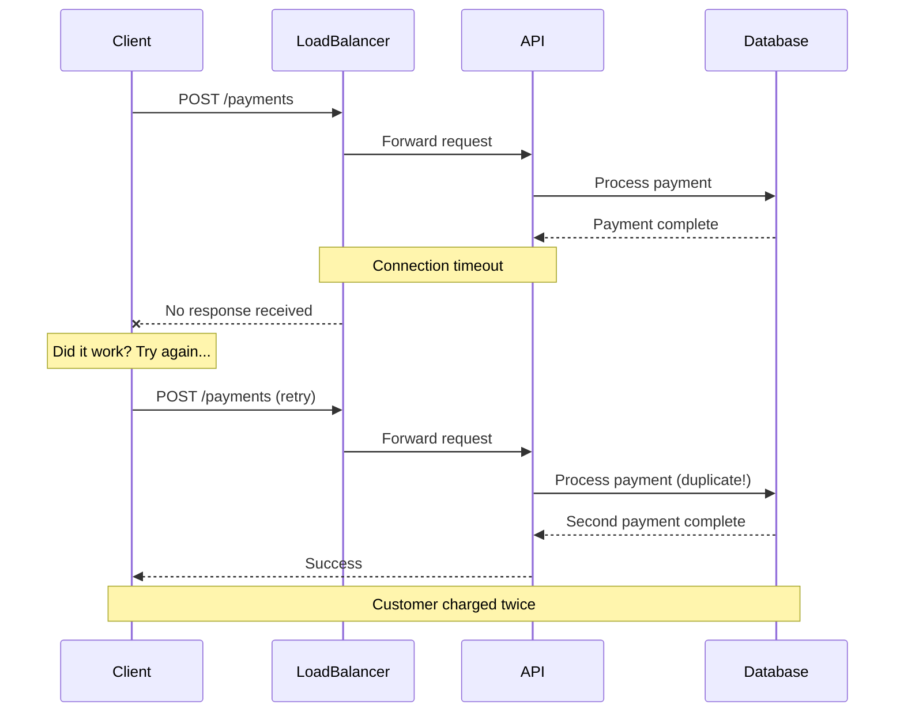
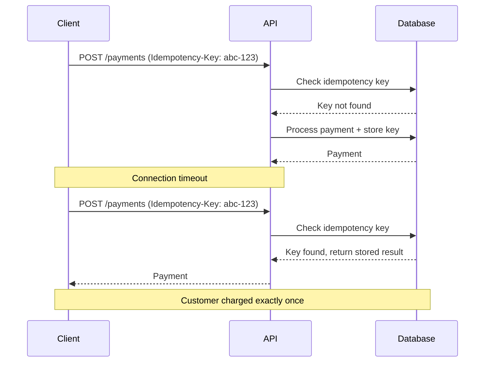
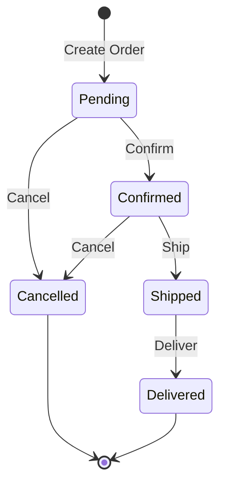

# How to Design Idempotent Operations

Author: [nawazdhandala](https://www.github.com/nawazdhandala)

Tags: REST API, Idempotency, API Design, HTTP Methods, Distributed Systems, Reliability

Description: Learn how to design idempotent REST API operations that are safe for retries. This guide covers HTTP method semantics, idempotency keys, endpoint design patterns, and best practices for building reliable APIs.

---

> An operation is idempotent if performing it multiple times produces the same result as performing it once. This property is essential for building reliable distributed systems.

Network failures happen. Clients retry requests. Without idempotency, a single user action can create duplicate orders, charge a card twice, or send the same email five times. This guide covers how to design your REST APIs so that retries are safe by default.

## Why Idempotency Matters

Consider what happens when a network timeout occurs:



With proper idempotent design, retries return the original result:



## HTTP Method Idempotency Semantics

HTTP defines idempotency for its methods. Understanding these semantics helps you design APIs that work correctly.

| Method | Idempotent | Safe | Typical Use |
|--------|------------|------|-------------|
| GET | Yes | Yes | Retrieve resources |
| HEAD | Yes | Yes | Check resource existence |
| OPTIONS | Yes | Yes | Discover allowed methods |
| PUT | Yes | No | Replace entire resource |
| DELETE | Yes | No | Remove resource |
| POST | No | No | Create resource or trigger action |
| PATCH | No | No | Partial update |

### GET, HEAD, OPTIONS: Safe and Idempotent

These methods should never modify server state. They can be cached, retried, and prefetched without concern.

The following example shows a properly designed GET endpoint that only reads data.

```javascript
// GET is safe and idempotent - never modifies state
// This endpoint can be called any number of times safely

app.get('/api/users/:id', async (req, res) => {
  const user = await User.findById(req.params.id);

  if (!user) {
    return res.status(404).json({ error: 'User not found' });
  }

  // No side effects - only reading data
  res.json(user);
});
```

### PUT: Replace the Entire Resource

PUT is idempotent by design. Sending the same PUT request multiple times leaves the resource in the same state.

This example demonstrates PUT semantics where the entire resource is replaced.

```javascript
// PUT replaces the entire resource
// Multiple identical PUT requests produce the same result

app.put('/api/users/:id', async (req, res) => {
  const { name, email, role } = req.body;

  // PUT semantics: replace the entire resource
  // If fields are missing, they become null/default
  const user = await User.findByIdAndUpdate(
    req.params.id,
    {
      name,
      email,
      role,
      updatedAt: new Date()
    },
    {
      new: true,
      upsert: false,  // Do not create if not exists
      overwrite: true // Replace entire document
    }
  );

  if (!user) {
    return res.status(404).json({ error: 'User not found' });
  }

  res.json(user);
});
```

The critical point: PUT with the same body always produces the same final state, regardless of how many times it runs.

### DELETE: Remove or Confirm Absence

DELETE is idempotent because deleting something that does not exist is the same as having deleted it.

The following shows how DELETE should handle both existing and non-existing resources.

```javascript
// DELETE is idempotent - deleting twice = deleting once
// The end state is: resource does not exist

app.delete('/api/users/:id', async (req, res) => {
  const result = await User.findByIdAndDelete(req.params.id);

  // Both outcomes are valid for idempotent DELETE:

  // Option 1: Return 204 regardless of whether it existed
  // This is the most idempotent-friendly approach
  res.status(204).send();

  // Option 2: Return 404 if it did not exist (less idempotent-friendly)
  // if (!result) {
  //   return res.status(404).json({ error: 'User not found' });
  // }
  // res.status(204).send();
});
```

Returning 204 for all DELETE requests (whether the resource existed or not) makes your API more resilient to retries.

### POST: Not Idempotent by Default

POST is the problematic method. It creates new resources or triggers actions, so repeating it causes duplicates.

This example shows why POST is dangerous without idempotency protection.

```javascript
// POST is NOT idempotent by default
// Each call creates a new resource

app.post('/api/orders', async (req, res) => {
  const { items, customerId } = req.body;

  // Danger: If client retries, another order is created
  const order = await Order.create({
    items,
    customerId,
    status: 'pending',
    createdAt: new Date()
  });

  res.status(201).json(order);
});
```

The solution: add explicit idempotency handling for POST requests.

## Designing Idempotent POST Endpoints

There are several strategies to make POST endpoints idempotent.

### Strategy 1: Client-Provided Idempotency Keys

The client generates a unique key for each logical operation. The server uses this key to detect and handle retries.

The following implementation shows a complete idempotency key system.

```javascript
// Middleware to handle idempotency keys
// The key should be stored with the request result for replay

async function idempotencyMiddleware(req, res, next) {
  // Only apply to non-idempotent methods
  if (['GET', 'HEAD', 'OPTIONS', 'PUT', 'DELETE'].includes(req.method)) {
    return next();
  }

  const idempotencyKey = req.headers['idempotency-key'];

  // Require idempotency key for POST requests
  if (!idempotencyKey) {
    return res.status(400).json({
      error: 'Missing Idempotency-Key header',
      message: 'POST requests require an Idempotency-Key header'
    });
  }

  // Check if we have seen this key before
  const existing = await IdempotencyStore.findOne({
    key: idempotencyKey,
    userId: req.user.id  // Scope keys to user
  });

  if (existing) {
    // Request is a retry - return the stored response
    if (existing.status === 'processing') {
      // Original request still in progress
      return res.status(409).json({
        error: 'Request in progress',
        message: 'A request with this idempotency key is still being processed'
      });
    }

    // Return the stored response
    return res
      .status(existing.responseStatus)
      .json(existing.responseBody);
  }

  // New request - store that we are processing it
  await IdempotencyStore.create({
    key: idempotencyKey,
    userId: req.user.id,
    status: 'processing',
    requestBody: req.body,
    createdAt: new Date()
  });

  // Intercept the response to store it
  const originalJson = res.json.bind(res);
  res.json = async (body) => {
    await IdempotencyStore.updateOne(
      { key: idempotencyKey, userId: req.user.id },
      {
        status: 'complete',
        responseStatus: res.statusCode,
        responseBody: body,
        completedAt: new Date()
      }
    );
    return originalJson(body);
  };

  next();
}

app.use('/api', idempotencyMiddleware);
```

### Strategy 2: Natural Idempotency Keys

Sometimes the request data itself contains a natural unique identifier. Use it instead of requiring a separate header.

This approach leverages business data to detect duplicates.

```javascript
// Use natural business keys for idempotency
// Example: A transfer between specific accounts at a specific time

app.post('/api/transfers', async (req, res) => {
  const { fromAccount, toAccount, amount, referenceId } = req.body;

  // referenceId is a business identifier from the client system
  // (e.g., invoice number, transaction reference)

  // Check for existing transfer with same reference
  const existing = await Transfer.findOne({
    referenceId,
    fromAccount
  });

  if (existing) {
    // Return the existing transfer
    return res.status(200).json({
      transfer: existing,
      duplicate: true
    });
  }

  // Create new transfer
  const transfer = await Transfer.create({
    fromAccount,
    toAccount,
    amount,
    referenceId,
    status: 'pending'
  });

  res.status(201).json({
    transfer,
    duplicate: false
  });
});
```

### Strategy 3: Convert POST to PUT

If you can generate the resource ID before creation, use PUT instead of POST. PUT is naturally idempotent.

The following shows how to shift ID generation to the client.

```javascript
// Instead of POST /api/orders (server generates ID)
// Use PUT /api/orders/:id (client provides ID)

// Client generates a UUID before sending the request
// PUT with the same ID and body is idempotent

app.put('/api/orders/:id', async (req, res) => {
  const orderId = req.params.id;
  const { items, customerId } = req.body;

  // Validate UUID format
  if (!isValidUUID(orderId)) {
    return res.status(400).json({
      error: 'Invalid order ID format'
    });
  }

  // Use upsert - create if not exists, update if exists
  const order = await Order.findOneAndUpdate(
    { _id: orderId },
    {
      $setOnInsert: {
        _id: orderId,
        items,
        customerId,
        createdAt: new Date()
      },
      $set: {
        updatedAt: new Date()
      }
    },
    {
      upsert: true,
      new: true
    }
  );

  // Determine if this was a create or update
  const isNew = order.createdAt.getTime() === order.updatedAt.getTime();

  res.status(isNew ? 201 : 200).json(order);
});
```

## Idempotency Key Best Practices

### Key Generation

Clients should generate keys that are unique per logical operation.

```javascript
// Client-side: Generate idempotency keys

// Option 1: UUID v4 - simplest approach
const idempotencyKey = crypto.randomUUID();

// Option 2: Combine user action with timestamp
// Useful when you want keys that are somewhat debuggable
const idempotencyKey = `order-${userId}-${Date.now()}-${crypto.randomUUID().slice(0, 8)}`;

// Option 3: Hash of the request content
// Same content = same key (be careful with timing-sensitive data)
const requestHash = crypto
  .createHash('sha256')
  .update(JSON.stringify({ items, customerId }))
  .digest('hex');
const idempotencyKey = `order-${requestHash}`;
```

### Key Scope and Expiration

Keys should be scoped to prevent collisions and should expire to allow reuse.

```javascript
// Idempotency key schema with proper scoping and TTL

const IdempotencyKeySchema = new Schema({
  // Compound key: user + key ensures isolation between users
  key: { type: String, required: true },
  userId: { type: String, required: true },

  // Request fingerprint to detect different requests with same key
  requestHash: { type: String, required: true },

  // Processing state
  status: {
    type: String,
    enum: ['processing', 'complete', 'failed'],
    default: 'processing'
  },

  // Stored response for replay
  responseStatus: Number,
  responseBody: Schema.Types.Mixed,

  // Timestamps
  createdAt: { type: Date, default: Date.now },
  completedAt: Date,

  // TTL index - keys expire after 24 hours
  expiresAt: {
    type: Date,
    default: () => new Date(Date.now() + 24 * 60 * 60 * 1000),
    index: { expireAfterSeconds: 0 }
  }
});

// Compound unique index
IdempotencyKeySchema.index({ key: 1, userId: 1 }, { unique: true });
```

### Handling Request Mismatches

When a client reuses a key with different request content, this is an error.

```javascript
// Detect when the same key is used for different requests

async function validateIdempotencyKey(req, existingRecord) {
  // Hash the current request body
  const currentHash = crypto
    .createHash('sha256')
    .update(JSON.stringify(req.body))
    .digest('hex');

  // Compare with stored hash
  if (existingRecord.requestHash !== currentHash) {
    throw new IdempotencyError({
      status: 422,
      error: 'Idempotency key reused with different request',
      message: 'The idempotency key was previously used with a different request body. Generate a new key for new requests.'
    });
  }
}
```

## Designing Idempotent PATCH Endpoints

PATCH is not idempotent by default, but you can design it to be.

### Problem: Non-Idempotent PATCH

Some PATCH operations are inherently non-idempotent.

```javascript
// Non-idempotent PATCH - incrementing a value
// Each call produces a different result

app.patch('/api/products/:id/inventory', async (req, res) => {
  const { adjustment } = req.body;

  // Danger: +10, +10, +10 = +30, not +10
  const product = await Product.findByIdAndUpdate(
    req.params.id,
    { $inc: { quantity: adjustment } },
    { new: true }
  );

  res.json(product);
});
```

### Solution: Use Absolute Values or Versioning

Design PATCH to use absolute values or include version checks.

```javascript
// Idempotent PATCH using absolute values and ETags

app.patch('/api/products/:id/inventory', async (req, res) => {
  const { quantity } = req.body;  // Absolute value, not delta
  const ifMatch = req.headers['if-match'];

  const product = await Product.findById(req.params.id);

  if (!product) {
    return res.status(404).json({ error: 'Product not found' });
  }

  // Require ETag for optimistic locking
  const currentETag = generateETag(product);
  if (ifMatch && ifMatch !== currentETag) {
    return res.status(412).json({
      error: 'Precondition Failed',
      message: 'Product was modified. Fetch current state and retry.'
    });
  }

  // Update to absolute value - idempotent
  product.quantity = quantity;
  product.updatedAt = new Date();
  await product.save();

  res.set('ETag', generateETag(product));
  res.json(product);
});
```

## State Machine Operations

For resources that follow a state machine, design transitions to be idempotent.



The following implementation makes state transitions idempotent.

```javascript
// Idempotent state transitions
// Transitioning to the current state is a no-op

const validTransitions = {
  pending: ['confirmed', 'cancelled'],
  confirmed: ['shipped', 'cancelled'],
  shipped: ['delivered'],
  cancelled: [],
  delivered: []
};

app.post('/api/orders/:id/confirm', async (req, res) => {
  const order = await Order.findById(req.params.id);

  if (!order) {
    return res.status(404).json({ error: 'Order not found' });
  }

  // Already in target state - return success (idempotent)
  if (order.status === 'confirmed') {
    return res.json({
      order,
      message: 'Order already confirmed'
    });
  }

  // Validate transition is allowed
  if (!validTransitions[order.status].includes('confirmed')) {
    return res.status(409).json({
      error: 'Invalid state transition',
      message: `Cannot confirm order in ${order.status} state`
    });
  }

  // Perform transition
  order.status = 'confirmed';
  order.confirmedAt = new Date();
  await order.save();

  res.json({ order });
});
```

## Error Handling and Retry Safety

Design your error responses to help clients decide whether to retry.

```javascript
// Use appropriate status codes for retry decisions

const errorResponses = {
  // 4xx errors: Client errors - retrying will not help
  400: { retryable: false, message: 'Bad request - fix the request and try again' },
  401: { retryable: false, message: 'Unauthorized - authenticate first' },
  403: { retryable: false, message: 'Forbidden - you lack permission' },
  404: { retryable: false, message: 'Not found - resource does not exist' },
  409: { retryable: false, message: 'Conflict - resolve the conflict first' },
  422: { retryable: false, message: 'Unprocessable - semantically invalid' },

  // 5xx errors: Server errors - retry may help
  500: { retryable: true, message: 'Internal error - retry with backoff' },
  502: { retryable: true, message: 'Bad gateway - retry with backoff' },
  503: { retryable: true, message: 'Service unavailable - retry with backoff' },
  504: { retryable: true, message: 'Gateway timeout - retry with backoff' }
};

// Include retry guidance in error responses
app.use((err, req, res, next) => {
  const status = err.status || 500;
  const errorInfo = errorResponses[status] || { retryable: false };

  res.status(status).json({
    error: err.message,
    code: err.code,
    retryable: errorInfo.retryable,
    retryAfter: errorInfo.retryable ? calculateBackoff(req) : null
  });
});
```

## Database Considerations

### Atomic Operations with Unique Constraints

Use database-level constraints to enforce idempotency.

```sql
-- PostgreSQL: Idempotency using unique constraints

-- Create idempotency key table
CREATE TABLE idempotency_keys (
    id UUID PRIMARY KEY DEFAULT gen_random_uuid(),
    key VARCHAR(255) NOT NULL,
    user_id UUID NOT NULL,
    request_hash VARCHAR(64) NOT NULL,
    status VARCHAR(20) DEFAULT 'processing',
    response_status INTEGER,
    response_body JSONB,
    created_at TIMESTAMP DEFAULT NOW(),
    completed_at TIMESTAMP,
    expires_at TIMESTAMP DEFAULT NOW() + INTERVAL '24 hours',

    -- Unique constraint ensures one request per key per user
    UNIQUE(key, user_id)
);

-- Auto-cleanup expired keys
CREATE INDEX idx_expires_at ON idempotency_keys(expires_at);
```

The following shows the transaction pattern for idempotent operations.

```javascript
// Transaction-based idempotent operation

async function createPaymentIdempotent(userId, idempotencyKey, paymentData) {
  const client = await pool.connect();

  try {
    await client.query('BEGIN');

    // Try to insert idempotency key (will fail if exists)
    const insertResult = await client.query(`
      INSERT INTO idempotency_keys (key, user_id, request_hash, status)
      VALUES ($1, $2, $3, 'processing')
      ON CONFLICT (key, user_id) DO NOTHING
      RETURNING id
    `, [idempotencyKey, userId, hashRequest(paymentData)]);

    if (insertResult.rows.length === 0) {
      // Key exists - fetch and return stored result
      const existing = await client.query(`
        SELECT response_status, response_body, status
        FROM idempotency_keys
        WHERE key = $1 AND user_id = $2
      `, [idempotencyKey, userId]);

      await client.query('COMMIT');

      if (existing.rows[0].status === 'processing') {
        throw new Error('Request still processing');
      }

      return {
        status: existing.rows[0].response_status,
        body: existing.rows[0].response_body,
        duplicate: true
      };
    }

    // Create the payment
    const payment = await client.query(`
      INSERT INTO payments (user_id, amount, currency, status)
      VALUES ($1, $2, $3, 'pending')
      RETURNING *
    `, [userId, paymentData.amount, paymentData.currency]);

    // Update idempotency key with result
    await client.query(`
      UPDATE idempotency_keys
      SET status = 'complete',
          response_status = 201,
          response_body = $1,
          completed_at = NOW()
      WHERE key = $2 AND user_id = $3
    `, [JSON.stringify(payment.rows[0]), idempotencyKey, userId]);

    await client.query('COMMIT');

    return {
      status: 201,
      body: payment.rows[0],
      duplicate: false
    };

  } catch (error) {
    await client.query('ROLLBACK');
    throw error;
  } finally {
    client.release();
  }
}
```

## API Documentation

Document idempotency behavior clearly in your API specification.

```yaml
# OpenAPI specification for idempotent endpoint

paths:
  /payments:
    post:
      summary: Create a payment
      description: |
        Creates a new payment. This endpoint supports idempotency via
        the Idempotency-Key header. Retrying a request with the same
        key within 24 hours returns the original response.
      parameters:
        - name: Idempotency-Key
          in: header
          required: true
          schema:
            type: string
            format: uuid
          description: |
            Unique key for this request. Use a UUID v4.
            Keys expire after 24 hours.
          example: "550e8400-e29b-41d4-a716-446655440000"
      requestBody:
        required: true
        content:
          application/json:
            schema:
              $ref: '#/components/schemas/PaymentRequest'
      responses:
        '201':
          description: Payment created successfully
          headers:
            Idempotency-Key:
              description: Echo of the provided idempotency key
              schema:
                type: string
        '200':
          description: |
            Duplicate request detected. Returns the original response.
            Check the X-Idempotent-Replay header.
          headers:
            X-Idempotent-Replay:
              description: "true" if this is a replay of a previous request
              schema:
                type: boolean
        '409':
          description: A request with this key is still being processed
        '422':
          description: Idempotency key was reused with different request body
```

## Testing Idempotent Operations

Test that your endpoints handle retries correctly.

```javascript
// Jest tests for idempotent behavior

describe('POST /api/payments', () => {
  it('should return same result for duplicate requests', async () => {
    const idempotencyKey = crypto.randomUUID();
    const paymentData = { amount: 100, currency: 'USD' };

    // First request
    const response1 = await request(app)
      .post('/api/payments')
      .set('Idempotency-Key', idempotencyKey)
      .send(paymentData);

    expect(response1.status).toBe(201);
    const paymentId = response1.body.id;

    // Retry with same key
    const response2 = await request(app)
      .post('/api/payments')
      .set('Idempotency-Key', idempotencyKey)
      .send(paymentData);

    // Should return same payment, not create new one
    expect(response2.status).toBe(200);
    expect(response2.body.id).toBe(paymentId);
    expect(response2.headers['x-idempotent-replay']).toBe('true');

    // Verify only one payment exists
    const payments = await Payment.find({ amount: 100 });
    expect(payments).toHaveLength(1);
  });

  it('should reject reused key with different body', async () => {
    const idempotencyKey = crypto.randomUUID();

    // First request
    await request(app)
      .post('/api/payments')
      .set('Idempotency-Key', idempotencyKey)
      .send({ amount: 100, currency: 'USD' });

    // Different body with same key
    const response = await request(app)
      .post('/api/payments')
      .set('Idempotency-Key', idempotencyKey)
      .send({ amount: 200, currency: 'USD' });  // Different amount

    expect(response.status).toBe(422);
    expect(response.body.error).toContain('different request');
  });

  it('should handle concurrent requests with same key', async () => {
    const idempotencyKey = crypto.randomUUID();
    const paymentData = { amount: 100, currency: 'USD' };

    // Send multiple requests simultaneously
    const requests = Array(5).fill().map(() =>
      request(app)
        .post('/api/payments')
        .set('Idempotency-Key', idempotencyKey)
        .send(paymentData)
    );

    const responses = await Promise.all(requests);

    // All should succeed
    responses.forEach(r => {
      expect([200, 201, 409]).toContain(r.status);
    });

    // Only one payment should exist
    const payments = await Payment.find({ amount: 100 });
    expect(payments).toHaveLength(1);
  });
});
```

## Summary

Designing idempotent APIs requires thinking about what happens when requests are repeated:

| Principle | Implementation |
|-----------|----------------|
| Use HTTP methods correctly | GET/PUT/DELETE are idempotent; POST needs explicit handling |
| Add idempotency keys to POST | Client-provided keys with server-side storage |
| Consider natural keys | Use business identifiers when available |
| Convert POST to PUT when possible | Client-generated IDs make PUT idempotent |
| Design state machines carefully | Same transition request returns same result |
| Use database constraints | Unique keys enforce idempotency at storage level |
| Document behavior clearly | Clients need to know how to use idempotency |
| Handle concurrent requests | Detect in-progress operations |
| Set appropriate TTLs | Keys should expire to allow eventual reuse |

Building idempotent APIs is not just about handling retries. It is about creating systems that behave predictably in the face of network unreliability, client bugs, and operational issues.

---

OneUptime helps you monitor your API endpoints for reliability and performance. Track response times, error rates, and availability across all your services. Detect when idempotency handling fails with detailed error tracking and alerting. [Try OneUptime](https://oneuptime.com) for comprehensive API observability.
