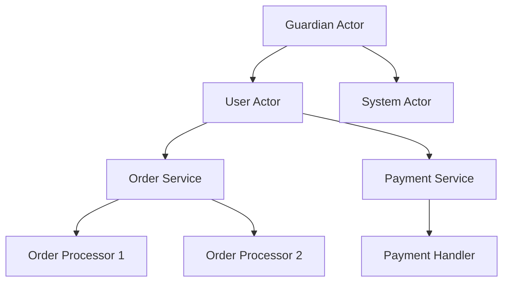
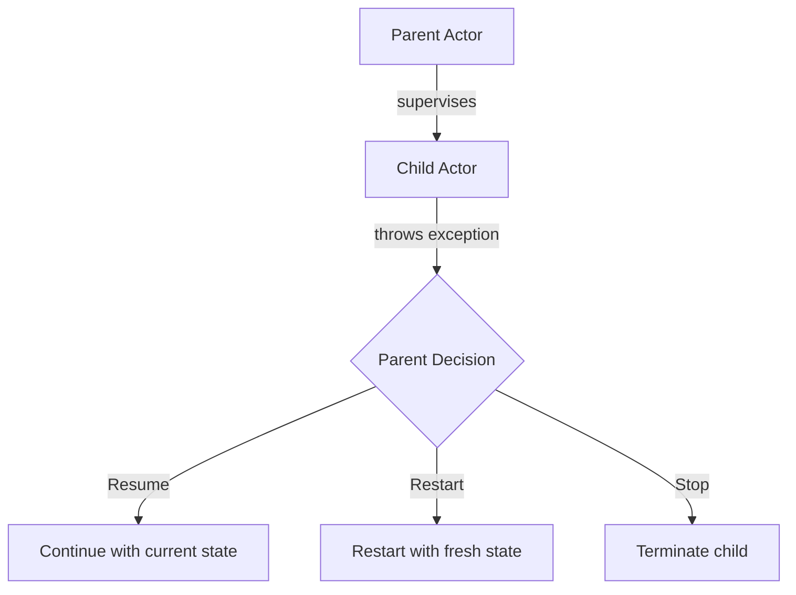
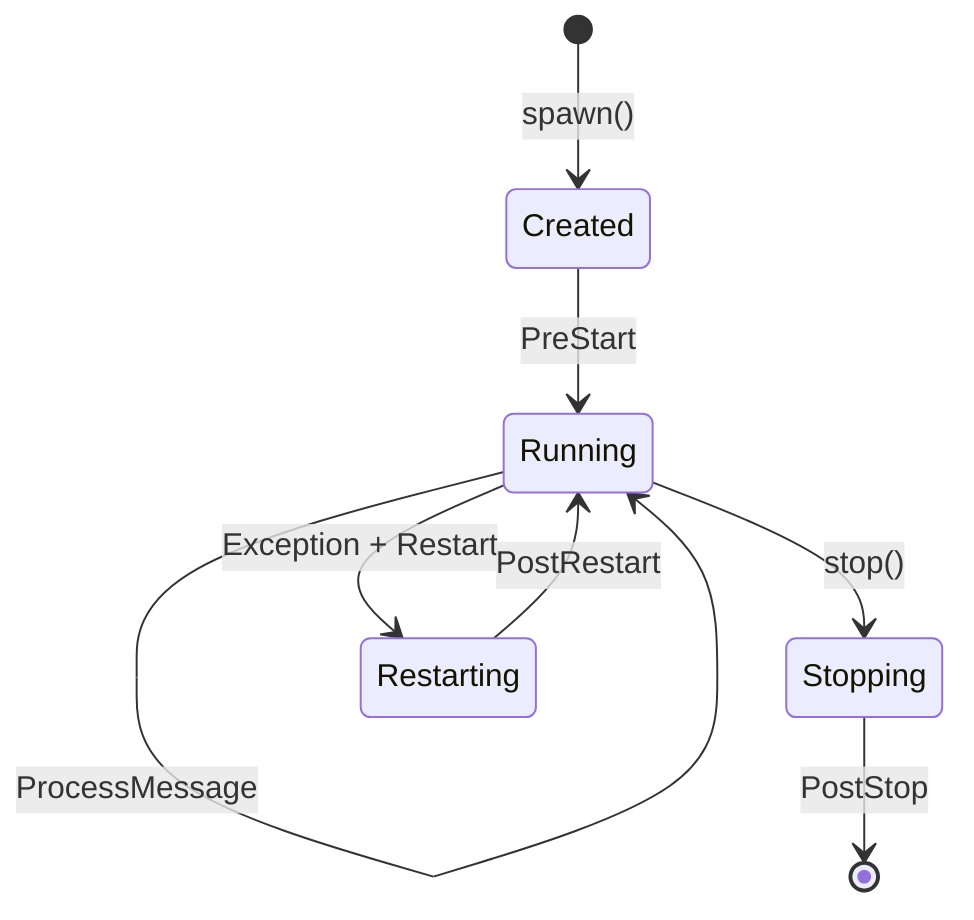

# How to Use Akka for Actor-Based Concurrency

Author: [nawazdhandala](https://www.github.com/nawazdhandala)

Tags: Scala, Akka, Actors, Concurrency, JVM

Description: A practical guide to building concurrent applications in Scala using Akka's actor model, covering actor creation, message passing, supervision strategies, and production patterns.

---

> The actor model provides a fundamentally different approach to concurrency. Instead of sharing mutable state between threads, actors encapsulate state and communicate through asynchronous messages. This guide shows you how to build robust concurrent systems with Akka in Scala.

Traditional multi-threaded programming forces you to think about locks, race conditions, and deadlocks. Akka actors flip this model - each actor processes one message at a time, owns its internal state, and never shares it directly with other actors. The result is concurrent code that is easier to reason about and debug.

---

## Why Choose the Actor Model

When building concurrent applications, you typically face these challenges:

| Traditional Threading | Actor Model |
|----------------------|-------------|
| Shared mutable state | Isolated state per actor |
| Manual synchronization with locks | No explicit locking needed |
| Debugging race conditions | Deterministic message processing |
| Complex error handling | Built-in supervision hierarchies |
| Difficult to scale | Location-transparent scaling |

The actor model simplifies concurrent programming by treating "everything as an actor" that communicates through messages.

---

## Setting Up Your Project

Add Akka dependencies to your build.sbt file. We are using Akka Typed, which is the modern API that provides stronger type safety compared to classic Akka.

```sbt
// build.sbt
// Define the Akka version as a variable for consistency
val AkkaVersion = "2.9.0"

libraryDependencies ++= Seq(
  // Core Akka Typed library for actor-based concurrency
  "com.typesafe.akka" %% "akka-actor-typed" % AkkaVersion,

  // Logging integration for Akka actors
  "com.typesafe.akka" %% "akka-slf4j" % AkkaVersion,

  // Logback for actual log output
  "ch.qos.logback" % "logback-classic" % "1.4.14",

  // Testing utilities for Akka actors
  "com.typesafe.akka" %% "akka-actor-testkit-typed" % AkkaVersion % Test
)
```

---

## Understanding Actor Basics

### The Actor Hierarchy

Akka actors form a hierarchy where every actor has exactly one parent. When you create an actor, it becomes a child of the actor that created it. This hierarchy is fundamental to Akka's supervision model.



### Creating Your First Actor

This example creates a simple greeter actor that responds to two types of messages. Akka Typed uses sealed traits to define the message protocol, giving you compile-time safety.

```scala
// Greeter.scala
// Import core Akka Typed components for building actors
import akka.actor.typed.{ActorRef, ActorSystem, Behavior}
import akka.actor.typed.scaladsl.Behaviors

// Define a sealed trait for all messages this actor can handle
// Using sealed ensures the compiler can verify exhaustive pattern matching
sealed trait GreeterCommand

// Message to greet someone, includes a reply-to reference for the response
final case class Greet(name: String, replyTo: ActorRef[GreeterResponse]) extends GreeterCommand

// Message to change the greeting template
final case class ChangeGreeting(newGreeting: String) extends GreeterCommand

// Response message sent back to the requester
final case class GreeterResponse(message: String)

object Greeter {
  // Factory method to create the actor behavior with initial greeting
  def apply(greeting: String = "Hello"): Behavior[GreeterCommand] = {
    // Behaviors.receive creates a stateful actor that can handle messages
    Behaviors.receive { (context, message) =>
      message match {
        // Handle greet requests by sending a response back
        case Greet(name, replyTo) =>
          // Log the greeting action using the actor's built-in logger
          context.log.info(s"Greeting $name with: $greeting")
          // Send response to the actor that requested the greeting
          replyTo ! GreeterResponse(s"$greeting, $name!")
          // Return the same behavior - actor continues with current state
          Behaviors.same

        // Handle requests to change the greeting template
        case ChangeGreeting(newGreeting) =>
          context.log.info(s"Changing greeting from '$greeting' to '$newGreeting'")
          // Return a NEW behavior with updated greeting - this is how state changes
          Greeter(newGreeting)
      }
    }
  }
}
```

### Running the Actor

This shows how to create an ActorSystem and spawn actors within it. The guardian actor is the entry point that spawns child actors for your application logic.

```scala
// Main.scala
// Main entry point for starting the actor system
import akka.actor.typed.{ActorSystem, Behavior}
import akka.actor.typed.scaladsl.Behaviors

object Main extends App {
  // Define the guardian actor behavior that bootstraps our application
  val guardianBehavior: Behavior[Nothing] = Behaviors.setup[Nothing] { context =>
    // Spawn the greeter actor as a child of the guardian
    // The name "greeter" is used for logging and lookup
    val greeter = context.spawn(Greeter("Hello"), "greeter")

    // Spawn a temporary actor to receive the response
    val replyActor = context.spawn(
      Behaviors.receiveMessage[GreeterResponse] { response =>
        // Print the response when received
        println(s"Received: ${response.message}")
        // Stop this actor after receiving the response
        Behaviors.stopped
      },
      "reply-handler"
    )

    // Send a greet message to the greeter actor
    greeter ! Greet("World", replyActor)

    // Guardian keeps running with empty behavior
    Behaviors.empty
  }

  // Create and start the actor system with our guardian
  // The system name appears in logs and remote addressing
  val system = ActorSystem[Nothing](guardianBehavior, "greeter-system")
}
```

---

## Message Patterns

### Request-Response with Ask Pattern

When you need to wait for a response, use the ask pattern. This converts actor message passing into a Future, which is useful for integrating actors with synchronous code or HTTP endpoints.

```scala
// AskPattern.scala
// Demonstrates the ask pattern for request-response interactions
import akka.actor.typed.{ActorRef, ActorSystem, Behavior}
import akka.actor.typed.scaladsl.{Behaviors, AskPattern}
import akka.util.Timeout
import scala.concurrent.duration._
import scala.concurrent.{ExecutionContext, Future}
import scala.util.{Success, Failure}

// Message protocol for a user service
sealed trait UserCommand
final case class GetUser(userId: String, replyTo: ActorRef[UserResponse]) extends UserCommand
final case class CreateUser(name: String, email: String, replyTo: ActorRef[UserResponse]) extends UserCommand

// Response types
sealed trait UserResponse
final case class UserFound(user: User) extends UserResponse
final case class UserNotFound(userId: String) extends UserResponse
final case class UserCreated(user: User) extends UserResponse

// Domain model
final case class User(id: String, name: String, email: String)

object UserService {
  def apply(): Behavior[UserCommand] = {
    // Start with empty user storage - using immutable Map
    active(Map.empty)
  }

  private def active(users: Map[String, User]): Behavior[UserCommand] = {
    Behaviors.receive { (context, message) =>
      message match {
        case GetUser(userId, replyTo) =>
          // Look up user and send appropriate response
          users.get(userId) match {
            case Some(user) =>
              context.log.info(s"Found user: ${user.name}")
              replyTo ! UserFound(user)
            case None =>
              context.log.warn(s"User not found: $userId")
              replyTo ! UserNotFound(userId)
          }
          Behaviors.same

        case CreateUser(name, email, replyTo) =>
          // Generate simple ID and create user
          val id = s"user-${users.size + 1}"
          val user = User(id, name, email)
          context.log.info(s"Created user: $name with ID: $id")
          replyTo ! UserCreated(user)
          // Return new behavior with updated users map
          active(users + (id -> user))
      }
    }
  }
}

// Example usage with ask pattern
object UserServiceClient {
  def getUser(
    userService: ActorRef[UserCommand],
    userId: String
  )(implicit system: ActorSystem[_]): Future[UserResponse] = {
    // Import the ask extension method
    import AskPattern._

    // Define timeout for the ask operation
    implicit val timeout: Timeout = 3.seconds

    // The ask pattern sends a message and returns a Future of the response
    // The ref => GetUser(...) syntax creates the message with the response ref
    userService.ask(ref => GetUser(userId, ref))
  }
}
```

### Fire and Forget

Not every message needs a response. Use tell (the ! operator) when you want fire-and-forget semantics.

```scala
// FireAndForget.scala
// Example of fire-and-forget messaging for audit logging
sealed trait AuditCommand
final case class LogAction(
  userId: String,
  action: String,
  timestamp: Long
) extends AuditCommand

object AuditLogger {
  def apply(): Behavior[AuditCommand] = {
    Behaviors.receive { (context, message) =>
      message match {
        case LogAction(userId, action, timestamp) =>
          // Process the audit log - no response needed
          context.log.info(s"AUDIT: User $userId performed '$action' at $timestamp")
          // In production, you would persist this to a database
          Behaviors.same
      }
    }
  }
}

// Usage - fire and forget, no waiting for response
object AuditExample {
  def logUserAction(
    auditLogger: ActorRef[AuditCommand],
    userId: String,
    action: String
  ): Unit = {
    // Tell pattern - send message and continue immediately
    auditLogger ! LogAction(userId, action, System.currentTimeMillis())
    // Execution continues without waiting
  }
}
```

---

## Supervision and Fault Tolerance

### Supervision Strategies

Akka's supervision model is one of its most powerful features. When a child actor fails, the parent decides how to handle it. This creates resilient systems that can recover from failures automatically.



This example shows how to configure supervision strategies for different types of failures. The supervisor watches its children and applies different recovery policies based on the exception type.

```scala
// Supervision.scala
// Demonstrates supervision strategies for fault-tolerant actor hierarchies
import akka.actor.typed.{ActorRef, Behavior, SupervisorStrategy}
import akka.actor.typed.scaladsl.Behaviors
import scala.concurrent.duration._

// Commands for a payment processor
sealed trait PaymentCommand
final case class ProcessPayment(
  orderId: String,
  amount: BigDecimal,
  replyTo: ActorRef[PaymentResult]
) extends PaymentCommand

sealed trait PaymentResult
final case class PaymentSuccess(transactionId: String) extends PaymentResult
final case class PaymentFailed(reason: String) extends PaymentResult

// Custom exceptions for different failure scenarios
class TransientNetworkError(msg: String) extends Exception(msg)
class InvalidPaymentError(msg: String) extends Exception(msg)
class FatalDatabaseError(msg: String) extends Exception(msg)

object PaymentProcessor {
  def apply(): Behavior[PaymentCommand] = {
    Behaviors.supervise(
      // Inner behavior wrapped with supervision
      Behaviors.supervise(
        processPayments()
      )
      // Restart on transient errors with backoff to avoid overwhelming services
      .onFailure[TransientNetworkError](
        SupervisorStrategy.restartWithBackoff(
          minBackoff = 1.second,    // Initial delay before restart
          maxBackoff = 30.seconds,  // Maximum delay between restarts
          randomFactor = 0.2        // Add randomness to prevent thundering herd
        )
      )
    )
    // Stop the actor on fatal errors - requires manual intervention
    .onFailure[FatalDatabaseError](SupervisorStrategy.stop)
  }

  private def processPayments(): Behavior[PaymentCommand] = {
    Behaviors.receive { (context, message) =>
      message match {
        case ProcessPayment(orderId, amount, replyTo) =>
          context.log.info(s"Processing payment for order $orderId: $amount")

          // Simulate payment processing with potential failures
          try {
            val transactionId = simulatePayment(orderId, amount)
            replyTo ! PaymentSuccess(transactionId)
          } catch {
            case e: InvalidPaymentError =>
              // Invalid payments are not retried - respond with failure
              context.log.warn(s"Invalid payment: ${e.getMessage}")
              replyTo ! PaymentFailed(e.getMessage)
            case e: TransientNetworkError =>
              // Re-throw to trigger supervision restart
              throw e
          }
          Behaviors.same
      }
    }
  }

  private def simulatePayment(orderId: String, amount: BigDecimal): String = {
    // Simulated payment logic
    s"txn-${orderId.hashCode.abs}"
  }
}
```

### Watch and Death Pact

Actors can watch other actors and receive notifications when they terminate. This is useful for cleanup and managing dependent actors.

```scala
// DeathWatch.scala
// Demonstrates actor watching for lifecycle management
import akka.actor.typed.{ActorRef, Behavior, Terminated}
import akka.actor.typed.scaladsl.Behaviors

sealed trait PoolCommand
final case class ProcessJob(job: String) extends PoolCommand
private final case class WorkerTerminated(worker: ActorRef[String]) extends PoolCommand

object WorkerPool {
  def apply(poolSize: Int): Behavior[PoolCommand] = {
    Behaviors.setup { context =>
      // Create worker actors and watch them for termination
      val workers = (1 to poolSize).map { i =>
        val worker = context.spawn(Worker(), s"worker-$i")
        // Watch the worker - we will be notified if it terminates
        context.watch(worker)
        worker
      }.toVector

      context.log.info(s"Started worker pool with $poolSize workers")

      // Start with first worker in round-robin
      active(workers, 0)
    }
  }

  private def active(
    workers: Vector[ActorRef[String]],
    currentIndex: Int
  ): Behavior[PoolCommand] = {
    Behaviors.receive[PoolCommand] { (context, message) =>
      message match {
        case ProcessJob(job) if workers.nonEmpty =>
          // Round-robin distribution to workers
          val worker = workers(currentIndex % workers.size)
          worker ! job
          active(workers, currentIndex + 1)

        case ProcessJob(job) if workers.isEmpty =>
          context.log.error(s"No workers available to process job: $job")
          Behaviors.same

        case WorkerTerminated(worker) =>
          // Remove the terminated worker from the pool
          val remaining = workers.filterNot(_ == worker)
          context.log.warn(s"Worker terminated. Remaining workers: ${remaining.size}")

          if (remaining.isEmpty) {
            context.log.error("All workers terminated. Stopping pool.")
            Behaviors.stopped
          } else {
            active(remaining, currentIndex)
          }
      }
    }
    // Handle Terminated signal by mapping it to our protocol
    .receiveSignal {
      case (context, Terminated(ref)) =>
        context.self ! WorkerTerminated(ref.unsafeUpcast[String])
        Behaviors.same
    }
  }
}

object Worker {
  def apply(): Behavior[String] = {
    Behaviors.receive { (context, job) =>
      context.log.info(s"Processing job: $job")
      // Simulate work
      Thread.sleep(100)
      Behaviors.same
    }
  }
}
```

---

## Actor Lifecycle

Understanding the actor lifecycle helps you manage resources properly and implement clean shutdown behavior.



This example shows how to handle lifecycle events for proper resource management, such as closing database connections or flushing buffers when an actor stops.

```scala
// Lifecycle.scala
// Demonstrates actor lifecycle hooks for resource management
import akka.actor.typed.{Behavior, PostStop, PreRestart}
import akka.actor.typed.scaladsl.Behaviors
import java.io.{BufferedWriter, FileWriter}

sealed trait FileWriterCommand
final case class WriteLine(text: String) extends FileWriterCommand
case object Flush extends FileWriterCommand

object FileWriterActor {
  def apply(filename: String): Behavior[FileWriterCommand] = {
    Behaviors.setup { context =>
      // Resource initialization happens in setup
      context.log.info(s"Opening file: $filename")
      val writer = new BufferedWriter(new FileWriter(filename, true))

      // Inner behavior with resource reference
      Behaviors.receiveMessage[FileWriterCommand] {
        case WriteLine(text) =>
          writer.write(text)
          writer.newLine()
          Behaviors.same

        case Flush =>
          writer.flush()
          Behaviors.same
      }
      // Handle lifecycle signals for cleanup
      .receiveSignal {
        case (context, PostStop) =>
          // Called when actor is stopped normally
          context.log.info(s"Closing file: $filename")
          writer.flush()
          writer.close()
          Behaviors.same

        case (context, PreRestart) =>
          // Called before restart due to failure
          context.log.warn(s"Flushing before restart: $filename")
          writer.flush()
          writer.close()
          Behaviors.same
      }
    }
  }
}
```

---

## Timers and Scheduling

Actors often need to perform periodic tasks or schedule delayed actions. Akka provides timer functionality built into the actor behavior.

```scala
// Timers.scala
// Demonstrates scheduled and periodic messages within actors
import akka.actor.typed.{ActorRef, Behavior}
import akka.actor.typed.scaladsl.{Behaviors, TimerScheduler}
import scala.concurrent.duration._

sealed trait CacheCommand
final case class Put(key: String, value: String) extends CacheCommand
final case class Get(key: String, replyTo: ActorRef[Option[String]]) extends CacheCommand
private case object EvictExpired extends CacheCommand
private final case class ExpireKey(key: String) extends CacheCommand

object TimedCache {
  // Time-to-live for cache entries
  private val TTL = 5.minutes
  // How often to check for expired entries
  private val EvictionInterval = 1.minute

  def apply(): Behavior[CacheCommand] = {
    Behaviors.setup { context =>
      // withTimers provides access to the timer scheduler
      Behaviors.withTimers { timers =>
        // Schedule periodic eviction checks
        timers.startTimerWithFixedDelay(
          key = "eviction",           // Timer key for cancellation
          msg = EvictExpired,         // Message to send
          delay = EvictionInterval    // Interval between messages
        )

        context.log.info("Cache started with periodic eviction")
        active(timers, Map.empty, Map.empty)
      }
    }
  }

  private def active(
    timers: TimerScheduler[CacheCommand],
    cache: Map[String, String],
    expiration: Map[String, Long]
  ): Behavior[CacheCommand] = {
    Behaviors.receive { (context, message) =>
      val now = System.currentTimeMillis()

      message match {
        case Put(key, value) =>
          context.log.debug(s"Caching key: $key")

          // Schedule expiration for this specific key
          timers.startSingleTimer(
            key = s"expire-$key",     // Unique timer key per cache entry
            msg = ExpireKey(key),     // Message to expire this key
            delay = TTL               // Delay before expiration
          )

          // Update cache and expiration time
          active(
            timers,
            cache + (key -> value),
            expiration + (key -> (now + TTL.toMillis))
          )

        case Get(key, replyTo) =>
          // Return cached value if exists and not expired
          val value = cache.get(key).filter { _ =>
            expiration.get(key).exists(_ > now)
          }
          replyTo ! value
          Behaviors.same

        case ExpireKey(key) =>
          // Remove specific expired key
          context.log.debug(s"Expiring key: $key")
          active(
            timers,
            cache - key,
            expiration - key
          )

        case EvictExpired =>
          // Bulk eviction of all expired entries
          val expired = expiration.filter(_._2 <= now).keySet
          if (expired.nonEmpty) {
            context.log.info(s"Evicting ${expired.size} expired entries")
          }
          active(
            timers,
            cache -- expired,
            expiration -- expired
          )
      }
    }
  }
}
```

---

## Routing and Load Distribution

For scaling actors across multiple instances, Akka provides built-in routers that distribute messages using various strategies.

```scala
// Routing.scala
// Demonstrates router patterns for load distribution
import akka.actor.typed.{ActorRef, Behavior, SupervisorStrategy}
import akka.actor.typed.scaladsl.{Behaviors, Routers}

sealed trait TaskCommand
final case class ProcessTask(taskId: String, payload: String) extends TaskCommand

object TaskWorker {
  def apply(): Behavior[TaskCommand] = {
    Behaviors.receive { (context, message) =>
      message match {
        case ProcessTask(taskId, payload) =>
          // Log which worker instance handles the task
          context.log.info(s"Worker ${context.self.path.name} processing task $taskId")
          // Simulate work
          Thread.sleep(100)
          Behaviors.same
      }
    }
  }
}

object TaskRouter {
  def poolRouter(poolSize: Int): Behavior[TaskCommand] = {
    // Create a pool router that spawns workers internally
    Routers.pool(poolSize = poolSize) {
      // Wrap workers with supervision for fault tolerance
      Behaviors.supervise(TaskWorker())
        .onFailure[Exception](SupervisorStrategy.restart)
    }
    // Use round-robin routing strategy
    .withRoundRobinRouting()
  }

  def broadcastRouter(workers: Vector[ActorRef[TaskCommand]]): Behavior[TaskCommand] = {
    // Create a group router from existing actor references
    // Group routers route to pre-existing actors
    Routers.group(workers.head, workers.tail: _*)
      // Broadcast sends to ALL routees, not just one
      .withBroadcastPredicate(_ => true)
  }
}

// Usage example
object RouterExample {
  def createRouterSystem(): Behavior[Nothing] = {
    Behaviors.setup[Nothing] { context =>
      // Create a pool of 5 task workers with round-robin routing
      val router = context.spawn(
        TaskRouter.poolRouter(5),
        "task-router"
      )

      // Send tasks - they will be distributed across workers
      (1 to 10).foreach { i =>
        router ! ProcessTask(s"task-$i", s"payload-$i")
      }

      Behaviors.empty
    }
  }
}
```

---

## Testing Actors

Akka provides excellent testing utilities through the TestKit. Here is how to write tests for your actors.

```scala
// ActorTest.scala
// Demonstrates testing patterns for Akka actors
import akka.actor.testkit.typed.scaladsl.{ActorTestKit, TestProbe}
import org.scalatest.BeforeAndAfterAll
import org.scalatest.wordspec.AnyWordSpec
import org.scalatest.matchers.should.Matchers

class UserServiceSpec extends AnyWordSpec with BeforeAndAfterAll with Matchers {
  // Create test kit - manages actor system lifecycle
  val testKit = ActorTestKit()

  override def afterAll(): Unit = {
    // Clean up test kit after all tests complete
    testKit.shutdownTestKit()
  }

  "UserService" should {
    "create a user and return it" in {
      // Spawn the actor under test
      val userService = testKit.spawn(UserService())

      // Create a test probe to receive responses
      val probe = testKit.createTestProbe[UserResponse]()

      // Send message to actor
      userService ! CreateUser("John", "john@example.com", probe.ref)

      // Assert on the response with timeout
      val response = probe.receiveMessage()
      response shouldBe a[UserCreated]
      response.asInstanceOf[UserCreated].user.name shouldBe "John"
    }

    "return UserNotFound for unknown user" in {
      val userService = testKit.spawn(UserService())
      val probe = testKit.createTestProbe[UserResponse]()

      // Query for non-existent user
      userService ! GetUser("unknown-id", probe.ref)

      // Expect not found response
      probe.expectMessage(UserNotFound("unknown-id"))
    }

    "handle multiple messages in sequence" in {
      val userService = testKit.spawn(UserService())
      val probe = testKit.createTestProbe[UserResponse]()

      // Create user first
      userService ! CreateUser("Jane", "jane@example.com", probe.ref)
      val created = probe.expectMessageType[UserCreated]

      // Then retrieve the same user
      userService ! GetUser(created.user.id, probe.ref)
      val found = probe.expectMessageType[UserFound]

      found.user.email shouldBe "jane@example.com"
    }
  }
}
```

---

## Production Best Practices

### Configuration

Configure Akka properly for production environments. Create an application.conf file in your resources directory.

```hocon
# src/main/resources/application.conf
# Production Akka configuration

akka {
  # Use SLF4J for logging integration
  loggers = ["akka.event.slf4j.Slf4jLogger"]
  loglevel = "INFO"
  logging-filter = "akka.event.slf4j.Slf4jLoggingFilter"

  actor {
    # Use the typed actor provider
    provider = "local"

    # Default dispatcher configuration
    default-dispatcher {
      # Fork-join executor for CPU-bound work
      type = "Dispatcher"
      executor = "fork-join-executor"

      fork-join-executor {
        # Min threads to keep alive
        parallelism-min = 8
        # Factor to compute thread count (cores * factor)
        parallelism-factor = 2.0
        # Max threads
        parallelism-max = 64
      }

      # Throughput - messages processed before yielding thread
      throughput = 100
    }

    # Separate dispatcher for blocking operations
    blocking-dispatcher {
      type = "Dispatcher"
      executor = "thread-pool-executor"

      thread-pool-executor {
        fixed-pool-size = 32
      }

      throughput = 1
    }
  }
}
```

### Handling Blocking Operations

Never block in the default dispatcher. Use a dedicated dispatcher for blocking I/O operations.

```scala
// BlockingOperations.scala
// Demonstrates proper handling of blocking operations
import akka.actor.typed.{Behavior, DispatcherSelector}
import akka.actor.typed.scaladsl.Behaviors
import scala.concurrent.{ExecutionContext, Future}

sealed trait DatabaseCommand
final case class Query(sql: String, replyTo: ActorRef[QueryResult]) extends DatabaseCommand

final case class QueryResult(rows: List[Map[String, Any]])

object DatabaseActor {
  def apply(): Behavior[DatabaseCommand] = {
    Behaviors.setup { context =>
      // Get the blocking dispatcher for database operations
      // This prevents blocking the main actor dispatcher
      implicit val blockingEc: ExecutionContext =
        context.system.dispatchers.lookup(
          DispatcherSelector.fromConfig("akka.actor.blocking-dispatcher")
        )

      Behaviors.receiveMessage {
        case Query(sql, replyTo) =>
          // Run blocking database query on separate dispatcher
          Future {
            // Simulated blocking database call
            val result = executeBlockingQuery(sql)
            replyTo ! QueryResult(result)
          }
          Behaviors.same
      }
    }
  }

  private def executeBlockingQuery(sql: String): List[Map[String, Any]] = {
    // Simulated blocking I/O
    Thread.sleep(100)
    List(Map("id" -> 1, "name" -> "Example"))
  }
}
```

---

## Common Patterns Summary

| Pattern | Use Case | Key Point |
|---------|----------|-----------|
| Tell (!) | Fire and forget | Fastest, no response needed |
| Ask (?) | Request-response | Returns Future, needs timeout |
| Supervision | Fault tolerance | Parent decides child fate |
| Watch | Lifecycle management | Notified on termination |
| Timers | Scheduled tasks | Built into actor behavior |
| Routers | Load distribution | Pool or group routing |

---

## Debugging Tips

1. **Enable debug logging** - Set `akka.loglevel = "DEBUG"` temporarily
2. **Use actor paths** - Every actor has a unique path for identification
3. **Check dead letters** - Undelivered messages go to `/deadLetters`
4. **Monitor mailbox size** - Large mailboxes indicate slow processing
5. **Use the TestKit** - Deterministic testing catches race conditions

---

*Building concurrent systems with actors? [OneUptime](https://oneuptime.com) provides comprehensive observability for JVM applications, including distributed tracing across actor systems, metrics collection, and intelligent alerting to keep your Akka applications running smoothly.*

**Related Resources:**
- [Akka Documentation](https://doc.akka.io/docs/akka/current/typed/index.html)
- [Reactive Manifesto](https://www.reactivemanifesto.org/)
