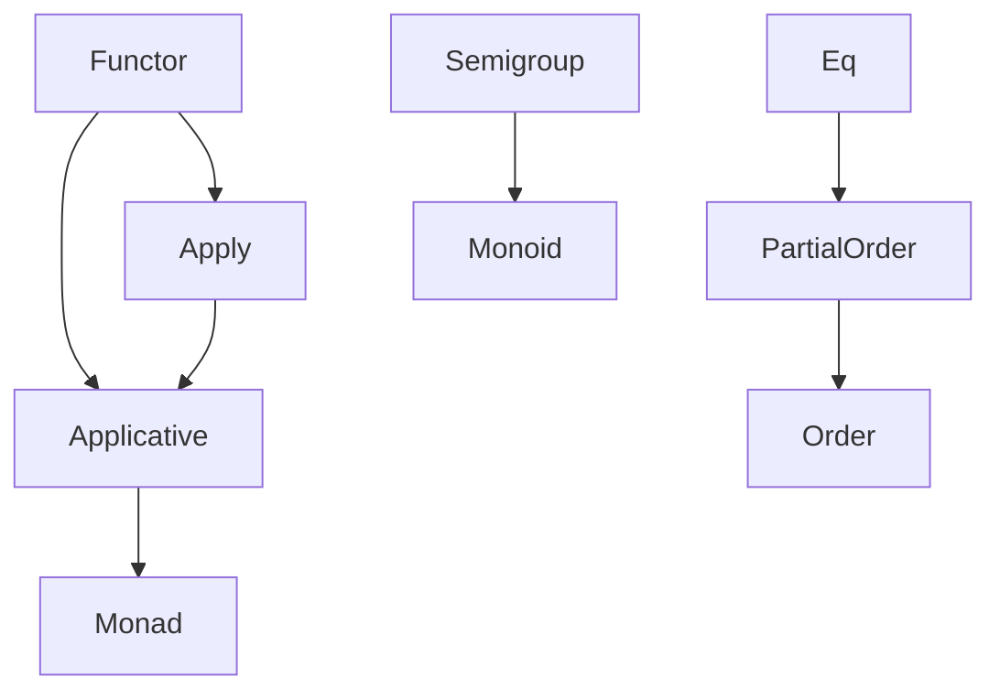
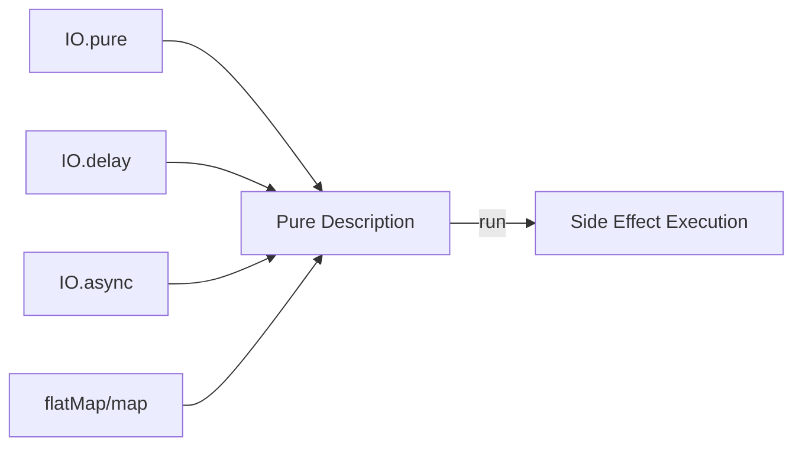
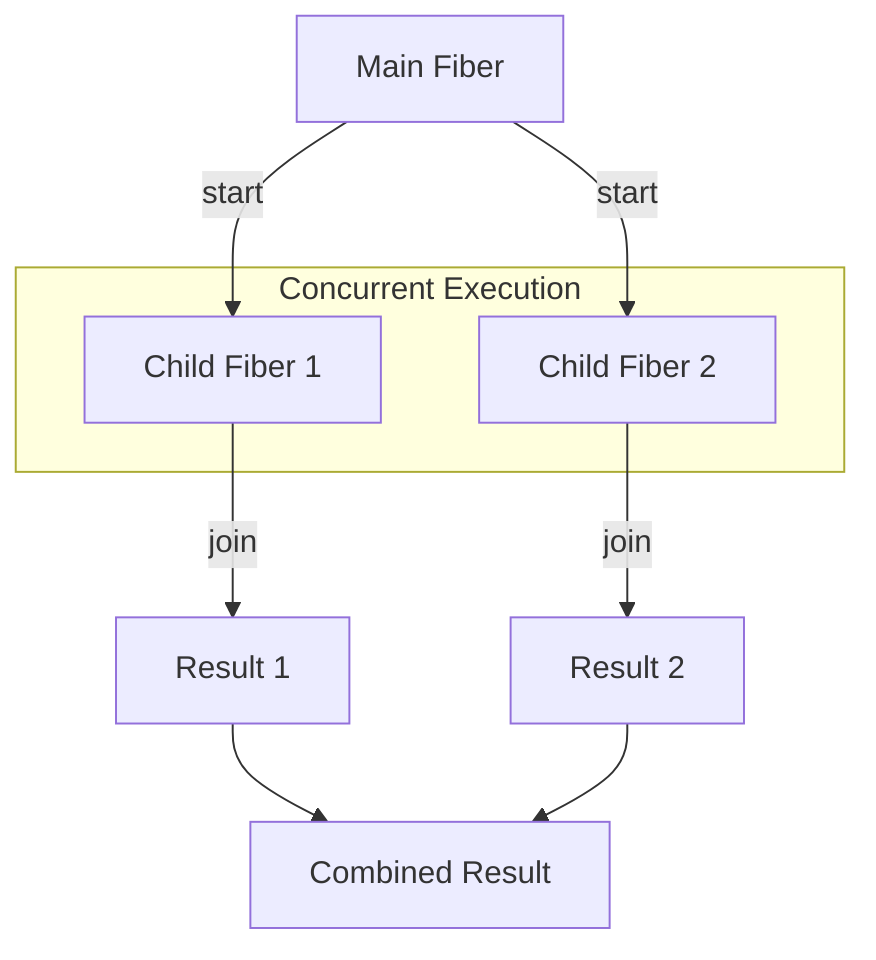

# How to Use Cats and Cats Effect for Functional Programming in Scala

Author: [nawazdhandala](https://www.github.com/nawazdhandala)

Tags: Scala, Cats, Cats Effect, Functional Programming

Description: A comprehensive guide to functional programming in Scala using Cats and Cats Effect. Learn type classes, monads, concurrent programming with IO, resource management, and best practices for building robust applications.

---

> Functional programming offers a powerful paradigm for building reliable, maintainable software. Cats and Cats Effect are two foundational libraries in the Scala ecosystem that bring principled FP abstractions to your codebase. This guide walks you through everything from basic type classes to advanced concurrent programming patterns.

Functional programming (FP) emphasizes immutability, pure functions, and composability. In Scala, the Cats library provides abstract type classes like Functor, Monad, and Applicative, while Cats Effect builds on these to provide safe, composable abstractions for side effects and concurrency.

---

## Why Cats and Cats Effect?

| Feature | Cats | Cats Effect |
|---------|------|-------------|
| **Purpose** | Type classes and abstractions | Effect system for side effects |
| **Core Concept** | Functor, Monad, Applicative | IO monad, Fibers |
| **Use Case** | Data transformation | Async/concurrent programming |
| **Dependencies** | Standalone | Built on Cats |

---

## Setting Up Your Project

Add these dependencies to your build.sbt file to get started with Cats and Cats Effect.

```scala
// build.sbt
// These are the essential dependencies for Cats and Cats Effect

val catsVersion = "2.10.0"
val catsEffectVersion = "3.5.2"

libraryDependencies ++= Seq(
  // Core Cats library for type classes
  "org.typelevel" %% "cats-core" % catsVersion,

  // Cats Effect for IO and concurrency
  "org.typelevel" %% "cats-effect" % catsEffectVersion,

  // Testing support
  "org.typelevel" %% "cats-effect-testing-scalatest" % "1.5.0" % Test
)

// Enable better error messages for implicits
scalacOptions ++= Seq(
  "-feature",
  "-deprecation",
  "-Xfatal-warnings"
)
```

---

## Understanding Type Classes in Cats

Type classes are a core concept in Cats. They define behavior that can be implemented for different types, enabling ad-hoc polymorphism.



### Functor: Mapping Over Containers

A Functor represents types that can be mapped over. The map function transforms the value inside a container without changing the container structure.

```scala
// functor_example.scala
import cats.Functor
import cats.syntax.functor._

// Functor allows you to transform values inside a context
// without changing the context itself

// Using Functor with Option
val optionValue: Option[Int] = Some(42)
val doubled: Option[Int] = optionValue.map(_ * 2)
// Result: Some(84)

// Using Functor with List
val listValues: List[Int] = List(1, 2, 3)
val squaredList: List[Int] = listValues.map(x => x * x)
// Result: List(1, 4, 9)

// Creating a generic function that works with any Functor
def increment[F[_]: Functor](container: F[Int]): F[Int] = {
  // This works with Option, List, Either, IO, and any other Functor
  container.map(_ + 1)
}

// Usage with different container types
val incrementedOption: Option[Int] = increment(Some(10))
// Result: Some(11)

val incrementedList: List[Int] = increment(List(1, 2, 3))
// Result: List(2, 3, 4)

// Nested Functors can be composed
import cats.syntax.nested._

val nestedOption: Option[List[Int]] = Some(List(1, 2, 3))
val nestedDoubled: Option[List[Int]] = Functor[Option].compose[List].map(nestedOption)(_ * 2)
// Result: Some(List(2, 4, 6))
```

### Applicative: Combining Independent Computations

Applicative extends Functor and allows you to apply functions within a context to values within a context.

```scala
// applicative_example.scala
import cats.Applicative
import cats.syntax.applicative._
import cats.syntax.apply._

// Applicative lets you combine independent computations
// and lift values into a context

// Lift a pure value into the Option context
val pureValue: Option[Int] = 42.pure[Option]
// Result: Some(42)

// Combining multiple Options with mapN
case class User(name: String, age: Int, email: String)

val maybeName: Option[String] = Some("Alice")
val maybeAge: Option[Int] = Some(30)
val maybeEmail: Option[String] = Some("alice@example.com")

// Use mapN to combine all three Options into a User
// If any Option is None, the result is None
val maybeUser: Option[User] = (maybeName, maybeAge, maybeEmail).mapN(User.apply)
// Result: Some(User("Alice", 30, "alice@example.com"))

// With a None value, the entire computation fails
val invalidAge: Option[Int] = None
val invalidUser: Option[User] = (maybeName, invalidAge, maybeEmail).mapN(User.apply)
// Result: None

// Applicative is great for validation scenarios
// where you want to accumulate errors
import cats.data.Validated
import cats.data.Validated.{Invalid, Valid}
import cats.syntax.validated._

type ValidationResult[A] = Validated[List[String], A]

def validateName(name: String): ValidationResult[String] =
  if (name.nonEmpty) name.valid
  else List("Name cannot be empty").invalid

def validateAge(age: Int): ValidationResult[Int] =
  if (age >= 0 && age <= 150) age.valid
  else List("Age must be between 0 and 150").invalid

def validateEmail(email: String): ValidationResult[String] =
  if (email.contains("@")) email.valid
  else List("Invalid email format").invalid

// Combine validations and collect all errors
val validatedUser: ValidationResult[User] = (
  validateName("Alice"),
  validateAge(30),
  validateEmail("alice@example.com")
).mapN(User.apply)
// Result: Valid(User("Alice", 30, "alice@example.com"))

// Multiple validation failures are accumulated
val invalidValidation: ValidationResult[User] = (
  validateName(""),
  validateAge(-5),
  validateEmail("invalid")
).mapN(User.apply)
// Result: Invalid(List("Name cannot be empty", "Age must be between 0 and 150", "Invalid email format"))
```

### Monad: Sequencing Dependent Computations

Monad extends Applicative and adds flatMap, allowing you to chain computations where each step depends on the previous result.

```scala
// monad_example.scala
import cats.Monad
import cats.syntax.flatMap._
import cats.syntax.functor._

// Monad lets you chain dependent computations
// where each step relies on the result of the previous

// Simple Option chaining with for-comprehension
def findUser(id: Int): Option[User] =
  if (id > 0) Some(User("Alice", 30, "alice@example.com"))
  else None

def findUserPreferences(user: User): Option[Map[String, String]] =
  Some(Map("theme" -> "dark", "language" -> "en"))

def findRecommendations(prefs: Map[String, String]): Option[List[String]] =
  Some(List("Item A", "Item B", "Item C"))

// Chain dependent computations using for-comprehension
val recommendations: Option[List[String]] = for {
  user <- findUser(1)
  prefs <- findUserPreferences(user)
  recs <- findRecommendations(prefs)
} yield recs
// Result: Some(List("Item A", "Item B", "Item C"))

// Create a generic Monad function
def processSequentially[F[_]: Monad, A, B, C](
  first: F[A],
  second: A => F[B],
  third: B => F[C]
): F[C] = {
  for {
    a <- first
    b <- second(a)
    c <- third(b)
  } yield c
}

// Either monad for error handling with short-circuit behavior
type Result[A] = Either[String, A]

def parseNumber(s: String): Result[Int] =
  s.toIntOption.toRight(s"Cannot parse '$s' as integer")

def divide(a: Int, b: Int): Result[Double] =
  if (b != 0) Right(a.toDouble / b)
  else Left("Division by zero")

def formatResult(d: Double): Result[String] =
  Right(f"Result: $d%.2f")

// Chain Either computations
val calculation: Result[String] = for {
  numerator <- parseNumber("100")
  denominator <- parseNumber("4")
  quotient <- divide(numerator, denominator)
  formatted <- formatResult(quotient)
} yield formatted
// Result: Right("Result: 25.00")

// Short-circuit on first error
val failedCalculation: Result[String] = for {
  numerator <- parseNumber("abc")  // Fails here
  denominator <- parseNumber("4")
  quotient <- divide(numerator, denominator)
  formatted <- formatResult(quotient)
} yield formatted
// Result: Left("Cannot parse 'abc' as integer")
```

---

## Introduction to Cats Effect IO

The IO monad in Cats Effect represents a description of a computation that may perform side effects. It does not execute until explicitly run, making effects pure and composable.



### Creating IO Values

IO values can be created from pure values, delayed computations, or asynchronous callbacks.

```scala
// io_basics.scala
import cats.effect.IO
import cats.effect.unsafe.implicits.global

// IO represents a description of a computation
// It is lazy and referentially transparent

// Create an IO from a pure value (no side effects)
val pureIO: IO[Int] = IO.pure(42)
// No computation happens yet

// Create an IO from a side-effecting computation
// IO.delay suspends the effect until run
val effectfulIO: IO[Unit] = IO.delay {
  println("This side effect is suspended")
}

// IO.println is a convenient shorthand
val printIO: IO[Unit] = IO.println("Hello, Cats Effect!")

// Combine IO operations using map and flatMap
val combinedIO: IO[String] = for {
  _ <- IO.println("Starting computation...")
  a <- IO.pure(10)
  b <- IO.pure(20)
  _ <- IO.println(s"Adding $a and $b")
  sum = a + b
  _ <- IO.println(s"Sum is $sum")
} yield s"The result is $sum"

// Nothing has executed yet! IO is just a description
// Run the IO to execute the effects
val result: String = combinedIO.unsafeRunSync()
// Output:
// Starting computation...
// Adding 10 and 20
// Sum is 30
// Result: "The result is 30"

// Error handling with IO
val failingIO: IO[Int] = IO.raiseError(new RuntimeException("Something went wrong"))

val recoveredIO: IO[Int] = failingIO.handleErrorWith { error =>
  IO.println(s"Caught error: ${error.getMessage}") *>
  IO.pure(-1)  // Return default value
}

// Attempt converts errors to Either
val attemptedIO: IO[Either[Throwable, Int]] = failingIO.attempt
// Result: IO(Left(RuntimeException("Something went wrong")))
```

### Resource Management with Resource

The Resource type ensures that resources are properly acquired and released, even in the presence of errors or cancellation.

```scala
// resource_management.scala
import cats.effect.{IO, Resource}
import java.io.{BufferedReader, FileReader, BufferedWriter, FileWriter}

// Resource guarantees cleanup even if computation fails or is cancelled
// It follows the bracket pattern: acquire -> use -> release

// Create a Resource for a file reader
def fileReader(path: String): Resource[IO, BufferedReader] = {
  Resource.make(
    // Acquire: Open the file
    IO.blocking {
      println(s"Opening file: $path")
      new BufferedReader(new FileReader(path))
    }
  )(
    // Release: Always close the file
    reader => IO.blocking {
      println(s"Closing file: $path")
      reader.close()
    }
  )
}

// Create a Resource for a file writer
def fileWriter(path: String): Resource[IO, BufferedWriter] = {
  Resource.make(
    IO.blocking {
      println(s"Opening writer: $path")
      new BufferedWriter(new FileWriter(path))
    }
  )(
    writer => IO.blocking {
      println(s"Closing writer: $path")
      writer.close()
    }
  )
}

// Resources compose naturally
// Both files will be properly closed even if copying fails
def copyFile(source: String, dest: String): IO[Unit] = {
  val resources: Resource[IO, (BufferedReader, BufferedWriter)] = for {
    reader <- fileReader(source)
    writer <- fileWriter(dest)
  } yield (reader, writer)

  resources.use { case (reader, writer) =>
    IO.blocking {
      var line = reader.readLine()
      while (line != null) {
        writer.write(line)
        writer.newLine()
        line = reader.readLine()
      }
    }
  }
}

// Using Resource.fromAutoCloseable for Java resources
def autoCloseableReader(path: String): Resource[IO, BufferedReader] = {
  Resource.fromAutoCloseable(
    IO.blocking(new BufferedReader(new FileReader(path)))
  )
}

// Multiple resources can be combined
def processMultipleFiles(paths: List[String]): Resource[IO, List[BufferedReader]] = {
  paths.traverse(path => fileReader(path))
}
```

---

## Concurrent Programming with Cats Effect

Cats Effect provides powerful primitives for concurrent programming, including fibers, races, and parallel execution.



### Fibers: Lightweight Threads

Fibers are lightweight, cooperative threads managed by Cats Effect. They are much cheaper than OS threads.

```scala
// fibers_example.scala
import cats.effect.{IO, Fiber}
import cats.syntax.parallel._
import scala.concurrent.duration._

// A Fiber is a lightweight thread managed by Cats Effect
// Fibers are cooperative and non-blocking

// Start a fiber that runs concurrently
val fiber: IO[Fiber[IO, Throwable, String]] = IO.println("Starting task...").flatMap { _ =>
  val task: IO[String] = for {
    _ <- IO.sleep(1.second)
    _ <- IO.println("Task completed!")
  } yield "Result"

  // Start returns immediately, task runs in background
  task.start
}

// Fork and join pattern
val forkJoin: IO[String] = for {
  fib <- IO.println("Starting...") *> IO.sleep(500.millis).as("Done").start
  _ <- IO.println("Fiber started, doing other work...")
  _ <- IO.sleep(100.millis)
  result <- fib.join.flatMap {
    case outcome if outcome.isSuccess =>
      outcome.fold(
        IO.pure("Cancelled"),
        error => IO.pure(s"Failed: ${error.getMessage}"),
        success => success
      )
    case _ => IO.pure("Unknown outcome")
  }
} yield result

// Cancel a fiber
val cancellation: IO[Unit] = for {
  fib <- (IO.sleep(10.seconds) *> IO.println("This won't print")).start
  _ <- IO.sleep(100.millis)
  _ <- IO.println("Cancelling fiber...")
  _ <- fib.cancel
  _ <- IO.println("Fiber cancelled")
} yield ()
```

### Parallel Execution

Execute independent computations in parallel using parMapN, parSequence, and parTraverse.

```scala
// parallel_execution.scala
import cats.effect.IO
import cats.syntax.parallel._
import scala.concurrent.duration._

// Simulate an API call with latency
def fetchUserData(userId: Int): IO[String] =
  IO.sleep(500.millis) *> IO.pure(s"User data for $userId")

def fetchUserOrders(userId: Int): IO[List[String]] =
  IO.sleep(700.millis) *> IO.pure(List("Order1", "Order2"))

def fetchUserPreferences(userId: Int): IO[Map[String, String]] =
  IO.sleep(300.millis) *> IO.pure(Map("theme" -> "dark"))

// Sequential execution takes 1.5 seconds
val sequential: IO[(String, List[String], Map[String, String])] = for {
  userData <- fetchUserData(1)
  orders <- fetchUserOrders(1)
  prefs <- fetchUserPreferences(1)
} yield (userData, orders, prefs)

// Parallel execution takes only 700ms (the longest operation)
val parallel: IO[(String, List[String], Map[String, String])] = (
  fetchUserData(1),
  fetchUserOrders(1),
  fetchUserPreferences(1)
).parMapN((userData, orders, prefs) => (userData, orders, prefs))

// parSequence runs a list of IOs in parallel
val userIds = List(1, 2, 3, 4, 5)

// Sequential: 2.5 seconds (5 * 500ms)
val sequentialFetch: IO[List[String]] = userIds.map(fetchUserData).sequence

// Parallel: 500ms (all run at once)
val parallelFetch: IO[List[String]] = userIds.parTraverse(fetchUserData)

// parTraverse combines map and parSequence
val processedUsers: IO[List[String]] = userIds.parTraverse { id =>
  fetchUserData(id).map(_.toUpperCase)
}

// Control parallelism with parTraverseN to limit concurrent operations
val limitedParallel: IO[List[String]] = userIds.parTraverseN(2)(fetchUserData)
// Only 2 requests run at a time
```

### Racing and Timeouts

Race multiple computations and take the first result, or add timeouts to operations.

```scala
// racing_timeouts.scala
import cats.effect.IO
import scala.concurrent.duration._

// Race two IOs and take the first result
val fast: IO[String] = IO.sleep(100.millis) *> IO.pure("Fast wins!")
val slow: IO[String] = IO.sleep(1.second) *> IO.pure("Slow loses")

// race returns Either with the winner
val raceResult: IO[Either[String, String]] = IO.race(fast, slow)
// Result: Left("Fast wins!")

// racePair gives access to both fibers
val racePairResult: IO[String] = IO.racePair(fast, slow).flatMap {
  case Left((result, loserFiber)) =>
    loserFiber.cancel.as(result)  // Cancel the loser
  case Right((winnerFiber, result)) =>
    winnerFiber.cancel.as(result)
}

// Add timeout to an operation
def expensiveOperation: IO[String] =
  IO.sleep(5.seconds) *> IO.pure("Completed")

val withTimeout: IO[String] = expensiveOperation
  .timeout(1.second)
  .handleError(_ => "Operation timed out")

// timeoutTo provides a fallback value
val withFallback: IO[String] = expensiveOperation
  .timeoutTo(1.second, IO.pure("Fallback value"))

// Retry with exponential backoff
def retryWithBackoff[A](
  io: IO[A],
  maxRetries: Int,
  initialDelay: FiniteDuration
): IO[A] = {
  io.handleErrorWith { error =>
    if (maxRetries > 0) {
      IO.println(s"Retrying after ${initialDelay}... ($maxRetries attempts left)") *>
      IO.sleep(initialDelay) *>
      retryWithBackoff(io, maxRetries - 1, initialDelay * 2)
    } else {
      IO.raiseError(error)
    }
  }
}

// Usage
val unreliableOperation: IO[String] = IO.raiseError(new RuntimeException("Temporary failure"))
val withRetry: IO[String] = retryWithBackoff(unreliableOperation, 3, 100.millis)
```

---

## Concurrent Data Structures

Cats Effect provides thread-safe data structures for concurrent programming.

### Ref: Mutable Reference

Ref provides a thread-safe mutable reference that can be atomically updated.

```scala
// ref_example.scala
import cats.effect.{IO, Ref}
import cats.syntax.parallel._

// Ref is a purely functional mutable reference
// All operations are atomic and thread-safe

// Create a counter using Ref
def counter: IO[Unit] = for {
  ref <- Ref.of[IO, Int](0)

  // Increment 1000 times in parallel
  _ <- (1 to 1000).toList.parTraverse_ { _ =>
    ref.update(_ + 1)
  }

  finalValue <- ref.get
  _ <- IO.println(s"Final count: $finalValue")
  // Result: Final count: 1000 (always correct due to atomic updates)
} yield ()

// modify returns the old value and updates atomically
def getAndIncrement(ref: Ref[IO, Int]): IO[Int] = {
  ref.getAndUpdate(_ + 1)
}

// modify with custom logic
def conditionalUpdate(ref: Ref[IO, Int]): IO[String] = {
  ref.modify { current =>
    if (current < 100) (current + 1, s"Updated to ${current + 1}")
    else (current, "Limit reached")
  }
}

// Practical example: Rate limiter using Ref
import scala.concurrent.duration._

case class RateLimiterState(
  tokens: Int,
  lastRefill: Long
)

def rateLimiter(
  maxTokens: Int,
  refillRate: Int,
  refillPeriod: FiniteDuration
): IO[IO[Boolean]] = {
  val initialState = RateLimiterState(maxTokens, System.currentTimeMillis())

  Ref.of[IO, RateLimiterState](initialState).map { ref =>
    ref.modify { state =>
      val now = System.currentTimeMillis()
      val elapsed = now - state.lastRefill
      val periodsElapsed = elapsed / refillPeriod.toMillis

      val newTokens = math.min(
        maxTokens,
        state.tokens + (periodsElapsed * refillRate).toInt
      )
      val newLastRefill = if (periodsElapsed > 0) now else state.lastRefill

      if (newTokens > 0) {
        (RateLimiterState(newTokens - 1, newLastRefill), true)
      } else {
        (state, false)
      }
    }
  }
}
```

### Deferred: Promise-like Synchronization

Deferred is a synchronization primitive that represents a value that may not yet be available.

```scala
// deferred_example.scala
import cats.effect.{IO, Deferred}
import cats.syntax.parallel._
import scala.concurrent.duration._

// Deferred is a purely functional promise
// It can be completed exactly once

// Basic usage: producer-consumer pattern
def producerConsumer: IO[Unit] = for {
  deferred <- Deferred[IO, String]

  // Consumer waits for the value
  consumer = deferred.get.flatMap(value => IO.println(s"Got: $value"))

  // Producer completes the deferred after delay
  producer = IO.sleep(500.millis) *>
    IO.println("Producing value...") *>
    deferred.complete("Hello from producer!")

  // Run both in parallel
  _ <- (consumer, producer).parTupled
} yield ()

// Coordinate multiple fibers
def coordinatedTask: IO[Unit] = for {
  startSignal <- Deferred[IO, Unit]

  // Multiple workers wait for the start signal
  workers = (1 to 5).toList.parTraverse_ { id =>
    startSignal.get *> IO.println(s"Worker $id started")
  }

  // Coordinator releases all workers at once
  coordinator = for {
    _ <- IO.println("Preparing...")
    _ <- IO.sleep(1.second)
    _ <- IO.println("Go!")
    _ <- startSignal.complete(())
  } yield ()

  _ <- (workers, coordinator).parTupled
} yield ()

// One-time initialization pattern
def lazyInit[A](init: IO[A]): IO[IO[A]] = {
  for {
    state <- Ref.of[IO, Option[Deferred[IO, A]]](None)
  } yield {
    state.modify {
      case Some(deferred) =>
        // Already initialized, just wait
        (Some(deferred), deferred.get)
      case None =>
        // Need to initialize
        val newDeferred = Deferred.unsafe[IO, A]
        val initAndComplete = init.flatMap(a => newDeferred.complete(a).as(a))
        (Some(newDeferred), initAndComplete)
    }.flatten
  }
}
```

### Queue: Concurrent Message Passing

Queue provides a thread-safe bounded or unbounded queue for message passing between fibers.

```scala
// queue_example.scala
import cats.effect.std.Queue
import cats.effect.IO
import cats.syntax.parallel._
import scala.concurrent.duration._

// Queue provides async message passing between fibers

// Bounded queue with backpressure
def boundedQueueExample: IO[Unit] = for {
  queue <- Queue.bounded[IO, String](capacity = 10)

  // Producer adds items (blocks when full)
  producer = (1 to 20).toList.traverse_ { i =>
    queue.offer(s"Item $i") *> IO.println(s"Produced item $i")
  }

  // Consumer takes items (blocks when empty)
  consumer = (1 to 20).toList.traverse_ { _ =>
    queue.take.flatMap(item => IO.println(s"Consumed: $item")) *>
    IO.sleep(100.millis)  // Simulate slow consumer
  }

  _ <- (producer, consumer).parTupled
} yield ()

// Work distribution pattern
def workDistribution: IO[Unit] = for {
  workQueue <- Queue.unbounded[IO, Int]

  // Multiple workers process items from the queue
  workers = (1 to 3).toList.parTraverse_ { workerId =>
    def processWork: IO[Unit] = for {
      work <- workQueue.take
      _ <- IO.println(s"Worker $workerId processing $work")
      _ <- IO.sleep(100.millis)
      _ <- processWork  // Continue processing
    } yield ()

    processWork.timeout(5.seconds).attempt.void
  }

  // Producer generates work
  producer = (1 to 30).toList.traverse_ { i =>
    workQueue.offer(i)
  }

  _ <- (producer, workers).parTupled
} yield ()
```

---

## Building a Real Application

Let us build a practical example that combines all these concepts: a concurrent web scraper.

```scala
// web_scraper.scala
import cats.effect.{IO, IOApp, Resource}
import cats.effect.std.Queue
import cats.syntax.parallel._
import scala.concurrent.duration._

// Domain models
case class ScrapedPage(url: String, title: String, links: List[String])
case class ScraperConfig(
  maxConcurrency: Int,
  maxDepth: Int,
  requestDelay: FiniteDuration
)

// The scraper application
object WebScraper extends IOApp.Simple {

  // Simulate HTTP client
  def fetchPage(url: String): IO[ScrapedPage] = {
    IO.sleep(100.millis) *> IO.pure(
      ScrapedPage(
        url = url,
        title = s"Title for $url",
        links = List(s"$url/page1", s"$url/page2")
      )
    )
  }

  // Worker that processes URLs from the queue
  def worker(
    id: Int,
    urlQueue: Queue[IO, String],
    results: Ref[IO, List[ScrapedPage]],
    visited: Ref[IO, Set[String]],
    config: ScraperConfig
  ): IO[Unit] = {
    def process: IO[Unit] = for {
      url <- urlQueue.take

      // Check if already visited
      alreadyVisited <- visited.modify { set =>
        if (set.contains(url)) (set, true)
        else (set + url, false)
      }

      _ <- if (alreadyVisited) {
        IO.unit  // Skip already visited URLs
      } else {
        for {
          _ <- IO.println(s"Worker $id scraping: $url")
          page <- fetchPage(url).attempt
          _ <- page match {
            case Right(p) =>
              results.update(_ :+ p) *>
              p.links.take(2).traverse_(urlQueue.offer)
            case Left(e) =>
              IO.println(s"Error scraping $url: ${e.getMessage}")
          }
          _ <- IO.sleep(config.requestDelay)
        } yield ()
      }

      _ <- process  // Continue processing
    } yield ()

    process.timeout(30.seconds).attempt.void
  }

  def scrape(seedUrls: List[String], config: ScraperConfig): IO[List[ScrapedPage]] = {
    for {
      urlQueue <- Queue.unbounded[IO, String]
      results <- Ref.of[IO, List[ScrapedPage]](Nil)
      visited <- Ref.of[IO, Set[String]](Set.empty)

      // Add seed URLs to queue
      _ <- seedUrls.traverse_(urlQueue.offer)

      // Start workers
      workers = (1 to config.maxConcurrency).toList.parTraverse_ { id =>
        worker(id, urlQueue, results, visited, config)
      }

      _ <- workers
      finalResults <- results.get
    } yield finalResults
  }

  def run: IO[Unit] = {
    val config = ScraperConfig(
      maxConcurrency = 5,
      maxDepth = 3,
      requestDelay = 50.millis
    )

    val seedUrls = List(
      "https://example.com",
      "https://example.org"
    )

    for {
      _ <- IO.println("Starting web scraper...")
      results <- scrape(seedUrls, config)
      _ <- IO.println(s"\nScraped ${results.size} pages:")
      _ <- results.traverse_(page => IO.println(s"  - ${page.title}"))
    } yield ()
  }
}
```

---

## Error Handling Patterns

Proper error handling is crucial in functional programming. Here are common patterns.

```scala
// error_handling.scala
import cats.effect.IO
import cats.syntax.applicativeError._
import cats.syntax.monadError._

// Define domain errors as an ADT
sealed trait AppError extends Throwable
case class NotFoundError(resource: String) extends AppError
case class ValidationError(message: String) extends AppError
case class NetworkError(cause: Throwable) extends AppError

// Convert exceptions to domain errors
def fetchUser(id: Int): IO[String] = {
  IO.raiseError(new RuntimeException("Connection failed"))
    .adaptError { case e => NetworkError(e) }
}

// Handle specific errors
val handled: IO[String] = fetchUser(1).handleErrorWith {
  case NotFoundError(resource) => IO.pure(s"Default for $resource")
  case ValidationError(msg) => IO.raiseError(ValidationError(s"Invalid: $msg"))
  case NetworkError(_) => IO.pure("Using cached data")
}

// Ensure cleanup with guarantee
def riskyOperation: IO[String] = {
  IO.println("Starting risky operation") *>
  IO.raiseError(new RuntimeException("Oops"))
}

val withCleanup: IO[String] = riskyOperation.guarantee(
  IO.println("Cleanup always runs")
)

// Bracket pattern for resource safety
def bracket[A, B](
  acquire: IO[A]
)(
  use: A => IO[B]
)(
  release: A => IO[Unit]
): IO[B] = {
  acquire.bracketCase(use) { (resource, outcome) =>
    release(resource)
  }
}

// Accumulate errors with Validated
import cats.data.Validated
import cats.data.ValidatedNel
import cats.syntax.validated._

type ValidationResult[A] = ValidatedNel[String, A]

def validatePositive(n: Int): ValidationResult[Int] =
  if (n > 0) n.validNel else "Must be positive".invalidNel

def validateNonEmpty(s: String): ValidationResult[String] =
  if (s.nonEmpty) s.validNel else "Must not be empty".invalidNel

case class Order(quantity: Int, product: String)

def validateOrder(quantity: Int, product: String): ValidationResult[Order] = {
  (validatePositive(quantity), validateNonEmpty(product)).mapN(Order.apply)
}

// Convert Validated to IO
def processOrder(quantity: Int, product: String): IO[Order] = {
  validateOrder(quantity, product).fold(
    errors => IO.raiseError(ValidationError(errors.toList.mkString(", "))),
    order => IO.pure(order)
  )
}
```

---

## Testing with Cats Effect

Cats Effect provides excellent testing support with deterministic time control.

```scala
// testing_example.scala
import cats.effect.IO
import cats.effect.testkit.TestControl
import scala.concurrent.duration._

// Use TestControl for deterministic testing of time-based code

// Test timeouts
def testTimeout(): IO[Unit] = {
  val program = IO.sleep(1.hour) *> IO.pure("result")

  TestControl.executeEmbed(
    program.timeout(30.seconds).attempt.map { result =>
      assert(result.isLeft)  // Should timeout
    }
  )
}

// Test retry logic
def testRetry(): IO[Unit] = {
  var attempts = 0

  val failingOp = IO {
    attempts += 1
    if (attempts < 3) throw new RuntimeException("Retry me")
    else "Success"
  }

  def retry[A](io: IO[A], retries: Int, delay: FiniteDuration): IO[A] = {
    io.handleErrorWith { _ =>
      if (retries > 0) IO.sleep(delay) *> retry(io, retries - 1, delay)
      else io
    }
  }

  TestControl.executeEmbed(
    retry(failingOp, 5, 100.millis).map { result =>
      assert(result == "Success")
      assert(attempts == 3)
    }
  )
}

// Test concurrent behavior
def testConcurrency(): IO[Unit] = {
  TestControl.executeEmbed {
    for {
      ref <- IO.ref(List.empty[String])

      fiber1 = IO.sleep(100.millis) *> ref.update(_ :+ "first")
      fiber2 = IO.sleep(50.millis) *> ref.update(_ :+ "second")

      _ <- (fiber1, fiber2).parTupled

      result <- ref.get
      _ = assert(result == List("second", "first"))
    } yield ()
  }
}
```

---

## Best Practices

### 1. Keep Effects at the Edges

Push side effects to the boundaries of your application.

```scala
// Pure business logic
def calculateDiscount(price: Double, customerLevel: Int): Double = {
  val discount = customerLevel match {
    case 1 => 0.05
    case 2 => 0.10
    case 3 => 0.15
    case _ => 0.0
  }
  price * (1 - discount)
}

// Effects only in the outer layer
def processOrder(orderId: Int): IO[Unit] = for {
  order <- fetchOrder(orderId)
  price <- IO.pure(calculateDiscount(order.price, order.customerLevel))
  _ <- saveOrder(order.copy(finalPrice = price))
} yield ()
```

### 2. Use Type Classes for Abstraction

Abstract over effect types using type classes.

```scala
import cats.effect.Sync
import cats.syntax.flatMap._
import cats.syntax.functor._

// Works with IO, SyncIO, or any Sync instance
def program[F[_]: Sync]: F[Unit] = for {
  _ <- Sync[F].delay(println("Starting..."))
  result <- Sync[F].pure(42)
  _ <- Sync[F].delay(println(s"Result: $result"))
} yield ()
```

### 3. Prefer parTraverseN for Controlled Parallelism

Limit concurrent operations to avoid overwhelming resources.

```scala
val urls: List[String] = List.fill(100)("https://example.com")

// Bad: Could overwhelm the server
val badApproach = urls.parTraverse(fetchUrl)

// Good: Limit to 10 concurrent requests
val goodApproach = urls.parTraverseN(10)(fetchUrl)
```

### 4. Use Resource for All Lifecycle Management

```scala
// Always use Resource for anything that needs cleanup
val httpClient: Resource[IO, HttpClient] = Resource.make(
  IO(new HttpClient())
)(client => IO(client.close()))

val database: Resource[IO, Database] = Resource.make(
  IO(Database.connect())
)(db => IO(db.disconnect()))

// Compose resources
val app: Resource[IO, App] = for {
  client <- httpClient
  db <- database
} yield App(client, db)
```

---

## Conclusion

Cats and Cats Effect provide a powerful foundation for functional programming in Scala. Key takeaways:

- **Type classes** (Functor, Applicative, Monad) enable polymorphic, composable code
- **IO monad** makes side effects explicit, pure, and composable
- **Resource** ensures safe resource management with guaranteed cleanup
- **Fibers** enable lightweight, cooperative concurrency
- **Ref, Deferred, Queue** provide thread-safe concurrent primitives
- **Testing** is deterministic with TestControl

By embracing these abstractions, you can build applications that are easier to reason about, test, and maintain.

---

*Need to monitor your Scala applications in production? [OneUptime](https://oneuptime.com) provides comprehensive monitoring, alerting, and incident management for your services.*

**Related Reading:**
- [How to Secure FastAPI Applications Against OWASP Top 10](https://oneuptime.com/blog/post/2025-01-06-fastapi-owasp-security/view)
- [How to Monitor Celery Workers with OpenTelemetry and OneUptime](https://oneuptime.com/blog/post/2025-01-06-celery-opentelemetry-oneuptime/view)
