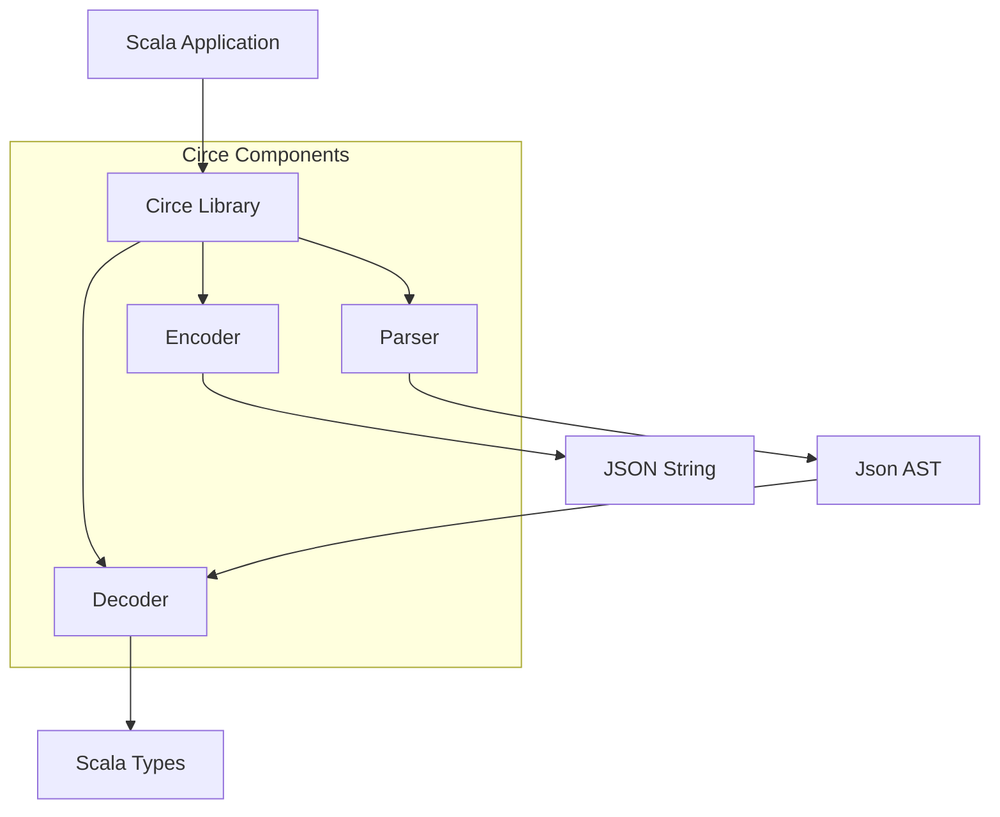
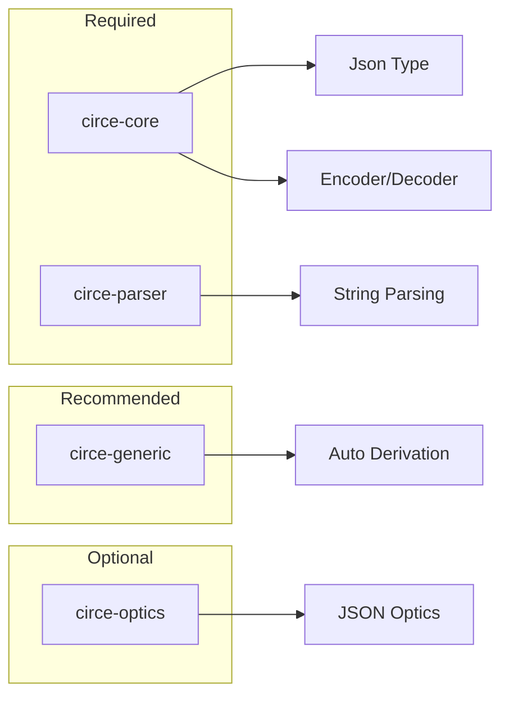
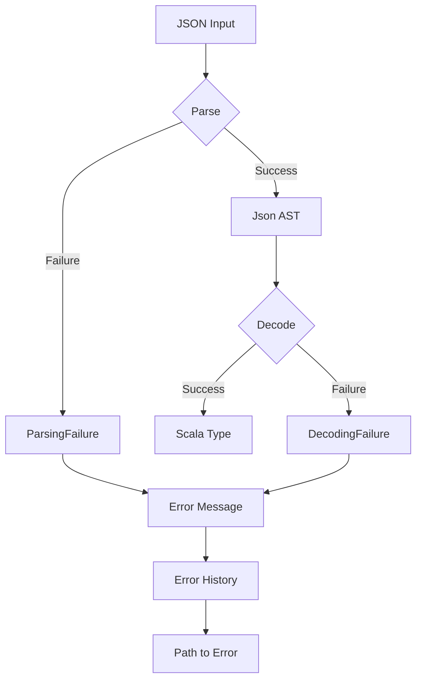

# How to Handle JSON with Circe

Author: [nawazdhandala](https://www.github.com/nawazdhandala)

Tags: Scala, Circe, JSON, Parsing, Functional Programming, Type Safety, Serialization, Deserialization

Description: Learn how to handle JSON encoding and decoding in Scala using Circe, the functional JSON library. This guide covers automatic derivation, custom codecs, error handling, and best practices for building type-safe JSON applications.

---

> Circe is a JSON library for Scala that provides a purely functional approach to parsing, encoding, and manipulating JSON data. It combines compile-time safety with runtime flexibility.

Working with JSON is a fundamental requirement for most modern applications, whether you are building REST APIs, processing configuration files, or communicating with external services. Scala developers need a JSON library that respects functional programming principles while providing excellent performance and developer ergonomics. Circe delivers on all these fronts.

---

## What is Circe?

Circe is a JSON library for Scala built on top of cats and cats-effect. It provides a purely functional approach to JSON processing with automatic codec derivation, making it both powerful and easy to use.



### Key Features

| Feature | Description |
|---------|-------------|
| **Type Safety** | Compile-time checked JSON operations |
| **Automatic Derivation** | Generate codecs from case classes |
| **Custom Codecs** | Full control over encoding and decoding |
| **Error Accumulation** | Collect all errors instead of failing fast |
| **Optics Integration** | Navigate and modify JSON with optics |
| **Performance** | Optimized parsing and serialization |

---

## Setting Up Circe

First, add Circe dependencies to your `build.sbt` file.

```scala
// build.sbt
// Define the Circe version for consistency across dependencies
val circeVersion = "0.14.6"

libraryDependencies ++= Seq(
  // Core Circe library with Json type and basic operations
  "io.circe" %% "circe-core" % circeVersion,

  // Automatic codec derivation for case classes
  "io.circe" %% "circe-generic" % circeVersion,

  // JSON string parsing functionality
  "io.circe" %% "circe-parser" % circeVersion,

  // Generic extras for more advanced derivation options
  "io.circe" %% "circe-generic-extras" % circeVersion,

  // Optional: Optics for JSON traversal and modification
  "io.circe" %% "circe-optics" % circeVersion
)
```

### Understanding the Module Structure

Circe is designed as a modular library, allowing you to include only the components you need.



---

## Basic JSON Operations

Circe provides a rich API for creating and manipulating JSON values.

### Creating JSON Values

Build JSON values programmatically using Circe's constructors.

```scala
// basics/JsonConstruction.scala
import io.circe._
import io.circe.syntax._

object JsonConstruction {

  // Create simple JSON values using constructors
  // Json.fromString creates a JSON string value
  val jsonString: Json = Json.fromString("hello")

  // Json.fromInt creates a JSON number value
  val jsonNumber: Json = Json.fromInt(42)

  // Json.fromBoolean creates a JSON boolean value
  val jsonBoolean: Json = Json.fromBoolean(true)

  // Json.Null represents the JSON null value
  val jsonNull: Json = Json.Null

  // Create JSON arrays from Scala collections
  // Json.arr takes varargs of Json values
  val jsonArray: Json = Json.arr(
    Json.fromString("apple"),
    Json.fromString("banana"),
    Json.fromString("cherry")
  )

  // Create JSON objects using Json.obj
  // Each tuple is a key-value pair
  val jsonObject: Json = Json.obj(
    "name" -> Json.fromString("John Doe"),
    "age" -> Json.fromInt(30),
    "active" -> Json.fromBoolean(true),
    "email" -> Json.Null
  )

  // Nested JSON structures
  val nestedJson: Json = Json.obj(
    "user" -> Json.obj(
      "profile" -> Json.obj(
        "firstName" -> Json.fromString("Jane"),
        "lastName" -> Json.fromString("Smith")
      ),
      "settings" -> Json.obj(
        "notifications" -> Json.fromBoolean(true),
        "theme" -> Json.fromString("dark")
      )
    ),
    "metadata" -> Json.obj(
      "createdAt" -> Json.fromString("2025-01-15T10:30:00Z"),
      "version" -> Json.fromInt(1)
    )
  )

  // Using the syntax extension for cleaner code
  // Import io.circe.syntax._ to enable .asJson on supported types
  val syntaxExample: Json = "hello world".asJson
  val numberSyntax: Json = 42.asJson
  val listSyntax: Json = List(1, 2, 3).asJson
  val mapSyntax: Json = Map("key" -> "value").asJson
}
```

### Parsing JSON Strings

Parse JSON strings into Circe's Json type.

```scala
// basics/JsonParsing.scala
import io.circe._
import io.circe.parser._

object JsonParsing {

  // Simple JSON string to parse
  val jsonString = """
    {
      "name": "Alice",
      "age": 28,
      "email": "alice@example.com"
    }
  """

  // Parse returns Either[ParsingFailure, Json]
  // Left contains error details, Right contains parsed Json
  val parseResult: Either[ParsingFailure, Json] = parse(jsonString)

  // Pattern match to handle success and failure cases
  parseResult match {
    case Right(json) =>
      println(s"Parsed successfully: ${json.spaces2}")

    case Left(failure) =>
      println(s"Parsing failed: ${failure.getMessage}")
  }

  // For unsafe operations (throws on failure)
  // Only use when you are certain the JSON is valid
  val unsafeParse: Json = parse(jsonString).getOrElse(Json.Null)

  // Parsing arrays
  val arrayString = """[1, 2, 3, 4, 5]"""
  val parsedArray: Either[ParsingFailure, Json] = parse(arrayString)

  // Parsing with detailed error messages
  val invalidJson = """{"name": "Bob", "age": }"""
  parse(invalidJson) match {
    case Right(json) =>
      println("Valid JSON")

    case Left(ParsingFailure(message, underlying)) =>
      // ParsingFailure contains the error message and underlying exception
      println(s"Parse error: $message")
      println(s"At position: ${underlying.getMessage}")
  }

  // Helper method for safe parsing with logging
  def safeParse(input: String): Option[Json] = {
    parse(input) match {
      case Right(json) =>
        Some(json)

      case Left(error) =>
        // Log the error in production applications
        println(s"Failed to parse JSON: ${error.message}")
        None
    }
  }
}
```

### Navigating JSON with Cursors

Use cursors to traverse and extract values from JSON structures.

```scala
// basics/JsonCursors.scala
import io.circe._
import io.circe.parser._

object JsonCursors {

  val jsonString = """
    {
      "user": {
        "name": "Charlie",
        "age": 35,
        "address": {
          "city": "New York",
          "country": "USA"
        },
        "hobbies": ["reading", "gaming", "hiking"]
      },
      "active": true
    }
  """

  val json: Json = parse(jsonString).getOrElse(Json.Null)

  // HCursor provides methods to navigate JSON structure
  val cursor: HCursor = json.hcursor

  // Navigate to nested fields using downField
  // Each downField call moves the cursor deeper into the structure
  val userName: Decoder.Result[String] =
    cursor.downField("user").downField("name").as[String]
  // Result: Right("Charlie")

  // Extract numeric values
  val userAge: Decoder.Result[Int] =
    cursor.downField("user").downField("age").as[Int]
  // Result: Right(35)

  // Navigate to deeply nested fields
  val city: Decoder.Result[String] =
    cursor.downField("user").downField("address").downField("city").as[String]
  // Result: Right("New York")

  // Access array elements by index using downN
  val firstHobby: Decoder.Result[String] =
    cursor.downField("user").downField("hobbies").downN(0).as[String]
  // Result: Right("reading")

  // Get entire array as a List
  val allHobbies: Decoder.Result[List[String]] =
    cursor.downField("user").downField("hobbies").as[List[String]]
  // Result: Right(List("reading", "gaming", "hiking"))

  // Handle missing fields gracefully
  val missingField: Decoder.Result[String] =
    cursor.downField("user").downField("nickname").as[String]
  // Result: Left(DecodingFailure(...))

  // Use getOrElse for default values
  val nicknameOrDefault: String =
    cursor.downField("user").downField("nickname").as[String].getOrElse("N/A")
  // Result: "N/A"

  // Check if a field exists
  val hasNickname: Boolean =
    cursor.downField("user").downField("nickname").succeeded
  // Result: false

  // Navigate and modify JSON
  val updatedJson: Json = cursor
    .downField("user")
    .downField("age")
    .withFocus(_.mapNumber(n => Json.fromInt(n.toInt.getOrElse(0) + 1).asNumber.get))
    .top
    .getOrElse(json)
}
```

---

## Encoding and Decoding Case Classes

Circe shines when working with Scala case classes through automatic derivation.

### Automatic Derivation

Use circe-generic for automatic encoder and decoder generation.

```scala
// codecs/AutoDerivation.scala
import io.circe._
import io.circe.generic.auto._
import io.circe.syntax._
import io.circe.parser._

// Case class representing a user
// Circe will automatically derive encoders and decoders
case class User(
  id: Long,
  name: String,
  email: String,
  age: Int,
  active: Boolean
)

// Nested case classes work automatically too
case class Address(
  street: String,
  city: String,
  country: String,
  postalCode: String
)

case class Company(
  name: String,
  address: Address,
  employees: List[User]
)

object AutoDerivation {

  // Create a User instance
  val user = User(
    id = 1,
    name = "Alice Johnson",
    email = "alice@example.com",
    age = 30,
    active = true
  )

  // Encode to JSON using .asJson syntax
  // Requires implicit Encoder[User] which auto-derivation provides
  val userJson: Json = user.asJson

  // Pretty print with 2-space indentation
  val prettyJson: String = userJson.spaces2
  // Output:
  // {
  //   "id": 1,
  //   "name": "Alice Johnson",
  //   "email": "alice@example.com",
  //   "age": 30,
  //   "active": true
  // }

  // Compact JSON without whitespace
  val compactJson: String = userJson.noSpaces
  // Output: {"id":1,"name":"Alice Johnson","email":"alice@example.com","age":30,"active":true}

  // Decode JSON string back to case class
  val jsonString = """{"id":2,"name":"Bob Smith","email":"bob@example.com","age":25,"active":false}"""

  // decode returns Either[Error, User]
  val decodedUser: Either[Error, User] = decode[User](jsonString)

  decodedUser match {
    case Right(u) =>
      println(s"Decoded user: ${u.name}")

    case Left(error) =>
      println(s"Decoding failed: ${error.getMessage}")
  }

  // Working with nested structures
  val company = Company(
    name = "Tech Corp",
    address = Address(
      street = "123 Main St",
      city = "San Francisco",
      country = "USA",
      postalCode = "94102"
    ),
    employees = List(
      User(1, "Alice", "alice@tech.com", 30, true),
      User(2, "Bob", "bob@tech.com", 25, true)
    )
  )

  val companyJson: Json = company.asJson
  // Nested structures are encoded automatically

  // Decode nested JSON
  val companyString = companyJson.noSpaces
  val decodedCompany: Either[Error, Company] = decode[Company](companyString)
}
```

### Semi-Automatic Derivation

For more control over which types get codecs, use semi-automatic derivation.

```scala
// codecs/SemiAutoDerivation.scala
import io.circe._
import io.circe.generic.semiauto._
import io.circe.syntax._
import io.circe.parser._

// Case class for a product in an e-commerce system
case class Product(
  id: Long,
  name: String,
  description: String,
  price: BigDecimal,
  inStock: Boolean,
  categories: List[String]
)

object Product {
  // Explicitly derive encoder and decoder in companion object
  // This gives you control over which types have codecs
  implicit val encoder: Encoder[Product] = deriveEncoder[Product]
  implicit val decoder: Decoder[Product] = deriveDecoder[Product]
}

// Case class for an order
case class OrderItem(
  productId: Long,
  quantity: Int,
  unitPrice: BigDecimal
)

case class Order(
  id: Long,
  customerId: Long,
  items: List[OrderItem],
  totalAmount: BigDecimal,
  status: String
)

object OrderItem {
  // Semi-auto derivation for OrderItem
  implicit val encoder: Encoder[OrderItem] = deriveEncoder[OrderItem]
  implicit val decoder: Decoder[OrderItem] = deriveDecoder[OrderItem]
}

object Order {
  // Order codec depends on OrderItem codec being available
  implicit val encoder: Encoder[Order] = deriveEncoder[Order]
  implicit val decoder: Decoder[Order] = deriveDecoder[Order]
}

object SemiAutoDerivation {

  val product = Product(
    id = 101,
    name = "Mechanical Keyboard",
    description = "RGB backlit mechanical keyboard",
    price = BigDecimal("149.99"),
    inStock = true,
    categories = List("Electronics", "Peripherals", "Gaming")
  )

  // Encode using the implicit encoder from companion object
  val productJson: Json = product.asJson

  val order = Order(
    id = 1001,
    customerId = 500,
    items = List(
      OrderItem(101, 2, BigDecimal("149.99")),
      OrderItem(102, 1, BigDecimal("79.99"))
    ),
    totalAmount = BigDecimal("379.97"),
    status = "pending"
  )

  val orderJson: Json = order.asJson

  // Decoding works the same way
  val orderString = orderJson.noSpaces
  val decodedOrder: Either[Error, Order] = decode[Order](orderString)
}
```

---

## Custom Encoders and Decoders

Sometimes you need full control over how types are encoded and decoded.

### Custom Encoder

Create custom encoders for specialized JSON output.

```scala
// codecs/CustomEncoders.scala
import io.circe._
import io.circe.syntax._
import java.time.{LocalDateTime, ZonedDateTime}
import java.time.format.DateTimeFormatter
import java.util.UUID

// Custom type for currency amounts
case class Money(amount: BigDecimal, currency: String)

// Custom type for email addresses with validation
case class Email(value: String) {
  require(value.contains("@"), "Invalid email format")
}

object CustomEncoders {

  // Custom encoder for Money type
  // Encodes as an object with formatted amount
  implicit val moneyEncoder: Encoder[Money] = new Encoder[Money] {
    override def apply(m: Money): Json = Json.obj(
      "amount" -> Json.fromBigDecimal(m.amount),
      "currency" -> Json.fromString(m.currency),
      "formatted" -> Json.fromString(s"${m.currency} ${m.amount}")
    )
  }

  // Alternative: Use Encoder.instance for cleaner syntax
  implicit val emailEncoder: Encoder[Email] = Encoder.instance { email =>
    Json.fromString(email.value)
  }

  // Encoder for LocalDateTime with custom format
  implicit val localDateTimeEncoder: Encoder[LocalDateTime] = Encoder.instance { dt =>
    val formatter = DateTimeFormatter.ISO_LOCAL_DATE_TIME
    Json.fromString(dt.format(formatter))
  }

  // Encoder for ZonedDateTime with ISO-8601 format
  implicit val zonedDateTimeEncoder: Encoder[ZonedDateTime] = Encoder.instance { dt =>
    val formatter = DateTimeFormatter.ISO_ZONED_DATE_TIME
    Json.fromString(dt.format(formatter))
  }

  // Encoder for UUID as string
  implicit val uuidEncoder: Encoder[UUID] = Encoder.instance { uuid =>
    Json.fromString(uuid.toString)
  }

  // Encoder that transforms field names to snake_case
  def snakeCaseEncoder[A](implicit encoder: Encoder[A]): Encoder[A] = {
    encoder.mapJson { json =>
      json.mapObject { obj =>
        JsonObject.fromIterable(
          obj.toIterable.map { case (key, value) =>
            (camelToSnake(key), value)
          }
        )
      }
    }
  }

  private def camelToSnake(s: String): String = {
    s.replaceAll("([A-Z])", "_$1").toLowerCase.stripPrefix("_")
  }

  // Example usage
  val price = Money(BigDecimal("99.99"), "USD")
  val priceJson: Json = price.asJson
  // Output: {"amount":99.99,"currency":"USD","formatted":"USD 99.99"}

  val email = Email("user@example.com")
  val emailJson: Json = email.asJson
  // Output: "user@example.com"

  val now = LocalDateTime.now()
  val dateJson: Json = now.asJson
  // Output: "2025-01-15T14:30:00"
}
```

### Custom Decoder

Create custom decoders for specialized JSON input handling.

```scala
// codecs/CustomDecoders.scala
import io.circe._
import io.circe.parser._
import java.time.{LocalDateTime, ZonedDateTime}
import java.time.format.DateTimeFormatter
import java.util.UUID
import scala.util.Try

object CustomDecoders {

  // Custom decoder for Money type
  // Handles multiple input formats
  implicit val moneyDecoder: Decoder[Money] = new Decoder[Money] {
    override def apply(c: HCursor): Decoder.Result[Money] = {
      for {
        // Extract required fields from JSON object
        amount <- c.downField("amount").as[BigDecimal]
        currency <- c.downField("currency").as[String]
      } yield Money(amount, currency)
    }
  }

  // Alternative: Use Decoder.instance for cleaner syntax
  implicit val emailDecoder: Decoder[Email] = Decoder.instance { cursor =>
    cursor.as[String].flatMap { str =>
      // Validate email format during decoding
      if (str.contains("@")) {
        Right(Email(str))
      } else {
        Left(DecodingFailure(s"Invalid email format: $str", cursor.history))
      }
    }
  }

  // Decoder for LocalDateTime with custom format
  implicit val localDateTimeDecoder: Decoder[LocalDateTime] = Decoder.instance { cursor =>
    cursor.as[String].flatMap { str =>
      Try(LocalDateTime.parse(str, DateTimeFormatter.ISO_LOCAL_DATE_TIME))
        .toEither
        .left.map(e => DecodingFailure(s"Invalid datetime: ${e.getMessage}", cursor.history))
    }
  }

  // Decoder for ZonedDateTime
  implicit val zonedDateTimeDecoder: Decoder[ZonedDateTime] = Decoder.instance { cursor =>
    cursor.as[String].flatMap { str =>
      Try(ZonedDateTime.parse(str, DateTimeFormatter.ISO_ZONED_DATE_TIME))
        .toEither
        .left.map(e => DecodingFailure(s"Invalid datetime: ${e.getMessage}", cursor.history))
    }
  }

  // Decoder for UUID
  implicit val uuidDecoder: Decoder[UUID] = Decoder.instance { cursor =>
    cursor.as[String].flatMap { str =>
      Try(UUID.fromString(str))
        .toEither
        .left.map(e => DecodingFailure(s"Invalid UUID: ${e.getMessage}", cursor.history))
    }
  }

  // Flexible decoder that accepts multiple formats
  implicit val flexibleMoneyDecoder: Decoder[Money] = Decoder.instance { cursor =>
    // Try parsing as object first
    val objectResult = for {
      amount <- cursor.downField("amount").as[BigDecimal]
      currency <- cursor.downField("currency").as[String]
    } yield Money(amount, currency)

    // Fall back to parsing as string like "USD 99.99"
    objectResult.orElse {
      cursor.as[String].flatMap { str =>
        val parts = str.split(" ")
        if (parts.length == 2) {
          Try(Money(BigDecimal(parts(1)), parts(0)))
            .toEither
            .left.map(_ => DecodingFailure(s"Invalid money format: $str", cursor.history))
        } else {
          Left(DecodingFailure(s"Invalid money format: $str", cursor.history))
        }
      }
    }
  }

  // Example usage
  val moneyJson = """{"amount": 150.00, "currency": "EUR"}"""
  val decodedMoney: Either[Error, Money] = decode[Money](moneyJson)
  // Result: Right(Money(150.00, "EUR"))

  val emailJson = """"user@example.com""""
  val decodedEmail: Either[Error, Email] = decode[Email](emailJson)
  // Result: Right(Email("user@example.com"))
}
```

---

## Handling Optional and Default Values

Circe provides several strategies for dealing with optional fields and default values.

```scala
// codecs/OptionalFields.scala
import io.circe._
import io.circe.generic.semiauto._
import io.circe.syntax._
import io.circe.parser._

// Case class with optional fields
case class UserProfile(
  id: Long,
  username: String,
  email: String,
  // Optional fields represented with Option type
  nickname: Option[String],
  bio: Option[String],
  avatarUrl: Option[String],
  // List fields are empty by default if missing
  interests: List[String]
)

object UserProfile {
  implicit val encoder: Encoder[UserProfile] = deriveEncoder[UserProfile]
  implicit val decoder: Decoder[UserProfile] = deriveDecoder[UserProfile]
}

// Case class with default values
case class Settings(
  theme: String = "light",
  language: String = "en",
  notificationsEnabled: Boolean = true,
  itemsPerPage: Int = 20
)

object Settings {
  // Standard derivation does not use default values
  implicit val encoder: Encoder[Settings] = deriveEncoder[Settings]

  // Custom decoder that uses defaults for missing fields
  implicit val decoder: Decoder[Settings] = Decoder.instance { cursor =>
    for {
      theme <- cursor.getOrElse[String]("theme")("light")
      language <- cursor.getOrElse[String]("language")("en")
      notifications <- cursor.getOrElse[Boolean]("notificationsEnabled")(true)
      itemsPerPage <- cursor.getOrElse[Int]("itemsPerPage")(20)
    } yield Settings(theme, language, notifications, itemsPerPage)
  }
}

object OptionalFields {

  // Optional fields are encoded as null if None
  val profileWithNulls = UserProfile(
    id = 1,
    username = "john_doe",
    email = "john@example.com",
    nickname = None,
    bio = Some("Software developer"),
    avatarUrl = None,
    interests = List("coding", "music")
  )

  val profileJson: Json = profileWithNulls.asJson
  // Output includes null for None values:
  // {"id":1,"username":"john_doe","email":"john@example.com",
  //  "nickname":null,"bio":"Software developer","avatarUrl":null,
  //  "interests":["coding","music"]}

  // Custom encoder to drop null fields
  implicit val dropNullEncoder: Encoder[UserProfile] = deriveEncoder[UserProfile].mapJson(
    _.deepDropNullValues
  )

  val profileJsonClean: Json = dropNullEncoder(profileWithNulls)
  // Output without null fields:
  // {"id":1,"username":"john_doe","email":"john@example.com",
  //  "bio":"Software developer","interests":["coding","music"]}

  // Decoding with optional fields
  val jsonWithMissing = """{"id":2,"username":"jane_doe","email":"jane@example.com"}"""

  val decodedProfile: Either[Error, UserProfile] = decode[UserProfile](jsonWithMissing)
  // Result: Right(UserProfile(2,"jane_doe","jane@example.com",None,None,None,List()))

  // Settings with defaults
  val minimalSettingsJson = """{"theme":"dark"}"""
  val decodedSettings: Either[Error, Settings] = decode[Settings](minimalSettingsJson)
  // Result: Right(Settings("dark","en",true,20))
}
```

---

## Error Handling

Circe provides detailed error information when parsing or decoding fails.



```scala
// errors/ErrorHandling.scala
import io.circe._
import io.circe.parser._
import io.circe.generic.auto._

case class Person(name: String, age: Int, email: String)

object ErrorHandling {

  // Handling parsing errors
  val invalidJson = """{"name": "Alice", "age": 30, "email": }"""

  parse(invalidJson) match {
    case Right(json) =>
      println("Valid JSON")

    case Left(ParsingFailure(message, underlying)) =>
      // ParsingFailure contains the error message and cause
      println(s"Parsing error: $message")
      // Access underlying exception for more details
      println(s"Caused by: ${underlying.getMessage}")
  }

  // Handling decoding errors
  val validJsonWrongType = """{"name": "Alice", "age": "thirty", "email": "alice@example.com"}"""

  decode[Person](validJsonWrongType) match {
    case Right(person) =>
      println(s"Decoded: $person")

    case Left(error: DecodingFailure) =>
      // DecodingFailure contains path information
      println(s"Decoding error: ${error.message}")
      // Get the path where the error occurred
      val path = CursorOp.opsToPath(error.history)
      println(s"At path: $path")
      // Output: At path: .age

    case Left(error: ParsingFailure) =>
      println(s"Parsing error: ${error.message}")
  }

  // Accumulating multiple errors
  // Use Decoder with accumulating error collection
  val jsonWithMultipleErrors = """{"name": 123, "age": "thirty", "email": true}"""

  // Standard decoding fails fast on first error
  val fastFailResult: Either[Error, Person] = decode[Person](jsonWithMultipleErrors)

  // For accumulating errors, use decodeAccumulating
  val accumulatingResult = parser.decodeAccumulating[Person](jsonWithMultipleErrors)

  accumulatingResult match {
    case cats.data.Validated.Valid(person) =>
      println(s"Valid: $person")

    case cats.data.Validated.Invalid(errors) =>
      // errors is a NonEmptyList of DecodingFailure
      println(s"Found ${errors.size} errors:")
      errors.toList.foreach { error =>
        val path = CursorOp.opsToPath(error.history)
        println(s"  - ${error.message} at $path")
      }
  }

  // Custom error messages
  def decodeWithContext[A: Decoder](json: String, context: String): Either[String, A] = {
    decode[A](json).left.map { error =>
      error match {
        case pf: ParsingFailure =>
          s"[$context] Invalid JSON syntax: ${pf.message}"

        case df: DecodingFailure =>
          val path = CursorOp.opsToPath(df.history)
          s"[$context] Invalid data at $path: ${df.message}"
      }
    }
  }

  // Usage
  val result = decodeWithContext[Person](
    """{"name": "Bob"}""",
    "UserRegistration"
  )
  // Result: Left("[UserRegistration] Invalid data at .age: Attempt to decode value on failed cursor")
}
```

---

## Working with Sealed Traits and ADTs

Circe handles Scala's algebraic data types (ADTs) through sealed traits.

```scala
// adt/SealedTraits.scala
import io.circe._
import io.circe.generic.auto._
import io.circe.syntax._
import io.circe.parser._

// Sealed trait representing different payment methods
sealed trait PaymentMethod

case class CreditCard(
  cardNumber: String,
  expiryMonth: Int,
  expiryYear: Int,
  cvv: String
) extends PaymentMethod

case class BankTransfer(
  accountNumber: String,
  routingNumber: String,
  accountName: String
) extends PaymentMethod

case class PayPal(
  email: String
) extends PaymentMethod

case object Cash extends PaymentMethod

object SealedTraits {

  // With generic.auto, sealed traits are encoded with a type discriminator
  val creditCard: PaymentMethod = CreditCard("4111111111111111", 12, 2025, "123")
  val bankTransfer: PaymentMethod = BankTransfer("123456789", "021000021", "John Doe")
  val paypal: PaymentMethod = PayPal("user@example.com")
  val cash: PaymentMethod = Cash

  val creditCardJson: Json = creditCard.asJson
  // Output: {"CreditCard":{"cardNumber":"4111111111111111","expiryMonth":12,"expiryYear":2025,"cvv":"123"}}

  val paypalJson: Json = paypal.asJson
  // Output: {"PayPal":{"email":"user@example.com"}}

  val cashJson: Json = cash.asJson
  // Output: {"Cash":{}}

  // Decoding polymorphic types
  val jsonString = """{"BankTransfer":{"accountNumber":"987654321","routingNumber":"021000021","accountName":"Jane Doe"}}"""
  val decoded: Either[Error, PaymentMethod] = decode[PaymentMethod](jsonString)
  // Result: Right(BankTransfer("987654321","021000021","Jane Doe"))

  // Custom discriminator field using circe-generic-extras
  // For more control over ADT encoding format
}
```

### Custom ADT Encoding

For APIs that require a specific format for type discrimination.

```scala
// adt/CustomADT.scala
import io.circe._
import io.circe.syntax._

// Sealed trait with custom encoding
sealed trait Event
case class UserCreated(userId: Long, email: String) extends Event
case class UserUpdated(userId: Long, changes: Map[String, String]) extends Event
case class UserDeleted(userId: Long) extends Event

object Event {

  // Custom encoder with type field
  implicit val encoder: Encoder[Event] = Encoder.instance {
    case e: UserCreated =>
      Json.obj(
        "type" -> Json.fromString("user.created"),
        "payload" -> Json.obj(
          "userId" -> Json.fromLong(e.userId),
          "email" -> Json.fromString(e.email)
        )
      )

    case e: UserUpdated =>
      Json.obj(
        "type" -> Json.fromString("user.updated"),
        "payload" -> Json.obj(
          "userId" -> Json.fromLong(e.userId),
          "changes" -> e.changes.asJson
        )
      )

    case e: UserDeleted =>
      Json.obj(
        "type" -> Json.fromString("user.deleted"),
        "payload" -> Json.obj(
          "userId" -> Json.fromLong(e.userId)
        )
      )
  }

  // Custom decoder that reads type field first
  implicit val decoder: Decoder[Event] = Decoder.instance { cursor =>
    cursor.downField("type").as[String].flatMap {
      case "user.created" =>
        for {
          userId <- cursor.downField("payload").downField("userId").as[Long]
          email <- cursor.downField("payload").downField("email").as[String]
        } yield UserCreated(userId, email)

      case "user.updated" =>
        for {
          userId <- cursor.downField("payload").downField("userId").as[Long]
          changes <- cursor.downField("payload").downField("changes").as[Map[String, String]]
        } yield UserUpdated(userId, changes)

      case "user.deleted" =>
        for {
          userId <- cursor.downField("payload").downField("userId").as[Long]
        } yield UserDeleted(userId)

      case other =>
        Left(DecodingFailure(s"Unknown event type: $other", cursor.history))
    }
  }
}

object CustomADT {

  val event: Event = UserCreated(1, "new@example.com")
  val eventJson: Json = event.asJson
  // Output: {"type":"user.created","payload":{"userId":1,"email":"new@example.com"}}

  val jsonString = """{"type":"user.updated","payload":{"userId":1,"changes":{"email":"updated@example.com"}}}"""
  val decoded: Either[Error, Event] = decode[Event](jsonString)
  // Result: Right(UserUpdated(1,Map("email" -> "updated@example.com")))
}
```

---

## JSON Transformation with Optics

Circe integrates with optics libraries for powerful JSON manipulation.

```scala
// optics/JsonOptics.scala
import io.circe._
import io.circe.optics.JsonPath._
import io.circe.parser._
import io.circe.syntax._
import monocle.Optional

object JsonOptics {

  val jsonString = """
    {
      "store": {
        "name": "Book Shop",
        "books": [
          {"title": "Scala Programming", "price": 45.99, "inStock": true},
          {"title": "Functional Design", "price": 39.99, "inStock": false},
          {"title": "Type Theory", "price": 55.00, "inStock": true}
        ],
        "location": {
          "city": "Portland",
          "state": "OR"
        }
      }
    }
  """

  val json: Json = parse(jsonString).getOrElse(Json.Null)

  // Create optics for accessing nested paths
  // root starts at the JSON root
  val storeName: Optional[Json, String] = root.store.name.string

  // Get value using optic
  val name: Option[String] = storeName.getOption(json)
  // Result: Some("Book Shop")

  // Set value using optic
  val updatedJson: Json = storeName.set("New Book Shop")(json)

  // Modify value using optic
  val uppercasedJson: Json = storeName.modify(_.toUpperCase)(json)

  // Access array elements
  val firstBookTitle: Optional[Json, String] =
    root.store.books.index(0).title.string

  val title: Option[String] = firstBookTitle.getOption(json)
  // Result: Some("Scala Programming")

  // Modify array element
  val discountedJson: Json = root.store.books.index(0).price.double
    .modify(_ * 0.9)(json)

  // Access nested object
  val city: Optional[Json, String] = root.store.location.city.string
  val cityValue: Option[String] = city.getOption(json)
  // Result: Some("Portland")

  // Traverse all books and modify prices
  // Use each to traverse array elements
  val allPricesDiscounted: Json = root.store.books.each.price.double
    .modify(_ * 0.8)(json)

  // Filter and modify
  // Apply 10% discount to books that are in stock
  def applyInStockDiscount(j: Json): Json = {
    root.store.books.each.json.modify { book =>
      val inStock = root.inStock.boolean.getOption(book).getOrElse(false)
      if (inStock) {
        root.price.double.modify(_ * 0.9)(book)
      } else {
        book
      }
    }(j)
  }

  val discountedInStock: Json = applyInStockDiscount(json)

  // Add new field to object
  val withRating: Json = root.store.obj.modify { obj =>
    obj.add("rating", Json.fromDouble(4.5).get)
  }(json)

  // Remove field from object
  val withoutLocation: Json = root.store.obj.modify { obj =>
    obj.remove("location")
  }(json)
}
```

---

## Integration with HTTP Libraries

Circe integrates smoothly with popular HTTP libraries like http4s and Akka HTTP.

### Http4s Integration

```scala
// http/Http4sIntegration.scala
import cats.effect._
import io.circe._
import io.circe.generic.auto._
import io.circe.syntax._
import org.http4s._
import org.http4s.circe._
import org.http4s.dsl.io._
import org.http4s.implicits._

// Request and response models
case class CreateUserRequest(name: String, email: String)
case class UserResponse(id: Long, name: String, email: String)
case class ErrorResponse(message: String, code: String)

object Http4sIntegration {

  // Implicit decoders for request body parsing
  implicit val createUserDecoder: EntityDecoder[IO, CreateUserRequest] =
    jsonOf[IO, CreateUserRequest]

  // Implicit encoders for response serialization
  implicit val userResponseEncoder: EntityEncoder[IO, UserResponse] =
    jsonEncoderOf[IO, UserResponse]

  implicit val errorResponseEncoder: EntityEncoder[IO, ErrorResponse] =
    jsonEncoderOf[IO, ErrorResponse]

  // Define routes with automatic JSON handling
  val userRoutes: HttpRoutes[IO] = HttpRoutes.of[IO] {

    // GET endpoint returning JSON
    case GET -> Root / "users" / LongVar(id) =>
      // Simulated user lookup
      val user = UserResponse(id, "John Doe", "john@example.com")
      Ok(user)

    // POST endpoint accepting and returning JSON
    case req @ POST -> Root / "users" =>
      for {
        // Automatically decode request body as CreateUserRequest
        createRequest <- req.as[CreateUserRequest]

        // Validate request
        response <- if (createRequest.email.contains("@")) {
          // Create user and return response
          val user = UserResponse(1L, createRequest.name, createRequest.email)
          Created(user)
        } else {
          // Return error response
          val error = ErrorResponse("Invalid email format", "INVALID_EMAIL")
          BadRequest(error)
        }
      } yield response

    // PUT endpoint with path parameter
    case req @ PUT -> Root / "users" / LongVar(id) =>
      for {
        updateRequest <- req.as[CreateUserRequest]
        user = UserResponse(id, updateRequest.name, updateRequest.email)
        response <- Ok(user)
      } yield response

    // DELETE endpoint returning no content
    case DELETE -> Root / "users" / LongVar(id) =>
      NoContent()
  }

  // Error handling middleware
  def handleErrors(routes: HttpRoutes[IO]): HttpRoutes[IO] = {
    HttpRoutes { req =>
      routes(req).map {
        case Some(response) => Some(response)
        case None => Some(Response[IO](Status.NotFound))
      }.handleErrorWith { error =>
        val errorResponse = ErrorResponse(error.getMessage, "INTERNAL_ERROR")
        OptionT.liftF(InternalServerError(errorResponse))
      }
    }
  }
}
```

---

## Performance Optimization

Optimize Circe usage for high-performance applications.

```scala
// performance/Optimization.scala
import io.circe._
import io.circe.generic.semiauto._
import io.circe.parser._
import io.circe.syntax._

case class LogEntry(
  timestamp: String,
  level: String,
  message: String,
  context: Map[String, String]
)

object LogEntry {
  // Pre-compute encoders and decoders
  // Avoid derivation at runtime
  implicit val encoder: Encoder[LogEntry] = deriveEncoder[LogEntry]
  implicit val decoder: Decoder[LogEntry] = deriveDecoder[LogEntry]
}

object Optimization {

  // 1. Use semi-auto derivation instead of auto
  // Semi-auto derivation computes codecs once at compile time
  // Auto derivation can recompute codecs in some contexts

  // 2. Pre-parse static JSON patterns
  val templateJson: Json = parse("""{"status": "ok", "version": "1.0"}""")
    .getOrElse(Json.Null)

  // 3. Use noSpaces for production, spaces2 for debugging
  def toJson[A: Encoder](value: A, pretty: Boolean = false): String = {
    val json = value.asJson
    if (pretty) json.spaces2 else json.noSpaces
  }

  // 4. Reuse cursors for multiple extractions
  def extractMultipleFields(jsonStr: String): Option[(String, Int, Boolean)] = {
    parse(jsonStr).toOption.flatMap { json =>
      val cursor = json.hcursor
      for {
        name <- cursor.downField("name").as[String].toOption
        age <- cursor.downField("age").as[Int].toOption
        active <- cursor.downField("active").as[Boolean].toOption
      } yield (name, age, active)
    }
  }

  // 5. Batch processing with streaming
  def processJsonLines(lines: Iterator[String]): Iterator[Either[Error, LogEntry]] = {
    lines.map(decode[LogEntry])
  }

  // 6. Avoid unnecessary conversions
  // Bad: json.noSpaces then parse again
  // Good: pass Json directly between functions

  // 7. Use Printer for custom formatting
  val compactPrinter: Printer = Printer.noSpaces
  val prettyPrinter: Printer = Printer.spaces2.copy(
    dropNullValues = true,
    indent = "  "
  )

  def formatJson(json: Json, compact: Boolean = true): String = {
    if (compact) compactPrinter.print(json)
    else prettyPrinter.print(json)
  }

  // 8. Memory-efficient large JSON processing
  // Use streaming parser for large files
  import io.circe.fs2._
  import fs2.{Stream, Pipe}
  import cats.effect.IO

  def parseJsonStream[A: Decoder]: Pipe[IO, Byte, A] = { stream =>
    stream
      .through(byteArrayParser)
      .through(decoder[IO, A])
  }
}
```

---

## Testing with Circe

Write effective tests for your JSON codecs.

```scala
// testing/CodecTests.scala
import io.circe._
import io.circe.syntax._
import io.circe.parser._
import org.scalatest.flatspec.AnyFlatSpec
import org.scalatest.matchers.should.Matchers
import org.scalatestplus.scalacheck.ScalaCheckPropertyChecks
import org.scalacheck.{Arbitrary, Gen}

case class TestUser(id: Long, name: String, active: Boolean)

object TestUser {
  implicit val encoder: Encoder[TestUser] = Encoder.forProduct3("id", "name", "active")(u =>
    (u.id, u.name, u.active)
  )

  implicit val decoder: Decoder[TestUser] = Decoder.forProduct3("id", "name", "active")(
    TestUser.apply
  )

  // Generator for property-based testing
  implicit val arbitrary: Arbitrary[TestUser] = Arbitrary {
    for {
      id <- Gen.posNum[Long]
      name <- Gen.alphaStr.suchThat(_.nonEmpty)
      active <- Gen.oneOf(true, false)
    } yield TestUser(id, name, active)
  }
}

class CodecTests extends AnyFlatSpec with Matchers with ScalaCheckPropertyChecks {

  "TestUser encoder" should "produce valid JSON" in {
    val user = TestUser(1, "Alice", true)
    val json = user.asJson

    json.hcursor.downField("id").as[Long] shouldBe Right(1L)
    json.hcursor.downField("name").as[String] shouldBe Right("Alice")
    json.hcursor.downField("active").as[Boolean] shouldBe Right(true)
  }

  "TestUser decoder" should "parse valid JSON" in {
    val jsonStr = """{"id": 2, "name": "Bob", "active": false}"""
    val result = decode[TestUser](jsonStr)

    result shouldBe Right(TestUser(2, "Bob", false))
  }

  it should "fail on invalid JSON" in {
    val invalidJson = """{"id": "not-a-number", "name": "Charlie", "active": true}"""
    val result = decode[TestUser](invalidJson)

    result.isLeft shouldBe true
  }

  it should "fail on missing fields" in {
    val incompleteJson = """{"id": 3, "name": "Dave"}"""
    val result = decode[TestUser](incompleteJson)

    result.isLeft shouldBe true
  }

  "TestUser codec" should "roundtrip correctly" in {
    // Property-based test: encode then decode should return original
    forAll { (user: TestUser) =>
      val json = user.asJson
      val decoded = json.as[TestUser]

      decoded shouldBe Right(user)
    }
  }

  "TestUser codec" should "roundtrip through string" in {
    forAll { (user: TestUser) =>
      val jsonStr = user.asJson.noSpaces
      val decoded = decode[TestUser](jsonStr)

      decoded shouldBe Right(user)
    }
  }

  // Test specific edge cases
  "Encoder" should "handle special characters in strings" in {
    val user = TestUser(1, """Name with "quotes" and \backslash""", true)
    val json = user.asJson.noSpaces

    // Should be properly escaped
    decode[TestUser](json) shouldBe Right(user)
  }

  it should "handle unicode characters" in {
    val user = TestUser(1, "Name with emoji and unicode chars", true)
    val json = user.asJson.noSpaces

    decode[TestUser](json) shouldBe Right(user)
  }
}
```

---

## Best Practices

### 1. Prefer Semi-Auto Derivation

Semi-automatic derivation gives you explicit control over which types have codecs and ensures codecs are computed once.

```scala
// Good: Explicit codec definitions
object User {
  implicit val encoder: Encoder[User] = deriveEncoder[User]
  implicit val decoder: Decoder[User] = deriveDecoder[User]
}

// Avoid: Importing generic.auto._ everywhere
// import io.circe.generic.auto._
```

### 2. Handle Errors Properly

Never ignore decoding errors in production code.

```scala
// Good: Handle both success and failure
decode[User](jsonStr) match {
  case Right(user) => processUser(user)
  case Left(error) => logError(error); returnErrorResponse()
}

// Avoid: Using unsafe operations
// val user = decode[User](jsonStr).right.get
```

### 3. Use Custom Codecs for External APIs

When working with external APIs, create explicit codecs that match their format.

```scala
// Match external API naming conventions
implicit val encoder: Encoder[User] = Encoder.forProduct3(
  "user_id",      // snake_case for API
  "user_name",
  "is_active"
)(u => (u.id, u.name, u.active))
```

### 4. Drop Null Values When Appropriate

For cleaner JSON output, remove null fields.

```scala
val cleanEncoder: Encoder[User] = deriveEncoder[User].mapJson(_.deepDropNullValues)
```

### 5. Document Your Codecs

Add comments explaining non-obvious encoding decisions.

```scala
implicit val encoder: Encoder[Event] = Encoder.instance {
  // External webhook expects "event_type" field, not "type"
  case e: UserCreated =>
    Json.obj("event_type" -> "user.created".asJson, ...)
}
```

---

## Common Pitfalls

| Pitfall | Problem | Solution |
|---------|---------|----------|
| Missing Implicits | Compiler cannot find encoder/decoder | Import generic.auto._ or define explicit codecs |
| Cyclic Dependencies | Recursive types cause stack overflow | Use lazy val for recursive codecs |
| Performance Issues | Slow JSON processing | Use semi-auto derivation, pre-compute codecs |
| Lost Type Information | Generic Json loses type safety | Keep strongly typed as long as possible |
| Inconsistent Naming | Field names do not match JSON keys | Use custom codecs with explicit field names |

---

## Conclusion

Circe provides a powerful, type-safe approach to JSON handling in Scala. Key takeaways include:

- **Type Safety**: Catch JSON errors at compile time, not runtime
- **Flexible Derivation**: Choose between automatic, semi-automatic, or fully custom codecs
- **Error Handling**: Detailed error information with path tracking
- **ADT Support**: Natural encoding of sealed traits and algebraic data types
- **Performance**: Optimized parsing and serialization with configurable options
- **Integration**: Seamless integration with popular HTTP libraries

By following the patterns and practices outlined in this guide, you can build robust, maintainable JSON handling for your Scala applications.

---

*Building a Scala application that needs monitoring? [OneUptime](https://oneuptime.com) provides comprehensive observability for your applications, including API performance tracking and error monitoring.*

**Related Reading:**
- [How to Handle Database Operations with Slick](https://oneuptime.com/blog/post/2026-02-02-scala-slick-database/view)
- [How to Use asyncio Effectively in Python for I/O-Bound Workloads](https://oneuptime.com/blog/post/2025-01-06-python-asyncio-io-bound/view)
