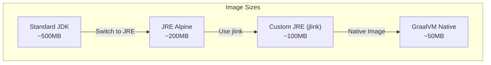

# How to Use Docker with Scala Applications

Author: [nawazdhandala](https://www.github.com/nawazdhandala)

Tags: Scala, Docker, sbt, JVM, Containers, Multi-Stage Builds, GraalVM, Native Image, Kubernetes

Description: A comprehensive guide to containerizing Scala applications with Docker. Learn multi-stage builds, sbt-native-packager, GraalVM native images, optimization techniques, and production-ready configurations.

---

> Scala applications benefit greatly from containerization, but JVM-based images can become bloated without proper optimization. This guide shows you how to build efficient, production-ready Docker images for Scala apps.

Containerizing Scala applications requires understanding both JVM characteristics and Docker best practices. You will learn how to create optimized images using multi-stage builds, sbt-native-packager, and even GraalVM native images for minimal containers.

---

## Docker Build Workflow for Scala


---

## Project Setup

Create a sample Scala project with the necessary build configuration.

The following build.sbt configures a typical Scala 3 project with Akka HTTP for a web service:

```scala
// build.sbt
// Basic Scala project configuration with sbt-native-packager

ThisBuild / scalaVersion := "3.3.1"
ThisBuild / organization := "com.example"

lazy val root = (project in file("."))
  .enablePlugins(JavaAppPackaging, DockerPlugin)
  .settings(
    name := "scala-docker-demo",
    version := "1.0.0",

    // Dependencies
    libraryDependencies ++= Seq(
      "com.typesafe.akka" %% "akka-http" % "10.5.3",
      "com.typesafe.akka" %% "akka-actor-typed" % "2.8.5",
      "com.typesafe.akka" %% "akka-stream" % "2.8.5",
      "ch.qos.logback" % "logback-classic" % "1.4.14",
      "org.scalatest" %% "scalatest" % "3.2.17" % Test
    ),

    // Docker settings
    Docker / packageName := "scala-docker-demo",
    Docker / version := version.value,
    dockerBaseImage := "eclipse-temurin:21-jre-alpine",
    dockerExposedPorts := Seq(8080),
    dockerUpdateLatest := true
  )
```

Add the sbt-native-packager plugin to your project:

```scala
// project/plugins.sbt
// Add sbt-native-packager for Docker support

addSbtPlugin("com.github.sbt" % "sbt-native-packager" % "1.9.16")
```

Create a simple HTTP server as the main application:

```scala
// src/main/scala/Main.scala
// Simple Akka HTTP server demonstrating a containerizable Scala app

package com.example

import akka.actor.typed.ActorSystem
import akka.actor.typed.scaladsl.Behaviors
import akka.http.scaladsl.Http
import akka.http.scaladsl.server.Directives.*
import akka.http.scaladsl.model.StatusCodes
import scala.concurrent.ExecutionContextExecutor
import scala.util.{Failure, Success}

object Main:
  def main(args: Array[String]): Unit =
    // Create the actor system
    implicit val system: ActorSystem[Nothing] =
      ActorSystem(Behaviors.empty, "scala-docker-demo")
    implicit val ec: ExecutionContextExecutor = system.executionContext

    // Define routes
    val routes = concat(
      path("health") {
        get {
          complete(StatusCodes.OK, "healthy")
        }
      },
      path("ready") {
        get {
          complete(StatusCodes.OK, "ready")
        }
      },
      path("api" / "greeting" / Segment) { name =>
        get {
          complete(s"Hello, $name!")
        }
      }
    )

    // Get port from environment or default to 8080
    val port = sys.env.getOrElse("PORT", "8080").toInt
    val host = sys.env.getOrElse("HOST", "0.0.0.0")

    // Start the server
    val bindingFuture = Http().newServerAt(host, port).bind(routes)

    bindingFuture.onComplete {
      case Success(binding) =>
        println(s"Server running at http://${binding.localAddress.getHostString}:${binding.localAddress.getPort}/")
      case Failure(ex) =>
        println(s"Failed to bind HTTP server: ${ex.getMessage}")
        system.terminate()
    }
```

---

## Basic Multi-Stage Dockerfile

Multi-stage builds separate the build environment from the runtime, resulting in smaller images.

This Dockerfile uses sbt to compile the application in the first stage and copies only the necessary artifacts to a slim JRE image:

```dockerfile
# Dockerfile
# Multi-stage build for Scala application

# Build stage with full JDK and sbt
FROM sbtscala/scala-sbt:eclipse-temurin-21_36_1.9.8_3.3.1 AS builder

WORKDIR /app

# Copy build configuration first for layer caching
COPY build.sbt ./
COPY project/plugins.sbt project/build.properties project/

# Download dependencies (cached if build files unchanged)
RUN sbt update

# Copy source code
COPY src ./src

# Compile and stage the application
RUN sbt stage

# Runtime stage with minimal JRE
FROM eclipse-temurin:21-jre-alpine

WORKDIR /app

# Create non-root user for security
RUN addgroup -S appgroup && adduser -S appuser -G appgroup

# Copy the staged application from builder
COPY --from=builder /app/target/universal/stage /app

# Set ownership
RUN chown -R appuser:appgroup /app

# Switch to non-root user
USER appuser

# Expose application port
EXPOSE 8080

# Set JVM options for containers
ENV JAVA_OPTS="-XX:+UseContainerSupport -XX:MaxRAMPercentage=75.0"

# Health check
HEALTHCHECK --interval=30s --timeout=3s --start-period=10s --retries=3 \
    CMD wget --no-verbose --tries=1 --spider http://localhost:8080/health || exit 1

# Run the application
ENTRYPOINT ["/app/bin/scala-docker-demo"]
```

Build and run the container:

```bash
# Build the Docker image
docker build -t scala-docker-demo:latest .

# Run the container
docker run -p 8080:8080 scala-docker-demo:latest

# Test the endpoints
curl http://localhost:8080/health
curl http://localhost:8080/api/greeting/World
```

---

## Using sbt-native-packager Docker Plugin

The sbt-native-packager plugin provides built-in Docker support without writing a Dockerfile.

Configure Docker settings in build.sbt:

```scala
// build.sbt
// Advanced sbt-native-packager Docker configuration

import com.typesafe.sbt.packager.docker._

lazy val root = (project in file("."))
  .enablePlugins(JavaAppPackaging, DockerPlugin, AshScriptPlugin)
  .settings(
    name := "scala-docker-demo",
    version := "1.0.0",
    scalaVersion := "3.3.1",

    // Docker image configuration
    Docker / packageName := "myregistry/scala-docker-demo",
    Docker / version := version.value,

    // Use Alpine-based image for smaller size
    dockerBaseImage := "eclipse-temurin:21-jre-alpine",

    // Exposed ports
    dockerExposedPorts := Seq(8080),

    // Environment variables
    dockerEnvVars := Map(
      "JAVA_OPTS" -> "-XX:+UseContainerSupport -XX:MaxRAMPercentage=75.0"
    ),

    // Labels for container metadata
    dockerLabels := Map(
      "org.opencontainers.image.source" -> "https://github.com/myorg/scala-docker-demo",
      "org.opencontainers.image.description" -> "Scala Docker Demo Application",
      "org.opencontainers.image.version" -> version.value
    ),

    // Create non-root user
    Docker / daemonUser := "appuser",
    Docker / daemonGroup := "appgroup",

    // Custom Dockerfile commands
    dockerCommands := {
      val commands = dockerCommands.value
      val insertPoint = commands.indexWhere {
        case Cmd("FROM", args @ _*) => args.exists(_.contains("eclipse-temurin"))
        case _ => false
      }

      // Insert health check after the base image
      val healthCheck = Cmd("HEALTHCHECK",
        "--interval=30s", "--timeout=3s", "--start-period=10s", "--retries=3",
        "CMD", "wget", "--no-verbose", "--tries=1", "--spider",
        "http://localhost:8080/health", "||", "exit", "1")

      commands.take(insertPoint + 1) ++ Seq(healthCheck) ++ commands.drop(insertPoint + 1)
    },

    // Update latest tag
    dockerUpdateLatest := true
  )
```

Build the Docker image using sbt:

```bash
# Build Docker image using sbt
sbt Docker/publishLocal

# Push to registry
sbt Docker/publish

# View generated Dockerfile
sbt Docker/stage
cat target/docker/stage/Dockerfile
```

---

## Optimized Dependency Caching

Speed up builds by caching dependencies in a separate layer.

This Dockerfile structure ensures dependencies are only re-downloaded when build files change:

```dockerfile
# Dockerfile.optimized
# Optimized build with better dependency caching

FROM sbtscala/scala-sbt:eclipse-temurin-21_36_1.9.8_3.3.1 AS builder

WORKDIR /app

# Copy only dependency-related files first
COPY build.sbt ./
COPY project/plugins.sbt project/build.properties project/

# Create a minimal source file to trigger dependency resolution
RUN mkdir -p src/main/scala && \
    echo 'object Placeholder { def main(args: Array[String]): Unit = () }' > src/main/scala/Placeholder.scala

# Download all dependencies (this layer is cached)
RUN sbt compile

# Remove placeholder and copy actual source
RUN rm -rf src
COPY src ./src

# Build the application
RUN sbt stage

# Runtime stage
FROM eclipse-temurin:21-jre-alpine

WORKDIR /app

# Install wget for health checks
RUN apk add --no-cache wget

# Create non-root user
RUN addgroup -S appgroup && adduser -S appuser -G appgroup

# Copy application
COPY --from=builder /app/target/universal/stage /app

# Set ownership and permissions
RUN chown -R appuser:appgroup /app

USER appuser

EXPOSE 8080

ENV JAVA_OPTS="-XX:+UseContainerSupport -XX:MaxRAMPercentage=75.0 -XX:+ExitOnOutOfMemoryError"

HEALTHCHECK --interval=30s --timeout=3s --start-period=10s --retries=3 \
    CMD wget --no-verbose --tries=1 --spider http://localhost:8080/health || exit 1

ENTRYPOINT ["/app/bin/scala-docker-demo"]
```

---

## JVM Tuning for Containers

Proper JVM configuration is critical for containerized applications.

The following script sets JVM options based on container resources:

```bash
#!/bin/bash
# entrypoint.sh
# Smart entrypoint script with JVM tuning for containers

# Base JVM options for containers
JVM_OPTS="-XX:+UseContainerSupport"

# Memory configuration
# Use 75% of available memory for heap
JVM_OPTS="$JVM_OPTS -XX:MaxRAMPercentage=75.0"
JVM_OPTS="$JVM_OPTS -XX:InitialRAMPercentage=50.0"

# GC configuration for low latency
JVM_OPTS="$JVM_OPTS -XX:+UseG1GC"
JVM_OPTS="$JVM_OPTS -XX:MaxGCPauseMillis=200"

# Exit on OOM to allow container restart
JVM_OPTS="$JVM_OPTS -XX:+ExitOnOutOfMemoryError"

# Enable GC logging for debugging
if [ "$ENABLE_GC_LOGGING" = "true" ]; then
    JVM_OPTS="$JVM_OPTS -Xlog:gc*:file=/app/logs/gc.log:time,uptime:filecount=5,filesize=10M"
fi

# Enable JMX for monitoring
if [ "$ENABLE_JMX" = "true" ]; then
    JVM_OPTS="$JVM_OPTS -Dcom.sun.management.jmxremote"
    JVM_OPTS="$JVM_OPTS -Dcom.sun.management.jmxremote.port=${JMX_PORT:-9010}"
    JVM_OPTS="$JVM_OPTS -Dcom.sun.management.jmxremote.rmi.port=${JMX_PORT:-9010}"
    JVM_OPTS="$JVM_OPTS -Dcom.sun.management.jmxremote.authenticate=false"
    JVM_OPTS="$JVM_OPTS -Dcom.sun.management.jmxremote.ssl=false"
    JVM_OPTS="$JVM_OPTS -Djava.rmi.server.hostname=${HOSTNAME:-localhost}"
fi

# Merge with user-provided JAVA_OPTS
export JAVA_OPTS="$JVM_OPTS $JAVA_OPTS"

echo "Starting application with JAVA_OPTS: $JAVA_OPTS"

exec /app/bin/scala-docker-demo "$@"
```

Update Dockerfile to use the entrypoint script:

```dockerfile
# Dockerfile.jvm-tuned
# Dockerfile with JVM tuning entrypoint

FROM eclipse-temurin:21-jre-alpine AS runtime

WORKDIR /app

RUN apk add --no-cache wget bash

RUN addgroup -S appgroup && adduser -S appuser -G appgroup

# Copy application and entrypoint
COPY --from=builder /app/target/universal/stage /app
COPY entrypoint.sh /app/

RUN chmod +x /app/entrypoint.sh && \
    chown -R appuser:appgroup /app

USER appuser

EXPOSE 8080

HEALTHCHECK --interval=30s --timeout=3s --start-period=10s --retries=3 \
    CMD wget --no-verbose --tries=1 --spider http://localhost:8080/health || exit 1

ENTRYPOINT ["/app/entrypoint.sh"]
```

---

## GraalVM Native Image

Create minimal containers using GraalVM native image compilation.

Configure sbt for native image generation:

```scala
// build.sbt
// GraalVM native image configuration

lazy val root = (project in file("."))
  .enablePlugins(JavaAppPackaging, GraalVMNativeImagePlugin)
  .settings(
    name := "scala-native-demo",
    version := "1.0.0",
    scalaVersion := "3.3.1",

    // Native image settings
    graalVMNativeImageOptions ++= Seq(
      "--no-fallback",
      "--enable-http",
      "--enable-https",
      "--install-exit-handlers",
      "-H:+ReportExceptionStackTraces",
      "--initialize-at-build-time",
      "-H:+StaticExecutableWithDynamicLibC"
    )
  )
```

Create a Dockerfile for native image builds:

```dockerfile
# Dockerfile.native
# GraalVM native image build

# Build stage with GraalVM
FROM ghcr.io/graalvm/graalvm-community:21 AS builder

WORKDIR /app

# Install sbt
RUN curl -fL https://github.com/sbt/sbt/releases/download/v1.9.8/sbt-1.9.8.tgz | tar xz && \
    mv sbt /usr/local/

ENV PATH="/usr/local/sbt/bin:$PATH"

# Copy build files
COPY build.sbt ./
COPY project/plugins.sbt project/build.properties project/

# Download dependencies
RUN mkdir -p src/main/scala && \
    echo 'object Placeholder { def main(args: Array[String]): Unit = () }' > src/main/scala/Placeholder.scala && \
    sbt compile && \
    rm -rf src

# Copy source and build native image
COPY src ./src
RUN sbt GraalVMNativeImage/packageBin

# Runtime stage with minimal image
FROM gcr.io/distroless/base-debian12

WORKDIR /app

# Copy native binary
COPY --from=builder /app/target/graalvm-native-image/scala-native-demo /app/

EXPOSE 8080

ENTRYPOINT ["/app/scala-native-demo"]
```

Build and compare image sizes:

```bash
# Build JVM version
docker build -t scala-demo:jvm -f Dockerfile .

# Build native version
docker build -t scala-demo:native -f Dockerfile.native .

# Compare sizes
docker images | grep scala-demo
# REPOSITORY    TAG      SIZE
# scala-demo    jvm      ~350MB
# scala-demo    native   ~50MB
```

---

## Image Size Comparison



| Approach | Image Size | Startup Time | Memory Usage |
|----------|-----------|--------------|--------------|
| Full JDK | ~500MB | 2-5s | High |
| JRE Alpine | ~200MB | 2-4s | High |
| Custom JRE (jlink) | ~100MB | 1-3s | Medium |
| GraalVM Native | ~50MB | <100ms | Low |

---

## Custom JRE with jlink

Create a minimal custom JRE containing only required modules.

Analyze your application to determine required modules:

```bash
# Find required modules
jdeps --print-module-deps --ignore-missing-deps \
    target/universal/stage/lib/*.jar

# Example output: java.base,java.logging,java.management,java.naming,java.net.http
```

Create a Dockerfile with a custom JRE:

```dockerfile
# Dockerfile.jlink
# Custom JRE using jlink for smaller images

# Build stage
FROM sbtscala/scala-sbt:eclipse-temurin-21_36_1.9.8_3.3.1 AS builder

WORKDIR /app

COPY build.sbt ./
COPY project/plugins.sbt project/build.properties project/

RUN mkdir -p src/main/scala && \
    echo 'object Placeholder { def main(args: Array[String]): Unit = () }' > src/main/scala/Placeholder.scala && \
    sbt compile && \
    rm -rf src

COPY src ./src
RUN sbt stage

# JRE builder stage
FROM eclipse-temurin:21-jdk-alpine AS jre-builder

# Create custom JRE with only required modules
RUN jlink \
    --add-modules java.base,java.logging,java.management,java.naming,java.net.http,java.security.jgss,java.sql \
    --strip-debug \
    --no-man-pages \
    --no-header-files \
    --compress=zip-6 \
    --output /custom-jre

# Runtime stage with custom JRE
FROM alpine:3.19

WORKDIR /app

# Copy custom JRE
COPY --from=jre-builder /custom-jre /opt/java

# Set up Java environment
ENV JAVA_HOME=/opt/java
ENV PATH="$JAVA_HOME/bin:$PATH"

# Install required packages
RUN apk add --no-cache wget

# Create non-root user
RUN addgroup -S appgroup && adduser -S appuser -G appgroup

# Copy application
COPY --from=builder /app/target/universal/stage /app

RUN chown -R appuser:appgroup /app

USER appuser

EXPOSE 8080

ENV JAVA_OPTS="-XX:+UseContainerSupport -XX:MaxRAMPercentage=75.0"

HEALTHCHECK --interval=30s --timeout=3s --start-period=10s --retries=3 \
    CMD wget --no-verbose --tries=1 --spider http://localhost:8080/health || exit 1

ENTRYPOINT ["/app/bin/scala-docker-demo"]
```

---

## Docker Compose for Development

Create a complete development environment with Docker Compose.

The following docker-compose.yml sets up the application with a database and monitoring:

```yaml
# docker-compose.yml
# Development environment with database and monitoring

version: '3.8'

services:
  app:
    build:
      context: .
      dockerfile: Dockerfile
    ports:
      - "8080:8080"
    environment:
      - PORT=8080
      - DATABASE_URL=jdbc:postgresql://db:5432/appdb
      - DATABASE_USER=appuser
      - DATABASE_PASSWORD=secret
      - JAVA_OPTS=-XX:+UseContainerSupport -XX:MaxRAMPercentage=75.0
    depends_on:
      db:
        condition: service_healthy
    healthcheck:
      test: ["CMD", "wget", "--no-verbose", "--tries=1", "--spider", "http://localhost:8080/health"]
      interval: 30s
      timeout: 3s
      retries: 3
      start_period: 10s
    networks:
      - app-network

  db:
    image: postgres:16-alpine
    environment:
      - POSTGRES_DB=appdb
      - POSTGRES_USER=appuser
      - POSTGRES_PASSWORD=secret
    volumes:
      - postgres-data:/var/lib/postgresql/data
    healthcheck:
      test: ["CMD-SHELL", "pg_isready -U appuser -d appdb"]
      interval: 10s
      timeout: 5s
      retries: 5
    networks:
      - app-network

  prometheus:
    image: prom/prometheus:v2.48.0
    ports:
      - "9090:9090"
    volumes:
      - ./prometheus.yml:/etc/prometheus/prometheus.yml:ro
    networks:
      - app-network

  grafana:
    image: grafana/grafana:10.2.2
    ports:
      - "3000:3000"
    environment:
      - GF_SECURITY_ADMIN_PASSWORD=admin
    volumes:
      - grafana-data:/var/lib/grafana
    networks:
      - app-network

volumes:
  postgres-data:
  grafana-data:

networks:
  app-network:
    driver: bridge
```

---

## Multi-Architecture Builds

Support both AMD64 and ARM64 architectures for wider deployment options.

Create a Dockerfile that works for multiple architectures:

```dockerfile
# Dockerfile.multiarch
# Multi-architecture Docker build

# Build stage
FROM --platform=$BUILDPLATFORM sbtscala/scala-sbt:eclipse-temurin-21_36_1.9.8_3.3.1 AS builder

WORKDIR /app

COPY build.sbt ./
COPY project/plugins.sbt project/build.properties project/

RUN mkdir -p src/main/scala && \
    echo 'object Placeholder { def main(args: Array[String]): Unit = () }' > src/main/scala/Placeholder.scala && \
    sbt compile && \
    rm -rf src

COPY src ./src
RUN sbt stage

# Runtime stage
FROM eclipse-temurin:21-jre-alpine

WORKDIR /app

RUN apk add --no-cache wget

RUN addgroup -S appgroup && adduser -S appuser -G appgroup

COPY --from=builder /app/target/universal/stage /app

RUN chown -R appuser:appgroup /app

USER appuser

EXPOSE 8080

ENV JAVA_OPTS="-XX:+UseContainerSupport -XX:MaxRAMPercentage=75.0"

HEALTHCHECK --interval=30s --timeout=3s --start-period=10s --retries=3 \
    CMD wget --no-verbose --tries=1 --spider http://localhost:8080/health || exit 1

ENTRYPOINT ["/app/bin/scala-docker-demo"]
```

Build and push multi-architecture images:

```bash
# Create buildx builder
docker buildx create --name multiarch --use

# Build for multiple platforms and push
docker buildx build \
    --platform linux/amd64,linux/arm64 \
    -t myregistry/scala-docker-demo:latest \
    -t myregistry/scala-docker-demo:1.0.0 \
    --push \
    .
```

---

## Kubernetes Deployment

Deploy your containerized Scala application to Kubernetes with proper resource management.

The following Kubernetes manifests define a production-ready deployment:

```yaml
# kubernetes/deployment.yaml
# Kubernetes deployment for Scala application

apiVersion: apps/v1
kind: Deployment
metadata:
  name: scala-docker-demo
  labels:
    app: scala-docker-demo
spec:
  replicas: 3
  selector:
    matchLabels:
      app: scala-docker-demo
  template:
    metadata:
      labels:
        app: scala-docker-demo
    spec:
      securityContext:
        runAsNonRoot: true
        runAsUser: 1000
        fsGroup: 1000
      containers:
        - name: app
          image: myregistry/scala-docker-demo:1.0.0
          ports:
            - containerPort: 8080
              name: http
          env:
            - name: JAVA_OPTS
              value: "-XX:+UseContainerSupport -XX:MaxRAMPercentage=75.0 -XX:+ExitOnOutOfMemoryError"
            - name: PORT
              value: "8080"
          resources:
            requests:
              memory: "512Mi"
              cpu: "250m"
            limits:
              memory: "1Gi"
              cpu: "1000m"
          livenessProbe:
            httpGet:
              path: /health
              port: http
            initialDelaySeconds: 30
            periodSeconds: 10
            timeoutSeconds: 3
            failureThreshold: 3
          readinessProbe:
            httpGet:
              path: /ready
              port: http
            initialDelaySeconds: 10
            periodSeconds: 5
            timeoutSeconds: 3
            failureThreshold: 3
          securityContext:
            allowPrivilegeEscalation: false
            readOnlyRootFilesystem: true
            capabilities:
              drop:
                - ALL
          volumeMounts:
            - name: tmp
              mountPath: /tmp
      volumes:
        - name: tmp
          emptyDir: {}

---
apiVersion: v1
kind: Service
metadata:
  name: scala-docker-demo
spec:
  selector:
    app: scala-docker-demo
  ports:
    - port: 80
      targetPort: 8080
      name: http
  type: ClusterIP

---
apiVersion: autoscaling/v2
kind: HorizontalPodAutoscaler
metadata:
  name: scala-docker-demo
spec:
  scaleTargetRef:
    apiVersion: apps/v1
    kind: Deployment
    name: scala-docker-demo
  minReplicas: 3
  maxReplicas: 10
  metrics:
    - type: Resource
      resource:
        name: cpu
        target:
          type: Utilization
          averageUtilization: 70
    - type: Resource
      resource:
        name: memory
        target:
          type: Utilization
          averageUtilization: 80
```

---

## CI/CD Pipeline with GitHub Actions

Automate building and pushing Docker images with GitHub Actions.

The following workflow builds, tests, and publishes the Docker image:

```yaml
# .github/workflows/docker.yml
# GitHub Actions workflow for Scala Docker builds

name: Build and Push Docker Image

on:
  push:
    branches: [main]
    tags: ['v*']
  pull_request:
    branches: [main]

env:
  REGISTRY: ghcr.io
  IMAGE_NAME: ${{ github.repository }}

jobs:
  build-and-test:
    runs-on: ubuntu-latest
    steps:
      - uses: actions/checkout@v4

      - name: Set up JDK 21
        uses: actions/setup-java@v4
        with:
          java-version: '21'
          distribution: 'temurin'
          cache: 'sbt'

      - name: Run tests
        run: sbt test

      - name: Build application
        run: sbt stage

  docker:
    needs: build-and-test
    runs-on: ubuntu-latest
    permissions:
      contents: read
      packages: write

    steps:
      - uses: actions/checkout@v4

      - name: Set up QEMU
        uses: docker/setup-qemu-action@v3

      - name: Set up Docker Buildx
        uses: docker/setup-buildx-action@v3

      - name: Log in to Container Registry
        if: github.event_name != 'pull_request'
        uses: docker/login-action@v3
        with:
          registry: ${{ env.REGISTRY }}
          username: ${{ github.actor }}
          password: ${{ secrets.GITHUB_TOKEN }}

      - name: Extract metadata
        id: meta
        uses: docker/metadata-action@v5
        with:
          images: ${{ env.REGISTRY }}/${{ env.IMAGE_NAME }}
          tags: |
            type=ref,event=branch
            type=ref,event=pr
            type=semver,pattern={{version}}
            type=semver,pattern={{major}}.{{minor}}
            type=sha

      - name: Build and push
        uses: docker/build-push-action@v5
        with:
          context: .
          platforms: linux/amd64,linux/arm64
          push: ${{ github.event_name != 'pull_request' }}
          tags: ${{ steps.meta.outputs.tags }}
          labels: ${{ steps.meta.outputs.labels }}
          cache-from: type=gha
          cache-to: type=gha,mode=max
```

---

## Security Best Practices

Follow these security practices for production Scala containers:

```dockerfile
# Dockerfile.secure
# Security-hardened Dockerfile

FROM sbtscala/scala-sbt:eclipse-temurin-21_36_1.9.8_3.3.1 AS builder

WORKDIR /app

COPY build.sbt ./
COPY project/plugins.sbt project/build.properties project/

RUN mkdir -p src/main/scala && \
    echo 'object Placeholder { def main(args: Array[String]): Unit = () }' > src/main/scala/Placeholder.scala && \
    sbt compile && \
    rm -rf src

COPY src ./src
RUN sbt stage

# Use distroless for minimal attack surface
FROM gcr.io/distroless/java21-debian12:nonroot

WORKDIR /app

# Copy only the necessary files
COPY --from=builder /app/target/universal/stage/lib /app/lib
COPY --from=builder /app/target/universal/stage/bin /app/bin

# Labels
LABEL org.opencontainers.image.source="https://github.com/myorg/scala-docker-demo"
LABEL org.opencontainers.image.description="Security-hardened Scala application"

# Expose port
EXPOSE 8080

# Run as nonroot user (65532 in distroless)
USER nonroot

# JVM options for security and containers
ENV JAVA_OPTS="-XX:+UseContainerSupport -XX:MaxRAMPercentage=75.0 -XX:+ExitOnOutOfMemoryError -Djava.security.egd=file:/dev/urandom"

ENTRYPOINT ["/app/bin/scala-docker-demo"]
```

Security checklist:

- Run as non-root user
- Use read-only filesystem where possible
- Scan images for vulnerabilities
- Keep base images updated
- Minimize installed packages
- Use distroless or scratch images when possible

```bash
# Scan image for vulnerabilities
trivy image myregistry/scala-docker-demo:latest

# Check image layers
docker history myregistry/scala-docker-demo:latest

# Verify non-root user
docker run --rm myregistry/scala-docker-demo:latest id
# uid=65532(nonroot) gid=65532(nonroot)
```

---

## Troubleshooting Common Issues

### Out of Memory Errors

JVM applications may run out of memory if not properly configured:

```bash
# Check container memory limits
docker stats scala-docker-demo

# Adjust memory settings
docker run -m 1g -e "JAVA_OPTS=-XX:MaxRAMPercentage=75.0" scala-docker-demo:latest
```

### Slow Startup Times

Reduce startup time with CDS (Class Data Sharing):

```dockerfile
# Generate CDS archive during build
RUN java -Xshare:dump -XX:SharedArchiveFile=/app/app-cds.jsa -cp "/app/lib/*" com.example.Main

# Use CDS archive at runtime
ENV JAVA_OPTS="-Xshare:on -XX:SharedArchiveFile=/app/app-cds.jsa"
```

### Container Health Check Failures

Debug health check issues:

```bash
# Test health endpoint manually
docker exec scala-docker-demo wget --no-verbose --tries=1 --spider http://localhost:8080/health

# Check container logs
docker logs scala-docker-demo

# Inspect health check status
docker inspect --format='{{json .State.Health}}' scala-docker-demo
```

---

## Summary

Key takeaways for Docker with Scala applications:

| Technique | Benefit |
|-----------|---------|
| Multi-stage builds | Smaller images, faster builds |
| sbt-native-packager | Simplified Docker workflow |
| JVM container flags | Proper resource usage |
| Custom JRE (jlink) | Reduced image size |
| GraalVM native | Minimal size, fast startup |
| Distroless images | Enhanced security |

---

*Ready to monitor your containerized Scala applications in production? [OneUptime](https://oneuptime.com) provides comprehensive monitoring with JVM metrics, container health tracking, and alerting to keep your services running smoothly.*

**Related Reading:**
- [How to Build Minimal Docker Images](https://oneuptime.com/blog/post/2026-01-07-rust-minimal-docker-images/view)
- [How to Use Docker with Kotlin Applications](https://oneuptime.com/blog/post/2026-01-07-kotlin-docker/view)
