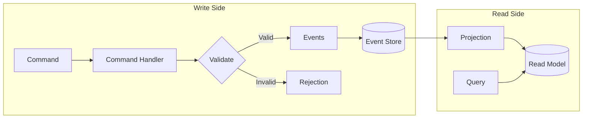
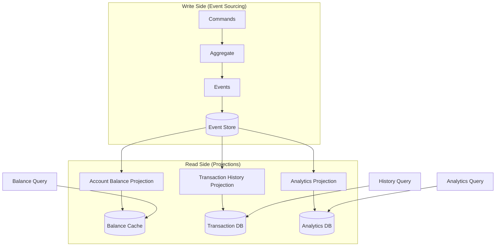
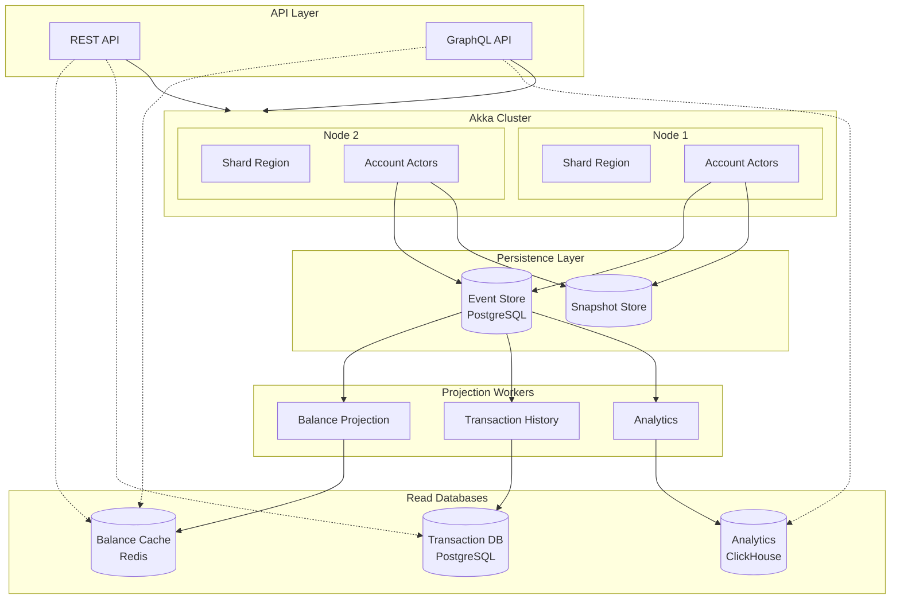

# How to Implement Event Sourcing in Scala

Author: [nawazdhandala](https://www.github.com/nawazdhandala)

Tags: Scala, Event Sourcing, Akka, CQRS, Distributed Systems, Domain-Driven Design, Persistence, Functional Programming

Description: Learn how to implement event sourcing in Scala using Akka Persistence. This guide covers event store design, aggregate roots, command handlers, event handlers, projections, snapshots, and production best practices.

---

> Event sourcing stores every change to application state as a sequence of immutable events. Instead of persisting current state, you persist the history of state transitions. This approach provides a complete audit trail, enables temporal queries, and simplifies debugging in distributed systems.

Traditional CRUD systems overwrite state, losing the history of how data evolved. Event sourcing preserves that history, allowing you to reconstruct state at any point in time, debug issues by replaying events, and build multiple read models from the same event stream.

---

## Why Event Sourcing?

Event sourcing offers several advantages over traditional state-based persistence:

- **Complete Audit Trail**: Every change is recorded as an immutable event
- **Temporal Queries**: Reconstruct state at any point in time
- **Debugging**: Replay events to understand how the system reached a state
- **Multiple Read Models**: Build different views from the same event stream
- **Event-Driven Architecture**: Natural fit for reactive and distributed systems

The tradeoffs include increased storage requirements, eventual consistency between write and read models, and added complexity in querying current state.

---

## Core Concepts

Before diving into implementation, let us understand the key concepts in event sourcing:



- **Events**: Immutable facts that represent something that happened
- **Commands**: Requests to change state (may be rejected)
- **Aggregate**: A cluster of domain objects treated as a single unit
- **Event Store**: Append-only storage for events
- **Projection**: Process that builds read models from events

---

## Project Setup

### Dependencies

Add the following dependencies to your build.sbt file. Akka Persistence provides the event sourcing primitives, while Akka Persistence JDBC enables storage in relational databases.

```scala
// build.sbt
// Core dependencies for event sourcing with Akka
val AkkaVersion = "2.8.5"
val AkkaPersistenceJdbcVersion = "5.2.1"
val SlickVersion = "3.4.1"

libraryDependencies ++= Seq(
  // Akka core and typed actors
  "com.typesafe.akka" %% "akka-actor-typed" % AkkaVersion,

  // Akka Persistence for event sourcing
  "com.typesafe.akka" %% "akka-persistence-typed" % AkkaVersion,

  // JDBC plugin for storing events in PostgreSQL
  "com.lightbend.akka" %% "akka-persistence-jdbc" % AkkaPersistenceJdbcVersion,

  // Slick for database access in projections
  "com.typesafe.slick" %% "slick" % SlickVersion,
  "com.typesafe.slick" %% "slick-hikaricp" % SlickVersion,

  // PostgreSQL driver
  "org.postgresql" % "postgresql" % "42.6.0",

  // Serialization with Jackson
  "com.typesafe.akka" %% "akka-serialization-jackson" % AkkaVersion,

  // Testing
  "com.typesafe.akka" %% "akka-persistence-testkit" % AkkaVersion % Test,
  "org.scalatest" %% "scalatest" % "3.2.17" % Test
)
```

### Configuration

Configure Akka Persistence to use PostgreSQL as the event store. The journal stores events, while the snapshot store persists periodic state snapshots for faster recovery.

```hocon
# application.conf
# Akka configuration for event sourcing

akka {
  # Use typed actors
  actor {
    # Enable Jackson serialization for events and state
    serialization-bindings {
      "com.example.CborSerializable" = jackson-cbor
    }
  }

  # Persistence configuration
  persistence {
    # Configure the journal (event store)
    journal {
      plugin = "jdbc-journal"
      auto-start-journals = ["jdbc-journal"]
    }

    # Configure snapshot storage for faster recovery
    snapshot-store {
      plugin = "jdbc-snapshot-store"
      auto-start-snapshot-stores = ["jdbc-snapshot-store"]
    }
  }
}

# JDBC journal configuration
jdbc-journal {
  slick = ${slick}

  # Event serialization
  event-adapters {
    tagging = "com.example.TaggingEventAdapter"
  }
}

# JDBC snapshot store configuration
jdbc-snapshot-store {
  slick = ${slick}
}

# Database connection settings
slick {
  profile = "slick.jdbc.PostgresProfile$"
  db {
    host = "localhost"
    host = ${?DB_HOST}
    port = 5432
    port = ${?DB_PORT}
    databaseName = "eventstore"
    databaseName = ${?DB_NAME}
    url = "jdbc:postgresql://"${slick.db.host}":"${slick.db.port}"/"${slick.db.databaseName}
    user = "postgres"
    user = ${?DB_USER}
    password = "postgres"
    password = ${?DB_PASSWORD}
    driver = "org.postgresql.Driver"
    numThreads = 10
    maxConnections = 10
    minConnections = 2
  }
}
```

---

## Defining Events and Commands

### Event Definitions

Events are immutable facts that represent state changes. Define them as sealed traits with case classes to ensure exhaustive pattern matching and type safety.

```scala
// domain/BankAccountEvents.scala
package com.example.domain

import java.time.Instant
import java.util.UUID

// Marker trait for CBOR serialization
trait CborSerializable

// Sealed trait ensures all events are defined in this file
// This enables exhaustive pattern matching in event handlers
sealed trait BankAccountEvent extends CborSerializable {
  // Every event has a timestamp for ordering and auditing
  def timestamp: Instant
}

object BankAccountEvent {
  // Event emitted when a new account is created
  // Contains all initial state needed to create the account
  final case class AccountOpened(
    accountId: String,          // Unique identifier for the account
    accountHolder: String,      // Name of the account holder
    initialBalance: BigDecimal, // Starting balance
    timestamp: Instant          // When the account was opened
  ) extends BankAccountEvent

  // Event emitted when money is deposited
  final case class MoneyDeposited(
    accountId: String,
    amount: BigDecimal,         // Amount deposited (always positive)
    transactionId: String,      // Unique ID for this transaction
    timestamp: Instant
  ) extends BankAccountEvent

  // Event emitted when money is withdrawn
  final case class MoneyWithdrawn(
    accountId: String,
    amount: BigDecimal,         // Amount withdrawn (always positive)
    transactionId: String,
    timestamp: Instant
  ) extends BankAccountEvent

  // Event emitted when a transfer is sent to another account
  final case class TransferSent(
    accountId: String,
    targetAccountId: String,    // Destination account
    amount: BigDecimal,
    transferId: String,         // Correlates with TransferReceived
    timestamp: Instant
  ) extends BankAccountEvent

  // Event emitted when a transfer is received from another account
  final case class TransferReceived(
    accountId: String,
    sourceAccountId: String,    // Origin account
    amount: BigDecimal,
    transferId: String,         // Correlates with TransferSent
    timestamp: Instant
  ) extends BankAccountEvent

  // Event emitted when an account is closed
  final case class AccountClosed(
    accountId: String,
    reason: String,             // Why the account was closed
    finalBalance: BigDecimal,   // Balance at time of closure
    timestamp: Instant
  ) extends BankAccountEvent
}
```

### Command Definitions

Commands represent intentions to change state. Unlike events, commands can be rejected if validation fails or if the current state does not allow the operation.

```scala
// domain/BankAccountCommands.scala
package com.example.domain

import akka.actor.typed.ActorRef

// Sealed trait for all commands targeting a bank account
// Commands carry a replyTo actor for sending responses
sealed trait BankAccountCommand extends CborSerializable

object BankAccountCommand {
  // Command to create a new account
  final case class OpenAccount(
    accountId: String,
    accountHolder: String,
    initialBalance: BigDecimal,
    replyTo: ActorRef[BankAccountResponse]  // Where to send the response
  ) extends BankAccountCommand

  // Command to deposit money
  final case class Deposit(
    amount: BigDecimal,
    replyTo: ActorRef[BankAccountResponse]
  ) extends BankAccountCommand

  // Command to withdraw money
  final case class Withdraw(
    amount: BigDecimal,
    replyTo: ActorRef[BankAccountResponse]
  ) extends BankAccountCommand

  // Command to transfer money to another account
  final case class Transfer(
    targetAccountId: String,
    amount: BigDecimal,
    replyTo: ActorRef[BankAccountResponse]
  ) extends BankAccountCommand

  // Command to receive a transfer from another account
  final case class ReceiveTransfer(
    sourceAccountId: String,
    amount: BigDecimal,
    transferId: String,
    replyTo: ActorRef[BankAccountResponse]
  ) extends BankAccountCommand

  // Command to close the account
  final case class CloseAccount(
    reason: String,
    replyTo: ActorRef[BankAccountResponse]
  ) extends BankAccountCommand

  // Query command to get current balance
  final case class GetBalance(
    replyTo: ActorRef[BankAccountResponse]
  ) extends BankAccountCommand
}

// Response types for command handling
sealed trait BankAccountResponse extends CborSerializable

object BankAccountResponse {
  // Success response with current balance
  final case class Success(balance: BigDecimal) extends BankAccountResponse

  // Failure response with error message
  final case class Failure(reason: String) extends BankAccountResponse

  // Response for balance queries
  final case class BalanceResponse(balance: BigDecimal) extends BankAccountResponse
}
```

---

## Building the Aggregate

### State Definition

The aggregate state represents the current state of the entity, derived by folding all events. State should be immutable and contain only what is needed for command validation.

```scala
// domain/BankAccountState.scala
package com.example.domain

import java.time.Instant

// State of a bank account, reconstructed from events
// Using sealed trait allows modeling different lifecycle stages
sealed trait BankAccountState extends CborSerializable

object BankAccountState {
  // Initial state before account is opened
  // Only OpenAccount command is valid in this state
  case object EmptyAccount extends BankAccountState

  // Active account state with all operational data
  final case class OpenedAccount(
    accountId: String,
    accountHolder: String,
    balance: BigDecimal,
    openedAt: Instant,
    transactionCount: Int = 0   // Track number of transactions
  ) extends BankAccountState {

    // Helper method to check if withdrawal is possible
    def canWithdraw(amount: BigDecimal): Boolean =
      balance >= amount && amount > 0

    // Helper method to check if account can be closed
    def canClose: Boolean = balance == BigDecimal(0)
  }

  // Closed account state preserves historical data
  final case class ClosedAccount(
    accountId: String,
    accountHolder: String,
    closedAt: Instant,
    closureReason: String
  ) extends BankAccountState
}
```

### Event Handler

The event handler is a pure function that applies events to state. It must be deterministic because it runs during both event persistence and recovery.

```scala
// domain/BankAccountEventHandler.scala
package com.example.domain

import java.time.Instant
import BankAccountEvent._
import BankAccountState._

object BankAccountEventHandler {

  // Pure function: (State, Event) => State
  // This function is called when persisting events AND during recovery
  // It must be deterministic and free of side effects
  def apply(state: BankAccountState, event: BankAccountEvent): BankAccountState = {
    (state, event) match {

      // Opening an account from empty state
      case (EmptyAccount, AccountOpened(id, holder, balance, timestamp)) =>
        OpenedAccount(
          accountId = id,
          accountHolder = holder,
          balance = balance,
          openedAt = timestamp,
          transactionCount = 0
        )

      // Depositing money increases balance
      case (account: OpenedAccount, MoneyDeposited(_, amount, _, _)) =>
        account.copy(
          balance = account.balance + amount,
          transactionCount = account.transactionCount + 1
        )

      // Withdrawing money decreases balance
      case (account: OpenedAccount, MoneyWithdrawn(_, amount, _, _)) =>
        account.copy(
          balance = account.balance - amount,
          transactionCount = account.transactionCount + 1
        )

      // Sending a transfer decreases balance
      case (account: OpenedAccount, TransferSent(_, _, amount, _, _)) =>
        account.copy(
          balance = account.balance - amount,
          transactionCount = account.transactionCount + 1
        )

      // Receiving a transfer increases balance
      case (account: OpenedAccount, TransferReceived(_, _, amount, _, _)) =>
        account.copy(
          balance = account.balance + amount,
          transactionCount = account.transactionCount + 1
        )

      // Closing account transitions to closed state
      case (account: OpenedAccount, AccountClosed(_, reason, _, timestamp)) =>
        ClosedAccount(
          accountId = account.accountId,
          accountHolder = account.accountHolder,
          closedAt = timestamp,
          closureReason = reason
        )

      // Invalid state transitions should never happen if commands are validated properly
      // But we handle them defensively
      case (s, e) =>
        throw new IllegalStateException(
          s"Unexpected event $e in state $s"
        )
    }
  }
}
```

---

## Implementing the Event-Sourced Actor

### The Aggregate Actor

This is the core of the event sourcing implementation. The EventSourcedBehavior handles command processing, event persistence, and state recovery automatically.

```scala
// actors/BankAccountActor.scala
package com.example.actors

import akka.actor.typed.{ActorRef, Behavior}
import akka.actor.typed.scaladsl.Behaviors
import akka.persistence.typed.PersistenceId
import akka.persistence.typed.scaladsl.{Effect, EventSourcedBehavior, RetentionCriteria}
import java.time.Instant
import java.util.UUID

import com.example.domain._
import BankAccountCommand._
import BankAccountEvent._
import BankAccountResponse._
import BankAccountState._

object BankAccountActor {

  // Factory method to create the actor behavior
  // persistenceId must be unique per entity instance
  def apply(accountId: String): Behavior[BankAccountCommand] = {
    EventSourcedBehavior[BankAccountCommand, BankAccountEvent, BankAccountState](
      // Unique identifier for this entity's event stream
      persistenceId = PersistenceId.ofUniqueId(s"BankAccount-$accountId"),

      // Initial state before any events
      emptyState = EmptyAccount,

      // Command handler: processes commands and returns effects
      commandHandler = commandHandler,

      // Event handler: applies events to state
      eventHandler = BankAccountEventHandler.apply
    )
    // Configure snapshot retention for faster recovery
    .withRetention(RetentionCriteria.snapshotEvery(
      numberOfEvents = 100,       // Snapshot every 100 events
      keepNSnapshots = 2          // Keep last 2 snapshots
    ))
    // Tag events for projections
    .withTagger(_ => Set("bank-account"))
  }

  // Command handler implements the business logic
  // Returns Effect which describes what should happen
  private val commandHandler: (BankAccountState, BankAccountCommand) => Effect[BankAccountEvent, BankAccountState] = {
    (state, command) =>
      state match {
        // Handle commands when account does not exist yet
        case EmptyAccount =>
          handleEmptyAccountCommands(command)

        // Handle commands for active accounts
        case account: OpenedAccount =>
          handleOpenedAccountCommands(account, command)

        // Handle commands for closed accounts (most are rejected)
        case _: ClosedAccount =>
          handleClosedAccountCommands(command)
      }
  }

  // Commands valid for empty (non-existent) accounts
  private def handleEmptyAccountCommands(
    command: BankAccountCommand
  ): Effect[BankAccountEvent, BankAccountState] = {
    command match {
      // Only OpenAccount is valid for empty state
      case OpenAccount(accountId, holder, initialBalance, replyTo) =>
        if (initialBalance < 0) {
          // Reject invalid initial balance
          Effect.none.thenReply(replyTo)(_ => Failure("Initial balance cannot be negative"))
        } else {
          // Create the event and persist it
          val event = AccountOpened(
            accountId = accountId,
            accountHolder = holder,
            initialBalance = initialBalance,
            timestamp = Instant.now()
          )
          Effect
            .persist(event)  // Persist the event
            .thenReply(replyTo)(state => Success(initialBalance))  // Reply after persistence
        }

      // All other commands are invalid for non-existent accounts
      case cmd: BankAccountCommand =>
        Effect.none.thenReply(getReplyTo(cmd))(_ => Failure("Account does not exist"))
    }
  }

  // Commands valid for active accounts
  private def handleOpenedAccountCommands(
    account: OpenedAccount,
    command: BankAccountCommand
  ): Effect[BankAccountEvent, BankAccountState] = {
    command match {

      // Cannot open an already opened account
      case OpenAccount(_, _, _, replyTo) =>
        Effect.none.thenReply(replyTo)(_ => Failure("Account already exists"))

      // Handle deposit command
      case Deposit(amount, replyTo) =>
        if (amount <= 0) {
          Effect.none.thenReply(replyTo)(_ => Failure("Deposit amount must be positive"))
        } else {
          val event = MoneyDeposited(
            accountId = account.accountId,
            amount = amount,
            transactionId = UUID.randomUUID().toString,
            timestamp = Instant.now()
          )
          Effect
            .persist(event)
            .thenReply(replyTo)(state =>
              Success(state.asInstanceOf[OpenedAccount].balance)
            )
        }

      // Handle withdrawal command with balance validation
      case Withdraw(amount, replyTo) =>
        if (amount <= 0) {
          Effect.none.thenReply(replyTo)(_ => Failure("Withdrawal amount must be positive"))
        } else if (!account.canWithdraw(amount)) {
          Effect.none.thenReply(replyTo)(_ => Failure("Insufficient funds"))
        } else {
          val event = MoneyWithdrawn(
            accountId = account.accountId,
            amount = amount,
            transactionId = UUID.randomUUID().toString,
            timestamp = Instant.now()
          )
          Effect
            .persist(event)
            .thenReply(replyTo)(state =>
              Success(state.asInstanceOf[OpenedAccount].balance)
            )
        }

      // Handle outgoing transfer
      case Transfer(targetAccountId, amount, replyTo) =>
        if (amount <= 0) {
          Effect.none.thenReply(replyTo)(_ => Failure("Transfer amount must be positive"))
        } else if (targetAccountId == account.accountId) {
          Effect.none.thenReply(replyTo)(_ => Failure("Cannot transfer to same account"))
        } else if (!account.canWithdraw(amount)) {
          Effect.none.thenReply(replyTo)(_ => Failure("Insufficient funds"))
        } else {
          val event = TransferSent(
            accountId = account.accountId,
            targetAccountId = targetAccountId,
            amount = amount,
            transferId = UUID.randomUUID().toString,
            timestamp = Instant.now()
          )
          Effect
            .persist(event)
            .thenReply(replyTo)(state =>
              Success(state.asInstanceOf[OpenedAccount].balance)
            )
        }

      // Handle incoming transfer
      case ReceiveTransfer(sourceAccountId, amount, transferId, replyTo) =>
        val event = TransferReceived(
          accountId = account.accountId,
          sourceAccountId = sourceAccountId,
          amount = amount,
          transferId = transferId,
          timestamp = Instant.now()
        )
        Effect
          .persist(event)
          .thenReply(replyTo)(state =>
            Success(state.asInstanceOf[OpenedAccount].balance)
          )

      // Handle account closure
      case CloseAccount(reason, replyTo) =>
        if (!account.canClose) {
          Effect.none.thenReply(replyTo)(_ =>
            Failure("Cannot close account with non-zero balance")
          )
        } else {
          val event = AccountClosed(
            accountId = account.accountId,
            reason = reason,
            finalBalance = account.balance,
            timestamp = Instant.now()
          )
          Effect
            .persist(event)
            .thenReply(replyTo)(_ => Success(BigDecimal(0)))
        }

      // Handle balance query (no event persisted)
      case GetBalance(replyTo) =>
        Effect.none.thenReply(replyTo)(_ => BalanceResponse(account.balance))
    }
  }

  // Commands for closed accounts (all rejected except queries)
  private def handleClosedAccountCommands(
    command: BankAccountCommand
  ): Effect[BankAccountEvent, BankAccountState] = {
    command match {
      case GetBalance(replyTo) =>
        Effect.none.thenReply(replyTo)(_ => BalanceResponse(BigDecimal(0)))

      case cmd =>
        Effect.none.thenReply(getReplyTo(cmd))(_ => Failure("Account is closed"))
    }
  }

  // Helper to extract replyTo from any command
  private def getReplyTo(cmd: BankAccountCommand): ActorRef[BankAccountResponse] = {
    cmd match {
      case OpenAccount(_, _, _, replyTo) => replyTo
      case Deposit(_, replyTo) => replyTo
      case Withdraw(_, replyTo) => replyTo
      case Transfer(_, _, replyTo) => replyTo
      case ReceiveTransfer(_, _, _, replyTo) => replyTo
      case CloseAccount(_, replyTo) => replyTo
      case GetBalance(replyTo) => replyTo
    }
  }
}
```

---

## Building Projections

### CQRS Architecture

Event sourcing naturally separates writes (commands/events) from reads (queries). Projections consume events and build read-optimized views.



### Implementing a Projection

Projections consume events from the journal and update read models. This projection maintains a denormalized view of account balances for fast queries.

```scala
// projections/BankAccountProjection.scala
package com.example.projections

import akka.actor.typed.ActorSystem
import akka.persistence.jdbc.query.scaladsl.JdbcReadJournal
import akka.persistence.query.{Offset, PersistenceQuery}
import akka.stream.scaladsl.{RestartSource, Sink}
import akka.stream.{Materializer, RestartSettings}
import slick.jdbc.PostgresProfile.api._

import scala.concurrent.{ExecutionContext, Future}
import scala.concurrent.duration._
import com.example.domain.BankAccountEvent
import BankAccountEvent._

// Read model table definition using Slick
class AccountBalancesTable(tag: Tag) extends Table[(String, String, BigDecimal, Long)](tag, "account_balances") {
  def accountId = column[String]("account_id", O.PrimaryKey)
  def accountHolder = column[String]("account_holder")
  def balance = column[BigDecimal]("balance")
  def lastEventOffset = column[Long]("last_event_offset")

  def * = (accountId, accountHolder, balance, lastEventOffset)
}

// Transaction history table for audit queries
class TransactionsTable(tag: Tag) extends Table[(String, String, String, BigDecimal, java.sql.Timestamp)](tag, "transactions") {
  def transactionId = column[String]("transaction_id", O.PrimaryKey)
  def accountId = column[String]("account_id")
  def transactionType = column[String]("transaction_type")
  def amount = column[BigDecimal]("amount")
  def timestamp = column[java.sql.Timestamp]("timestamp")

  def * = (transactionId, accountId, transactionType, amount, timestamp)

  def accountIdx = index("idx_transactions_account", accountId)
}

class BankAccountProjection(
  db: Database
)(implicit system: ActorSystem[_], ec: ExecutionContext, mat: Materializer) {

  // Table query objects
  val accountBalances = TableQuery[AccountBalancesTable]
  val transactions = TableQuery[TransactionsTable]

  // Get the read journal for querying events
  private val readJournal = PersistenceQuery(system)
    .readJournalFor[JdbcReadJournal](JdbcReadJournal.Identifier)

  // Start the projection with automatic restart on failure
  def start(): Unit = {
    // Restart settings for resilience
    val restartSettings = RestartSettings(
      minBackoff = 1.second,      // Initial delay after failure
      maxBackoff = 30.seconds,    // Maximum delay
      randomFactor = 0.2          // Add jitter to prevent thundering herd
    )

    // Create a restart source that resumes from last processed offset
    RestartSource
      .withBackoff(restartSettings) { () =>
        // Query the last processed offset from database
        val offsetFuture = getLastProcessedOffset()

        akka.stream.scaladsl.Source
          .future(offsetFuture)
          .flatMapConcat { offset =>
            // Stream events from the journal starting at offset
            readJournal.eventsByTag("bank-account", offset)
          }
      }
      // Process each event
      .mapAsync(1) { envelope =>
        processEvent(envelope.event.asInstanceOf[BankAccountEvent], envelope.offset)
      }
      // Run the stream
      .runWith(Sink.ignore)
  }

  // Get the last successfully processed offset
  private def getLastProcessedOffset(): Future[Offset] = {
    val query = accountBalances.map(_.lastEventOffset).max.result
    db.run(query).map {
      case Some(offset) => Offset.sequence(offset)
      case None => Offset.noOffset
    }
  }

  // Process a single event and update read models
  private def processEvent(event: BankAccountEvent, offset: Offset): Future[Unit] = {
    val sequenceOffset = offset match {
      case Offset.Sequence(value) => value
      case _ => 0L
    }

    event match {
      case AccountOpened(accountId, holder, initialBalance, timestamp) =>
        val insertAction = accountBalances += (accountId, holder, initialBalance, sequenceOffset)
        db.run(insertAction).map(_ => ())

      case MoneyDeposited(accountId, amount, transactionId, timestamp) =>
        val actions = DBIO.seq(
          // Update balance
          accountBalances
            .filter(_.accountId === accountId)
            .map(a => (a.balance, a.lastEventOffset))
            .update((
              accountBalances.filter(_.accountId === accountId).map(_.balance).result.head + amount,
              sequenceOffset
            )),
          // Insert transaction record
          transactions += (
            transactionId,
            accountId,
            "DEPOSIT",
            amount,
            java.sql.Timestamp.from(timestamp)
          )
        )
        db.run(updateBalanceAndAddTransaction(accountId, amount, "DEPOSIT", transactionId, timestamp, sequenceOffset))

      case MoneyWithdrawn(accountId, amount, transactionId, timestamp) =>
        db.run(updateBalanceAndAddTransaction(accountId, -amount, "WITHDRAWAL", transactionId, timestamp, sequenceOffset))

      case TransferSent(accountId, targetAccountId, amount, transferId, timestamp) =>
        db.run(updateBalanceAndAddTransaction(accountId, -amount, s"TRANSFER_OUT:$targetAccountId", transferId, timestamp, sequenceOffset))

      case TransferReceived(accountId, sourceAccountId, amount, transferId, timestamp) =>
        db.run(updateBalanceAndAddTransaction(accountId, amount, s"TRANSFER_IN:$sourceAccountId", transferId, timestamp, sequenceOffset))

      case AccountClosed(accountId, reason, finalBalance, timestamp) =>
        val deleteAction = accountBalances.filter(_.accountId === accountId).delete
        db.run(deleteAction).map(_ => ())
    }
  }

  // Helper to update balance and add transaction atomically
  private def updateBalanceAndAddTransaction(
    accountId: String,
    amountDelta: BigDecimal,
    transactionType: String,
    transactionId: String,
    timestamp: java.time.Instant,
    offset: Long
  ): DBIO[Unit] = {
    for {
      // Get current balance
      currentBalance <- accountBalances
        .filter(_.accountId === accountId)
        .map(_.balance)
        .result
        .head

      // Update balance and offset
      _ <- accountBalances
        .filter(_.accountId === accountId)
        .map(a => (a.balance, a.lastEventOffset))
        .update((currentBalance + amountDelta, offset))

      // Insert transaction
      _ <- transactions += (
        transactionId,
        accountId,
        transactionType,
        amountDelta.abs,
        java.sql.Timestamp.from(timestamp)
      )
    } yield ()
  }
}
```

---

## Event Serialization

### Jackson Serialization

Configure Jackson for event serialization. Events must be serializable for persistence and cluster communication.

```scala
// serialization/EventSerializer.scala
package com.example.serialization

import com.fasterxml.jackson.annotation.JsonTypeInfo
import com.fasterxml.jackson.databind.{DeserializationFeature, ObjectMapper, SerializationFeature}
import com.fasterxml.jackson.databind.json.JsonMapper
import com.fasterxml.jackson.datatype.jsr310.JavaTimeModule
import com.fasterxml.jackson.module.scala.DefaultScalaModule

object JacksonConfig {

  // Create a configured ObjectMapper for event serialization
  // This mapper handles Scala types and Java 8 time types correctly
  val objectMapper: ObjectMapper = JsonMapper.builder()
    // Support Scala case classes, Options, collections
    .addModule(DefaultScalaModule)
    // Support java.time.Instant and other Java 8 time types
    .addModule(new JavaTimeModule())
    .build()
    // Write dates as ISO strings, not timestamps
    .configure(SerializationFeature.WRITE_DATES_AS_TIMESTAMPS, false)
    // Don't fail on unknown properties (forward compatibility)
    .configure(DeserializationFeature.FAIL_ON_UNKNOWN_PROPERTIES, false)
}
```

### Event Versioning

As your system evolves, event schemas will change. Implement event adapters to handle schema evolution without breaking existing data.

```scala
// serialization/EventAdapter.scala
package com.example.serialization

import akka.persistence.journal.{EventAdapter, EventSeq, Tagged}
import com.example.domain.BankAccountEvent
import com.example.domain.BankAccountEvent._

// Event adapter for schema evolution and tagging
class BankAccountEventAdapter extends EventAdapter {

  // Current manifest version
  private val CurrentVersion = "v2"

  // Convert domain event to journal representation
  // Use this to add tags and version information
  override def toJournal(event: Any): Any = {
    event match {
      case e: BankAccountEvent =>
        // Tag events for projections to consume
        Tagged(e, Set("bank-account", s"account-${getAccountId(e)}"))
      case other => other
    }
  }

  // Get manifest for serialization versioning
  override def manifest(event: Any): String = {
    event match {
      case _: AccountOpened => s"AccountOpened-$CurrentVersion"
      case _: MoneyDeposited => s"MoneyDeposited-$CurrentVersion"
      case _: MoneyWithdrawn => s"MoneyWithdrawn-$CurrentVersion"
      case _: TransferSent => s"TransferSent-$CurrentVersion"
      case _: TransferReceived => s"TransferReceived-$CurrentVersion"
      case _: AccountClosed => s"AccountClosed-$CurrentVersion"
      case _ => ""
    }
  }

  // Convert from journal representation to domain event
  // Handle old versions here for backward compatibility
  override def fromJournal(event: Any, manifest: String): EventSeq = {
    event match {
      // Handle v1 events (example: old schema without transactionId)
      case e: MoneyDeposited if manifest == "MoneyDeposited-v1" =>
        // Migrate v1 event to current schema
        EventSeq.single(e.copy(
          transactionId = s"migrated-${e.accountId}-${e.timestamp.toEpochMilli}"
        ))

      // Current version events pass through unchanged
      case e: BankAccountEvent =>
        EventSeq.single(e)

      case other =>
        EventSeq.single(other)
    }
  }

  // Helper to extract account ID from any event
  private def getAccountId(event: BankAccountEvent): String = {
    event match {
      case e: AccountOpened => e.accountId
      case e: MoneyDeposited => e.accountId
      case e: MoneyWithdrawn => e.accountId
      case e: TransferSent => e.accountId
      case e: TransferReceived => e.accountId
      case e: AccountClosed => e.accountId
    }
  }
}
```

---

## Testing Event-Sourced Systems

### Unit Testing with TestKit

Akka Persistence TestKit allows testing event-sourced actors without a real database.

```scala
// test/BankAccountActorSpec.scala
package com.example.actors

import akka.actor.testkit.typed.scaladsl.ScalaTestWithActorTestKit
import akka.persistence.testkit.scaladsl.EventSourcedBehaviorTestKit
import akka.persistence.testkit.scaladsl.EventSourcedBehaviorTestKit.SerializationSettings
import org.scalatest.BeforeAndAfterEach
import org.scalatest.wordspec.AnyWordSpecLike

import com.example.domain._
import BankAccountCommand._
import BankAccountEvent._
import BankAccountResponse._
import BankAccountState._

class BankAccountActorSpec
  extends ScalaTestWithActorTestKit(EventSourcedBehaviorTestKit.config)
  with AnyWordSpecLike
  with BeforeAndAfterEach {

  // Create test kit for the actor
  private val eventSourcedTestKit = EventSourcedBehaviorTestKit[
    BankAccountCommand,
    BankAccountEvent,
    BankAccountState
  ](
    system,
    BankAccountActor("test-account-1"),
    SerializationSettings.disabled  // Disable for faster tests
  )

  // Clear state between tests
  override protected def beforeEach(): Unit = {
    super.beforeEach()
    eventSourcedTestKit.clear()
  }

  "BankAccountActor" should {

    "open a new account" in {
      // Run command and get result
      val result = eventSourcedTestKit.runCommand[BankAccountResponse](
        OpenAccount("test-account-1", "John Doe", BigDecimal(100), _)
      )

      // Verify event was persisted
      result.event shouldBe an[AccountOpened]
      result.event.asInstanceOf[AccountOpened].initialBalance shouldBe BigDecimal(100)

      // Verify state was updated
      result.state shouldBe an[OpenedAccount]
      result.state.asInstanceOf[OpenedAccount].balance shouldBe BigDecimal(100)

      // Verify reply
      result.reply shouldBe Success(BigDecimal(100))
    }

    "reject negative initial balance" in {
      val result = eventSourcedTestKit.runCommand[BankAccountResponse](
        OpenAccount("test-account-1", "John Doe", BigDecimal(-50), _)
      )

      // No event should be persisted
      result.hasNoEvents shouldBe true

      // State should remain empty
      result.state shouldBe EmptyAccount

      // Should receive failure
      result.reply shouldBe Failure("Initial balance cannot be negative")
    }

    "deposit money" in {
      // First open the account
      eventSourcedTestKit.runCommand[BankAccountResponse](
        OpenAccount("test-account-1", "John Doe", BigDecimal(100), _)
      )

      // Then deposit
      val result = eventSourcedTestKit.runCommand[BankAccountResponse](
        Deposit(BigDecimal(50), _)
      )

      result.event shouldBe an[MoneyDeposited]
      result.state.asInstanceOf[OpenedAccount].balance shouldBe BigDecimal(150)
      result.reply shouldBe Success(BigDecimal(150))
    }

    "withdraw money with sufficient funds" in {
      eventSourcedTestKit.runCommand[BankAccountResponse](
        OpenAccount("test-account-1", "John Doe", BigDecimal(100), _)
      )

      val result = eventSourcedTestKit.runCommand[BankAccountResponse](
        Withdraw(BigDecimal(30), _)
      )

      result.event shouldBe an[MoneyWithdrawn]
      result.state.asInstanceOf[OpenedAccount].balance shouldBe BigDecimal(70)
    }

    "reject withdrawal with insufficient funds" in {
      eventSourcedTestKit.runCommand[BankAccountResponse](
        OpenAccount("test-account-1", "John Doe", BigDecimal(100), _)
      )

      val result = eventSourcedTestKit.runCommand[BankAccountResponse](
        Withdraw(BigDecimal(150), _)
      )

      result.hasNoEvents shouldBe true
      result.reply shouldBe Failure("Insufficient funds")
    }

    "recover state from events" in {
      // Open and perform transactions
      eventSourcedTestKit.runCommand[BankAccountResponse](
        OpenAccount("test-account-1", "John Doe", BigDecimal(100), _)
      )
      eventSourcedTestKit.runCommand[BankAccountResponse](
        Deposit(BigDecimal(50), _)
      )
      eventSourcedTestKit.runCommand[BankAccountResponse](
        Withdraw(BigDecimal(30), _)
      )

      // Restart the actor (simulates crash/recovery)
      val restartedState = eventSourcedTestKit.restart()

      // State should be recovered from events
      restartedState.state.asInstanceOf[OpenedAccount].balance shouldBe BigDecimal(120)
    }

    "close account with zero balance" in {
      eventSourcedTestKit.runCommand[BankAccountResponse](
        OpenAccount("test-account-1", "John Doe", BigDecimal(100), _)
      )
      eventSourcedTestKit.runCommand[BankAccountResponse](
        Withdraw(BigDecimal(100), _)
      )

      val result = eventSourcedTestKit.runCommand[BankAccountResponse](
        CloseAccount("Customer request", _)
      )

      result.event shouldBe an[AccountClosed]
      result.state shouldBe a[ClosedAccount]
    }

    "reject commands on closed account" in {
      eventSourcedTestKit.runCommand[BankAccountResponse](
        OpenAccount("test-account-1", "John Doe", BigDecimal(0), _)
      )
      eventSourcedTestKit.runCommand[BankAccountResponse](
        CloseAccount("Test", _)
      )

      val result = eventSourcedTestKit.runCommand[BankAccountResponse](
        Deposit(BigDecimal(50), _)
      )

      result.hasNoEvents shouldBe true
      result.reply shouldBe Failure("Account is closed")
    }
  }
}
```

---

## Production Considerations

### Snapshots for Faster Recovery

For entities with many events, configure snapshotting to speed up recovery.

```scala
// actors/BankAccountActorWithSnapshots.scala
package com.example.actors

import akka.persistence.typed.scaladsl.{Effect, EventSourcedBehavior, RetentionCriteria}
import akka.persistence.typed.{PersistenceId, RecoveryCompleted, SnapshotCompleted, SnapshotFailed}

def applyWithSnapshots(accountId: String): Behavior[BankAccountCommand] = {
  EventSourcedBehavior[BankAccountCommand, BankAccountEvent, BankAccountState](
    persistenceId = PersistenceId.ofUniqueId(s"BankAccount-$accountId"),
    emptyState = EmptyAccount,
    commandHandler = commandHandler,
    eventHandler = BankAccountEventHandler.apply
  )
  // Snapshot every 100 events, keep 2 snapshots
  .withRetention(RetentionCriteria.snapshotEvery(
    numberOfEvents = 100,
    keepNSnapshots = 2
  ).withDeleteEventsOnSnapshot)  // Delete old events after snapshot

  // Handle recovery completion
  .receiveSignal {
    case (state, RecoveryCompleted) =>
      system.log.info(s"Recovery completed for $accountId, state: $state")

    case (state, SnapshotCompleted(metadata)) =>
      system.log.debug(s"Snapshot completed: ${metadata.sequenceNr}")

    case (state, SnapshotFailed(metadata, failure)) =>
      system.log.error(s"Snapshot failed: ${failure.getMessage}")
  }
}
```

### Cluster Sharding

For distributed deployments, use Akka Cluster Sharding to distribute entities across nodes.

```scala
// cluster/ShardedBankAccount.scala
package com.example.cluster

import akka.actor.typed.ActorSystem
import akka.cluster.sharding.typed.scaladsl.{ClusterSharding, Entity, EntityTypeKey}
import akka.cluster.sharding.typed.ShardingEnvelope

import com.example.actors.BankAccountActor
import com.example.domain.BankAccountCommand

object ShardedBankAccount {

  // Entity type key identifies this entity type in the cluster
  val TypeKey: EntityTypeKey[BankAccountCommand] =
    EntityTypeKey[BankAccountCommand]("BankAccount")

  // Initialize sharding for bank accounts
  def init(system: ActorSystem[_]): Unit = {
    ClusterSharding(system).init(
      Entity(TypeKey) { entityContext =>
        // Create actor for each entity ID
        BankAccountActor(entityContext.entityId)
      }
      // Configure passivation to save memory
      .withSettings(
        ClusterShardingSettings(system)
          .withPassivationStrategy(
            ClusterShardingSettings.PassivationStrategySettings.defaults
              .withIdleEntityPassivation(10.minutes)
          )
      )
    )
  }

  // Get reference to send commands to specific account
  def entityRef(
    sharding: ClusterSharding,
    accountId: String
  ) = {
    sharding.entityRefFor(TypeKey, accountId)
  }
}
```

---

## Complete Architecture

The following diagram shows how all components fit together in a production event-sourced system:



---

## Best Practices Summary

1. **Design Events as Facts**: Events should be past-tense, immutable facts that describe what happened, not what should happen
2. **Keep Events Small**: Include only the data needed to reconstruct state
3. **Version Your Events**: Plan for schema evolution from the start with event adapters
4. **Use Snapshots**: Configure snapshotting for entities with many events to speed up recovery
5. **Separate Read and Write**: Build projections for query-optimized read models
6. **Test Event Handlers**: Event handlers must be pure functions - test them extensively
7. **Monitor Event Lag**: Track the delay between event persistence and projection updates
8. **Handle Idempotency**: Design projections to handle duplicate event delivery

---

*Building event-sourced systems requires robust monitoring to track event throughput, projection lag, and system health. [OneUptime](https://oneuptime.com) provides comprehensive observability for Scala applications, including distributed tracing with Akka integration, real-time metrics dashboards, and intelligent alerting to ensure your event-sourced architecture runs smoothly in production.*

**Related Reading:**
- [How to Build Applications with ZIO](https://oneuptime.com/blog/post/2026-02-02-scala-zio-applications/view)
- [How to Use Kafka with Scala](https://oneuptime.com/blog/post/2026-02-13-how-to-use-kafka-with-scala/view)
- [How to Handle JSON with Circe](https://oneuptime.com/blog/post/2026-02-02-scala-circe-json/view)
