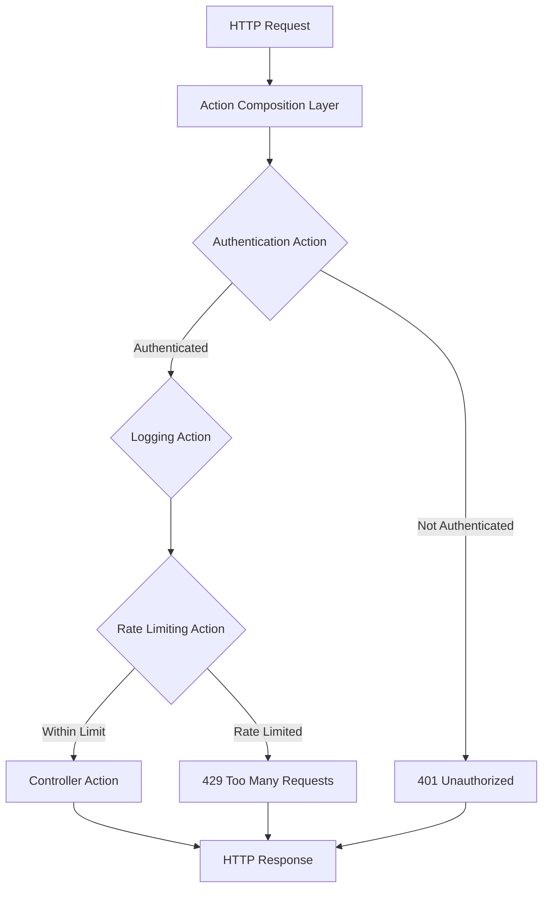
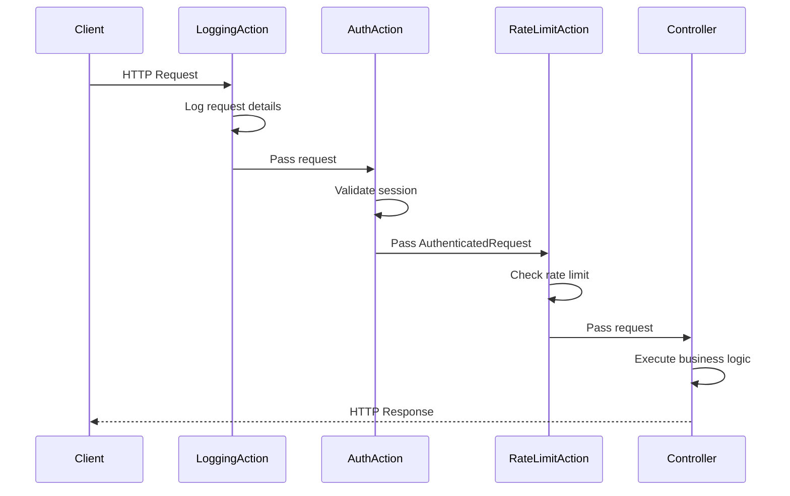

# How to Configure Play Framework Action Composition

Author: [nawazdhandala](https://www.github.com/nawazdhandala)

Tags: Scala, Play Framework, Actions, Web, Middleware, Authentication, Logging, Security

Description: Learn how to build reusable, composable actions in Play Framework using action composition. This guide covers authentication, logging, rate limiting, and custom action builders with practical examples.

---

> Action composition is one of the most powerful features in Play Framework, allowing you to build modular, reusable request handling logic. Instead of repeating authentication checks, logging, or validation in every controller method, you can compose actions that handle these concerns declaratively.

Play Framework's action composition pattern enables you to stack multiple behaviors on top of each other, creating a clean separation of concerns. This guide walks you through everything from basic action builders to advanced composition patterns used in production applications.

---

## Understanding Actions in Play Framework

In Play Framework, an `Action` is the fundamental unit of request handling. Every controller method returns an `Action` that processes an HTTP request and produces a response.

```scala
// A simple action that returns a plain text response
def index() = Action { implicit request =>
  Ok("Hello, World!")
}
```

But what happens when you need to add authentication? Or logging? Or rate limiting? Without action composition, you would duplicate code across every endpoint. Action composition solves this by letting you wrap actions with reusable behaviors.

---

## How Action Composition Works

The following diagram illustrates how action composition creates a pipeline of request processing:



Each action in the composition chain can:
- Modify the request before passing it down
- Short-circuit the request and return an immediate response
- Modify the response on the way back up
- Add side effects like logging or metrics

---

## Basic Action Builder

Let's start with a basic custom action builder. The `ActionBuilder` trait is the foundation for creating custom actions.

The following code creates a simple action builder that logs every request:

```scala
// app/actions/LoggingAction.scala
package actions

import javax.inject.Inject
import play.api.mvc._
import play.api.Logging
import scala.concurrent.{ExecutionContext, Future}

// LoggingAction logs the method and path of every incoming request
// This is useful for debugging and monitoring request patterns
class LoggingAction @Inject()(
  parser: BodyParsers.Default
)(implicit ec: ExecutionContext)
  extends ActionBuilderImpl(parser) with Logging {

  // The invokeBlock method is called for every request
  // It wraps the actual action logic with logging
  override def invokeBlock[A](
    request: Request[A],
    block: Request[A] => Future[Result]
  ): Future[Result] = {

    // Log the incoming request details
    logger.info(s"Request: ${request.method} ${request.path}")

    val startTime = System.currentTimeMillis()

    // Execute the actual action and log the response time
    block(request).map { result =>
      val endTime = System.currentTimeMillis()
      val duration = endTime - startTime
      logger.info(s"Response: ${result.header.status} in ${duration}ms")
      result
    }
  }
}
```

Now you can use this action builder in your controller:

```scala
// app/controllers/HomeController.scala
package controllers

import javax.inject.Inject
import play.api.mvc._
import actions.LoggingAction

class HomeController @Inject()(
  cc: ControllerComponents,
  loggingAction: LoggingAction
) extends AbstractController(cc) {

  // Every request to this endpoint will be logged automatically
  def index() = loggingAction { implicit request =>
    Ok("Hello with logging!")
  }
}
```

---

## Action Refinement for Authentication

For authentication, you typically need to add user information to the request. Play provides `ActionRefiner` for this purpose.

The following code creates an authenticated action that extracts user information from a session:

```scala
// app/actions/AuthenticatedAction.scala
package actions

import javax.inject.Inject
import play.api.mvc._
import scala.concurrent.{ExecutionContext, Future}
import models.User
import services.UserService

// Custom request type that includes the authenticated user
// This allows controllers to access user information directly
class AuthenticatedRequest[A](
  val user: User,
  request: Request[A]
) extends WrappedRequest[A](request)

// AuthenticatedAction validates the session and extracts user information
// It rejects requests without valid authentication
class AuthenticatedAction @Inject()(
  parser: BodyParsers.Default,
  userService: UserService
)(implicit ec: ExecutionContext) extends ActionBuilder[AuthenticatedRequest, AnyContent]
  with ActionRefiner[Request, AuthenticatedRequest] {

  override def parser: BodyParser[AnyContent] = parser
  override protected def executionContext: ExecutionContext = ec

  // refine transforms a Request into an AuthenticatedRequest
  // It returns Left(Result) to reject the request or Right(AuthenticatedRequest) to continue
  override protected def refine[A](
    request: Request[A]
  ): Future[Either[Result, AuthenticatedRequest[A]]] = {

    // Extract the user ID from the session
    request.session.get("userId") match {
      case Some(userId) =>
        // Look up the user in the database
        userService.findById(userId).map {
          case Some(user) =>
            Right(new AuthenticatedRequest(user, request))
          case None =>
            Left(Results.Unauthorized("User not found"))
        }
      case None =>
        // No session found, reject the request
        Future.successful(Left(Results.Unauthorized("Not authenticated")))
    }
  }
}
```

Use the authenticated action in your controller to protect endpoints:

```scala
// app/controllers/ProfileController.scala
package controllers

import javax.inject.Inject
import play.api.mvc._
import actions.{AuthenticatedAction, AuthenticatedRequest}

class ProfileController @Inject()(
  cc: ControllerComponents,
  authenticatedAction: AuthenticatedAction
) extends AbstractController(cc) {

  // Only authenticated users can access this endpoint
  // The user object is available directly on the request
  def profile() = authenticatedAction { implicit request: AuthenticatedRequest[AnyContent] =>
    Ok(s"Welcome, ${request.user.name}!")
  }

  def settings() = authenticatedAction { implicit request: AuthenticatedRequest[AnyContent] =>
    Ok(views.html.settings(request.user))
  }
}
```

---

## Composing Multiple Actions

The real power of action composition comes from combining multiple actions. Play provides `andThen` for chaining actions together.

The following diagram shows how actions are composed in sequence:



Here is how to create composable action functions:

```scala
// app/actions/ActionComposer.scala
package actions

import javax.inject.Inject
import play.api.mvc._
import scala.concurrent.{ExecutionContext, Future}
import models.User
import services.{UserService, RateLimitService}

// ActionFilter allows you to conditionally block requests
// without modifying the request type
class RateLimitFilter @Inject()(
  rateLimitService: RateLimitService
)(implicit ec: ExecutionContext) extends ActionFilter[AuthenticatedRequest] {

  override protected def executionContext: ExecutionContext = ec

  // filter returns None to allow the request or Some(Result) to block it
  override protected def filter[A](
    request: AuthenticatedRequest[A]
  ): Future[Option[Result]] = {

    val userId = request.user.id

    rateLimitService.checkLimit(userId).map { allowed =>
      if (allowed) {
        None  // Request is allowed to proceed
      } else {
        Some(Results.TooManyRequests("Rate limit exceeded"))
      }
    }
  }
}

// ActionComposer provides pre-built action chains for common use cases
class ActionComposer @Inject()(
  loggingAction: LoggingAction,
  authenticatedAction: AuthenticatedAction,
  rateLimitFilter: RateLimitFilter
)(implicit ec: ExecutionContext) {

  // Compose logging with authentication
  // Use this for endpoints that need authentication but not rate limiting
  def authenticatedWithLogging: ActionBuilder[AuthenticatedRequest, AnyContent] = {
    loggingAction.andThen(authenticatedAction)
  }

  // Full composition with logging, authentication, and rate limiting
  // Use this for API endpoints that need all protections
  def secureApiAction: ActionBuilder[AuthenticatedRequest, AnyContent] = {
    loggingAction.andThen(authenticatedAction).andThen(rateLimitFilter)
  }
}
```

Use the composed actions in your controller:

```scala
// app/controllers/ApiController.scala
package controllers

import javax.inject.Inject
import play.api.mvc._
import actions.{ActionComposer, AuthenticatedRequest}

class ApiController @Inject()(
  cc: ControllerComponents,
  actionComposer: ActionComposer
) extends AbstractController(cc) {

  // This endpoint has logging, authentication, and rate limiting
  def secureEndpoint() = actionComposer.secureApiAction {
    implicit request: AuthenticatedRequest[AnyContent] =>
    Ok(s"Secure data for ${request.user.name}")
  }

  // This endpoint only has logging and authentication
  def authenticatedEndpoint() = actionComposer.authenticatedWithLogging {
    implicit request: AuthenticatedRequest[AnyContent] =>
    Ok(s"Hello, ${request.user.name}")
  }
}
```

---

## Role-Based Access Control

Action composition excels at implementing role-based access control (RBAC). You can create action filters that check user permissions.

The following code implements a permission-checking action:

```scala
// app/actions/PermissionAction.scala
package actions

import javax.inject.Inject
import play.api.mvc._
import scala.concurrent.{ExecutionContext, Future}
import models.Permission

// PermissionAction checks if the user has the required permission
// This enables fine-grained access control for different endpoints
class PermissionAction(
  requiredPermission: Permission
)(implicit ec: ExecutionContext) extends ActionFilter[AuthenticatedRequest] {

  override protected def executionContext: ExecutionContext = ec

  override protected def filter[A](
    request: AuthenticatedRequest[A]
  ): Future[Option[Result]] = {

    // Check if the user has the required permission
    if (request.user.hasPermission(requiredPermission)) {
      Future.successful(None)  // Allow the request
    } else {
      Future.successful(Some(Results.Forbidden("Insufficient permissions")))
    }
  }
}

// Factory for creating permission actions with different requirements
class PermissionActionFactory @Inject()(implicit ec: ExecutionContext) {

  def requirePermission(permission: Permission): PermissionAction = {
    new PermissionAction(permission)
  }

  // Common permission shortcuts
  def requireAdmin: PermissionAction = requirePermission(Permission.Admin)
  def requireWrite: PermissionAction = requirePermission(Permission.Write)
  def requireRead: PermissionAction = requirePermission(Permission.Read)
}
```

Use permission-based actions in your admin controller:

```scala
// app/controllers/AdminController.scala
package controllers

import javax.inject.Inject
import play.api.mvc._
import actions.{ActionComposer, AuthenticatedRequest, PermissionActionFactory}

class AdminController @Inject()(
  cc: ControllerComponents,
  actionComposer: ActionComposer,
  permissionFactory: PermissionActionFactory
) extends AbstractController(cc) {

  // Only users with admin permission can access this endpoint
  def adminDashboard() = actionComposer.authenticatedWithLogging
    .andThen(permissionFactory.requireAdmin) {
      implicit request: AuthenticatedRequest[AnyContent] =>
      Ok(views.html.admin.dashboard(request.user))
    }

  // Only users with write permission can create resources
  def createResource() = actionComposer.secureApiAction
    .andThen(permissionFactory.requireWrite) {
      implicit request: AuthenticatedRequest[AnyContent] =>
      Created("Resource created")
    }
}
```

---

## Request Validation Action

You can use action composition to validate request data before it reaches your controller logic.

The following code creates a validation action that checks JSON payloads:

```scala
// app/actions/ValidatedAction.scala
package actions

import javax.inject.Inject
import play.api.mvc._
import play.api.libs.json._
import scala.concurrent.{ExecutionContext, Future}

// ValidatedRequest wraps a request with validated and parsed data
// This ensures controllers receive type-safe, validated input
class ValidatedRequest[A, B](
  val validatedData: B,
  request: Request[A]
) extends WrappedRequest[A](request)

// ValidationAction parses and validates JSON request bodies
// It rejects requests with invalid or malformed data
class ValidationAction[T](
  implicit reads: Reads[T],
  ec: ExecutionContext
) extends ActionRefiner[Request, ({type L[A] = ValidatedRequest[A, T]})#L] {

  override protected def executionContext: ExecutionContext = ec

  override protected def refine[A](
    request: Request[A]
  ): Future[Either[Result, ValidatedRequest[A, T]]] = {

    // Attempt to parse the request body as JSON
    request.body match {
      case body: AnyContentAsJson =>
        body.asJson match {
          case Some(json) =>
            json.validate[T] match {
              case JsSuccess(data, _) =>
                Future.successful(Right(new ValidatedRequest(data, request)))
              case JsError(errors) =>
                val errorMessages = errors.flatMap { case (path, validationErrors) =>
                  validationErrors.map(e => s"${path}: ${e.message}")
                }
                Future.successful(Left(Results.BadRequest(Json.obj(
                  "errors" -> errorMessages
                ))))
            }
          case None =>
            Future.successful(Left(Results.BadRequest("Invalid JSON")))
        }
      case _ =>
        Future.successful(Left(Results.BadRequest("Expected JSON body")))
    }
  }
}

// Factory for creating validation actions with different types
class ValidationActionFactory @Inject()(implicit ec: ExecutionContext) {

  def validate[T](implicit reads: Reads[T]): ValidationAction[T] = {
    new ValidationAction[T]
  }
}
```

Use the validation action to ensure request data is valid:

```scala
// app/controllers/UserController.scala
package controllers

import javax.inject.Inject
import play.api.mvc._
import play.api.libs.json._
import actions.{ActionComposer, ValidationActionFactory, ValidatedRequest}

// Define the expected request format
case class CreateUserRequest(name: String, email: String, age: Int)

object CreateUserRequest {
  // JSON reads with validation rules
  implicit val reads: Reads[CreateUserRequest] = (
    (__ \ "name").read[String].filter(JsonValidationError("Name is required"))(_.nonEmpty) and
    (__ \ "email").read[String].filter(JsonValidationError("Invalid email"))(_.contains("@")) and
    (__ \ "age").read[Int].filter(JsonValidationError("Age must be positive"))(_ > 0)
  )(CreateUserRequest.apply _)
}

class UserController @Inject()(
  cc: ControllerComponents,
  actionComposer: ActionComposer,
  validationFactory: ValidationActionFactory
) extends AbstractController(cc) {

  // The request body is automatically validated before reaching this code
  // If validation fails, a 400 Bad Request is returned automatically
  def createUser() = actionComposer.secureApiAction
    .andThen(validationFactory.validate[CreateUserRequest]) {
      implicit request: ValidatedRequest[AnyContent, CreateUserRequest] =>

      val userData = request.validatedData
      // userData is guaranteed to be valid at this point
      Created(Json.obj(
        "name" -> userData.name,
        "email" -> userData.email,
        "age" -> userData.age
      ))
    }
}
```

---

## Timing and Metrics Action

For production applications, you often need to collect timing metrics. Here is an action that measures request duration:

```scala
// app/actions/TimingAction.scala
package actions

import javax.inject.Inject
import play.api.mvc._
import scala.concurrent.{ExecutionContext, Future}
import services.MetricsService

// TimingAction measures and reports request processing time
// This integrates with your metrics system for monitoring
class TimingAction @Inject()(
  parser: BodyParsers.Default,
  metricsService: MetricsService
)(implicit ec: ExecutionContext) extends ActionBuilderImpl(parser) {

  override def invokeBlock[A](
    request: Request[A],
    block: Request[A] => Future[Result]
  ): Future[Result] = {

    val startTime = System.nanoTime()
    val endpoint = s"${request.method}_${request.path}"

    block(request).map { result =>
      val endTime = System.nanoTime()
      val durationMs = (endTime - startTime) / 1000000.0

      // Report metrics to your monitoring system
      metricsService.recordRequestDuration(endpoint, durationMs)
      metricsService.incrementRequestCount(endpoint, result.header.status)

      // Add timing header for debugging
      result.withHeaders("X-Response-Time" -> s"${durationMs}ms")
    }.recover { case ex =>
      val endTime = System.nanoTime()
      val durationMs = (endTime - startTime) / 1000000.0

      metricsService.recordRequestDuration(endpoint, durationMs)
      metricsService.incrementErrorCount(endpoint)

      throw ex
    }
  }
}
```

---

## Error Handling Action

Consistent error handling across your API is essential. Create an action that catches exceptions and returns proper JSON errors:

```scala
// app/actions/ErrorHandlingAction.scala
package actions

import javax.inject.Inject
import play.api.mvc._
import play.api.libs.json._
import play.api.Logging
import scala.concurrent.{ExecutionContext, Future}
import scala.util.control.NonFatal

// Custom exception types for different error scenarios
sealed trait AppException extends Exception
case class ValidationException(message: String) extends AppException
case class NotFoundException(resource: String) extends AppException
case class AuthorizationException(message: String) extends AppException

// ErrorHandlingAction catches exceptions and converts them to proper HTTP responses
// This ensures consistent error response format across all endpoints
class ErrorHandlingAction @Inject()(
  parser: BodyParsers.Default
)(implicit ec: ExecutionContext) extends ActionBuilderImpl(parser) with Logging {

  override def invokeBlock[A](
    request: Request[A],
    block: Request[A] => Future[Result]
  ): Future[Result] = {

    block(request).recover {
      // Handle known application exceptions
      case e: ValidationException =>
        Results.BadRequest(Json.obj(
          "error" -> "Validation Error",
          "message" -> e.message
        ))

      case e: NotFoundException =>
        Results.NotFound(Json.obj(
          "error" -> "Not Found",
          "message" -> s"${e.resource} not found"
        ))

      case e: AuthorizationException =>
        Results.Forbidden(Json.obj(
          "error" -> "Forbidden",
          "message" -> e.message
        ))

      // Handle unexpected exceptions
      case NonFatal(e) =>
        logger.error(s"Unexpected error: ${e.getMessage}", e)
        Results.InternalServerError(Json.obj(
          "error" -> "Internal Server Error",
          "message" -> "An unexpected error occurred"
        ))
    }
  }
}
```

---

## Complete Action Composition Example

Here is a complete example showing how to wire everything together in a production application:

```scala
// app/actions/Actions.scala
package actions

import javax.inject.{Inject, Singleton}
import play.api.mvc._
import scala.concurrent.ExecutionContext

// Actions class provides all action compositions needed by the application
// Inject this class into controllers to access pre-configured action chains
@Singleton
class Actions @Inject()(
  val parser: BodyParsers.Default,
  errorHandlingAction: ErrorHandlingAction,
  timingAction: TimingAction,
  loggingAction: LoggingAction,
  authenticatedAction: AuthenticatedAction,
  rateLimitFilter: RateLimitFilter,
  permissionFactory: PermissionActionFactory,
  validationFactory: ValidationActionFactory
)(implicit ec: ExecutionContext) {

  // Public endpoints with error handling and timing
  def public: ActionBuilder[Request, AnyContent] = {
    errorHandlingAction.andThen(timingAction).andThen(loggingAction)
  }

  // Authenticated endpoints
  def authenticated: ActionBuilder[AuthenticatedRequest, AnyContent] = {
    errorHandlingAction.andThen(timingAction).andThen(loggingAction)
      .andThen(authenticatedAction)
  }

  // Rate-limited API endpoints
  def api: ActionBuilder[AuthenticatedRequest, AnyContent] = {
    errorHandlingAction.andThen(timingAction).andThen(loggingAction)
      .andThen(authenticatedAction).andThen(rateLimitFilter)
  }

  // Admin-only endpoints
  def admin: ActionBuilder[AuthenticatedRequest, AnyContent] = {
    api.andThen(permissionFactory.requireAdmin)
  }

  // Validated API endpoints (returns the validation action for chaining)
  def validatedApi[T](implicit reads: Reads[T]) = {
    api.andThen(validationFactory.validate[T])
  }
}
```

Use the Actions class in your controllers:

```scala
// app/controllers/ProductController.scala
package controllers

import javax.inject.Inject
import play.api.mvc._
import play.api.libs.json._
import actions.{Actions, AuthenticatedRequest, ValidatedRequest}
import models.Product
import services.ProductService

case class CreateProductRequest(name: String, price: Double, description: String)

object CreateProductRequest {
  implicit val reads: Reads[CreateProductRequest] = Json.reads[CreateProductRequest]
}

class ProductController @Inject()(
  cc: ControllerComponents,
  actions: Actions,
  productService: ProductService
) extends AbstractController(cc) {

  // Public endpoint - no authentication required
  def listProducts() = actions.public.async { implicit request =>
    productService.listAll().map { products =>
      Ok(Json.toJson(products))
    }
  }

  // Authenticated endpoint - requires valid session
  def getProduct(id: Long) = actions.authenticated.async {
    implicit request: AuthenticatedRequest[AnyContent] =>
    productService.findById(id).map {
      case Some(product) => Ok(Json.toJson(product))
      case None => NotFound(Json.obj("error" -> "Product not found"))
    }
  }

  // API endpoint with rate limiting and validation
  def createProduct() = actions.validatedApi[CreateProductRequest].async {
    implicit request: ValidatedRequest[AnyContent, CreateProductRequest] =>

    val data = request.validatedData
    productService.create(data.name, data.price, data.description).map { product =>
      Created(Json.toJson(product))
    }
  }

  // Admin-only endpoint
  def deleteProduct(id: Long) = actions.admin.async {
    implicit request: AuthenticatedRequest[AnyContent] =>
    productService.delete(id).map { _ =>
      NoContent
    }
  }
}
```

---

## Best Practices

### 1. Keep Actions Focused

Each action should do one thing well. This makes them easier to test and reuse.

```scala
// Good: Single responsibility
class LoggingAction { /* only logging */ }
class AuthAction { /* only authentication */ }

// Bad: Multiple responsibilities
class LoggingAndAuthAction { /* does too much */ }
```

### 2. Use Dependency Injection

Always inject dependencies into your actions rather than creating them directly.

```scala
// Good: Inject the service
class RateLimitFilter @Inject()(rateLimitService: RateLimitService)

// Bad: Create service directly
class RateLimitFilter {
  val rateLimitService = new RateLimitService()  // Hard to test
}
```

### 3. Handle Errors Gracefully

Always handle errors in your actions and return appropriate HTTP responses.

```scala
// Good: Proper error handling
override protected def filter[A](request: Request[A]): Future[Option[Result]] = {
  someService.check(request).recover {
    case ex: TimeoutException =>
      Some(Results.ServiceUnavailable("Service temporarily unavailable"))
  }
}
```

### 4. Make Actions Testable

Design your actions so they can be easily unit tested.

```scala
// Test your action in isolation
class AuthenticatedActionSpec extends PlaySpec {

  "AuthenticatedAction" should {
    "reject requests without session" in {
      val mockUserService = mock[UserService]
      val action = new AuthenticatedAction(parser, mockUserService)

      val request = FakeRequest()
      val result = action.refine(request).futureValue

      result mustBe Left(Results.Unauthorized("Not authenticated"))
    }
  }
}
```

### 5. Document Your Actions

Add clear documentation explaining what each action does and when to use it.

```scala
/**
 * AuthenticatedAction validates the user session and extracts user information.
 *
 * Use this action for endpoints that require a logged-in user.
 *
 * Example:
 * {{{
 * def profile() = authenticatedAction { request =>
 *   Ok(s"Welcome, ${request.user.name}")
 * }
 * }}}
 */
class AuthenticatedAction ...
```

---

## Common Patterns Summary

| Pattern | Use Case | Action Type |
|---------|----------|-------------|
| **Logging** | Request/response logging | ActionBuilder |
| **Authentication** | User validation | ActionRefiner |
| **Rate Limiting** | Request throttling | ActionFilter |
| **Permission Check** | Role-based access | ActionFilter |
| **Validation** | Request body validation | ActionRefiner |
| **Error Handling** | Exception conversion | ActionBuilder |
| **Timing** | Performance metrics | ActionBuilder |

---

## Conclusion

Action composition in Play Framework provides a powerful way to build modular, reusable request handling logic. Key takeaways:

- **ActionBuilder** creates new actions with custom behavior
- **ActionRefiner** transforms requests into enriched request types
- **ActionFilter** conditionally allows or blocks requests
- **andThen** chains actions together in sequence
- **Keep actions focused** on a single responsibility
- **Use dependency injection** for testability
- **Handle errors gracefully** at the action level

By composing actions, you can build a clean, maintainable codebase where cross-cutting concerns like authentication, logging, and validation are handled declaratively rather than scattered throughout your controllers.

---

*Need to monitor your Play Framework application in production? [OneUptime](https://oneuptime.com) provides comprehensive application monitoring with distributed tracing and real-time alerting.*

**Related Reading:**
- [How to Implement Rate Limiting in FastAPI](https://oneuptime.com/blog/post/2025-01-06-fastapi-rate-limiting/view)
- [Scala, Play Framework Documentation](https://www.playframework.com/documentation)
