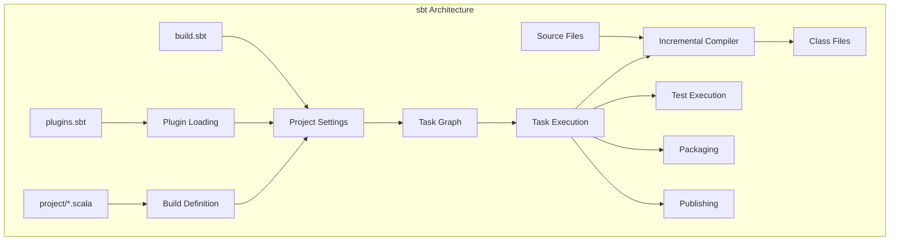
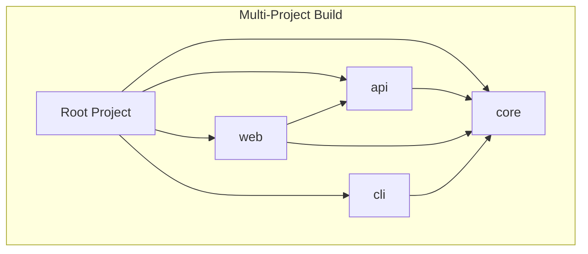
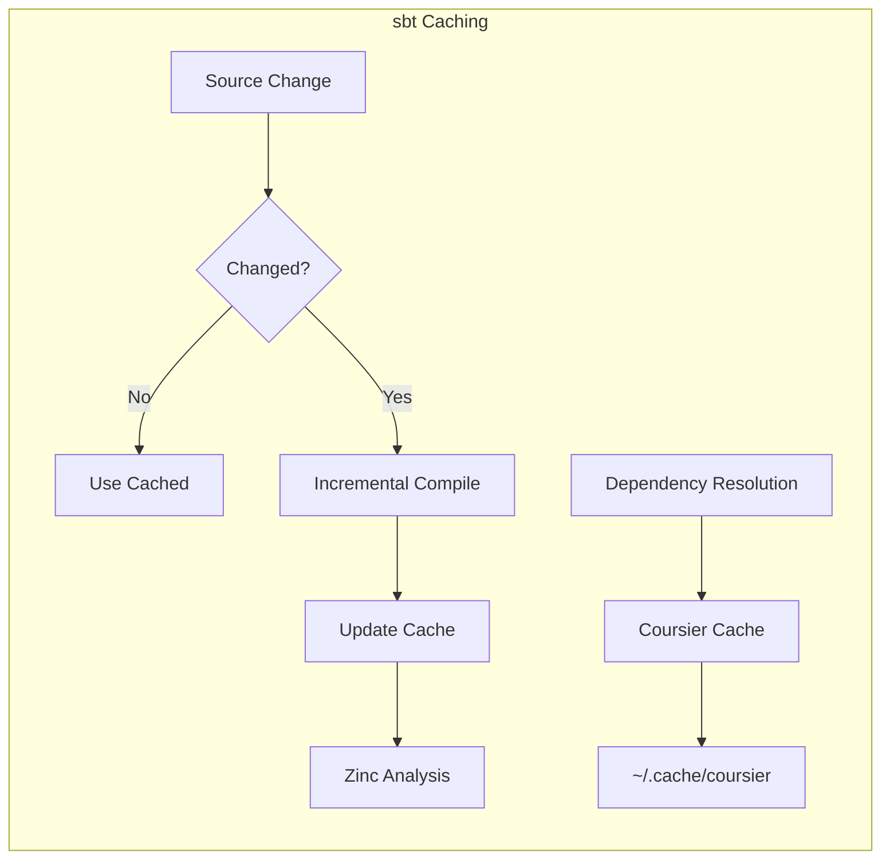

# How to Use sbt for Build Management

Author: [nawazdhandala](https://github.com/nawazdhandala)

Tags: Scala, sbt, Build, JVM

Description: A comprehensive guide to using sbt (Simple Build Tool) for Scala and Java project build management, covering project setup, dependency management, multi-project builds, custom tasks, plugins, and production best practices.

---

sbt is the de facto build tool for Scala projects and works equally well with Java. Unlike Maven or Gradle, sbt uses Scala itself for build definitions, providing a powerful and type-safe way to define builds. This guide covers everything from basic project setup to advanced multi-project configurations and custom task creation.

## Why Use sbt?

sbt offers several advantages over other JVM build tools:

- **Incremental compilation**: Only recompiles source files that have changed and their dependents
- **Interactive shell**: Run tasks repeatedly without JVM startup overhead
- **Parallel task execution**: Independent tasks run concurrently by default
- **Scala-based configuration**: Type-safe build definitions with full IDE support
- **Continuous execution**: Watch for file changes and automatically re-run tasks
- **Rich plugin ecosystem**: Extensive plugins for testing, packaging, deployment, and more

## How sbt Works

The following diagram shows the sbt build lifecycle and how different components interact.



## Getting Started with sbt

### Installation

You can install sbt using your operating system's package manager or download it directly.

On macOS using Homebrew:

```bash
# Install sbt using Homebrew package manager
brew install sbt
```

On Linux using SDKMAN:

```bash
# Install sbt using SDKMAN which manages JVM-related tools
sdk install sbt
```

On Windows using Chocolatey:

```powershell
# Install sbt using Chocolatey package manager
choco install sbt
```

Verify the installation by checking the version:

```bash
# Verify sbt is installed correctly and display version information
sbt --version
```

### Creating a New Project

sbt uses a simple directory structure. The minimum requirement is a build.sbt file in your project root.

```bash
# Create the project directory structure
mkdir my-project
cd my-project

# Create the source directories following Maven convention
mkdir -p src/main/scala
mkdir -p src/main/resources
mkdir -p src/test/scala
mkdir -p src/test/resources

# Create the project metadata directory for plugins and build settings
mkdir project
```

Create the main build definition file. This file defines project metadata, dependencies, and build settings using Scala syntax.

**build.sbt:**

```scala
// Define the Scala version for compilation
// This setting is required and determines which Scala compiler to use
scalaVersion := "3.3.1"

// Project metadata used for artifact publishing
// The organization typically follows reverse domain name convention
name := "my-project"
organization := "com.example"
version := "1.0.0"

// Library dependencies are declared using the libraryDependencies setting
// The += operator appends to the existing sequence of dependencies
// Format: "groupId" %% "artifactId" % "version"
// The %% operator automatically appends the Scala version to the artifact ID
libraryDependencies += "org.scalatest" %% "scalatest" % "3.2.17" % Test
```

Specify the sbt version for reproducible builds. This ensures all team members use the same sbt version.

**project/build.properties:**

```properties
# Lock the sbt version for reproducible builds across all environments
# This file should be committed to version control
sbt.version=1.9.7
```

### Basic sbt Commands

sbt provides an interactive shell for running commands. You can also run commands directly from the terminal.

```bash
# Start the interactive sbt shell
# This launches a REPL where you can run sbt commands
sbt

# Compile the main sources
# This command compiles src/main/scala and src/main/java
sbt compile

# Run all tests in src/test/scala
sbt test

# Start a Scala REPL with project classes on the classpath
# Useful for interactive exploration of your code
sbt console

# Create a JAR file containing compiled classes
sbt package

# Delete all generated files (target directory)
sbt clean

# Run the main class defined in the project
sbt run
```

Within the sbt shell, you can use continuous execution to watch for file changes:

```bash
# In sbt shell, prefix any command with ~ for continuous execution
# This watches for file changes and re-runs the command automatically
~ compile

# Continuously run tests when source files change
~ test

# Run a specific test class continuously
~ testOnly com.example.MySpec
```

## Understanding build.sbt Syntax

sbt uses a domain-specific language (DSL) built on Scala. Understanding this syntax is essential for effective build management.

### Settings and Tasks

sbt distinguishes between settings (evaluated once) and tasks (evaluated on each invocation). Settings define project configuration while tasks perform actions.

```scala
// Settings are evaluated once when the build is loaded
// They define static configuration values
name := "my-project"  // Setting: project name

// Tasks are evaluated each time they are invoked
// The compile task re-evaluates on every call
// Tasks can depend on settings and other tasks
val printInfo = taskKey[Unit]("Prints project information")

printInfo := {
  // Access setting values inside task definitions using .value
  val projectName = name.value
  val projectVersion = version.value
  println(s"Building $projectName version $projectVersion")
}
```

### Operators

sbt provides several operators for defining and modifying settings.

```scala
// := replaces the entire value of a setting
name := "my-project"

// += appends a single element to a sequence setting
libraryDependencies += "org.typelevel" %% "cats-core" % "2.10.0"

// ++= appends multiple elements to a sequence setting
libraryDependencies ++= Seq(
  "org.typelevel" %% "cats-core" % "2.10.0",
  "org.typelevel" %% "cats-effect" % "3.5.2"
)

// ~= transforms the existing value using a function
name ~= { currentName => currentName.toUpperCase }
```

### Scopes

Settings and tasks can be scoped to specific configurations, projects, or tasks. This allows different values in different contexts.

```scala
// Scope to the Test configuration
// This setting only applies when running tests
Test / fork := true

// Scope to the Compile configuration
// This adds a compiler option only for main source compilation
Compile / scalacOptions += "-deprecation"

// Scope to a specific task
// This sets the main class only for the run task
run / mainClass := Some("com.example.Main")

// Combine scopes for precise control
// This forks the JVM only when running tests
Test / run / fork := true
```

## Dependency Management

sbt provides flexible dependency management supporting Maven and Ivy repositories.

### Declaring Dependencies

Dependencies follow the format: groupID %% artifactID % version. The %% operator automatically appends the Scala version to the artifact ID.

```scala
libraryDependencies ++= Seq(
  // %% appends Scala version to artifact ID (e.g., cats-core_3)
  // Use for Scala libraries that are compiled for specific Scala versions
  "org.typelevel" %% "cats-core" % "2.10.0",

  // % does not append Scala version
  // Use for Java libraries that work with any Scala version
  "com.google.guava" % "guava" % "32.1.3-jre",

  // % Test scopes the dependency to test configuration only
  // These dependencies are not included in the production JAR
  "org.scalatest" %% "scalatest" % "3.2.17" % Test,

  // % Provided marks dependencies provided by the runtime environment
  // Useful for servlet containers, Spark, or other frameworks
  "javax.servlet" % "javax.servlet-api" % "4.0.1" % Provided,

  // classifier adds additional artifact classifiers
  // Common classifiers: sources, javadoc, tests
  "org.apache.spark" %% "spark-core" % "3.5.0" % Provided classifier "sources"
)
```

### Excluding Transitive Dependencies

Sometimes you need to exclude transitive dependencies to resolve conflicts or reduce JAR size.

```scala
libraryDependencies ++= Seq(
  // exclude() removes a specific transitive dependency
  // Useful when a library pulls in an unwanted or conflicting dependency
  "org.apache.spark" %% "spark-core" % "3.5.0" exclude("org.slf4j", "slf4j-log4j12"),

  // excludeAll() removes multiple dependencies matching criteria
  // ExclusionRule supports wildcards and multiple attributes
  ("com.example" %% "library" % "1.0.0")
    .excludeAll(
      ExclusionRule(organization = "commons-logging"),
      ExclusionRule(organization = "log4j")
    ),

  // intransitive() excludes all transitive dependencies
  // Only the direct dependency itself is included
  "com.example" %% "standalone-lib" % "1.0.0" intransitive()
)
```

### Custom Repositories

Add custom Maven or Ivy repositories for dependencies not in Maven Central.

```scala
// Add custom resolvers for dependencies not in default repositories
resolvers ++= Seq(
  // Maven repository with standard layout
  "Sonatype Releases" at "https://oss.sonatype.org/content/repositories/releases/",

  // Snapshots repository for development versions
  "Sonatype Snapshots" at "https://oss.sonatype.org/content/repositories/snapshots/",

  // Private company repository with authentication
  "Company Artifactory" at "https://artifactory.company.com/libs-release/",

  // Ivy-style repository with custom pattern
  Resolver.url("Custom Ivy Repo", url("https://ivy.company.com/"))(Resolver.ivyStylePatterns)
)

// Add credentials for authenticated repositories
// Store actual credentials in ~/.sbt/1.0/credentials or environment variables
credentials += Credentials(
  "Artifactory Realm",
  "artifactory.company.com",
  sys.env.getOrElse("ARTIFACTORY_USER", ""),
  sys.env.getOrElse("ARTIFACTORY_PASSWORD", "")
)
```

### Dependency Graph Visualization

Understanding your dependency tree helps identify conflicts and unnecessary dependencies.

```bash
# Show the dependency tree for compile configuration
# This displays all direct and transitive dependencies
sbt "dependencyTree"

# Show dependencies in a flat list format
sbt "dependencyList"

# Find which dependency brings in a specific library
# Useful for tracking down transitive dependency sources
sbt "whatDependsOn org.slf4j slf4j-api 2.0.9"
```

## Multi-Project Builds

Large applications often consist of multiple subprojects. sbt provides excellent support for multi-project builds with shared settings and inter-project dependencies.

The following diagram illustrates a typical multi-project structure.



### Project Structure

Create a multi-project build by defining multiple projects in build.sbt.

**build.sbt:**

```scala
// Define common settings shared across all projects
// ThisBuild scope applies settings to all subprojects
ThisBuild / scalaVersion := "3.3.1"
ThisBuild / organization := "com.example"
ThisBuild / version := "1.0.0"

// Common dependencies and settings extracted to avoid duplication
// These can be added to any project using .settings()
lazy val commonSettings = Seq(
  // Enable all warnings as errors for strict compilation
  scalacOptions ++= Seq(
    "-deprecation",
    "-feature",
    "-unchecked",
    "-Xfatal-warnings"
  ),

  // Common test dependencies for all projects
  libraryDependencies ++= Seq(
    "org.scalatest" %% "scalatest" % "3.2.17" % Test,
    "org.scalatestplus" %% "mockito-4-11" % "3.2.17.0" % Test
  )
)

// Root project aggregates all subprojects
// Commands run on root are forwarded to all aggregated projects
lazy val root = (project in file("."))
  .aggregate(core, api, web, cli)
  .settings(
    name := "my-application",
    // Root project should not publish artifacts
    publish / skip := true
  )

// Core project contains shared domain models and utilities
// Other projects depend on this but it has no dependencies
lazy val core = (project in file("core"))
  .settings(
    name := "my-application-core",
    commonSettings,
    libraryDependencies ++= Seq(
      "org.typelevel" %% "cats-core" % "2.10.0",
      "io.circe" %% "circe-core" % "0.14.6",
      "io.circe" %% "circe-generic" % "0.14.6"
    )
  )

// API project depends on core and adds HTTP capabilities
// dependsOn creates a project dependency for compilation and runtime
lazy val api = (project in file("api"))
  .dependsOn(core)
  .settings(
    name := "my-application-api",
    commonSettings,
    libraryDependencies ++= Seq(
      "org.http4s" %% "http4s-dsl" % "0.23.24",
      "org.http4s" %% "http4s-ember-server" % "0.23.24",
      "org.http4s" %% "http4s-circe" % "0.23.24"
    )
  )

// Web project depends on both api and core
// Multiple dependencies are specified as separate dependsOn calls or comma-separated
lazy val web = (project in file("web"))
  .dependsOn(api, core)
  .settings(
    name := "my-application-web",
    commonSettings,
    libraryDependencies ++= Seq(
      "org.http4s" %% "http4s-ember-client" % "0.23.24"
    )
  )

// CLI project only depends on core
// enablePlugins adds sbt plugins to this project
lazy val cli = (project in file("cli"))
  .dependsOn(core)
  .enablePlugins(JavaAppPackaging)
  .settings(
    name := "my-application-cli",
    commonSettings,
    // Specify the main class for running and packaging
    Compile / mainClass := Some("com.example.cli.Main")
  )
```

### Working with Subprojects

Run commands on specific subprojects or the entire build.

```bash
# Run a command on a specific subproject
# Format: sbt "project/command"
sbt "core/compile"
sbt "api/test"

# Switch to a specific project in sbt shell
# All subsequent commands run in that project context
sbt
> project core
> compile
> test

# Run command on all projects via root aggregation
# This compiles all subprojects in parallel
sbt compile

# List all projects in the build
sbt projects
```

### Cross-Project Dependencies

Configure how projects depend on each other with various dependency types.

```scala
// Standard dependency: compile and runtime classpaths
lazy val api = (project in file("api"))
  .dependsOn(core)

// Test dependency: include test classes from another project
// Useful when tests need shared test utilities
lazy val integration = (project in file("integration"))
  .dependsOn(
    core,
    api,
    // Include test sources from core in this project's test classpath
    core % "test->test"
  )

// Compile dependency only: runtime classpath is separate
// Useful for compile-time code generation or annotation processing
lazy val macros = (project in file("macros"))
  .settings(
    // Macro projects often need the reflect library
    libraryDependencies += "org.scala-lang" % "scala-reflect" % scalaVersion.value
  )

lazy val app = (project in file("app"))
  .dependsOn(macros % "compile-internal")
```

## Custom Tasks and Commands

sbt allows defining custom tasks and commands for project-specific build automation.

### Defining Custom Tasks

Tasks are operations that can depend on settings and other tasks.

```scala
// Define task keys with descriptions
// taskKey creates a new task that can be invoked from sbt shell
val generateVersion = taskKey[File]("Generates version information file")
val deployApp = taskKey[Unit]("Deploys the application to servers")
val checkStyle = taskKey[Unit]("Runs code style checks")

// Implement the generateVersion task
// Tasks return values that other tasks can depend on
generateVersion := {
  // Access other settings and tasks using .value
  val projectVersion = version.value
  val targetDir = (Compile / resourceManaged).value
  val gitHash = Process("git rev-parse --short HEAD").!!.trim

  // Create the output file
  val versionFile = targetDir / "version.properties"

  // Write version information
  val content = s"""
    |version=$projectVersion
    |git.hash=$gitHash
    |build.time=${java.time.Instant.now}
    """.stripMargin.trim

  IO.write(versionFile, content)

  // Logging is available via streams
  streams.value.log.info(s"Generated version file: $versionFile")

  // Return the generated file
  versionFile
}

// Make the version file part of the resources
// This ensures it's included in the packaged JAR
Compile / resourceGenerators += generateVersion.taskValue

// Implement a deployment task with multiple steps
deployApp := {
  // Depend on package task completing first
  val jarFile = (Compile / packageBin).value
  val log = streams.value.log

  // Deployment logic
  log.info(s"Deploying ${jarFile.getName}...")

  val deployTarget = sys.env.getOrElse("DEPLOY_HOST", "localhost")

  // Execute deployment command
  val exitCode = Process(Seq("scp", jarFile.getAbsolutePath, s"$deployTarget:/opt/app/")).!

  if (exitCode != 0) {
    sys.error("Deployment failed!")
  }

  log.success("Deployment completed successfully")
}

// Task with dependencies on other tasks
checkStyle := {
  // Run compile first to ensure valid syntax
  val _ = (Compile / compile).value
  val log = streams.value.log

  log.info("Running style checks...")

  // Style check implementation
  val sourceFiles = (Compile / sources).value
  var violations = 0

  sourceFiles.foreach { file =>
    val lines = IO.readLines(file)
    lines.zipWithIndex.foreach { case (line, idx) =>
      if (line.length > 120) {
        log.warn(s"${file.getName}:${idx + 1}: Line exceeds 120 characters")
        violations += 1
      }
    }
  }

  if (violations > 0) {
    sys.error(s"Found $violations style violations")
  }

  log.success("No style violations found")
}
```

### Input Tasks

Input tasks accept command-line arguments for flexible operations.

```scala
import complete.DefaultParsers._

// Define an input task that accepts arguments
val runWithEnv = inputKey[Unit]("Runs the application with specified environment")

runWithEnv := {
  // Parse command-line arguments
  // Space-separated token parser
  val args: Seq[String] = spaceDelimited("<env>").parsed
  val log = streams.value.log

  val environment = args.headOption.getOrElse("development")

  log.info(s"Running with environment: $environment")

  // Set environment variable and run
  val forkOptions = ForkOptions()
    .withEnvVars(Map("APP_ENV" -> environment))
    .withRunJVMOptions(Seq("-Xmx2g"))

  val mainClass = (Compile / run / mainClass).value.getOrElse(
    sys.error("No main class defined")
  )
  val classpath = (Compile / fullClasspath).value.files

  Fork.java(forkOptions, Seq("-cp", classpath.mkString(":"), mainClass))
}
```

### Command Aliases

Create shortcuts for commonly used command sequences.

```scala
// Define command aliases for common workflows
// These are available in the sbt shell
addCommandAlias("build", "; clean; compile; test")
addCommandAlias("ci", "; clean; scalafmtCheckAll; compile; test; IntegrationTest/test")
addCommandAlias("fmt", "; scalafmtAll; scalafmtSbt")
addCommandAlias("release", "; clean; test; publishSigned")

// Alias with multiple projects
addCommandAlias("publishAll", "; core/publish; api/publish; cli/publish")
```

## Plugins

sbt plugins extend build functionality. They are declared in project/plugins.sbt.

### Adding Plugins

**project/plugins.sbt:**

```scala
// Code formatting with scalafmt
// This plugin adds scalafmt and scalafmtCheck tasks
addSbtPlugin("org.scalameta" % "sbt-scalafmt" % "2.5.2")

// Native packager for creating distributions
// Supports Docker, Debian packages, RPM, and universal archives
addSbtPlugin("com.github.sbt" % "sbt-native-packager" % "1.9.16")

// Assembly plugin for creating fat JARs
// Merges all dependencies into a single JAR file
addSbtPlugin("com.eed3si9n" % "sbt-assembly" % "2.1.5")

// Release management and versioning
// Automates version bumping, tagging, and publishing
addSbtPlugin("com.github.sbt" % "sbt-release" % "1.1.0")

// Dependency updates checker
// Shows which dependencies have newer versions available
addSbtPlugin("com.timushev.sbt" % "sbt-updates" % "0.6.4")

// Code coverage with scoverage
// Generates coverage reports for tests
addSbtPlugin("org.scoverage" % "sbt-scoverage" % "2.0.9")

// Generate project website with documentation
addSbtPlugin("com.github.sbt" % "sbt-site" % "1.5.0")
```

### Configuring Native Packager

The native packager plugin creates distributable packages for your application.

**build.sbt:**

```scala
// Enable native packager plugins for the project
lazy val app = (project in file("app"))
  .enablePlugins(JavaAppPackaging, DockerPlugin)
  .settings(
    name := "my-application",

    // Universal package settings
    // These apply to all package formats
    Universal / packageName := "my-app",
    Universal / mappings ++= Seq(
      file("README.md") -> "README.md",
      file("LICENSE") -> "LICENSE"
    ),

    // Bash script settings
    bashScriptExtraDefines ++= Seq(
      """addJava "-Xms512m"""",
      """addJava "-Xmx2g""""
    ),

    // Docker settings for containerized deployment
    Docker / packageName := "my-organization/my-app",
    Docker / version := version.value,
    dockerBaseImage := "eclipse-temurin:17-jre-alpine",
    dockerExposedPorts := Seq(8080),
    dockerLabels := Map(
      "maintainer" -> "team@example.com",
      "version" -> version.value
    ),

    // JVM options for Docker containers
    dockerEnvVars := Map(
      "JAVA_OPTS" -> "-Xms512m -Xmx2g"
    )
  )
```

Package commands:

```bash
# Create a universal zip distribution
sbt universal:packageBin

# Create a tarball distribution
sbt universal:packageZipTarball

# Build a Docker image
sbt docker:publishLocal

# Push Docker image to registry
sbt docker:publish
```

### Assembly Plugin Configuration

Create fat JARs that include all dependencies.

**build.sbt:**

```scala
// Assembly plugin settings
lazy val app = (project in file("app"))
  .settings(
    // Name of the assembled JAR file
    assembly / assemblyJarName := s"${name.value}-${version.value}.jar",

    // Merge strategy for handling duplicate files
    // This is crucial for resolving conflicts in transitive dependencies
    assembly / assemblyMergeStrategy := {
      case PathList("META-INF", "MANIFEST.MF") => MergeStrategy.discard
      case PathList("META-INF", "services", _*) => MergeStrategy.concat
      case PathList("META-INF", _*) => MergeStrategy.discard
      case PathList("reference.conf") => MergeStrategy.concat
      case PathList("application.conf") => MergeStrategy.concat
      case _ => MergeStrategy.first
    },

    // Exclude certain dependencies from the assembly
    assembly / assemblyExcludedJars := {
      val cp = (assembly / fullClasspath).value
      cp.filter { jar =>
        jar.data.getName.startsWith("spark-")
      }
    },

    // Main class for the executable JAR
    assembly / mainClass := Some("com.example.Main")
  )
```

## Testing Configuration

sbt provides extensive testing support with ScalaTest, specs2, and other frameworks.

```scala
// Testing configuration
lazy val app = (project in file("app"))
  .settings(
    // Test dependencies
    libraryDependencies ++= Seq(
      "org.scalatest" %% "scalatest" % "3.2.17" % Test,
      "org.scalatestplus" %% "mockito-4-11" % "3.2.17.0" % Test,
      "com.dimafeng" %% "testcontainers-scala-scalatest" % "0.41.0" % Test
    ),

    // Fork tests to isolate JVM state
    // Recommended for tests that modify global state
    Test / fork := true,

    // JVM options for forked test JVM
    Test / javaOptions ++= Seq(
      "-Xms512m",
      "-Xmx2g",
      "-Dconfig.file=src/test/resources/application-test.conf"
    ),

    // Run tests in parallel by default
    // Set to false for tests with shared state
    Test / parallelExecution := true,

    // Test output options
    Test / testOptions ++= Seq(
      Tests.Argument(TestFrameworks.ScalaTest, "-oDF"),  // Full stack traces, durations
      Tests.Argument(TestFrameworks.ScalaTest, "-u", "target/test-reports")  // JUnit XML
    )
  )
```

### Integration Tests

Configure a separate integration test configuration.

```scala
// Add integration test configuration
lazy val app = (project in file("app"))
  .configs(IntegrationTest)
  .settings(
    Defaults.itSettings,

    // Integration test source directory
    IntegrationTest / scalaSource := baseDirectory.value / "src" / "it" / "scala",

    // Integration test dependencies
    // Extend the Test configuration to inherit test libraries
    libraryDependencies ++= Seq(
      "org.scalatest" %% "scalatest" % "3.2.17" % IntegrationTest
    ),

    // Integration tests should not run in parallel
    // They often use shared external resources
    IntegrationTest / parallelExecution := false,

    // Always fork integration tests
    IntegrationTest / fork := true
  )
```

Run integration tests:

```bash
# Run integration tests
sbt IntegrationTest/test

# Run specific integration test
sbt "IntegrationTest/testOnly *DatabaseIntegrationSpec"
```

## Production Best Practices

### Build Performance Optimization

The following diagram shows the sbt caching architecture.



Optimize build performance with these settings.

**build.sbt:**

```scala
// Enable incremental compilation analysis
ThisBuild / incOptions := (ThisBuild / incOptions).value.withApiDebug(false)

// Parallel compilation across projects
ThisBuild / Global / concurrentRestrictions := Seq(
  Tags.limit(Tags.CPU, Runtime.getRuntime.availableProcessors),
  Tags.limit(Tags.Test, 1),
  Tags.limitAll(15)
)

// Use Coursier for faster dependency resolution
// Coursier is the default in recent sbt versions
ThisBuild / useCoursier := true

// Cache dependency resolution
ThisBuild / updateOptions := updateOptions.value
  .withCachedResolution(true)
  .withLatestSnapshots(false)

// Turbo mode for faster incremental compilation
ThisBuild / turbo := true
```

### CI/CD Integration

Configure sbt for continuous integration environments.

```scala
// CI-specific settings
val ciSettings = Seq(
  // Disable ANSI colors in CI
  ThisBuild / useSuperShell := false,

  // Batch mode prevents interactive prompts
  ThisBuild / autoStartServer := false,

  // Reduce verbosity
  ThisBuild / logLevel := Level.Info
)

// Apply CI settings when running in CI environment
inThisBuild(
  if (sys.env.contains("CI")) ciSettings else Seq.empty
)
```

GitHub Actions workflow example:

```yaml
name: CI

on: [push, pull_request]

jobs:
  build:
    runs-on: ubuntu-latest

    steps:
      - uses: actions/checkout@v4

      - name: Set up JDK 17
        uses: actions/setup-java@v4
        with:
          java-version: '17'
          distribution: 'temurin'
          cache: 'sbt'

      - name: Run tests
        run: sbt -v clean test

      - name: Package application
        run: sbt universal:packageBin
```

### Reproducible Builds

Ensure builds are reproducible across environments.

**build.sbt:**

```scala
// Lock dependency versions for reproducibility
ThisBuild / dependencyLockFile := Some(baseDirectory.value / "project" / "dependencies.lock")

// Disable snapshot dependencies in release builds
ThisBuild / updateOptions := updateOptions.value.withLatestSnapshots(false)

// Pin compiler plugin versions
autoCompilerPlugins := true
addCompilerPlugin("org.typelevel" % "kind-projector" % "0.13.2" cross CrossVersion.full)

// Reproducible JAR creation (no timestamps)
Compile / packageBin / packageOptions += Package.ManifestAttributes(
  "Built-By" -> "CI",
  "Implementation-Version" -> version.value
)
```

### Memory Configuration

Configure JVM memory for large builds.

**project/plugins.sbt or .sbtopts:**

```bash
# .sbtopts file in project root
# These options apply to the sbt launcher JVM

# Set initial and maximum heap size
-J-Xms1g
-J-Xmx4g

# Enable string deduplication to reduce memory
-J-XX:+UseStringDeduplication

# Use G1 garbage collector for better pause times
-J-XX:+UseG1GC

# Metaspace settings for large projects with many classes
-J-XX:MaxMetaspaceSize=512m
```

## Common Issues and Solutions

### Dependency Conflicts

When multiple libraries require different versions of the same dependency:

```scala
// Force a specific version globally
ThisBuild / dependencyOverrides += "org.slf4j" % "slf4j-api" % "2.0.9"

// Exclude conflicting transitive dependencies
libraryDependencies += "some.library" %% "name" % "1.0" excludeAll(
  ExclusionRule(organization = "org.slf4j")
)

// Check for evictions (replaced versions)
ThisBuild / evictionErrorLevel := Level.Warn
```

### Slow Compilation

If compilation is slow:

```scala
// Enable incremental compilation (default in sbt 1.x)
Compile / incOptions := (Compile / incOptions).value.withRecompileOnMacroDef(false)

// Use zinc compiler server
ThisBuild / usePipelining := true

// Profile compilation time
addCompilerPlugin("ch.epfl.scala" %% "scalac-profiling" % "1.0.0")
```

### OutOfMemory Errors

Increase memory allocation:

```scala
// Fork compilation in a separate JVM with more memory
Compile / fork := true
Compile / javaOptions += "-Xmx4g"

// For tests
Test / fork := true
Test / javaOptions += "-Xmx2g"
```

## Summary

| Feature | Configuration Location | Purpose |
|---------|----------------------|---------|
| **Project settings** | build.sbt | Core project configuration |
| **sbt version** | project/build.properties | Lock sbt version |
| **Plugins** | project/plugins.sbt | Extend sbt functionality |
| **Custom definitions** | project/*.scala | Complex build logic |
| **JVM options** | .sbtopts | sbt launcher memory |
| **Credentials** | ~/.sbt/1.0/credentials | Repository authentication |

sbt provides a powerful and flexible build system for Scala projects. Its incremental compilation, interactive shell, and rich plugin ecosystem make it well-suited for both small libraries and large multi-project builds. By understanding settings, scopes, and task dependencies, you can create efficient and maintainable build configurations that scale with your project's complexity.

The key to mastering sbt is understanding that everything is either a setting (evaluated once) or a task (evaluated on demand), and both can be scoped to specific configurations, projects, or other tasks. This model provides the flexibility needed for complex build requirements while maintaining a clear and predictable execution model.
