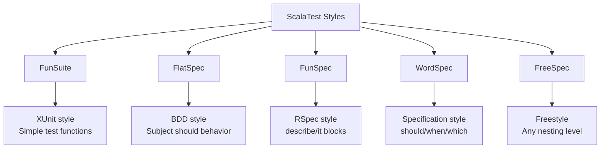
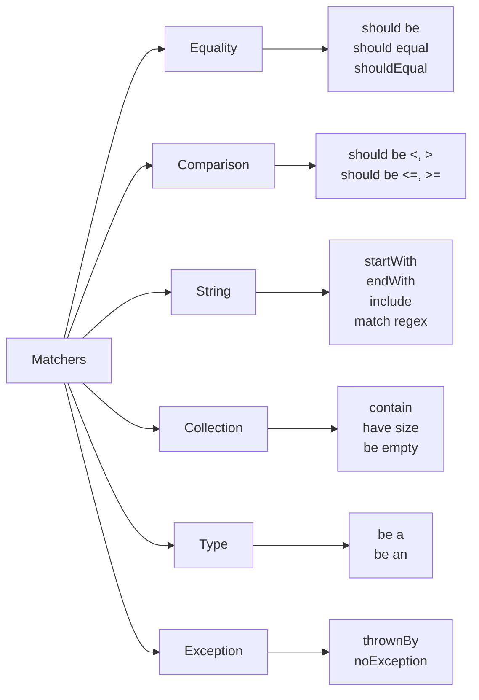
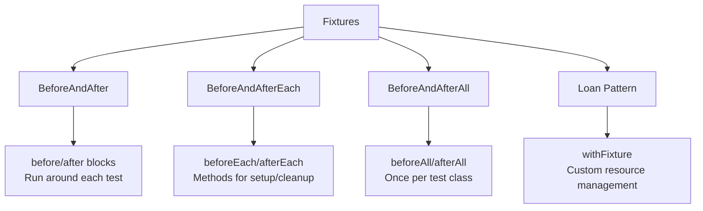
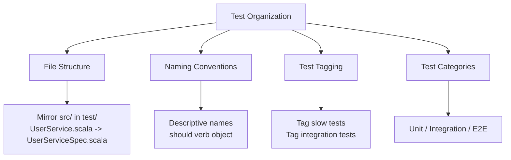

# How to Write Tests with ScalaTest

Author: [nawazdhandala](https://github.com/nawazdhandala)

Tags: Scala, ScalaTest, Testing, Unit Tests

Description: A comprehensive guide to writing tests with ScalaTest, covering test styles, matchers, mocking, async testing, and best practices for building reliable Scala applications.

---

Testing is essential for building reliable software. ScalaTest is the most popular testing framework in the Scala ecosystem, offering flexibility, powerful matchers, and support for multiple testing styles. This guide covers everything you need to know to write effective tests with ScalaTest.

## Why ScalaTest?

ScalaTest stands out among testing frameworks for several reasons:

| Feature | Benefit |
|---------|---------|
| **Multiple testing styles** | Write tests in BDD, TDD, or spec style |
| **Rich matchers** | Expressive assertions with clear error messages |
| **Excellent IDE support** | IntelliJ and VS Code integration |
| **Async testing** | First-class support for Futures and async code |
| **Extensible** | Custom matchers and fixtures |
| **Integration** | Works with ScalaMock, Mockito, and property testing |

## Getting Started

Add ScalaTest to your build.sbt file to get started. The configuration below includes the core library and the ScalaMock integration for mocking.

```scala
// build.sbt
// ScalaTest core library with AnyFunSuite and other testing styles
libraryDependencies += "org.scalatest" %% "scalatest" % "3.2.18" % Test

// Optional: ScalaMock for mocking dependencies
libraryDependencies += "org.scalamock" %% "scalamock" % "5.2.0" % Test

// Optional: ScalaCheck integration for property-based testing
libraryDependencies += "org.scalatestplus" %% "scalacheck-1-17" % "3.2.18.0" % Test
```

## Understanding Test Styles

ScalaTest offers multiple testing styles to match your preferences. The following diagram shows the main options available.



### FunSuite Style

FunSuite is the simplest style, similar to JUnit or pytest. Each test is a standalone function with a descriptive name. Use this style when you want straightforward tests without much ceremony.

```scala
import org.scalatest.funsuite.AnyFunSuite

// FunSuite provides a simple, xUnit-style testing approach
// Each test is defined with the test() method and a descriptive string
class CalculatorFunSuite extends AnyFunSuite {

  // Test names should describe the expected behavior
  test("addition returns correct sum") {
    val calculator = new Calculator()

    // Simple assertion using assert()
    assert(calculator.add(2, 3) == 5)
  }

  test("division by zero throws ArithmeticException") {
    val calculator = new Calculator()

    // assertThrows verifies that an exception is thrown
    assertThrows[ArithmeticException] {
      calculator.divide(10, 0)
    }
  }

  test("multiplication handles negative numbers") {
    val calculator = new Calculator()

    // assertResult compares expected vs actual with clear error messages
    assertResult(-6) {
      calculator.multiply(-2, 3)
    }
  }
}
```

### FlatSpec Style

FlatSpec uses a behavior-driven development (BDD) approach with "should" or "must" clauses. This style produces test names that read like specifications, making test output more descriptive.

```scala
import org.scalatest.flatspec.AnyFlatSpec
import org.scalatest.matchers.should.Matchers

// FlatSpec combines a subject with should/must behavior descriptions
// Mix in Matchers for expressive assertions
class CalculatorFlatSpec extends AnyFlatSpec with Matchers {

  // "Subject" should "behavior" in { test body }
  // Creates test name: "Calculator should return correct sum for addition"
  "Calculator" should "return correct sum for addition" in {
    val calculator = new Calculator()

    // Matchers provide readable assertions
    calculator.add(2, 3) should be(5)
  }

  // Multiple behaviors for the same subject use "it"
  it should "handle negative numbers in subtraction" in {
    val calculator = new Calculator()

    // shouldEqual is an alias for should equal
    calculator.subtract(5, -3) shouldEqual 8
  }

  // "must" is an alternative to "should" for stronger assertions
  it must "throw exception when dividing by zero" in {
    val calculator = new Calculator()

    // an [ExceptionType] should be thrownBy { code }
    an [ArithmeticException] should be thrownBy {
      calculator.divide(10, 0)
    }
  }

  // Use "can" for capability descriptions
  it can "multiply decimal numbers" in {
    val calculator = new Calculator()

    calculator.multiply(2.5, 4.0) should be(10.0 +- 0.001)
  }
}
```

### FunSpec Style

FunSpec is inspired by Ruby's RSpec. It uses describe blocks to group related tests and it blocks for individual test cases. This style is excellent for organizing tests hierarchically.

```scala
import org.scalatest.funspec.AnyFunSpec
import org.scalatest.matchers.should.Matchers

// FunSpec uses describe/it blocks similar to RSpec
// Great for organizing tests by functionality
class CalculatorFunSpec extends AnyFunSpec with Matchers {

  // describe() groups related tests together
  describe("Calculator") {

    // Nested describe for sub-categories
    describe("basic arithmetic") {

      // it() defines individual test cases
      it("should add two positive numbers") {
        val calc = new Calculator()
        calc.add(2, 3) should be(5)
      }

      it("should subtract correctly") {
        val calc = new Calculator()
        calc.subtract(10, 4) should be(6)
      }
    }

    describe("division") {
      it("should divide evenly") {
        val calc = new Calculator()
        calc.divide(10, 2) should be(5)
      }

      it("should handle decimal results") {
        val calc = new Calculator()
        calc.divide(7, 2) should be(3.5)
      }

      // Use ignore() to skip tests temporarily
      ignore("should handle very large numbers") {
        pending // Mark as not yet implemented
      }
    }

    describe("edge cases") {
      it("should handle zero") {
        val calc = new Calculator()
        calc.add(0, 5) should be(5)
        calc.multiply(0, 100) should be(0)
      }
    }
  }
}
```

### WordSpec Style

WordSpec provides the most descriptive test organization, using "when", "should", and "which" to create readable specifications. This style is ideal when you want your tests to serve as documentation.

```scala
import org.scalatest.wordspec.AnyWordSpec
import org.scalatest.matchers.should.Matchers

// WordSpec creates highly readable specifications
// Tests read like natural language sentences
class UserServiceWordSpec extends AnyWordSpec with Matchers {

  "UserService" when {

    "creating a new user" should {

      "return the created user with an ID" in {
        val service = new UserService()
        val user = service.createUser("john@example.com", "John")

        user.id should not be empty
        user.email should be("john@example.com")
      }

      "validate email format" in {
        val service = new UserService()

        a [ValidationException] should be thrownBy {
          service.createUser("invalid-email", "John")
        }
      }

      "hash the password before storing" which {
        "uses bcrypt algorithm" in {
          val service = new UserService()
          val user = service.createUser("john@example.com", "John", "password123")

          user.passwordHash should startWith("$2a$")
        }
      }
    }

    "finding a user by ID" should {

      "return Some(user) when found" in {
        val service = new UserService()
        val created = service.createUser("jane@example.com", "Jane")

        service.findById(created.id) should be(Some(created))
      }

      "return None when not found" in {
        val service = new UserService()

        service.findById("nonexistent-id") should be(None)
      }
    }
  }
}
```

## Matchers Deep Dive

ScalaTest matchers provide expressive ways to make assertions. They produce clear error messages when tests fail, making debugging easier.



### Equality Matchers

Equality matchers compare values for equality. ScalaTest provides multiple ways to express equality checks, each with slightly different semantics.

```scala
import org.scalatest.flatspec.AnyFlatSpec
import org.scalatest.matchers.should.Matchers

class EqualityMatchersSpec extends AnyFlatSpec with Matchers {

  "Equality matchers" should "compare values correctly" in {
    val result = 42

    // These are all equivalent for simple equality
    result should be(42)        // Identity comparison
    result should equal(42)     // Equality comparison using ==
    result shouldEqual 42       // Shorthand syntax
    result shouldBe 42          // Another shorthand

    // For floating-point comparisons, use tolerance
    val pi = 3.14159
    pi should be(3.14 +- 0.01)  // Within 0.01 tolerance
    pi should equal(3.14 +- 0.01)

    // Explicitly check for null (rare in Scala but useful for Java interop)
    val maybeNull: String = null
    maybeNull should be(null)

    // Check for reference equality (same object in memory)
    val list1 = List(1, 2, 3)
    val list2 = list1
    list1 should be theSameInstanceAs list2
  }

  it should "handle Option types naturally" in {
    val some: Option[Int] = Some(42)
    val none: Option[Int] = None

    some should be(Some(42))
    some shouldBe defined       // Some is defined
    none shouldBe empty         // None is empty
    none should be(None)

    // Extract and check the value
    some.value should be(42)
  }

  it should "handle Either types" in {
    val right: Either[String, Int] = Right(42)
    val left: Either[String, Int] = Left("error")

    right shouldBe Right(42)
    right shouldBe Symbol("right")  // Check which side

    left shouldBe Left("error")
    left shouldBe Symbol("left")
  }
}
```

### String Matchers

String matchers provide powerful ways to verify string content, including prefix/suffix checking, substring matching, and regular expression support.

```scala
class StringMatchersSpec extends AnyFlatSpec with Matchers {

  "String matchers" should "check string content" in {
    val greeting = "Hello, World!"

    // Prefix and suffix
    greeting should startWith("Hello")
    greeting should endWith("!")
    greeting should not startWith "Goodbye"

    // Substring containment
    greeting should include("World")
    greeting should include(",")

    // Regular expressions
    greeting should fullyMatch regex """Hello, \w+!"""
    greeting should include regex """\w+"""
    greeting should startWith regex """[A-Z][a-z]+"""

    // Length checking
    greeting should have length 13
    greeting should not be empty
  }

  it should "support case-insensitive matching" in {
    val text = "ScalaTest is AWESOME"

    // Case-insensitive comparisons
    text.toLowerCase should include("scalatest")
    text.toUpperCase should include("AWESOME")
  }

  it should "work with multiline strings" in {
    val poem =
      """Roses are red,
        |Violets are blue,
        |ScalaTest is great,
        |And so are you!""".stripMargin

    poem should include("ScalaTest")
    poem.split("\n") should have length 4
  }
}
```

### Collection Matchers

Collection matchers work with Scala's collections (List, Set, Map, etc.) and provide ways to check contents, size, ordering, and more.

```scala
class CollectionMatchersSpec extends AnyFlatSpec with Matchers {

  "Collection matchers" should "verify list contents" in {
    val numbers = List(1, 2, 3, 4, 5)

    // Size and emptiness
    numbers should have size 5
    numbers should have length 5  // Same as size for Seq
    numbers should not be empty

    // Element containment
    numbers should contain(3)
    numbers should contain allOf(1, 3, 5)      // All must be present
    numbers should contain atLeastOneOf(3, 7)  // At least one present
    numbers should contain noneOf(6, 7, 8)     // None should be present

    // Ordering
    numbers shouldBe sorted
    numbers should contain inOrder(1, 2, 3)    // In this relative order
    numbers should contain theSameElementsInOrderAs List(1, 2, 3, 4, 5)
  }

  it should "verify set contents" in {
    val fruits = Set("apple", "banana", "cherry")

    fruits should have size 3
    fruits should contain("apple")
    fruits should contain allOf("apple", "banana")

    // Sets ignore duplicates
    val withDuplicates = Set("a", "a", "b")
    withDuplicates should have size 2
  }

  it should "verify map contents" in {
    val scores = Map("Alice" -> 95, "Bob" -> 87, "Charlie" -> 92)

    // Check for keys
    scores should contain key "Alice"
    scores should not contain key("David")

    // Check for values
    scores should contain value 95

    // Check for key-value pairs
    scores should contain("Alice" -> 95)
    scores should contain allOf("Alice" -> 95, "Bob" -> 87)
  }

  it should "work with custom matchers for elements" in {
    val words = List("hello", "world", "scala")

    // All elements match condition
    all(words) should have length greaterThan(3)
    all(words) should be(Symbol("toLowerCase"))

    // At least one matches
    atLeast(1, words) should startWith("s")

    // Exactly N match
    exactly(2, words) should have length 5

    // Every element check
    every(words) should not be empty
  }
}
```

### Exception Matchers

Exception matchers verify that code throws expected exceptions. This is essential for testing error handling and validation logic.

```scala
class ExceptionMatchersSpec extends AnyFlatSpec with Matchers {

  "Exception matchers" should "catch expected exceptions" in {
    // Basic exception checking
    an [ArithmeticException] should be thrownBy {
      1 / 0
    }

    // Alternative syntax
    a [NullPointerException] should be thrownBy {
      val s: String = null
      s.length
    }
  }

  it should "verify exception messages" in {
    // Capture the exception for further inspection
    val exception = the [IllegalArgumentException] thrownBy {
      require(false, "Value must be positive")
    }

    // Check the exception message
    exception.getMessage should include("positive")
    exception.getMessage should startWith("requirement failed")
  }

  it should "verify no exception is thrown" in {
    // Verify safe code does not throw
    noException should be thrownBy {
      val result = 2 + 2
      result * 3
    }
  }

  it should "work with custom exception types" in {
    case class ValidationError(field: String, message: String)
        extends Exception(s"$field: $message")

    val error = the [ValidationError] thrownBy {
      throw ValidationError("email", "Invalid format")
    }

    error.field should be("email")
    error.message should be("Invalid format")
  }
}
```

## Test Fixtures

Fixtures provide setup and teardown logic for tests. ScalaTest offers several approaches depending on your needs.



### BeforeAndAfter Trait

BeforeAndAfter provides simple setup and teardown blocks. Use this for straightforward scenarios where you need to prepare state before each test.

```scala
import org.scalatest.funsuite.AnyFunSuite
import org.scalatest.BeforeAndAfter
import java.io.File
import java.nio.file.Files

// BeforeAndAfter provides before() and after() blocks
// They run before/after EACH test in this suite
class FileProcessorSuite extends AnyFunSuite with BeforeAndAfter {

  // Shared state for tests
  var tempDir: File = _
  var processor: FileProcessor = _

  // Runs before each test method
  // Use this to set up fresh state
  before {
    // Create a unique temp directory for each test
    tempDir = Files.createTempDirectory("test-").toFile
    processor = new FileProcessor(tempDir)
  }

  // Runs after each test method
  // Use this to clean up resources
  after {
    // Clean up temp files to avoid test pollution
    if (tempDir != null && tempDir.exists()) {
      tempDir.listFiles().foreach(_.delete())
      tempDir.delete()
    }
  }

  test("processor creates output file") {
    val inputFile = new File(tempDir, "input.txt")
    Files.write(inputFile.toPath, "Hello World".getBytes)

    processor.process(inputFile)

    val outputFile = new File(tempDir, "input.txt.processed")
    assert(outputFile.exists())
  }

  test("processor handles empty file") {
    val inputFile = new File(tempDir, "empty.txt")
    inputFile.createNewFile()

    processor.process(inputFile)

    val outputFile = new File(tempDir, "empty.txt.processed")
    assert(outputFile.exists())
    assert(outputFile.length() == 0)
  }
}
```

### BeforeAndAfterAll Trait

BeforeAndAfterAll runs setup once before all tests and teardown once after all tests. Use this for expensive setup like database connections or starting servers.

```scala
import org.scalatest.funsuite.AnyFunSuite
import org.scalatest.BeforeAndAfterAll

// BeforeAndAfterAll runs setup/cleanup once per test class
// Useful for expensive resources like database connections
class DatabaseIntegrationSuite extends AnyFunSuite with BeforeAndAfterAll {

  var database: DatabaseConnection = _

  // Runs once before any test in this suite
  override def beforeAll(): Unit = {
    super.beforeAll()  // Always call super!

    // Expensive setup done once
    database = DatabaseConnection.connect(
      host = "localhost",
      port = 5432,
      database = "test_db"
    )

    // Run migrations or seed data
    database.migrate()
  }

  // Runs once after all tests in this suite
  override def afterAll(): Unit = {
    // Clean up resources
    if (database != null) {
      database.close()
    }

    super.afterAll()  // Always call super!
  }

  test("can insert and retrieve user") {
    val userId = database.insert("users", Map("name" -> "Alice"))
    val user = database.findById("users", userId)

    assert(user.get("name") == "Alice")
  }

  test("can update user") {
    val userId = database.insert("users", Map("name" -> "Bob"))
    database.update("users", userId, Map("name" -> "Bobby"))

    val user = database.findById("users", userId)
    assert(user.get("name") == "Bobby")
  }
}
```

### Loan Pattern with withFixture

The loan pattern provides the most control over fixture lifecycle. Override withFixture to wrap each test with custom setup and teardown logic.

```scala
import org.scalatest.funsuite.AnyFunSuite
import org.scalatest.Outcome

class LoanPatternSuite extends AnyFunSuite {

  // Custom fixture class holding test resources
  case class FixtureParam(
    connection: DatabaseConnection,
    cache: RedisCache,
    tempDir: File
  )

  // Override withFixture to manage fixture lifecycle
  // The loan pattern ensures resources are always cleaned up
  override def withFixture(test: NoArgTest): Outcome = {
    // Setup phase - acquire resources
    val connection = DatabaseConnection.connect("localhost", 5432, "test")
    val cache = RedisCache.connect("localhost", 6379)
    val tempDir = Files.createTempDirectory("test-").toFile

    try {
      // Run the actual test
      super.withFixture(test)
    } finally {
      // Cleanup phase - always runs, even if test fails
      connection.close()
      cache.close()
      deleteRecursively(tempDir)
    }
  }

  // Helper method for recursive deletion
  private def deleteRecursively(file: File): Unit = {
    if (file.isDirectory) {
      file.listFiles().foreach(deleteRecursively)
    }
    file.delete()
  }

  test("test with managed resources") {
    // Resources are available but not directly accessible
    // This test runs inside the withFixture wrapper
    assert(true)
  }
}
```

### Fixture Context Objects

For tests that need access to fixture data, use fixture context objects. This pattern provides a clean way to share setup code while making dependencies explicit.

```scala
import org.scalatest.funsuite.AnyFunSuite
import org.scalatest.matchers.should.Matchers

class FixtureContextSuite extends AnyFunSuite with Matchers {

  // Trait defining shared fixture setup
  // Each test that needs the fixture mixes this in
  trait UserFixture {
    val userRepository = new InMemoryUserRepository()
    val emailService = new MockEmailService()
    val userService = new UserService(userRepository, emailService)

    // Pre-created test users
    val alice = userService.createUser("alice@example.com", "Alice")
    val bob = userService.createUser("bob@example.com", "Bob")
  }

  // Trait for admin-related tests
  trait AdminFixture extends UserFixture {
    val admin = userService.createUser("admin@example.com", "Admin")
    userService.grantAdminRole(admin.id)
  }

  test("user can update their profile") {
    // Create fixture inline - fresh for each test
    new UserFixture {
      val updated = userService.updateProfile(alice.id, "Alice Smith")
      updated.name should be("Alice Smith")
    }
  }

  test("admin can delete users") {
    new AdminFixture {
      userService.deleteUser(admin.id, bob.id)
      userRepository.findById(bob.id) should be(None)
    }
  }

  test("regular user cannot delete others") {
    new UserFixture {
      an [UnauthorizedException] should be thrownBy {
        userService.deleteUser(alice.id, bob.id)
      }
    }
  }
}
```

## Async Testing

ScalaTest provides excellent support for testing asynchronous code using Futures. The AsyncFunSuite and related traits handle Future completion automatically.

```scala
import org.scalatest.funsuite.AsyncFunSuite
import org.scalatest.matchers.should.Matchers
import scala.concurrent.Future

// AsyncFunSuite handles Future-based tests automatically
// Tests return Future[Assertion] instead of Unit
class AsyncServiceSuite extends AsyncFunSuite with Matchers {

  // Test returns Future[Assertion] - framework waits for completion
  test("async service returns user data") {
    val service = new AsyncUserService()

    // Return the Future directly - ScalaTest handles the rest
    service.fetchUser("123").map { user =>
      user.id should be("123")
      user.name should not be empty
    }
  }

  test("async service handles not found") {
    val service = new AsyncUserService()

    // recoverToSucceededIf verifies expected exception type
    recoverToSucceededIf[UserNotFoundException] {
      service.fetchUser("nonexistent")
    }
  }

  test("async service handles timeout") {
    val service = new AsyncUserService()

    // Can also check exception message
    recoverToExceptionIf[TimeoutException] {
      service.fetchUserWithTimeout("123", timeout = 1)
    }.map { exception =>
      exception.getMessage should include("timeout")
    }
  }

  test("multiple async operations") {
    val service = new AsyncUserService()

    // Combine multiple futures with for-comprehension
    for {
      user1 <- service.fetchUser("1")
      user2 <- service.fetchUser("2")
      combined <- service.combineUsers(user1, user2)
    } yield {
      combined should have size 2
      combined.map(_.id) should contain allOf("1", "2")
    }
  }
}
```

### Testing with Eventually

For tests that need to wait for conditions to become true (like polling APIs or UI updates), use the Eventually trait.

```scala
import org.scalatest.funsuite.AnyFunSuite
import org.scalatest.matchers.should.Matchers
import org.scalatest.concurrent.Eventually
import org.scalatest.time.{Seconds, Millis, Span}

// Eventually retries assertions until they pass or timeout
class EventuallySpec extends AnyFunSuite with Matchers with Eventually {

  // Configure timeout and retry interval
  // timeout: maximum time to wait
  // interval: time between retries
  implicit override val patienceConfig: PatienceConfig = PatienceConfig(
    timeout = Span(5, Seconds),
    interval = Span(100, Millis)
  )

  test("cache eventually updates") {
    val cache = new AsyncCache()
    cache.set("key", "value")

    // Assertion will be retried until it passes or times out
    eventually {
      cache.get("key") should be(Some("value"))
    }
  }

  test("queue eventually empties") {
    val queue = new AsyncQueue()
    queue.enqueue("task1")
    queue.enqueue("task2")
    queue.startProcessing()

    // Custom patience config for this test only
    eventually(timeout(Span(10, Seconds)), interval(Span(500, Millis))) {
      queue.size should be(0)
    }
  }
}
```

## Mocking with ScalaMock

ScalaMock integrates seamlessly with ScalaTest for creating mock objects. Mocks are useful for isolating the code under test from its dependencies.

```scala
import org.scalatest.funsuite.AnyFunSuite
import org.scalatest.matchers.should.Matchers
import org.scalamock.scalatest.MockFactory

// MockFactory provides mock creation capabilities
class UserServiceMockSpec extends AnyFunSuite with Matchers with MockFactory {

  // Define traits/classes to mock
  trait EmailService {
    def sendWelcomeEmail(email: String): Boolean
    def sendPasswordReset(email: String, token: String): Boolean
  }

  trait UserRepository {
    def save(user: User): User
    def findByEmail(email: String): Option[User]
    def delete(id: String): Boolean
  }

  test("createUser sends welcome email") {
    // Create mock instances
    val mockEmailService = mock[EmailService]
    val mockRepository = mock[UserRepository]

    // Set up expectations
    // expects() defines what calls we expect
    // returning() specifies the return value
    (mockRepository.save _)
      .expects(*)                           // Accept any User argument
      .returning(User("123", "test@example.com", "Test"))

    (mockEmailService.sendWelcomeEmail _)
      .expects("test@example.com")          // Expect this exact argument
      .returning(true)                      // Return true when called

    // Create service with mocks
    val service = new UserService(mockRepository, mockEmailService)

    // Execute the code under test
    val user = service.createUser("test@example.com", "Test")

    // Assertions
    user.id should be("123")
    // Mock expectations are automatically verified after test
  }

  test("createUser handles email failure gracefully") {
    val mockEmailService = mock[EmailService]
    val mockRepository = mock[UserRepository]

    (mockRepository.save _)
      .expects(*)
      .returning(User("123", "test@example.com", "Test"))

    // Simulate email service failure
    (mockEmailService.sendWelcomeEmail _)
      .expects("test@example.com")
      .returning(false)  // Email failed to send

    val service = new UserService(mockRepository, mockEmailService)
    val user = service.createUser("test@example.com", "Test")

    // User should still be created even if email fails
    user.id should be("123")
  }

  test("deleteUser calls repository delete") {
    val mockRepository = mock[UserRepository]
    val mockEmailService = mock[EmailService]

    // Verify the delete method is called exactly once
    (mockRepository.delete _)
      .expects("123")
      .returning(true)
      .once()  // Expect exactly one call

    val service = new UserService(mockRepository, mockEmailService)
    service.deleteUser("123")
  }
}
```

### Stubs vs Mocks

Stubs return predefined values without verifying calls. Mocks verify that expected interactions occurred. Choose based on what you are testing.

```scala
class StubVsMockSpec extends AnyFunSuite with Matchers with MockFactory {

  trait PaymentGateway {
    def charge(amount: BigDecimal, cardToken: String): PaymentResult
  }

  test("stub returns predefined value without verification") {
    // Stub just returns values - no expectations
    val stubGateway = stub[PaymentGateway]

    // Define what to return when called
    (stubGateway.charge _)
      .when(*, *)  // Any arguments
      .returns(PaymentResult.Success("txn_123"))

    // Use the stub
    val result = stubGateway.charge(100.00, "tok_xxx")
    result should be(PaymentResult.Success("txn_123"))

    // No verification of how many times it was called
  }

  test("mock verifies expected interactions") {
    // Mock sets expectations that must be met
    val mockGateway = mock[PaymentGateway]

    // Expect exactly this call
    (mockGateway.charge _)
      .expects(BigDecimal(100.00), "tok_xxx")
      .returning(PaymentResult.Success("txn_123"))
      .once()  // Must be called exactly once

    val result = mockGateway.charge(100.00, "tok_xxx")
    result should be(PaymentResult.Success("txn_123"))

    // Test fails if charge() was not called or called with wrong args
  }
}
```

## Property-Based Testing

Property-based testing generates random inputs to discover edge cases you might not think of. ScalaTest integrates with ScalaCheck for this purpose.

```scala
import org.scalatest.funsuite.AnyFunSuite
import org.scalatest.matchers.should.Matchers
import org.scalatestplus.scalacheck.ScalaCheckPropertyChecks

// ScalaCheckPropertyChecks provides forAll for property tests
class PropertyBasedSpec extends AnyFunSuite
    with Matchers
    with ScalaCheckPropertyChecks {

  test("list reverse twice returns original list") {
    // forAll generates random lists and runs the assertion
    forAll { (list: List[Int]) =>
      list.reverse.reverse should equal(list)
    }
  }

  test("string concatenation is associative") {
    forAll { (a: String, b: String, c: String) =>
      (a + b) + c should equal(a + (b + c))
    }
  }

  test("absolute value is non-negative") {
    forAll { (n: Int) =>
      // Handle Int.MinValue edge case
      whenever(n != Int.MinValue) {
        math.abs(n) should be >= 0
      }
    }
  }

  test("sorting preserves length") {
    forAll { (list: List[Int]) =>
      list.sorted should have length list.length
    }
  }

  test("sorted list is in order") {
    forAll { (list: List[Int]) =>
      val sorted = list.sorted
      // Check each adjacent pair is in order
      sorted.sliding(2).foreach {
        case Seq(a, b) => a should be <= b
        case _ => // Single element or empty, always valid
      }
    }
  }
}
```

### Custom Generators

Create custom generators for domain-specific types to test with realistic data.

```scala
import org.scalacheck.Gen
import org.scalacheck.Arbitrary

class CustomGeneratorSpec extends AnyFunSuite
    with Matchers
    with ScalaCheckPropertyChecks {

  // Custom generator for email addresses
  val emailGen: Gen[String] = for {
    name <- Gen.alphaNumStr.suchThat(_.nonEmpty)
    domain <- Gen.oneOf("gmail.com", "yahoo.com", "example.org")
  } yield s"$name@$domain"

  // Custom generator for User case class
  case class User(id: String, email: String, age: Int)

  val userGen: Gen[User] = for {
    id <- Gen.uuid.map(_.toString)
    email <- emailGen
    age <- Gen.choose(18, 100)
  } yield User(id, email, age)

  // Make it available implicitly for forAll
  implicit val arbUser: Arbitrary[User] = Arbitrary(userGen)

  test("user validation accepts valid users") {
    forAll { (user: User) =>
      // Uses implicit Arbitrary[User]
      UserValidator.validate(user) should be(Right(user))
    }
  }

  test("email format is valid") {
    forAll(emailGen) { email =>
      email should include("@")
      email.split("@") should have length 2
    }
  }
}
```

## Test Organization Best Practices

Organize your tests effectively to maintain readability and ease of maintenance.



### Tagging Tests

Tags allow you to categorize tests and run specific subsets. This is useful for separating fast unit tests from slow integration tests.

```scala
import org.scalatest.funsuite.AnyFunSuite
import org.scalatest.Tag

// Define custom tags for your project
object SlowTest extends Tag("SlowTest")
object DatabaseTest extends Tag("DatabaseTest")
object IntegrationTest extends Tag("IntegrationTest")

class TaggedTestSuite extends AnyFunSuite {

  test("fast unit test") {
    // No tag - runs with default tests
    assert(2 + 2 == 4)
  }

  test("slow integration test", SlowTest, IntegrationTest) {
    // Tagged as both SlowTest and IntegrationTest
    Thread.sleep(1000)  // Simulating slow operation
    assert(true)
  }

  test("database test", DatabaseTest, IntegrationTest) {
    // Tagged as DatabaseTest and IntegrationTest
    // Requires database connection
    assert(true)
  }
}

// Run only fast tests (exclude slow):
// sbt "testOnly * -- -l SlowTest"

// Run only integration tests:
// sbt "testOnly * -- -n IntegrationTest"

// Run only database tests:
// sbt "testOnly * -- -n DatabaseTest"
```

### Shared Test Examples

Share test logic across multiple test classes using shared tests. This avoids duplication when testing similar behaviors.

```scala
import org.scalatest.funsuite.AnyFunSuite
import org.scalatest.matchers.should.Matchers

// Define shared behavior as a trait
trait StackBehaviors { this: AnyFunSuite with Matchers =>

  def nonEmptyStack(stack: => Stack[Int], lastItemPushed: Int): Unit = {

    test("should return the top item on peek") {
      stack.peek should be(lastItemPushed)
    }

    test("should not remove the top item on peek") {
      val before = stack.size
      stack.peek
      stack.size should be(before)
    }

    test("should remove the top item on pop") {
      val before = stack.size
      stack.pop()
      stack.size should be(before - 1)
    }
  }

  def emptyStack(stack: => Stack[Int]): Unit = {

    test("should have size 0") {
      stack.size should be(0)
    }

    test("should throw on peek") {
      an [EmptyStackException] should be thrownBy {
        stack.peek
      }
    }
  }
}

// Use shared behaviors in concrete test classes
class ArrayStackSpec extends AnyFunSuite with Matchers with StackBehaviors {

  def emptyArrayStack = new ArrayStack[Int]

  def stackWithOneItem = {
    val stack = new ArrayStack[Int]
    stack.push(42)
    stack
  }

  emptyStack(emptyArrayStack)
  nonEmptyStack(stackWithOneItem, 42)
}

class LinkedStackSpec extends AnyFunSuite with Matchers with StackBehaviors {

  def emptyLinkedStack = new LinkedStack[Int]

  def stackWithOneItem = {
    val stack = new LinkedStack[Int]
    stack.push(42)
    stack
  }

  emptyStack(emptyLinkedStack)
  nonEmptyStack(stackWithOneItem, 42)
}
```

## Running Tests

ScalaTest integrates with sbt, Maven, and Gradle. Here are common sbt commands for running tests.

```bash
# Run all tests
sbt test

# Run a specific test class
sbt "testOnly com.example.UserServiceSpec"

# Run tests matching a pattern
sbt "testOnly *UserService*"

# Run tests with specific tags
sbt "testOnly * -- -n IntegrationTest"

# Exclude tests with specific tags
sbt "testOnly * -- -l SlowTest"

# Run tests continuously (re-run on file changes)
sbt ~test

# Run tests with verbose output
sbt "testOnly * -- -oF"

# Generate test reports
sbt "testOnly * -- -h target/test-reports"
```

### IDE Integration

Both IntelliJ IDEA and VS Code (with Metals) provide excellent ScalaTest integration. You can run individual tests, debug tests, and view results directly in the IDE.

## Best Practices Summary

| Practice | Description |
|----------|-------------|
| **One assertion per test** | Makes failures easy to diagnose |
| **Descriptive test names** | Test name should describe the scenario |
| **Arrange-Act-Assert** | Structure tests clearly |
| **Isolate tests** | No shared mutable state between tests |
| **Use fixtures properly** | Choose the right fixture approach |
| **Test edge cases** | Empty collections, null values, boundaries |
| **Mock external dependencies** | Database, HTTP, file system |
| **Tag slow tests** | Run fast tests frequently |
| **Avoid testing implementation** | Test behavior, not internal details |
| **Keep tests maintainable** | Delete tests that no longer add value |

## Summary

ScalaTest provides a comprehensive testing framework for Scala applications:

- **Multiple testing styles** let you choose what fits your team best
- **Rich matchers** make assertions readable and provide clear failure messages
- **Flexible fixtures** support simple to complex setup requirements
- **Async support** handles Future-based code naturally
- **Mocking integration** works seamlessly with ScalaMock
- **Property-based testing** discovers edge cases automatically

Start with a simple style like FunSuite, learn the matchers you use most often, and gradually adopt more advanced features as needed. Good tests are an investment that pays dividends throughout the lifetime of your codebase.
