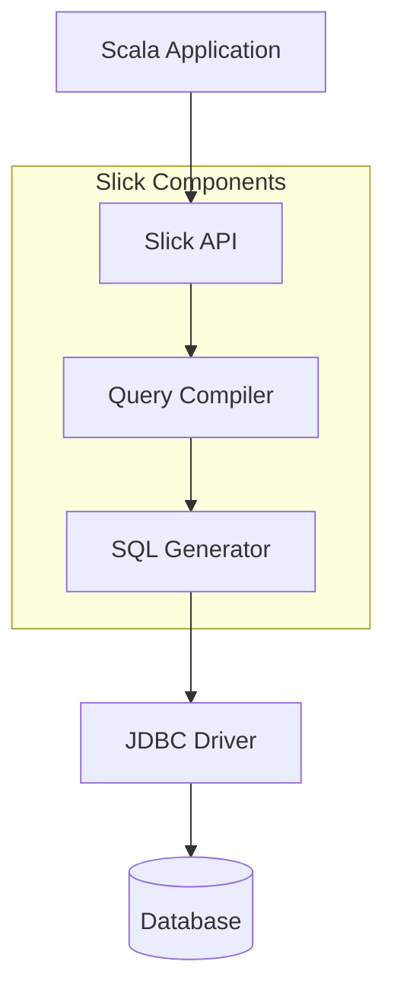
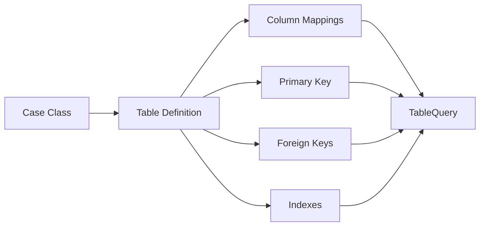
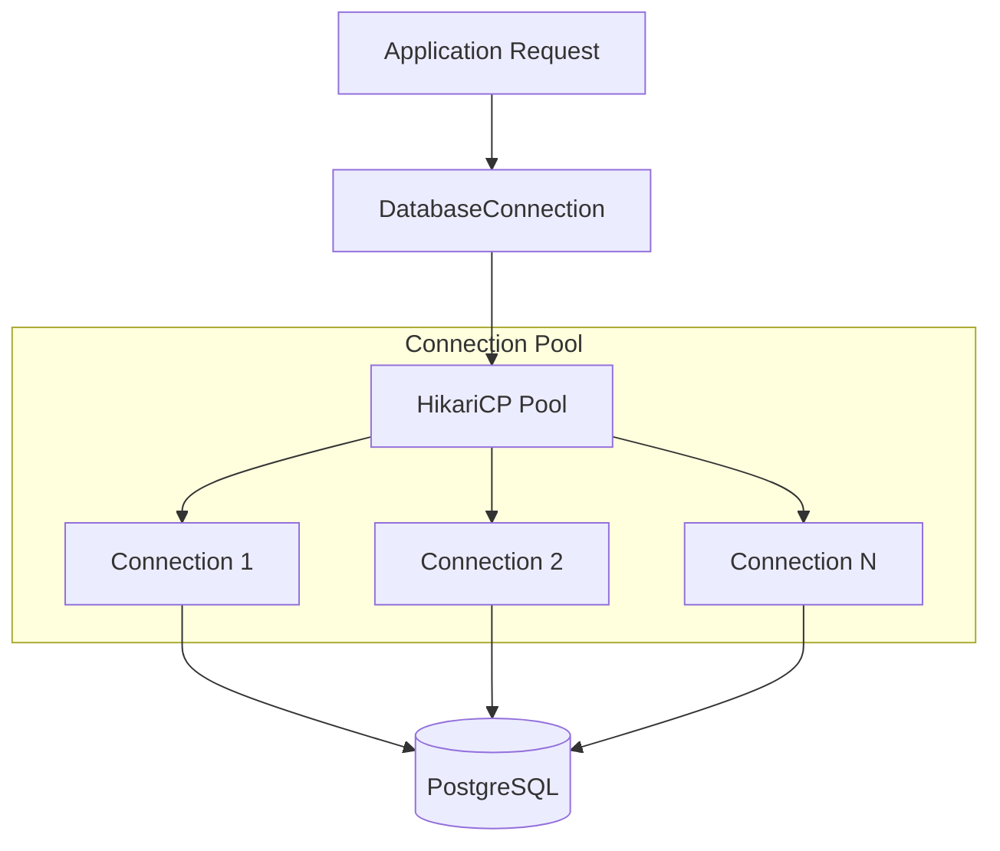
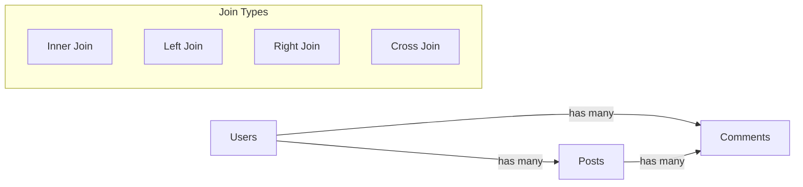
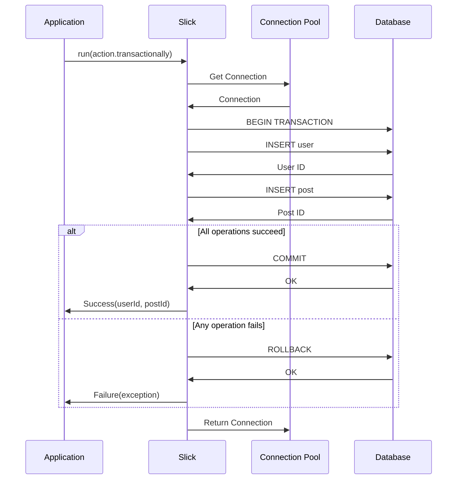

# How to Handle Database Operations with Slick

Author: [nawazdhandala](https://www.github.com/nawazdhandala)

Tags: Scala, Slick, Database, ORM, Functional Programming, PostgreSQL, MySQL, Type Safety

Description: Learn how to handle database operations in Scala using Slick, the functional relational mapping library. This guide covers table definitions, queries, transactions, and best practices for building type-safe database applications.

---

> Slick is a modern database query and access library for Scala. It allows you to work with stored data almost as if you were using Scala collections while at the same time giving you full control over when database access happens and what data is transferred.

Database operations are at the heart of most applications. Scala developers have several options for database access, but Slick stands out as the most idiomatic choice. It combines the power of functional programming with type-safe database queries, eliminating runtime SQL errors and providing a seamless Scala experience.

---

## What is Slick?

Slick (Scala Language-Integrated Connection Kit) is a Functional Relational Mapping (FRM) library for Scala. Unlike traditional ORMs that try to hide SQL behind objects, Slick embraces the relational model while providing a type-safe, composable API.



### Key Features

| Feature | Description |
|---------|-------------|
| **Type Safety** | Queries are checked at compile time |
| **Composability** | Build complex queries from simple parts |
| **Async Support** | Non-blocking database operations with Futures |
| **Multiple Databases** | PostgreSQL, MySQL, SQLite, H2, and more |
| **Plain SQL** | Escape hatch for complex queries |

---

## Setting Up Slick

First, add Slick dependencies to your `build.sbt` file.

```scala
// build.sbt
// Define the Slick version for consistency across dependencies
val slickVersion = "3.5.0"

libraryDependencies ++= Seq(
  // Core Slick library for database operations
  "com.typesafe.slick" %% "slick" % slickVersion,

  // HikariCP connection pool for efficient database connections
  "com.typesafe.slick" %% "slick-hikaricp" % slickVersion,

  // PostgreSQL JDBC driver - replace with your database driver
  "org.postgresql" % "postgresql" % "42.7.1",

  // SLF4J for logging Slick operations
  "org.slf4j" % "slf4j-nop" % "2.0.9"
)
```

### Database Configuration

Configure your database connection in `application.conf`. This file uses HOCON format and supports environment variable substitution for security.

```hocon
# application.conf
# Database configuration using HikariCP connection pool

mydb {
  # Database profile determines SQL dialect
  profile = "slick.jdbc.PostgresProfile$"

  db {
    # Connection URL with database name
    url = "jdbc:postgresql://localhost:5432/myapp"
    url = ${?DATABASE_URL}

    # Database credentials - use environment variables in production
    user = "postgres"
    user = ${?DATABASE_USER}

    password = "password"
    password = ${?DATABASE_PASSWORD}

    # JDBC driver class
    driver = org.postgresql.Driver

    # Connection pool settings
    numThreads = 10
    maxConnections = 20
    minConnections = 5

    # Connection timeout in milliseconds
    connectionTimeout = 30000

    # How long a connection can stay idle before being closed
    idleTimeout = 600000

    # Maximum lifetime of a connection
    maxLifetime = 1800000
  }
}
```

---

## Defining Tables

Slick uses table definitions to map database tables to Scala types. Each table definition includes the schema and projection.



### Basic Table Definition

Define a case class for your data and a corresponding table class that extends Slick's Table.

```scala
// models/User.scala
import slick.jdbc.PostgresProfile.api._
import java.time.LocalDateTime

// Case class representing a user record
// Using Option for nullable fields and auto-generated values
case class User(
  id: Option[Long],
  email: String,
  username: String,
  passwordHash: String,
  isActive: Boolean,
  createdAt: LocalDateTime,
  updatedAt: LocalDateTime
)

// Table definition mapping User case class to users table
class UsersTable(tag: Tag) extends Table[User](tag, "users") {

  // Column definitions with SQL types
  // O.PrimaryKey marks the primary key
  // O.AutoInc indicates auto-increment
  def id = column[Long]("id", O.PrimaryKey, O.AutoInc)

  // O.Unique ensures email uniqueness at database level
  def email = column[String]("email", O.Unique, O.Length(255))

  def username = column[String]("username", O.Length(100))

  // Password hash stored as longer string
  def passwordHash = column[String]("password_hash", O.Length(255))

  // O.Default provides default value for new records
  def isActive = column[Boolean]("is_active", O.Default(true))

  def createdAt = column[LocalDateTime]("created_at")

  def updatedAt = column[LocalDateTime]("updated_at")

  // Projection maps columns to case class
  // The <> operator creates a bidirectional mapping
  def * = (id.?, email, username, passwordHash, isActive, createdAt, updatedAt) <>
    ((User.apply _).tupled, User.unapply)

  // Index for faster email lookups
  def emailIndex = index("idx_users_email", email, unique = true)

  // Index for username searches
  def usernameIndex = index("idx_users_username", username)
}

// TableQuery is the entry point for building queries
// This lazy val can be imported and used throughout your application
object UsersTable {
  lazy val query = TableQuery[UsersTable]
}
```

### Table with Foreign Keys

Define relationships between tables using foreign keys.

```scala
// models/Post.scala
import slick.jdbc.PostgresProfile.api._
import java.time.LocalDateTime

// Case class for blog posts
case class Post(
  id: Option[Long],
  userId: Long,
  title: String,
  content: String,
  status: String,
  publishedAt: Option[LocalDateTime],
  createdAt: LocalDateTime,
  updatedAt: LocalDateTime
)

class PostsTable(tag: Tag) extends Table[Post](tag, "posts") {

  def id = column[Long]("id", O.PrimaryKey, O.AutoInc)

  // Foreign key column referencing users table
  def userId = column[Long]("user_id")

  def title = column[String]("title", O.Length(255))

  // Use SqlType for specific database types
  def content = column[String]("content", O.SqlType("TEXT"))

  // Status field with default value
  def status = column[String]("status", O.Length(20), O.Default("draft"))

  // Optional field for publish date
  def publishedAt = column[Option[LocalDateTime]]("published_at")

  def createdAt = column[LocalDateTime]("created_at")

  def updatedAt = column[LocalDateTime]("updated_at")

  def * = (id.?, userId, title, content, status, publishedAt, createdAt, updatedAt) <>
    ((Post.apply _).tupled, Post.unapply)

  // Foreign key constraint with cascade delete
  // When a user is deleted, their posts are also deleted
  def user = foreignKey("fk_posts_user", userId, UsersTable.query)(
    _.id,
    onDelete = ForeignKeyAction.Cascade,
    onUpdate = ForeignKeyAction.Restrict
  )

  // Composite index for common query patterns
  def userStatusIndex = index("idx_posts_user_status", (userId, status))
}

object PostsTable {
  lazy val query = TableQuery[PostsTable]
}
```

---

## Database Connection and Session Management

Create a database connection layer that manages the connection lifecycle.

```scala
// database/Database.scala
import slick.jdbc.PostgresProfile.api._
import com.typesafe.config.ConfigFactory
import scala.concurrent.{ExecutionContext, Future}

// Singleton object managing database connections
object DatabaseConnection {

  // Load configuration from application.conf
  private val config = ConfigFactory.load()

  // Create database instance with connection pool
  // This is thread-safe and should be shared across your application
  lazy val db: Database = Database.forConfig("mydb.db", config)

  // Graceful shutdown method
  def close(): Unit = db.close()

  // Helper method to run database actions
  def run[T](action: DBIO[T])(implicit ec: ExecutionContext): Future[T] = {
    db.run(action)
  }

  // Run action with transaction support
  def runTransactionally[T](action: DBIO[T])(implicit ec: ExecutionContext): Future[T] = {
    db.run(action.transactionally)
  }
}
```

### Connection Pool Architecture



---

## CRUD Operations

Slick provides a clean, type-safe API for Create, Read, Update, and Delete operations.

### Creating Records

Insert single or multiple records into the database.

```scala
// repositories/UserRepository.scala
import slick.jdbc.PostgresProfile.api._
import scala.concurrent.{ExecutionContext, Future}
import java.time.LocalDateTime

class UserRepository(implicit ec: ExecutionContext) {

  private val users = UsersTable.query
  private val db = DatabaseConnection.db

  // Insert a single user and return the generated ID
  def create(user: User): Future[Long] = {
    val now = LocalDateTime.now()
    val userWithTimestamps = user.copy(
      createdAt = now,
      updatedAt = now
    )

    // returning returns the auto-generated ID after insert
    val action = (users returning users.map(_.id)) += userWithTimestamps
    db.run(action)
  }

  // Insert multiple users in a single batch operation
  // More efficient than multiple single inserts
  def createMany(userList: Seq[User]): Future[Seq[Long]] = {
    val now = LocalDateTime.now()
    val usersWithTimestamps = userList.map(_.copy(
      createdAt = now,
      updatedAt = now
    ))

    // Batch insert with returning clause
    val action = (users returning users.map(_.id)) ++= usersWithTimestamps
    db.run(action)
  }

  // Insert or update based on unique constraint
  def upsert(user: User): Future[Int] = {
    val now = LocalDateTime.now()
    val userWithTimestamp = user.copy(updatedAt = now)

    // insertOrUpdate checks unique constraints
    val action = users.insertOrUpdate(userWithTimestamp)
    db.run(action)
  }
}
```

### Reading Records

Query data with filters, sorting, and pagination.

```scala
// Continuation of UserRepository

  // Find user by ID - returns Option for safety
  def findById(id: Long): Future[Option[User]] = {
    val action = users.filter(_.id === id).result.headOption
    db.run(action)
  }

  // Find user by email
  def findByEmail(email: String): Future[Option[User]] = {
    val action = users
      .filter(_.email.toLowerCase === email.toLowerCase)
      .result
      .headOption
    db.run(action)
  }

  // Find all active users with pagination
  def findAllActive(page: Int, pageSize: Int): Future[Seq[User]] = {
    val offset = page * pageSize

    val action = users
      .filter(_.isActive === true)
      .sortBy(_.createdAt.desc)
      .drop(offset)
      .take(pageSize)
      .result

    db.run(action)
  }

  // Count total active users for pagination info
  def countActive(): Future[Int] = {
    val action = users.filter(_.isActive === true).length.result
    db.run(action)
  }

  // Search users by username pattern
  def searchByUsername(pattern: String): Future[Seq[User]] = {
    val action = users
      .filter(_.username.toLowerCase like s"%${pattern.toLowerCase}%")
      .sortBy(_.username)
      .result

    db.run(action)
  }

  // Get users created within date range
  def findByDateRange(
    startDate: LocalDateTime,
    endDate: LocalDateTime
  ): Future[Seq[User]] = {
    val action = users
      .filter(u => u.createdAt >= startDate && u.createdAt <= endDate)
      .sortBy(_.createdAt.desc)
      .result

    db.run(action)
  }
```

### Updating Records

Update single or multiple records with type safety.

```scala
// Continuation of UserRepository

  // Update user by ID
  def update(id: Long, user: User): Future[Int] = {
    val now = LocalDateTime.now()

    val action = users
      .filter(_.id === id)
      .map(u => (u.email, u.username, u.isActive, u.updatedAt))
      .update((user.email, user.username, user.isActive, now))

    db.run(action)
  }

  // Update only specific fields
  def updateEmail(id: Long, newEmail: String): Future[Int] = {
    val now = LocalDateTime.now()

    val action = users
      .filter(_.id === id)
      .map(u => (u.email, u.updatedAt))
      .update((newEmail, now))

    db.run(action)
  }

  // Activate user account
  def activate(id: Long): Future[Int] = {
    val now = LocalDateTime.now()

    val action = users
      .filter(_.id === id)
      .map(u => (u.isActive, u.updatedAt))
      .update((true, now))

    db.run(action)
  }

  // Deactivate multiple users by IDs
  def deactivateMany(ids: Seq[Long]): Future[Int] = {
    val now = LocalDateTime.now()

    val action = users
      .filter(_.id inSet ids)
      .map(u => (u.isActive, u.updatedAt))
      .update((false, now))

    db.run(action)
  }

  // Update with conditional logic
  def updatePasswordIfActive(id: Long, newHash: String): Future[Int] = {
    val now = LocalDateTime.now()

    val action = users
      .filter(u => u.id === id && u.isActive === true)
      .map(u => (u.passwordHash, u.updatedAt))
      .update((newHash, now))

    db.run(action)
  }
```

### Deleting Records

Delete records safely with type-checked conditions.

```scala
// Continuation of UserRepository

  // Delete user by ID
  def delete(id: Long): Future[Int] = {
    val action = users.filter(_.id === id).delete
    db.run(action)
  }

  // Delete multiple users by IDs
  def deleteMany(ids: Seq[Long]): Future[Int] = {
    val action = users.filter(_.id inSet ids).delete
    db.run(action)
  }

  // Soft delete - mark as inactive instead of removing
  def softDelete(id: Long): Future[Int] = {
    deactivate(id)
  }

  // Delete inactive users older than given date
  def deleteInactiveOlderThan(date: LocalDateTime): Future[Int] = {
    val action = users
      .filter(u => u.isActive === false && u.updatedAt < date)
      .delete

    db.run(action)
  }
}
```

---

## Joins and Relationships

Slick supports various join types for querying related data.



### Join Operations

```scala
// repositories/PostRepository.scala
import slick.jdbc.PostgresProfile.api._
import scala.concurrent.{ExecutionContext, Future}

class PostRepository(implicit ec: ExecutionContext) {

  private val posts = PostsTable.query
  private val users = UsersTable.query
  private val db = DatabaseConnection.db

  // Inner join - get posts with their authors
  def findPostsWithAuthors(): Future[Seq[(Post, User)]] = {
    val action = posts
      .join(users)
      .on(_.userId === _.id)
      .result

    db.run(action)
  }

  // Left join - get all posts, including those without authors
  def findAllPostsWithOptionalAuthors(): Future[Seq[(Post, Option[User])]] = {
    val action = posts
      .joinLeft(users)
      .on(_.userId === _.id)
      .result

    db.run(action)
  }

  // Join with filtering
  def findPublishedPostsByActiveUsers(): Future[Seq[(Post, User)]] = {
    val action = posts
      .filter(_.status === "published")
      .join(users.filter(_.isActive === true))
      .on(_.userId === _.id)
      .sortBy { case (post, _) => post.publishedAt.desc }
      .result

    db.run(action)
  }

  // Monadic join style - more flexible for complex queries
  def findPostsWithAuthorsMonadic(): Future[Seq[(Post, User)]] = {
    val action = for {
      post <- posts
      user <- users if post.userId === user.id
    } yield (post, user)

    db.run(action.result)
  }

  // Join with aggregation - count posts per user
  def countPostsPerUser(): Future[Seq[(Long, String, Int)]] = {
    val action = posts
      .join(users)
      .on(_.userId === _.id)
      .groupBy { case (_, user) => (user.id, user.username) }
      .map { case ((userId, username), group) =>
        (userId, username, group.length)
      }
      .result

    db.run(action)
  }

  // Multiple joins
  def findPostsWithAuthorAndCommentCount(): Future[Seq[(Post, User, Int)]] = {
    // Assuming we have a CommentsTable
    val action = posts
      .join(users)
      .on(_.userId === _.id)
      .joinLeft(CommentsTable.query)
      .on { case ((post, _), comment) => post.id === comment.postId }
      .groupBy { case ((post, user), _) => (post, user) }
      .map { case ((post, user), group) =>
        (post, user, group.map(_._2).countDefined)
      }
      .result

    db.run(action)
  }
}
```

---

## Transactions

Transactions ensure data consistency by grouping multiple operations into atomic units.

```scala
// services/UserService.scala
import slick.jdbc.PostgresProfile.api._
import scala.concurrent.{ExecutionContext, Future}
import java.time.LocalDateTime

class UserService(implicit ec: ExecutionContext) {

  private val users = UsersTable.query
  private val posts = PostsTable.query
  private val db = DatabaseConnection.db

  // Simple transaction - create user and initial post atomically
  def createUserWithWelcomePost(
    user: User,
    welcomeTitle: String
  ): Future[(Long, Long)] = {

    val now = LocalDateTime.now()

    // Compose multiple operations into a single transaction
    val action = for {
      // Insert user and get generated ID
      userId <- (users returning users.map(_.id)) += user.copy(
        createdAt = now,
        updatedAt = now
      )

      // Insert welcome post for the new user
      postId <- (posts returning posts.map(_.id)) += Post(
        id = None,
        userId = userId,
        title = welcomeTitle,
        content = s"Welcome ${user.username}! This is your first post.",
        status = "published",
        publishedAt = Some(now),
        createdAt = now,
        updatedAt = now
      )
    } yield (userId, postId)

    // Run as transaction - if either insert fails, both are rolled back
    db.run(action.transactionally)
  }

  // Transaction with error handling
  def transferPosts(fromUserId: Long, toUserId: Long): Future[Int] = {
    val now = LocalDateTime.now()

    val action = for {
      // Verify source user exists
      sourceUser <- users.filter(_.id === fromUserId).result.headOption

      // Verify target user exists
      targetUser <- users.filter(_.id === toUserId).result.headOption

      // Transfer posts if both users exist
      result <- (sourceUser, targetUser) match {
        case (Some(_), Some(_)) =>
          posts
            .filter(_.userId === fromUserId)
            .map(p => (p.userId, p.updatedAt))
            .update((toUserId, now))

        case _ =>
          // Fail the transaction if either user is missing
          DBIO.failed(new IllegalArgumentException("User not found"))
      }
    } yield result

    db.run(action.transactionally)
  }

  // Transaction with rollback on business logic failure
  def deactivateUserAndArchivePosts(userId: Long): Future[Unit] = {
    val now = LocalDateTime.now()

    val action = for {
      // Get user's published post count
      publishedCount <- posts
        .filter(p => p.userId === userId && p.status === "published")
        .length
        .result

      // Don't allow deactivation if user has published posts
      _ <- if (publishedCount > 0) {
        DBIO.failed(new IllegalStateException(
          s"Cannot deactivate user with $publishedCount published posts"
        ))
      } else {
        DBIO.successful(())
      }

      // Archive all user's posts
      _ <- posts
        .filter(_.userId === userId)
        .map(p => (p.status, p.updatedAt))
        .update(("archived", now))

      // Deactivate the user
      _ <- users
        .filter(_.id === userId)
        .map(u => (u.isActive, u.updatedAt))
        .update((false, now))

    } yield ()

    db.run(action.transactionally)
  }

  // Nested transaction with savepoints
  def complexOperation(): Future[Unit] = {
    val action = for {
      // Outer transaction operations
      _ <- DBIO.successful(())

      // Nested transaction creates a savepoint
      _ <- (for {
        _ <- users.filter(_.id === 1L).map(_.isActive).update(false)
      } yield ()).transactionally

      // More outer transaction operations
      _ <- DBIO.successful(())
    } yield ()

    db.run(action.transactionally)
  }
}
```

### Transaction Flow



---

## Plain SQL Queries

For complex queries or performance optimization, Slick supports raw SQL with type interpolation.

```scala
// repositories/ReportRepository.scala
import slick.jdbc.PostgresProfile.api._
import slick.jdbc.GetResult
import scala.concurrent.{ExecutionContext, Future}

// Custom result type for reports
case class UserStats(
  userId: Long,
  username: String,
  totalPosts: Int,
  publishedPosts: Int,
  lastPostDate: Option[LocalDateTime]
)

class ReportRepository(implicit ec: ExecutionContext) {

  private val db = DatabaseConnection.db

  // Define how to map SQL results to case class
  // GetResult is a type class for result mapping
  implicit val getUserStatsResult: GetResult[UserStats] = GetResult { r =>
    UserStats(
      r.nextLong(),
      r.nextString(),
      r.nextInt(),
      r.nextInt(),
      r.nextTimestampOption().map(_.toLocalDateTime)
    )
  }

  // Plain SQL query with type interpolation
  def getUserStats(): Future[Seq[UserStats]] = {
    val action = sql"""
      SELECT
        u.id,
        u.username,
        COUNT(p.id) as total_posts,
        COUNT(CASE WHEN p.status = 'published' THEN 1 END) as published_posts,
        MAX(p.created_at) as last_post_date
      FROM users u
      LEFT JOIN posts p ON u.id = p.user_id
      WHERE u.is_active = true
      GROUP BY u.id, u.username
      ORDER BY total_posts DESC
    """.as[UserStats]

    db.run(action)
  }

  // Parameterized query - safe from SQL injection
  def searchPosts(
    searchTerm: String,
    status: String,
    limit: Int
  ): Future[Seq[(Long, String, String)]] = {

    // Parameters are safely escaped by Slick
    val pattern = s"%${searchTerm}%"

    val action = sql"""
      SELECT p.id, p.title, u.username
      FROM posts p
      JOIN users u ON p.user_id = u.id
      WHERE (p.title ILIKE $pattern OR p.content ILIKE $pattern)
        AND p.status = $status
      ORDER BY p.created_at DESC
      LIMIT $limit
    """.as[(Long, String, String)]

    db.run(action)
  }

  // Plain SQL for DDL operations
  def createIndexes(): Future[Unit] = {
    val action = sqlu"""
      CREATE INDEX CONCURRENTLY IF NOT EXISTS idx_posts_content_search
      ON posts USING gin(to_tsvector('english', content))
    """

    db.run(action).map(_ => ())
  }

  // Complex aggregation query
  def getMonthlyPostStats(year: Int): Future[Seq[(Int, Int, Int)]] = {
    val action = sql"""
      SELECT
        EXTRACT(MONTH FROM created_at)::int as month,
        COUNT(*) as total_posts,
        COUNT(CASE WHEN status = 'published' THEN 1 END) as published
      FROM posts
      WHERE EXTRACT(YEAR FROM created_at) = $year
      GROUP BY EXTRACT(MONTH FROM created_at)
      ORDER BY month
    """.as[(Int, Int, Int)]

    db.run(action)
  }
}
```

---

## Schema Management

Slick can generate and manage database schemas programmatically.

```scala
// database/SchemaManager.scala
import slick.jdbc.PostgresProfile.api._
import scala.concurrent.{ExecutionContext, Future}

object SchemaManager {

  private val db = DatabaseConnection.db

  // Combine all table queries for schema operations
  private val allTables = UsersTable.query.schema ++ PostsTable.query.schema

  // Create all tables
  def createSchema()(implicit ec: ExecutionContext): Future[Unit] = {
    val action = allTables.createIfNotExists
    db.run(action)
  }

  // Drop all tables - use with caution!
  def dropSchema()(implicit ec: ExecutionContext): Future[Unit] = {
    val action = allTables.dropIfExists
    db.run(action)
  }

  // Get DDL statements for inspection
  def printSchema(): Unit = {
    println("Create statements:")
    allTables.createStatements.foreach(println)

    println("\nDrop statements:")
    allTables.dropStatements.foreach(println)
  }

  // Check if tables exist
  def tablesExist()(implicit ec: ExecutionContext): Future[Boolean] = {
    val action = sql"""
      SELECT EXISTS (
        SELECT FROM information_schema.tables
        WHERE table_schema = 'public'
        AND table_name = 'users'
      )
    """.as[Boolean].head

    db.run(action)
  }
}
```

---

## Custom Column Types

Map custom Scala types to database columns.

```scala
// models/CustomTypes.scala
import slick.jdbc.PostgresProfile.api._
import java.util.UUID
import io.circe.{Json, parser}
import io.circe.syntax._

// Enumeration for post status
sealed trait PostStatus
object PostStatus {
  case object Draft extends PostStatus
  case object Published extends PostStatus
  case object Archived extends PostStatus

  // Map between String and PostStatus
  implicit val postStatusColumnType: BaseColumnType[PostStatus] =
    MappedColumnType.base[PostStatus, String](
      // Scala to SQL
      {
        case Draft => "draft"
        case Published => "published"
        case Archived => "archived"
      },
      // SQL to Scala
      {
        case "draft" => Draft
        case "published" => Published
        case "archived" => Archived
        case other => throw new IllegalArgumentException(s"Unknown status: $other")
      }
    )
}

// UUID column type
object UUIDColumnType {
  implicit val uuidColumnType: BaseColumnType[UUID] =
    MappedColumnType.base[UUID, String](
      _.toString,
      UUID.fromString
    )
}

// JSON column type using Circe
object JsonColumnType {
  implicit val jsonColumnType: BaseColumnType[Json] =
    MappedColumnType.base[Json, String](
      _.noSpaces,
      str => parser.parse(str).getOrElse(Json.Null)
    )
}

// Example usage in table definition
case class Article(
  id: Option[Long],
  uuid: UUID,
  status: PostStatus,
  metadata: Json
)

class ArticlesTable(tag: Tag) extends Table[Article](tag, "articles") {
  // Import custom column types
  import UUIDColumnType._
  import PostStatus._
  import JsonColumnType._

  def id = column[Long]("id", O.PrimaryKey, O.AutoInc)
  def uuid = column[UUID]("uuid", O.Unique)
  def status = column[PostStatus]("status")
  def metadata = column[Json]("metadata", O.SqlType("JSONB"))

  def * = (id.?, uuid, status, metadata) <> ((Article.apply _).tupled, Article.unapply)
}
```

---

## Streaming Large Results

Handle large result sets efficiently using Slick's streaming support.

```scala
// services/ExportService.scala
import slick.jdbc.PostgresProfile.api._
import akka.stream.scaladsl.Source
import akka.NotUsed
import scala.concurrent.ExecutionContext

class ExportService(implicit ec: ExecutionContext) {

  private val db = DatabaseConnection.db
  private val posts = PostsTable.query

  // Stream posts without loading all into memory
  def streamAllPosts(): Source[Post, NotUsed] = {
    val query = posts.sortBy(_.createdAt.desc)

    // Convert to Akka Stream source
    Source.fromPublisher(db.stream(query.result))
  }

  // Stream with backpressure and chunking
  def streamPostsChunked(chunkSize: Int): Source[Seq[Post], NotUsed] = {
    val query = posts.sortBy(_.createdAt.desc)

    Source.fromPublisher(db.stream(query.result))
      .grouped(chunkSize)
  }

  // Export to CSV using streaming
  def exportToCsv(): Source[String, NotUsed] = {
    val header = Source.single("id,user_id,title,status,created_at\n")

    val rows = streamAllPosts().map { post =>
      s"${post.id.getOrElse("")},${post.userId},${escapeCSV(post.title)},${post.status},${post.createdAt}\n"
    }

    header.concat(rows)
  }

  private def escapeCSV(s: String): String = {
    if (s.contains(",") || s.contains("\"") || s.contains("\n")) {
      "\"" + s.replace("\"", "\"\"") + "\""
    } else s
  }
}
```

---

## Best Practices

### 1. Use Repository Pattern

Encapsulate database operations in repository classes for better organization and testability.

```scala
// repositories/Repository.scala
trait Repository[T, ID] {
  def findById(id: ID): Future[Option[T]]
  def findAll(): Future[Seq[T]]
  def create(entity: T): Future[ID]
  def update(id: ID, entity: T): Future[Int]
  def delete(id: ID): Future[Int]
}
```

### 2. Handle Errors Gracefully

```scala
// Wrap database operations with proper error handling
def safeCreate(user: User): Future[Either[String, Long]] = {
  userRepository.create(user)
    .map(id => Right(id))
    .recover {
      case e: java.sql.SQLIntegrityConstraintViolationException =>
        Left("Email already exists")
      case e: Exception =>
        Left(s"Database error: ${e.getMessage}")
    }
}
```

### 3. Use Connection Pool Monitoring

```scala
// Monitor connection pool health
def getPoolStats(): Map[String, Any] = {
  val hikariPool = db.source.asInstanceOf[HikariDataSource]
  Map(
    "activeConnections" -> hikariPool.getHikariPoolMXBean.getActiveConnections,
    "idleConnections" -> hikariPool.getHikariPoolMXBean.getIdleConnections,
    "totalConnections" -> hikariPool.getHikariPoolMXBean.getTotalConnections,
    "threadsAwaitingConnection" -> hikariPool.getHikariPoolMXBean.getThreadsAwaitingConnection
  )
}
```

### 4. Compile Queries for Performance

```scala
// Compiled queries are cached and reused
private val findByIdCompiled = Compiled { id: Rep[Long] =>
  users.filter(_.id === id)
}

def findById(id: Long): Future[Option[User]] = {
  db.run(findByIdCompiled(id).result.headOption)
}
```

### 5. Properly Close Connections

```scala
// Use try-finally or lifecycle hooks
sys.addShutdownHook {
  DatabaseConnection.close()
}

// Or in application framework
override def onStop(): Unit = {
  DatabaseConnection.close()
}
```

---

## Common Pitfalls

| Pitfall | Problem | Solution |
|---------|---------|----------|
| N+1 Queries | Loading related data in loops | Use joins or batch loading |
| Connection Leaks | Not returning connections to pool | Always use proper action composition |
| Blocking Operations | Running sync code in async context | Use proper ExecutionContext |
| Missing Indexes | Slow queries on large tables | Add indexes for filter/sort columns |
| Large Result Sets | Out of memory errors | Use streaming for large exports |

---

## Conclusion

Slick provides a powerful, type-safe way to work with databases in Scala. Key takeaways include:

- **Type Safety**: Catch SQL errors at compile time, not runtime
- **Functional Composition**: Build complex queries from simple, reusable parts
- **Async by Default**: Non-blocking database operations fit naturally into reactive applications
- **Flexibility**: Use the typed DSL for most queries, plain SQL when needed
- **Transaction Support**: Group operations into atomic units easily

By following the patterns and practices outlined in this guide, you can build robust, maintainable database layers for your Scala applications.

---

*Building a Scala application that needs monitoring? [OneUptime](https://oneuptime.com) provides comprehensive observability for your applications, including database query tracking and performance monitoring.*

**Related Reading:**
- [How to Implement Connection Pooling in Python for PostgreSQL](https://oneuptime.com/blog/post/2025-01-06-python-connection-pooling-postgresql/view)
- [How to Use asyncio Effectively in Python for I/O-Bound Workloads](https://oneuptime.com/blog/post/2025-01-06-python-asyncio-io-bound/view)
