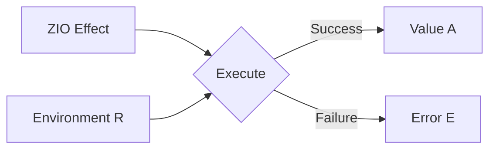
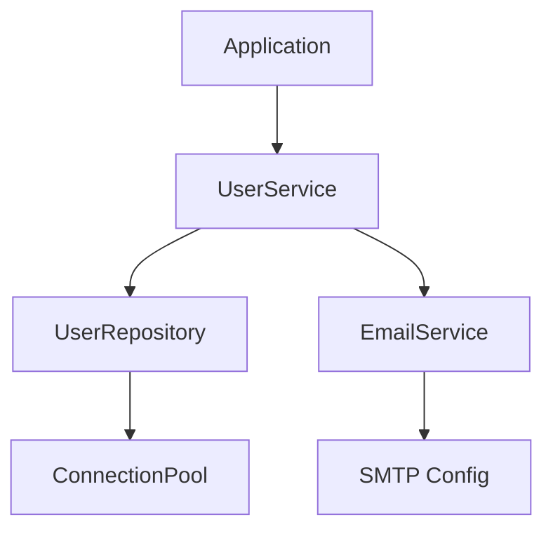
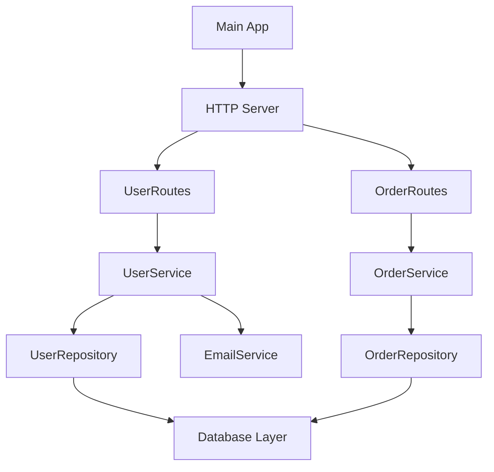

# How to Build Applications with ZIO

Author: [nawazdhandala](https://www.github.com/nawazdhandala)

Tags: Scala, ZIO, Functional Programming, Effects, Async

Description: A practical guide to building type-safe, concurrent applications in Scala using ZIO for effect management, error handling, and resource safety.

---

ZIO is a library for asynchronous and concurrent programming in Scala. It provides a functional approach to managing effects, errors, and resources while maintaining type safety throughout your application. If you've been working with Scala and want to move beyond callbacks or futures, ZIO offers a more composable and testable alternative.

## What is ZIO?

ZIO (Zero-cost IO) is an effect system that represents computations as values. Instead of immediately executing side effects, you describe what should happen, and ZIO handles the execution. This makes your code easier to reason about, test, and compose.

The core type is `ZIO[R, E, A]` where:
- `R` is the environment (dependencies) required
- `E` is the error type that can occur
- `A` is the success type produced

Think of it as a function that takes an environment `R` and returns either an error `E` or a value `A`.



## Setting Up a ZIO Project

### Project Configuration

Start with a basic sbt project. Add ZIO dependencies to your build.sbt file.

```scala
// build.sbt
val zioVersion = "2.0.21"

lazy val root = (project in file("."))
  .settings(
    name := "zio-demo",
    scalaVersion := "3.3.1",
    libraryDependencies ++= Seq(
      // Core ZIO library for effect management
      "dev.zio" %% "zio" % zioVersion,
      // JSON handling with ZIO integration
      "dev.zio" %% "zio-json" % "0.6.2",
      // HTTP server built on ZIO
      "dev.zio" %% "zio-http" % "3.0.0-RC4",
      // Testing support for ZIO effects
      "dev.zio" %% "zio-test" % zioVersion % Test,
      "dev.zio" %% "zio-test-sbt" % zioVersion % Test,
    ),
    // Use ZIO's test framework instead of default
    testFrameworks += new TestFramework("zio.test.sbt.ZTestFramework")
  )
```

## Creating Your First ZIO Effect

### Basic Effects

ZIO effects are values that describe computations. The simplest effects wrap pure values or suspend side effects.

```scala
import zio._

object BasicEffects extends ZIOAppDefault {

  // succeed creates an effect that produces a value
  // This is like wrapping a pure value in the effect system
  val greeting: ZIO[Any, Nothing, String] = ZIO.succeed("Hello, ZIO!")

  // fail creates an effect that represents a failure
  // The error type is captured at compile time
  val failure: ZIO[Any, String, Nothing] = ZIO.fail("Something went wrong")

  // attempt wraps code that might throw exceptions
  // Exceptions are caught and converted to the error channel
  def parseNumber(s: String): ZIO[Any, Throwable, Int] =
    ZIO.attempt(s.toInt)

  // Run this effect when the application starts
  def run = greeting.flatMap(msg => Console.printLine(msg))
}
```

### Composing Effects

ZIO effects compose with `flatMap` and `map`, or you can use for-comprehensions for cleaner syntax.

```scala
import zio._

object ComposingEffects extends ZIOAppDefault {

  // Define individual effects that will be composed
  val readName: ZIO[Any, Nothing, String] = ZIO.succeed("Alice")
  val readAge: ZIO[Any, Nothing, Int] = ZIO.succeed(30)

  // For-comprehension makes sequential composition readable
  // Each <- extracts the success value from an effect
  val program: ZIO[Any, Nothing, String] = for {
    name <- readName
    age  <- readAge
    // Create a new effect with the combined result
  } yield s"$name is $age years old"

  // Alternative: use map and flatMap directly
  val programAlt: ZIO[Any, Nothing, String] =
    readName.flatMap { name =>
      readAge.map { age =>
        s"$name is $age years old"
      }
    }

  def run = program.flatMap(Console.printLine(_))
}
```

## Error Handling

One of ZIO's strengths is typed error handling. Instead of throwing exceptions, you model errors as data types.

### Typed Errors

```scala
import zio._

object TypedErrors extends ZIOAppDefault {

  // Define custom error types as a sealed trait
  // This gives you exhaustive pattern matching
  sealed trait UserError
  case class UserNotFound(id: String) extends UserError
  case class InvalidEmail(email: String) extends UserError

  // The error type appears in the ZIO signature
  def findUser(id: String): ZIO[Any, UserError, String] =
    if (id == "1") ZIO.succeed("Alice")
    else ZIO.fail(UserNotFound(id))

  def validateEmail(email: String): ZIO[Any, UserError, String] =
    if (email.contains("@")) ZIO.succeed(email)
    else ZIO.fail(InvalidEmail(email))

  // Compose operations - errors are automatically propagated
  def createUserProfile(id: String, email: String): ZIO[Any, UserError, String] = for {
    name <- findUser(id)
    validEmail <- validateEmail(email)
  } yield s"Profile: $name <$validEmail>"

  def run = createUserProfile("1", "alice@example.com")
    .flatMap(Console.printLine(_))
    // catchAll handles all errors of the declared type
    .catchAll {
      case UserNotFound(id) => Console.printLine(s"User $id not found")
      case InvalidEmail(e)  => Console.printLine(s"Invalid email: $e")
    }
}
```

### Error Recovery

ZIO provides multiple ways to handle and recover from errors.

```scala
import zio._

object ErrorRecovery extends ZIOAppDefault {

  case class ApiError(message: String)

  def fetchFromPrimary: ZIO[Any, ApiError, String] =
    ZIO.fail(ApiError("Primary API unavailable"))

  def fetchFromBackup: ZIO[Any, ApiError, String] =
    ZIO.succeed("Data from backup")

  // orElse tries the backup if primary fails
  val withFallback: ZIO[Any, ApiError, String] =
    fetchFromPrimary.orElse(fetchFromBackup)

  // fold handles both success and failure cases
  // Useful when you want to convert to a common type
  val asMessage: ZIO[Any, Nothing, String] =
    fetchFromPrimary.fold(
      err => s"Failed: ${err.message}",
      data => s"Success: $data"
    )

  // retry with a schedule for transient failures
  val withRetry: ZIO[Any, ApiError, String] =
    fetchFromPrimary.retry(Schedule.recurs(3))

  def run = withFallback.flatMap(Console.printLine(_))
}
```

## Dependency Injection with ZLayer

ZIO uses `ZLayer` for dependency injection. This provides compile-time verification that all dependencies are satisfied.

### Defining Services

```scala
import zio._

// Define a service as a trait
// This is the interface your application depends on
trait UserRepository {
  def findById(id: String): ZIO[Any, Throwable, Option[User]]
  def save(user: User): ZIO[Any, Throwable, Unit]
}

case class User(id: String, name: String, email: String)

// Companion object provides the service accessor
object UserRepository {
  // Accessor method to use the service from the environment
  def findById(id: String): ZIO[UserRepository, Throwable, Option[User]] =
    ZIO.serviceWithZIO[UserRepository](_.findById(id))

  def save(user: User): ZIO[UserRepository, Throwable, Unit] =
    ZIO.serviceWithZIO[UserRepository](_.save(user))
}
```

### Implementing Services

```scala
import zio._
import scala.collection.mutable

// In-memory implementation for testing or development
class InMemoryUserRepository extends UserRepository {
  // Simple mutable map for demonstration
  private val users = mutable.Map[String, User]()

  def findById(id: String): ZIO[Any, Throwable, Option[User]] =
    ZIO.succeed(users.get(id))

  def save(user: User): ZIO[Any, Throwable, Unit] =
    ZIO.succeed(users.put(user.id, user))
}

object InMemoryUserRepository {
  // ZLayer.succeed creates a layer from an already constructed value
  val layer: ZLayer[Any, Nothing, UserRepository] =
    ZLayer.succeed(new InMemoryUserRepository)
}

// Production implementation with database
class PostgresUserRepository(connectionPool: ConnectionPool) extends UserRepository {
  def findById(id: String): ZIO[Any, Throwable, Option[User]] =
    ZIO.attempt {
      // Actual database query would go here
      connectionPool.query(s"SELECT * FROM users WHERE id = '$id'")
    }

  def save(user: User): ZIO[Any, Throwable, Unit] =
    ZIO.attempt {
      connectionPool.execute(
        s"INSERT INTO users (id, name, email) VALUES ('${user.id}', '${user.name}', '${user.email}')"
      )
    }
}

// Placeholder for connection pool
trait ConnectionPool {
  def query(sql: String): Option[User]
  def execute(sql: String): Unit
}
```

### Wiring Dependencies



```scala
import zio._

// A service that depends on UserRepository
class UserService(repo: UserRepository) {
  def getUser(id: String): ZIO[Any, Throwable, User] =
    repo.findById(id).flatMap {
      case Some(user) => ZIO.succeed(user)
      case None       => ZIO.fail(new Exception(s"User $id not found"))
    }

  def createUser(name: String, email: String): ZIO[Any, Throwable, User] = {
    val user = User(java.util.UUID.randomUUID().toString, name, email)
    repo.save(user).as(user)
  }
}

object UserService {
  // Layer that requires UserRepository to construct UserService
  val layer: ZLayer[UserRepository, Nothing, UserService] =
    ZLayer {
      for {
        repo <- ZIO.service[UserRepository]
      } yield new UserService(repo)
    }

  def getUser(id: String): ZIO[UserService, Throwable, User] =
    ZIO.serviceWithZIO[UserService](_.getUser(id))
}
```

### Running with Layers

```scala
import zio._

object LayerExample extends ZIOAppDefault {

  val program: ZIO[UserService, Throwable, Unit] = for {
    user <- UserService.getUser("1")
    _    <- Console.printLine(s"Found user: ${user.name}")
  } yield ()

  // Compose layers - InMemoryUserRepository feeds into UserService
  val layers: ZLayer[Any, Nothing, UserService] =
    InMemoryUserRepository.layer >>> UserService.layer

  // provide injects the layers into the program
  def run = program.provide(layers)
}
```

## Concurrent Programming

ZIO makes concurrent programming safe and composable.

### Parallel Execution

```scala
import zio._

object ParallelExecution extends ZIOAppDefault {

  def fetchUserData(userId: String): ZIO[Any, Throwable, String] =
    ZIO.sleep(1.second) *> ZIO.succeed(s"User data for $userId")

  def fetchOrderHistory(userId: String): ZIO[Any, Throwable, String] =
    ZIO.sleep(1.second) *> ZIO.succeed(s"Orders for $userId")

  def fetchRecommendations(userId: String): ZIO[Any, Throwable, String] =
    ZIO.sleep(1.second) *> ZIO.succeed(s"Recommendations for $userId")

  // zipPar runs effects in parallel and combines results
  // Total time is ~1 second instead of ~3 seconds
  val parallelFetch: ZIO[Any, Throwable, (String, String, String)] =
    fetchUserData("123")
      .zipPar(fetchOrderHistory("123"))
      .zipPar(fetchRecommendations("123"))
      .map { case ((user, orders), recs) => (user, orders, recs) }

  // collectAllPar runs a collection of effects in parallel
  val manyUsers: ZIO[Any, Throwable, List[String]] =
    ZIO.collectAllPar(
      List("1", "2", "3", "4", "5").map(fetchUserData)
    )

  // foreachPar is like map but runs effects in parallel
  val processed: ZIO[Any, Throwable, List[String]] =
    ZIO.foreachPar(List("1", "2", "3")) { id =>
      fetchUserData(id).map(_.toUpperCase)
    }

  def run = parallelFetch.flatMap { case (user, orders, recs) =>
    Console.printLine(s"$user\n$orders\n$recs")
  }
}
```

### Fibers

Fibers are lightweight threads managed by ZIO. They allow fine-grained control over concurrent execution.

```scala
import zio._

object FiberExample extends ZIOAppDefault {

  def longRunningTask(name: String): ZIO[Any, Nothing, String] =
    ZIO.sleep(2.seconds) *> ZIO.succeed(s"$name completed")

  val program: ZIO[Any, Nothing, Unit] = for {
    // fork starts the effect on a new fiber
    // Returns immediately with a handle to the fiber
    fiber1 <- longRunningTask("Task 1").fork
    fiber2 <- longRunningTask("Task 2").fork

    // Do other work while tasks run in background
    _ <- Console.printLine("Tasks started, doing other work...")
    _ <- ZIO.sleep(500.millis)
    _ <- Console.printLine("Still working...")

    // join waits for the fiber to complete and gets the result
    result1 <- fiber1.join
    result2 <- fiber2.join

    _ <- Console.printLine(s"Results: $result1, $result2")
  } yield ()

  // Fiber interruption for cancellation
  val withTimeout: ZIO[Any, Nothing, Unit] = for {
    fiber <- longRunningTask("Slow task").fork
    // Race against a timeout
    result <- fiber.join.timeout(1.second)
    _ <- result match {
      case Some(r) => Console.printLine(s"Got result: $r")
      case None    => Console.printLine("Task timed out")
    }
  } yield ()

  def run = program
}
```

## Resource Management

ZIO provides safe resource management with automatic cleanup, even when errors occur or fibers are interrupted.

### Using ZIO.acquireRelease

```scala
import zio._
import java.io._

object ResourceManagement extends ZIOAppDefault {

  // acquireRelease ensures the resource is always released
  // Even if the usage fails or is interrupted
  def managedFile(path: String): ZIO[Scope, Throwable, BufferedReader] =
    ZIO.acquireRelease(
      // Acquire the resource
      ZIO.attempt(new BufferedReader(new FileReader(path)))
    )(
      // Release is guaranteed to run
      reader => ZIO.succeed(reader.close()).orDie
    )

  // ZIO.scoped creates a scope and runs the effect within it
  // Resources are released when the scope ends
  def readFirstLine(path: String): ZIO[Any, Throwable, String] =
    ZIO.scoped {
      for {
        reader <- managedFile(path)
        line   <- ZIO.attempt(reader.readLine())
      } yield line
    }

  def run = readFirstLine("/tmp/test.txt")
    .flatMap(Console.printLine(_))
    .catchAll(e => Console.printLine(s"Error: ${e.getMessage}"))
}
```

### Managing Multiple Resources

```scala
import zio._

object MultipleResources extends ZIOAppDefault {

  case class DatabaseConnection(id: String)
  case class CacheConnection(id: String)

  def acquireDb: ZIO[Scope, Throwable, DatabaseConnection] =
    ZIO.acquireRelease(
      Console.printLine("Connecting to database...") *>
        ZIO.succeed(DatabaseConnection("db-1"))
    )(conn =>
      Console.printLine(s"Closing database ${conn.id}").orDie
    )

  def acquireCache: ZIO[Scope, Throwable, CacheConnection] =
    ZIO.acquireRelease(
      Console.printLine("Connecting to cache...") *>
        ZIO.succeed(CacheConnection("cache-1"))
    )(conn =>
      Console.printLine(s"Closing cache ${conn.id}").orDie
    )

  // Both resources are acquired and released properly
  // Release happens in reverse order of acquisition
  val program: ZIO[Any, Throwable, Unit] = ZIO.scoped {
    for {
      db    <- acquireDb
      cache <- acquireCache
      _     <- Console.printLine(s"Using ${db.id} and ${cache.id}")
      // Even if this fails, both connections are closed
      _     <- ZIO.attempt(throw new Exception("Simulated error")).ignore
    } yield ()
  }

  def run = program
}
```

## Building an HTTP Server

ZIO HTTP provides a functional API for building HTTP servers.

### Basic Server

```scala
import zio._
import zio.http._
import zio.json._

object HttpServer extends ZIOAppDefault {

  // Define data types with JSON codecs
  case class User(id: String, name: String, email: String)
  object User {
    implicit val encoder: JsonEncoder[User] = DeriveJsonEncoder.gen[User]
    implicit val decoder: JsonDecoder[User] = DeriveJsonDecoder.gen[User]
  }

  case class CreateUserRequest(name: String, email: String)
  object CreateUserRequest {
    implicit val decoder: JsonDecoder[CreateUserRequest] =
      DeriveJsonDecoder.gen[CreateUserRequest]
  }

  // In-memory storage for demonstration
  val users = Ref.unsafe.make(Map.empty[String, User])

  // Define routes using pattern matching on method and path
  val routes: Routes[Any, Response] = Routes(
    // GET /health - simple health check endpoint
    Method.GET / "health" -> handler {
      Response.json("""{"status": "healthy"}""")
    },

    // GET /users/:id - path parameter extraction
    Method.GET / "users" / string("id") -> handler { (id: String, _: Request) =>
      users.get.map(_.get(id)).map {
        case Some(user) => Response.json(user.toJson)
        case None       => Response.status(Status.NotFound)
      }
    },

    // POST /users - create new user from JSON body
    Method.POST / "users" -> handler { (req: Request) =>
      for {
        body <- req.body.asString
        createReq <- ZIO.fromEither(body.fromJson[CreateUserRequest])
          .mapError(e => new Exception(e))
        id = java.util.UUID.randomUUID().toString
        user = User(id, createReq.name, createReq.email)
        _ <- users.update(_ + (id -> user))
      } yield Response.json(user.toJson).status(Status.Created)
    }.mapError(_ => Response.status(Status.BadRequest))
  )

  def run = Server.serve(routes).provide(Server.default)
}
```

### Adding Middleware

```scala
import zio._
import zio.http._

object MiddlewareExample extends ZIOAppDefault {

  // Logging middleware - logs request method and path
  val loggingMiddleware: Middleware[Any] = new Middleware[Any] {
    def apply[Env1 <: Any, Err](routes: Routes[Env1, Err]): Routes[Env1, Err] =
      routes.transform { handler =>
        Handler.fromFunctionZIO { (request: Request) =>
          for {
            start  <- Clock.nanoTime
            result <- handler(request)
            end    <- Clock.nanoTime
            duration = (end - start) / 1000000 // Convert to milliseconds
            _      <- Console.printLine(
              s"${request.method} ${request.path} - ${duration}ms"
            )
          } yield result
        }
      }
  }

  // CORS middleware for browser requests
  val corsMiddleware: Middleware[Any] = new Middleware[Any] {
    def apply[Env1 <: Any, Err](routes: Routes[Env1, Err]): Routes[Env1, Err] =
      routes.transform { handler =>
        handler.map { response =>
          response
            .addHeader(Header.AccessControlAllowOrigin.All)
            .addHeader(Header.AccessControlAllowMethods(Method.GET, Method.POST))
        }
      }
  }

  val routes: Routes[Any, Response] = Routes(
    Method.GET / "api" / "data" -> handler {
      Response.json("""{"message": "Hello from API"}""")
    }
  )

  // Apply middleware to routes
  val app = routes @@ loggingMiddleware @@ corsMiddleware

  def run = Server.serve(app).provide(Server.default)
}
```

## Testing ZIO Applications

ZIO Test provides a test framework designed for effect-based testing.

### Writing Tests

```scala
import zio._
import zio.test._
import zio.test.Assertion._

object UserServiceSpec extends ZIOSpecDefault {

  // Define a mock repository for testing
  class MockUserRepository(data: Map[String, User]) extends UserRepository {
    def findById(id: String): ZIO[Any, Throwable, Option[User]] =
      ZIO.succeed(data.get(id))

    def save(user: User): ZIO[Any, Throwable, Unit] =
      ZIO.unit // No-op for tests
  }

  val testUser = User("1", "Test User", "test@example.com")

  val mockLayer: ZLayer[Any, Nothing, UserRepository] =
    ZLayer.succeed(new MockUserRepository(Map("1" -> testUser)))

  def spec = suite("UserService")(
    // Test that finding an existing user works
    test("getUser returns user when found") {
      for {
        user <- UserService.getUser("1")
      } yield assertTrue(
        user.name == "Test User",
        user.email == "test@example.com"
      )
    },

    // Test error handling for missing users
    test("getUser fails when user not found") {
      for {
        result <- UserService.getUser("999").exit
      } yield assertTrue(result.isFailure)
    },

    // Test with assertions on the error
    test("getUser returns specific error message") {
      for {
        result <- UserService.getUser("999").either
      } yield assertTrue(
        result.isLeft,
        result.left.toOption.get.getMessage.contains("999")
      )
    }
  ).provide(mockLayer >>> UserService.layer)
}
```

### Testing with Test Services

ZIO provides test implementations of common services like Console and Clock.

```scala
import zio._
import zio.test._
import zio.test.Assertion._

object TimeBasedSpec extends ZIOSpecDefault {

  def processWithTimeout[A](
    effect: ZIO[Any, Throwable, A],
    timeout: Duration
  ): ZIO[Any, Throwable, Option[A]] =
    effect.timeout(timeout)

  def spec = suite("Timeout Tests")(
    // Test that quick operations complete
    test("completes fast operations") {
      for {
        result <- processWithTimeout(ZIO.succeed(42), 1.second)
      } yield assertTrue(result == Some(42))
    },

    // Use TestClock to control time in tests
    test("times out slow operations") {
      for {
        fiber  <- processWithTimeout(ZIO.never, 1.second).fork
        // Advance time without actually waiting
        _      <- TestClock.adjust(2.seconds)
        result <- fiber.join
      } yield assertTrue(result.isEmpty)
    }
  )
}
```

## Real-World Application Structure

Here's how to structure a complete ZIO application with multiple services.



### Application Entry Point

```scala
import zio._
import zio.http._

object Application extends ZIOAppDefault {

  // Combine all route modules
  val allRoutes: Routes[UserService & OrderService, Response] =
    UserRoutes.routes ++ OrderRoutes.routes

  // Compose all layers
  val appLayer: ZLayer[Any, Throwable, UserService & OrderService] =
    ZLayer.make[UserService & OrderService](
      // Infrastructure
      DatabaseLayer.live,
      // Repositories
      PostgresUserRepository.layer,
      PostgresOrderRepository.layer,
      // Services
      UserService.layer,
      OrderService.layer,
      // External services
      SmtpEmailService.layer
    )

  def run =
    Server.serve(allRoutes)
      .provide(
        appLayer,
        Server.defaultWithPort(8080)
      )
}
```

### Configuration Management

```scala
import zio._
import zio.config._
import zio.config.magnolia._
import zio.config.typesafe._

// Define configuration case classes
case class AppConfig(
  database: DatabaseConfig,
  server: ServerConfig,
  email: EmailConfig
)

case class DatabaseConfig(
  host: String,
  port: Int,
  name: String,
  username: String,
  password: String
)

case class ServerConfig(
  host: String,
  port: Int
)

case class EmailConfig(
  smtpHost: String,
  smtpPort: Int
)

object AppConfig {
  // Automatic derivation of config descriptor
  val descriptor: ConfigDescriptor[AppConfig] =
    deriveConfig[AppConfig]

  // Layer that loads config from application.conf
  val live: ZLayer[Any, ReadError[String], AppConfig] =
    ZLayer {
      read(
        descriptor from ConfigSource.fromResourcePath
      )
    }
}
```

## Summary

ZIO provides a powerful foundation for building Scala applications that are:

| Feature | Benefit |
|---------|---------|
| Type-safe effects | Compile-time verification of effect composition |
| Typed errors | No hidden exceptions, explicit error handling |
| Dependency injection | Compile-time DI with ZLayer |
| Resource safety | Automatic cleanup with acquireRelease |
| Concurrent by default | Easy parallel execution with fibers |
| Testable | Test services and controlled environments |

The learning curve can be steep coming from imperative code, but the payoff is applications that are easier to maintain, test, and reason about. Start with simple effects and gradually adopt more advanced features like ZLayer as your application grows.

Key takeaways:
- Model effects as values with `ZIO[R, E, A]`
- Use sealed traits for typed error handling
- Build services with `ZLayer` for testable dependency injection
- Prefer `acquireRelease` for resource management
- Use `fork` and `join` for fine-grained concurrency control

---

*Building robust, observable applications in Scala? [OneUptime](https://oneuptime.com) provides comprehensive monitoring for your ZIO services, including distributed tracing, metrics collection, and alerting. Track your effect execution, monitor fiber health, and get notified when things go wrong.*
