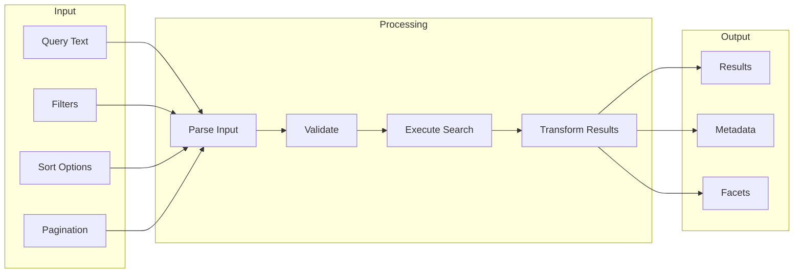
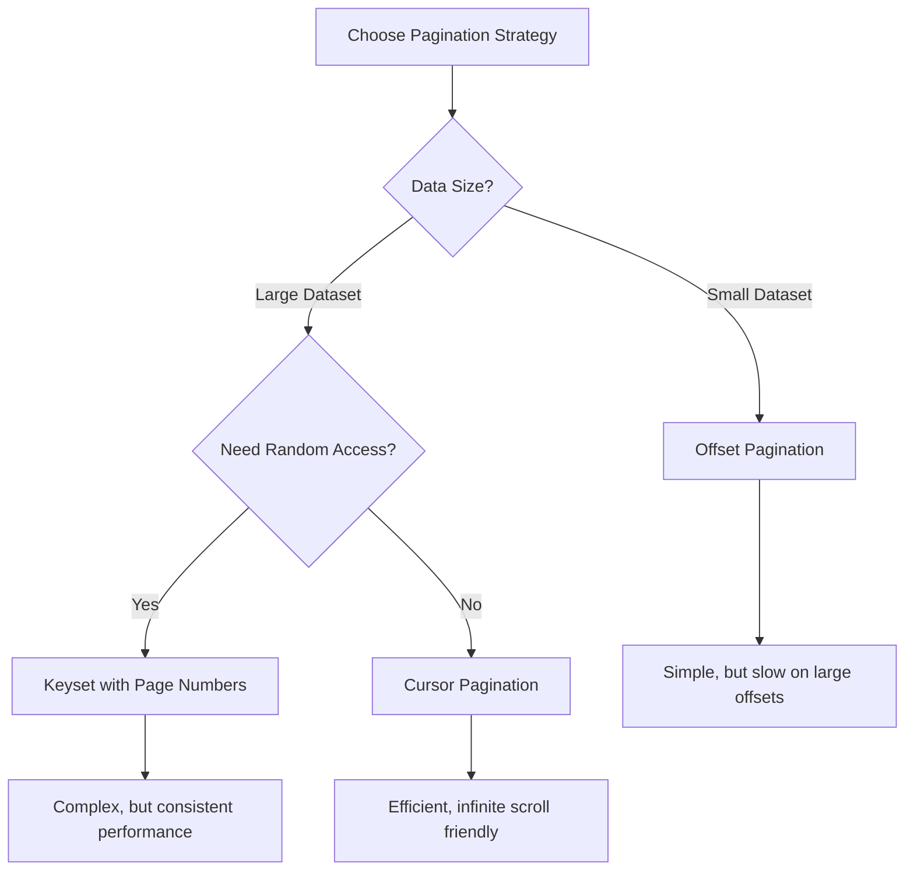
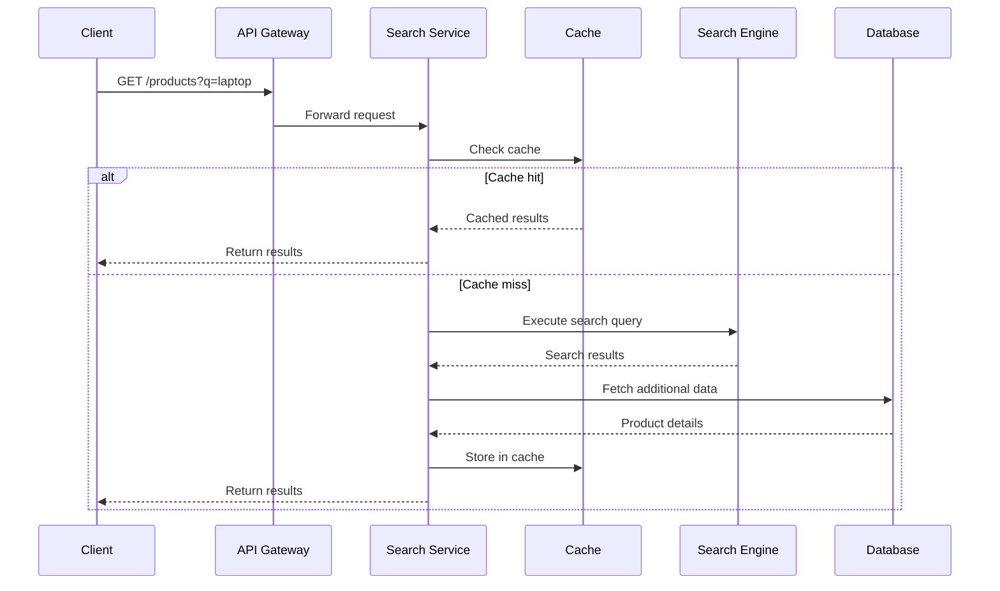

# How to Design Search Endpoints

Author: [nawazdhandala](https://github.com/nawazdhandala)

Tags: REST API, Search, API Design, Backend Development, Pagination, Elasticsearch

Description: A comprehensive guide to designing search endpoints for REST APIs, covering query parameters, filtering, sorting, pagination, faceted search, and performance optimization patterns.

---

Search is one of the most critical features in any application. A poorly designed search endpoint leads to frustrated users, slow performance, and maintenance nightmares. This guide covers everything you need to know about designing search endpoints that are intuitive, performant, and scalable.

## Understanding Search Endpoint Requirements

Before diving into implementation, understand what your search needs to accomplish:



## URL Structure for Search Endpoints

There are two common patterns for search endpoints. Choose based on your use case.

### Pattern 1: Collection-Based Search

Use this when searching within a specific resource type.

```
GET /api/v1/products?q=laptop&category=electronics&min_price=500
```

### Pattern 2: Dedicated Search Endpoint

Use this for cross-resource or complex searches.

```
GET /api/v1/search?q=laptop&type=products,reviews
```

### Choosing the Right Pattern

| Use Case | Recommended Pattern | Example |
|----------|-------------------|---------|
| Single resource search | Collection-based | `GET /products?q=laptop` |
| Cross-resource search | Dedicated endpoint | `GET /search?q=laptop` |
| Faceted search | Either | `GET /products?q=laptop&facets=true` |
| Autocomplete | Dedicated endpoint | `GET /search/suggest?q=lap` |

## Query Parameter Design

A well-designed search API uses consistent, intuitive query parameters.

### Core Search Parameters

The following example shows a comprehensive search request structure:

```http
GET /api/v1/products?
    q=wireless+headphones           # Search query
    &category=electronics           # Filter by category
    &brand=sony,bose               # Filter by multiple brands (OR)
    &min_price=50                   # Minimum price filter
    &max_price=300                  # Maximum price filter
    &in_stock=true                  # Boolean filter
    &sort=price:asc                 # Sort by price ascending
    &page=1                         # Page number
    &per_page=20                    # Results per page
    &fields=id,name,price,image     # Response field selection
```

### Implementation Example

This Express.js handler parses search parameters and returns structured results:

```javascript
// search-controller.js
const express = require('express');
const router = express.Router();

// Parse and validate search parameters from the query string
function parseSearchParams(query) {
    return {
        // Extract search query with default empty string
        q: query.q || '',

        // Parse filters into an object for easy processing
        filters: {
            category: query.category,
            // Support comma-separated values for multi-select filters
            brand: query.brand ? query.brand.split(',') : undefined,
            minPrice: query.min_price ? parseFloat(query.min_price) : undefined,
            maxPrice: query.max_price ? parseFloat(query.max_price) : undefined,
            inStock: query.in_stock === 'true'
        },

        // Parse sort parameter in format "field:direction"
        sort: parseSort(query.sort),

        // Pagination with sensible defaults and limits
        pagination: {
            page: Math.max(1, parseInt(query.page) || 1),
            perPage: Math.min(100, Math.max(1, parseInt(query.per_page) || 20))
        },

        // Optional field selection for response optimization
        fields: query.fields ? query.fields.split(',') : null
    };
}

// Convert sort string "field:direction" into structured format
function parseSort(sortParam) {
    if (!sortParam) {
        return { field: 'relevance', direction: 'desc' };
    }

    const [field, direction = 'asc'] = sortParam.split(':');

    // Whitelist allowed sort fields to prevent injection
    const allowedFields = ['relevance', 'price', 'name', 'created_at', 'rating'];
    if (!allowedFields.includes(field)) {
        return { field: 'relevance', direction: 'desc' };
    }

    return {
        field,
        direction: direction === 'desc' ? 'desc' : 'asc'
    };
}

// Main search endpoint handler
router.get('/products', async (req, res) => {
    try {
        const params = parseSearchParams(req.query);

        // Execute search with parsed parameters
        const results = await searchService.search(params);

        // Return standardized response structure
        res.json({
            data: results.items,
            meta: {
                query: params.q,
                total: results.total,
                page: params.pagination.page,
                per_page: params.pagination.perPage,
                total_pages: Math.ceil(results.total / params.pagination.perPage)
            },
            links: generatePaginationLinks(req, params, results.total)
        });
    } catch (error) {
        res.status(500).json({ error: 'Search failed' });
    }
});

module.exports = router;
```

## Filter Design Patterns

Filters narrow down search results. Design them to be intuitive and consistent.

### Simple Equality Filters

For exact matches, use straightforward key-value pairs:

```
GET /products?category=electronics
GET /products?status=available
```

### Range Filters

Use prefixes or dedicated parameters for numeric ranges:

```
# Option 1: Separate min/max parameters (recommended for clarity)
GET /products?min_price=100&max_price=500

# Option 2: Range syntax with brackets
GET /products?price=[100,500]

# Option 3: Operator prefixes for flexibility
GET /products?price[gte]=100&price[lte]=500
```

### Multi-Value Filters

Allow filtering by multiple values with OR logic:

```
# Comma-separated values (simple, widely used)
GET /products?brand=apple,samsung,sony

# Repeated parameter (more explicit)
GET /products?brand=apple&brand=samsung&brand=sony
```

### Boolean Filters

Keep boolean filters explicit and predictable:

```
GET /products?in_stock=true
GET /products?has_reviews=false
GET /products?featured=true
```

### Date Filters

Use ISO 8601 format for date parameters:

```
GET /orders?created_after=2025-01-01
GET /orders?created_before=2025-12-31T23:59:59Z
GET /orders?created_at=[2025-01-01,2025-12-31]
```

### Filter Implementation

This service builds database queries from filter parameters:

```javascript
// search-service.js
class SearchService {
    // Build a database query from parsed filter parameters
    buildFilterQuery(filters) {
        const conditions = [];
        const params = [];

        // Handle category filter with exact match
        if (filters.category) {
            conditions.push('category = ?');
            params.push(filters.category);
        }

        // Handle brand filter with IN clause for multi-select
        if (filters.brand && filters.brand.length > 0) {
            const placeholders = filters.brand.map(() => '?').join(',');
            conditions.push(`brand IN (${placeholders})`);
            params.push(...filters.brand);
        }

        // Handle price range with boundary conditions
        if (filters.minPrice !== undefined) {
            conditions.push('price >= ?');
            params.push(filters.minPrice);
        }

        if (filters.maxPrice !== undefined) {
            conditions.push('price <= ?');
            params.push(filters.maxPrice);
        }

        // Handle boolean filters
        if (filters.inStock) {
            conditions.push('stock_quantity > 0');
        }

        return {
            // Combine conditions with AND; return true if no filters
            where: conditions.length > 0
                ? conditions.join(' AND ')
                : '1=1',
            params
        };
    }
}
```

## Sorting Implementation

Allow users to sort results by relevant fields with clear syntax.

### Sort Parameter Format

Use a consistent format that supports multiple sort criteria:

```
# Single field sort
GET /products?sort=price:asc

# Multiple field sort (comma-separated)
GET /products?sort=category:asc,price:desc

# Alternative: separate parameters
GET /products?sort_by=price&sort_order=asc
```

### Sort Implementation

This function safely applies sorting to queries:

```javascript
// Apply sorting to the query based on validated parameters
function applySorting(query, sortParams) {
    // Define allowed sort fields with their database column mappings
    const sortFieldMap = {
        'relevance': 'search_score',
        'price': 'price',
        'name': 'name',
        'created_at': 'created_at',
        'rating': 'average_rating',
        'popularity': 'view_count'
    };

    // Handle multiple sort criteria
    const sortCriteria = Array.isArray(sortParams) ? sortParams : [sortParams];

    sortCriteria.forEach(sort => {
        const column = sortFieldMap[sort.field];

        // Skip invalid sort fields for security
        if (!column) return;

        // Apply sort with validated direction
        const direction = sort.direction === 'desc' ? 'DESC' : 'ASC';
        query.orderBy(column, direction);
    });

    return query;
}
```

## Pagination Strategies

Choose the right pagination strategy based on your data characteristics.



### Offset-Based Pagination

Simple but inefficient for large datasets due to database offset performance:

```javascript
// Offset pagination implementation
// Good for small datasets or when random page access is required
async function searchWithOffsetPagination(params) {
    const { page, perPage } = params.pagination;

    // Calculate offset from page number
    const offset = (page - 1) * perPage;

    // Get total count for pagination metadata
    const countQuery = db.select(db.raw('COUNT(*) as total')).from('products');
    const [{ total }] = await countQuery;

    // Fetch results with limit and offset
    const results = await db
        .select('*')
        .from('products')
        .limit(perPage)
        .offset(offset);

    return {
        items: results,
        total,
        page,
        perPage,
        totalPages: Math.ceil(total / perPage),
        // Include navigation links
        hasNextPage: page * perPage < total,
        hasPrevPage: page > 1
    };
}
```

### Cursor-Based Pagination

Better for large datasets and infinite scroll interfaces:

```javascript
// Cursor pagination implementation
// Efficient for large datasets, especially with infinite scroll
async function searchWithCursorPagination(params) {
    const { cursor, limit = 20 } = params.pagination;

    // Decode cursor to get the last seen item's sort key
    const decodedCursor = cursor
        ? JSON.parse(Buffer.from(cursor, 'base64').toString())
        : null;

    let query = db.select('*').from('products');

    // Apply cursor condition for efficient keyset pagination
    if (decodedCursor) {
        query = query.where(builder => {
            builder
                // Primary sort: items with greater sort value
                .where('created_at', '<', decodedCursor.created_at)
                // Tiebreaker: same sort value but different ID
                .orWhere(function() {
                    this.where('created_at', '=', decodedCursor.created_at)
                        .andWhere('id', '<', decodedCursor.id);
                });
        });
    }

    // Fetch one extra item to determine if there are more results
    const results = await query
        .orderBy('created_at', 'desc')
        .orderBy('id', 'desc')
        .limit(limit + 1);

    // Check if there are more results beyond current page
    const hasMore = results.length > limit;
    const items = hasMore ? results.slice(0, -1) : results;

    // Generate cursor for next page from last item
    const nextCursor = hasMore && items.length > 0
        ? Buffer.from(JSON.stringify({
            created_at: items[items.length - 1].created_at,
            id: items[items.length - 1].id
        })).toString('base64')
        : null;

    return {
        items,
        nextCursor,
        hasMore
    };
}
```

### Pagination Response Format

Return consistent pagination metadata:

```json
{
    "data": [...],
    "meta": {
        "total": 1250,
        "page": 3,
        "per_page": 20,
        "total_pages": 63
    },
    "links": {
        "self": "/api/v1/products?q=laptop&page=3",
        "first": "/api/v1/products?q=laptop&page=1",
        "prev": "/api/v1/products?q=laptop&page=2",
        "next": "/api/v1/products?q=laptop&page=4",
        "last": "/api/v1/products?q=laptop&page=63"
    }
}
```

## Faceted Search

Facets help users understand and refine their search results by showing aggregations.

### Facet Response Structure

Include facets in your search response to enable filtering UIs:

```json
{
    "data": [...],
    "meta": { ... },
    "facets": {
        "category": [
            { "value": "electronics", "count": 145 },
            { "value": "computers", "count": 89 },
            { "value": "accessories", "count": 67 }
        ],
        "brand": [
            { "value": "Apple", "count": 52 },
            { "value": "Samsung", "count": 48 },
            { "value": "Sony", "count": 31 }
        ],
        "price_range": [
            { "value": "0-100", "count": 234 },
            { "value": "100-500", "count": 456 },
            { "value": "500+", "count": 123 }
        ]
    }
}
```

### Facet Implementation with Elasticsearch

This example shows how to request and process faceted results:

```javascript
// Build Elasticsearch query with aggregations for facets
async function searchWithFacets(params) {
    const query = {
        index: 'products',
        body: {
            // Main search query
            query: {
                bool: {
                    must: params.q
                        ? { match: { name: params.q } }
                        : { match_all: {} },
                    filter: buildFilters(params.filters)
                }
            },

            // Aggregations for faceted navigation
            aggs: {
                // Category facet with document counts
                categories: {
                    terms: {
                        field: 'category.keyword',
                        size: 20
                    }
                },

                // Brand facet
                brands: {
                    terms: {
                        field: 'brand.keyword',
                        size: 50
                    }
                },

                // Price range facet with predefined buckets
                price_ranges: {
                    range: {
                        field: 'price',
                        ranges: [
                            { key: '0-100', from: 0, to: 100 },
                            { key: '100-500', from: 100, to: 500 },
                            { key: '500+', from: 500 }
                        ]
                    }
                },

                // Statistics for numeric fields
                price_stats: {
                    stats: { field: 'price' }
                }
            },

            // Pagination
            from: (params.pagination.page - 1) * params.pagination.perPage,
            size: params.pagination.perPage
        }
    };

    const response = await esClient.search(query);

    // Transform aggregations into facet response format
    return {
        items: response.hits.hits.map(hit => hit._source),
        total: response.hits.total.value,
        facets: {
            category: response.aggregations.categories.buckets.map(b => ({
                value: b.key,
                count: b.doc_count
            })),
            brand: response.aggregations.brands.buckets.map(b => ({
                value: b.key,
                count: b.doc_count
            })),
            price_range: response.aggregations.price_ranges.buckets.map(b => ({
                value: b.key,
                count: b.doc_count
            })),
            price_stats: response.aggregations.price_stats
        }
    };
}
```

## Search Suggestions and Autocomplete

Provide instant feedback as users type their queries.

### Autocomplete Endpoint

Design a fast, focused endpoint for search suggestions:

```
GET /api/v1/search/suggest?q=lap&limit=5
```

Response format optimized for dropdown display:

```json
{
    "suggestions": [
        {
            "text": "laptop",
            "type": "query",
            "count": 1250
        },
        {
            "text": "laptop charger",
            "type": "query",
            "count": 89
        },
        {
            "text": "Laptops & Computers",
            "type": "category",
            "url": "/categories/laptops"
        },
        {
            "text": "MacBook Pro 14-inch Laptop",
            "type": "product",
            "id": "prod_123",
            "image": "/images/macbook.jpg",
            "price": 1999
        }
    ]
}
```

### Autocomplete Implementation

Combine multiple suggestion sources for comprehensive results:

```javascript
// search-suggest.js
const router = express.Router();

// Autocomplete endpoint with multiple suggestion sources
router.get('/search/suggest', async (req, res) => {
    const query = req.query.q || '';
    const limit = Math.min(10, parseInt(req.query.limit) || 5);

    // Require minimum query length to prevent expensive queries
    if (query.length < 2) {
        return res.json({ suggestions: [] });
    }

    try {
        // Fetch suggestions from multiple sources in parallel
        const [
            querySuggestions,
            categorySuggestions,
            productSuggestions
        ] = await Promise.all([
            // Popular search queries matching the input
            getQuerySuggestions(query, limit),
            // Categories matching the input
            getCategorySuggestions(query, 3),
            // Products matching the input
            getProductSuggestions(query, 3)
        ]);

        // Combine and prioritize suggestions
        const suggestions = [
            ...querySuggestions.map(s => ({ ...s, type: 'query' })),
            ...categorySuggestions.map(s => ({ ...s, type: 'category' })),
            ...productSuggestions.map(s => ({ ...s, type: 'product' }))
        ].slice(0, limit);

        res.json({ suggestions });
    } catch (error) {
        // Return empty suggestions on error to avoid breaking the UI
        res.json({ suggestions: [] });
    }
});

// Get popular search queries matching the prefix
async function getQuerySuggestions(query, limit) {
    // Use a search_queries table that tracks popular searches
    const results = await db
        .select('query as text', 'count')
        .from('search_queries')
        .where('query', 'like', `${query}%`)
        .orderBy('count', 'desc')
        .limit(limit);

    return results;
}

// Get categories matching the search term
async function getCategorySuggestions(query, limit) {
    const results = await db
        .select('name as text', 'slug as url')
        .from('categories')
        .where('name', 'ilike', `%${query}%`)
        .orderBy('product_count', 'desc')
        .limit(limit);

    return results.map(r => ({
        ...r,
        url: `/categories/${r.url}`
    }));
}

module.exports = router;
```

## Error Handling

Return clear, actionable error messages for invalid search requests.

### Validation Errors

Return specific error details to help API consumers fix their requests:

```javascript
// Validate search parameters and return detailed errors
function validateSearchParams(params) {
    const errors = [];

    // Validate query length
    if (params.q && params.q.length > 500) {
        errors.push({
            field: 'q',
            code: 'QUERY_TOO_LONG',
            message: 'Search query cannot exceed 500 characters'
        });
    }

    // Validate price range logic
    if (params.filters.minPrice !== undefined &&
        params.filters.maxPrice !== undefined &&
        params.filters.minPrice > params.filters.maxPrice) {
        errors.push({
            field: 'min_price,max_price',
            code: 'INVALID_RANGE',
            message: 'Minimum price cannot be greater than maximum price'
        });
    }

    // Validate pagination limits
    if (params.pagination.page > 1000) {
        errors.push({
            field: 'page',
            code: 'PAGE_LIMIT_EXCEEDED',
            message: 'Page number cannot exceed 1000. Use cursor pagination for deep results.'
        });
    }

    // Validate per_page bounds
    if (params.pagination.perPage > 100) {
        errors.push({
            field: 'per_page',
            code: 'LIMIT_EXCEEDED',
            message: 'Results per page cannot exceed 100'
        });
    }

    return errors;
}

// Error response handler
function handleSearchError(res, errors) {
    res.status(400).json({
        error: {
            code: 'VALIDATION_ERROR',
            message: 'Invalid search parameters',
            details: errors
        }
    });
}
```

## Performance Optimization

Search endpoints must be fast. Apply these optimizations.

### Caching Strategy

Cache search results with appropriate TTLs:

```javascript
// search-cache.js
const Redis = require('ioredis');
const redis = new Redis(process.env.REDIS_URL);

// Generate cache key from search parameters
function generateCacheKey(params) {
    // Create deterministic key from sorted parameters
    const normalized = JSON.stringify({
        q: params.q,
        filters: params.filters,
        sort: params.sort,
        page: params.pagination.page,
        perPage: params.pagination.perPage
    });

    // Hash for shorter key length
    const crypto = require('crypto');
    return `search:${crypto.createHash('md5').update(normalized).digest('hex')}`;
}

// Search with caching layer
async function cachedSearch(params, searchFn) {
    const cacheKey = generateCacheKey(params);

    // Try cache first
    const cached = await redis.get(cacheKey);
    if (cached) {
        return JSON.parse(cached);
    }

    // Execute search
    const results = await searchFn(params);

    // Cache results with TTL based on query characteristics
    const ttl = params.q
        ? 300   // 5 minutes for query searches
        : 60;   // 1 minute for browse/filter only

    await redis.setex(cacheKey, ttl, JSON.stringify(results));

    return results;
}

module.exports = { cachedSearch, generateCacheKey };
```

### Database Query Optimization

Ensure your database is optimized for search queries:

```sql
-- Create indexes for common search patterns
-- Composite index for filtered searches
CREATE INDEX idx_products_category_price ON products(category, price);

-- Full-text search index for query matching
CREATE INDEX idx_products_name_fulltext ON products USING gin(to_tsvector('english', name));

-- Index for sorting by common fields
CREATE INDEX idx_products_created_at ON products(created_at DESC);
CREATE INDEX idx_products_price ON products(price);

-- Partial index for in-stock items (common filter)
CREATE INDEX idx_products_in_stock ON products(category, price)
    WHERE stock_quantity > 0;
```

## Request Flow Architecture

A well-designed search system has clear component responsibilities:



## API Documentation

Document your search endpoint thoroughly:

```yaml
# OpenAPI specification for search endpoint
paths:
  /api/v1/products:
    get:
      summary: Search products
      description: |
        Search and filter products with full-text search, faceted navigation,
        and flexible sorting options.
      parameters:
        - name: q
          in: query
          description: Search query string
          schema:
            type: string
            maxLength: 500
          example: "wireless headphones"

        - name: category
          in: query
          description: Filter by category slug
          schema:
            type: string
          example: "electronics"

        - name: brand
          in: query
          description: Filter by brand names (comma-separated for multiple)
          schema:
            type: string
          example: "sony,bose"

        - name: min_price
          in: query
          description: Minimum price filter
          schema:
            type: number
            minimum: 0

        - name: max_price
          in: query
          description: Maximum price filter
          schema:
            type: number

        - name: sort
          in: query
          description: Sort field and direction
          schema:
            type: string
            enum: [relevance:desc, price:asc, price:desc, name:asc, created_at:desc]
            default: relevance:desc

        - name: page
          in: query
          description: Page number for pagination
          schema:
            type: integer
            minimum: 1
            maximum: 1000
            default: 1

        - name: per_page
          in: query
          description: Results per page
          schema:
            type: integer
            minimum: 1
            maximum: 100
            default: 20

      responses:
        '200':
          description: Search results
          content:
            application/json:
              schema:
                type: object
                properties:
                  data:
                    type: array
                    items:
                      $ref: '#/components/schemas/Product'
                  meta:
                    $ref: '#/components/schemas/PaginationMeta'
                  facets:
                    $ref: '#/components/schemas/Facets'
                  links:
                    $ref: '#/components/schemas/PaginationLinks'

        '400':
          description: Invalid search parameters
          content:
            application/json:
              schema:
                $ref: '#/components/schemas/ValidationError'
```

## Security Considerations

Protect your search endpoints from abuse:

```javascript
// Rate limiting for search endpoints
const rateLimit = require('express-rate-limit');

// Standard search rate limit
const searchLimiter = rateLimit({
    windowMs: 60 * 1000,  // 1 minute
    max: 60,              // 60 requests per minute
    message: {
        error: {
            code: 'RATE_LIMIT_EXCEEDED',
            message: 'Too many search requests. Please try again later.'
        }
    }
});

// Stricter limit for autocomplete to prevent enumeration
const autocompleteLimiter = rateLimit({
    windowMs: 60 * 1000,
    max: 120,  // Higher limit but monitor for abuse
    message: {
        error: {
            code: 'RATE_LIMIT_EXCEEDED',
            message: 'Too many requests.'
        }
    }
});

// Apply limiters to routes
app.use('/api/v1/products', searchLimiter);
app.use('/api/v1/search/suggest', autocompleteLimiter);

// Sanitize search input to prevent injection
function sanitizeSearchQuery(query) {
    if (!query) return '';

    // Remove potentially dangerous characters
    return query
        .trim()
        .slice(0, 500)  // Enforce max length
        .replace(/[<>]/g, '');  // Remove HTML tags
}
```

## Summary

Designing effective search endpoints requires balancing usability, performance, and maintainability:

| Aspect | Best Practice |
|--------|--------------|
| URL Structure | Use collection-based for single resource, dedicated endpoint for cross-resource |
| Query Parameters | Consistent naming, support ranges and multi-value filters |
| Pagination | Cursor-based for large datasets, offset for random access |
| Facets | Include counts, update based on current filters |
| Autocomplete | Fast response, multiple suggestion types |
| Caching | Cache by normalized query parameters |
| Security | Rate limit, validate input, sanitize queries |

A well-designed search endpoint feels invisible to users. They find what they need quickly without thinking about the API. That requires careful attention to parameter design, response structure, and performance optimization.

---

*Need to monitor your search API performance and availability? [OneUptime](https://oneuptime.com) provides real-time monitoring, alerting, and performance tracking to ensure your search endpoints deliver fast, reliable results to your users.*
