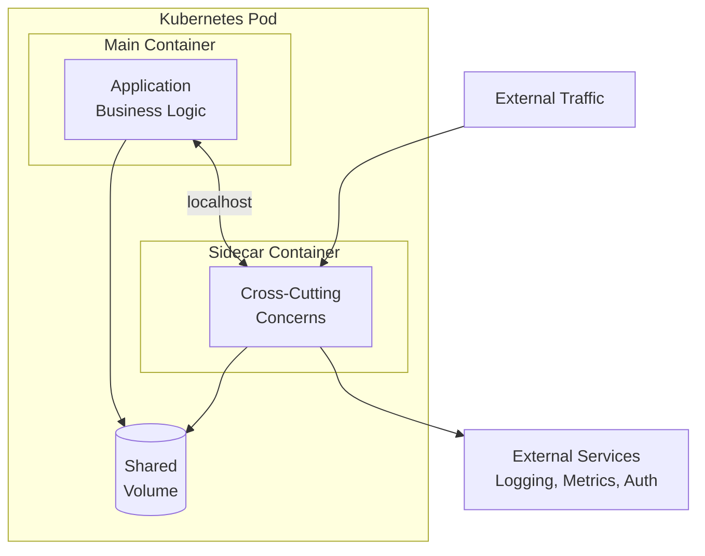
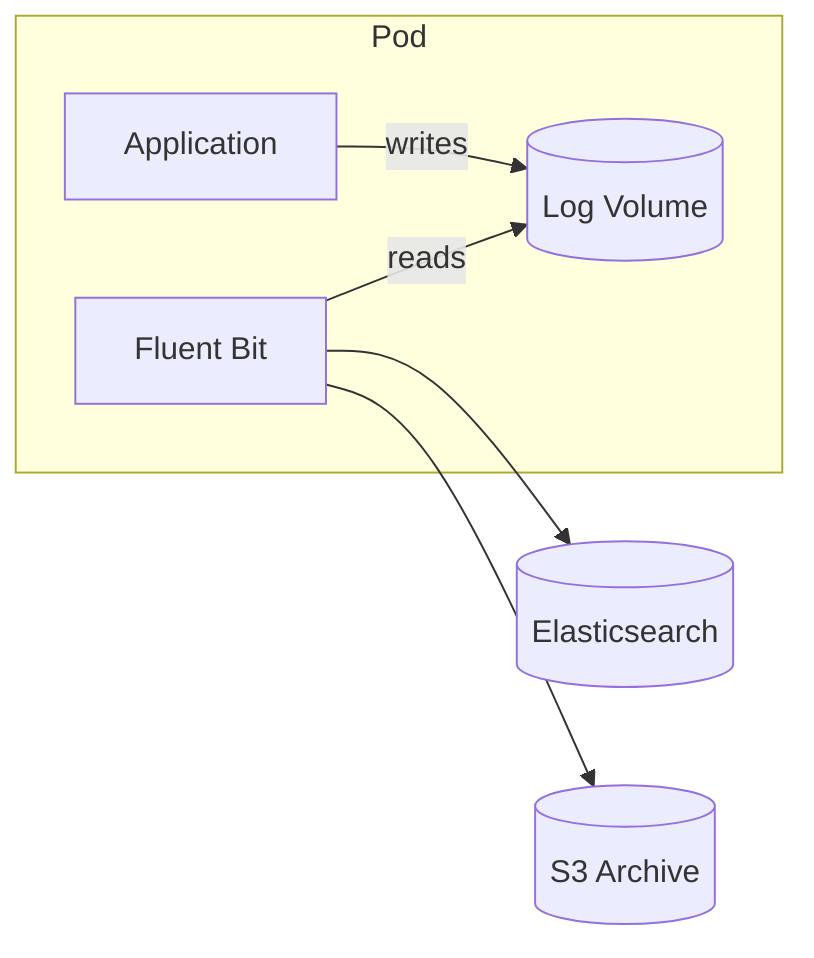
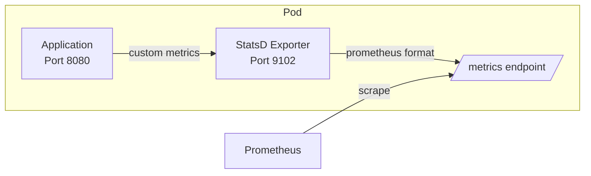
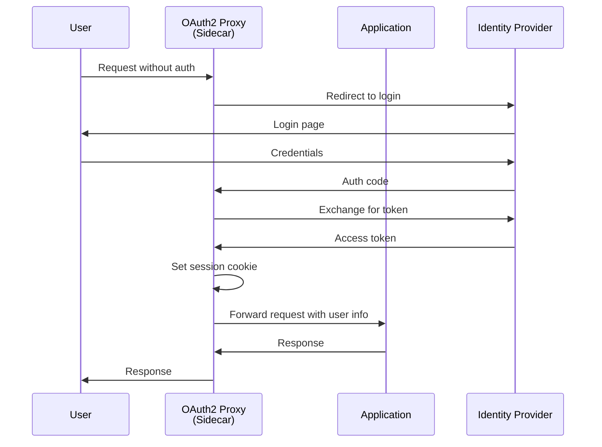
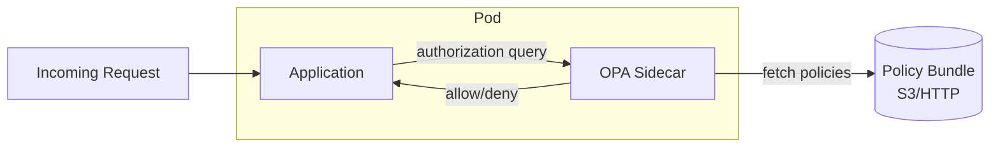
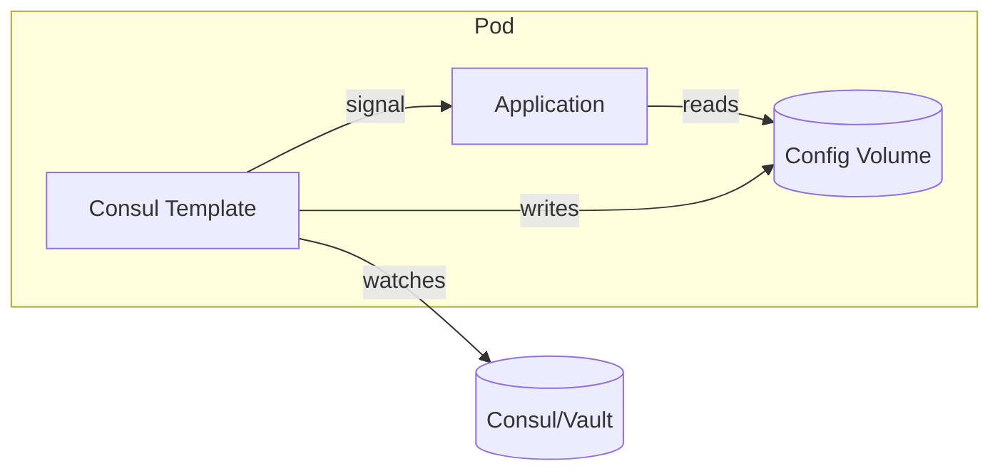
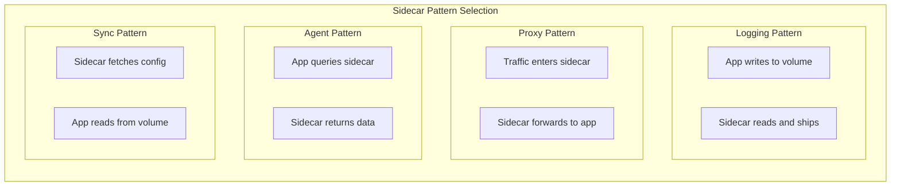

# How to Implement Sidecar Pattern for Cross-Cutting Concerns

Author: [nawazdhandala](https://github.com/nawazdhandala)

Tags: Sidecar Pattern, Microservices, Kubernetes, Architecture, DevOps, Observability, Security

Description: Learn how to implement the sidecar pattern to handle cross-cutting concerns like logging, monitoring, security, and configuration management in microservices architectures, with practical examples for Kubernetes deployments.

---

In microservices architectures, every service needs capabilities beyond its core business logic. Logging, metrics collection, authentication, rate limiting, and configuration management are concerns that cut across all services. Rather than embedding these capabilities in every application, the sidecar pattern offers an elegant solution: deploy a companion container that handles these responsibilities on behalf of your main application.

This guide explores the sidecar pattern in depth, covering common use cases, implementation strategies, and production-ready examples for Kubernetes environments.

## What Are Cross-Cutting Concerns?

Cross-cutting concerns are aspects of a system that affect multiple components but do not fit neatly into any single module. In traditional monolithic applications, these were often handled by frameworks or middleware. In distributed systems, we need a different approach.

Common cross-cutting concerns include:

| Concern | Description | Example |
|---------|-------------|---------|
| Logging | Capturing application events and errors | Shipping logs to Elasticsearch |
| Metrics | Collecting performance and business data | Prometheus metrics exposition |
| Tracing | Tracking requests across services | Distributed tracing with Jaeger |
| Authentication | Verifying user identity | OAuth2 proxy, JWT validation |
| Authorization | Controlling access to resources | Policy enforcement with OPA |
| Rate Limiting | Preventing resource exhaustion | Request throttling per client |
| Circuit Breaking | Handling downstream failures | Preventing cascade failures |
| Encryption | Securing data in transit | mTLS between services |
| Configuration | Managing runtime settings | Dynamic config from Consul |

Implementing each of these in every service creates duplication, inconsistency, and maintenance burden. The sidecar pattern centralizes these capabilities in a reusable component.

## Understanding the Sidecar Pattern

The sidecar pattern deploys a helper container alongside your main application container within the same Pod (in Kubernetes) or on the same host. Both containers share network and storage resources, allowing the sidecar to intercept, augment, or offload functionality from the main application.



### Key Characteristics

**Shared lifecycle**: The sidecar starts and stops with the main container. In Kubernetes 1.28+, native sidecars provide guaranteed startup and shutdown ordering.

**Shared network namespace**: Both containers use the same localhost, eliminating network overhead for inter-container communication.

**Shared storage**: Containers can share volumes for log files, configuration, or temporary data.

**Language agnostic**: The sidecar works with any application regardless of programming language or framework.

**Independent deployment**: You can update the sidecar without modifying the application code.

## Implementing Logging Sidecars

One of the most common uses of sidecars is log aggregation. Instead of requiring each application to implement log shipping, a sidecar reads logs from a shared volume and forwards them to your logging infrastructure.

### Architecture Overview



### Complete Logging Sidecar Implementation

The following configuration deploys an application with a Fluent Bit sidecar that ships logs to multiple destinations.

```yaml
# logging-sidecar-deployment.yaml
# Deployment with Fluent Bit sidecar for centralized logging
apiVersion: apps/v1
kind: Deployment
metadata:
  name: api-server
  labels:
    app: api-server
spec:
  replicas: 3
  selector:
    matchLabels:
      app: api-server
  template:
    metadata:
      labels:
        app: api-server
    spec:
      # Native sidecar support (Kubernetes 1.28+)
      # Ensures log collector starts before main app
      initContainers:
        - name: fluent-bit
          image: fluent/fluent-bit:2.2
          # restartPolicy: Always makes this a native sidecar
          restartPolicy: Always
          volumeMounts:
            - name: app-logs
              mountPath: /var/log/app
              readOnly: true
            - name: fluent-bit-config
              mountPath: /fluent-bit/etc
          resources:
            requests:
              memory: "64Mi"
              cpu: "50m"
            limits:
              memory: "128Mi"
              cpu: "100m"
          # Health check for the sidecar
          livenessProbe:
            httpGet:
              path: /api/v1/health
              port: 2020
            initialDelaySeconds: 10
            periodSeconds: 30

      containers:
        # Main application container
        - name: api
          image: mycompany/api-server:1.0.0
          ports:
            - containerPort: 8080
              name: http
          env:
            # Configure app to write logs to shared volume
            - name: LOG_OUTPUT
              value: "/var/log/app/api.log"
            - name: LOG_FORMAT
              value: "json"
          volumeMounts:
            - name: app-logs
              mountPath: /var/log/app
          resources:
            requests:
              memory: "256Mi"
              cpu: "200m"
            limits:
              memory: "512Mi"
              cpu: "500m"

      volumes:
        # Shared volume for log files
        - name: app-logs
          emptyDir:
            sizeLimit: 500Mi
        # Fluent Bit configuration
        - name: fluent-bit-config
          configMap:
            name: fluent-bit-config
---
# Fluent Bit configuration for multi-destination log shipping
apiVersion: v1
kind: ConfigMap
metadata:
  name: fluent-bit-config
data:
  fluent-bit.conf: |
    [SERVICE]
        # Flush logs every 5 seconds
        Flush         5
        # Run in foreground mode
        Daemon        Off
        # Set log level for Fluent Bit itself
        Log_Level     info
        # Enable HTTP server for health checks
        HTTP_Server   On
        HTTP_Listen   0.0.0.0
        HTTP_Port     2020
        # Parse JSON logs
        Parsers_File  parsers.conf

    [INPUT]
        # Tail application log files
        Name              tail
        Path              /var/log/app/*.log
        # Tag with filename for routing
        Tag               app.*
        # Start reading from the beginning on first run
        Read_from_Head    true
        # Refresh file list every 10 seconds
        Refresh_Interval  10
        # Skip long lines instead of failing
        Skip_Long_Lines   On
        # Use JSON parser
        Parser            json

    [FILTER]
        # Add Kubernetes metadata
        Name              record_modifier
        Match             *
        Record            hostname ${HOSTNAME}
        Record            environment production

    [OUTPUT]
        # Send to Elasticsearch
        Name              es
        Match             *
        Host              elasticsearch.logging.svc.cluster.local
        Port              9200
        Index             app-logs
        # Use date-based indices
        Logstash_Format   On
        Logstash_Prefix   app-logs
        # Retry on failure
        Retry_Limit       5

    [OUTPUT]
        # Archive to S3 for long-term storage
        Name              s3
        Match             *
        bucket            company-log-archive
        region            us-east-1
        # Organize by date
        s3_key_format     /logs/$TAG/%Y/%m/%d/%H_%M_%S.json
        total_file_size   50M
        upload_timeout    10m

  parsers.conf: |
    [PARSER]
        Name        json
        Format      json
        Time_Key    timestamp
        Time_Format %Y-%m-%dT%H:%M:%S.%L%z
```

## Implementing Metrics Collection Sidecars

Many applications expose metrics in proprietary formats or lack native Prometheus support. A metrics sidecar can translate, aggregate, or expose metrics in a standardized format.

### Metrics Exporter Architecture



### StatsD Exporter Sidecar

This configuration adds a StatsD exporter sidecar to collect metrics from applications that use the StatsD protocol.

```yaml
# metrics-sidecar-deployment.yaml
# Application with StatsD exporter sidecar for Prometheus metrics
apiVersion: apps/v1
kind: Deployment
metadata:
  name: payment-service
  labels:
    app: payment-service
spec:
  replicas: 2
  selector:
    matchLabels:
      app: payment-service
  template:
    metadata:
      labels:
        app: payment-service
      # Prometheus will automatically discover and scrape this pod
      annotations:
        prometheus.io/scrape: "true"
        prometheus.io/port: "9102"
        prometheus.io/path: "/metrics"
    spec:
      containers:
        # Main application sends metrics via StatsD protocol
        - name: payment-api
          image: mycompany/payment-service:2.1.0
          ports:
            - containerPort: 8080
              name: http
          env:
            # Application sends StatsD metrics to localhost
            - name: STATSD_HOST
              value: "localhost"
            - name: STATSD_PORT
              value: "9125"
            - name: STATSD_PREFIX
              value: "payment."
          resources:
            requests:
              memory: "256Mi"
              cpu: "200m"

        # StatsD exporter converts metrics to Prometheus format
        - name: statsd-exporter
          image: prom/statsd-exporter:v0.26.0
          ports:
            # UDP port for receiving StatsD metrics
            - containerPort: 9125
              protocol: UDP
              name: statsd-udp
            # TCP port for receiving StatsD metrics
            - containerPort: 9125
              protocol: TCP
              name: statsd-tcp
            # HTTP port for Prometheus to scrape
            - containerPort: 9102
              name: metrics
          args:
            # Custom mapping configuration
            - --statsd.mapping-config=/config/mapping.yml
            # Listen for StatsD on both UDP and TCP
            - --statsd.listen-udp=:9125
            - --statsd.listen-tcp=:9125
            # Expose metrics on port 9102
            - --web.listen-address=:9102
          volumeMounts:
            - name: statsd-config
              mountPath: /config
          resources:
            requests:
              memory: "32Mi"
              cpu: "25m"
            limits:
              memory: "64Mi"
              cpu: "50m"

      volumes:
        - name: statsd-config
          configMap:
            name: statsd-mapping
---
# StatsD to Prometheus mapping configuration
apiVersion: v1
kind: ConfigMap
metadata:
  name: statsd-mapping
data:
  mapping.yml: |
    mappings:
      # Map payment processing metrics
      - match: "payment.process.*"
        name: "payment_process_total"
        labels:
          status: "$1"

      # Map payment latency histogram
      - match: "payment.latency.*"
        name: "payment_latency_seconds"
        timer_type: histogram
        buckets: [0.01, 0.025, 0.05, 0.1, 0.25, 0.5, 1, 2.5, 5, 10]
        labels:
          payment_type: "$1"

      # Map error counts by type
      - match: "payment.error.*.*"
        name: "payment_errors_total"
        labels:
          error_type: "$1"
          payment_method: "$2"
```

## Implementing Authentication Sidecars

Authentication is a critical cross-cutting concern. An auth sidecar can handle token validation, session management, and identity verification without requiring changes to your application.

### OAuth2 Proxy Sidecar Architecture



### Complete Authentication Sidecar Implementation

This configuration protects an application with OAuth2 Proxy handling all authentication flows.

```yaml
# auth-sidecar-deployment.yaml
# Protected application with OAuth2 Proxy sidecar
apiVersion: apps/v1
kind: Deployment
metadata:
  name: internal-dashboard
  labels:
    app: internal-dashboard
spec:
  replicas: 2
  selector:
    matchLabels:
      app: internal-dashboard
  template:
    metadata:
      labels:
        app: internal-dashboard
    spec:
      containers:
        # Backend application - accessible only via OAuth2 Proxy
        - name: dashboard
          image: mycompany/internal-dashboard:1.0.0
          ports:
            - containerPort: 3000
              name: http
          env:
            # Application trusts headers from proxy
            - name: TRUST_PROXY
              value: "true"
            # User info passed via headers
            - name: USER_HEADER
              value: "X-Forwarded-User"
            - name: EMAIL_HEADER
              value: "X-Forwarded-Email"
          resources:
            requests:
              memory: "128Mi"
              cpu: "100m"

        # OAuth2 Proxy sidecar handles all authentication
        - name: oauth2-proxy
          image: quay.io/oauth2-proxy/oauth2-proxy:v7.5.1
          ports:
            - containerPort: 4180
              name: http
          args:
            # Proxy configuration
            - --http-address=0.0.0.0:4180
            - --upstream=http://127.0.0.1:3000

            # Provider configuration (Google example)
            - --provider=google
            - --email-domain=mycompany.com

            # Cookie settings
            - --cookie-secure=true
            - --cookie-httponly=true
            - --cookie-samesite=lax
            - --cookie-expire=168h
            - --cookie-refresh=1h

            # Pass user information to upstream
            - --pass-user-headers=true
            - --set-xauthrequest=true
            - --pass-access-token=true

            # Session storage using Redis
            - --session-store-type=redis
            - --redis-connection-url=redis://redis.auth.svc:6379

            # Skip authentication for health endpoints
            - --skip-auth-route=/health
            - --skip-auth-route=/ready

            # Logging
            - --request-logging=true
            - --auth-logging=true
          env:
            - name: OAUTH2_PROXY_CLIENT_ID
              valueFrom:
                secretKeyRef:
                  name: oauth2-credentials
                  key: client-id
            - name: OAUTH2_PROXY_CLIENT_SECRET
              valueFrom:
                secretKeyRef:
                  name: oauth2-credentials
                  key: client-secret
            - name: OAUTH2_PROXY_COOKIE_SECRET
              valueFrom:
                secretKeyRef:
                  name: oauth2-credentials
                  key: cookie-secret
          resources:
            requests:
              memory: "32Mi"
              cpu: "25m"
            limits:
              memory: "64Mi"
              cpu: "50m"
          livenessProbe:
            httpGet:
              path: /ping
              port: 4180
            initialDelaySeconds: 5
            periodSeconds: 10
          readinessProbe:
            httpGet:
              path: /ready
              port: 4180
            initialDelaySeconds: 5
            periodSeconds: 5
---
# Service routes traffic through the OAuth2 Proxy
apiVersion: v1
kind: Service
metadata:
  name: internal-dashboard
spec:
  selector:
    app: internal-dashboard
  ports:
    - name: http
      port: 80
      targetPort: 4180  # Routes to OAuth2 Proxy, not the app directly
---
# Credentials for OAuth2 Proxy
apiVersion: v1
kind: Secret
metadata:
  name: oauth2-credentials
type: Opaque
stringData:
  client-id: "your-google-client-id.apps.googleusercontent.com"
  client-secret: "your-google-client-secret"
  # Generate with: openssl rand -base64 32 | head -c 32
  cookie-secret: "your-32-byte-cookie-secret-here"
```

## Implementing Policy Enforcement Sidecars

Authorization policies can be complex and change frequently. An Open Policy Agent (OPA) sidecar allows you to externalize authorization decisions and update policies without redeploying applications.

### OPA Sidecar Architecture



### OPA Authorization Sidecar Implementation

This configuration adds OPA as an authorization sidecar that applications can query for access decisions.

```yaml
# opa-sidecar-deployment.yaml
# Application with OPA sidecar for policy-based authorization
apiVersion: apps/v1
kind: Deployment
metadata:
  name: api-gateway
  labels:
    app: api-gateway
spec:
  replicas: 3
  selector:
    matchLabels:
      app: api-gateway
  template:
    metadata:
      labels:
        app: api-gateway
    spec:
      containers:
        # Main API gateway queries OPA for authorization
        - name: gateway
          image: mycompany/api-gateway:3.0.0
          ports:
            - containerPort: 8080
              name: http
          env:
            # Application queries OPA on localhost
            - name: OPA_URL
              value: "http://localhost:8181/v1/data/authz/allow"
            - name: AUTHORIZATION_ENABLED
              value: "true"
          resources:
            requests:
              memory: "256Mi"
              cpu: "200m"

        # OPA sidecar for policy evaluation
        - name: opa
          image: openpolicyagent/opa:0.60.0
          ports:
            - containerPort: 8181
              name: http
          args:
            - "run"
            - "--server"
            - "--addr=0.0.0.0:8181"
            # Enable decision logging
            - "--set=decision_logs.console=true"
            # Configure bundle download
            - "--set=services.policy-server.url=http://policy-server.policies.svc:8080"
            - "--set=bundles.authz.service=policy-server"
            - "--set=bundles.authz.resource=/bundles/authz.tar.gz"
            - "--set=bundles.authz.polling.min_delay_seconds=10"
            - "--set=bundles.authz.polling.max_delay_seconds=30"
          resources:
            requests:
              memory: "64Mi"
              cpu: "50m"
            limits:
              memory: "128Mi"
              cpu: "100m"
          livenessProbe:
            httpGet:
              path: /health
              port: 8181
            initialDelaySeconds: 5
            periodSeconds: 10
          readinessProbe:
            httpGet:
              path: /health?bundle=true
              port: 8181
            initialDelaySeconds: 5
            periodSeconds: 5
---
# OPA policy ConfigMap (for development/testing)
apiVersion: v1
kind: ConfigMap
metadata:
  name: opa-policy
data:
  authz.rego: |
    package authz

    import future.keywords.if
    import future.keywords.in

    # Default deny
    default allow := false

    # Allow if user has required role for the resource
    allow if {
        required_role := role_requirements[input.resource]
        required_role in input.user.roles
    }

    # Define role requirements for resources
    role_requirements := {
        "/api/admin": "admin",
        "/api/users": "user",
        "/api/reports": "analyst",
        "/api/public": "anonymous"
    }

    # Always allow health checks
    allow if {
        input.path == "/health"
    }

    # Rate limit check
    rate_limit_ok if {
        input.request_count < 1000
    }
```

## Implementing Configuration Management Sidecars

Applications often need dynamic configuration that can change without redeployment. A configuration sidecar can watch external sources and update local configuration files.

### Consul Template Sidecar Architecture



### Configuration Sidecar Implementation

This configuration uses Consul Template to dynamically update application configuration based on values in Consul and secrets from Vault.

```yaml
# config-sidecar-deployment.yaml
# Application with Consul Template sidecar for dynamic configuration
apiVersion: apps/v1
kind: Deployment
metadata:
  name: backend-service
  labels:
    app: backend-service
spec:
  replicas: 2
  selector:
    matchLabels:
      app: backend-service
  template:
    metadata:
      labels:
        app: backend-service
    spec:
      # Consul Template runs as native sidecar
      initContainers:
        - name: consul-template
          image: hashicorp/consul-template:0.35.0
          restartPolicy: Always
          args:
            - "-config=/etc/consul-template/config.hcl"
          volumeMounts:
            - name: consul-template-config
              mountPath: /etc/consul-template
            - name: app-config
              mountPath: /config
            - name: vault-token
              mountPath: /vault
              readOnly: true
          env:
            - name: CONSUL_HTTP_ADDR
              value: "consul.consul.svc:8500"
            - name: VAULT_ADDR
              value: "http://vault.vault.svc:8200"
          resources:
            requests:
              memory: "32Mi"
              cpu: "25m"
            limits:
              memory: "64Mi"
              cpu: "50m"

      containers:
        # Main application reads configuration from shared volume
        - name: app
          image: mycompany/backend-service:2.0.0
          ports:
            - containerPort: 8080
              name: http
          env:
            # Path to configuration file
            - name: CONFIG_FILE
              value: "/config/app.yaml"
            # Watch for config changes
            - name: CONFIG_RELOAD_SIGNAL
              value: "SIGHUP"
          volumeMounts:
            - name: app-config
              mountPath: /config
              readOnly: true
          resources:
            requests:
              memory: "256Mi"
              cpu: "200m"
          # Reload config on SIGHUP
          lifecycle:
            preStop:
              exec:
                command: ["/bin/sh", "-c", "sleep 5"]

      volumes:
        - name: app-config
          emptyDir: {}
        - name: consul-template-config
          configMap:
            name: consul-template-config
        - name: vault-token
          secret:
            secretName: vault-token
---
# Consul Template configuration
apiVersion: v1
kind: ConfigMap
metadata:
  name: consul-template-config
data:
  config.hcl: |
    # Consul connection
    consul {
      address = "consul.consul.svc:8500"
    }

    # Vault connection for secrets
    vault {
      address = "http://vault.vault.svc:8200"
      token   = "/vault/token"
      renew_token = true
    }

    # Template for application configuration
    template {
      source      = "/etc/consul-template/app.yaml.tpl"
      destination = "/config/app.yaml"
      # Send SIGHUP to main process on config change
      command     = "pkill -HUP -f backend-service || true"
      # Render even if consul/vault unavailable (use cached)
      error_on_missing_key = false
    }

  app.yaml.tpl: |
    # Application configuration
    # Auto-generated by Consul Template - do not edit manually

    server:
      port: 8080
      host: "0.0.0.0"

    database:
      {{ with secret "database/creds/backend-service" }}
      host: "{{ key "backend-service/config/db_host" }}"
      port: {{ key "backend-service/config/db_port" }}
      username: "{{ .Data.username }}"
      password: "{{ .Data.password }}"
      {{ end }}
      pool_size: {{ keyOrDefault "backend-service/config/db_pool_size" "10" }}

    cache:
      redis_url: "{{ key "backend-service/config/redis_url" }}"
      ttl: {{ keyOrDefault "backend-service/config/cache_ttl" "3600" }}

    features:
      {{ range tree "backend-service/features/" }}
      {{ .Key }}: {{ .Value }}
      {{ end }}
```

## Implementing Distributed Tracing Sidecars

For applications that cannot be instrumented directly, a tracing sidecar can capture request metadata and forward it to your tracing infrastructure.

### Tracing Sidecar with Envoy

```yaml
# tracing-sidecar-deployment.yaml
# Application with Envoy sidecar for automatic tracing
apiVersion: apps/v1
kind: Deployment
metadata:
  name: legacy-service
  labels:
    app: legacy-service
spec:
  replicas: 2
  selector:
    matchLabels:
      app: legacy-service
  template:
    metadata:
      labels:
        app: legacy-service
    spec:
      containers:
        # Legacy application without tracing support
        - name: legacy-app
          image: mycompany/legacy-service:1.0.0
          ports:
            - containerPort: 8080
              name: http

        # Envoy sidecar adds distributed tracing
        - name: envoy
          image: envoyproxy/envoy:v1.28-latest
          ports:
            - containerPort: 80
              name: http
            - containerPort: 9901
              name: admin
          volumeMounts:
            - name: envoy-config
              mountPath: /etc/envoy
          args:
            - -c
            - /etc/envoy/envoy.yaml
          resources:
            requests:
              memory: "64Mi"
              cpu: "50m"
            limits:
              memory: "128Mi"
              cpu: "100m"

      volumes:
        - name: envoy-config
          configMap:
            name: envoy-tracing-config
---
# Envoy configuration with tracing
apiVersion: v1
kind: ConfigMap
metadata:
  name: envoy-tracing-config
data:
  envoy.yaml: |
    static_resources:
      listeners:
        - name: listener_0
          address:
            socket_address:
              address: 0.0.0.0
              port_value: 80
          filter_chains:
            - filters:
                - name: envoy.filters.network.http_connection_manager
                  typed_config:
                    "@type": type.googleapis.com/envoy.extensions.filters.network.http_connection_manager.v3.HttpConnectionManager
                    stat_prefix: ingress_http
                    # Enable tracing
                    tracing:
                      provider:
                        name: envoy.tracers.zipkin
                        typed_config:
                          "@type": type.googleapis.com/envoy.config.trace.v3.ZipkinConfig
                          collector_cluster: jaeger
                          collector_endpoint: "/api/v2/spans"
                          collector_endpoint_version: HTTP_JSON
                    route_config:
                      name: local_route
                      virtual_hosts:
                        - name: local_service
                          domains: ["*"]
                          routes:
                            - match:
                                prefix: "/"
                              route:
                                cluster: local_app
                              # Enable tracing for this route
                              decorator:
                                operation: legacy-service
                    http_filters:
                      - name: envoy.filters.http.router
                        typed_config:
                          "@type": type.googleapis.com/envoy.extensions.filters.http.router.v3.Router

      clusters:
        # Local application
        - name: local_app
          type: STATIC
          lb_policy: ROUND_ROBIN
          load_assignment:
            cluster_name: local_app
            endpoints:
              - lb_endpoints:
                  - endpoint:
                      address:
                        socket_address:
                          address: 127.0.0.1
                          port_value: 8080

        # Jaeger collector
        - name: jaeger
          type: STRICT_DNS
          lb_policy: ROUND_ROBIN
          load_assignment:
            cluster_name: jaeger
            endpoints:
              - lb_endpoints:
                  - endpoint:
                      address:
                        socket_address:
                          address: jaeger-collector.tracing.svc.cluster.local
                          port_value: 9411
```

## Best Practices for Sidecar Implementation

### Resource Management

Sidecars consume resources that can impact your main application. Follow these guidelines for resource allocation.

```yaml
# Sidecar resource guidelines
# Lightweight sidecars (logging, config sync)
resources:
  requests:
    memory: "32Mi"
    cpu: "25m"
  limits:
    memory: "64Mi"
    cpu: "50m"

# Medium sidecars (metrics exporters, simple proxies)
resources:
  requests:
    memory: "64Mi"
    cpu: "50m"
  limits:
    memory: "128Mi"
    cpu: "100m"

# Heavy sidecars (full proxies, policy engines)
resources:
  requests:
    memory: "128Mi"
    cpu: "100m"
  limits:
    memory: "256Mi"
    cpu: "200m"
```

### Health Checks

Always add health checks to sidecars to ensure Kubernetes can detect failures.

```yaml
# Health check configuration for sidecars
livenessProbe:
  httpGet:
    path: /health
    port: 8080
  initialDelaySeconds: 10
  periodSeconds: 15
  timeoutSeconds: 5
  failureThreshold: 3

readinessProbe:
  httpGet:
    path: /ready
    port: 8080
  initialDelaySeconds: 5
  periodSeconds: 5
  timeoutSeconds: 3
  failureThreshold: 3
```

### Graceful Shutdown

Configure proper shutdown handling to prevent data loss.

```yaml
# Graceful shutdown configuration
spec:
  terminationGracePeriodSeconds: 60
  containers:
    - name: sidecar
      lifecycle:
        preStop:
          exec:
            # Allow time for in-flight requests
            command:
              - /bin/sh
              - -c
              - |
                # Signal sidecar to stop accepting requests
                kill -SIGTERM 1
                # Wait for in-flight requests to complete
                sleep 15
```

### Security Considerations

Apply security best practices to sidecar containers.

```yaml
# Security context for sidecars
securityContext:
  # Run as non-root user
  runAsNonRoot: true
  runAsUser: 1000
  runAsGroup: 1000
  # Read-only root filesystem
  readOnlyRootFilesystem: true
  # Drop all capabilities
  capabilities:
    drop:
      - ALL
  # Prevent privilege escalation
  allowPrivilegeEscalation: false
```

## Comparing Sidecar Patterns

Different cross-cutting concerns call for different sidecar approaches.



| Pattern | Communication | Use Case | Examples |
|---------|--------------|----------|----------|
| Volume Sharing | Shared filesystem | Logging, file-based config | Fluent Bit, Git-sync |
| Localhost Proxy | HTTP/gRPC on localhost | Traffic management, auth | Envoy, OAuth2 Proxy |
| Query Agent | App queries sidecar API | Policy decisions, secrets | OPA, Vault Agent |
| Signal Based | SIGHUP/SIGUSR1 | Config reload triggers | Consul Template |

## Monitoring Your Sidecars

Track sidecar health and performance alongside your applications.

```yaml
# PodMonitor for sidecar metrics
apiVersion: monitoring.coreos.com/v1
kind: PodMonitor
metadata:
  name: sidecar-metrics
  labels:
    release: prometheus
spec:
  selector:
    matchLabels:
      has-sidecar: "true"
  podMetricsEndpoints:
    # Main application metrics
    - port: metrics
      path: /metrics
      interval: 30s
    # Sidecar-specific metrics
    - port: sidecar-metrics
      path: /metrics
      interval: 30s
```

---

The sidecar pattern transforms how we handle cross-cutting concerns in microservices. By moving logging, metrics, authentication, authorization, and configuration management into dedicated containers, we achieve better separation of concerns, easier updates, and consistent behavior across services.

Start with the simplest sidecar that solves your immediate need. A logging sidecar takes minutes to add and provides immediate value. As your needs grow, you can add metrics exporters, auth proxies, and policy engines. The modular nature of sidecars means you can evolve your infrastructure without touching application code.

For production deployments, always consider resource allocation, health checks, graceful shutdown, and security contexts. Native sidecar support in Kubernetes 1.28+ simplifies lifecycle management significantly. Whether you build custom sidecars or use established tools like Envoy, Fluent Bit, or OAuth2 Proxy, the pattern remains the same: augment your applications with focused, reusable components that handle the concerns that cut across your entire system.
