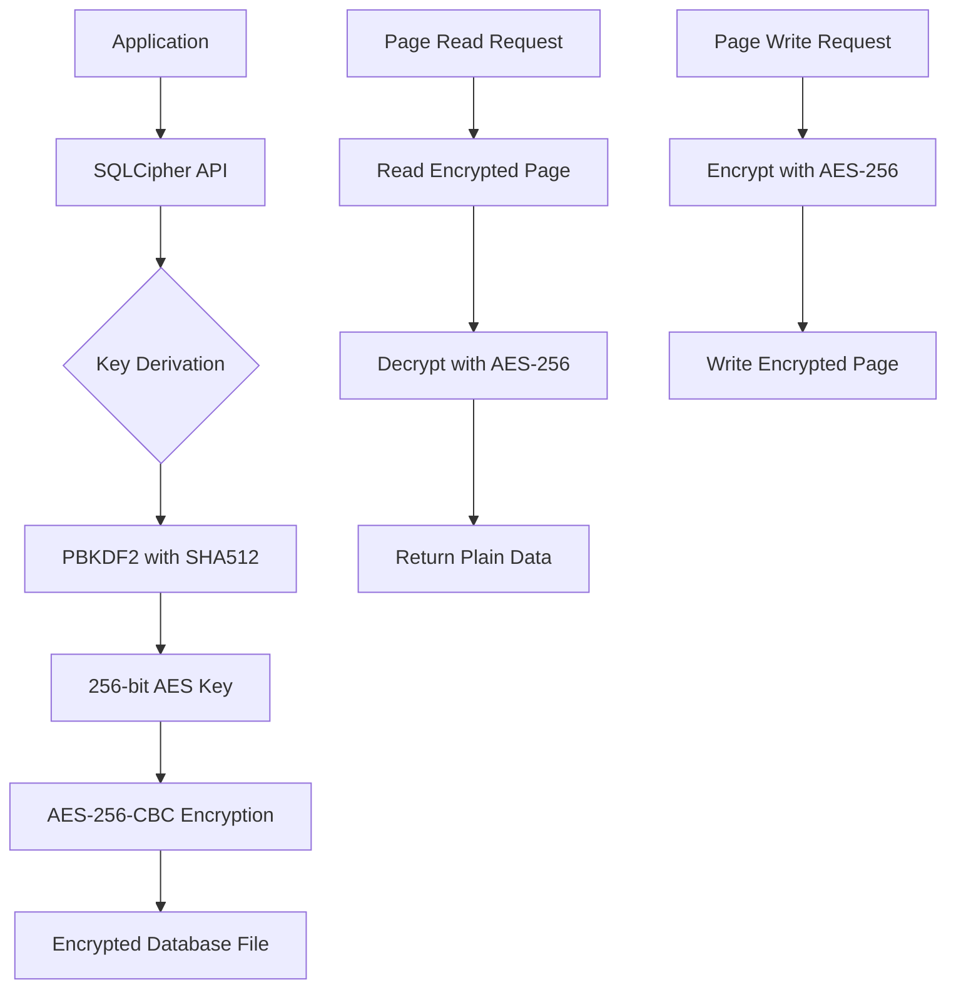
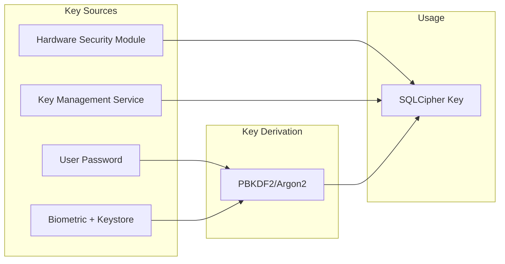
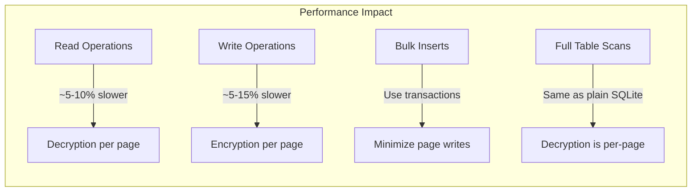

# How to Implement Encryption with SQLCipher

Author: [nawazdhandala](https://github.com/nawazdhandala)

Tags: SQLite, SQLCipher, Encryption, Database Security, Mobile Development, Data Protection

Description: Learn how to implement transparent database encryption with SQLCipher. This guide covers installation, key management, migration strategies, and best practices for securing SQLite databases in your applications.

---

SQLite is an excellent embedded database, but it stores data in plain text by default. Anyone with file system access can read your database contents. SQLCipher solves this problem by providing transparent, full-database encryption using AES-256. Your queries work exactly the same, but the underlying data is encrypted at rest.

## Why Encrypt Your SQLite Database?

| Threat | Without Encryption | With SQLCipher |
|--------|-------------------|----------------|
| Device theft | Data exposed | Data unreadable |
| Backup access | Plain text files | Encrypted files |
| File system access | Direct SQL queries | Requires key |
| Forensic analysis | Complete data recovery | No data leakage |

## How SQLCipher Works

SQLCipher encrypts the entire database file, including metadata, tables, indexes, and journal files. It uses industry-standard cryptographic primitives.



## Installation

### Python with sqlcipher3

Install the sqlcipher3 package which provides Python bindings for SQLCipher.

```bash
# On macOS, install SQLCipher first
brew install sqlcipher

# Install Python bindings
pip install sqlcipher3
```

### Node.js with better-sqlite3-sqlcipher

For Node.js applications, use the better-sqlite3 fork with SQLCipher support.

```bash
# Install the SQLCipher-enabled version
npm install @journeyapps/sqlcipher
```

### Android with SQLCipher

Add the SQLCipher dependency to your Android project.

```groovy
// build.gradle (app level)
dependencies {
    implementation 'net.zetetic:sqlcipher-android:4.5.6@aar'
    implementation 'androidx.sqlite:sqlite:2.4.0'
}
```

### iOS with SQLCipher

Add SQLCipher to your iOS project using CocoaPods or Swift Package Manager.

```ruby
# Podfile
pod 'SQLCipher', '~> 4.5'
```

## Basic Usage

### Python Example

This example demonstrates creating an encrypted database and performing basic operations.

```python
import sqlcipher3

# Connect to the database (creates it if it does not exist)
conn = sqlcipher3.connect('secure_app.db')
cursor = conn.cursor()

# Set the encryption key - this must be done before any other operations
# Use a strong, randomly generated key in production
cursor.execute("PRAGMA key = 'your-secure-encryption-key-here'")

# Verify the key works by checking the database schema
try:
    cursor.execute("SELECT count(*) FROM sqlite_master")
    print("Database unlocked successfully")
except sqlcipher3.DatabaseError:
    print("Incorrect encryption key")
    conn.close()
    exit(1)

# Create a table for sensitive user data
cursor.execute('''
    CREATE TABLE IF NOT EXISTS users (
        id INTEGER PRIMARY KEY AUTOINCREMENT,
        email TEXT NOT NULL UNIQUE,
        password_hash TEXT NOT NULL,
        ssn_encrypted TEXT,
        created_at TIMESTAMP DEFAULT CURRENT_TIMESTAMP
    )
''')

# Insert some data - it will be encrypted automatically
cursor.execute('''
    INSERT INTO users (email, password_hash, ssn_encrypted)
    VALUES (?, ?, ?)
''', ('user@example.com', 'hashed_password_here', 'encrypted_ssn_value'))

conn.commit()

# Query data - decryption is transparent
cursor.execute("SELECT email, created_at FROM users")
for row in cursor.fetchall():
    print(f"User: {row[0]}, Created: {row[1]}")

conn.close()
```

### Node.js Example

Using SQLCipher with Node.js for server-side applications or Electron apps.

```javascript
const Database = require('@journeyapps/sqlcipher').verbose();

// Open an encrypted database connection
const db = new Database('secure_app.db');

// Set the encryption key before any operations
db.run("PRAGMA key = 'your-secure-encryption-key-here'");

// Configure SQLCipher settings for better security
// Use SQLCipher 4 defaults with 256,000 PBKDF2 iterations
db.run("PRAGMA cipher_compatibility = 4");

// Verify the database is accessible
db.get("SELECT count(*) as count FROM sqlite_master", (err, row) => {
    if (err) {
        console.error('Failed to open database - check encryption key');
        process.exit(1);
    }
    console.log('Database unlocked successfully');
});

// Create table for sensitive data
db.run(`
    CREATE TABLE IF NOT EXISTS api_keys (
        id INTEGER PRIMARY KEY AUTOINCREMENT,
        service_name TEXT NOT NULL,
        api_key TEXT NOT NULL,
        created_at TEXT DEFAULT (datetime('now'))
    )
`);

// Insert encrypted data using parameterized queries
const stmt = db.prepare("INSERT INTO api_keys (service_name, api_key) VALUES (?, ?)");
stmt.run('stripe', 'sk_live_xxx...');
stmt.run('twilio', 'AC_xxx...');
stmt.finalize();

// Query the data
db.all("SELECT service_name, created_at FROM api_keys", (err, rows) => {
    rows.forEach(row => {
        console.log(`Service: ${row.service_name}, Added: ${row.created_at}`);
    });
});

// Always close the database connection
db.close((err) => {
    if (err) console.error('Error closing database:', err);
});
```

### Android Example

Implementing SQLCipher in an Android application with Room.

```kotlin
import net.sqlcipher.database.SQLiteDatabase
import net.sqlcipher.database.SupportFactory
import androidx.room.Room

class SecureDatabase {
    companion object {
        private var instance: AppDatabase? = null

        fun getInstance(context: Context, passphrase: ByteArray): AppDatabase {
            return instance ?: synchronized(this) {
                // Initialize SQLCipher libraries
                SQLiteDatabase.loadLibs(context)

                // Create the SupportFactory with the encryption key
                val factory = SupportFactory(passphrase)

                // Build the Room database with SQLCipher
                val db = Room.databaseBuilder(
                    context.applicationContext,
                    AppDatabase::class.java,
                    "secure_app.db"
                )
                .openHelperFactory(factory)
                .build()

                instance = db
                db
            }
        }
    }
}

// Define your Room entities as usual
@Entity(tableName = "credentials")
data class Credential(
    @PrimaryKey(autoGenerate = true) val id: Long = 0,
    @ColumnInfo(name = "service") val service: String,
    @ColumnInfo(name = "username") val username: String,
    @ColumnInfo(name = "password") val password: String
)

// Define your DAO
@Dao
interface CredentialDao {
    @Query("SELECT * FROM credentials")
    fun getAll(): List<Credential>

    @Insert
    fun insert(credential: Credential)

    @Delete
    fun delete(credential: Credential)
}

// Usage in an Activity or ViewModel
class MainActivity : AppCompatActivity() {
    private lateinit var db: AppDatabase

    override fun onCreate(savedInstanceState: Bundle?) {
        super.onCreate(savedInstanceState)

        // Derive the passphrase from user input or secure storage
        val passphrase = getPassphraseFromSecureSource()

        // Get the encrypted database instance
        db = SecureDatabase.getInstance(this, passphrase)

        // Use the database normally - encryption is transparent
        val credentials = db.credentialDao().getAll()
    }

    private fun getPassphraseFromSecureSource(): ByteArray {
        // In production, retrieve from Android Keystore or user input
        // Never hardcode the passphrase
        return "user-provided-passphrase".toByteArray()
    }
}
```

## Key Management Best Practices

Proper key management is critical. A strong encryption algorithm is worthless if the key is easily compromised.



### Deriving Keys from User Passwords

When using user-provided passwords, always use a strong key derivation function.

```python
import sqlcipher3
import hashlib
import os

def derive_key(password: str, salt: bytes) -> str:
    """
    Derive a database encryption key from a user password.
    Uses PBKDF2 with SHA-256 and 600,000 iterations.
    """
    # Use PBKDF2 to derive a key from the password
    # 600,000 iterations is the OWASP recommendation for 2024
    key = hashlib.pbkdf2_hmac(
        'sha256',
        password.encode('utf-8'),
        salt,
        iterations=600000,
        dklen=32  # 256 bits
    )
    # Return as hex string for SQLCipher
    return key.hex()

def create_encrypted_database(db_path: str, password: str):
    """Create a new encrypted database with a derived key."""
    # Generate a random salt and store it alongside the database
    salt = os.urandom(32)
    salt_path = db_path + '.salt'

    with open(salt_path, 'wb') as f:
        f.write(salt)

    # Derive the encryption key
    key = derive_key(password, salt)

    # Create the encrypted database
    conn = sqlcipher3.connect(db_path)
    cursor = conn.cursor()

    # Set the derived key
    cursor.execute(f"PRAGMA key = \"x'{key}'\"")

    # Configure cipher settings
    cursor.execute("PRAGMA cipher_page_size = 4096")
    cursor.execute("PRAGMA kdf_iter = 256000")

    return conn

def open_encrypted_database(db_path: str, password: str):
    """Open an existing encrypted database."""
    # Read the stored salt
    salt_path = db_path + '.salt'
    with open(salt_path, 'rb') as f:
        salt = f.read()

    # Derive the key using the same parameters
    key = derive_key(password, salt)

    conn = sqlcipher3.connect(db_path)
    cursor = conn.cursor()
    cursor.execute(f"PRAGMA key = \"x'{key}'\"")

    # Verify the key is correct
    try:
        cursor.execute("SELECT count(*) FROM sqlite_master")
        return conn
    except sqlcipher3.DatabaseError:
        conn.close()
        raise ValueError("Invalid password")
```

### Using Environment Variables (Server Applications)

For server applications, store keys in environment variables or secret management systems.

```python
import os
import sqlcipher3

def get_database_connection():
    """
    Get a database connection using a key from environment variables.
    Never hardcode encryption keys in source code.
    """
    # Retrieve the key from environment variable
    db_key = os.environ.get('DATABASE_ENCRYPTION_KEY')

    if not db_key:
        raise EnvironmentError(
            "DATABASE_ENCRYPTION_KEY environment variable is not set"
        )

    # Validate key length (should be 64 hex characters for 256-bit key)
    if len(db_key) != 64:
        raise ValueError(
            "DATABASE_ENCRYPTION_KEY must be a 64-character hex string"
        )

    conn = sqlcipher3.connect('production.db')
    cursor = conn.cursor()

    # Use raw key format with 'x' prefix for hex keys
    cursor.execute(f"PRAGMA key = \"x'{db_key}'\"")

    return conn

# Generate a secure random key for initial setup
def generate_encryption_key():
    """Generate a cryptographically secure encryption key."""
    import secrets
    key = secrets.token_hex(32)  # 256 bits as hex
    print(f"Generated key: {key}")
    print("Store this securely and set as DATABASE_ENCRYPTION_KEY")
    return key
```

## Migrating an Existing Plain SQLite Database

If you have an existing unencrypted SQLite database, you can migrate it to SQLCipher.

```python
import sqlcipher3
import shutil
import os

def migrate_to_encrypted(plain_db_path: str, encrypted_db_path: str, key: str):
    """
    Migrate a plain SQLite database to an encrypted SQLCipher database.
    This creates a new encrypted copy - the original is not modified.
    """
    # Create a backup of the original database first
    backup_path = plain_db_path + '.backup'
    shutil.copy2(plain_db_path, backup_path)
    print(f"Created backup at {backup_path}")

    # Open the plain database
    conn = sqlcipher3.connect(plain_db_path)
    cursor = conn.cursor()

    # Attach a new encrypted database
    cursor.execute(f"ATTACH DATABASE '{encrypted_db_path}' AS encrypted KEY '{key}'")

    # Configure the encrypted database settings
    cursor.execute("PRAGMA encrypted.cipher_page_size = 4096")

    # Export all data to the encrypted database
    cursor.execute("SELECT sql FROM sqlite_master WHERE type='table'")
    tables = cursor.fetchall()

    for (sql,) in tables:
        if sql:
            # Recreate table in encrypted database
            encrypted_sql = sql.replace('CREATE TABLE', 'CREATE TABLE encrypted.')
            cursor.execute(encrypted_sql)

    # Copy data from each table
    cursor.execute("SELECT name FROM sqlite_master WHERE type='table'")
    table_names = cursor.fetchall()

    for (table_name,) in table_names:
        if not table_name.startswith('sqlite_'):
            print(f"Migrating table: {table_name}")
            cursor.execute(f"INSERT INTO encrypted.{table_name} SELECT * FROM {table_name}")

    conn.commit()

    # Detach and close
    cursor.execute("DETACH DATABASE encrypted")
    conn.close()

    print(f"Migration complete. Encrypted database: {encrypted_db_path}")
    print(f"Original database preserved at: {plain_db_path}")
    print(f"Backup created at: {backup_path}")

    # Verify the encrypted database
    verify_encrypted_database(encrypted_db_path, key)

def verify_encrypted_database(db_path: str, key: str):
    """Verify that an encrypted database is accessible and intact."""
    conn = sqlcipher3.connect(db_path)
    cursor = conn.cursor()
    cursor.execute(f"PRAGMA key = '{key}'")

    # Run integrity check
    cursor.execute("PRAGMA integrity_check")
    result = cursor.fetchone()

    if result[0] == 'ok':
        print("Integrity check passed")
    else:
        print(f"Integrity check failed: {result[0]}")

    # Count tables
    cursor.execute("SELECT count(*) FROM sqlite_master WHERE type='table'")
    table_count = cursor.fetchone()[0]
    print(f"Database contains {table_count} tables")

    conn.close()
```

## Changing the Encryption Key

Periodically rotating encryption keys is a security best practice. SQLCipher supports key rotation without re-encrypting the entire database.

```python
import sqlcipher3

def rotate_encryption_key(db_path: str, old_key: str, new_key: str):
    """
    Rotate the encryption key on an existing database.
    This re-encrypts the database with the new key.
    """
    conn = sqlcipher3.connect(db_path)
    cursor = conn.cursor()

    # Authenticate with the current key
    cursor.execute(f"PRAGMA key = '{old_key}'")

    # Verify we can access the database
    try:
        cursor.execute("SELECT count(*) FROM sqlite_master")
    except sqlcipher3.DatabaseError:
        conn.close()
        raise ValueError("Current encryption key is incorrect")

    # Change to the new key
    # This re-encrypts the entire database
    cursor.execute(f"PRAGMA rekey = '{new_key}'")

    # Verify the new key works
    conn.close()

    # Reconnect with new key to verify
    conn = sqlcipher3.connect(db_path)
    cursor = conn.cursor()
    cursor.execute(f"PRAGMA key = '{new_key}'")

    try:
        cursor.execute("SELECT count(*) FROM sqlite_master")
        print("Key rotation successful")
    except sqlcipher3.DatabaseError:
        raise RuntimeError("Key rotation failed - database may be corrupted")
    finally:
        conn.close()

def remove_encryption(db_path: str, key: str, plain_db_path: str):
    """
    Remove encryption from a database (export to plain SQLite).
    Use this for debugging or if encryption is no longer needed.
    """
    conn = sqlcipher3.connect(db_path)
    cursor = conn.cursor()
    cursor.execute(f"PRAGMA key = '{key}'")

    # Attach a plain database (empty key means no encryption)
    cursor.execute(f"ATTACH DATABASE '{plain_db_path}' AS plaintext KEY ''")

    # Export schema and data
    cursor.execute("SELECT sql FROM sqlite_master WHERE type='table'")
    for (sql,) in cursor.fetchall():
        if sql:
            cursor.execute(sql.replace('CREATE TABLE', 'CREATE TABLE plaintext.'))

    cursor.execute("SELECT name FROM sqlite_master WHERE type='table'")
    for (table,) in cursor.fetchall():
        if not table.startswith('sqlite_'):
            cursor.execute(f"INSERT INTO plaintext.{table} SELECT * FROM {table}")

    conn.commit()
    cursor.execute("DETACH DATABASE plaintext")
    conn.close()

    print(f"Decrypted database exported to: {plain_db_path}")
```

## Performance Considerations

Encryption adds overhead. Here is how different operations are affected.



### Optimizing SQLCipher Performance

Configure SQLCipher for optimal performance based on your use case.

```python
import sqlcipher3

def configure_for_performance(cursor):
    """
    Configure SQLCipher settings for better performance.
    Trade-offs between security and speed can be tuned.
    """
    # Use a larger page size for better throughput
    # Must be set before creating tables
    cursor.execute("PRAGMA cipher_page_size = 4096")

    # Reduce KDF iterations for faster key derivation
    # Lower values are less secure but faster
    # Default is 256,000 - reduce only if startup time is critical
    cursor.execute("PRAGMA kdf_iter = 64000")

    # Use memory-mapped I/O for faster reads
    # Set to 0 to disable (more secure but slower)
    cursor.execute("PRAGMA mmap_size = 268435456")  # 256MB

    # Increase cache size for frequently accessed data
    # Negative value means KB, positive means pages
    cursor.execute("PRAGMA cache_size = -64000")  # 64MB

    # Use WAL mode for better concurrency
    cursor.execute("PRAGMA journal_mode = WAL")

    # Synchronous mode affects durability vs performance
    # NORMAL is a good balance for most applications
    cursor.execute("PRAGMA synchronous = NORMAL")

def bulk_insert_optimized(conn, data_rows):
    """
    Perform bulk inserts efficiently with SQLCipher.
    Wrapping in a transaction minimizes encryption overhead.
    """
    cursor = conn.cursor()

    # Disable auto-commit for bulk operations
    cursor.execute("BEGIN TRANSACTION")

    try:
        # Prepare the statement once
        cursor.executemany(
            "INSERT INTO records (field1, field2, field3) VALUES (?, ?, ?)",
            data_rows
        )

        cursor.execute("COMMIT")
        print(f"Inserted {len(data_rows)} rows efficiently")
    except Exception as e:
        cursor.execute("ROLLBACK")
        raise e
```

## Testing Encrypted Databases

Ensure your encryption implementation works correctly with proper tests.

```python
import sqlcipher3
import os
import tempfile
import unittest

class TestSQLCipherEncryption(unittest.TestCase):
    def setUp(self):
        """Create a temporary encrypted database for testing."""
        self.temp_dir = tempfile.mkdtemp()
        self.db_path = os.path.join(self.temp_dir, 'test.db')
        self.encryption_key = 'test-encryption-key-123'

        # Create encrypted database
        self.conn = sqlcipher3.connect(self.db_path)
        self.cursor = self.conn.cursor()
        self.cursor.execute(f"PRAGMA key = '{self.encryption_key}'")

        # Create test table
        self.cursor.execute('''
            CREATE TABLE test_data (
                id INTEGER PRIMARY KEY,
                sensitive_value TEXT
            )
        ''')
        self.conn.commit()

    def tearDown(self):
        """Clean up test database."""
        self.conn.close()
        os.remove(self.db_path)
        os.rmdir(self.temp_dir)

    def test_data_is_encrypted_on_disk(self):
        """Verify that data cannot be read without the encryption key."""
        # Insert sensitive data
        self.cursor.execute(
            "INSERT INTO test_data (sensitive_value) VALUES (?)",
            ('secret-password-123',)
        )
        self.conn.commit()
        self.conn.close()

        # Try to read the raw file
        with open(self.db_path, 'rb') as f:
            raw_content = f.read()

        # The sensitive value should not appear in the raw file
        self.assertNotIn(b'secret-password-123', raw_content)

        # Reopen for tearDown
        self.conn = sqlcipher3.connect(self.db_path)
        self.cursor = self.conn.cursor()
        self.cursor.execute(f"PRAGMA key = '{self.encryption_key}'")

    def test_wrong_key_fails(self):
        """Verify that the wrong key cannot access the database."""
        self.conn.close()

        # Try to open with wrong key
        wrong_conn = sqlcipher3.connect(self.db_path)
        wrong_cursor = wrong_conn.cursor()
        wrong_cursor.execute("PRAGMA key = 'wrong-key'")

        # Query should fail
        with self.assertRaises(sqlcipher3.DatabaseError):
            wrong_cursor.execute("SELECT * FROM test_data")

        wrong_conn.close()

        # Reopen with correct key for tearDown
        self.conn = sqlcipher3.connect(self.db_path)
        self.cursor = self.conn.cursor()
        self.cursor.execute(f"PRAGMA key = '{self.encryption_key}'")

    def test_correct_key_works(self):
        """Verify that the correct key can access the database."""
        # Insert and retrieve data
        self.cursor.execute(
            "INSERT INTO test_data (sensitive_value) VALUES (?)",
            ('my-secret-data',)
        )
        self.conn.commit()

        self.cursor.execute("SELECT sensitive_value FROM test_data")
        result = self.cursor.fetchone()

        self.assertEqual(result[0], 'my-secret-data')

if __name__ == '__main__':
    unittest.main()
```

## Common Pitfalls and Solutions

### Pitfall 1: Key in Source Code

Never hardcode encryption keys in your source code. They will end up in version control.

```python
# BAD - Never do this
conn.execute("PRAGMA key = 'hardcoded-secret-key'")

# GOOD - Use environment variables or secure storage
import os
key = os.environ.get('DB_ENCRYPTION_KEY')
conn.execute(f"PRAGMA key = '{key}'")
```

### Pitfall 2: Forgetting to Set the Key

The key must be set immediately after opening the connection, before any other operations.

```python
# BAD - Query before setting key
conn = sqlcipher3.connect('data.db')
cursor = conn.cursor()
cursor.execute("SELECT * FROM users")  # This will fail or read garbage
cursor.execute("PRAGMA key = 'my-key'")

# GOOD - Set key first
conn = sqlcipher3.connect('data.db')
cursor = conn.cursor()
cursor.execute("PRAGMA key = 'my-key'")  # Always first
cursor.execute("SELECT * FROM users")    # Now it works
```

### Pitfall 3: Version Compatibility

SQLCipher versions may use different default settings. Always specify compatibility mode.

```python
# Set compatibility mode for consistent behavior across versions
cursor.execute("PRAGMA key = 'my-key'")
cursor.execute("PRAGMA cipher_compatibility = 4")  # Use SQLCipher 4 defaults
```

## Summary

| Aspect | Recommendation |
|--------|---------------|
| **Key Length** | 256 bits (64 hex characters) |
| **Key Storage** | Environment variables, HSM, or Keystore |
| **Key Derivation** | PBKDF2 with 256,000+ iterations |
| **Page Size** | 4096 bytes for most applications |
| **Journal Mode** | WAL for better concurrency |
| **Testing** | Verify data is unreadable without key |

SQLCipher provides transparent encryption for SQLite databases with minimal code changes. The key to success is proper key management - generate strong keys, store them securely, and never hardcode them in your application.

---

Protecting sensitive data at rest is essential for modern applications. If you need to monitor the health and performance of your applications that use encrypted databases, consider [OneUptime](https://oneuptime.com). OneUptime provides comprehensive monitoring, alerting, and incident management to ensure your secure applications stay reliable and performant.
