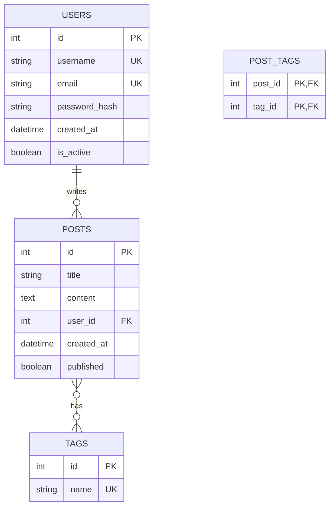
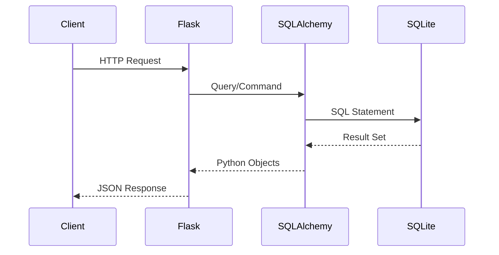

# How to Use SQLite with Flask

Author: [nawazdhandala](https://www.github.com/nawazdhandala)

Tags: Flask, Python, SQLite, Database, Web Development, SQL, Backend

Description: Learn how to integrate SQLite with Flask applications. This comprehensive guide covers database setup, model definition, CRUD operations, query optimization, and production best practices.

---

> SQLite is a lightweight, serverless database that ships with Python. For Flask applications that need simple data persistence without the complexity of setting up a separate database server, SQLite is an excellent choice. This guide walks you through everything from basic setup to production deployment.

SQLite works well for small to medium applications, prototypes, and development environments. When combined with Flask, it provides a powerful yet simple stack for building web applications quickly.

---

## Why Use SQLite with Flask?

| Advantage | Description |
|-----------|-------------|
| **Zero Configuration** | No server setup required |
| **Portable** | Database is a single file |
| **Python Built-in** | The sqlite3 module comes with Python |
| **Fast Development** | Get started in minutes |
| **Testing Friendly** | Easy to create and destroy test databases |

### When to Use SQLite

SQLite is ideal for:
- Development and prototyping
- Small to medium web applications
- Single-user or low-concurrency applications
- Embedded applications
- Testing and CI/CD pipelines

---

## Project Structure

Before diving into code, here is how a typical Flask project with SQLite looks:

```
flask-sqlite-app/
    app/
        __init__.py
        models.py
        routes.py
        database.py
    migrations/
    instance/
        app.db
    config.py
    run.py
    requirements.txt
```

---

## Basic Setup

### Installing Dependencies

First, install Flask and Flask-SQLAlchemy. Flask-SQLAlchemy provides a higher-level abstraction over raw SQLite that makes database operations more Pythonic.

```bash
pip install flask flask-sqlalchemy
```

### Configuration

Create a configuration file that tells Flask where to store the SQLite database file. The SQLALCHEMY_DATABASE_URI uses the sqlite:/// prefix followed by the path to the database file.

```python
# config.py
# Flask configuration with SQLite database settings
import os

# Get the base directory of the application
basedir = os.path.abspath(os.path.dirname(__file__))

class Config:
    # Secret key for session management and CSRF protection
    SECRET_KEY = os.environ.get('SECRET_KEY') or 'dev-secret-key-change-in-production'

    # SQLite database URI - stores the database file in the instance folder
    # The three slashes indicate a relative path from the current directory
    SQLALCHEMY_DATABASE_URI = os.environ.get('DATABASE_URL') or \
        'sqlite:///' + os.path.join(basedir, 'instance', 'app.db')

    # Disable modification tracking to save memory
    SQLALCHEMY_TRACK_MODIFICATIONS = False
```

### Database Initialization

Set up the database connection and provide a helper function to initialize the database tables. The SQLAlchemy object acts as the interface between Flask and the database.

```python
# app/database.py
# Database setup and initialization utilities
from flask_sqlalchemy import SQLAlchemy

# Create the SQLAlchemy database instance
# This will be initialized with the Flask app later
db = SQLAlchemy()

def init_db(app):
    """
    Initialize the database with the Flask application.
    Creates all tables defined in the models.
    """
    db.init_app(app)

    # Create tables within the application context
    with app.app_context():
        # Import models here to ensure they are registered with SQLAlchemy
        from app import models

        # Create all tables that do not exist yet
        db.create_all()
```

### Application Factory

Use the application factory pattern to create the Flask app. This pattern makes testing easier and allows you to create multiple instances of the app with different configurations.

```python
# app/__init__.py
# Flask application factory with SQLite initialization
from flask import Flask
from config import Config
from app.database import db, init_db

def create_app(config_class=Config):
    """
    Application factory function.
    Creates and configures the Flask application.
    """
    # Create the Flask application instance
    app = Flask(__name__, instance_relative_config=True)

    # Load configuration from the config class
    app.config.from_object(config_class)

    # Ensure the instance folder exists for the SQLite database
    import os
    try:
        os.makedirs(app.instance_path)
    except OSError:
        pass  # Folder already exists

    # Initialize the database with this app
    init_db(app)

    # Register blueprints for routes
    from app.routes import main_bp
    app.register_blueprint(main_bp)

    return app
```

---

## Defining Models

Models define the structure of your database tables. Each model class corresponds to a table, and each attribute corresponds to a column.

### Basic Model Structure

This example shows a User model with common field types. The __tablename__ attribute explicitly sets the table name, though SQLAlchemy can infer it from the class name.

```python
# app/models.py
# SQLAlchemy model definitions for SQLite database
from datetime import datetime
from app.database import db

class User(db.Model):
    """
    User model representing the users table.
    Stores user account information.
    """
    # Explicitly set the table name
    __tablename__ = 'users'

    # Primary key - auto-incrementing integer
    id = db.Column(db.Integer, primary_key=True)

    # Username - must be unique and cannot be null
    username = db.Column(db.String(80), unique=True, nullable=False)

    # Email - indexed for faster lookups
    email = db.Column(db.String(120), unique=True, nullable=False, index=True)

    # Password hash - never store plain text passwords
    password_hash = db.Column(db.String(256), nullable=False)

    # Timestamps for auditing
    created_at = db.Column(db.DateTime, default=datetime.utcnow)
    updated_at = db.Column(db.DateTime, default=datetime.utcnow, onupdate=datetime.utcnow)

    # Boolean flag with default value
    is_active = db.Column(db.Boolean, default=True)

    def __repr__(self):
        """String representation for debugging"""
        return f'<User {self.username}>'

    def to_dict(self):
        """Convert model to dictionary for JSON serialization"""
        return {
            'id': self.id,
            'username': self.username,
            'email': self.email,
            'created_at': self.created_at.isoformat() if self.created_at else None,
            'is_active': self.is_active
        }
```

### Relationships Between Models

SQLite supports foreign keys when enabled. This example shows a one-to-many relationship between User and Post models.

```python
# app/models.py (continued)
# Relationship example: Users can have many Posts

class Post(db.Model):
    """
    Post model representing blog posts.
    Each post belongs to a single user.
    """
    __tablename__ = 'posts'

    id = db.Column(db.Integer, primary_key=True)
    title = db.Column(db.String(200), nullable=False)
    content = db.Column(db.Text, nullable=False)

    # Foreign key linking to the users table
    # This creates the relationship at the database level
    user_id = db.Column(db.Integer, db.ForeignKey('users.id'), nullable=False)

    # Timestamps
    created_at = db.Column(db.DateTime, default=datetime.utcnow)
    published = db.Column(db.Boolean, default=False)

    # Define the relationship to User
    # backref creates a reverse relationship (user.posts)
    # lazy='dynamic' returns a query object instead of loading all posts immediately
    author = db.relationship('User', backref=db.backref('posts', lazy='dynamic'))

    def __repr__(self):
        return f'<Post {self.title}>'


class Tag(db.Model):
    """
    Tag model for categorizing posts.
    Demonstrates a many-to-many relationship.
    """
    __tablename__ = 'tags'

    id = db.Column(db.Integer, primary_key=True)
    name = db.Column(db.String(50), unique=True, nullable=False)


# Association table for many-to-many relationship between Posts and Tags
# This is a simple table without a model class
post_tags = db.Table(
    'post_tags',
    db.Column('post_id', db.Integer, db.ForeignKey('posts.id'), primary_key=True),
    db.Column('tag_id', db.Integer, db.ForeignKey('tags.id'), primary_key=True)
)


# Update Post model to include tags relationship
# Add this to the Post class:
# tags = db.relationship('Tag', secondary=post_tags, backref='posts')
```

---

## How Relationships Work

The following diagram illustrates the database schema and relationships:



---

## CRUD Operations

### Creating Records

Use the session to add new records to the database. Always commit the session to persist changes and handle exceptions to roll back failed transactions.

```python
# app/routes.py
# Flask routes demonstrating CRUD operations with SQLite
from flask import Blueprint, request, jsonify
from app.database import db
from app.models import User, Post

main_bp = Blueprint('main', __name__)

@main_bp.route('/users', methods=['POST'])
def create_user():
    """
    Create a new user.
    Expects JSON body with username, email, and password.
    """
    data = request.get_json()

    # Validate required fields
    if not data or not all(k in data for k in ['username', 'email', 'password']):
        return jsonify({'error': 'Missing required fields'}), 400

    # Check if user already exists
    if User.query.filter_by(username=data['username']).first():
        return jsonify({'error': 'Username already exists'}), 409

    if User.query.filter_by(email=data['email']).first():
        return jsonify({'error': 'Email already exists'}), 409

    try:
        # Create new user instance
        user = User(
            username=data['username'],
            email=data['email'],
            password_hash=hash_password(data['password'])  # Hash the password
        )

        # Add to session and commit to database
        db.session.add(user)
        db.session.commit()

        return jsonify(user.to_dict()), 201

    except Exception as e:
        # Roll back the session on any error
        db.session.rollback()
        return jsonify({'error': str(e)}), 500


def hash_password(password):
    """
    Hash a password for storage.
    In production, use werkzeug.security or bcrypt.
    """
    from werkzeug.security import generate_password_hash
    return generate_password_hash(password)
```

### Reading Records

Query the database using SQLAlchemy's query interface. You can filter, order, and paginate results.

```python
@main_bp.route('/users', methods=['GET'])
def get_users():
    """
    Get all users with optional pagination.
    Query params: page (default 1), per_page (default 10)
    """
    # Get pagination parameters from query string
    page = request.args.get('page', 1, type=int)
    per_page = request.args.get('per_page', 10, type=int)

    # Limit per_page to prevent excessive data retrieval
    per_page = min(per_page, 100)

    # Query with pagination
    # paginate() returns a Pagination object with items and metadata
    pagination = User.query.order_by(User.created_at.desc()).paginate(
        page=page,
        per_page=per_page,
        error_out=False  # Return empty list instead of 404 for invalid pages
    )

    return jsonify({
        'users': [user.to_dict() for user in pagination.items],
        'total': pagination.total,
        'pages': pagination.pages,
        'current_page': page,
        'has_next': pagination.has_next,
        'has_prev': pagination.has_prev
    })


@main_bp.route('/users/<int:user_id>', methods=['GET'])
def get_user(user_id):
    """
    Get a single user by ID.
    Returns 404 if user not found.
    """
    # get_or_404 automatically returns 404 if not found
    user = User.query.get_or_404(user_id)
    return jsonify(user.to_dict())


@main_bp.route('/users/search', methods=['GET'])
def search_users():
    """
    Search users by username or email.
    Query param: q (search term)
    """
    query = request.args.get('q', '')

    if not query:
        return jsonify({'users': []})

    # Use LIKE for partial matching
    # The % wildcards match any characters before and after the search term
    search_term = f'%{query}%'

    users = User.query.filter(
        db.or_(
            User.username.ilike(search_term),  # Case-insensitive match
            User.email.ilike(search_term)
        )
    ).limit(20).all()

    return jsonify({'users': [user.to_dict() for user in users]})
```

### Updating Records

Fetch the record, modify its attributes, and commit the changes. SQLAlchemy tracks changes automatically.

```python
@main_bp.route('/users/<int:user_id>', methods=['PUT'])
def update_user(user_id):
    """
    Update an existing user.
    Only updates fields that are provided in the request body.
    """
    user = User.query.get_or_404(user_id)
    data = request.get_json()

    if not data:
        return jsonify({'error': 'No data provided'}), 400

    try:
        # Update only the fields that are provided
        if 'username' in data:
            # Check if new username is already taken by another user
            existing = User.query.filter_by(username=data['username']).first()
            if existing and existing.id != user_id:
                return jsonify({'error': 'Username already taken'}), 409
            user.username = data['username']

        if 'email' in data:
            # Check if new email is already taken by another user
            existing = User.query.filter_by(email=data['email']).first()
            if existing and existing.id != user_id:
                return jsonify({'error': 'Email already taken'}), 409
            user.email = data['email']

        if 'is_active' in data:
            user.is_active = data['is_active']

        # Commit changes to database
        # updated_at will be automatically set by onupdate
        db.session.commit()

        return jsonify(user.to_dict())

    except Exception as e:
        db.session.rollback()
        return jsonify({'error': str(e)}), 500
```

### Deleting Records

Remove records from the session and commit. Handle cascade deletes properly to maintain referential integrity.

```python
@main_bp.route('/users/<int:user_id>', methods=['DELETE'])
def delete_user(user_id):
    """
    Delete a user by ID.
    Also deletes all associated posts (cascade).
    """
    user = User.query.get_or_404(user_id)

    try:
        # Delete associated posts first (if cascade not configured)
        Post.query.filter_by(user_id=user_id).delete()

        # Delete the user
        db.session.delete(user)
        db.session.commit()

        return jsonify({'message': 'User deleted successfully'}), 200

    except Exception as e:
        db.session.rollback()
        return jsonify({'error': str(e)}), 500
```

---

## Request Flow

This diagram shows how a typical request flows through the Flask application to the SQLite database:



---

## Advanced Queries

### Filtering with Multiple Conditions

Combine multiple filter conditions using and_, or_, and chained filter calls.

```python
# app/queries.py
# Advanced query examples for SQLite with Flask-SQLAlchemy
from datetime import datetime, timedelta
from app.database import db
from app.models import User, Post

def get_active_users_with_posts():
    """
    Get all active users who have at least one post.
    Uses a subquery to check for post existence.
    """
    # Subquery to find user IDs with posts
    users_with_posts = db.session.query(Post.user_id).distinct().subquery()

    # Filter users who are active AND have posts
    return User.query.filter(
        User.is_active == True,
        User.id.in_(users_with_posts)
    ).all()


def get_recent_posts(days=7):
    """
    Get posts created within the last N days.
    Orders by creation date, most recent first.
    """
    cutoff_date = datetime.utcnow() - timedelta(days=days)

    return Post.query.filter(
        Post.created_at >= cutoff_date,
        Post.published == True
    ).order_by(Post.created_at.desc()).all()


def get_user_post_counts():
    """
    Get the number of posts per user.
    Uses GROUP BY and aggregate functions.
    """
    from sqlalchemy import func

    # Query returns tuples of (user_id, username, post_count)
    return db.session.query(
        User.id,
        User.username,
        func.count(Post.id).label('post_count')
    ).outerjoin(Post).group_by(User.id).all()
```

### Using Raw SQL When Needed

Sometimes raw SQL is necessary for complex queries or performance optimization. SQLAlchemy allows executing raw SQL while still providing protection against SQL injection.

```python
def execute_raw_query():
    """
    Execute raw SQL for complex queries.
    Always use parameterized queries to prevent SQL injection.
    """
    # Use text() for raw SQL with named parameters
    from sqlalchemy import text

    sql = text("""
        SELECT u.username, COUNT(p.id) as post_count
        FROM users u
        LEFT JOIN posts p ON u.id = p.user_id
        WHERE u.is_active = :is_active
        GROUP BY u.id
        HAVING COUNT(p.id) > :min_posts
        ORDER BY post_count DESC
    """)

    # Execute with parameters to prevent SQL injection
    result = db.session.execute(sql, {
        'is_active': True,
        'min_posts': 5
    })

    # Fetch all results as a list of dictionaries
    return [dict(row) for row in result.mappings()]
```

### Transactions for Data Integrity

Use explicit transactions when multiple operations must succeed or fail together.

```python
def transfer_posts(from_user_id, to_user_id):
    """
    Transfer all posts from one user to another.
    Uses a transaction to ensure atomicity.
    """
    try:
        # Start a transaction (happens automatically with session)

        # Verify both users exist
        from_user = User.query.get(from_user_id)
        to_user = User.query.get(to_user_id)

        if not from_user or not to_user:
            raise ValueError("One or both users not found")

        # Update all posts to new owner
        Post.query.filter_by(user_id=from_user_id).update({
            'user_id': to_user_id
        })

        # Commit the transaction
        db.session.commit()
        return True

    except Exception as e:
        # Roll back all changes if anything fails
        db.session.rollback()
        raise e
```

---

## Performance Optimization

### Creating Indexes

Indexes speed up queries but slow down writes. Add indexes to columns that are frequently used in WHERE clauses, JOIN conditions, and ORDER BY clauses.

```python
# app/models.py
# Model with optimized indexes

class Post(db.Model):
    __tablename__ = 'posts'

    id = db.Column(db.Integer, primary_key=True)
    title = db.Column(db.String(200), nullable=False)
    content = db.Column(db.Text, nullable=False)
    user_id = db.Column(db.Integer, db.ForeignKey('users.id'), nullable=False)
    created_at = db.Column(db.DateTime, default=datetime.utcnow)
    published = db.Column(db.Boolean, default=False)

    # Composite index for common query patterns
    # Useful for queries that filter by published status and order by date
    __table_args__ = (
        db.Index('idx_posts_published_created', 'published', 'created_at'),
        db.Index('idx_posts_user_published', 'user_id', 'published'),
    )
```

### Eager Loading to Prevent N+1 Queries

The N+1 problem occurs when you query a list of items and then query related items one at a time. Use eager loading to fetch related data in a single query.

```python
def get_posts_with_authors():
    """
    Get posts with their authors loaded eagerly.
    This prevents N+1 queries when accessing post.author.
    """
    from sqlalchemy.orm import joinedload

    # Without joinedload: 1 query for posts + N queries for each author
    # With joinedload: 1 query that JOINs posts and users
    return Post.query.options(
        joinedload(Post.author)
    ).filter(Post.published == True).all()


def get_users_with_posts():
    """
    Get users with their posts loaded eagerly.
    Uses subqueryload which is better for one-to-many relationships.
    """
    from sqlalchemy.orm import subqueryload

    # subqueryload runs a separate query for all posts
    # More efficient than joinedload for one-to-many
    return User.query.options(
        subqueryload(User.posts)
    ).filter(User.is_active == True).all()
```

### Connection Pooling Configuration

Configure SQLAlchemy's connection pool for better performance under load.

```python
# config.py
# Production configuration with connection pooling

class ProductionConfig(Config):
    # SQLite database path
    SQLALCHEMY_DATABASE_URI = 'sqlite:///instance/app.db'

    # Pool configuration (limited effect for SQLite but useful for other databases)
    SQLALCHEMY_ENGINE_OPTIONS = {
        'pool_pre_ping': True,  # Verify connections before using
        'pool_recycle': 300,    # Recycle connections after 5 minutes
    }

    # Enable foreign key constraints for SQLite
    # By default, SQLite does not enforce foreign keys
    @staticmethod
    def init_app(app):
        # Enable foreign key support
        from sqlalchemy import event
        from sqlalchemy.engine import Engine

        @event.listens_for(Engine, "connect")
        def set_sqlite_pragma(dbapi_connection, connection_record):
            cursor = dbapi_connection.cursor()
            cursor.execute("PRAGMA foreign_keys=ON")
            cursor.close()
```

---

## Database Migrations

When your models change, you need to update the database schema. Flask-Migrate provides a way to handle schema changes without losing data.

### Setting Up Flask-Migrate

Install Flask-Migrate and configure it with your application.

```bash
pip install flask-migrate
```

```python
# app/__init__.py
# Add Flask-Migrate to the application factory
from flask_migrate import Migrate

migrate = Migrate()

def create_app(config_class=Config):
    app = Flask(__name__, instance_relative_config=True)
    app.config.from_object(config_class)

    # Initialize extensions
    db.init_app(app)
    migrate.init_app(app, db)  # Add this line

    # ... rest of setup
    return app
```

### Running Migrations

Use Flask CLI commands to manage migrations.

```bash
# Initialize the migrations directory (first time only)
flask db init

# Create a new migration after changing models
flask db migrate -m "Add published column to posts"

# Apply migrations to the database
flask db upgrade

# Revert the last migration
flask db downgrade
```

### Example Migration Script

Flask-Migrate generates migration scripts automatically. You can also edit them for custom data migrations.

```python
# migrations/versions/abc123_add_published_column.py
# Example migration script
"""Add published column to posts

Revision ID: abc123
Revises: xyz789
Create Date: 2026-02-02 10:00:00.000000
"""
from alembic import op
import sqlalchemy as sa

# Revision identifiers
revision = 'abc123'
down_revision = 'xyz789'
branch_labels = None
depends_on = None


def upgrade():
    """Apply the migration - add the published column"""
    # Add new column with default value
    op.add_column('posts', sa.Column('published', sa.Boolean(), default=False))

    # Set existing posts to published=True
    op.execute("UPDATE posts SET published = 1")


def downgrade():
    """Revert the migration - remove the published column"""
    op.drop_column('posts', 'published')
```

---

## Testing with SQLite

SQLite's lightweight nature makes it perfect for testing. Create an in-memory database for fast, isolated tests.

### Test Configuration

Use an in-memory SQLite database for tests to ensure isolation and speed.

```python
# tests/conftest.py
# pytest configuration with in-memory SQLite database
import pytest
from app import create_app
from app.database import db

class TestConfig:
    """Test configuration with in-memory SQLite"""
    TESTING = True
    # Use in-memory database for speed
    # Each test gets a fresh database
    SQLALCHEMY_DATABASE_URI = 'sqlite:///:memory:'
    SQLALCHEMY_TRACK_MODIFICATIONS = False
    WTF_CSRF_ENABLED = False  # Disable CSRF for easier testing


@pytest.fixture
def app():
    """Create application for testing"""
    app = create_app(TestConfig)

    # Create tables
    with app.app_context():
        db.create_all()
        yield app
        # Clean up after test
        db.drop_all()


@pytest.fixture
def client(app):
    """Create test client"""
    return app.test_client()


@pytest.fixture
def db_session(app):
    """Create database session for testing"""
    with app.app_context():
        yield db.session
        db.session.rollback()
```

### Writing Tests

Write tests that exercise your database operations.

```python
# tests/test_models.py
# Unit tests for database models
from app.models import User, Post
from app.database import db


def test_create_user(app, db_session):
    """Test creating a new user"""
    user = User(
        username='testuser',
        email='test@example.com',
        password_hash='hashed_password'
    )
    db_session.add(user)
    db_session.commit()

    # Verify user was created
    assert user.id is not None
    assert user.username == 'testuser'

    # Verify user can be retrieved
    retrieved = User.query.filter_by(username='testuser').first()
    assert retrieved is not None
    assert retrieved.email == 'test@example.com'


def test_user_posts_relationship(app, db_session):
    """Test the relationship between User and Post"""
    # Create user
    user = User(
        username='author',
        email='author@example.com',
        password_hash='hashed_password'
    )
    db_session.add(user)
    db_session.commit()

    # Create posts for user
    post1 = Post(title='First Post', content='Content 1', user_id=user.id)
    post2 = Post(title='Second Post', content='Content 2', user_id=user.id)
    db_session.add_all([post1, post2])
    db_session.commit()

    # Verify relationship
    assert user.posts.count() == 2
    assert post1.author.username == 'author'


def test_create_user_api(client, app):
    """Test user creation via API endpoint"""
    response = client.post('/users', json={
        'username': 'apiuser',
        'email': 'api@example.com',
        'password': 'securepassword123'
    })

    assert response.status_code == 201
    data = response.get_json()
    assert data['username'] == 'apiuser'
    assert 'id' in data
```

---

## Production Considerations

### SQLite Limitations

Before deploying to production, understand SQLite's limitations:

| Limitation | Impact | Mitigation |
|------------|--------|------------|
| Single writer | Only one write at a time | Use WAL mode |
| File-based | Data loss risk on disk failure | Regular backups |
| Limited concurrency | Not ideal for high traffic | Consider PostgreSQL |
| No network access | Same machine only | Deploy app and DB together |

### Enabling WAL Mode

Write-Ahead Logging (WAL) mode improves concurrent access by allowing reads while writing.

```python
# config.py
# Enable WAL mode for better concurrency

class ProductionConfig(Config):
    @staticmethod
    def init_app(app):
        from sqlalchemy import event
        from sqlalchemy.engine import Engine

        @event.listens_for(Engine, "connect")
        def set_sqlite_pragma(dbapi_connection, connection_record):
            cursor = dbapi_connection.cursor()
            # Enable foreign keys
            cursor.execute("PRAGMA foreign_keys=ON")
            # Enable WAL mode for better concurrency
            cursor.execute("PRAGMA journal_mode=WAL")
            # Increase cache size for better performance
            cursor.execute("PRAGMA cache_size=-64000")  # 64MB cache
            cursor.close()
```

### Backup Strategy

Implement regular backups for your SQLite database.

```python
# scripts/backup.py
# SQLite backup script
import shutil
import os
from datetime import datetime

def backup_database(db_path, backup_dir):
    """
    Create a backup of the SQLite database.
    Uses file copy which is safe for SQLite.
    """
    # Create backup directory if it does not exist
    os.makedirs(backup_dir, exist_ok=True)

    # Generate backup filename with timestamp
    timestamp = datetime.now().strftime('%Y%m%d_%H%M%S')
    backup_name = f'app_backup_{timestamp}.db'
    backup_path = os.path.join(backup_dir, backup_name)

    # Copy the database file
    # For active databases, consider using sqlite3 backup API
    shutil.copy2(db_path, backup_path)

    print(f'Backup created: {backup_path}')
    return backup_path


def backup_with_sqlite_api(db_path, backup_path):
    """
    Create backup using SQLite's backup API.
    Safer for databases that may be in use.
    """
    import sqlite3

    # Connect to source database
    source = sqlite3.connect(db_path)

    # Connect to backup database
    backup = sqlite3.connect(backup_path)

    # Perform backup
    with backup:
        source.backup(backup)

    # Close connections
    backup.close()
    source.close()

    print(f'Backup created: {backup_path}')
```

---

## Complete Application Example

Here is a complete, runnable example that ties everything together.

```python
# run.py
# Application entry point
from app import create_app

app = create_app()

if __name__ == '__main__':
    # Run with debug mode for development
    # In production, use gunicorn or another WSGI server
    app.run(debug=True, port=5000)
```

### Requirements File

```
# requirements.txt
flask>=2.0.0
flask-sqlalchemy>=3.0.0
flask-migrate>=4.0.0
werkzeug>=2.0.0
```

### Running the Application

```bash
# Create virtual environment
python -m venv venv
source venv/bin/activate  # On Windows: venv\Scripts\activate

# Install dependencies
pip install -r requirements.txt

# Initialize the database
flask db init
flask db migrate -m "Initial migration"
flask db upgrade

# Run the application
flask run
```

---

## Conclusion

SQLite with Flask provides a powerful combination for building web applications quickly. Key takeaways:

- **Use Flask-SQLAlchemy** for a clean, Pythonic interface to SQLite
- **Define models carefully** with proper indexes and relationships
- **Handle transactions** to maintain data integrity
- **Use migrations** to evolve your schema safely
- **Test with in-memory databases** for fast, isolated tests
- **Consider limitations** before deploying to high-traffic production environments

For applications that outgrow SQLite, the transition to PostgreSQL or MySQL is straightforward since SQLAlchemy abstracts most database-specific details.

---

*Building a Flask application with SQLite? [OneUptime](https://oneuptime.com) provides comprehensive monitoring for your web applications. Track response times, monitor database performance, and get alerted when issues occur. Start monitoring your Flask app today.*

**Related Reading:**
- [How to Handle Database Migrations in Flask](https://oneuptime.com/blog/post/2026-02-02-flask-database-migrations/view)
- [How to Add Middleware to Flask](https://oneuptime.com/blog/post/2026-02-02-flask-middleware/view)
