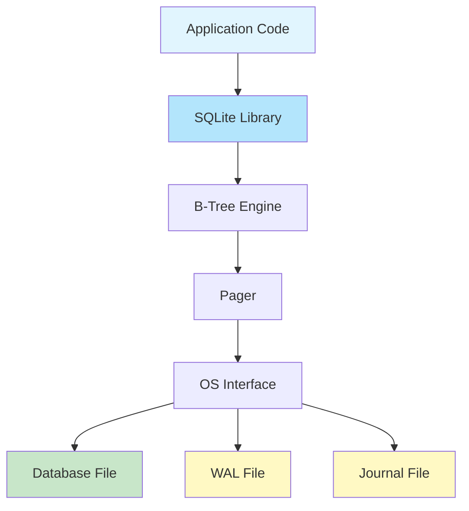
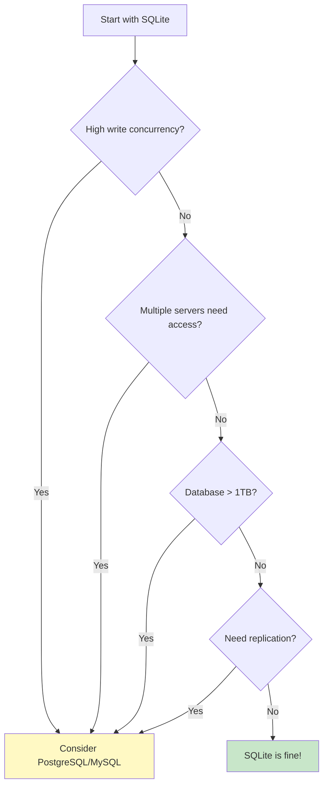

# How to Get Started with SQLite

Author: [nawazdhandala](https://www.github.com/nawazdhandala)

Tags: SQLite, Database, SQL, Getting Started

Description: A practical guide to getting started with SQLite, covering installation, basic operations, schema design, and when to use this lightweight embedded database.

---

> SQLite is everywhere. It runs on your phone, in your browser, and probably in a dozen applications you use daily. Unlike client-server databases like PostgreSQL or MySQL, SQLite is a self-contained, serverless database engine that stores everything in a single file. This makes it perfect for local development, embedded applications, and scenarios where you do not need the overhead of running a database server.

This guide walks you through everything you need to know to start using SQLite effectively, from installation to practical code examples.

---

## Why Choose SQLite?

SQLite shines in specific scenarios:

| Use Case | Why SQLite Works |
|----------|------------------|
| Local development | Zero configuration, instant setup |
| Mobile applications | Embedded in iOS and Android natively |
| Desktop applications | Single file, easy distribution |
| Testing | In-memory databases for fast tests |
| Small to medium websites | Handles millions of rows efficiently |
| Data analysis | SQL interface for CSV/data exploration |
| Edge computing | Minimal resource footprint |

SQLite is not the right choice for:
- High-concurrency write workloads (single writer at a time)
- Multi-server deployments requiring replication
- Applications needing real-time data synchronization across nodes

---

## Installation

### macOS

SQLite comes pre-installed. Verify with:

```bash
# Check SQLite version
sqlite3 --version
# Example output: 3.43.2 2023-10-10 12:14:04
```

### Ubuntu/Debian

Install SQLite with:

```bash
# Update package list and install SQLite
sudo apt update
sudo apt install sqlite3

# Verify installation
sqlite3 --version
```

### Windows

Download from the official SQLite website or use a package manager:

```powershell
# Using Chocolatey package manager
choco install sqlite

# Or using winget
winget install SQLite.SQLite
```

### Programming Language Libraries

Most languages have SQLite support built-in or available via packages:

```bash
# Python - built into standard library (sqlite3)
# No installation needed

# Node.js
npm install better-sqlite3

# Go
go get github.com/mattn/go-sqlite3

# Rust
cargo add rusqlite
```

---

## SQLite Architecture

Before diving into code, understanding SQLite's architecture helps explain its behavior:



Key components:
- **B-Tree Engine**: Organizes data in balanced tree structures for fast lookups
- **Pager**: Manages reading and writing database pages (default 4KB)
- **WAL (Write-Ahead Log)**: Optional mode for better concurrency
- **Journal**: Used for atomic commits and rollback

---

## Creating Your First Database

### Using the Command Line

Open a terminal and create a database:

```bash
# Create or open a database file
# If myapp.db doesn't exist, SQLite creates it
sqlite3 myapp.db
```

Inside the SQLite shell, you can create tables and insert data:

```sql
-- Create a users table with common fields
CREATE TABLE users (
    id INTEGER PRIMARY KEY AUTOINCREMENT,
    email TEXT UNIQUE NOT NULL,
    name TEXT NOT NULL,
    created_at DATETIME DEFAULT CURRENT_TIMESTAMP
);

-- Insert some sample data
INSERT INTO users (email, name) VALUES ('alice@example.com', 'Alice Johnson');
INSERT INTO users (email, name) VALUES ('bob@example.com', 'Bob Smith');

-- Query the data
SELECT * FROM users;

-- Exit the shell
.quit
```

### Useful SQLite Shell Commands

The dot commands are SQLite-specific utilities:

```sql
-- Show all tables in the database
.tables

-- Show the schema for a specific table
.schema users

-- Change output format to column mode with headers
.mode column
.headers on

-- Export query results to a file
.output results.txt
SELECT * FROM users;
.output stdout

-- Import data from a CSV file
.mode csv
.import users.csv users

-- Show current database file
.database

-- Enable query timing
.timer on
```

---

## Python Integration

Python includes SQLite support in its standard library, making it the easiest language to get started with.

### Basic CRUD Operations

This example shows the fundamental create, read, update, delete operations:

```python
# sqlite_basics.py
import sqlite3
from datetime import datetime
from typing import Optional, List, Tuple

def create_connection(db_path: str) -> sqlite3.Connection:
    """
    Create a database connection with recommended settings.
    Row factory allows accessing columns by name instead of index.
    """
    conn = sqlite3.connect(db_path)
    # Enable accessing columns by name: row['column_name']
    conn.row_factory = sqlite3.Row
    # Enable foreign key enforcement (disabled by default)
    conn.execute("PRAGMA foreign_keys = ON")
    return conn

def create_tables(conn: sqlite3.Connection) -> None:
    """
    Create the application schema.
    Using IF NOT EXISTS makes this idempotent.
    """
    conn.executescript("""
        CREATE TABLE IF NOT EXISTS users (
            id INTEGER PRIMARY KEY AUTOINCREMENT,
            email TEXT UNIQUE NOT NULL,
            name TEXT NOT NULL,
            active INTEGER DEFAULT 1,
            created_at TEXT DEFAULT CURRENT_TIMESTAMP
        );

        CREATE TABLE IF NOT EXISTS posts (
            id INTEGER PRIMARY KEY AUTOINCREMENT,
            user_id INTEGER NOT NULL,
            title TEXT NOT NULL,
            content TEXT,
            published INTEGER DEFAULT 0,
            created_at TEXT DEFAULT CURRENT_TIMESTAMP,
            FOREIGN KEY (user_id) REFERENCES users(id) ON DELETE CASCADE
        );

        -- Index for faster lookups by user_id
        CREATE INDEX IF NOT EXISTS idx_posts_user_id ON posts(user_id);
    """)
    conn.commit()

def create_user(conn: sqlite3.Connection, email: str, name: str) -> int:
    """
    Insert a new user and return their ID.
    Using parameterized queries prevents SQL injection.
    """
    cursor = conn.execute(
        "INSERT INTO users (email, name) VALUES (?, ?)",
        (email, name)
    )
    conn.commit()
    # lastrowid gives us the auto-generated ID
    return cursor.lastrowid

def get_user(conn: sqlite3.Connection, user_id: int) -> Optional[sqlite3.Row]:
    """
    Fetch a single user by ID.
    Returns None if user doesn't exist.
    """
    cursor = conn.execute(
        "SELECT * FROM users WHERE id = ?",
        (user_id,)
    )
    return cursor.fetchone()

def get_users_by_status(conn: sqlite3.Connection, active: bool) -> List[sqlite3.Row]:
    """
    Fetch all users matching the active status.
    """
    cursor = conn.execute(
        "SELECT * FROM users WHERE active = ? ORDER BY name",
        (1 if active else 0,)
    )
    return cursor.fetchall()

def update_user(conn: sqlite3.Connection, user_id: int, name: str) -> bool:
    """
    Update a user's name. Returns True if user was found and updated.
    """
    cursor = conn.execute(
        "UPDATE users SET name = ? WHERE id = ?",
        (name, user_id)
    )
    conn.commit()
    # rowcount tells us how many rows were affected
    return cursor.rowcount > 0

def delete_user(conn: sqlite3.Connection, user_id: int) -> bool:
    """
    Delete a user by ID. Returns True if user was deleted.
    """
    cursor = conn.execute(
        "DELETE FROM users WHERE id = ?",
        (user_id,)
    )
    conn.commit()
    return cursor.rowcount > 0


# Example usage
if __name__ == "__main__":
    conn = create_connection("myapp.db")
    create_tables(conn)

    # Create users
    alice_id = create_user(conn, "alice@example.com", "Alice Johnson")
    bob_id = create_user(conn, "bob@example.com", "Bob Smith")

    print(f"Created Alice with ID: {alice_id}")
    print(f"Created Bob with ID: {bob_id}")

    # Read user
    user = get_user(conn, alice_id)
    if user:
        # Access columns by name thanks to row_factory
        print(f"Found user: {user['name']} ({user['email']})")

    # Update user
    update_user(conn, alice_id, "Alice Williams")

    # List active users
    active_users = get_users_by_status(conn, active=True)
    for user in active_users:
        print(f"Active: {user['name']}")

    conn.close()
```

### Context Manager Pattern

For production code, always use context managers to ensure connections close properly:

```python
# sqlite_context.py
import sqlite3
from contextlib import contextmanager
from typing import Generator

@contextmanager
def get_db_connection(db_path: str) -> Generator[sqlite3.Connection, None, None]:
    """
    Context manager for database connections.
    Automatically commits on success, rolls back on error, and closes.
    """
    conn = sqlite3.connect(db_path)
    conn.row_factory = sqlite3.Row
    conn.execute("PRAGMA foreign_keys = ON")

    try:
        yield conn
        conn.commit()
    except Exception:
        conn.rollback()
        raise
    finally:
        conn.close()

@contextmanager
def get_cursor(conn: sqlite3.Connection) -> Generator[sqlite3.Cursor, None, None]:
    """
    Context manager for cursors within an existing connection.
    """
    cursor = conn.cursor()
    try:
        yield cursor
    finally:
        cursor.close()


# Usage example showing proper resource management
def transfer_posts(db_path: str, from_user: int, to_user: int) -> int:
    """
    Transfer all posts from one user to another.
    Uses transaction to ensure atomicity.
    """
    with get_db_connection(db_path) as conn:
        cursor = conn.execute(
            "UPDATE posts SET user_id = ? WHERE user_id = ?",
            (to_user, from_user)
        )
        return cursor.rowcount
```

### Batch Operations

For inserting many rows, use executemany for better performance:

```python
# sqlite_batch.py
import sqlite3
from typing import List, Tuple

def bulk_insert_users(
    conn: sqlite3.Connection,
    users: List[Tuple[str, str]]
) -> int:
    """
    Insert multiple users efficiently.
    Uses executemany which is much faster than individual inserts.

    Args:
        users: List of (email, name) tuples
    Returns:
        Number of users inserted
    """
    cursor = conn.executemany(
        "INSERT OR IGNORE INTO users (email, name) VALUES (?, ?)",
        users
    )
    conn.commit()
    return cursor.rowcount

def bulk_insert_with_transaction(
    conn: sqlite3.Connection,
    users: List[Tuple[str, str]]
) -> int:
    """
    Insert many rows within an explicit transaction.
    Wrapping in BEGIN/COMMIT is faster for large batches.
    """
    conn.execute("BEGIN TRANSACTION")
    try:
        for email, name in users:
            conn.execute(
                "INSERT INTO users (email, name) VALUES (?, ?)",
                (email, name)
            )
        conn.execute("COMMIT")
        return len(users)
    except Exception:
        conn.execute("ROLLBACK")
        raise


# Example: Insert 10,000 users efficiently
if __name__ == "__main__":
    import time

    conn = sqlite3.connect(":memory:")
    conn.execute("""
        CREATE TABLE users (
            id INTEGER PRIMARY KEY,
            email TEXT UNIQUE,
            name TEXT
        )
    """)

    # Generate test data
    users = [(f"user{i}@example.com", f"User {i}") for i in range(10000)]

    start = time.time()
    count = bulk_insert_users(conn, users)
    elapsed = time.time() - start

    print(f"Inserted {count} users in {elapsed:.3f} seconds")
    # Typical output: Inserted 10000 users in 0.045 seconds
```

---

## Node.js Integration

For Node.js, the `better-sqlite3` library provides synchronous operations which are actually faster than async alternatives for SQLite due to its single-threaded nature.

### Basic Setup and Operations

```javascript
// sqlite_basics.js
const Database = require('better-sqlite3');

// Open database with verbose logging for debugging
const db = new Database('myapp.db', { verbose: console.log });

// Create tables with proper constraints
db.exec(`
    CREATE TABLE IF NOT EXISTS users (
        id INTEGER PRIMARY KEY AUTOINCREMENT,
        email TEXT UNIQUE NOT NULL,
        name TEXT NOT NULL,
        active INTEGER DEFAULT 1,
        created_at TEXT DEFAULT CURRENT_TIMESTAMP
    );

    CREATE TABLE IF NOT EXISTS sessions (
        id TEXT PRIMARY KEY,
        user_id INTEGER NOT NULL,
        expires_at TEXT NOT NULL,
        FOREIGN KEY (user_id) REFERENCES users(id) ON DELETE CASCADE
    );
`);

// Enable foreign keys (must be done per connection)
db.pragma('foreign_keys = ON');

// Prepare statements for repeated use (much faster)
const insertUser = db.prepare(
    'INSERT INTO users (email, name) VALUES (@email, @name)'
);

const getUserById = db.prepare(
    'SELECT * FROM users WHERE id = ?'
);

const getUserByEmail = db.prepare(
    'SELECT * FROM users WHERE email = ?'
);

const updateUser = db.prepare(
    'UPDATE users SET name = @name WHERE id = @id'
);

const deleteUser = db.prepare(
    'DELETE FROM users WHERE id = ?'
);

// Functions using prepared statements
function createUser(email, name) {
    // Using named parameters with @ prefix
    const result = insertUser.run({ email, name });
    return result.lastInsertRowid;
}

function getUser(userId) {
    return getUserById.get(userId);
}

function findUserByEmail(email) {
    return getUserByEmail.get(email);
}

function updateUserName(userId, name) {
    const result = updateUser.run({ id: userId, name });
    return result.changes > 0;
}

function removeUser(userId) {
    const result = deleteUser.run(userId);
    return result.changes > 0;
}

// Example usage
const userId = createUser('alice@example.com', 'Alice');
console.log(`Created user with ID: ${userId}`);

const user = getUser(userId);
console.log(`Found user: ${user.name} (${user.email})`);

// Always close when done
db.close();
```

### Transaction Support

Transactions ensure multiple operations succeed or fail together:

```javascript
// sqlite_transactions.js
const Database = require('better-sqlite3');

const db = new Database('myapp.db');

// Prepare statements
const insertUser = db.prepare(
    'INSERT INTO users (email, name) VALUES (?, ?)'
);

const insertPost = db.prepare(
    'INSERT INTO posts (user_id, title, content) VALUES (?, ?, ?)'
);

// Transaction function for creating user with initial post
const createUserWithPost = db.transaction((email, name, postTitle, postContent) => {
    // If any operation fails, all are rolled back
    const userResult = insertUser.run(email, name);
    const userId = userResult.lastInsertRowid;

    insertPost.run(userId, postTitle, postContent);

    return userId;
});

// Bulk insert with transaction (much faster than individual inserts)
const bulkInsertUsers = db.transaction((users) => {
    for (const user of users) {
        insertUser.run(user.email, user.name);
    }
    return users.length;
});

// Usage
try {
    const userId = createUserWithPost(
        'bob@example.com',
        'Bob Smith',
        'My First Post',
        'Hello, world!'
    );
    console.log(`Created user ${userId} with their first post`);
} catch (error) {
    console.error('Transaction failed:', error.message);
}

// Bulk insert example
const users = [
    { email: 'user1@example.com', name: 'User One' },
    { email: 'user2@example.com', name: 'User Two' },
    { email: 'user3@example.com', name: 'User Three' },
];

const count = bulkInsertUsers(users);
console.log(`Inserted ${count} users`);

db.close();
```

---

## Performance Optimization

### WAL Mode

Write-Ahead Logging dramatically improves concurrent read performance:

```python
# sqlite_wal.py
import sqlite3

def configure_for_performance(conn: sqlite3.Connection) -> None:
    """
    Apply performance-oriented pragmas.
    Call once after opening the connection.
    """
    # WAL mode allows concurrent reads during writes
    # and provides better crash recovery
    conn.execute("PRAGMA journal_mode=WAL")

    # Synchronous NORMAL is safe with WAL and faster than FULL
    conn.execute("PRAGMA synchronous=NORMAL")

    # Store temp tables in memory
    conn.execute("PRAGMA temp_store=MEMORY")

    # Increase cache size (negative = KB, positive = pages)
    # -64000 = 64MB cache
    conn.execute("PRAGMA cache_size=-64000")

    # Enable memory-mapped I/O (256MB)
    conn.execute("PRAGMA mmap_size=268435456")


# Verify settings
conn = sqlite3.connect("myapp.db")
configure_for_performance(conn)

# Check current settings
print("Journal mode:", conn.execute("PRAGMA journal_mode").fetchone()[0])
print("Synchronous:", conn.execute("PRAGMA synchronous").fetchone()[0])
```

### Indexing Strategy

Create indexes for columns used in WHERE, JOIN, and ORDER BY:

```sql
-- Index for email lookups (unique constraint already creates an index)
-- CREATE UNIQUE INDEX idx_users_email ON users(email);

-- Composite index for queries filtering by status and ordering by date
CREATE INDEX idx_posts_status_date ON posts(published, created_at DESC);

-- Index for foreign key lookups
CREATE INDEX idx_posts_user_id ON posts(user_id);

-- Partial index for only active users (smaller, faster)
CREATE INDEX idx_users_active ON users(name) WHERE active = 1;

-- Covering index includes all columns needed by query
-- SQLite can answer the query from index alone
CREATE INDEX idx_posts_listing ON posts(user_id, published, created_at, title);
```

### Query Analysis

Use EXPLAIN QUERY PLAN to understand how SQLite executes queries:

```sql
-- See the query execution plan
EXPLAIN QUERY PLAN
SELECT u.name, COUNT(p.id) as post_count
FROM users u
LEFT JOIN posts p ON p.user_id = u.id
WHERE u.active = 1
GROUP BY u.id
ORDER BY post_count DESC;

-- Example output shows if indexes are used:
-- SCAN users USING INDEX idx_users_active
-- SEARCH posts USING INDEX idx_posts_user_id
```

---

## Schema Design Best Practices

### Data Types

SQLite uses dynamic typing, but declaring types helps document intent:

```sql
-- SQLite type affinity (what it actually stores)
-- INTEGER: Whole numbers (1, 2, 8 bytes depending on value)
-- REAL: 8-byte floating point
-- TEXT: UTF-8 string
-- BLOB: Binary data
-- NULL: Null value

CREATE TABLE products (
    -- INTEGER PRIMARY KEY is special: becomes the rowid (fastest)
    id INTEGER PRIMARY KEY AUTOINCREMENT,

    -- TEXT for strings
    name TEXT NOT NULL,
    sku TEXT UNIQUE NOT NULL,

    -- REAL for decimals (or store as INTEGER cents)
    price REAL NOT NULL CHECK(price >= 0),

    -- INTEGER for booleans (0 = false, 1 = true)
    in_stock INTEGER DEFAULT 1,

    -- TEXT for dates (ISO 8601 format: 'YYYY-MM-DD HH:MM:SS')
    created_at TEXT DEFAULT CURRENT_TIMESTAMP,

    -- BLOB for binary data
    thumbnail BLOB
);
```

### JSON Support

SQLite has built-in JSON functions for flexible schemas:

```sql
-- Create table with JSON column
CREATE TABLE events (
    id INTEGER PRIMARY KEY,
    event_type TEXT NOT NULL,
    payload TEXT NOT NULL,  -- Store JSON as TEXT
    created_at TEXT DEFAULT CURRENT_TIMESTAMP
);

-- Insert JSON data
INSERT INTO events (event_type, payload) VALUES
    ('user_signup', '{"email": "alice@example.com", "source": "organic"}'),
    ('purchase', '{"product_id": 123, "quantity": 2, "total": 49.99}');

-- Query JSON fields using json_extract
SELECT
    id,
    event_type,
    json_extract(payload, '$.email') as email,
    json_extract(payload, '$.source') as source
FROM events
WHERE event_type = 'user_signup';

-- Filter by JSON value
SELECT * FROM events
WHERE json_extract(payload, '$.total') > 25.00;

-- Create index on JSON field for faster queries
CREATE INDEX idx_events_email ON events(json_extract(payload, '$.email'));
```

---

## Testing with In-Memory Databases

SQLite's in-memory mode is perfect for fast unit tests:

```python
# test_users.py
import sqlite3
import pytest
from typing import Generator

# Import your application code
from sqlite_context import get_db_connection
from sqlite_basics import create_tables, create_user, get_user

@pytest.fixture
def db_conn() -> Generator[sqlite3.Connection, None, None]:
    """
    Create an in-memory database for each test.
    :memory: creates a fresh database that disappears when closed.
    """
    conn = sqlite3.connect(":memory:")
    conn.row_factory = sqlite3.Row
    create_tables(conn)
    yield conn
    conn.close()

def test_create_user(db_conn):
    """Test that we can create a user and get their ID."""
    user_id = create_user(db_conn, "test@example.com", "Test User")

    assert user_id == 1
    assert isinstance(user_id, int)

def test_get_user(db_conn):
    """Test that we can retrieve a created user."""
    user_id = create_user(db_conn, "alice@example.com", "Alice")

    user = get_user(db_conn, user_id)

    assert user is not None
    assert user["email"] == "alice@example.com"
    assert user["name"] == "Alice"
    assert user["active"] == 1

def test_get_nonexistent_user(db_conn):
    """Test that getting a non-existent user returns None."""
    user = get_user(db_conn, 9999)

    assert user is None

def test_unique_email_constraint(db_conn):
    """Test that duplicate emails are rejected."""
    create_user(db_conn, "test@example.com", "First User")

    with pytest.raises(sqlite3.IntegrityError):
        create_user(db_conn, "test@example.com", "Second User")
```

---

## Backup and Maintenance

### Online Backup

SQLite supports hot backups while the database is in use:

```python
# sqlite_backup.py
import sqlite3
import shutil
from pathlib import Path
from datetime import datetime

def backup_database(source_path: str, backup_dir: str) -> str:
    """
    Create a backup using SQLite's online backup API.
    Works safely even while database is being written to.
    """
    timestamp = datetime.now().strftime("%Y%m%d_%H%M%S")
    backup_path = Path(backup_dir) / f"backup_{timestamp}.db"

    # Connect to source
    source = sqlite3.connect(source_path)

    # Connect to backup destination
    backup = sqlite3.connect(str(backup_path))

    # Perform the backup
    # This copies pages incrementally and handles concurrent writes
    source.backup(backup)

    backup.close()
    source.close()

    return str(backup_path)

def vacuum_database(db_path: str) -> None:
    """
    Rebuild the database file to reclaim space and defragment.
    Run periodically after many deletions.
    """
    conn = sqlite3.connect(db_path)
    conn.execute("VACUUM")
    conn.close()

def analyze_database(db_path: str) -> None:
    """
    Update query planner statistics for better query plans.
    Run after significant data changes.
    """
    conn = sqlite3.connect(db_path)
    conn.execute("ANALYZE")
    conn.close()

def integrity_check(db_path: str) -> bool:
    """
    Verify database integrity. Returns True if database is healthy.
    """
    conn = sqlite3.connect(db_path)
    result = conn.execute("PRAGMA integrity_check").fetchone()
    conn.close()
    return result[0] == "ok"


# Usage
if __name__ == "__main__":
    # Backup
    backup_path = backup_database("myapp.db", "./backups")
    print(f"Backup created: {backup_path}")

    # Maintenance
    vacuum_database("myapp.db")
    analyze_database("myapp.db")

    # Health check
    if integrity_check("myapp.db"):
        print("Database integrity: OK")
    else:
        print("Database corruption detected!")
```

### Command-line Backup

Simple backup using the sqlite3 command:

```bash
# Create a backup using .backup command
sqlite3 myapp.db ".backup backup.db"

# Export as SQL (portable, but slower)
sqlite3 myapp.db .dump > backup.sql

# Restore from SQL dump
sqlite3 new_database.db < backup.sql
```

---

## Common Patterns

### Pagination

Efficient pagination for large datasets:

```python
# sqlite_pagination.py
import sqlite3
from typing import List, Tuple, Any

def get_page(
    conn: sqlite3.Connection,
    table: str,
    page: int,
    per_page: int = 20,
    order_by: str = "id"
) -> Tuple[List[sqlite3.Row], int]:
    """
    Get a page of results with total count.
    Returns (rows, total_count).
    """
    offset = (page - 1) * per_page

    # Get total count
    count = conn.execute(f"SELECT COUNT(*) FROM {table}").fetchone()[0]

    # Get page of results
    rows = conn.execute(
        f"SELECT * FROM {table} ORDER BY {order_by} LIMIT ? OFFSET ?",
        (per_page, offset)
    ).fetchall()

    return rows, count

def get_page_keyset(
    conn: sqlite3.Connection,
    last_id: int = 0,
    per_page: int = 20
) -> List[sqlite3.Row]:
    """
    Keyset pagination (faster for large offsets).
    Use the last ID from previous page as cursor.
    """
    return conn.execute(
        "SELECT * FROM users WHERE id > ? ORDER BY id LIMIT ?",
        (last_id, per_page)
    ).fetchall()
```

### Full-Text Search

SQLite includes FTS5 for full-text search:

```sql
-- Create FTS5 virtual table
CREATE VIRTUAL TABLE posts_fts USING fts5(
    title,
    content,
    content='posts',
    content_rowid='id'
);

-- Populate from existing data
INSERT INTO posts_fts(rowid, title, content)
SELECT id, title, content FROM posts;

-- Search with ranking
SELECT
    posts.id,
    posts.title,
    snippet(posts_fts, 1, '<mark>', '</mark>', '...', 32) as excerpt,
    bm25(posts_fts) as rank
FROM posts_fts
JOIN posts ON posts.id = posts_fts.rowid
WHERE posts_fts MATCH 'sqlite AND database'
ORDER BY rank;
```

---

## When to Move Beyond SQLite

SQLite is powerful, but know when to migrate:



Migration signals:
- Write throughput exceeds single-writer limitation
- Multiple application servers need direct database access
- You need real-time replication or high availability
- Database size makes single-file management impractical

---

## Conclusion

SQLite is a remarkably capable database that handles far more than most developers expect. Key takeaways:

- **Zero setup**: Just connect to a file path and start working
- **WAL mode**: Enable for better concurrent read performance
- **Use indexes**: Create them for columns in WHERE, JOIN, and ORDER BY
- **Parameterized queries**: Always use ? placeholders to prevent SQL injection
- **In-memory databases**: Perfect for fast tests
- **Know the limits**: Single writer, no replication, local only

For many applications, SQLite is not just good enough, it is the best choice. Start simple, and only move to a client-server database when you actually hit SQLite's limitations.

---

*Need to monitor your SQLite database performance? [OneUptime](https://oneuptime.com) provides application performance monitoring that helps you track database query times, identify slow queries, and set up alerts before performance issues affect your users.*
