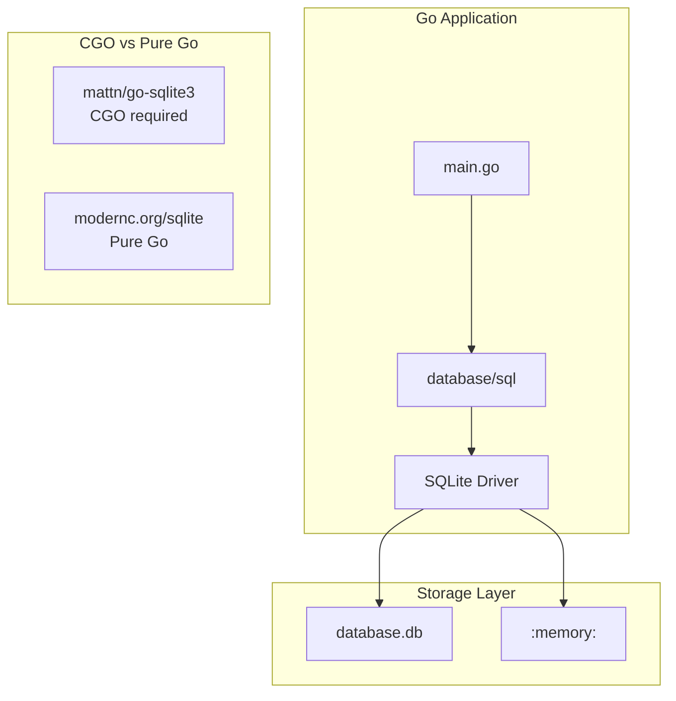
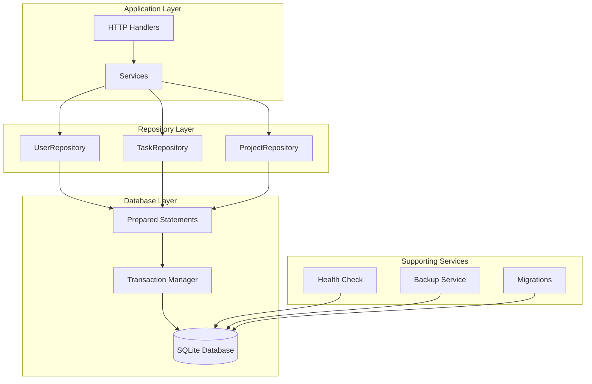

# How to Use SQLite with Go

Author: [nawazdhandala](https://github.com/nawazdhandala)

Tags: Go, SQLite, Database, SQL, Golang

Description: A comprehensive guide to using SQLite in Go applications. Learn database setup, CRUD operations, prepared statements, transactions, migrations, connection management, and production best practices with practical examples.

---

> SQLite is an excellent choice for Go applications that need embedded persistent storage without the complexity of a separate database server. Its simplicity, zero-configuration nature, and single-file storage make it ideal for desktop applications, mobile backends, CLI tools, and small to medium web services.

This guide covers everything you need to build production-ready Go applications with SQLite, from basic operations to advanced patterns.

---

## Why SQLite with Go?

Go and SQLite make a powerful combination. Go's standard library includes the `database/sql` package, which provides a clean, consistent interface for database operations. When paired with SQLite, you get:

- **Zero deployment complexity** - No database server to install or configure
- **Cross-platform portability** - The same code runs on Linux, macOS, and Windows
- **Excellent performance** - SQLite is highly optimized for read-heavy workloads
- **Reliable transactions** - Full ACID compliance for data integrity
- **Easy testing** - In-memory databases enable fast, isolated tests



---

## Choosing a SQLite Driver

Go has two main SQLite drivers, each with distinct tradeoffs.

### CGO Driver (mattn/go-sqlite3)

The most widely used driver wraps the official SQLite C library. It provides full feature support and maximum performance but requires CGO.

```bash
# Install the CGO-based driver
go get github.com/mattn/go-sqlite3
```

**Advantages:**
- Complete SQLite feature support
- Best performance (native C code)
- Battle-tested in production

**Disadvantages:**
- Requires CGO (C compiler needed)
- Cross-compilation is more complex
- Larger binary sizes

### Pure Go Driver (modernc.org/sqlite)

A complete SQLite implementation translated to pure Go. No CGO required.

```bash
# Install the pure Go driver
go get modernc.org/sqlite
```

**Advantages:**
- No CGO dependency
- Easy cross-compilation
- Simpler build process

**Disadvantages:**
- Slightly slower than CGO version
- Larger binary size
- May lag behind SQLite updates

For this guide, we will use the CGO driver for its broader adoption, but the code works with either driver by changing only the import path.

---

## Getting Started

### Project Setup

Initialize a new Go project and install dependencies.

```bash
# Create project directory
mkdir sqlite-demo && cd sqlite-demo

# Initialize Go module
go mod init github.com/yourname/sqlite-demo

# Install SQLite driver
go get github.com/mattn/go-sqlite3
```

### Basic Database Connection

This example shows how to open a database connection, create a table, and verify everything works. The `_` import is required to register the SQLite driver with `database/sql`.

```go
package main

import (
    "database/sql"
    "fmt"
    "log"

    // Import the SQLite driver
    // The underscore import registers the driver with database/sql
    _ "github.com/mattn/go-sqlite3"
)

func main() {
    // Open database connection
    // SQLite creates the file if it does not exist
    db, err := sql.Open("sqlite3", "./app.db")
    if err != nil {
        log.Fatalf("Failed to open database: %v", err)
    }
    defer db.Close()

    // Verify the connection is working
    if err := db.Ping(); err != nil {
        log.Fatalf("Failed to ping database: %v", err)
    }

    fmt.Println("Successfully connected to SQLite database")
}
```

### Connection Configuration

SQLite supports various connection parameters through the DSN (Data Source Name). Configure these options for better performance and reliability.

```go
package main

import (
    "database/sql"
    "log"
    "time"

    _ "github.com/mattn/go-sqlite3"
)

// NewDatabase creates a configured database connection
// with production-ready settings for SQLite
func NewDatabase(dbPath string) (*sql.DB, error) {
    // Connection string with configuration options
    // _journal_mode=WAL enables Write-Ahead Logging for better concurrency
    // _busy_timeout=5000 waits up to 5 seconds when database is locked
    // _synchronous=NORMAL balances safety and performance
    // _cache_size=-64000 sets 64MB cache (negative = KB)
    // _foreign_keys=ON enables foreign key constraint enforcement
    dsn := dbPath + "?_journal_mode=WAL&_busy_timeout=5000&_synchronous=NORMAL&_cache_size=-64000&_foreign_keys=ON"

    db, err := sql.Open("sqlite3", dsn)
    if err != nil {
        return nil, err
    }

    // Configure connection pool settings
    // SQLite works best with limited connections due to file locking
    db.SetMaxOpenConns(1) // SQLite supports only one writer at a time
    db.SetMaxIdleConns(1)
    db.SetConnMaxLifetime(time.Hour)

    // Verify connection works
    if err := db.Ping(); err != nil {
        db.Close()
        return nil, err
    }

    return db, nil
}

func main() {
    db, err := NewDatabase("./app.db")
    if err != nil {
        log.Fatal(err)
    }
    defer db.Close()

    log.Println("Database configured successfully")
}
```

---

## Schema Design and Migrations

### Creating Tables

Define your database schema using SQL. This example creates a practical schema for a task management application.

```go
package main

import (
    "database/sql"
    "fmt"
    "log"

    _ "github.com/mattn/go-sqlite3"
)

// Schema defines the database tables
// Using IF NOT EXISTS makes this idempotent
const schema = `
CREATE TABLE IF NOT EXISTS users (
    id INTEGER PRIMARY KEY AUTOINCREMENT,
    email TEXT NOT NULL UNIQUE,
    name TEXT NOT NULL,
    password_hash TEXT NOT NULL,
    created_at DATETIME DEFAULT CURRENT_TIMESTAMP,
    updated_at DATETIME DEFAULT CURRENT_TIMESTAMP
);

CREATE TABLE IF NOT EXISTS projects (
    id INTEGER PRIMARY KEY AUTOINCREMENT,
    name TEXT NOT NULL,
    description TEXT,
    owner_id INTEGER NOT NULL,
    created_at DATETIME DEFAULT CURRENT_TIMESTAMP,
    FOREIGN KEY (owner_id) REFERENCES users(id) ON DELETE CASCADE
);

CREATE TABLE IF NOT EXISTS tasks (
    id INTEGER PRIMARY KEY AUTOINCREMENT,
    title TEXT NOT NULL,
    description TEXT,
    status TEXT NOT NULL DEFAULT 'pending' CHECK(status IN ('pending', 'in_progress', 'completed', 'cancelled')),
    priority INTEGER NOT NULL DEFAULT 0 CHECK(priority BETWEEN 0 AND 3),
    project_id INTEGER NOT NULL,
    assignee_id INTEGER,
    due_date DATETIME,
    created_at DATETIME DEFAULT CURRENT_TIMESTAMP,
    updated_at DATETIME DEFAULT CURRENT_TIMESTAMP,
    FOREIGN KEY (project_id) REFERENCES projects(id) ON DELETE CASCADE,
    FOREIGN KEY (assignee_id) REFERENCES users(id) ON DELETE SET NULL
);

-- Create indexes for common query patterns
CREATE INDEX IF NOT EXISTS idx_tasks_project ON tasks(project_id);
CREATE INDEX IF NOT EXISTS idx_tasks_assignee ON tasks(assignee_id);
CREATE INDEX IF NOT EXISTS idx_tasks_status ON tasks(status);
CREATE INDEX IF NOT EXISTS idx_tasks_due_date ON tasks(due_date);
`

// InitializeSchema creates all database tables and indexes
func InitializeSchema(db *sql.DB) error {
    _, err := db.Exec(schema)
    return err
}

func main() {
    db, err := sql.Open("sqlite3", "./taskapp.db?_foreign_keys=ON")
    if err != nil {
        log.Fatal(err)
    }
    defer db.Close()

    if err := InitializeSchema(db); err != nil {
        log.Fatalf("Failed to initialize schema: %v", err)
    }

    fmt.Println("Schema initialized successfully")
}
```

### Migration System

For production applications, use versioned migrations to manage schema changes. This migration system tracks applied versions and supports both upgrades and rollbacks.

```go
package migrations

import (
    "database/sql"
    "fmt"
    "log"
    "sort"
    "time"
)

// Migration represents a single database migration
type Migration struct {
    Version     int
    Description string
    Up          string // SQL to apply the migration
    Down        string // SQL to rollback the migration
}

// Migrator handles database schema migrations
type Migrator struct {
    db         *sql.DB
    migrations []Migration
}

// NewMigrator creates a new migration manager
func NewMigrator(db *sql.DB) *Migrator {
    return &Migrator{
        db:         db,
        migrations: definedMigrations,
    }
}

// All migrations defined in order
var definedMigrations = []Migration{
    {
        Version:     1,
        Description: "Create users table",
        Up: `
            CREATE TABLE users (
                id INTEGER PRIMARY KEY AUTOINCREMENT,
                email TEXT NOT NULL UNIQUE,
                name TEXT NOT NULL,
                password_hash TEXT NOT NULL,
                created_at DATETIME DEFAULT CURRENT_TIMESTAMP,
                updated_at DATETIME DEFAULT CURRENT_TIMESTAMP
            );
            CREATE INDEX idx_users_email ON users(email);
        `,
        Down: `DROP TABLE IF EXISTS users;`,
    },
    {
        Version:     2,
        Description: "Create projects table",
        Up: `
            CREATE TABLE projects (
                id INTEGER PRIMARY KEY AUTOINCREMENT,
                name TEXT NOT NULL,
                description TEXT,
                owner_id INTEGER NOT NULL REFERENCES users(id) ON DELETE CASCADE,
                created_at DATETIME DEFAULT CURRENT_TIMESTAMP
            );
            CREATE INDEX idx_projects_owner ON projects(owner_id);
        `,
        Down: `DROP TABLE IF EXISTS projects;`,
    },
    {
        Version:     3,
        Description: "Create tasks table",
        Up: `
            CREATE TABLE tasks (
                id INTEGER PRIMARY KEY AUTOINCREMENT,
                title TEXT NOT NULL,
                description TEXT,
                status TEXT NOT NULL DEFAULT 'pending',
                priority INTEGER NOT NULL DEFAULT 0,
                project_id INTEGER NOT NULL REFERENCES projects(id) ON DELETE CASCADE,
                assignee_id INTEGER REFERENCES users(id) ON DELETE SET NULL,
                due_date DATETIME,
                created_at DATETIME DEFAULT CURRENT_TIMESTAMP,
                updated_at DATETIME DEFAULT CURRENT_TIMESTAMP
            );
            CREATE INDEX idx_tasks_project ON tasks(project_id);
            CREATE INDEX idx_tasks_status ON tasks(status);
        `,
        Down: `DROP TABLE IF EXISTS tasks;`,
    },
}

// Initialize creates the migrations tracking table
func (m *Migrator) Initialize() error {
    _, err := m.db.Exec(`
        CREATE TABLE IF NOT EXISTS schema_migrations (
            version INTEGER PRIMARY KEY,
            description TEXT NOT NULL,
            applied_at DATETIME DEFAULT CURRENT_TIMESTAMP
        )
    `)
    return err
}

// CurrentVersion returns the highest applied migration version
func (m *Migrator) CurrentVersion() (int, error) {
    var version sql.NullInt64
    err := m.db.QueryRow(`
        SELECT MAX(version) FROM schema_migrations
    `).Scan(&version)
    if err != nil {
        return 0, err
    }
    if !version.Valid {
        return 0, nil
    }
    return int(version.Int64), nil
}

// Migrate applies all pending migrations
func (m *Migrator) Migrate() error {
    if err := m.Initialize(); err != nil {
        return fmt.Errorf("failed to initialize migrations table: %w", err)
    }

    current, err := m.CurrentVersion()
    if err != nil {
        return fmt.Errorf("failed to get current version: %w", err)
    }

    // Sort migrations by version
    sort.Slice(m.migrations, func(i, j int) bool {
        return m.migrations[i].Version < m.migrations[j].Version
    })

    // Apply pending migrations
    for _, migration := range m.migrations {
        if migration.Version <= current {
            continue
        }

        log.Printf("Applying migration %d: %s", migration.Version, migration.Description)

        // Use a transaction for each migration
        tx, err := m.db.Begin()
        if err != nil {
            return fmt.Errorf("failed to begin transaction: %w", err)
        }

        // Execute the migration SQL
        if _, err := tx.Exec(migration.Up); err != nil {
            tx.Rollback()
            return fmt.Errorf("migration %d failed: %w", migration.Version, err)
        }

        // Record the migration
        if _, err := tx.Exec(`
            INSERT INTO schema_migrations (version, description, applied_at)
            VALUES (?, ?, ?)
        `, migration.Version, migration.Description, time.Now()); err != nil {
            tx.Rollback()
            return fmt.Errorf("failed to record migration: %w", err)
        }

        if err := tx.Commit(); err != nil {
            return fmt.Errorf("failed to commit migration: %w", err)
        }

        log.Printf("Migration %d applied successfully", migration.Version)
    }

    return nil
}

// Rollback reverts the last applied migration
func (m *Migrator) Rollback() error {
    current, err := m.CurrentVersion()
    if err != nil {
        return err
    }

    if current == 0 {
        log.Println("No migrations to rollback")
        return nil
    }

    // Find the migration to rollback
    var migration *Migration
    for i := range m.migrations {
        if m.migrations[i].Version == current {
            migration = &m.migrations[i]
            break
        }
    }

    if migration == nil {
        return fmt.Errorf("migration %d not found", current)
    }

    log.Printf("Rolling back migration %d: %s", migration.Version, migration.Description)

    tx, err := m.db.Begin()
    if err != nil {
        return err
    }

    if _, err := tx.Exec(migration.Down); err != nil {
        tx.Rollback()
        return fmt.Errorf("rollback failed: %w", err)
    }

    if _, err := tx.Exec(`DELETE FROM schema_migrations WHERE version = ?`, migration.Version); err != nil {
        tx.Rollback()
        return err
    }

    return tx.Commit()
}
```

---

## CRUD Operations

### Repository Pattern

Implement a clean repository pattern to encapsulate database operations. This provides a testable, maintainable data access layer.

```go
package repository

import (
    "context"
    "database/sql"
    "errors"
    "time"
)

// Common errors returned by repositories
var (
    ErrNotFound      = errors.New("record not found")
    ErrDuplicateKey  = errors.New("duplicate key violation")
    ErrInvalidInput  = errors.New("invalid input")
)

// User represents a user in the system
type User struct {
    ID           int64
    Email        string
    Name         string
    PasswordHash string
    CreatedAt    time.Time
    UpdatedAt    time.Time
}

// UserRepository handles user database operations
type UserRepository struct {
    db *sql.DB
}

// NewUserRepository creates a new user repository
func NewUserRepository(db *sql.DB) *UserRepository {
    return &UserRepository{db: db}
}

// Create inserts a new user into the database
// Returns the created user with its generated ID
func (r *UserRepository) Create(ctx context.Context, user *User) error {
    // Use a prepared statement for better performance and security
    query := `
        INSERT INTO users (email, name, password_hash, created_at, updated_at)
        VALUES (?, ?, ?, ?, ?)
    `

    now := time.Now()
    result, err := r.db.ExecContext(ctx, query,
        user.Email,
        user.Name,
        user.PasswordHash,
        now,
        now,
    )
    if err != nil {
        // Check for unique constraint violation
        if isUniqueConstraintError(err) {
            return ErrDuplicateKey
        }
        return err
    }

    // Get the auto-generated ID
    id, err := result.LastInsertId()
    if err != nil {
        return err
    }

    user.ID = id
    user.CreatedAt = now
    user.UpdatedAt = now
    return nil
}

// FindByID retrieves a user by their ID
func (r *UserRepository) FindByID(ctx context.Context, id int64) (*User, error) {
    query := `
        SELECT id, email, name, password_hash, created_at, updated_at
        FROM users
        WHERE id = ?
    `

    user := &User{}
    err := r.db.QueryRowContext(ctx, query, id).Scan(
        &user.ID,
        &user.Email,
        &user.Name,
        &user.PasswordHash,
        &user.CreatedAt,
        &user.UpdatedAt,
    )

    if err != nil {
        if errors.Is(err, sql.ErrNoRows) {
            return nil, ErrNotFound
        }
        return nil, err
    }

    return user, nil
}

// FindByEmail retrieves a user by their email address
func (r *UserRepository) FindByEmail(ctx context.Context, email string) (*User, error) {
    query := `
        SELECT id, email, name, password_hash, created_at, updated_at
        FROM users
        WHERE email = ?
    `

    user := &User{}
    err := r.db.QueryRowContext(ctx, query, email).Scan(
        &user.ID,
        &user.Email,
        &user.Name,
        &user.PasswordHash,
        &user.CreatedAt,
        &user.UpdatedAt,
    )

    if err != nil {
        if errors.Is(err, sql.ErrNoRows) {
            return nil, ErrNotFound
        }
        return nil, err
    }

    return user, nil
}

// Update modifies an existing user's information
func (r *UserRepository) Update(ctx context.Context, user *User) error {
    query := `
        UPDATE users
        SET email = ?, name = ?, updated_at = ?
        WHERE id = ?
    `

    now := time.Now()
    result, err := r.db.ExecContext(ctx, query,
        user.Email,
        user.Name,
        now,
        user.ID,
    )
    if err != nil {
        if isUniqueConstraintError(err) {
            return ErrDuplicateKey
        }
        return err
    }

    rowsAffected, err := result.RowsAffected()
    if err != nil {
        return err
    }

    if rowsAffected == 0 {
        return ErrNotFound
    }

    user.UpdatedAt = now
    return nil
}

// Delete removes a user from the database
func (r *UserRepository) Delete(ctx context.Context, id int64) error {
    query := `DELETE FROM users WHERE id = ?`

    result, err := r.db.ExecContext(ctx, query, id)
    if err != nil {
        return err
    }

    rowsAffected, err := result.RowsAffected()
    if err != nil {
        return err
    }

    if rowsAffected == 0 {
        return ErrNotFound
    }

    return nil
}

// List retrieves users with pagination support
func (r *UserRepository) List(ctx context.Context, limit, offset int) ([]*User, error) {
    query := `
        SELECT id, email, name, password_hash, created_at, updated_at
        FROM users
        ORDER BY created_at DESC
        LIMIT ? OFFSET ?
    `

    rows, err := r.db.QueryContext(ctx, query, limit, offset)
    if err != nil {
        return nil, err
    }
    defer rows.Close()

    var users []*User
    for rows.Next() {
        user := &User{}
        err := rows.Scan(
            &user.ID,
            &user.Email,
            &user.Name,
            &user.PasswordHash,
            &user.CreatedAt,
            &user.UpdatedAt,
        )
        if err != nil {
            return nil, err
        }
        users = append(users, user)
    }

    // Check for errors from iterating over rows
    if err := rows.Err(); err != nil {
        return nil, err
    }

    return users, nil
}

// Count returns the total number of users
func (r *UserRepository) Count(ctx context.Context) (int64, error) {
    var count int64
    err := r.db.QueryRowContext(ctx, `SELECT COUNT(*) FROM users`).Scan(&count)
    return count, err
}

// isUniqueConstraintError checks if the error is a unique constraint violation
func isUniqueConstraintError(err error) bool {
    // SQLite error message contains "UNIQUE constraint failed"
    return err != nil && (
        contains(err.Error(), "UNIQUE constraint failed") ||
        contains(err.Error(), "unique constraint"))
}

func contains(s, substr string) bool {
    return len(s) >= len(substr) && (s == substr || len(s) > 0 && containsAt(s, substr, 0))
}

func containsAt(s, substr string, start int) bool {
    for i := start; i <= len(s)-len(substr); i++ {
        if s[i:i+len(substr)] == substr {
            return true
        }
    }
    return false
}
```

### Task Repository with Complex Queries

This repository demonstrates more advanced query patterns including filtering, sorting, and joins.

```go
package repository

import (
    "context"
    "database/sql"
    "fmt"
    "strings"
    "time"
)

// Task represents a task in a project
type Task struct {
    ID          int64
    Title       string
    Description sql.NullString
    Status      string
    Priority    int
    ProjectID   int64
    AssigneeID  sql.NullInt64
    DueDate     sql.NullTime
    CreatedAt   time.Time
    UpdatedAt   time.Time
}

// TaskFilter defines filtering options for task queries
type TaskFilter struct {
    ProjectID  *int64
    AssigneeID *int64
    Status     *string
    Priority   *int
    DueBefore  *time.Time
    DueAfter   *time.Time
}

// TaskRepository handles task database operations
type TaskRepository struct {
    db *sql.DB
}

// NewTaskRepository creates a new task repository
func NewTaskRepository(db *sql.DB) *TaskRepository {
    return &TaskRepository{db: db}
}

// Create inserts a new task
func (r *TaskRepository) Create(ctx context.Context, task *Task) error {
    query := `
        INSERT INTO tasks (title, description, status, priority, project_id, assignee_id, due_date, created_at, updated_at)
        VALUES (?, ?, ?, ?, ?, ?, ?, ?, ?)
    `

    now := time.Now()
    result, err := r.db.ExecContext(ctx, query,
        task.Title,
        task.Description,
        task.Status,
        task.Priority,
        task.ProjectID,
        task.AssigneeID,
        task.DueDate,
        now,
        now,
    )
    if err != nil {
        return err
    }

    id, err := result.LastInsertId()
    if err != nil {
        return err
    }

    task.ID = id
    task.CreatedAt = now
    task.UpdatedAt = now
    return nil
}

// FindByID retrieves a task by ID
func (r *TaskRepository) FindByID(ctx context.Context, id int64) (*Task, error) {
    query := `
        SELECT id, title, description, status, priority, project_id, assignee_id, due_date, created_at, updated_at
        FROM tasks
        WHERE id = ?
    `

    task := &Task{}
    err := r.db.QueryRowContext(ctx, query, id).Scan(
        &task.ID,
        &task.Title,
        &task.Description,
        &task.Status,
        &task.Priority,
        &task.ProjectID,
        &task.AssigneeID,
        &task.DueDate,
        &task.CreatedAt,
        &task.UpdatedAt,
    )

    if err != nil {
        if errors.Is(err, sql.ErrNoRows) {
            return nil, ErrNotFound
        }
        return nil, err
    }

    return task, nil
}

// FindWithFilter retrieves tasks matching the specified criteria
// Demonstrates dynamic query building with proper parameter binding
func (r *TaskRepository) FindWithFilter(ctx context.Context, filter TaskFilter, limit, offset int) ([]*Task, error) {
    // Build the WHERE clause dynamically
    var conditions []string
    var args []interface{}

    if filter.ProjectID != nil {
        conditions = append(conditions, "project_id = ?")
        args = append(args, *filter.ProjectID)
    }

    if filter.AssigneeID != nil {
        conditions = append(conditions, "assignee_id = ?")
        args = append(args, *filter.AssigneeID)
    }

    if filter.Status != nil {
        conditions = append(conditions, "status = ?")
        args = append(args, *filter.Status)
    }

    if filter.Priority != nil {
        conditions = append(conditions, "priority = ?")
        args = append(args, *filter.Priority)
    }

    if filter.DueBefore != nil {
        conditions = append(conditions, "due_date < ?")
        args = append(args, *filter.DueBefore)
    }

    if filter.DueAfter != nil {
        conditions = append(conditions, "due_date > ?")
        args = append(args, *filter.DueAfter)
    }

    // Construct the query
    query := `
        SELECT id, title, description, status, priority, project_id, assignee_id, due_date, created_at, updated_at
        FROM tasks
    `

    if len(conditions) > 0 {
        query += " WHERE " + strings.Join(conditions, " AND ")
    }

    query += " ORDER BY priority DESC, due_date ASC LIMIT ? OFFSET ?"
    args = append(args, limit, offset)

    rows, err := r.db.QueryContext(ctx, query, args...)
    if err != nil {
        return nil, err
    }
    defer rows.Close()

    var tasks []*Task
    for rows.Next() {
        task := &Task{}
        err := rows.Scan(
            &task.ID,
            &task.Title,
            &task.Description,
            &task.Status,
            &task.Priority,
            &task.ProjectID,
            &task.AssigneeID,
            &task.DueDate,
            &task.CreatedAt,
            &task.UpdatedAt,
        )
        if err != nil {
            return nil, err
        }
        tasks = append(tasks, task)
    }

    return tasks, rows.Err()
}

// UpdateStatus changes a task's status with optimistic locking check
func (r *TaskRepository) UpdateStatus(ctx context.Context, id int64, newStatus string, expectedUpdatedAt time.Time) error {
    query := `
        UPDATE tasks
        SET status = ?, updated_at = ?
        WHERE id = ? AND updated_at = ?
    `

    now := time.Now()
    result, err := r.db.ExecContext(ctx, query, newStatus, now, id, expectedUpdatedAt)
    if err != nil {
        return err
    }

    rowsAffected, err := result.RowsAffected()
    if err != nil {
        return err
    }

    if rowsAffected == 0 {
        return fmt.Errorf("task was modified by another process")
    }

    return nil
}

// CountByStatus returns task counts grouped by status for a project
func (r *TaskRepository) CountByStatus(ctx context.Context, projectID int64) (map[string]int, error) {
    query := `
        SELECT status, COUNT(*) as count
        FROM tasks
        WHERE project_id = ?
        GROUP BY status
    `

    rows, err := r.db.QueryContext(ctx, query, projectID)
    if err != nil {
        return nil, err
    }
    defer rows.Close()

    counts := make(map[string]int)
    for rows.Next() {
        var status string
        var count int
        if err := rows.Scan(&status, &count); err != nil {
            return nil, err
        }
        counts[status] = count
    }

    return counts, rows.Err()
}
```

---

## Prepared Statements

Prepared statements improve performance for frequently executed queries and protect against SQL injection.

```go
package database

import (
    "context"
    "database/sql"
    "sync"
)

// PreparedStatements holds commonly used prepared statements
// This pattern avoids preparing the same statement repeatedly
type PreparedStatements struct {
    db *sql.DB
    mu sync.RWMutex

    // Cache of prepared statements
    stmts map[string]*sql.Stmt
}

// NewPreparedStatements creates a new statement cache
func NewPreparedStatements(db *sql.DB) *PreparedStatements {
    return &PreparedStatements{
        db:    db,
        stmts: make(map[string]*sql.Stmt),
    }
}

// Prepare returns a prepared statement, creating it if necessary
// Statements are cached and reused for subsequent calls
func (p *PreparedStatements) Prepare(query string) (*sql.Stmt, error) {
    // First, try to get from cache with read lock
    p.mu.RLock()
    if stmt, ok := p.stmts[query]; ok {
        p.mu.RUnlock()
        return stmt, nil
    }
    p.mu.RUnlock()

    // Not found, prepare with write lock
    p.mu.Lock()
    defer p.mu.Unlock()

    // Double-check after acquiring write lock
    if stmt, ok := p.stmts[query]; ok {
        return stmt, nil
    }

    // Prepare the statement
    stmt, err := p.db.Prepare(query)
    if err != nil {
        return nil, err
    }

    p.stmts[query] = stmt
    return stmt, nil
}

// Close closes all prepared statements
func (p *PreparedStatements) Close() error {
    p.mu.Lock()
    defer p.mu.Unlock()

    var lastErr error
    for _, stmt := range p.stmts {
        if err := stmt.Close(); err != nil {
            lastErr = err
        }
    }
    p.stmts = make(map[string]*sql.Stmt)
    return lastErr
}

// Example usage of prepared statements in a repository
type OptimizedUserRepository struct {
    db    *sql.DB
    stmts *PreparedStatements
}

// NewOptimizedUserRepository creates a repository with prepared statements
func NewOptimizedUserRepository(db *sql.DB) *OptimizedUserRepository {
    return &OptimizedUserRepository{
        db:    db,
        stmts: NewPreparedStatements(db),
    }
}

// Common queries as constants for consistency
const (
    queryUserByID = `
        SELECT id, email, name, password_hash, created_at, updated_at
        FROM users WHERE id = ?`

    queryUserByEmail = `
        SELECT id, email, name, password_hash, created_at, updated_at
        FROM users WHERE email = ?`

    queryInsertUser = `
        INSERT INTO users (email, name, password_hash, created_at, updated_at)
        VALUES (?, ?, ?, ?, ?)`
)

// FindByID uses a prepared statement for better performance
func (r *OptimizedUserRepository) FindByID(ctx context.Context, id int64) (*User, error) {
    stmt, err := r.stmts.Prepare(queryUserByID)
    if err != nil {
        return nil, err
    }

    user := &User{}
    err = stmt.QueryRowContext(ctx, id).Scan(
        &user.ID,
        &user.Email,
        &user.Name,
        &user.PasswordHash,
        &user.CreatedAt,
        &user.UpdatedAt,
    )

    if err != nil {
        if errors.Is(err, sql.ErrNoRows) {
            return nil, ErrNotFound
        }
        return nil, err
    }

    return user, nil
}

// Close releases all prepared statements
func (r *OptimizedUserRepository) Close() error {
    return r.stmts.Close()
}
```

---

## Transactions

SQLite supports full ACID transactions. Use them to ensure data consistency when multiple operations must succeed or fail together.

```go
package repository

import (
    "context"
    "database/sql"
    "fmt"
)

// TxFunc is a function that executes within a transaction
type TxFunc func(tx *sql.Tx) error

// WithTransaction executes a function within a database transaction
// The transaction is automatically committed on success or rolled back on error
func WithTransaction(ctx context.Context, db *sql.DB, fn TxFunc) error {
    // Begin the transaction
    tx, err := db.BeginTx(ctx, nil)
    if err != nil {
        return fmt.Errorf("failed to begin transaction: %w", err)
    }

    // Defer a rollback in case anything fails
    // If the transaction is already committed, rollback is a no-op
    defer func() {
        if p := recover(); p != nil {
            tx.Rollback()
            panic(p) // Re-throw panic after rollback
        }
    }()

    // Execute the transactional function
    if err := fn(tx); err != nil {
        if rbErr := tx.Rollback(); rbErr != nil {
            return fmt.Errorf("tx failed: %v, rollback failed: %v", err, rbErr)
        }
        return err
    }

    // Commit the transaction
    if err := tx.Commit(); err != nil {
        return fmt.Errorf("failed to commit transaction: %w", err)
    }

    return nil
}

// Example: Creating a project with initial tasks in a single transaction
func (r *ProjectRepository) CreateWithTasks(ctx context.Context, project *Project, tasks []*Task) error {
    return WithTransaction(ctx, r.db, func(tx *sql.Tx) error {
        // Insert the project
        result, err := tx.ExecContext(ctx, `
            INSERT INTO projects (name, description, owner_id, created_at)
            VALUES (?, ?, ?, CURRENT_TIMESTAMP)
        `, project.Name, project.Description, project.OwnerID)
        if err != nil {
            return fmt.Errorf("failed to create project: %w", err)
        }

        projectID, err := result.LastInsertId()
        if err != nil {
            return err
        }
        project.ID = projectID

        // Insert all tasks
        stmt, err := tx.PrepareContext(ctx, `
            INSERT INTO tasks (title, description, status, priority, project_id, created_at, updated_at)
            VALUES (?, ?, ?, ?, ?, CURRENT_TIMESTAMP, CURRENT_TIMESTAMP)
        `)
        if err != nil {
            return fmt.Errorf("failed to prepare task statement: %w", err)
        }
        defer stmt.Close()

        for _, task := range tasks {
            result, err := stmt.ExecContext(ctx,
                task.Title,
                task.Description,
                task.Status,
                task.Priority,
                projectID,
            )
            if err != nil {
                return fmt.Errorf("failed to create task %q: %w", task.Title, err)
            }

            taskID, _ := result.LastInsertId()
            task.ID = taskID
            task.ProjectID = projectID
        }

        return nil
    })
}

// Example: Transferring tasks between projects atomically
func (r *TaskRepository) TransferTasks(ctx context.Context, taskIDs []int64, fromProjectID, toProjectID int64) error {
    return WithTransaction(ctx, r.db, func(tx *sql.Tx) error {
        // Verify source project exists and user has access
        var count int
        err := tx.QueryRowContext(ctx, `
            SELECT COUNT(*) FROM projects WHERE id = ?
        `, fromProjectID).Scan(&count)
        if err != nil {
            return err
        }
        if count == 0 {
            return fmt.Errorf("source project %d not found", fromProjectID)
        }

        // Verify destination project exists
        err = tx.QueryRowContext(ctx, `
            SELECT COUNT(*) FROM projects WHERE id = ?
        `, toProjectID).Scan(&count)
        if err != nil {
            return err
        }
        if count == 0 {
            return fmt.Errorf("destination project %d not found", toProjectID)
        }

        // Update all tasks
        for _, taskID := range taskIDs {
            result, err := tx.ExecContext(ctx, `
                UPDATE tasks
                SET project_id = ?, updated_at = CURRENT_TIMESTAMP
                WHERE id = ? AND project_id = ?
            `, toProjectID, taskID, fromProjectID)
            if err != nil {
                return fmt.Errorf("failed to transfer task %d: %w", taskID, err)
            }

            rows, _ := result.RowsAffected()
            if rows == 0 {
                return fmt.Errorf("task %d not found in project %d", taskID, fromProjectID)
            }
        }

        return nil
    })
}
```

---

## Testing with SQLite

SQLite's in-memory mode enables fast, isolated tests without file system overhead.

```go
package repository_test

import (
    "context"
    "database/sql"
    "testing"
    "time"

    _ "github.com/mattn/go-sqlite3"
)

// testDB creates a new in-memory database for testing
// Each test gets a completely isolated database
func testDB(t *testing.T) *sql.DB {
    t.Helper()

    // Use :memory: for in-memory database
    // Add shared cache mode for connection pooling in tests
    db, err := sql.Open("sqlite3", ":memory:?_foreign_keys=ON")
    if err != nil {
        t.Fatalf("Failed to open test database: %v", err)
    }

    // Apply schema
    if err := initTestSchema(db); err != nil {
        db.Close()
        t.Fatalf("Failed to initialize schema: %v", err)
    }

    // Register cleanup
    t.Cleanup(func() {
        db.Close()
    })

    return db
}

// initTestSchema creates tables for testing
func initTestSchema(db *sql.DB) error {
    schema := `
        CREATE TABLE users (
            id INTEGER PRIMARY KEY AUTOINCREMENT,
            email TEXT NOT NULL UNIQUE,
            name TEXT NOT NULL,
            password_hash TEXT NOT NULL,
            created_at DATETIME DEFAULT CURRENT_TIMESTAMP,
            updated_at DATETIME DEFAULT CURRENT_TIMESTAMP
        );

        CREATE TABLE projects (
            id INTEGER PRIMARY KEY AUTOINCREMENT,
            name TEXT NOT NULL,
            description TEXT,
            owner_id INTEGER NOT NULL REFERENCES users(id),
            created_at DATETIME DEFAULT CURRENT_TIMESTAMP
        );

        CREATE TABLE tasks (
            id INTEGER PRIMARY KEY AUTOINCREMENT,
            title TEXT NOT NULL,
            description TEXT,
            status TEXT NOT NULL DEFAULT 'pending',
            priority INTEGER NOT NULL DEFAULT 0,
            project_id INTEGER NOT NULL REFERENCES projects(id),
            assignee_id INTEGER REFERENCES users(id),
            due_date DATETIME,
            created_at DATETIME DEFAULT CURRENT_TIMESTAMP,
            updated_at DATETIME DEFAULT CURRENT_TIMESTAMP
        );
    `
    _, err := db.Exec(schema)
    return err
}

// TestUserRepository_Create tests user creation
func TestUserRepository_Create(t *testing.T) {
    db := testDB(t)
    repo := NewUserRepository(db)
    ctx := context.Background()

    user := &User{
        Email:        "test@example.com",
        Name:         "Test User",
        PasswordHash: "hashed_password",
    }

    // Test successful creation
    err := repo.Create(ctx, user)
    if err != nil {
        t.Fatalf("Expected no error, got %v", err)
    }

    if user.ID == 0 {
        t.Error("Expected user ID to be set")
    }

    if user.CreatedAt.IsZero() {
        t.Error("Expected CreatedAt to be set")
    }

    // Test duplicate email
    duplicate := &User{
        Email:        "test@example.com",
        Name:         "Another User",
        PasswordHash: "hashed_password",
    }

    err = repo.Create(ctx, duplicate)
    if err != ErrDuplicateKey {
        t.Errorf("Expected ErrDuplicateKey, got %v", err)
    }
}

// TestUserRepository_FindByID tests finding users by ID
func TestUserRepository_FindByID(t *testing.T) {
    db := testDB(t)
    repo := NewUserRepository(db)
    ctx := context.Background()

    // Create a test user
    user := &User{
        Email:        "find@example.com",
        Name:         "Find Me",
        PasswordHash: "hashed",
    }
    if err := repo.Create(ctx, user); err != nil {
        t.Fatalf("Setup failed: %v", err)
    }

    // Test finding existing user
    found, err := repo.FindByID(ctx, user.ID)
    if err != nil {
        t.Fatalf("Expected no error, got %v", err)
    }

    if found.Email != user.Email {
        t.Errorf("Expected email %q, got %q", user.Email, found.Email)
    }

    // Test finding non-existent user
    _, err = repo.FindByID(ctx, 99999)
    if err != ErrNotFound {
        t.Errorf("Expected ErrNotFound, got %v", err)
    }
}

// TestUserRepository_Update tests updating users
func TestUserRepository_Update(t *testing.T) {
    db := testDB(t)
    repo := NewUserRepository(db)
    ctx := context.Background()

    // Create a test user
    user := &User{
        Email:        "update@example.com",
        Name:         "Original Name",
        PasswordHash: "hashed",
    }
    if err := repo.Create(ctx, user); err != nil {
        t.Fatalf("Setup failed: %v", err)
    }

    // Update the user
    user.Name = "Updated Name"
    originalUpdatedAt := user.UpdatedAt

    // Small delay to ensure timestamp difference
    time.Sleep(10 * time.Millisecond)

    err := repo.Update(ctx, user)
    if err != nil {
        t.Fatalf("Expected no error, got %v", err)
    }

    // Verify update
    found, _ := repo.FindByID(ctx, user.ID)
    if found.Name != "Updated Name" {
        t.Errorf("Expected name %q, got %q", "Updated Name", found.Name)
    }

    if !found.UpdatedAt.After(originalUpdatedAt) {
        t.Error("Expected UpdatedAt to be updated")
    }
}

// TestUserRepository_Delete tests deleting users
func TestUserRepository_Delete(t *testing.T) {
    db := testDB(t)
    repo := NewUserRepository(db)
    ctx := context.Background()

    // Create a test user
    user := &User{
        Email:        "delete@example.com",
        Name:         "Delete Me",
        PasswordHash: "hashed",
    }
    if err := repo.Create(ctx, user); err != nil {
        t.Fatalf("Setup failed: %v", err)
    }

    // Delete the user
    err := repo.Delete(ctx, user.ID)
    if err != nil {
        t.Fatalf("Expected no error, got %v", err)
    }

    // Verify deletion
    _, err = repo.FindByID(ctx, user.ID)
    if err != ErrNotFound {
        t.Errorf("Expected ErrNotFound, got %v", err)
    }

    // Test deleting non-existent user
    err = repo.Delete(ctx, 99999)
    if err != ErrNotFound {
        t.Errorf("Expected ErrNotFound, got %v", err)
    }
}

// TestTransaction_Rollback tests that transactions properly rollback on error
func TestTransaction_Rollback(t *testing.T) {
    db := testDB(t)
    ctx := context.Background()

    // Create a user first
    _, err := db.ExecContext(ctx, `
        INSERT INTO users (email, name, password_hash) VALUES ('owner@test.com', 'Owner', 'hash')
    `)
    if err != nil {
        t.Fatalf("Setup failed: %v", err)
    }

    // Attempt a transaction that will fail
    err = WithTransaction(ctx, db, func(tx *sql.Tx) error {
        // This should succeed
        _, err := tx.ExecContext(ctx, `
            INSERT INTO projects (name, owner_id) VALUES ('Test Project', 1)
        `)
        if err != nil {
            return err
        }

        // This should fail (invalid foreign key)
        _, err = tx.ExecContext(ctx, `
            INSERT INTO tasks (title, project_id) VALUES ('Test Task', 99999)
        `)
        return err
    })

    if err == nil {
        t.Error("Expected error from transaction")
    }

    // Verify rollback - project should not exist
    var count int
    db.QueryRowContext(ctx, `SELECT COUNT(*) FROM projects`).Scan(&count)
    if count != 0 {
        t.Errorf("Expected 0 projects after rollback, got %d", count)
    }
}
```

---

## Performance Optimization

### Batch Operations

Process large amounts of data efficiently using batch inserts and updates.

```go
package database

import (
    "context"
    "database/sql"
    "fmt"
    "strings"
)

// BatchInsertUsers inserts multiple users efficiently
// Using a single INSERT statement with multiple value sets is much faster
// than individual inserts
func BatchInsertUsers(ctx context.Context, db *sql.DB, users []*User) error {
    if len(users) == 0 {
        return nil
    }

    // SQLite has a limit on the number of variables (SQLITE_MAX_VARIABLE_NUMBER)
    // Default is 999, so we batch accordingly
    const batchSize = 100
    const columnsPerRow = 4 // email, name, password_hash, created_at

    for i := 0; i < len(users); i += batchSize {
        end := i + batchSize
        if end > len(users) {
            end = len(users)
        }
        batch := users[i:end]

        // Build the VALUES clause
        valueStrings := make([]string, len(batch))
        valueArgs := make([]interface{}, 0, len(batch)*columnsPerRow)

        for j, user := range batch {
            valueStrings[j] = "(?, ?, ?, CURRENT_TIMESTAMP)"
            valueArgs = append(valueArgs, user.Email, user.Name, user.PasswordHash)
        }

        query := fmt.Sprintf(`
            INSERT INTO users (email, name, password_hash, created_at)
            VALUES %s
        `, strings.Join(valueStrings, ", "))

        _, err := db.ExecContext(ctx, query, valueArgs...)
        if err != nil {
            return fmt.Errorf("batch insert failed at offset %d: %w", i, err)
        }
    }

    return nil
}

// BatchUpdateStatus updates multiple task statuses efficiently
func BatchUpdateStatus(ctx context.Context, db *sql.DB, taskIDs []int64, newStatus string) error {
    if len(taskIDs) == 0 {
        return nil
    }

    // Build placeholders for IN clause
    placeholders := make([]string, len(taskIDs))
    args := make([]interface{}, len(taskIDs)+1)
    args[0] = newStatus

    for i, id := range taskIDs {
        placeholders[i] = "?"
        args[i+1] = id
    }

    query := fmt.Sprintf(`
        UPDATE tasks
        SET status = ?, updated_at = CURRENT_TIMESTAMP
        WHERE id IN (%s)
    `, strings.Join(placeholders, ", "))

    result, err := db.ExecContext(ctx, query, args...)
    if err != nil {
        return err
    }

    affected, _ := result.RowsAffected()
    if affected != int64(len(taskIDs)) {
        return fmt.Errorf("expected to update %d tasks, updated %d", len(taskIDs), affected)
    }

    return nil
}
```

### Query Analysis

Use SQLite's EXPLAIN to understand and optimize query performance.

```go
package database

import (
    "context"
    "database/sql"
    "fmt"
    "strings"
)

// QueryPlan represents the output of EXPLAIN QUERY PLAN
type QueryPlan struct {
    ID     int
    Parent int
    NotUsed int
    Detail string
}

// ExplainQuery returns the query execution plan
// Useful for understanding index usage and optimization opportunities
func ExplainQuery(ctx context.Context, db *sql.DB, query string, args ...interface{}) ([]QueryPlan, error) {
    explainQuery := "EXPLAIN QUERY PLAN " + query

    rows, err := db.QueryContext(ctx, explainQuery, args...)
    if err != nil {
        return nil, err
    }
    defer rows.Close()

    var plans []QueryPlan
    for rows.Next() {
        var plan QueryPlan
        if err := rows.Scan(&plan.ID, &plan.Parent, &plan.NotUsed, &plan.Detail); err != nil {
            return nil, err
        }
        plans = append(plans, plan)
    }

    return plans, rows.Err()
}

// PrintQueryPlan prints a formatted query plan
func PrintQueryPlan(plans []QueryPlan) {
    fmt.Println("Query Plan:")
    for _, plan := range plans {
        indent := strings.Repeat("  ", plan.ID)
        fmt.Printf("%s%s\n", indent, plan.Detail)
    }
}

// AnalyzeTable updates statistics for the query optimizer
// Run periodically after significant data changes
func AnalyzeTable(ctx context.Context, db *sql.DB, tableName string) error {
    _, err := db.ExecContext(ctx, "ANALYZE "+tableName)
    return err
}

// VacuumDatabase reclaims unused space and optimizes the database file
// Should be run during maintenance windows
func VacuumDatabase(ctx context.Context, db *sql.DB) error {
    _, err := db.ExecContext(ctx, "VACUUM")
    return err
}
```

---

## Production Considerations

### Health Checks and Monitoring

```go
package database

import (
    "context"
    "database/sql"
    "fmt"
    "time"
)

// HealthCheck verifies database connectivity and basic functionality
type HealthCheck struct {
    db *sql.DB
}

// NewHealthCheck creates a new health check instance
func NewHealthCheck(db *sql.DB) *HealthCheck {
    return &HealthCheck{db: db}
}

// Check performs a database health check
func (h *HealthCheck) Check(ctx context.Context) error {
    // Use a timeout for the health check
    ctx, cancel := context.WithTimeout(ctx, 5*time.Second)
    defer cancel()

    // Simple query to verify connectivity
    var result int
    err := h.db.QueryRowContext(ctx, "SELECT 1").Scan(&result)
    if err != nil {
        return fmt.Errorf("database health check failed: %w", err)
    }

    return nil
}

// Stats returns database connection statistics
func (h *HealthCheck) Stats() sql.DBStats {
    return h.db.Stats()
}

// IntegrityCheck runs SQLite's integrity check
// Use this for periodic maintenance, not real-time health checks
func (h *HealthCheck) IntegrityCheck(ctx context.Context) (string, error) {
    var result string
    err := h.db.QueryRowContext(ctx, "PRAGMA integrity_check").Scan(&result)
    return result, err
}

// DatabaseInfo returns information about the database
type DatabaseInfo struct {
    PageCount   int64
    PageSize    int64
    TotalSize   int64
    FreePages   int64
    JournalMode string
}

// GetDatabaseInfo retrieves database statistics
func (h *HealthCheck) GetDatabaseInfo(ctx context.Context) (*DatabaseInfo, error) {
    info := &DatabaseInfo{}

    // Get page count
    err := h.db.QueryRowContext(ctx, "PRAGMA page_count").Scan(&info.PageCount)
    if err != nil {
        return nil, err
    }

    // Get page size
    err = h.db.QueryRowContext(ctx, "PRAGMA page_size").Scan(&info.PageSize)
    if err != nil {
        return nil, err
    }

    // Calculate total size
    info.TotalSize = info.PageCount * info.PageSize

    // Get free pages
    err = h.db.QueryRowContext(ctx, "PRAGMA freelist_count").Scan(&info.FreePages)
    if err != nil {
        return nil, err
    }

    // Get journal mode
    err = h.db.QueryRowContext(ctx, "PRAGMA journal_mode").Scan(&info.JournalMode)
    if err != nil {
        return nil, err
    }

    return info, nil
}
```

### Backup and Recovery

```go
package database

import (
    "context"
    "database/sql"
    "fmt"
    "io"
    "os"
    "time"
)

// Backup creates a consistent backup of the database
// SQLite's backup API ensures the backup is transaction-consistent
func Backup(ctx context.Context, db *sql.DB, backupPath string) error {
    // Use SQLite's backup command through the driver
    // This creates an atomic snapshot of the database
    _, err := db.ExecContext(ctx, "VACUUM INTO ?", backupPath)
    if err != nil {
        return fmt.Errorf("backup failed: %w", err)
    }

    return nil
}

// BackupWithCopy creates a backup by copying the database file
// Only safe when using WAL mode and ensuring no writers during copy
func BackupWithCopy(dbPath, backupPath string) error {
    source, err := os.Open(dbPath)
    if err != nil {
        return fmt.Errorf("failed to open source: %w", err)
    }
    defer source.Close()

    dest, err := os.Create(backupPath)
    if err != nil {
        return fmt.Errorf("failed to create backup: %w", err)
    }
    defer dest.Close()

    _, err = io.Copy(dest, source)
    if err != nil {
        return fmt.Errorf("failed to copy database: %w", err)
    }

    return dest.Sync()
}

// ScheduledBackup runs backups on a schedule
type ScheduledBackup struct {
    db         *sql.DB
    backupDir  string
    interval   time.Duration
    maxBackups int
    stopChan   chan struct{}
}

// NewScheduledBackup creates a new backup scheduler
func NewScheduledBackup(db *sql.DB, backupDir string, interval time.Duration, maxBackups int) *ScheduledBackup {
    return &ScheduledBackup{
        db:         db,
        backupDir:  backupDir,
        interval:   interval,
        maxBackups: maxBackups,
        stopChan:   make(chan struct{}),
    }
}

// Start begins the backup schedule
func (s *ScheduledBackup) Start(ctx context.Context) {
    ticker := time.NewTicker(s.interval)
    defer ticker.Stop()

    for {
        select {
        case <-ticker.C:
            backupPath := fmt.Sprintf("%s/backup_%s.db",
                s.backupDir,
                time.Now().Format("20060102_150405"))

            if err := Backup(ctx, s.db, backupPath); err != nil {
                fmt.Printf("Backup failed: %v\n", err)
            } else {
                fmt.Printf("Backup created: %s\n", backupPath)
            }

        case <-s.stopChan:
            return

        case <-ctx.Done():
            return
        }
    }
}

// Stop stops the backup scheduler
func (s *ScheduledBackup) Stop() {
    close(s.stopChan)
}
```

---

## Architecture Overview

This diagram shows how the components fit together in a typical Go application using SQLite.



---

## Summary

SQLite with Go provides a powerful, zero-dependency database solution for many application types. Key points to remember:

| Aspect | Recommendation |
|--------|----------------|
| Driver Choice | Use mattn/go-sqlite3 for production, modernc.org/sqlite for easy cross-compilation |
| Connection | Configure WAL mode, busy timeout, and foreign keys in the DSN |
| Pool Settings | Keep MaxOpenConns at 1 for write-heavy workloads |
| Transactions | Always use transactions for multiple related operations |
| Queries | Use prepared statements for frequently executed queries |
| Testing | Use in-memory databases (`:memory:`) for fast, isolated tests |
| Backups | Use `VACUUM INTO` for consistent backups |
| Monitoring | Implement health checks and track database statistics |

SQLite handles more than most developers expect. With proper configuration and the patterns shown in this guide, it can reliably serve applications from small CLI tools to medium-traffic web services.

For production applications, consider integrating with [OneUptime](https://oneuptime.com) to monitor your database health, track query performance metrics, and receive alerts when issues arise. Proactive monitoring helps you catch problems before they impact users.
