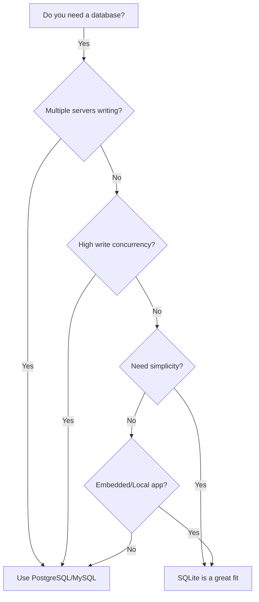
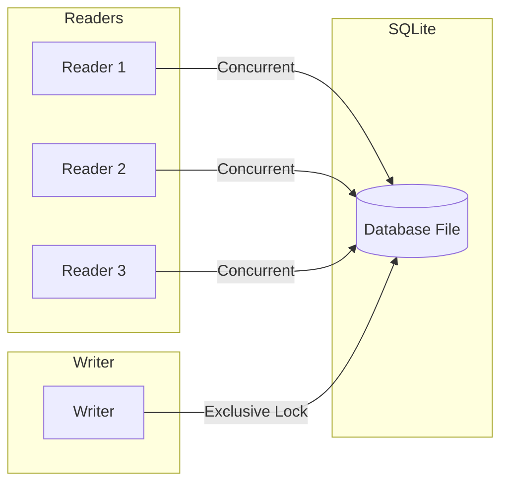

# How to Use SQLite in Node.js Applications

Author: [nawazdhandala](https://www.github.com/nawazdhandala)

Tags: SQLite, Node.js, Database, SQL

Description: Learn how to use SQLite in Node.js applications for efficient local data storage. This comprehensive guide covers setup, CRUD operations, async patterns, migrations, and production best practices.

---

> SQLite is a lightweight, serverless database engine that stores data in a single file. For Node.js applications, it provides an excellent solution for local data storage, caching, prototyping, and applications that do not require a separate database server. This guide walks you through everything you need to know to effectively use SQLite in your Node.js projects.

SQLite is not just for small projects. It handles databases up to 281 terabytes, supports concurrent reads, and is used in production by applications ranging from mobile apps to desktop software. When paired with Node.js, you get a powerful combination for building fast, reliable applications without the complexity of managing a separate database server.

---

## Why SQLite for Node.js?

Before diving into code, let's understand when SQLite makes sense:



| Use Case | SQLite Fit |
|----------|------------|
| **Local data storage** | Excellent - no server needed |
| **Prototyping** | Excellent - zero configuration |
| **Single-server apps** | Good - handles moderate traffic |
| **Desktop/Electron apps** | Excellent - embedded database |
| **Test databases** | Excellent - fast, disposable |
| **High-write concurrency** | Poor - use PostgreSQL instead |
| **Multi-server apps** | Poor - file-based limitations |

---

## Installation and Setup

Node.js has several SQLite libraries. The two most popular are `better-sqlite3` (synchronous, faster) and `sqlite3` (asynchronous, callback-based). We will cover both, with a focus on `better-sqlite3` for most examples due to its superior performance and simpler API.

### Installing better-sqlite3

This is the recommended library for most Node.js applications. It uses synchronous API which is actually faster for SQLite due to its in-process nature:

```bash
# Install better-sqlite3
npm install better-sqlite3

# If you need TypeScript support
npm install @types/better-sqlite3 --save-dev
```

### Installing sqlite3 (Async Alternative)

If you prefer async/await patterns or need callback-based operations:

```bash
# Install sqlite3
npm install sqlite3

# Optional: sql.js for pure JavaScript (no native compilation)
npm install sql.js
```

---

## Basic Database Operations with better-sqlite3

### Creating a Database Connection

The following code creates or opens a database file. If the file does not exist, SQLite creates it automatically:

```javascript
const Database = require('better-sqlite3');

// Open database (creates file if it does not exist)
const db = new Database('myapp.db');

// Enable Write-Ahead Logging for better concurrent read performance
// This is recommended for most applications
db.pragma('journal_mode = WAL');

// Enable foreign key constraints (disabled by default in SQLite)
db.pragma('foreign_keys = ON');

console.log('Database connected successfully');
```

### Creating Tables

Define your schema with CREATE TABLE statements. Always use IF NOT EXISTS to make your code idempotent:

```javascript
const Database = require('better-sqlite3');
const db = new Database('myapp.db');

// Create users table with common column types
db.exec(`
    CREATE TABLE IF NOT EXISTS users (
        id INTEGER PRIMARY KEY AUTOINCREMENT,
        email TEXT NOT NULL UNIQUE,
        username TEXT NOT NULL,
        password_hash TEXT NOT NULL,
        created_at TEXT DEFAULT CURRENT_TIMESTAMP,
        updated_at TEXT DEFAULT CURRENT_TIMESTAMP,
        is_active INTEGER DEFAULT 1
    )
`);

// Create an index for faster email lookups
db.exec(`
    CREATE INDEX IF NOT EXISTS idx_users_email ON users(email)
`);

// Create posts table with foreign key relationship
db.exec(`
    CREATE TABLE IF NOT EXISTS posts (
        id INTEGER PRIMARY KEY AUTOINCREMENT,
        user_id INTEGER NOT NULL,
        title TEXT NOT NULL,
        content TEXT,
        published INTEGER DEFAULT 0,
        created_at TEXT DEFAULT CURRENT_TIMESTAMP,
        FOREIGN KEY (user_id) REFERENCES users(id) ON DELETE CASCADE
    )
`);

console.log('Tables created successfully');
```

---

## CRUD Operations

### Insert (Create)

Use prepared statements for security and performance. Never concatenate user input into SQL strings:

```javascript
const Database = require('better-sqlite3');
const db = new Database('myapp.db');

// Prepare the insert statement once, reuse many times
const insertUser = db.prepare(`
    INSERT INTO users (email, username, password_hash)
    VALUES (@email, @username, @passwordHash)
`);

// Insert a single user using named parameters
const result = insertUser.run({
    email: 'alice@example.com',
    username: 'alice',
    passwordHash: 'hashed_password_here'
});

console.log(`Inserted user with ID: ${result.lastInsertRowid}`);
console.log(`Rows affected: ${result.changes}`);
```

### Insert Multiple Rows

For bulk inserts, wrap multiple operations in a transaction for massive performance gains:

```javascript
const Database = require('better-sqlite3');
const db = new Database('myapp.db');

const insertUser = db.prepare(`
    INSERT INTO users (email, username, password_hash)
    VALUES (@email, @username, @passwordHash)
`);

// Create a transaction function for bulk inserts
// This is much faster than individual inserts
const insertMany = db.transaction((users) => {
    for (const user of users) {
        insertUser.run(user);
    }
});

// Sample data to insert
const users = [
    { email: 'bob@example.com', username: 'bob', passwordHash: 'hash1' },
    { email: 'carol@example.com', username: 'carol', passwordHash: 'hash2' },
    { email: 'dave@example.com', username: 'dave', passwordHash: 'hash3' }
];

// Insert all users in a single transaction
insertMany(users);

console.log(`Inserted ${users.length} users`);
```

### Select (Read)

Fetch data using `.get()` for single rows or `.all()` for multiple rows:

```javascript
const Database = require('better-sqlite3');
const db = new Database('myapp.db');

// Fetch a single user by ID
const getUserById = db.prepare('SELECT * FROM users WHERE id = ?');
const user = getUserById.get(1);
console.log(user);
// Output: { id: 1, email: 'alice@example.com', username: 'alice', ... }

// Fetch a user by email using named parameter
const getUserByEmail = db.prepare('SELECT * FROM users WHERE email = @email');
const alice = getUserByEmail.get({ email: 'alice@example.com' });

// Fetch all active users
const getActiveUsers = db.prepare('SELECT * FROM users WHERE is_active = 1');
const activeUsers = getActiveUsers.all();
console.log(`Found ${activeUsers.length} active users`);

// Fetch with pagination
const getUsersPaginated = db.prepare(`
    SELECT * FROM users
    ORDER BY created_at DESC
    LIMIT @limit OFFSET @offset
`);
const page1 = getUsersPaginated.all({ limit: 10, offset: 0 });
const page2 = getUsersPaginated.all({ limit: 10, offset: 10 });
```

### Using Iterators for Large Result Sets

For large datasets, use `.iterate()` to process rows one at a time without loading everything into memory:

```javascript
const Database = require('better-sqlite3');
const db = new Database('myapp.db');

const getAllUsers = db.prepare('SELECT * FROM users');

// Process rows one at a time - memory efficient for large datasets
for (const user of getAllUsers.iterate()) {
    console.log(`Processing user: ${user.username}`);
    // Process each user without holding all rows in memory
}
```

### Update

Update existing records with prepared statements:

```javascript
const Database = require('better-sqlite3');
const db = new Database('myapp.db');

// Update user email
const updateEmail = db.prepare(`
    UPDATE users
    SET email = @newEmail, updated_at = CURRENT_TIMESTAMP
    WHERE id = @id
`);

const result = updateEmail.run({
    id: 1,
    newEmail: 'alice.new@example.com'
});

if (result.changes > 0) {
    console.log('User email updated successfully');
} else {
    console.log('No user found with that ID');
}

// Update multiple fields
const updateUser = db.prepare(`
    UPDATE users
    SET username = @username, is_active = @isActive, updated_at = CURRENT_TIMESTAMP
    WHERE id = @id
`);

updateUser.run({
    id: 1,
    username: 'alice_updated',
    isActive: 1
});
```

### Delete

Remove records safely with prepared statements:

```javascript
const Database = require('better-sqlite3');
const db = new Database('myapp.db');

// Delete a user by ID
const deleteUser = db.prepare('DELETE FROM users WHERE id = ?');
const result = deleteUser.run(1);

console.log(`Deleted ${result.changes} user(s)`);

// Delete with conditions
const deleteInactiveUsers = db.prepare(`
    DELETE FROM users
    WHERE is_active = 0
    AND created_at < datetime('now', '-30 days')
`);

const cleanupResult = deleteInactiveUsers.run();
console.log(`Cleaned up ${cleanupResult.changes} inactive users`);
```

---

## Transactions

Transactions ensure that multiple operations either all succeed or all fail together. They also dramatically improve performance for bulk operations:

```javascript
const Database = require('better-sqlite3');
const db = new Database('myapp.db');

// Define prepared statements
const debitAccount = db.prepare(`
    UPDATE accounts SET balance = balance - @amount WHERE id = @id
`);

const creditAccount = db.prepare(`
    UPDATE accounts SET balance = balance + @amount WHERE id = @id
`);

const logTransfer = db.prepare(`
    INSERT INTO transfers (from_account, to_account, amount, created_at)
    VALUES (@from, @to, @amount, CURRENT_TIMESTAMP)
`);

// Create a transaction function
const transferMoney = db.transaction((from, to, amount) => {
    // Debit source account
    const debitResult = debitAccount.run({ id: from, amount });
    if (debitResult.changes === 0) {
        throw new Error('Source account not found');
    }

    // Credit destination account
    const creditResult = creditAccount.run({ id: to, amount });
    if (creditResult.changes === 0) {
        throw new Error('Destination account not found');
    }

    // Log the transfer
    logTransfer.run({ from, to, amount });

    return { success: true, amount };
});

// Execute the transaction
try {
    const result = transferMoney(1, 2, 100.00);
    console.log('Transfer completed:', result);
} catch (error) {
    // If any operation fails, all changes are rolled back
    console.error('Transfer failed:', error.message);
}
```

### Nested Transactions with Savepoints

For complex operations, use savepoints to create nested transaction points:

```javascript
const Database = require('better-sqlite3');
const db = new Database('myapp.db');

const outerTransaction = db.transaction(() => {
    // Do some work
    db.prepare('INSERT INTO logs (message) VALUES (?)').run('Started process');

    // Nested transaction using immediate mode
    const innerTransaction = db.transaction(() => {
        db.prepare('INSERT INTO logs (message) VALUES (?)').run('Inner work');
        // This can fail independently
    }).immediate;

    try {
        innerTransaction();
    } catch (error) {
        // Inner failure does not rollback outer transaction
        console.log('Inner transaction failed, continuing outer');
    }

    db.prepare('INSERT INTO logs (message) VALUES (?)').run('Completed process');
});

outerTransaction();
```

---

## Using sqlite3 (Async Library)

If you prefer async/await patterns, here is how to use the `sqlite3` library:

### Basic Setup with Promisification

The sqlite3 library uses callbacks by default. Wrap it with promises for modern async/await usage:

```javascript
const sqlite3 = require('sqlite3').verbose();
const { promisify } = require('util');

class AsyncDatabase {
    constructor(filename) {
        this.db = new sqlite3.Database(filename);
        // Promisify database methods
        this.run = promisify(this.db.run.bind(this.db));
        this.get = promisify(this.db.get.bind(this.db));
        this.all = promisify(this.db.all.bind(this.db));
    }

    // Execute SQL that does not return rows
    async execute(sql, params = []) {
        return new Promise((resolve, reject) => {
            this.db.run(sql, params, function(err) {
                if (err) reject(err);
                else resolve({ lastID: this.lastID, changes: this.changes });
            });
        });
    }

    // Close the database connection
    close() {
        return new Promise((resolve, reject) => {
            this.db.close((err) => {
                if (err) reject(err);
                else resolve();
            });
        });
    }
}

// Usage
async function main() {
    const db = new AsyncDatabase('myapp.db');

    // Create table
    await db.execute(`
        CREATE TABLE IF NOT EXISTS users (
            id INTEGER PRIMARY KEY AUTOINCREMENT,
            email TEXT NOT NULL UNIQUE,
            username TEXT NOT NULL
        )
    `);

    // Insert user
    const result = await db.execute(
        'INSERT INTO users (email, username) VALUES (?, ?)',
        ['test@example.com', 'testuser']
    );
    console.log('Inserted ID:', result.lastID);

    // Query users
    const users = await db.all('SELECT * FROM users');
    console.log('Users:', users);

    await db.close();
}

main().catch(console.error);
```

---

## Building a Database Wrapper Class

For production applications, create a reusable database wrapper that handles common patterns:

```javascript
const Database = require('better-sqlite3');

class SQLiteDB {
    constructor(dbPath, options = {}) {
        this.db = new Database(dbPath, options);
        this.db.pragma('journal_mode = WAL');
        this.db.pragma('foreign_keys = ON');
        this.statements = new Map();
    }

    // Prepare and cache statements for reuse
    prepare(name, sql) {
        if (!this.statements.has(name)) {
            this.statements.set(name, this.db.prepare(sql));
        }
        return this.statements.get(name);
    }

    // Generic find by ID
    findById(table, id) {
        const stmt = this.prepare(
            `findById_${table}`,
            `SELECT * FROM ${table} WHERE id = ?`
        );
        return stmt.get(id);
    }

    // Generic find all with optional conditions
    findAll(table, conditions = {}, options = {}) {
        const { limit = 100, offset = 0, orderBy = 'id' } = options;
        const where = Object.keys(conditions).length > 0
            ? 'WHERE ' + Object.keys(conditions).map(k => `${k} = @${k}`).join(' AND ')
            : '';

        const sql = `SELECT * FROM ${table} ${where} ORDER BY ${orderBy} LIMIT @limit OFFSET @offset`;
        const stmt = this.db.prepare(sql);
        return stmt.all({ ...conditions, limit, offset });
    }

    // Generic insert
    insert(table, data) {
        const columns = Object.keys(data).join(', ');
        const placeholders = Object.keys(data).map(k => `@${k}`).join(', ');
        const sql = `INSERT INTO ${table} (${columns}) VALUES (${placeholders})`;
        const stmt = this.db.prepare(sql);
        return stmt.run(data);
    }

    // Generic update
    update(table, id, data) {
        const sets = Object.keys(data).map(k => `${k} = @${k}`).join(', ');
        const sql = `UPDATE ${table} SET ${sets} WHERE id = @id`;
        const stmt = this.db.prepare(sql);
        return stmt.run({ ...data, id });
    }

    // Generic delete
    delete(table, id) {
        const stmt = this.prepare(
            `delete_${table}`,
            `DELETE FROM ${table} WHERE id = ?`
        );
        return stmt.run(id);
    }

    // Run in transaction
    transaction(fn) {
        return this.db.transaction(fn)();
    }

    // Close connection
    close() {
        this.db.close();
    }
}

// Usage example
const db = new SQLiteDB('myapp.db');

// Insert a user
const result = db.insert('users', {
    email: 'user@example.com',
    username: 'newuser',
    password_hash: 'hashed'
});

// Find user by ID
const user = db.findById('users', result.lastInsertRowid);

// Update user
db.update('users', user.id, { username: 'updateduser' });

// Find all active users
const activeUsers = db.findAll('users', { is_active: 1 }, { limit: 10 });

db.close();
```

---

## Database Migrations

For production applications, manage schema changes with migrations:

```javascript
const Database = require('better-sqlite3');
const fs = require('fs');
const path = require('path');

class Migrator {
    constructor(db, migrationsDir) {
        this.db = db;
        this.migrationsDir = migrationsDir;
        this.initMigrationsTable();
    }

    // Create migrations tracking table
    initMigrationsTable() {
        this.db.exec(`
            CREATE TABLE IF NOT EXISTS migrations (
                id INTEGER PRIMARY KEY AUTOINCREMENT,
                name TEXT NOT NULL UNIQUE,
                executed_at TEXT DEFAULT CURRENT_TIMESTAMP
            )
        `);
    }

    // Get list of executed migrations
    getExecutedMigrations() {
        return this.db.prepare('SELECT name FROM migrations ORDER BY id')
            .all()
            .map(row => row.name);
    }

    // Get pending migrations
    getPendingMigrations() {
        const executed = new Set(this.getExecutedMigrations());
        const files = fs.readdirSync(this.migrationsDir)
            .filter(f => f.endsWith('.sql'))
            .sort();

        return files.filter(f => !executed.has(f));
    }

    // Run all pending migrations
    migrate() {
        const pending = this.getPendingMigrations();

        if (pending.length === 0) {
            console.log('No pending migrations');
            return;
        }

        const runMigration = this.db.transaction((filename) => {
            const filepath = path.join(this.migrationsDir, filename);
            const sql = fs.readFileSync(filepath, 'utf8');

            console.log(`Running migration: ${filename}`);
            this.db.exec(sql);

            this.db.prepare('INSERT INTO migrations (name) VALUES (?)')
                .run(filename);
        });

        for (const migration of pending) {
            runMigration(migration);
        }

        console.log(`Executed ${pending.length} migration(s)`);
    }

    // Rollback last migration (requires down migrations)
    rollback() {
        const executed = this.getExecutedMigrations();
        if (executed.length === 0) {
            console.log('No migrations to rollback');
            return;
        }

        const lastMigration = executed[executed.length - 1];
        const downFile = lastMigration.replace('.sql', '.down.sql');
        const downPath = path.join(this.migrationsDir, downFile);

        if (!fs.existsSync(downPath)) {
            throw new Error(`Down migration not found: ${downFile}`);
        }

        const rollbackMigration = this.db.transaction(() => {
            const sql = fs.readFileSync(downPath, 'utf8');
            this.db.exec(sql);

            this.db.prepare('DELETE FROM migrations WHERE name = ?')
                .run(lastMigration);
        });

        rollbackMigration();
        console.log(`Rolled back: ${lastMigration}`);
    }
}

// Usage
const db = new Database('myapp.db');
const migrator = new Migrator(db, './migrations');
migrator.migrate();
```

### Example Migration Files

Create migration files in a `migrations` directory:

```sql
-- migrations/001_create_users.sql
CREATE TABLE users (
    id INTEGER PRIMARY KEY AUTOINCREMENT,
    email TEXT NOT NULL UNIQUE,
    username TEXT NOT NULL,
    password_hash TEXT NOT NULL,
    created_at TEXT DEFAULT CURRENT_TIMESTAMP
);

CREATE INDEX idx_users_email ON users(email);
```

```sql
-- migrations/001_create_users.down.sql
DROP INDEX IF EXISTS idx_users_email;
DROP TABLE IF EXISTS users;
```

```sql
-- migrations/002_add_user_roles.sql
ALTER TABLE users ADD COLUMN role TEXT DEFAULT 'user';
CREATE INDEX idx_users_role ON users(role);
```

---

## Connection Pooling and Concurrency

SQLite handles concurrent reads well but allows only one writer at a time. Here is how to manage this effectively:



### Handling Busy Timeouts

Configure the busy timeout to wait for locks instead of failing immediately:

```javascript
const Database = require('better-sqlite3');

// Set busy timeout to 5 seconds (5000ms)
// The database will wait up to 5 seconds for a lock before throwing an error
const db = new Database('myapp.db', {
    timeout: 5000
});

db.pragma('journal_mode = WAL');

// WAL mode allows concurrent reads while writing
// Without WAL, readers are blocked during writes
```

### Connection Per Request Pattern

For web applications, you can use a single connection or create connections per request:

```javascript
const Database = require('better-sqlite3');
const express = require('express');

// Singleton connection (recommended for most cases)
const db = new Database('myapp.db');
db.pragma('journal_mode = WAL');

const app = express();
app.use(express.json());

// Middleware to add database to request
app.use((req, res, next) => {
    req.db = db;
    next();
});

app.get('/users', (req, res) => {
    const users = req.db.prepare('SELECT * FROM users LIMIT 100').all();
    res.json(users);
});

app.post('/users', (req, res) => {
    const { email, username } = req.body;
    const stmt = req.db.prepare(
        'INSERT INTO users (email, username) VALUES (?, ?)'
    );

    try {
        const result = stmt.run(email, username);
        res.status(201).json({ id: result.lastInsertRowid });
    } catch (error) {
        if (error.code === 'SQLITE_CONSTRAINT_UNIQUE') {
            res.status(409).json({ error: 'Email already exists' });
        } else {
            throw error;
        }
    }
});

// Clean shutdown
process.on('SIGINT', () => {
    db.close();
    process.exit(0);
});

app.listen(3000);
```

---

## Full-Text Search

SQLite includes a powerful full-text search engine called FTS5:

```javascript
const Database = require('better-sqlite3');
const db = new Database('myapp.db');

// Create FTS5 virtual table for full-text search
db.exec(`
    CREATE VIRTUAL TABLE IF NOT EXISTS posts_fts USING fts5(
        title,
        content,
        content='posts',
        content_rowid='id'
    )
`);

// Create triggers to keep FTS index synchronized with posts table
db.exec(`
    CREATE TRIGGER IF NOT EXISTS posts_ai AFTER INSERT ON posts BEGIN
        INSERT INTO posts_fts(rowid, title, content)
        VALUES (new.id, new.title, new.content);
    END
`);

db.exec(`
    CREATE TRIGGER IF NOT EXISTS posts_ad AFTER DELETE ON posts BEGIN
        INSERT INTO posts_fts(posts_fts, rowid, title, content)
        VALUES('delete', old.id, old.title, old.content);
    END
`);

db.exec(`
    CREATE TRIGGER IF NOT EXISTS posts_au AFTER UPDATE ON posts BEGIN
        INSERT INTO posts_fts(posts_fts, rowid, title, content)
        VALUES('delete', old.id, old.title, old.content);
        INSERT INTO posts_fts(rowid, title, content)
        VALUES (new.id, new.title, new.content);
    END
`);

// Search posts using full-text search
function searchPosts(query) {
    const stmt = db.prepare(`
        SELECT posts.*, bm25(posts_fts) as rank
        FROM posts_fts
        JOIN posts ON posts.id = posts_fts.rowid
        WHERE posts_fts MATCH ?
        ORDER BY rank
        LIMIT 20
    `);

    return stmt.all(query);
}

// Usage
const results = searchPosts('nodejs sqlite tutorial');
console.log(results);
```

---

## JSON Support

SQLite has excellent JSON support for storing and querying semi-structured data:

```javascript
const Database = require('better-sqlite3');
const db = new Database('myapp.db');

// Create table with JSON column
db.exec(`
    CREATE TABLE IF NOT EXISTS events (
        id INTEGER PRIMARY KEY AUTOINCREMENT,
        type TEXT NOT NULL,
        data TEXT NOT NULL,
        created_at TEXT DEFAULT CURRENT_TIMESTAMP
    )
`);

// Insert JSON data (store as string, SQLite handles it)
const insertEvent = db.prepare(`
    INSERT INTO events (type, data) VALUES (?, json(?))
`);

insertEvent.run('user_signup', JSON.stringify({
    userId: 123,
    email: 'user@example.com',
    plan: 'premium',
    metadata: {
        source: 'google',
        campaign: 'summer2024'
    }
}));

// Query JSON fields using json_extract
const getEventsBySource = db.prepare(`
    SELECT
        id,
        type,
        json_extract(data, '$.userId') as user_id,
        json_extract(data, '$.metadata.source') as source,
        created_at
    FROM events
    WHERE json_extract(data, '$.metadata.source') = ?
`);

const googleSignups = getEventsBySource.all('google');
console.log(googleSignups);

// Aggregate JSON data
const countByPlan = db.prepare(`
    SELECT
        json_extract(data, '$.plan') as plan,
        COUNT(*) as count
    FROM events
    WHERE type = 'user_signup'
    GROUP BY json_extract(data, '$.plan')
`);

console.log(countByPlan.all());
```

---

## Testing with In-Memory Databases

SQLite's in-memory database is perfect for fast, isolated tests:

```javascript
const Database = require('better-sqlite3');

class TestDatabase {
    constructor() {
        // Create in-memory database for tests
        this.db = new Database(':memory:');
        this.setupSchema();
    }

    setupSchema() {
        this.db.exec(`
            CREATE TABLE users (
                id INTEGER PRIMARY KEY AUTOINCREMENT,
                email TEXT NOT NULL UNIQUE,
                username TEXT NOT NULL
            )
        `);
    }

    // Clone the current state for parallel test isolation
    clone() {
        const newDb = new Database(':memory:');
        this.db.backup(newDb);
        return newDb;
    }

    close() {
        this.db.close();
    }
}

// Example test using the test database
function runTests() {
    const testDb = new TestDatabase();

    // Test 1: Insert user
    const insertStmt = testDb.db.prepare(
        'INSERT INTO users (email, username) VALUES (?, ?)'
    );
    const result = insertStmt.run('test@example.com', 'testuser');
    console.assert(result.lastInsertRowid === 1, 'Insert should return ID 1');

    // Test 2: Duplicate email should fail
    try {
        insertStmt.run('test@example.com', 'another');
        console.assert(false, 'Should have thrown on duplicate');
    } catch (error) {
        console.assert(
            error.code === 'SQLITE_CONSTRAINT_UNIQUE',
            'Should be constraint error'
        );
    }

    // Test 3: Query user
    const user = testDb.db.prepare('SELECT * FROM users WHERE id = ?').get(1);
    console.assert(user.email === 'test@example.com', 'Email should match');

    testDb.close();
    console.log('All tests passed!');
}

runTests();
```

---

## Performance Optimization

### Indexing Strategy

Create indexes for columns frequently used in WHERE clauses and JOINs:

```javascript
const Database = require('better-sqlite3');
const db = new Database('myapp.db');

// Analyze query performance with EXPLAIN QUERY PLAN
function analyzeQuery(sql) {
    const plan = db.prepare(`EXPLAIN QUERY PLAN ${sql}`).all();
    console.log('Query Plan:');
    plan.forEach(row => console.log(`  ${row.detail}`));
    return plan;
}

// Check if query uses index
analyzeQuery('SELECT * FROM users WHERE email = "test@example.com"');
// Should show: SEARCH users USING INDEX idx_users_email

// Create composite index for common query patterns
db.exec(`
    CREATE INDEX IF NOT EXISTS idx_posts_user_published
    ON posts(user_id, published)
`);

// This query now uses the composite index
analyzeQuery('SELECT * FROM posts WHERE user_id = 1 AND published = 1');
```

### Batch Operations

Group multiple operations for significant speed improvements:

```javascript
const Database = require('better-sqlite3');
const db = new Database('myapp.db');

// Slow: Individual inserts
console.time('individual');
for (let i = 0; i < 1000; i++) {
    db.prepare('INSERT INTO test (value) VALUES (?)').run(i);
}
console.timeEnd('individual'); // ~500ms

// Fast: Batched in transaction
console.time('batched');
const insert = db.prepare('INSERT INTO test (value) VALUES (?)');
const insertMany = db.transaction((items) => {
    for (const item of items) {
        insert.run(item);
    }
});
insertMany(Array.from({ length: 1000 }, (_, i) => i));
console.timeEnd('batched'); // ~10ms (50x faster!)
```

### Connection Configuration

Optimize connection settings for your use case:

```javascript
const Database = require('better-sqlite3');

const db = new Database('myapp.db');

// Enable WAL mode for better concurrency
db.pragma('journal_mode = WAL');

// Set cache size (negative value = KB, positive = pages)
// -64000 = 64MB cache
db.pragma('cache_size = -64000');

// Set synchronous mode
// NORMAL is safe for most apps, FULL for maximum durability
db.pragma('synchronous = NORMAL');

// Increase temp store to memory for faster temp tables
db.pragma('temp_store = MEMORY');

// Enable memory-mapped I/O (256MB)
// Improves read performance significantly
db.pragma('mmap_size = 268435456');

// Optimize checkpoint behavior for WAL mode
db.pragma('wal_autocheckpoint = 1000');
```

---

## Error Handling Best Practices

Handle SQLite-specific errors appropriately:

```javascript
const Database = require('better-sqlite3');
const db = new Database('myapp.db');

class DatabaseError extends Error {
    constructor(message, code, originalError) {
        super(message);
        this.code = code;
        this.originalError = originalError;
    }
}

function handleDatabaseOperation(operation) {
    try {
        return operation();
    } catch (error) {
        // Handle specific SQLite errors
        switch (error.code) {
            case 'SQLITE_CONSTRAINT_UNIQUE':
                throw new DatabaseError(
                    'Record already exists',
                    'DUPLICATE_ENTRY',
                    error
                );

            case 'SQLITE_CONSTRAINT_FOREIGNKEY':
                throw new DatabaseError(
                    'Referenced record does not exist',
                    'FOREIGN_KEY_VIOLATION',
                    error
                );

            case 'SQLITE_BUSY':
                throw new DatabaseError(
                    'Database is busy, try again',
                    'DATABASE_BUSY',
                    error
                );

            case 'SQLITE_CONSTRAINT_NOTNULL':
                throw new DatabaseError(
                    'Required field is missing',
                    'MISSING_REQUIRED_FIELD',
                    error
                );

            default:
                throw new DatabaseError(
                    'Database operation failed',
                    'DATABASE_ERROR',
                    error
                );
        }
    }
}

// Usage
try {
    handleDatabaseOperation(() => {
        db.prepare('INSERT INTO users (email) VALUES (?)').run(null);
    });
} catch (error) {
    if (error instanceof DatabaseError) {
        console.log(`Error: ${error.message} (${error.code})`);
    }
}
```

---

## Best Practices Summary

| Practice | Description |
|----------|-------------|
| **Use WAL mode** | Enable `journal_mode = WAL` for better concurrent read performance |
| **Prepared statements** | Always use parameterized queries to prevent SQL injection |
| **Transactions for bulk ops** | Wrap multiple writes in transactions for 10-100x speed improvement |
| **Close connections** | Always close database connections on application shutdown |
| **Foreign keys** | Enable with `PRAGMA foreign_keys = ON` - they are off by default |
| **Indexes** | Create indexes for columns used in WHERE and JOIN clauses |
| **Error handling** | Catch and handle SQLite-specific error codes appropriately |
| **Test with :memory:** | Use in-memory databases for fast, isolated unit tests |
| **Backup regularly** | Use the backup API or file copy (with WAL checkpoint first) |

---

## Complete Example Application

Here is a complete Express.js application demonstrating all concepts:

```javascript
const express = require('express');
const Database = require('better-sqlite3');

// Initialize database
const db = new Database('app.db');
db.pragma('journal_mode = WAL');
db.pragma('foreign_keys = ON');

// Create schema
db.exec(`
    CREATE TABLE IF NOT EXISTS todos (
        id INTEGER PRIMARY KEY AUTOINCREMENT,
        title TEXT NOT NULL,
        completed INTEGER DEFAULT 0,
        created_at TEXT DEFAULT CURRENT_TIMESTAMP
    )
`);

// Prepared statements
const statements = {
    getAllTodos: db.prepare('SELECT * FROM todos ORDER BY created_at DESC'),
    getTodoById: db.prepare('SELECT * FROM todos WHERE id = ?'),
    createTodo: db.prepare('INSERT INTO todos (title) VALUES (?)'),
    updateTodo: db.prepare('UPDATE todos SET title = ?, completed = ? WHERE id = ?'),
    deleteTodo: db.prepare('DELETE FROM todos WHERE id = ?')
};

// Express app
const app = express();
app.use(express.json());

// GET all todos
app.get('/todos', (req, res) => {
    const todos = statements.getAllTodos.all();
    res.json(todos);
});

// GET single todo
app.get('/todos/:id', (req, res) => {
    const todo = statements.getTodoById.get(req.params.id);
    if (!todo) {
        return res.status(404).json({ error: 'Todo not found' });
    }
    res.json(todo);
});

// POST create todo
app.post('/todos', (req, res) => {
    const { title } = req.body;
    if (!title) {
        return res.status(400).json({ error: 'Title is required' });
    }

    const result = statements.createTodo.run(title);
    const todo = statements.getTodoById.get(result.lastInsertRowid);
    res.status(201).json(todo);
});

// PUT update todo
app.put('/todos/:id', (req, res) => {
    const { title, completed } = req.body;
    const existing = statements.getTodoById.get(req.params.id);

    if (!existing) {
        return res.status(404).json({ error: 'Todo not found' });
    }

    statements.updateTodo.run(
        title ?? existing.title,
        completed ?? existing.completed,
        req.params.id
    );

    const updated = statements.getTodoById.get(req.params.id);
    res.json(updated);
});

// DELETE todo
app.delete('/todos/:id', (req, res) => {
    const result = statements.deleteTodo.run(req.params.id);
    if (result.changes === 0) {
        return res.status(404).json({ error: 'Todo not found' });
    }
    res.status(204).send();
});

// Graceful shutdown
process.on('SIGINT', () => {
    console.log('Closing database connection...');
    db.close();
    process.exit(0);
});

const PORT = process.env.PORT || 3000;
app.listen(PORT, () => {
    console.log(`Server running on http://localhost:${PORT}`);
});
```

---

## Conclusion

SQLite with Node.js provides a powerful, zero-configuration database solution for many application types. Key takeaways:

1. **Use better-sqlite3** for most applications due to its superior performance and simpler synchronous API
2. **Enable WAL mode** immediately after opening a connection for better concurrency
3. **Always use prepared statements** with parameters to prevent SQL injection
4. **Wrap bulk operations in transactions** for dramatic performance improvements
5. **Create appropriate indexes** for columns used in queries
6. **Handle errors gracefully** using SQLite-specific error codes
7. **Test with in-memory databases** for fast, isolated unit tests

SQLite is production-ready for single-server applications, desktop apps, IoT devices, and anywhere you need reliable local data storage without the complexity of a database server.
