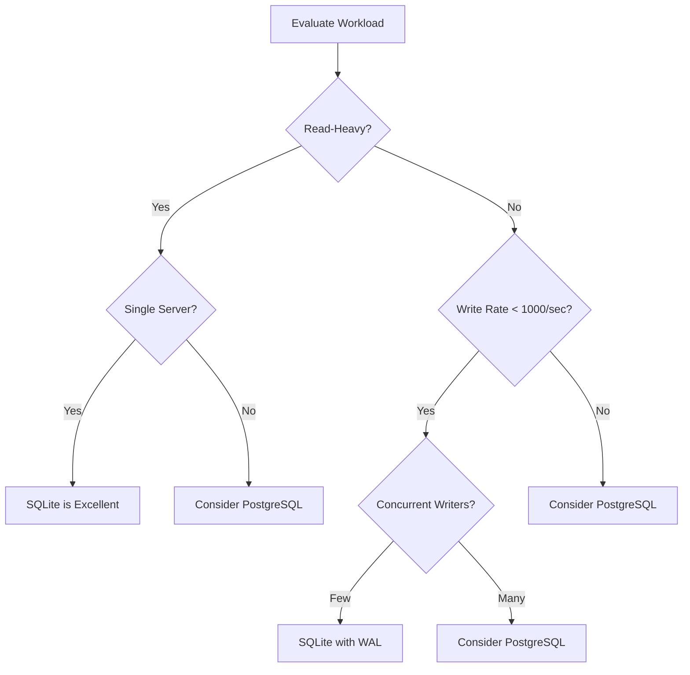
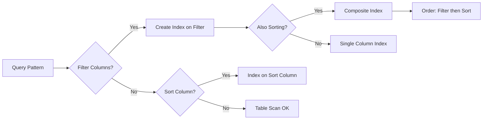
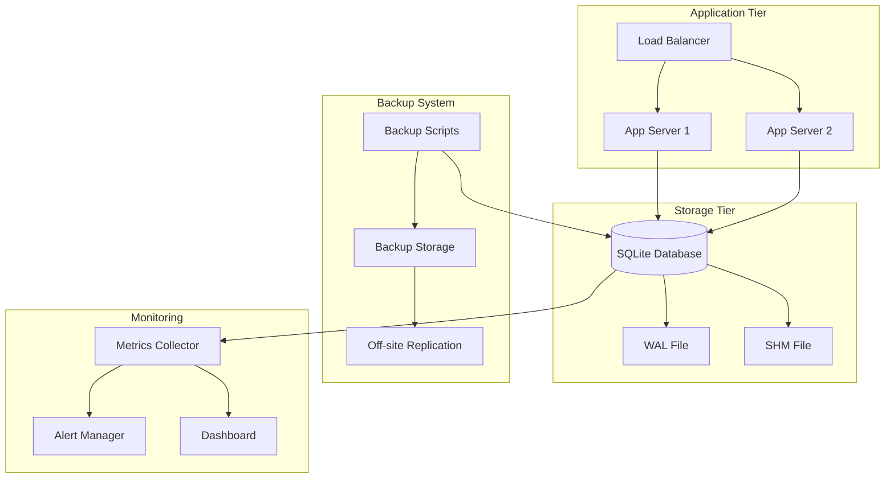

# How to Set Up SQLite for Production Use

Author: [nawazdhandala](https://www.github.com/nawazdhandala)

Tags: SQLite, Database, Production, Performance, DevOps

Description: A comprehensive guide to setting up SQLite for production use. Learn configuration best practices, performance optimization, backup strategies, concurrency handling, and monitoring techniques for reliable SQLite deployments.

---

SQLite is often dismissed as a development-only database, but this perception is outdated. Many high-traffic applications run SQLite in production successfully, including some serving millions of requests per day. The key lies in proper configuration and understanding SQLite's strengths and limitations.

In this guide, we will cover everything you need to know to deploy SQLite confidently in production environments. We will explore configuration settings, performance optimization, backup strategies, concurrency handling, and monitoring best practices.

## When to Use SQLite in Production

Before diving into configuration, it is important to understand when SQLite is a good fit for production workloads.



SQLite excels in these scenarios:

- **Read-heavy workloads** where writes are infrequent
- **Single-server deployments** without horizontal scaling requirements
- **Embedded applications** where simplicity is valued
- **Edge computing** where low resource usage matters
- **Small to medium datasets** that fit comfortably on a single machine

SQLite may not be ideal for:

- High write concurrency from many simultaneous writers
- Multi-server deployments requiring database replication
- Very large datasets exceeding available disk space
- Real-time analytics on massive data volumes

## Essential Production Configuration

The default SQLite configuration prioritizes compatibility over performance. For production use, several settings should be adjusted.

### Enabling Write-Ahead Logging (WAL) Mode

WAL mode is the most important configuration change for production SQLite. It provides better concurrency and performance compared to the default rollback journal mode.

The following SQL commands enable WAL mode and configure related settings. These should be run once when the database is created or during initial setup:

```sql
-- Enable WAL mode for better concurrency
-- WAL allows readers and writers to work simultaneously
PRAGMA journal_mode = WAL;

-- Set synchronous mode to NORMAL for a balance of safety and speed
-- FULL is safer but slower, OFF is fastest but risks corruption
PRAGMA synchronous = NORMAL;

-- Set busy timeout to 5 seconds to handle lock contention
-- This prevents immediate failures when the database is locked
PRAGMA busy_timeout = 5000;

-- Enable foreign key enforcement (disabled by default)
-- Essential for data integrity in production
PRAGMA foreign_keys = ON;
```

### Memory Configuration

Proper memory settings significantly impact SQLite performance. The cache size and memory-mapped I/O settings control how much data SQLite keeps in memory.

This configuration optimizes memory usage for a server with ample RAM. Adjust the values based on your available memory and dataset size:

```sql
-- Set cache size to 64MB (negative value means kilobytes)
-- Larger cache reduces disk I/O for frequently accessed data
PRAGMA cache_size = -64000;

-- Enable memory-mapped I/O for faster reads
-- Set to 256MB here, adjust based on database size
PRAGMA mmap_size = 268435456;

-- Set temp_store to memory for faster temporary operations
-- Uses RAM instead of disk for temp tables and indexes
PRAGMA temp_store = MEMORY;
```

### Complete Production Configuration Script

Here is a complete Python script that initializes a production-ready SQLite database with all recommended settings:

```python
import sqlite3
import os

def configure_production_database(db_path: str) -> sqlite3.Connection:
    """
    Configure a SQLite database for production use.

    This function applies all recommended production settings
    and returns a properly configured connection.
    """
    # Ensure the directory exists
    db_dir = os.path.dirname(db_path)
    if db_dir and not os.path.exists(db_dir):
        os.makedirs(db_dir)

    # Create connection with recommended settings
    conn = sqlite3.connect(
        db_path,
        # Timeout for acquiring locks (in seconds)
        timeout=30.0,
        # Enable connection checking
        check_same_thread=False,
        # Use Row factory for dict-like access
        isolation_level=None  # Autocommit mode, we'll manage transactions
    )

    # Enable row factory for easier data access
    conn.row_factory = sqlite3.Row

    # Apply production PRAGMA settings
    pragmas = [
        # Enable Write-Ahead Logging for better concurrency
        "PRAGMA journal_mode = WAL",

        # NORMAL synchronous is safe with WAL mode
        "PRAGMA synchronous = NORMAL",

        # 5 second busy timeout
        "PRAGMA busy_timeout = 5000",

        # Enable foreign key constraints
        "PRAGMA foreign_keys = ON",

        # 64MB cache size
        "PRAGMA cache_size = -64000",

        # 256MB memory-mapped I/O
        "PRAGMA mmap_size = 268435456",

        # Store temp tables in memory
        "PRAGMA temp_store = MEMORY",

        # Enable automatic vacuuming
        "PRAGMA auto_vacuum = INCREMENTAL",

        # Page size of 4KB (optimal for most systems)
        "PRAGMA page_size = 4096",
    ]

    cursor = conn.cursor()
    for pragma in pragmas:
        cursor.execute(pragma)

    # Verify WAL mode was enabled
    result = cursor.execute("PRAGMA journal_mode").fetchone()
    if result[0].lower() != "wal":
        raise RuntimeError("Failed to enable WAL mode")

    return conn


# Example usage
if __name__ == "__main__":
    db = configure_production_database("/var/lib/myapp/production.db")
    print("Production database configured successfully")

    # Verify settings
    cursor = db.cursor()
    for pragma in ["journal_mode", "synchronous", "cache_size", "foreign_keys"]:
        result = cursor.execute(f"PRAGMA {pragma}").fetchone()
        print(f"{pragma}: {result[0]}")
```

## Performance Optimization

Beyond basic configuration, several techniques can dramatically improve SQLite performance in production.

### Index Design Strategy

Proper indexing is crucial for query performance. The following diagram shows how to think about index design:



Here is how to create effective indexes for common query patterns:

```sql
-- Create a table for demonstrating index strategies
CREATE TABLE orders (
    id INTEGER PRIMARY KEY,
    customer_id INTEGER NOT NULL,
    status TEXT NOT NULL,
    created_at DATETIME NOT NULL DEFAULT CURRENT_TIMESTAMP,
    total_amount DECIMAL(10, 2) NOT NULL,
    FOREIGN KEY (customer_id) REFERENCES customers(id)
);

-- Index for filtering by customer and sorting by date
-- Composite indexes should list filter columns before sort columns
CREATE INDEX idx_orders_customer_date
ON orders(customer_id, created_at DESC);

-- Index for filtering by status
-- Use this for queries like: WHERE status = 'pending'
CREATE INDEX idx_orders_status
ON orders(status);

-- Covering index that includes commonly selected columns
-- This allows the query to be satisfied entirely from the index
CREATE INDEX idx_orders_customer_covering
ON orders(customer_id, status, total_amount, created_at);

-- Partial index for active orders only
-- Smaller index that only includes rows matching the condition
CREATE INDEX idx_orders_pending
ON orders(customer_id, created_at)
WHERE status = 'pending';
```

### Query Optimization Techniques

Analyzing and optimizing queries is essential for production performance. SQLite provides the EXPLAIN QUERY PLAN command to understand how queries execute:

```sql
-- Use EXPLAIN QUERY PLAN to analyze query execution
-- This shows whether indexes are being used effectively
EXPLAIN QUERY PLAN
SELECT * FROM orders
WHERE customer_id = 123
AND status = 'pending'
ORDER BY created_at DESC
LIMIT 10;

-- Output shows the execution plan:
-- SEARCH orders USING INDEX idx_orders_customer_date (customer_id=?)
-- This indicates the index is being used efficiently
```

The following Python code demonstrates how to monitor and optimize slow queries:

```python
import sqlite3
import time
import logging
from contextlib import contextmanager
from typing import Generator, Any

# Configure logging for query monitoring
logging.basicConfig(level=logging.INFO)
logger = logging.getLogger("sqlite_monitor")

# Threshold for slow query warnings (in seconds)
SLOW_QUERY_THRESHOLD = 0.1


@contextmanager
def timed_query(conn: sqlite3.Connection, sql: str,
                params: tuple = ()) -> Generator[sqlite3.Cursor, None, None]:
    """
    Context manager that times query execution and logs slow queries.

    Use this to identify queries that need optimization.
    """
    start_time = time.perf_counter()
    cursor = conn.cursor()

    try:
        cursor.execute(sql, params)
        yield cursor
    finally:
        elapsed = time.perf_counter() - start_time

        if elapsed > SLOW_QUERY_THRESHOLD:
            # Log slow queries with execution plan
            plan_cursor = conn.cursor()
            plan_cursor.execute(f"EXPLAIN QUERY PLAN {sql}", params)
            plan = plan_cursor.fetchall()

            logger.warning(
                f"Slow query detected ({elapsed:.3f}s):\n"
                f"SQL: {sql}\n"
                f"Params: {params}\n"
                f"Plan: {plan}"
            )
        else:
            logger.debug(f"Query completed in {elapsed:.3f}s: {sql[:100]}")


def analyze_table_indexes(conn: sqlite3.Connection, table: str) -> dict:
    """
    Analyze indexes for a table and suggest improvements.

    Returns information about existing indexes and potential issues.
    """
    cursor = conn.cursor()

    # Get table schema
    cursor.execute(f"PRAGMA table_info({table})")
    columns = {row[1]: row[2] for row in cursor.fetchall()}

    # Get existing indexes
    cursor.execute(f"PRAGMA index_list({table})")
    indexes = cursor.fetchall()

    index_details = []
    for idx in indexes:
        cursor.execute(f"PRAGMA index_info({idx[1]})")
        idx_columns = [row[2] for row in cursor.fetchall()]
        index_details.append({
            "name": idx[1],
            "unique": bool(idx[2]),
            "columns": idx_columns
        })

    # Get table statistics
    cursor.execute(f"SELECT COUNT(*) FROM {table}")
    row_count = cursor.fetchone()[0]

    return {
        "table": table,
        "row_count": row_count,
        "columns": columns,
        "indexes": index_details
    }


# Example: Run ANALYZE to update query planner statistics
def update_statistics(conn: sqlite3.Connection) -> None:
    """
    Update SQLite's internal statistics for better query planning.

    Run this periodically or after significant data changes.
    """
    cursor = conn.cursor()

    # ANALYZE updates the sqlite_stat1 table used by the query planner
    cursor.execute("ANALYZE")

    logger.info("Database statistics updated")
```

## Connection Management

Proper connection management is critical for production reliability. SQLite handles connections differently than client-server databases.

### Connection Pooling

While SQLite connections are lightweight, pooling helps manage concurrent access. Here is a robust connection pool implementation:

```python
import sqlite3
import threading
import queue
from typing import Optional
from contextlib import contextmanager
import time


class SQLiteConnectionPool:
    """
    A thread-safe connection pool for SQLite.

    This pool manages a fixed number of connections and handles
    acquisition, release, and health checking.
    """

    def __init__(
        self,
        database: str,
        max_connections: int = 5,
        timeout: float = 30.0,
        pragmas: Optional[list] = None
    ):
        self.database = database
        self.max_connections = max_connections
        self.timeout = timeout
        self.pragmas = pragmas or []

        # Queue to hold available connections
        self._pool: queue.Queue = queue.Queue(maxsize=max_connections)

        # Lock for pool management
        self._lock = threading.Lock()

        # Track total connections created
        self._connections_created = 0

        # Initialize the pool
        self._initialize_pool()

    def _initialize_pool(self) -> None:
        """Create initial connections for the pool."""
        for _ in range(self.max_connections):
            conn = self._create_connection()
            self._pool.put(conn)

    def _create_connection(self) -> sqlite3.Connection:
        """
        Create a new configured connection.

        Applies all production pragmas to the connection.
        """
        conn = sqlite3.connect(
            self.database,
            timeout=self.timeout,
            check_same_thread=False,
            isolation_level=None
        )
        conn.row_factory = sqlite3.Row

        # Apply default production pragmas
        default_pragmas = [
            "PRAGMA journal_mode = WAL",
            "PRAGMA synchronous = NORMAL",
            "PRAGMA busy_timeout = 5000",
            "PRAGMA foreign_keys = ON",
            "PRAGMA cache_size = -64000",
        ]

        cursor = conn.cursor()
        for pragma in default_pragmas + self.pragmas:
            cursor.execute(pragma)

        with self._lock:
            self._connections_created += 1

        return conn

    def _validate_connection(self, conn: sqlite3.Connection) -> bool:
        """Check if a connection is still valid."""
        try:
            conn.execute("SELECT 1")
            return True
        except sqlite3.Error:
            return False

    def get_connection(self) -> sqlite3.Connection:
        """
        Acquire a connection from the pool.

        Raises TimeoutError if no connection is available within timeout.
        """
        try:
            conn = self._pool.get(timeout=self.timeout)

            # Validate the connection before returning
            if not self._validate_connection(conn):
                conn.close()
                conn = self._create_connection()

            return conn
        except queue.Empty:
            raise TimeoutError(
                f"Could not acquire connection within {self.timeout}s"
            )

    def release_connection(self, conn: sqlite3.Connection) -> None:
        """Return a connection to the pool."""
        try:
            # Reset any uncommitted transactions
            conn.rollback()
            self._pool.put_nowait(conn)
        except queue.Full:
            # Pool is full, close the extra connection
            conn.close()

    @contextmanager
    def connection(self):
        """
        Context manager for automatic connection handling.

        Usage:
            with pool.connection() as conn:
                conn.execute("SELECT * FROM users")
        """
        conn = self.get_connection()
        try:
            yield conn
        finally:
            self.release_connection(conn)

    def close_all(self) -> None:
        """Close all connections in the pool."""
        while not self._pool.empty():
            try:
                conn = self._pool.get_nowait()
                conn.close()
            except queue.Empty:
                break

    def stats(self) -> dict:
        """Return pool statistics."""
        return {
            "max_connections": self.max_connections,
            "available": self._pool.qsize(),
            "total_created": self._connections_created,
            "in_use": self.max_connections - self._pool.qsize()
        }


# Example usage
pool = SQLiteConnectionPool(
    database="/var/lib/myapp/production.db",
    max_connections=10
)

# Using the context manager
with pool.connection() as conn:
    cursor = conn.cursor()
    cursor.execute("SELECT * FROM users WHERE active = 1")
    users = cursor.fetchall()
```

## Backup Strategies

Reliable backups are essential for production databases. SQLite provides several backup methods suitable for different scenarios.

### Online Backup with VACUUM INTO

The VACUUM INTO command creates a backup without blocking writers. This is the recommended method for production backups:

```python
import sqlite3
import os
import datetime
import shutil
from pathlib import Path


def online_backup(
    source_db: str,
    backup_dir: str,
    compression: bool = True
) -> str:
    """
    Create an online backup of a SQLite database.

    Uses VACUUM INTO for a consistent backup without blocking writes.
    Returns the path to the backup file.
    """
    # Create backup directory if it does not exist
    Path(backup_dir).mkdir(parents=True, exist_ok=True)

    # Generate backup filename with timestamp
    timestamp = datetime.datetime.now().strftime("%Y%m%d_%H%M%S")
    backup_filename = f"backup_{timestamp}.db"
    backup_path = os.path.join(backup_dir, backup_filename)

    # Connect to source database
    conn = sqlite3.connect(source_db)

    try:
        # VACUUM INTO creates a fresh, defragmented copy
        # This also optimizes the database structure
        conn.execute(f"VACUUM INTO '{backup_path}'")

        # Verify the backup
        verify_backup(backup_path, conn)

        if compression:
            # Compress the backup
            import gzip
            compressed_path = backup_path + ".gz"

            with open(backup_path, 'rb') as f_in:
                with gzip.open(compressed_path, 'wb') as f_out:
                    shutil.copyfileobj(f_in, f_out)

            # Remove uncompressed backup
            os.remove(backup_path)
            backup_path = compressed_path

        return backup_path
    finally:
        conn.close()


def verify_backup(backup_path: str, source_conn: sqlite3.Connection) -> None:
    """
    Verify that a backup is valid and consistent.

    Compares table counts between source and backup.
    """
    backup_conn = sqlite3.connect(backup_path)

    try:
        # Get list of tables from source
        source_tables = source_conn.execute(
            "SELECT name FROM sqlite_master WHERE type='table'"
        ).fetchall()

        for (table_name,) in source_tables:
            if table_name.startswith("sqlite_"):
                continue

            # Compare row counts
            source_count = source_conn.execute(
                f"SELECT COUNT(*) FROM {table_name}"
            ).fetchone()[0]

            backup_count = backup_conn.execute(
                f"SELECT COUNT(*) FROM {table_name}"
            ).fetchone()[0]

            if source_count != backup_count:
                raise ValueError(
                    f"Row count mismatch in {table_name}: "
                    f"source={source_count}, backup={backup_count}"
                )

        # Run integrity check on backup
        result = backup_conn.execute("PRAGMA integrity_check").fetchone()
        if result[0] != "ok":
            raise ValueError(f"Backup integrity check failed: {result[0]}")
    finally:
        backup_conn.close()


def cleanup_old_backups(backup_dir: str, keep_days: int = 7) -> int:
    """
    Remove backups older than the specified number of days.

    Returns the number of backups deleted.
    """
    cutoff = datetime.datetime.now() - datetime.timedelta(days=keep_days)
    deleted = 0

    for filename in os.listdir(backup_dir):
        if not filename.startswith("backup_"):
            continue

        filepath = os.path.join(backup_dir, filename)
        file_time = datetime.datetime.fromtimestamp(os.path.getmtime(filepath))

        if file_time < cutoff:
            os.remove(filepath)
            deleted += 1

    return deleted


# Example backup script
if __name__ == "__main__":
    import logging

    logging.basicConfig(level=logging.INFO)
    logger = logging.getLogger("backup")

    source = "/var/lib/myapp/production.db"
    backup_dir = "/var/lib/myapp/backups"

    try:
        # Create backup
        backup_path = online_backup(source, backup_dir, compression=True)
        logger.info(f"Backup created: {backup_path}")

        # Cleanup old backups
        deleted = cleanup_old_backups(backup_dir, keep_days=7)
        logger.info(f"Cleaned up {deleted} old backups")
    except Exception as e:
        logger.error(f"Backup failed: {e}")
        raise
```

### Point-in-Time Recovery with WAL

WAL mode enables a simple form of point-in-time recovery. The WAL file contains recent transactions that have not been checkpointed:

```python
import sqlite3
import os
import shutil
from datetime import datetime


def backup_with_wal(source_db: str, backup_dir: str) -> dict:
    """
    Create a backup that includes WAL files for point-in-time recovery.

    This method copies the database and associated WAL/SHM files atomically.
    """
    timestamp = datetime.now().strftime("%Y%m%d_%H%M%S")
    backup_subdir = os.path.join(backup_dir, f"full_backup_{timestamp}")
    os.makedirs(backup_subdir, exist_ok=True)

    # Files to backup
    db_files = [
        source_db,                    # Main database
        source_db + "-wal",           # Write-ahead log
        source_db + "-shm",           # Shared memory file
    ]

    backed_up = []

    # Get exclusive access for consistent backup
    conn = sqlite3.connect(source_db)
    try:
        # Begin immediate transaction to get write lock
        conn.execute("BEGIN IMMEDIATE")

        for filepath in db_files:
            if os.path.exists(filepath):
                filename = os.path.basename(filepath)
                dest = os.path.join(backup_subdir, filename)
                shutil.copy2(filepath, dest)
                backed_up.append(dest)

        # Record checkpoint position
        wal_checkpoint = conn.execute("PRAGMA wal_checkpoint(PASSIVE)").fetchone()

        conn.execute("ROLLBACK")
    finally:
        conn.close()

    return {
        "backup_path": backup_subdir,
        "files": backed_up,
        "wal_checkpoint": wal_checkpoint,
        "timestamp": timestamp
    }
```

## Handling Concurrency

SQLite's concurrency model differs from traditional databases. Understanding and working with this model is essential for production reliability.

### Write Queue Pattern

For applications with many writers, implementing a write queue serializes writes and prevents contention:

```python
import sqlite3
import queue
import threading
from typing import Callable, Any, Optional
from dataclasses import dataclass
import logging

logger = logging.getLogger("write_queue")


@dataclass
class WriteOperation:
    """Represents a single write operation to be executed."""
    sql: str
    params: tuple = ()
    callback: Optional[Callable[[Any], None]] = None
    error_callback: Optional[Callable[[Exception], None]] = None


class SQLiteWriteQueue:
    """
    Serializes write operations to prevent SQLite lock contention.

    All writes go through a single thread, while reads can happen
    concurrently from multiple threads.
    """

    def __init__(self, database: str):
        self.database = database
        self._queue: queue.Queue = queue.Queue()
        self._running = False
        self._writer_thread: Optional[threading.Thread] = None
        self._conn: Optional[sqlite3.Connection] = None

    def start(self) -> None:
        """Start the write queue processor."""
        if self._running:
            return

        self._running = True
        self._conn = self._create_connection()
        self._writer_thread = threading.Thread(
            target=self._process_writes,
            daemon=True
        )
        self._writer_thread.start()
        logger.info("Write queue started")

    def stop(self) -> None:
        """Stop the write queue processor."""
        self._running = False
        # Add sentinel to unblock the queue
        self._queue.put(None)
        if self._writer_thread:
            self._writer_thread.join(timeout=5.0)
        if self._conn:
            self._conn.close()
        logger.info("Write queue stopped")

    def _create_connection(self) -> sqlite3.Connection:
        """Create a connection configured for writing."""
        conn = sqlite3.connect(self.database, timeout=30.0)
        conn.execute("PRAGMA journal_mode = WAL")
        conn.execute("PRAGMA synchronous = NORMAL")
        conn.execute("PRAGMA busy_timeout = 30000")
        return conn

    def _process_writes(self) -> None:
        """Main loop for processing write operations."""
        while self._running:
            try:
                operation = self._queue.get(timeout=1.0)

                if operation is None:
                    continue

                self._execute_write(operation)
            except queue.Empty:
                continue
            except Exception as e:
                logger.error(f"Write processor error: {e}")

    def _execute_write(self, operation: WriteOperation) -> None:
        """Execute a single write operation."""
        try:
            cursor = self._conn.cursor()
            cursor.execute(operation.sql, operation.params)
            self._conn.commit()

            result = cursor.lastrowid

            if operation.callback:
                operation.callback(result)
        except Exception as e:
            logger.error(f"Write operation failed: {e}")
            self._conn.rollback()

            if operation.error_callback:
                operation.error_callback(e)

    def execute(
        self,
        sql: str,
        params: tuple = (),
        callback: Optional[Callable] = None,
        error_callback: Optional[Callable] = None
    ) -> None:
        """
        Queue a write operation for execution.

        The operation will be executed asynchronously by the writer thread.
        """
        operation = WriteOperation(
            sql=sql,
            params=params,
            callback=callback,
            error_callback=error_callback
        )
        self._queue.put(operation)

    def execute_sync(self, sql: str, params: tuple = ()) -> Any:
        """
        Execute a write operation synchronously.

        Blocks until the operation completes and returns the result.
        """
        result_event = threading.Event()
        result_holder = {"value": None, "error": None}

        def on_success(value):
            result_holder["value"] = value
            result_event.set()

        def on_error(error):
            result_holder["error"] = error
            result_event.set()

        self.execute(sql, params, on_success, on_error)

        # Wait for completion
        result_event.wait(timeout=30.0)

        if result_holder["error"]:
            raise result_holder["error"]

        return result_holder["value"]


# Example usage
write_queue = SQLiteWriteQueue("/var/lib/myapp/production.db")
write_queue.start()

# Async write
write_queue.execute(
    "INSERT INTO events (type, data) VALUES (?, ?)",
    ("user_login", '{"user_id": 123}'),
    callback=lambda id: print(f"Inserted with id: {id}")
)

# Sync write
row_id = write_queue.execute_sync(
    "INSERT INTO users (name, email) VALUES (?, ?)",
    ("John Doe", "john@example.com")
)
```

### Handling SQLITE_BUSY Errors

Even with proper configuration, SQLITE_BUSY errors can occur under heavy load. Here is a robust retry mechanism:

```python
import sqlite3
import time
import random
from functools import wraps
from typing import Callable, TypeVar, Any

T = TypeVar('T')


def retry_on_busy(
    max_retries: int = 5,
    base_delay: float = 0.1,
    max_delay: float = 2.0,
    jitter: bool = True
) -> Callable:
    """
    Decorator that retries a function on SQLITE_BUSY errors.

    Uses exponential backoff with optional jitter for better
    distribution of retry attempts.
    """
    def decorator(func: Callable[..., T]) -> Callable[..., T]:
        @wraps(func)
        def wrapper(*args, **kwargs) -> T:
            last_error = None

            for attempt in range(max_retries):
                try:
                    return func(*args, **kwargs)
                except sqlite3.OperationalError as e:
                    if "database is locked" not in str(e):
                        raise

                    last_error = e

                    if attempt < max_retries - 1:
                        # Calculate delay with exponential backoff
                        delay = min(base_delay * (2 ** attempt), max_delay)

                        if jitter:
                            # Add random jitter to prevent thundering herd
                            delay = delay * (0.5 + random.random())

                        time.sleep(delay)

            # All retries exhausted
            raise sqlite3.OperationalError(
                f"Database locked after {max_retries} retries"
            ) from last_error

        return wrapper
    return decorator


# Example usage
@retry_on_busy(max_retries=5)
def insert_user(conn: sqlite3.Connection, name: str, email: str) -> int:
    """Insert a user with automatic retry on lock."""
    cursor = conn.cursor()
    cursor.execute(
        "INSERT INTO users (name, email) VALUES (?, ?)",
        (name, email)
    )
    conn.commit()
    return cursor.lastrowid
```

## Monitoring and Health Checks

Production systems require monitoring to detect issues before they become critical. Here is a comprehensive monitoring solution:

```python
import sqlite3
import os
import time
from dataclasses import dataclass
from typing import Dict, List, Optional
import json


@dataclass
class DatabaseHealth:
    """Container for database health metrics."""
    status: str  # healthy, degraded, unhealthy
    integrity_check: str
    wal_size_mb: float
    db_size_mb: float
    free_pages: int
    page_count: int
    fragmentation_ratio: float
    checkpoint_age_seconds: float
    issues: List[str]


class SQLiteMonitor:
    """
    Monitor SQLite database health and performance.

    Provides metrics suitable for alerting and dashboards.
    """

    # Thresholds for health checks
    WAL_SIZE_WARNING_MB = 100
    WAL_SIZE_CRITICAL_MB = 500
    FRAGMENTATION_WARNING = 0.2
    FRAGMENTATION_CRITICAL = 0.5

    def __init__(self, database: str):
        self.database = database
        self._last_checkpoint = time.time()

    def _get_connection(self) -> sqlite3.Connection:
        """Get a read-only connection for monitoring."""
        conn = sqlite3.connect(
            f"file:{self.database}?mode=ro",
            uri=True,
            timeout=5.0
        )
        return conn

    def check_health(self) -> DatabaseHealth:
        """
        Perform comprehensive health check.

        Returns a DatabaseHealth object with current status.
        """
        issues = []

        conn = self._get_connection()
        try:
            cursor = conn.cursor()

            # Run integrity check (quick check for production)
            integrity = cursor.execute(
                "PRAGMA quick_check"
            ).fetchone()[0]

            if integrity != "ok":
                issues.append(f"Integrity check failed: {integrity}")

            # Get database size
            page_count = cursor.execute(
                "PRAGMA page_count"
            ).fetchone()[0]

            page_size = cursor.execute(
                "PRAGMA page_size"
            ).fetchone()[0]

            db_size_mb = (page_count * page_size) / (1024 * 1024)

            # Get free pages (fragmentation indicator)
            freelist_count = cursor.execute(
                "PRAGMA freelist_count"
            ).fetchone()[0]

            fragmentation_ratio = freelist_count / page_count if page_count > 0 else 0

            if fragmentation_ratio > self.FRAGMENTATION_CRITICAL:
                issues.append(
                    f"Critical fragmentation: {fragmentation_ratio:.2%}"
                )
            elif fragmentation_ratio > self.FRAGMENTATION_WARNING:
                issues.append(
                    f"High fragmentation: {fragmentation_ratio:.2%}"
                )

            # Check WAL file size
            wal_path = self.database + "-wal"
            wal_size_mb = 0

            if os.path.exists(wal_path):
                wal_size_mb = os.path.getsize(wal_path) / (1024 * 1024)

                if wal_size_mb > self.WAL_SIZE_CRITICAL_MB:
                    issues.append(
                        f"Critical WAL size: {wal_size_mb:.1f}MB"
                    )
                elif wal_size_mb > self.WAL_SIZE_WARNING_MB:
                    issues.append(
                        f"Large WAL size: {wal_size_mb:.1f}MB"
                    )

            # Calculate checkpoint age
            checkpoint_age = time.time() - self._last_checkpoint

            # Determine overall status
            if any("Critical" in issue for issue in issues) or integrity != "ok":
                status = "unhealthy"
            elif issues:
                status = "degraded"
            else:
                status = "healthy"

            return DatabaseHealth(
                status=status,
                integrity_check=integrity,
                wal_size_mb=wal_size_mb,
                db_size_mb=db_size_mb,
                free_pages=freelist_count,
                page_count=page_count,
                fragmentation_ratio=fragmentation_ratio,
                checkpoint_age_seconds=checkpoint_age,
                issues=issues
            )
        finally:
            conn.close()

    def get_metrics(self) -> Dict[str, float]:
        """
        Get metrics suitable for time-series monitoring.

        Returns a dictionary of metric names and values.
        """
        health = self.check_health()

        return {
            "sqlite_db_size_mb": health.db_size_mb,
            "sqlite_wal_size_mb": health.wal_size_mb,
            "sqlite_page_count": health.page_count,
            "sqlite_free_pages": health.free_pages,
            "sqlite_fragmentation_ratio": health.fragmentation_ratio,
            "sqlite_checkpoint_age_seconds": health.checkpoint_age_seconds,
            "sqlite_health_status": {
                "healthy": 0, "degraded": 1, "unhealthy": 2
            }.get(health.status, 3)
        }

    def perform_maintenance(self) -> Dict[str, Any]:
        """
        Perform routine maintenance operations.

        Should be run during low-traffic periods.
        """
        results = {}

        conn = sqlite3.connect(self.database, timeout=30.0)
        try:
            cursor = conn.cursor()

            # Checkpoint the WAL
            checkpoint_result = cursor.execute(
                "PRAGMA wal_checkpoint(TRUNCATE)"
            ).fetchone()

            results["checkpoint"] = {
                "blocked": checkpoint_result[0],
                "wal_pages": checkpoint_result[1],
                "checkpointed_pages": checkpoint_result[2]
            }

            self._last_checkpoint = time.time()

            # Update statistics
            cursor.execute("ANALYZE")
            results["analyze"] = "completed"

            # Incremental vacuum if auto_vacuum is enabled
            cursor.execute("PRAGMA incremental_vacuum(1000)")
            results["vacuum"] = "completed"

            conn.commit()

            return results
        finally:
            conn.close()


# Example: Expose metrics for Prometheus
def prometheus_metrics(monitor: SQLiteMonitor) -> str:
    """Format metrics in Prometheus exposition format."""
    metrics = monitor.get_metrics()
    lines = []

    for name, value in metrics.items():
        lines.append(f"{name} {value}")

    return "\n".join(lines)


# Example: Health check endpoint for load balancer
def health_check_endpoint(monitor: SQLiteMonitor) -> tuple:
    """
    Health check suitable for load balancer integration.

    Returns (status_code, response_body).
    """
    health = monitor.check_health()

    response = {
        "status": health.status,
        "checks": {
            "integrity": health.integrity_check == "ok",
            "wal_size": health.wal_size_mb < SQLiteMonitor.WAL_SIZE_CRITICAL_MB,
            "fragmentation": health.fragmentation_ratio < SQLiteMonitor.FRAGMENTATION_CRITICAL
        },
        "issues": health.issues
    }

    if health.status == "healthy":
        return (200, response)
    elif health.status == "degraded":
        return (200, response)  # Still serving, but needs attention
    else:
        return (503, response)  # Unhealthy, remove from rotation
```

## Security Best Practices

Production databases require proper security measures to protect data.

### File Permissions and Encryption

Set appropriate file permissions and consider encryption for sensitive data:

```python
import sqlite3
import os
import stat


def secure_database_setup(db_path: str) -> None:
    """
    Configure secure file permissions for SQLite database.

    Restricts access to owner only and sets proper directory permissions.
    """
    db_dir = os.path.dirname(db_path)

    # Create directory with restricted permissions
    if not os.path.exists(db_dir):
        os.makedirs(db_dir, mode=0o700)

    # Create the database file
    conn = sqlite3.connect(db_path)
    conn.close()

    # Set restrictive file permissions (owner read/write only)
    os.chmod(db_path, stat.S_IRUSR | stat.S_IWUSR)  # 0600

    # Set directory permissions (owner only)
    os.chmod(db_dir, stat.S_IRWXU)  # 0700

    # Verify permissions
    file_stat = os.stat(db_path)
    if file_stat.st_mode & 0o077:  # Check if group/other has any access
        raise SecurityError("Database file has insecure permissions")


# For encrypted databases, use SQLCipher
# pip install sqlcipher3
def create_encrypted_database(db_path: str, key: str) -> sqlite3.Connection:
    """
    Create an encrypted SQLite database using SQLCipher.

    Requires sqlcipher3 package to be installed.
    """
    try:
        import sqlcipher3 as sqlite3_encrypted
    except ImportError:
        raise ImportError(
            "SQLCipher required for encryption. "
            "Install with: pip install sqlcipher3"
        )

    conn = sqlite3_encrypted.connect(db_path)

    # Set encryption key
    conn.execute(f"PRAGMA key = '{key}'")

    # Verify encryption is working
    conn.execute("SELECT count(*) FROM sqlite_master")

    # Apply production settings
    conn.execute("PRAGMA journal_mode = WAL")
    conn.execute("PRAGMA synchronous = NORMAL")

    return conn
```

### SQL Injection Prevention

Always use parameterized queries to prevent SQL injection:

```python
import sqlite3
from typing import Any, List, Tuple


class SafeQueryBuilder:
    """
    Helper class for building safe parameterized queries.

    Prevents SQL injection by never interpolating user input into SQL.
    """

    @staticmethod
    def insert(
        conn: sqlite3.Connection,
        table: str,
        data: dict
    ) -> int:
        """
        Safely insert a row into a table.

        The table name is validated, and all values are parameterized.
        """
        # Validate table name (alphanumeric and underscore only)
        if not table.replace("_", "").isalnum():
            raise ValueError(f"Invalid table name: {table}")

        columns = list(data.keys())
        placeholders = ", ".join("?" * len(columns))
        column_names = ", ".join(columns)

        sql = f"INSERT INTO {table} ({column_names}) VALUES ({placeholders})"

        cursor = conn.cursor()
        cursor.execute(sql, tuple(data.values()))
        conn.commit()

        return cursor.lastrowid

    @staticmethod
    def select(
        conn: sqlite3.Connection,
        table: str,
        columns: List[str] = None,
        where: dict = None,
        order_by: str = None,
        limit: int = None
    ) -> List[sqlite3.Row]:
        """
        Safely select rows from a table.

        All filter values are parameterized to prevent injection.
        """
        # Validate table name
        if not table.replace("_", "").isalnum():
            raise ValueError(f"Invalid table name: {table}")

        # Build column list
        if columns:
            # Validate column names
            for col in columns:
                if not col.replace("_", "").isalnum():
                    raise ValueError(f"Invalid column name: {col}")
            column_str = ", ".join(columns)
        else:
            column_str = "*"

        sql = f"SELECT {column_str} FROM {table}"
        params: List[Any] = []

        # Build WHERE clause
        if where:
            conditions = []
            for key, value in where.items():
                if not key.replace("_", "").isalnum():
                    raise ValueError(f"Invalid column name: {key}")
                conditions.append(f"{key} = ?")
                params.append(value)

            sql += " WHERE " + " AND ".join(conditions)

        # Add ORDER BY
        if order_by:
            # Validate order_by column
            order_col = order_by.replace(" DESC", "").replace(" ASC", "").strip()
            if not order_col.replace("_", "").isalnum():
                raise ValueError(f"Invalid order column: {order_col}")
            sql += f" ORDER BY {order_by}"

        # Add LIMIT
        if limit:
            sql += " LIMIT ?"
            params.append(limit)

        cursor = conn.cursor()
        cursor.execute(sql, tuple(params))

        return cursor.fetchall()


# Example usage demonstrating safe queries
conn = sqlite3.connect(":memory:")
conn.row_factory = sqlite3.Row

# Create test table
conn.execute("""
    CREATE TABLE users (
        id INTEGER PRIMARY KEY,
        name TEXT NOT NULL,
        email TEXT NOT NULL
    )
""")

# Safe insert
SafeQueryBuilder.insert(conn, "users", {
    "name": "John'; DROP TABLE users;--",  # Attempted injection
    "email": "john@example.com"
})

# Safe select - the injection attempt is stored as literal text
results = SafeQueryBuilder.select(
    conn,
    "users",
    columns=["name", "email"],
    where={"name": "John'; DROP TABLE users;--"}
)
```

## Deployment Architecture

The following diagram shows a recommended production architecture for SQLite:



Key architectural considerations:

1. **Single writer pattern**: Route all writes through a single application instance or use a write queue
2. **Local storage**: Keep the database on local NVMe/SSD storage, not network-attached
3. **Backup strategy**: Regular automated backups with off-site replication
4. **Monitoring**: Continuous monitoring of database health and performance

## Conclusion

SQLite is a capable production database when properly configured and operated. The key success factors are:

- **Enable WAL mode** for better concurrency and crash recovery
- **Configure appropriate timeouts** and busy handling
- **Implement proper backup strategies** with verification
- **Monitor database health** and perform regular maintenance
- **Use connection pooling** and write serialization for high-concurrency workloads

By following the patterns and configurations in this guide, you can run SQLite reliably in production for many use cases traditionally served by heavier database systems.

For monitoring your SQLite databases and the applications that depend on them, consider using [OneUptime](https://oneuptime.com). OneUptime provides comprehensive monitoring capabilities including uptime monitoring, performance metrics, and alerting that can help you maintain healthy production SQLite deployments. With features like custom health checks and metric tracking, you can detect and respond to database issues before they impact your users.
