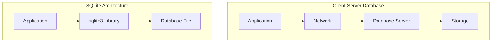
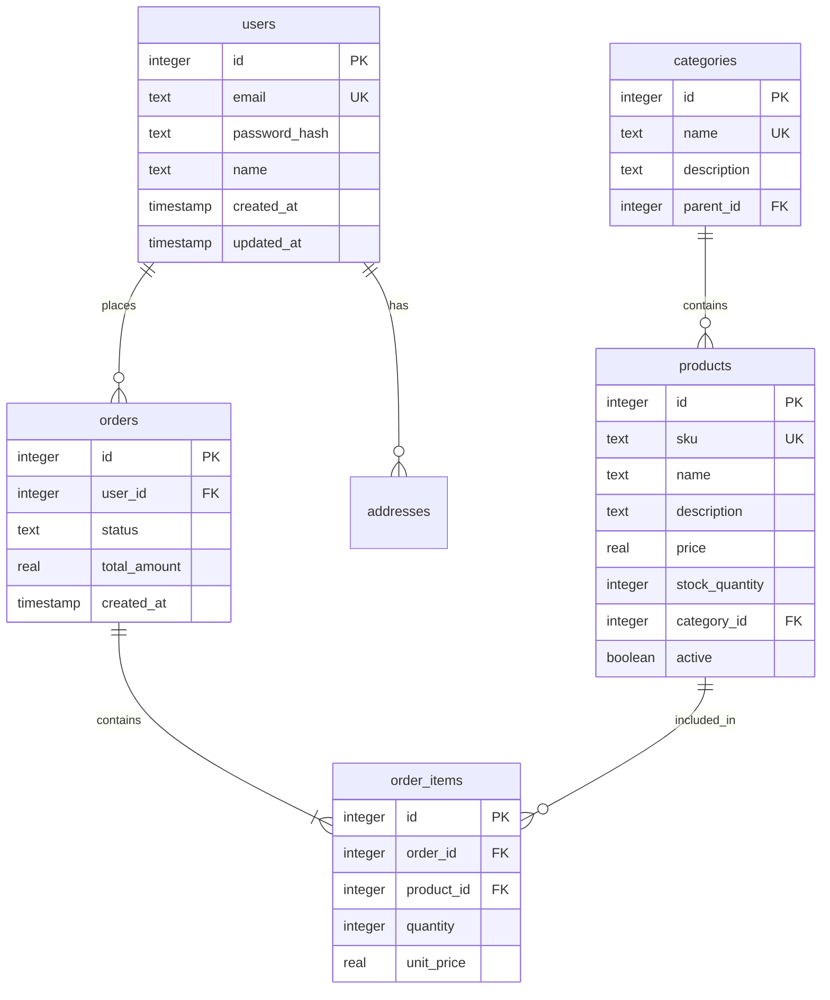
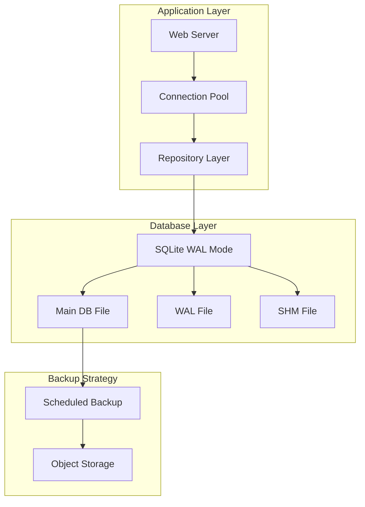

# How to Use SQLite in Python Applications

Author: [nawazdhandala](https://www.github.com/nawazdhandala)

Tags: SQLite, Python, Database, SQL

Description: A comprehensive guide to using SQLite in Python applications. Learn database design, advanced queries, connection pooling, performance optimization, migrations, and production best practices with practical examples.

---

> SQLite is one of the most deployed databases in the world, powering everything from mobile apps to desktop software to embedded systems. Python's built-in sqlite3 module makes it remarkably easy to add persistent storage to your applications without the complexity of setting up a database server.

This guide goes beyond basic CRUD operations to cover real-world patterns you will need when building production applications with SQLite and Python.

---

## Understanding SQLite Architecture

SQLite differs fundamentally from client-server databases like PostgreSQL or MySQL. Understanding these differences helps you make better design decisions.



**Key characteristics of SQLite:**

- **Serverless:** No separate database process to configure or manage
- **Zero-configuration:** No setup, administration, or permission management needed
- **Self-contained:** The entire database is stored in a single cross-platform file
- **ACID compliant:** Full support for transactions with atomic commit and rollback
- **Concurrent reads:** Multiple processes can read simultaneously

---

## When to Use SQLite

SQLite excels in specific scenarios. Understanding where it shines helps you choose the right tool for your project.

**Best suited for:**
- Desktop and mobile applications
- Embedded systems and IoT devices
- Development and testing environments
- Small to medium websites (up to ~100K hits/day)
- Data analysis and reporting tools
- Application file formats (replacing custom binary formats)
- Caching and session storage

**Consider alternatives when:**
- You need high write concurrency from multiple processes
- Your dataset exceeds several gigabytes
- You require network access to the database
- You need replication or clustering

---

## Setting Up Your Project

Let's start with a proper project structure that separates concerns and makes testing easier.

The following project structure organizes your SQLite-based application into logical components. The database module handles all database operations, while models define your data structures.

```
myapp/
    __init__.py
    database/
        __init__.py
        connection.py
        migrations.py
        repositories.py
    models/
        __init__.py
        user.py
        product.py
    config.py
    main.py
```

### Connection Management

This connection manager implements the singleton pattern to ensure you have a single database connection throughout your application's lifecycle. It also provides proper cleanup on application shutdown.

```python
# database/connection.py
# Implements connection management with thread-local storage and automatic cleanup
import sqlite3
import threading
from contextlib import contextmanager
from pathlib import Path
from typing import Optional

class DatabaseConnection:
    """
    Thread-safe SQLite connection manager.

    Uses thread-local storage to provide each thread with its own connection,
    preventing the "SQLite objects created in a thread can only be used in
    that same thread" error.
    """

    _instance: Optional['DatabaseConnection'] = None
    _lock = threading.Lock()

    def __new__(cls, db_path: str = "app.db"):
        # Singleton pattern ensures only one instance manages connections
        if cls._instance is None:
            with cls._lock:
                if cls._instance is None:
                    cls._instance = super().__new__(cls)
                    cls._instance._initialize(db_path)
        return cls._instance

    def _initialize(self, db_path: str):
        """Initialize the connection manager with database path."""
        self.db_path = Path(db_path)
        # Thread-local storage for per-thread connections
        self._local = threading.local()

    def _get_connection(self) -> sqlite3.Connection:
        """Get or create a connection for the current thread."""
        if not hasattr(self._local, 'connection') or self._local.connection is None:
            # Create new connection for this thread
            conn = sqlite3.connect(
                str(self.db_path),
                detect_types=sqlite3.PARSE_DECLTYPES | sqlite3.PARSE_COLNAMES,
                check_same_thread=False  # We handle thread safety ourselves
            )
            # Enable foreign key support (disabled by default in SQLite)
            conn.execute("PRAGMA foreign_keys = ON")
            # Use Row factory for dict-like access to columns
            conn.row_factory = sqlite3.Row
            self._local.connection = conn
        return self._local.connection

    @contextmanager
    def transaction(self):
        """
        Context manager for database transactions.

        Automatically commits on success or rolls back on exception.
        """
        conn = self._get_connection()
        try:
            yield conn
            conn.commit()
        except Exception:
            conn.rollback()
            raise

    @contextmanager
    def cursor(self):
        """Context manager that provides a cursor with automatic cleanup."""
        conn = self._get_connection()
        cursor = conn.cursor()
        try:
            yield cursor
        finally:
            cursor.close()

    def execute(self, sql: str, params: tuple = ()):
        """Execute a single SQL statement and return the cursor."""
        conn = self._get_connection()
        return conn.execute(sql, params)

    def executemany(self, sql: str, params_list: list):
        """Execute a SQL statement with multiple parameter sets."""
        conn = self._get_connection()
        return conn.executemany(sql, params_list)

    def close(self):
        """Close the connection for the current thread."""
        if hasattr(self._local, 'connection') and self._local.connection:
            self._local.connection.close()
            self._local.connection = None


# Global database instance - initialize once in your application startup
db = DatabaseConnection()
```

---

## Database Schema Design

Good schema design is crucial for SQLite performance. Let's create a practical e-commerce schema that demonstrates relationships and constraints.



### Schema Migration System

This migration system tracks which migrations have been applied and runs them in order. It is essential for evolving your database schema safely in production.

```python
# database/migrations.py
# Handles database schema versioning and migration execution
import sqlite3
from datetime import datetime
from typing import List, Callable, Tuple
from .connection import db

# Each migration is a tuple of (version, description, up_sql, down_sql)
Migration = Tuple[int, str, str, str]

# Define all migrations in order
MIGRATIONS: List[Migration] = [
    (
        1,
        "Create users table",
        """
        CREATE TABLE IF NOT EXISTS users (
            id INTEGER PRIMARY KEY AUTOINCREMENT,
            email TEXT NOT NULL UNIQUE,
            password_hash TEXT NOT NULL,
            name TEXT NOT NULL,
            created_at TIMESTAMP DEFAULT CURRENT_TIMESTAMP,
            updated_at TIMESTAMP DEFAULT CURRENT_TIMESTAMP
        );
        CREATE INDEX IF NOT EXISTS idx_users_email ON users(email);
        """,
        "DROP TABLE IF EXISTS users;"
    ),
    (
        2,
        "Create categories table",
        """
        CREATE TABLE IF NOT EXISTS categories (
            id INTEGER PRIMARY KEY AUTOINCREMENT,
            name TEXT NOT NULL UNIQUE,
            description TEXT,
            parent_id INTEGER REFERENCES categories(id) ON DELETE SET NULL
        );
        CREATE INDEX IF NOT EXISTS idx_categories_parent ON categories(parent_id);
        """,
        "DROP TABLE IF EXISTS categories;"
    ),
    (
        3,
        "Create products table",
        """
        CREATE TABLE IF NOT EXISTS products (
            id INTEGER PRIMARY KEY AUTOINCREMENT,
            sku TEXT NOT NULL UNIQUE,
            name TEXT NOT NULL,
            description TEXT,
            price REAL NOT NULL CHECK(price >= 0),
            stock_quantity INTEGER NOT NULL DEFAULT 0 CHECK(stock_quantity >= 0),
            category_id INTEGER REFERENCES categories(id) ON DELETE SET NULL,
            active BOOLEAN NOT NULL DEFAULT 1,
            created_at TIMESTAMP DEFAULT CURRENT_TIMESTAMP,
            updated_at TIMESTAMP DEFAULT CURRENT_TIMESTAMP
        );
        CREATE INDEX IF NOT EXISTS idx_products_category ON products(category_id);
        CREATE INDEX IF NOT EXISTS idx_products_active ON products(active) WHERE active = 1;
        """,
        "DROP TABLE IF EXISTS products;"
    ),
    (
        4,
        "Create orders and order_items tables",
        """
        CREATE TABLE IF NOT EXISTS orders (
            id INTEGER PRIMARY KEY AUTOINCREMENT,
            user_id INTEGER NOT NULL REFERENCES users(id) ON DELETE CASCADE,
            status TEXT NOT NULL DEFAULT 'pending'
                CHECK(status IN ('pending', 'processing', 'shipped', 'delivered', 'cancelled')),
            total_amount REAL NOT NULL DEFAULT 0,
            created_at TIMESTAMP DEFAULT CURRENT_TIMESTAMP,
            updated_at TIMESTAMP DEFAULT CURRENT_TIMESTAMP
        );
        CREATE INDEX IF NOT EXISTS idx_orders_user ON orders(user_id);
        CREATE INDEX IF NOT EXISTS idx_orders_status ON orders(status);

        CREATE TABLE IF NOT EXISTS order_items (
            id INTEGER PRIMARY KEY AUTOINCREMENT,
            order_id INTEGER NOT NULL REFERENCES orders(id) ON DELETE CASCADE,
            product_id INTEGER NOT NULL REFERENCES products(id) ON DELETE RESTRICT,
            quantity INTEGER NOT NULL CHECK(quantity > 0),
            unit_price REAL NOT NULL CHECK(unit_price >= 0)
        );
        CREATE INDEX IF NOT EXISTS idx_order_items_order ON order_items(order_id);
        """,
        """
        DROP TABLE IF EXISTS order_items;
        DROP TABLE IF EXISTS orders;
        """
    ),
    (
        5,
        "Create addresses table",
        """
        CREATE TABLE IF NOT EXISTS addresses (
            id INTEGER PRIMARY KEY AUTOINCREMENT,
            user_id INTEGER NOT NULL REFERENCES users(id) ON DELETE CASCADE,
            address_type TEXT NOT NULL CHECK(address_type IN ('billing', 'shipping')),
            street TEXT NOT NULL,
            city TEXT NOT NULL,
            state TEXT,
            postal_code TEXT NOT NULL,
            country TEXT NOT NULL DEFAULT 'US',
            is_default BOOLEAN NOT NULL DEFAULT 0,
            created_at TIMESTAMP DEFAULT CURRENT_TIMESTAMP
        );
        CREATE INDEX IF NOT EXISTS idx_addresses_user ON addresses(user_id);
        """,
        "DROP TABLE IF EXISTS addresses;"
    ),
]


class MigrationManager:
    """
    Manages database migrations with version tracking.

    Migrations are applied in order and tracked in a schema_migrations table.
    Supports both upgrade and downgrade operations.
    """

    def __init__(self):
        self._ensure_migrations_table()

    def _ensure_migrations_table(self):
        """Create the migrations tracking table if it does not exist."""
        with db.transaction() as conn:
            conn.execute("""
                CREATE TABLE IF NOT EXISTS schema_migrations (
                    version INTEGER PRIMARY KEY,
                    description TEXT NOT NULL,
                    applied_at TIMESTAMP DEFAULT CURRENT_TIMESTAMP
                )
            """)

    def get_current_version(self) -> int:
        """Get the highest applied migration version."""
        result = db.execute(
            "SELECT COALESCE(MAX(version), 0) FROM schema_migrations"
        ).fetchone()
        return result[0]

    def get_applied_migrations(self) -> List[int]:
        """Get list of all applied migration versions."""
        rows = db.execute(
            "SELECT version FROM schema_migrations ORDER BY version"
        ).fetchall()
        return [row[0] for row in rows]

    def migrate(self, target_version: int = None):
        """
        Run pending migrations up to target_version.

        If target_version is None, runs all pending migrations.
        """
        current = self.get_current_version()
        target = target_version or max(m[0] for m in MIGRATIONS)

        if current >= target:
            print(f"Database already at version {current}")
            return

        # Run each pending migration in order
        for version, description, up_sql, _ in MIGRATIONS:
            if version > current and version <= target:
                print(f"Applying migration {version}: {description}")
                with db.transaction() as conn:
                    # Execute the migration SQL (may contain multiple statements)
                    conn.executescript(up_sql)
                    # Record that this migration was applied
                    conn.execute(
                        "INSERT INTO schema_migrations (version, description) VALUES (?, ?)",
                        (version, description)
                    )

        print(f"Migrated from version {current} to {self.get_current_version()}")

    def rollback(self, target_version: int = 0):
        """
        Rollback migrations down to target_version.

        Use with caution in production environments.
        """
        current = self.get_current_version()

        if current <= target_version:
            print(f"Already at version {current}")
            return

        # Run rollbacks in reverse order
        for version, description, _, down_sql in reversed(MIGRATIONS):
            if version <= current and version > target_version:
                print(f"Rolling back migration {version}: {description}")
                with db.transaction() as conn:
                    conn.executescript(down_sql)
                    conn.execute(
                        "DELETE FROM schema_migrations WHERE version = ?",
                        (version,)
                    )

        print(f"Rolled back from version {current} to {self.get_current_version()}")


# Usage example
def init_database():
    """Initialize the database with all migrations."""
    manager = MigrationManager()
    manager.migrate()
```

---

## Repository Pattern for Data Access

The repository pattern provides a clean abstraction over database operations. This makes your code more testable and easier to maintain.

```python
# database/repositories.py
# Implements the repository pattern for clean data access abstraction
import sqlite3
from dataclasses import dataclass, asdict
from datetime import datetime
from typing import List, Optional, TypeVar, Generic, Type
from abc import ABC, abstractmethod
from .connection import db

# Define data classes for type safety and IDE support
@dataclass
class User:
    id: Optional[int] = None
    email: str = ""
    password_hash: str = ""
    name: str = ""
    created_at: Optional[datetime] = None
    updated_at: Optional[datetime] = None


@dataclass
class Product:
    id: Optional[int] = None
    sku: str = ""
    name: str = ""
    description: Optional[str] = None
    price: float = 0.0
    stock_quantity: int = 0
    category_id: Optional[int] = None
    active: bool = True
    created_at: Optional[datetime] = None
    updated_at: Optional[datetime] = None


@dataclass
class Order:
    id: Optional[int] = None
    user_id: int = 0
    status: str = "pending"
    total_amount: float = 0.0
    created_at: Optional[datetime] = None
    updated_at: Optional[datetime] = None


@dataclass
class OrderItem:
    id: Optional[int] = None
    order_id: int = 0
    product_id: int = 0
    quantity: int = 0
    unit_price: float = 0.0


T = TypeVar('T')


class BaseRepository(ABC, Generic[T]):
    """
    Abstract base repository providing common CRUD operations.

    Subclasses must define the table name and model class.
    """

    @property
    @abstractmethod
    def table_name(self) -> str:
        """Return the database table name."""
        pass

    @property
    @abstractmethod
    def model_class(self) -> Type[T]:
        """Return the dataclass type for this repository."""
        pass

    def _row_to_model(self, row: sqlite3.Row) -> T:
        """Convert a database row to a model instance."""
        return self.model_class(**dict(row))

    def find_by_id(self, id: int) -> Optional[T]:
        """Find a single record by its primary key."""
        row = db.execute(
            f"SELECT * FROM {self.table_name} WHERE id = ?",
            (id,)
        ).fetchone()
        return self._row_to_model(row) if row else None

    def find_all(self, limit: int = 100, offset: int = 0) -> List[T]:
        """Retrieve all records with pagination support."""
        rows = db.execute(
            f"SELECT * FROM {self.table_name} LIMIT ? OFFSET ?",
            (limit, offset)
        ).fetchall()
        return [self._row_to_model(row) for row in rows]

    def count(self) -> int:
        """Count total records in the table."""
        result = db.execute(f"SELECT COUNT(*) FROM {self.table_name}").fetchone()
        return result[0]

    def delete(self, id: int) -> bool:
        """Delete a record by ID. Returns True if a record was deleted."""
        with db.transaction() as conn:
            cursor = conn.execute(
                f"DELETE FROM {self.table_name} WHERE id = ?",
                (id,)
            )
            return cursor.rowcount > 0


class UserRepository(BaseRepository[User]):
    """Repository for User entities with domain-specific queries."""

    @property
    def table_name(self) -> str:
        return "users"

    @property
    def model_class(self) -> Type[User]:
        return User

    def create(self, user: User) -> User:
        """Create a new user and return the user with assigned ID."""
        with db.transaction() as conn:
            cursor = conn.execute(
                """
                INSERT INTO users (email, password_hash, name)
                VALUES (?, ?, ?)
                """,
                (user.email, user.password_hash, user.name)
            )
            user.id = cursor.lastrowid
            # Fetch the complete record with timestamps
            return self.find_by_id(user.id)

    def find_by_email(self, email: str) -> Optional[User]:
        """Find a user by their email address."""
        row = db.execute(
            "SELECT * FROM users WHERE email = ?",
            (email,)
        ).fetchone()
        return self._row_to_model(row) if row else None

    def update_name(self, user_id: int, name: str) -> bool:
        """Update a user's name. Returns True if updated."""
        with db.transaction() as conn:
            cursor = conn.execute(
                """
                UPDATE users
                SET name = ?, updated_at = CURRENT_TIMESTAMP
                WHERE id = ?
                """,
                (name, user_id)
            )
            return cursor.rowcount > 0

    def search(self, query: str, limit: int = 20) -> List[User]:
        """Search users by name or email (case-insensitive)."""
        search_term = f"%{query}%"
        rows = db.execute(
            """
            SELECT * FROM users
            WHERE name LIKE ? OR email LIKE ?
            ORDER BY name
            LIMIT ?
            """,
            (search_term, search_term, limit)
        ).fetchall()
        return [self._row_to_model(row) for row in rows]


class ProductRepository(BaseRepository[Product]):
    """Repository for Product entities with inventory management."""

    @property
    def table_name(self) -> str:
        return "products"

    @property
    def model_class(self) -> Type[Product]:
        return Product

    def create(self, product: Product) -> Product:
        """Create a new product."""
        with db.transaction() as conn:
            cursor = conn.execute(
                """
                INSERT INTO products (sku, name, description, price, stock_quantity, category_id, active)
                VALUES (?, ?, ?, ?, ?, ?, ?)
                """,
                (product.sku, product.name, product.description, product.price,
                 product.stock_quantity, product.category_id, product.active)
            )
            product.id = cursor.lastrowid
            return self.find_by_id(product.id)

    def find_by_sku(self, sku: str) -> Optional[Product]:
        """Find a product by its SKU."""
        row = db.execute(
            "SELECT * FROM products WHERE sku = ?",
            (sku,)
        ).fetchone()
        return self._row_to_model(row) if row else None

    def find_active(self, category_id: int = None, limit: int = 50) -> List[Product]:
        """Find active products, optionally filtered by category."""
        if category_id:
            rows = db.execute(
                """
                SELECT * FROM products
                WHERE active = 1 AND category_id = ?
                ORDER BY name
                LIMIT ?
                """,
                (category_id, limit)
            ).fetchall()
        else:
            rows = db.execute(
                """
                SELECT * FROM products
                WHERE active = 1
                ORDER BY name
                LIMIT ?
                """,
                (limit,)
            ).fetchall()
        return [self._row_to_model(row) for row in rows]

    def update_stock(self, product_id: int, quantity_change: int) -> bool:
        """
        Atomically update product stock quantity.

        Returns False if the operation would result in negative stock.
        """
        with db.transaction() as conn:
            # Use a single atomic update with a check constraint
            cursor = conn.execute(
                """
                UPDATE products
                SET stock_quantity = stock_quantity + ?,
                    updated_at = CURRENT_TIMESTAMP
                WHERE id = ? AND stock_quantity + ? >= 0
                """,
                (quantity_change, product_id, quantity_change)
            )
            return cursor.rowcount > 0

    def find_low_stock(self, threshold: int = 10) -> List[Product]:
        """Find products with stock below the threshold."""
        rows = db.execute(
            """
            SELECT * FROM products
            WHERE active = 1 AND stock_quantity <= ?
            ORDER BY stock_quantity ASC
            """,
            (threshold,)
        ).fetchall()
        return [self._row_to_model(row) for row in rows]
```

---

## Advanced Query Patterns

SQLite supports sophisticated queries that can solve complex data problems efficiently.

### Common Table Expressions (CTEs)

CTEs make complex queries more readable by breaking them into named subqueries. This example calculates running totals and rankings.

```python
# Advanced queries using Common Table Expressions
def get_user_order_summary(user_id: int) -> dict:
    """
    Get comprehensive order statistics for a user using CTEs.

    Returns order count, total spent, average order value, and recent orders.
    """
    query = """
    WITH user_orders AS (
        -- Base CTE: get all orders for the user
        SELECT
            id,
            total_amount,
            status,
            created_at,
            ROW_NUMBER() OVER (ORDER BY created_at DESC) as order_rank
        FROM orders
        WHERE user_id = ?
    ),
    order_stats AS (
        -- Statistics CTE: calculate aggregates
        SELECT
            COUNT(*) as total_orders,
            COALESCE(SUM(total_amount), 0) as total_spent,
            COALESCE(AVG(total_amount), 0) as avg_order_value,
            COUNT(CASE WHEN status = 'pending' THEN 1 END) as pending_orders,
            COUNT(CASE WHEN status = 'delivered' THEN 1 END) as completed_orders
        FROM user_orders
    ),
    recent_orders AS (
        -- Recent orders CTE: get last 5 orders
        SELECT id, total_amount, status, created_at
        FROM user_orders
        WHERE order_rank <= 5
    )
    SELECT
        s.total_orders,
        s.total_spent,
        s.avg_order_value,
        s.pending_orders,
        s.completed_orders,
        r.id as recent_order_id,
        r.total_amount as recent_order_amount,
        r.status as recent_order_status,
        r.created_at as recent_order_date
    FROM order_stats s
    LEFT JOIN recent_orders r ON 1=1
    ORDER BY r.created_at DESC
    """

    rows = db.execute(query, (user_id,)).fetchall()

    if not rows:
        return {
            "total_orders": 0,
            "total_spent": 0,
            "avg_order_value": 0,
            "pending_orders": 0,
            "completed_orders": 0,
            "recent_orders": []
        }

    # First row contains the statistics
    first = dict(rows[0])

    return {
        "total_orders": first["total_orders"],
        "total_spent": first["total_spent"],
        "avg_order_value": round(first["avg_order_value"], 2),
        "pending_orders": first["pending_orders"],
        "completed_orders": first["completed_orders"],
        "recent_orders": [
            {
                "id": dict(row)["recent_order_id"],
                "amount": dict(row)["recent_order_amount"],
                "status": dict(row)["recent_order_status"],
                "date": dict(row)["recent_order_date"]
            }
            for row in rows if dict(row)["recent_order_id"] is not None
        ]
    }
```

### Recursive Queries

Recursive CTEs are perfect for hierarchical data like category trees or organizational structures.

```python
# Recursive query for hierarchical category traversal
def get_category_tree(root_id: int = None) -> List[dict]:
    """
    Get the complete category hierarchy using recursive CTE.

    If root_id is provided, returns that subtree. Otherwise returns all roots.
    """
    if root_id:
        # Get subtree starting from a specific category
        query = """
        WITH RECURSIVE category_tree AS (
            -- Base case: start with the specified root category
            SELECT
                id, name, description, parent_id,
                0 as depth,
                name as path
            FROM categories
            WHERE id = ?

            UNION ALL

            -- Recursive case: join children to parents
            SELECT
                c.id, c.name, c.description, c.parent_id,
                ct.depth + 1,
                ct.path || ' > ' || c.name
            FROM categories c
            INNER JOIN category_tree ct ON c.parent_id = ct.id
        )
        SELECT * FROM category_tree ORDER BY path
        """
        rows = db.execute(query, (root_id,)).fetchall()
    else:
        # Get all categories organized as a tree
        query = """
        WITH RECURSIVE category_tree AS (
            -- Base case: start with root categories (no parent)
            SELECT
                id, name, description, parent_id,
                0 as depth,
                name as path
            FROM categories
            WHERE parent_id IS NULL

            UNION ALL

            -- Recursive case: join children to parents
            SELECT
                c.id, c.name, c.description, c.parent_id,
                ct.depth + 1,
                ct.path || ' > ' || c.name
            FROM categories c
            INNER JOIN category_tree ct ON c.parent_id = ct.id
        )
        SELECT * FROM category_tree ORDER BY path
        """
        rows = db.execute(query).fetchall()

    return [dict(row) for row in rows]


def get_category_ancestors(category_id: int) -> List[dict]:
    """
    Get all ancestors of a category (breadcrumb trail).

    Useful for building navigation breadcrumbs.
    """
    query = """
    WITH RECURSIVE ancestors AS (
        -- Base case: start with the target category
        SELECT id, name, parent_id, 0 as depth
        FROM categories
        WHERE id = ?

        UNION ALL

        -- Recursive case: traverse up to parents
        SELECT c.id, c.name, c.parent_id, a.depth + 1
        FROM categories c
        INNER JOIN ancestors a ON c.id = a.parent_id
    )
    SELECT id, name FROM ancestors
    ORDER BY depth DESC
    """
    rows = db.execute(query, (category_id,)).fetchall()
    return [dict(row) for row in rows]
```

### Window Functions

Window functions enable powerful analytics without complex subqueries.

```python
# Window functions for sales analytics
def get_daily_sales_with_trends(days: int = 30) -> List[dict]:
    """
    Get daily sales with running totals and moving averages.

    Demonstrates various window functions for trend analysis.
    """
    query = """
    WITH daily_sales AS (
        -- Aggregate orders by day
        SELECT
            DATE(created_at) as sale_date,
            COUNT(*) as order_count,
            SUM(total_amount) as daily_total
        FROM orders
        WHERE created_at >= DATE('now', ?)
          AND status != 'cancelled'
        GROUP BY DATE(created_at)
    )
    SELECT
        sale_date,
        order_count,
        daily_total,

        -- Running total of all sales
        SUM(daily_total) OVER (
            ORDER BY sale_date
            ROWS BETWEEN UNBOUNDED PRECEDING AND CURRENT ROW
        ) as running_total,

        -- 7-day moving average
        AVG(daily_total) OVER (
            ORDER BY sale_date
            ROWS BETWEEN 6 PRECEDING AND CURRENT ROW
        ) as moving_avg_7d,

        -- Day-over-day change
        daily_total - LAG(daily_total, 1, 0) OVER (ORDER BY sale_date) as daily_change,

        -- Rank by daily total
        RANK() OVER (ORDER BY daily_total DESC) as daily_rank

    FROM daily_sales
    ORDER BY sale_date DESC
    """

    rows = db.execute(query, (f"-{days} days",)).fetchall()
    return [
        {
            "date": row["sale_date"],
            "orders": row["order_count"],
            "total": round(row["daily_total"], 2),
            "running_total": round(row["running_total"], 2),
            "moving_avg": round(row["moving_avg_7d"], 2),
            "daily_change": round(row["daily_change"], 2),
            "rank": row["daily_rank"]
        }
        for row in rows
    ]


def get_product_sales_ranking() -> List[dict]:
    """
    Rank products by sales within their category.

    Uses PARTITION BY to calculate per-category rankings.
    """
    query = """
    SELECT
        p.id,
        p.name as product_name,
        c.name as category_name,
        COALESCE(SUM(oi.quantity), 0) as units_sold,
        COALESCE(SUM(oi.quantity * oi.unit_price), 0) as revenue,

        -- Rank within category by revenue
        RANK() OVER (
            PARTITION BY p.category_id
            ORDER BY COALESCE(SUM(oi.quantity * oi.unit_price), 0) DESC
        ) as category_rank,

        -- Percentage of category sales
        COALESCE(SUM(oi.quantity * oi.unit_price), 0) * 100.0 /
            NULLIF(SUM(SUM(oi.quantity * oi.unit_price)) OVER (PARTITION BY p.category_id), 0)
            as category_percentage

    FROM products p
    LEFT JOIN categories c ON p.category_id = c.id
    LEFT JOIN order_items oi ON p.id = oi.product_id
    LEFT JOIN orders o ON oi.order_id = o.id AND o.status != 'cancelled'
    WHERE p.active = 1
    GROUP BY p.id, p.name, c.name, p.category_id
    ORDER BY c.name, category_rank
    """

    rows = db.execute(query).fetchall()
    return [
        {
            "id": row["id"],
            "product": row["product_name"],
            "category": row["category_name"],
            "units_sold": row["units_sold"],
            "revenue": round(row["revenue"], 2),
            "category_rank": row["category_rank"],
            "category_share": round(row["category_percentage"] or 0, 1)
        }
        for row in rows
    ]
```

---

## Performance Optimization

SQLite performance depends heavily on proper indexing and query optimization. Here are patterns that make a significant difference.

### Analyzing Query Performance

Use EXPLAIN QUERY PLAN to understand how SQLite executes your queries and identify optimization opportunities.

```python
# Query analysis and optimization utilities
def analyze_query(sql: str, params: tuple = ()) -> List[dict]:
    """
    Get the query execution plan for optimization analysis.

    Returns the steps SQLite will take to execute the query.
    """
    rows = db.execute(f"EXPLAIN QUERY PLAN {sql}", params).fetchall()
    return [
        {
            "id": row[0],
            "parent": row[1],
            "detail": row[3]
        }
        for row in rows
    ]


def get_table_statistics(table_name: str) -> dict:
    """
    Get statistics about a table for optimization decisions.

    Includes row count, index information, and table size.
    """
    # Get row count
    count = db.execute(f"SELECT COUNT(*) FROM {table_name}").fetchone()[0]

    # Get index information
    indexes = db.execute(
        f"SELECT name, sql FROM sqlite_master WHERE type='index' AND tbl_name=?",
        (table_name,)
    ).fetchall()

    # Get table info (columns and types)
    columns = db.execute(f"PRAGMA table_info({table_name})").fetchall()

    return {
        "table_name": table_name,
        "row_count": count,
        "columns": [
            {"name": col[1], "type": col[2], "nullable": not col[3], "pk": col[5]}
            for col in columns
        ],
        "indexes": [
            {"name": idx[0], "sql": idx[1]}
            for idx in indexes if idx[0] is not None
        ]
    }


def optimize_database():
    """
    Run database optimization tasks.

    Should be run periodically during low-traffic periods.
    """
    with db.transaction() as conn:
        # Analyze all tables to update query planner statistics
        conn.execute("ANALYZE")

        # Rebuild the database file to reclaim space and defragment
        conn.execute("VACUUM")

        # Check database integrity
        result = conn.execute("PRAGMA integrity_check").fetchone()
        if result[0] != "ok":
            raise RuntimeError(f"Database integrity check failed: {result[0]}")

    print("Database optimization completed successfully")
```

### Efficient Bulk Operations

Batch operations are dramatically faster than individual inserts. This pattern shows how to handle large data imports.

```python
# Efficient bulk data operations
def bulk_insert_products(products: List[dict], batch_size: int = 1000) -> int:
    """
    Efficiently insert large numbers of products in batches.

    Uses executemany and batching for optimal performance.
    Returns the total number of products inserted.
    """
    total_inserted = 0

    for i in range(0, len(products), batch_size):
        batch = products[i:i + batch_size]

        with db.transaction() as conn:
            conn.executemany(
                """
                INSERT INTO products (sku, name, description, price, stock_quantity, category_id)
                VALUES (:sku, :name, :description, :price, :stock_quantity, :category_id)
                """,
                batch
            )
            total_inserted += len(batch)

        # Progress feedback for large imports
        print(f"Inserted {total_inserted}/{len(products)} products")

    return total_inserted


def bulk_update_prices(price_updates: List[dict]) -> int:
    """
    Update multiple product prices efficiently using CASE expression.

    Much faster than individual UPDATE statements.
    """
    if not price_updates:
        return 0

    # Build a single UPDATE with CASE for all price changes
    ids = [p["id"] for p in price_updates]
    placeholders = ",".join("?" * len(ids))

    # Create CASE expression for each price
    case_parts = " ".join(
        f"WHEN id = {p['id']} THEN {p['price']}"
        for p in price_updates
    )

    with db.transaction() as conn:
        cursor = conn.execute(
            f"""
            UPDATE products
            SET price = CASE {case_parts} END,
                updated_at = CURRENT_TIMESTAMP
            WHERE id IN ({placeholders})
            """,
            ids
        )
        return cursor.rowcount


def upsert_products(products: List[dict]) -> tuple:
    """
    Insert or update products based on SKU (upsert pattern).

    SQLite supports this via INSERT ... ON CONFLICT.
    Returns (inserted_count, updated_count).
    """
    inserted = 0
    updated = 0

    with db.transaction() as conn:
        for product in products:
            cursor = conn.execute(
                """
                INSERT INTO products (sku, name, description, price, stock_quantity)
                VALUES (:sku, :name, :description, :price, :stock_quantity)
                ON CONFLICT(sku) DO UPDATE SET
                    name = excluded.name,
                    description = excluded.description,
                    price = excluded.price,
                    stock_quantity = excluded.stock_quantity,
                    updated_at = CURRENT_TIMESTAMP
                """,
                product
            )
            # Check if it was an insert or update
            if cursor.lastrowid:
                inserted += 1
            else:
                updated += 1

    return inserted, updated
```

---

## Testing Strategies

Proper testing is essential for database code. SQLite's in-memory mode makes testing fast and isolated.

```python
# test_repositories.py
# Demonstrates testing patterns for SQLite-based applications
import pytest
import sqlite3
from contextlib import contextmanager
from database.connection import DatabaseConnection
from database.repositories import UserRepository, ProductRepository, User, Product
from database.migrations import MigrationManager

class TestDatabase:
    """
    Test database that uses in-memory SQLite.

    Each test gets a fresh database for complete isolation.
    """

    def __init__(self):
        # Use in-memory database for tests
        self.conn = sqlite3.connect(":memory:")
        self.conn.row_factory = sqlite3.Row
        self.conn.execute("PRAGMA foreign_keys = ON")
        self._apply_schema()

    def _apply_schema(self):
        """Apply the database schema for testing."""
        # Import and apply migrations
        from database.migrations import MIGRATIONS
        for version, desc, up_sql, _ in MIGRATIONS:
            self.conn.executescript(up_sql)
        self.conn.commit()

    @contextmanager
    def transaction(self):
        try:
            yield self.conn
            self.conn.commit()
        except Exception:
            self.conn.rollback()
            raise

    def execute(self, sql: str, params: tuple = ()):
        return self.conn.execute(sql, params)

    def close(self):
        self.conn.close()


@pytest.fixture
def test_db():
    """Pytest fixture providing a fresh test database."""
    db = TestDatabase()
    yield db
    db.close()


@pytest.fixture
def user_repo(test_db, monkeypatch):
    """User repository with test database injected."""
    # Patch the global db connection
    import database.repositories as repo_module
    monkeypatch.setattr(repo_module, 'db', test_db)
    return UserRepository()


@pytest.fixture
def product_repo(test_db, monkeypatch):
    """Product repository with test database injected."""
    import database.repositories as repo_module
    monkeypatch.setattr(repo_module, 'db', test_db)
    return ProductRepository()


class TestUserRepository:
    """Tests for UserRepository."""

    def test_create_user(self, user_repo):
        """Test creating a new user."""
        user = User(
            email="test@example.com",
            password_hash="hashed_password",
            name="Test User"
        )

        created = user_repo.create(user)

        assert created.id is not None
        assert created.email == "test@example.com"
        assert created.name == "Test User"
        assert created.created_at is not None

    def test_find_by_email(self, user_repo):
        """Test finding a user by email."""
        # Create a user first
        user = User(
            email="findme@example.com",
            password_hash="hash",
            name="Find Me"
        )
        user_repo.create(user)

        # Find by email
        found = user_repo.find_by_email("findme@example.com")

        assert found is not None
        assert found.name == "Find Me"

    def test_find_by_email_not_found(self, user_repo):
        """Test finding a non-existent user returns None."""
        found = user_repo.find_by_email("nonexistent@example.com")
        assert found is None

    def test_update_name(self, user_repo):
        """Test updating a user's name."""
        user = User(
            email="update@example.com",
            password_hash="hash",
            name="Original Name"
        )
        created = user_repo.create(user)

        success = user_repo.update_name(created.id, "New Name")

        assert success is True
        updated = user_repo.find_by_id(created.id)
        assert updated.name == "New Name"

    def test_search_users(self, user_repo):
        """Test searching users by name or email."""
        # Create multiple users
        users = [
            User(email="alice@example.com", password_hash="h", name="Alice Smith"),
            User(email="bob@example.com", password_hash="h", name="Bob Jones"),
            User(email="alice.jones@example.com", password_hash="h", name="Alice Jones"),
        ]
        for u in users:
            user_repo.create(u)

        # Search by name
        results = user_repo.search("Alice")
        assert len(results) == 2

        # Search by email domain
        results = user_repo.search("@example.com")
        assert len(results) == 3


class TestProductRepository:
    """Tests for ProductRepository."""

    def test_create_product(self, product_repo):
        """Test creating a new product."""
        product = Product(
            sku="PROD-001",
            name="Test Product",
            description="A test product",
            price=29.99,
            stock_quantity=100
        )

        created = product_repo.create(product)

        assert created.id is not None
        assert created.sku == "PROD-001"
        assert created.price == 29.99

    def test_update_stock_success(self, product_repo):
        """Test successful stock update."""
        product = Product(
            sku="STOCK-001",
            name="Stocked Item",
            price=10.00,
            stock_quantity=50
        )
        created = product_repo.create(product)

        # Reduce stock by 10
        success = product_repo.update_stock(created.id, -10)

        assert success is True
        updated = product_repo.find_by_id(created.id)
        assert updated.stock_quantity == 40

    def test_update_stock_prevents_negative(self, product_repo):
        """Test that stock cannot go negative."""
        product = Product(
            sku="STOCK-002",
            name="Limited Item",
            price=10.00,
            stock_quantity=5
        )
        created = product_repo.create(product)

        # Try to reduce by more than available
        success = product_repo.update_stock(created.id, -10)

        assert success is False
        unchanged = product_repo.find_by_id(created.id)
        assert unchanged.stock_quantity == 5

    def test_find_low_stock(self, product_repo):
        """Test finding products with low stock."""
        products = [
            Product(sku="LOW-001", name="Low Stock 1", price=10, stock_quantity=5),
            Product(sku="OK-001", name="Normal Stock", price=10, stock_quantity=100),
            Product(sku="LOW-002", name="Low Stock 2", price=10, stock_quantity=3),
        ]
        for p in products:
            product_repo.create(p)

        low_stock = product_repo.find_low_stock(threshold=10)

        assert len(low_stock) == 2
        assert low_stock[0].stock_quantity == 3  # Sorted by stock ascending
```

---

## Production Deployment Patterns

When deploying SQLite in production, consider these patterns for reliability and performance.



### WAL Mode Configuration

Write-Ahead Logging dramatically improves concurrent read performance and provides better crash recovery.

```python
# production.py
# Production-ready SQLite configuration and utilities
import sqlite3
import shutil
import os
from datetime import datetime
from pathlib import Path

def configure_production_database(db_path: str) -> sqlite3.Connection:
    """
    Configure SQLite for production use with optimal settings.

    Enables WAL mode and sets pragmas for performance and reliability.
    """
    conn = sqlite3.connect(db_path)

    # Enable Write-Ahead Logging for better concurrency
    # WAL allows readers and writers to operate simultaneously
    conn.execute("PRAGMA journal_mode = WAL")

    # Synchronous NORMAL is a good balance of safety and speed
    # FULL is safest but slower, OFF is fastest but risky
    conn.execute("PRAGMA synchronous = NORMAL")

    # Enable foreign key enforcement (off by default)
    conn.execute("PRAGMA foreign_keys = ON")

    # Set a reasonable cache size (negative value is in KiB)
    # -64000 = 64MB cache
    conn.execute("PRAGMA cache_size = -64000")

    # Enable memory-mapped I/O for better read performance
    # 256MB memory map
    conn.execute("PRAGMA mmap_size = 268435456")

    # Set busy timeout to wait for locks instead of failing immediately
    # 30 second timeout
    conn.execute("PRAGMA busy_timeout = 30000")

    # Optimize temp storage in memory when possible
    conn.execute("PRAGMA temp_store = MEMORY")

    return conn


def backup_database(source_path: str, backup_dir: str) -> str:
    """
    Create a consistent backup of the SQLite database.

    Uses SQLite's backup API for a safe, consistent backup.
    Returns the path to the backup file.
    """
    backup_dir = Path(backup_dir)
    backup_dir.mkdir(parents=True, exist_ok=True)

    timestamp = datetime.now().strftime("%Y%m%d_%H%M%S")
    backup_path = backup_dir / f"backup_{timestamp}.db"

    # Use SQLite's backup API for consistency
    source_conn = sqlite3.connect(source_path)
    backup_conn = sqlite3.connect(str(backup_path))

    try:
        # This handles all the complexity of WAL checkpointing
        source_conn.backup(backup_conn)
        print(f"Backup created: {backup_path}")
        return str(backup_path)
    finally:
        backup_conn.close()
        source_conn.close()


def verify_backup(backup_path: str) -> bool:
    """
    Verify a backup file is valid and not corrupted.

    Returns True if the backup passes integrity checks.
    """
    try:
        conn = sqlite3.connect(backup_path)
        result = conn.execute("PRAGMA integrity_check").fetchone()
        conn.close()
        return result[0] == "ok"
    except sqlite3.Error as e:
        print(f"Backup verification failed: {e}")
        return False


def checkpoint_wal(db_path: str) -> dict:
    """
    Checkpoint the WAL file to merge changes into the main database.

    Should be run periodically to prevent WAL file from growing too large.
    Returns statistics about the checkpoint operation.
    """
    conn = sqlite3.connect(db_path)

    # TRUNCATE mode: checkpoint and truncate WAL file
    result = conn.execute("PRAGMA wal_checkpoint(TRUNCATE)").fetchone()
    conn.close()

    return {
        "blocked": result[0] == 1,  # Whether checkpoint was blocked
        "wal_pages": result[1],      # Pages in WAL before checkpoint
        "moved_pages": result[2]     # Pages moved to database
    }


class DatabaseHealthCheck:
    """
    Health check utilities for monitoring database status.

    Useful for Kubernetes readiness/liveness probes.
    """

    def __init__(self, db_path: str):
        self.db_path = db_path

    def is_healthy(self) -> tuple:
        """
        Check if database is healthy and accessible.

        Returns (is_healthy, details_dict).
        """
        details = {}

        try:
            conn = sqlite3.connect(self.db_path, timeout=5)

            # Check we can query
            conn.execute("SELECT 1").fetchone()
            details["connection"] = "ok"

            # Check integrity (quick check)
            result = conn.execute("PRAGMA quick_check").fetchone()
            details["integrity"] = result[0]

            # Get database size
            page_count = conn.execute("PRAGMA page_count").fetchone()[0]
            page_size = conn.execute("PRAGMA page_size").fetchone()[0]
            details["size_bytes"] = page_count * page_size

            # Check WAL size
            wal_path = Path(self.db_path + "-wal")
            if wal_path.exists():
                details["wal_size_bytes"] = wal_path.stat().st_size

            conn.close()

            is_healthy = details["integrity"] == "ok"
            return is_healthy, details

        except sqlite3.Error as e:
            details["error"] = str(e)
            return False, details

    def get_metrics(self) -> dict:
        """
        Get database metrics for monitoring systems.

        Returns metrics suitable for Prometheus/StatsD export.
        """
        conn = sqlite3.connect(self.db_path)

        metrics = {}

        # Database size
        page_count = conn.execute("PRAGMA page_count").fetchone()[0]
        page_size = conn.execute("PRAGMA page_size").fetchone()[0]
        metrics["sqlite_db_size_bytes"] = page_count * page_size

        # Cache statistics
        cache_stats = conn.execute("PRAGMA cache_stats").fetchall()
        for stat in cache_stats:
            metrics[f"sqlite_cache_{stat[0]}"] = stat[1]

        # Table row counts (for key tables)
        for table in ["users", "products", "orders"]:
            try:
                count = conn.execute(f"SELECT COUNT(*) FROM {table}").fetchone()[0]
                metrics[f"sqlite_table_{table}_rows"] = count
            except sqlite3.Error:
                pass

        conn.close()
        return metrics
```

---

## Common Pitfalls and Solutions

### Handling Concurrent Access

SQLite locks the entire database for writes. This code demonstrates proper handling of lock contention.

```python
# Handling concurrent access patterns
import time
import random
from contextlib import contextmanager
from sqlite3 import OperationalError

@contextmanager
def retry_on_lock(max_retries: int = 5, base_delay: float = 0.1):
    """
    Context manager that retries operations on database lock.

    Uses exponential backoff with jitter to reduce contention.
    """
    retries = 0
    while True:
        try:
            yield
            break
        except OperationalError as e:
            if "locked" in str(e) and retries < max_retries:
                retries += 1
                # Exponential backoff with jitter
                delay = base_delay * (2 ** retries) + random.uniform(0, 0.1)
                print(f"Database locked, retry {retries}/{max_retries} after {delay:.2f}s")
                time.sleep(delay)
            else:
                raise


# Usage example
def safe_update_order_status(order_id: int, new_status: str):
    """Update order status with lock retry handling."""
    with retry_on_lock():
        with db.transaction() as conn:
            conn.execute(
                "UPDATE orders SET status = ?, updated_at = CURRENT_TIMESTAMP WHERE id = ?",
                (new_status, order_id)
            )
```

### Preventing SQL Injection

Always use parameterized queries. This example shows dangerous patterns to avoid.

```python
# SQL injection prevention examples

# DANGEROUS: String formatting (never do this)
def bad_search(user_input: str):
    # This is vulnerable to SQL injection
    query = f"SELECT * FROM users WHERE name = '{user_input}'"
    # An attacker could input: ' OR '1'='1
    # Resulting in: SELECT * FROM users WHERE name = '' OR '1'='1'


# SAFE: Parameterized queries (always do this)
def safe_search(user_input: str):
    """Safely search users using parameterized query."""
    return db.execute(
        "SELECT * FROM users WHERE name = ?",
        (user_input,)
    ).fetchall()


# SAFE: Named parameters for complex queries
def safe_complex_search(filters: dict):
    """Safely build dynamic queries with named parameters."""
    conditions = []
    params = {}

    if filters.get("name"):
        conditions.append("name LIKE :name")
        params["name"] = f"%{filters['name']}%"

    if filters.get("email"):
        conditions.append("email = :email")
        params["email"] = filters["email"]

    if filters.get("min_date"):
        conditions.append("created_at >= :min_date")
        params["min_date"] = filters["min_date"]

    where_clause = " AND ".join(conditions) if conditions else "1=1"

    return db.execute(
        f"SELECT * FROM users WHERE {where_clause}",
        params
    ).fetchall()
```

---

## Summary

SQLite is a powerful database that fits perfectly in many Python applications. The key points to remember:

| Aspect | Recommendation |
|--------|----------------|
| Connection Management | Use thread-local connections with context managers |
| Schema Design | Design indexes based on query patterns, enable foreign keys |
| Transactions | Always wrap write operations in transactions |
| Performance | Enable WAL mode, use batch operations for bulk data |
| Testing | Use in-memory databases for fast, isolated tests |
| Production | Configure proper pragmas, implement backup strategy |
| Security | Always use parameterized queries |

SQLite handles more than you might expect. With proper configuration and good patterns, it can power applications serving thousands of users. Start simple, profile your actual usage, and scale up to client-server databases only when SQLite's limitations actually affect you.

For applications requiring monitoring and observability of your database operations, consider integrating with [OneUptime](https://oneuptime.com) to track query performance, connection health, and alert on anomalies.
