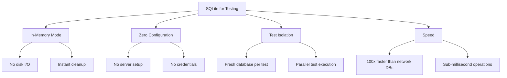
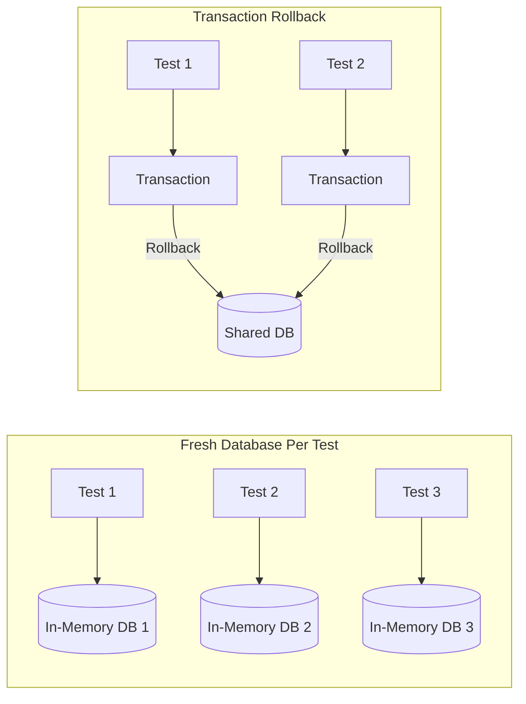
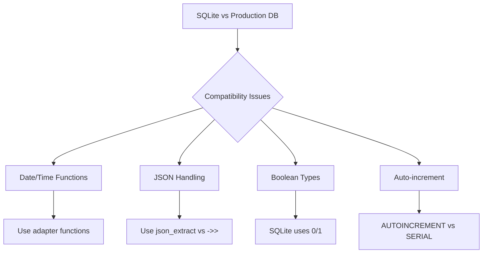
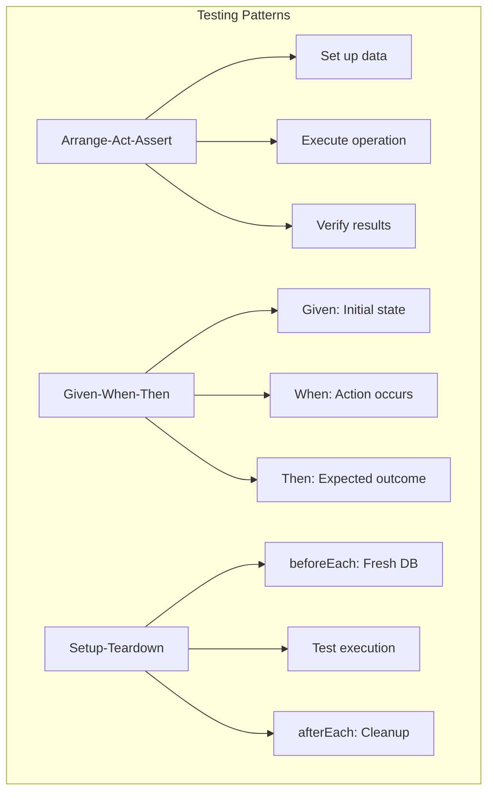

# How to Use SQLite in Testing

Author: [nawazdhandala](https://www.github.com/nawazdhandala)

Tags: SQLite, Testing, Database, Unit Testing, Integration Testing, Python, Node.js, Jest, pytest

Description: Learn how to leverage SQLite for fast, reliable testing. This guide covers in-memory databases, test isolation, fixtures, transaction rollbacks, and best practices for using SQLite as a test database across different frameworks and languages.

---

> SQLite is an excellent choice for testing database-driven applications. Its in-memory mode, zero configuration requirements, and file-based portability make it perfect for creating fast, isolated, and reproducible tests. This guide shows you how to effectively use SQLite for testing in various languages and frameworks.

Testing with production databases like PostgreSQL or MySQL can be slow and complex. SQLite offers a lightweight alternative that dramatically speeds up your test suite while maintaining compatibility with SQL standards. Whether you are writing unit tests, integration tests, or end-to-end tests, SQLite provides the speed and simplicity your testing workflow needs.

---

## Why Use SQLite for Testing?

SQLite brings several advantages that make it ideal for testing scenarios:



| Benefit | Description |
|---------|-------------|
| **Speed** | In-memory operations are orders of magnitude faster than network database calls |
| **Isolation** | Each test can have its own database instance, preventing test interference |
| **Simplicity** | No database server to install, configure, or maintain |
| **Portability** | Tests run identically on any machine without external dependencies |
| **Reproducibility** | Same starting state every time, no leftover data from previous runs |

---

## In-Memory Database Basics

The core technique for SQLite testing is using the special `:memory:` database identifier. This creates a database that exists only in RAM and is automatically destroyed when the connection closes.

### Node.js with better-sqlite3

The following example demonstrates creating an in-memory database for testing. Each connection to `:memory:` creates a completely new, empty database:

```javascript
const Database = require('better-sqlite3');

// Create an in-memory database - this is the foundation of SQLite testing
// The :memory: identifier tells SQLite to keep everything in RAM
const db = new Database(':memory:');

// Set up your schema - this happens instantly with no disk I/O
db.exec(`
    CREATE TABLE users (
        id INTEGER PRIMARY KEY AUTOINCREMENT,
        email TEXT NOT NULL UNIQUE,
        username TEXT NOT NULL,
        created_at TEXT DEFAULT CURRENT_TIMESTAMP
    )
`);

// Your database is ready for testing
console.log('In-memory database created successfully');

// When you close the connection, the database is destroyed
// db.close();
```

### Python with sqlite3

Python's built-in sqlite3 module provides the same in-memory capability. The connection string `:memory:` works identically:

```python
import sqlite3

# Create an in-memory database connection
# Every connection to :memory: is a fresh, isolated database
conn = sqlite3.connect(':memory:')
cursor = conn.cursor()

# Create your test schema
cursor.execute('''
    CREATE TABLE users (
        id INTEGER PRIMARY KEY AUTOINCREMENT,
        email TEXT NOT NULL UNIQUE,
        username TEXT NOT NULL,
        created_at TEXT DEFAULT CURRENT_TIMESTAMP
    )
''')
conn.commit()

print('In-memory database ready for testing')

# The database is destroyed when the connection closes
# conn.close()
```

---

## Test Isolation Strategies

Test isolation ensures that each test runs independently without being affected by other tests. SQLite offers several approaches to achieve this:



### Strategy 1: Fresh Database Per Test

Create a new database for each test. This provides complete isolation but requires schema setup for every test:

```javascript
const Database = require('better-sqlite3');

// Factory function that creates a fresh database with schema
function createTestDatabase() {
    const db = new Database(':memory:');

    // Initialize schema
    db.exec(`
        CREATE TABLE users (
            id INTEGER PRIMARY KEY AUTOINCREMENT,
            email TEXT NOT NULL UNIQUE,
            username TEXT NOT NULL
        );

        CREATE TABLE posts (
            id INTEGER PRIMARY KEY AUTOINCREMENT,
            user_id INTEGER NOT NULL,
            title TEXT NOT NULL,
            content TEXT,
            FOREIGN KEY (user_id) REFERENCES users(id)
        );
    `);

    return db;
}

// Each test gets its own database
function testUserCreation() {
    const db = createTestDatabase();

    const insert = db.prepare('INSERT INTO users (email, username) VALUES (?, ?)');
    const result = insert.run('test@example.com', 'testuser');

    console.assert(result.lastInsertRowid === 1, 'First user should have ID 1');

    db.close();
}

function testUserEmailUniqueness() {
    const db = createTestDatabase();

    const insert = db.prepare('INSERT INTO users (email, username) VALUES (?, ?)');
    insert.run('duplicate@example.com', 'user1');

    try {
        insert.run('duplicate@example.com', 'user2');
        console.assert(false, 'Should have thrown on duplicate email');
    } catch (error) {
        console.assert(error.code === 'SQLITE_CONSTRAINT_UNIQUE', 'Should be constraint error');
    }

    db.close();
}

// Run tests
testUserCreation();
testUserEmailUniqueness();
console.log('All tests passed!');
```

### Strategy 2: Transaction Rollback

Use a shared database but wrap each test in a transaction that gets rolled back. This is faster for large schemas:

```javascript
const Database = require('better-sqlite3');

class TestRunner {
    constructor() {
        // Create shared database with schema
        this.db = new Database(':memory:');
        this.initializeSchema();
    }

    initializeSchema() {
        this.db.exec(`
            CREATE TABLE users (
                id INTEGER PRIMARY KEY AUTOINCREMENT,
                email TEXT NOT NULL UNIQUE,
                username TEXT NOT NULL
            );

            CREATE TABLE posts (
                id INTEGER PRIMARY KEY AUTOINCREMENT,
                user_id INTEGER NOT NULL,
                title TEXT NOT NULL
            );
        `);
    }

    // Run a test function within a transaction that gets rolled back
    runTest(name, testFn) {
        console.log(`Running test: ${name}`);

        // Start a savepoint (nested transaction)
        this.db.exec('SAVEPOINT test_savepoint');

        try {
            testFn(this.db);
            console.log(`  PASSED: ${name}`);
        } catch (error) {
            console.log(`  FAILED: ${name} - ${error.message}`);
        } finally {
            // Rollback to clean state regardless of pass/fail
            this.db.exec('ROLLBACK TO SAVEPOINT test_savepoint');
            this.db.exec('RELEASE SAVEPOINT test_savepoint');
        }
    }

    cleanup() {
        this.db.close();
    }
}

// Usage
const runner = new TestRunner();

runner.runTest('can create user', (db) => {
    const result = db.prepare('INSERT INTO users (email, username) VALUES (?, ?)').run('a@test.com', 'user1');
    if (result.changes !== 1) throw new Error('Insert failed');
});

runner.runTest('database is clean after rollback', (db) => {
    const count = db.prepare('SELECT COUNT(*) as count FROM users').get().count;
    if (count !== 0) throw new Error(`Expected 0 users, got ${count}`);
});

runner.cleanup();
```

---

## Testing with Jest (Node.js)

Jest is a popular JavaScript testing framework. Here is how to set up SQLite testing with proper lifecycle management:

```javascript
// db.js - Database module
const Database = require('better-sqlite3');

let db = null;

function getDatabase() {
    if (!db) {
        throw new Error('Database not initialized. Call initDatabase first.');
    }
    return db;
}

function initDatabase(dbPath = ':memory:') {
    db = new Database(dbPath);
    db.pragma('foreign_keys = ON');

    db.exec(`
        CREATE TABLE IF NOT EXISTS users (
            id INTEGER PRIMARY KEY AUTOINCREMENT,
            email TEXT NOT NULL UNIQUE,
            username TEXT NOT NULL,
            created_at TEXT DEFAULT CURRENT_TIMESTAMP
        )
    `);

    return db;
}

function closeDatabase() {
    if (db) {
        db.close();
        db = null;
    }
}

module.exports = { getDatabase, initDatabase, closeDatabase };
```

```javascript
// user.service.js - Service to test
const { getDatabase } = require('./db');

class UserService {
    createUser(email, username) {
        const db = getDatabase();
        const stmt = db.prepare('INSERT INTO users (email, username) VALUES (?, ?)');
        const result = stmt.run(email, username);
        return this.getUserById(result.lastInsertRowid);
    }

    getUserById(id) {
        const db = getDatabase();
        return db.prepare('SELECT * FROM users WHERE id = ?').get(id);
    }

    getUserByEmail(email) {
        const db = getDatabase();
        return db.prepare('SELECT * FROM users WHERE email = ?').get(email);
    }

    getAllUsers() {
        const db = getDatabase();
        return db.prepare('SELECT * FROM users').all();
    }

    deleteUser(id) {
        const db = getDatabase();
        const result = db.prepare('DELETE FROM users WHERE id = ?').run(id);
        return result.changes > 0;
    }
}

module.exports = UserService;
```

```javascript
// user.service.test.js - Jest test file
const { initDatabase, closeDatabase, getDatabase } = require('./db');
const UserService = require('./user.service');

describe('UserService', () => {
    let userService;

    // Create fresh database before each test
    beforeEach(() => {
        initDatabase(':memory:');
        userService = new UserService();
    });

    // Close database after each test
    afterEach(() => {
        closeDatabase();
    });

    describe('createUser', () => {
        it('should create a user and return it with an id', () => {
            const user = userService.createUser('test@example.com', 'testuser');

            expect(user).toBeDefined();
            expect(user.id).toBe(1);
            expect(user.email).toBe('test@example.com');
            expect(user.username).toBe('testuser');
        });

        it('should throw on duplicate email', () => {
            userService.createUser('duplicate@example.com', 'user1');

            expect(() => {
                userService.createUser('duplicate@example.com', 'user2');
            }).toThrow();
        });
    });

    describe('getUserByEmail', () => {
        it('should find user by email', () => {
            userService.createUser('find@example.com', 'findme');

            const user = userService.getUserByEmail('find@example.com');

            expect(user).toBeDefined();
            expect(user.username).toBe('findme');
        });

        it('should return undefined for non-existent email', () => {
            const user = userService.getUserByEmail('nonexistent@example.com');

            expect(user).toBeUndefined();
        });
    });

    describe('deleteUser', () => {
        it('should delete existing user', () => {
            const user = userService.createUser('delete@example.com', 'deleteme');

            const deleted = userService.deleteUser(user.id);

            expect(deleted).toBe(true);
            expect(userService.getUserById(user.id)).toBeUndefined();
        });

        it('should return false for non-existent user', () => {
            const deleted = userService.deleteUser(999);

            expect(deleted).toBe(false);
        });
    });
});
```

---

## Testing with pytest (Python)

pytest is Python's most popular testing framework. Here is a complete setup using fixtures for clean test isolation:

```python
# conftest.py - pytest fixtures for database testing
import pytest
import sqlite3

@pytest.fixture
def db_connection():
    """
    Create a fresh in-memory database for each test.
    The connection is automatically closed after the test completes.
    """
    conn = sqlite3.connect(':memory:')
    conn.row_factory = sqlite3.Row  # Enable column access by name

    # Create schema
    cursor = conn.cursor()
    cursor.executescript('''
        CREATE TABLE users (
            id INTEGER PRIMARY KEY AUTOINCREMENT,
            email TEXT NOT NULL UNIQUE,
            username TEXT NOT NULL,
            created_at TEXT DEFAULT CURRENT_TIMESTAMP
        );

        CREATE TABLE posts (
            id INTEGER PRIMARY KEY AUTOINCREMENT,
            user_id INTEGER NOT NULL,
            title TEXT NOT NULL,
            content TEXT,
            published INTEGER DEFAULT 0,
            FOREIGN KEY (user_id) REFERENCES users(id) ON DELETE CASCADE
        );
    ''')
    conn.commit()

    yield conn

    conn.close()

@pytest.fixture
def db_with_users(db_connection):
    """
    Database with pre-populated test users.
    Useful for tests that need existing data.
    """
    cursor = db_connection.cursor()

    users = [
        ('alice@example.com', 'alice'),
        ('bob@example.com', 'bob'),
        ('carol@example.com', 'carol'),
    ]

    cursor.executemany(
        'INSERT INTO users (email, username) VALUES (?, ?)',
        users
    )
    db_connection.commit()

    return db_connection
```

```python
# user_repository.py - Repository class to test
class UserRepository:
    def __init__(self, connection):
        self.conn = connection

    def create(self, email, username):
        cursor = self.conn.cursor()
        cursor.execute(
            'INSERT INTO users (email, username) VALUES (?, ?)',
            (email, username)
        )
        self.conn.commit()
        return self.get_by_id(cursor.lastrowid)

    def get_by_id(self, user_id):
        cursor = self.conn.cursor()
        cursor.execute('SELECT * FROM users WHERE id = ?', (user_id,))
        row = cursor.fetchone()
        return dict(row) if row else None

    def get_by_email(self, email):
        cursor = self.conn.cursor()
        cursor.execute('SELECT * FROM users WHERE email = ?', (email,))
        row = cursor.fetchone()
        return dict(row) if row else None

    def get_all(self):
        cursor = self.conn.cursor()
        cursor.execute('SELECT * FROM users')
        return [dict(row) for row in cursor.fetchall()]

    def update(self, user_id, **kwargs):
        if not kwargs:
            return False

        set_clause = ', '.join(f'{k} = ?' for k in kwargs.keys())
        values = list(kwargs.values()) + [user_id]

        cursor = self.conn.cursor()
        cursor.execute(
            f'UPDATE users SET {set_clause} WHERE id = ?',
            values
        )
        self.conn.commit()
        return cursor.rowcount > 0

    def delete(self, user_id):
        cursor = self.conn.cursor()
        cursor.execute('DELETE FROM users WHERE id = ?', (user_id,))
        self.conn.commit()
        return cursor.rowcount > 0
```

```python
# test_user_repository.py - pytest tests
import pytest
import sqlite3
from user_repository import UserRepository

class TestUserRepository:
    """Test suite for UserRepository using SQLite in-memory database."""

    def test_create_user(self, db_connection):
        """Test creating a new user returns the user with an ID."""
        repo = UserRepository(db_connection)

        user = repo.create('test@example.com', 'testuser')

        assert user is not None
        assert user['id'] == 1
        assert user['email'] == 'test@example.com'
        assert user['username'] == 'testuser'

    def test_create_duplicate_email_raises_error(self, db_connection):
        """Test that duplicate emails raise an integrity error."""
        repo = UserRepository(db_connection)
        repo.create('duplicate@example.com', 'user1')

        with pytest.raises(sqlite3.IntegrityError):
            repo.create('duplicate@example.com', 'user2')

    def test_get_by_id_returns_user(self, db_with_users):
        """Test fetching a user by ID."""
        repo = UserRepository(db_with_users)

        user = repo.get_by_id(1)

        assert user is not None
        assert user['email'] == 'alice@example.com'

    def test_get_by_id_returns_none_for_missing(self, db_connection):
        """Test that get_by_id returns None for non-existent user."""
        repo = UserRepository(db_connection)

        user = repo.get_by_id(999)

        assert user is None

    def test_get_all_returns_all_users(self, db_with_users):
        """Test fetching all users."""
        repo = UserRepository(db_with_users)

        users = repo.get_all()

        assert len(users) == 3
        emails = [u['email'] for u in users]
        assert 'alice@example.com' in emails
        assert 'bob@example.com' in emails

    def test_update_user(self, db_with_users):
        """Test updating user fields."""
        repo = UserRepository(db_with_users)

        updated = repo.update(1, username='alice_updated')
        user = repo.get_by_id(1)

        assert updated is True
        assert user['username'] == 'alice_updated'

    def test_delete_user(self, db_with_users):
        """Test deleting a user."""
        repo = UserRepository(db_with_users)

        deleted = repo.delete(1)
        user = repo.get_by_id(1)

        assert deleted is True
        assert user is None

    def test_delete_nonexistent_returns_false(self, db_connection):
        """Test that deleting non-existent user returns False."""
        repo = UserRepository(db_connection)

        deleted = repo.delete(999)

        assert deleted is False
```

---

## Testing Django Applications

Django provides excellent SQLite testing support. Configure your settings to use SQLite for tests while keeping your production database:

```python
# settings.py - Django settings with test database configuration

DATABASES = {
    'default': {
        'ENGINE': 'django.db.backends.postgresql',
        'NAME': 'myapp_production',
        'USER': 'postgres',
        'PASSWORD': 'secret',
        'HOST': 'localhost',
        'PORT': '5432',
    }
}

# Override database for testing
# Django automatically uses this when running tests
import sys
if 'test' in sys.argv:
    DATABASES['default'] = {
        'ENGINE': 'django.db.backends.sqlite3',
        'NAME': ':memory:',
    }
```

```python
# tests/test_models.py - Django model tests with SQLite
from django.test import TestCase
from django.db import IntegrityError
from myapp.models import User, Post

class UserModelTest(TestCase):
    """
    Django TestCase automatically wraps each test in a transaction
    and rolls it back after the test completes.
    """

    def test_create_user(self):
        """Test creating a user through the model."""
        user = User.objects.create(
            email='test@example.com',
            username='testuser'
        )

        self.assertIsNotNone(user.id)
        self.assertEqual(user.email, 'test@example.com')

    def test_email_uniqueness(self):
        """Test that duplicate emails raise an error."""
        User.objects.create(email='unique@example.com', username='user1')

        with self.assertRaises(IntegrityError):
            User.objects.create(email='unique@example.com', username='user2')

    def test_user_posts_relationship(self):
        """Test the user-posts foreign key relationship."""
        user = User.objects.create(email='author@example.com', username='author')
        post = Post.objects.create(
            user=user,
            title='Test Post',
            content='Test content'
        )

        self.assertEqual(post.user.id, user.id)
        self.assertEqual(user.posts.count(), 1)

class PostModelTest(TestCase):

    def setUp(self):
        """Create a user for post tests."""
        self.user = User.objects.create(
            email='author@example.com',
            username='author'
        )

    def test_create_post(self):
        """Test creating a post."""
        post = Post.objects.create(
            user=self.user,
            title='Test Post',
            content='Content here'
        )

        self.assertIsNotNone(post.id)
        self.assertEqual(post.title, 'Test Post')

    def test_default_published_status(self):
        """Test that posts are unpublished by default."""
        post = Post.objects.create(
            user=self.user,
            title='Draft Post'
        )

        self.assertFalse(post.published)
```

---

## Testing Flask Applications

Flask applications can use SQLite for testing with SQLAlchemy or raw sqlite3:

```python
# app.py - Flask application with SQLAlchemy
from flask import Flask
from flask_sqlalchemy import SQLAlchemy

db = SQLAlchemy()

def create_app(config=None):
    app = Flask(__name__)

    # Default configuration
    app.config['SQLALCHEMY_DATABASE_URI'] = 'postgresql://localhost/myapp'
    app.config['SQLALCHEMY_TRACK_MODIFICATIONS'] = False

    # Override with test config if provided
    if config:
        app.config.update(config)

    db.init_app(app)

    return app

# models.py
class User(db.Model):
    id = db.Column(db.Integer, primary_key=True)
    email = db.Column(db.String(120), unique=True, nullable=False)
    username = db.Column(db.String(80), nullable=False)
```

```python
# conftest.py - pytest fixtures for Flask testing
import pytest
from app import create_app, db
from models import User

@pytest.fixture
def app():
    """
    Create a Flask application configured for testing.
    Uses SQLite in-memory database for fast, isolated tests.
    """
    app = create_app({
        'TESTING': True,
        'SQLALCHEMY_DATABASE_URI': 'sqlite:///:memory:',
    })

    with app.app_context():
        db.create_all()
        yield app
        db.drop_all()

@pytest.fixture
def client(app):
    """Flask test client for making requests."""
    return app.test_client()

@pytest.fixture
def db_session(app):
    """Database session for direct database access in tests."""
    with app.app_context():
        yield db.session

@pytest.fixture
def sample_user(db_session):
    """Create and return a sample user."""
    user = User(email='sample@example.com', username='sampleuser')
    db_session.add(user)
    db_session.commit()
    return user
```

```python
# test_users.py - Flask API tests
import pytest
from models import User

class TestUserAPI:

    def test_create_user_endpoint(self, client, db_session):
        """Test the user creation API endpoint."""
        response = client.post('/api/users', json={
            'email': 'new@example.com',
            'username': 'newuser'
        })

        assert response.status_code == 201
        data = response.get_json()
        assert data['email'] == 'new@example.com'

        # Verify in database
        user = User.query.filter_by(email='new@example.com').first()
        assert user is not None

    def test_get_user_endpoint(self, client, sample_user):
        """Test fetching a user by ID."""
        response = client.get(f'/api/users/{sample_user.id}')

        assert response.status_code == 200
        data = response.get_json()
        assert data['email'] == 'sample@example.com'

    def test_get_nonexistent_user_returns_404(self, client):
        """Test that fetching non-existent user returns 404."""
        response = client.get('/api/users/999')

        assert response.status_code == 404
```

---

## Handling Database Compatibility

When using SQLite for testing but PostgreSQL or MySQL in production, you may encounter compatibility issues. Here is how to handle common differences:



### Adapter Pattern for Cross-Database Testing

Create an abstraction layer that handles database-specific differences:

```python
# db_adapter.py - Database compatibility adapter
from abc import ABC, abstractmethod
from datetime import datetime

class DatabaseAdapter(ABC):
    """Abstract base class for database adapters."""

    @abstractmethod
    def now_function(self):
        """Return the SQL function for current timestamp."""
        pass

    @abstractmethod
    def json_extract(self, column, path):
        """Return SQL for extracting a JSON value."""
        pass

    @abstractmethod
    def boolean_value(self, value):
        """Convert Python boolean to database value."""
        pass

class SQLiteAdapter(DatabaseAdapter):
    """SQLite-specific implementations."""

    def now_function(self):
        return "datetime('now')"

    def json_extract(self, column, path):
        return f"json_extract({column}, '$.{path}')"

    def boolean_value(self, value):
        return 1 if value else 0

class PostgreSQLAdapter(DatabaseAdapter):
    """PostgreSQL-specific implementations."""

    def now_function(self):
        return "NOW()"

    def json_extract(self, column, path):
        return f"{column}->'{path}'"

    def boolean_value(self, value):
        return value  # PostgreSQL supports native boolean
```

```python
# repository.py - Using the adapter for cross-database compatibility
class UserRepository:
    def __init__(self, connection, adapter):
        self.conn = connection
        self.adapter = adapter

    def get_recent_users(self, days=7):
        """Get users created in the last N days."""
        cursor = self.conn.cursor()

        # Use adapter for database-specific date function
        sql = f'''
            SELECT * FROM users
            WHERE created_at > datetime({self.adapter.now_function()}, '-{days} days')
        '''

        cursor.execute(sql)
        return cursor.fetchall()

    def get_premium_users(self):
        """Get users with premium metadata."""
        cursor = self.conn.cursor()

        # Use adapter for JSON extraction
        json_path = self.adapter.json_extract('metadata', 'plan')
        sql = f"SELECT * FROM users WHERE {json_path} = 'premium'"

        cursor.execute(sql)
        return cursor.fetchall()
```

---

## Performance Optimization for Tests

Even with SQLite's speed, large test suites can become slow. Here are optimization strategies:

### Shared Schema with Transaction Rollback

Instead of creating the schema for each test, create it once and use transactions:

```javascript
const Database = require('better-sqlite3');

class TestDatabase {
    static instance = null;

    static getInstance() {
        if (!TestDatabase.instance) {
            TestDatabase.instance = new TestDatabase();
        }
        return TestDatabase.instance;
    }

    constructor() {
        this.db = new Database(':memory:');
        this.setupSchema();
    }

    setupSchema() {
        // Complex schema setup happens only once
        this.db.exec(`
            CREATE TABLE users (
                id INTEGER PRIMARY KEY AUTOINCREMENT,
                email TEXT NOT NULL UNIQUE,
                username TEXT NOT NULL
            );

            CREATE TABLE posts (
                id INTEGER PRIMARY KEY AUTOINCREMENT,
                user_id INTEGER NOT NULL,
                title TEXT NOT NULL,
                FOREIGN KEY (user_id) REFERENCES users(id)
            );

            CREATE TABLE comments (
                id INTEGER PRIMARY KEY AUTOINCREMENT,
                post_id INTEGER NOT NULL,
                content TEXT NOT NULL,
                FOREIGN KEY (post_id) REFERENCES posts(id)
            );

            -- Create all necessary indexes
            CREATE INDEX idx_posts_user ON posts(user_id);
            CREATE INDEX idx_comments_post ON comments(post_id);
        `);
    }

    beginTest() {
        this.db.exec('BEGIN');
    }

    endTest() {
        this.db.exec('ROLLBACK');
    }

    getConnection() {
        return this.db;
    }
}

// Usage in tests
describe('Optimized Test Suite', () => {
    const testDb = TestDatabase.getInstance();

    beforeEach(() => {
        testDb.beginTest();
    });

    afterEach(() => {
        testDb.endTest();
    });

    it('test 1', () => {
        const db = testDb.getConnection();
        // Test code here - changes will be rolled back
    });

    it('test 2', () => {
        const db = testDb.getConnection();
        // Each test starts with clean database
    });
});
```

### Parallel Test Execution with Database Cloning

For parallel test execution, clone the database using SQLite's backup API:

```javascript
const Database = require('better-sqlite3');

class DatabasePool {
    constructor(schemaSetup) {
        this.schemaSetup = schemaSetup;
        this.template = this.createTemplate();
    }

    createTemplate() {
        const db = new Database(':memory:');
        this.schemaSetup(db);
        return db;
    }

    // Create a clone of the template database for parallel tests
    getClone() {
        const clone = new Database(':memory:');
        this.template.backup(clone);
        return clone;
    }
}

// Usage
const pool = new DatabasePool((db) => {
    db.exec(`
        CREATE TABLE users (
            id INTEGER PRIMARY KEY AUTOINCREMENT,
            email TEXT UNIQUE,
            username TEXT
        )
    `);

    // Seed with test data
    db.prepare('INSERT INTO users (email, username) VALUES (?, ?)')
        .run('seed@example.com', 'seeduser');
});

// Each parallel test gets its own clone
const db1 = pool.getClone();
const db2 = pool.getClone();

// db1 and db2 are independent copies
```

---

## Testing Migrations

Test database migrations by applying them in sequence and verifying the results:

```python
# test_migrations.py - Testing database migrations
import pytest
import sqlite3
import os
import glob

class MigrationTester:
    """Test database migrations against SQLite."""

    def __init__(self, migrations_dir):
        self.migrations_dir = migrations_dir
        self.conn = None

    def setup(self):
        self.conn = sqlite3.connect(':memory:')
        self.conn.row_factory = sqlite3.Row

        # Create migrations tracking table
        self.conn.execute('''
            CREATE TABLE schema_migrations (
                version TEXT PRIMARY KEY,
                applied_at TEXT DEFAULT CURRENT_TIMESTAMP
            )
        ''')
        self.conn.commit()

    def teardown(self):
        if self.conn:
            self.conn.close()

    def get_migration_files(self):
        """Get sorted list of migration files."""
        pattern = os.path.join(self.migrations_dir, '*.sql')
        files = glob.glob(pattern)
        return sorted(files)

    def apply_migration(self, filepath):
        """Apply a single migration file."""
        with open(filepath, 'r') as f:
            sql = f.read()

        self.conn.executescript(sql)

        version = os.path.basename(filepath)
        self.conn.execute(
            'INSERT INTO schema_migrations (version) VALUES (?)',
            (version,)
        )
        self.conn.commit()

    def run_all_migrations(self):
        """Apply all migrations in order."""
        for filepath in self.get_migration_files():
            self.apply_migration(filepath)

    def get_table_info(self, table_name):
        """Get column information for a table."""
        cursor = self.conn.execute(f'PRAGMA table_info({table_name})')
        return [dict(row) for row in cursor.fetchall()]

    def table_exists(self, table_name):
        """Check if a table exists."""
        cursor = self.conn.execute(
            "SELECT name FROM sqlite_master WHERE type='table' AND name=?",
            (table_name,)
        )
        return cursor.fetchone() is not None

@pytest.fixture
def migration_tester():
    tester = MigrationTester('./migrations')
    tester.setup()
    yield tester
    tester.teardown()

class TestMigrations:

    def test_all_migrations_apply_cleanly(self, migration_tester):
        """Test that all migrations can be applied without errors."""
        # This should not raise any exceptions
        migration_tester.run_all_migrations()

    def test_users_table_created(self, migration_tester):
        """Test that migrations create the users table."""
        migration_tester.run_all_migrations()

        assert migration_tester.table_exists('users')

        columns = migration_tester.get_table_info('users')
        column_names = [c['name'] for c in columns]

        assert 'id' in column_names
        assert 'email' in column_names
        assert 'username' in column_names

    def test_foreign_keys_created(self, migration_tester):
        """Test that foreign key constraints are properly set up."""
        migration_tester.run_all_migrations()

        # Enable foreign keys
        migration_tester.conn.execute('PRAGMA foreign_keys = ON')

        # Insert a user
        migration_tester.conn.execute(
            'INSERT INTO users (email, username) VALUES (?, ?)',
            ('test@example.com', 'test')
        )

        # Try to insert a post with invalid user_id
        with pytest.raises(sqlite3.IntegrityError):
            migration_tester.conn.execute(
                'INSERT INTO posts (user_id, title) VALUES (?, ?)',
                (999, 'Invalid Post')
            )
```

---

## Best Practices Summary

| Practice | Description |
|----------|-------------|
| **Use in-memory databases** | Use `:memory:` for fastest possible test execution |
| **Isolate each test** | Fresh database or transaction rollback per test |
| **Create fixtures** | Build reusable test data setup functions |
| **Test migrations separately** | Verify schema changes work correctly |
| **Handle compatibility** | Use adapters for cross-database differences |
| **Optimize for speed** | Share schema, use transactions for cleanup |
| **Test error cases** | Verify constraint violations and edge cases |
| **Keep tests independent** | No test should depend on another test's data |

---

## Common Testing Patterns



---

## Conclusion

SQLite is an invaluable tool for testing database-driven applications. Its key advantages for testing include:

1. **Speed**: In-memory databases eliminate disk I/O completely
2. **Isolation**: Easy to create fresh databases for each test
3. **Simplicity**: No server configuration or network setup required
4. **Reproducibility**: Tests always start from a known state

By implementing the patterns shown in this guide, you can build fast, reliable test suites that catch bugs early without the overhead of managing test database servers.

Remember to test your migrations separately and handle any database-specific differences when using SQLite as a stand-in for production databases like PostgreSQL or MySQL.

---

**Need to monitor your applications in production?** [OneUptime](https://oneuptime.com) provides comprehensive monitoring, alerting, and incident management. Track your application's performance, catch issues before your users do, and maintain the reliability that your test suite helps you build. Try OneUptime free and ensure your production systems run as smoothly as your tests.
