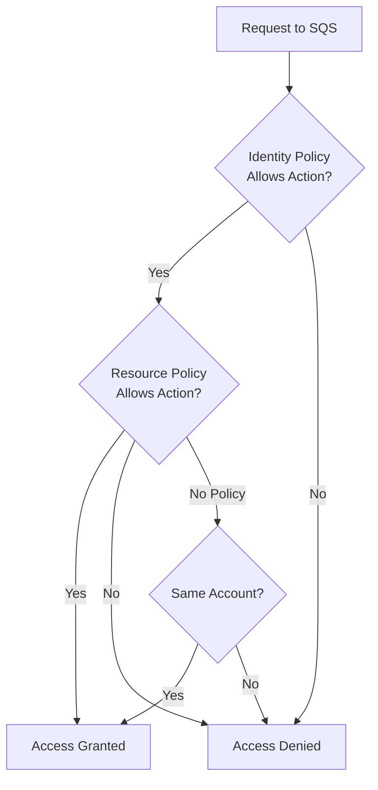
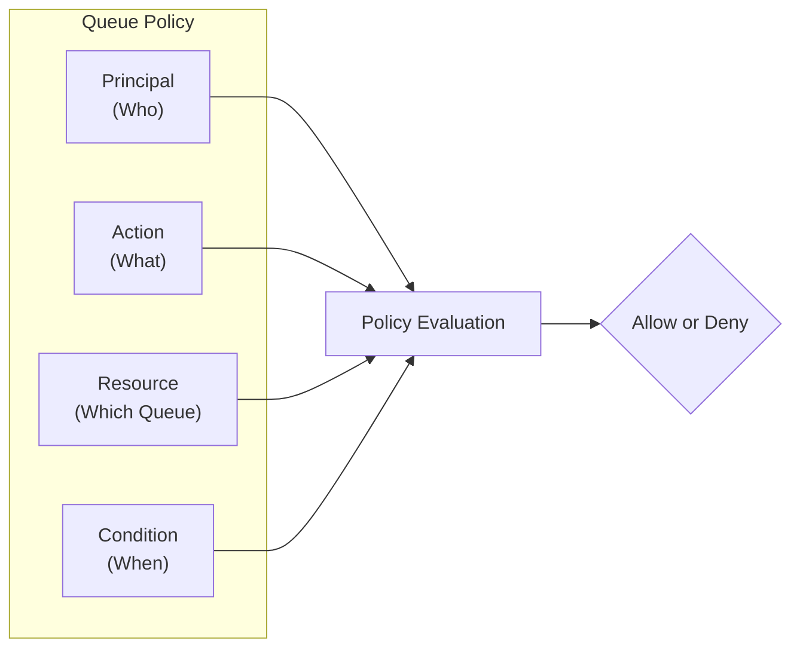
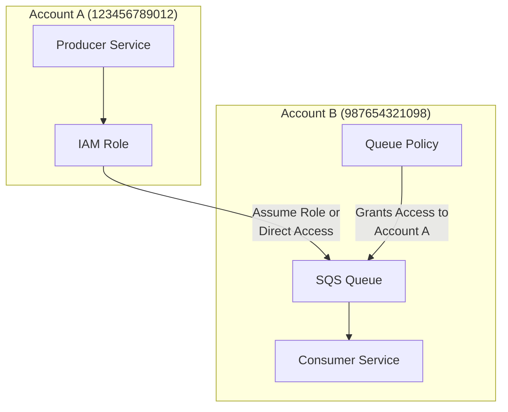
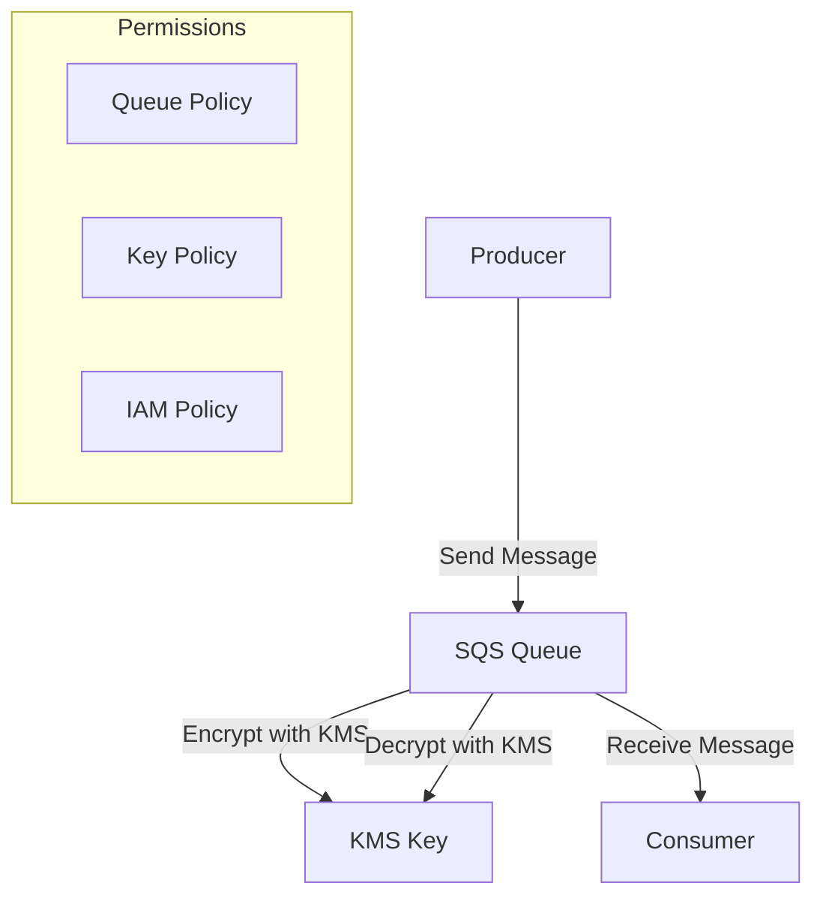
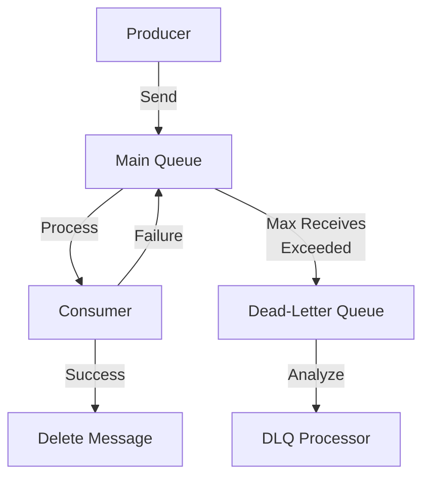
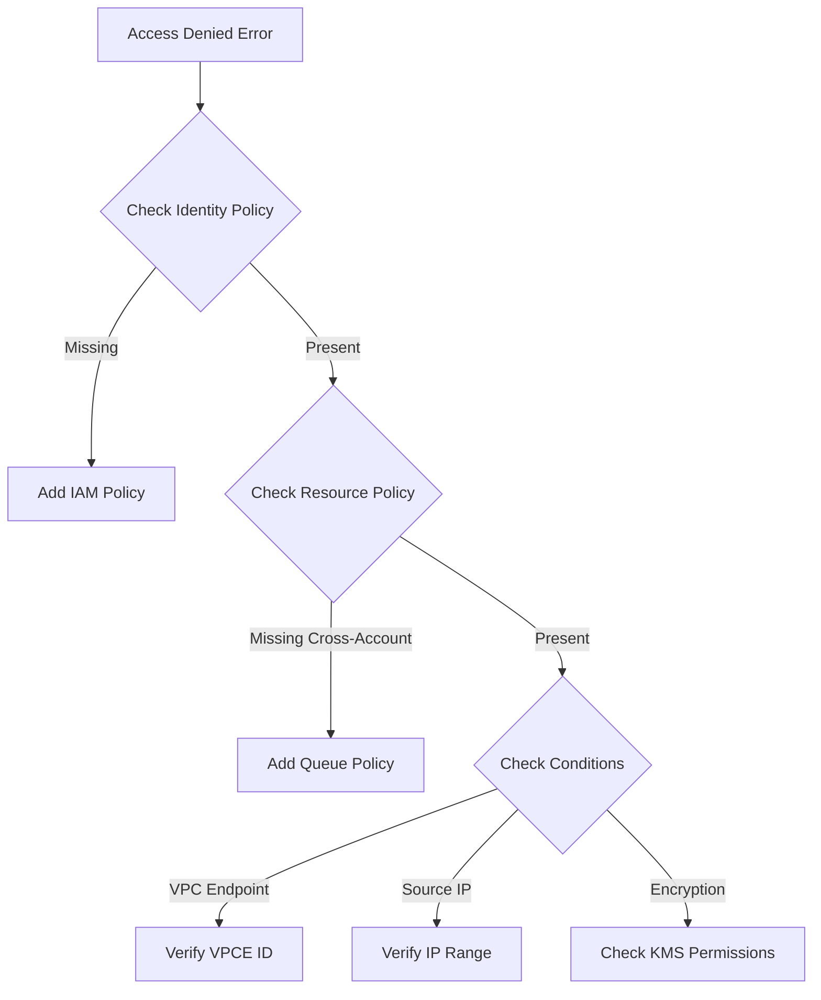
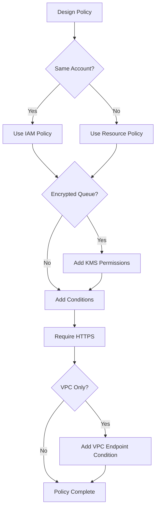

# How to Configure SQS Access Policies

Author: [nawazdhandala](https://www.github.com/nawazdhandala)

Tags: AWS, SQS, IAM, Security, Access Control, Serverless, Cloud Infrastructure, Queue

Description: Learn how to configure Amazon SQS access policies to secure your message queues. Covers identity-based policies, resource-based policies, cross-account access, encryption settings, and best practices for production deployments.

---

> Amazon SQS access policies control who can send messages to your queues and who can receive them. Without proper policies, your queues might be exposed to unauthorized access or your applications might fail to communicate. Mastering SQS access policies is essential for building secure, scalable messaging systems.

Access control in SQS operates through two complementary mechanisms: IAM policies attached to users and roles, and resource-based policies attached directly to queues. Understanding how these work together enables you to implement fine-grained security controls for your messaging infrastructure.

---

## Understanding SQS Access Control

SQS uses a combination of identity-based and resource-based policies to control access:



### Policy Types Comparison

| Policy Type | Where Attached | Best For | Cross-Account |
|-------------|----------------|----------|---------------|
| **Identity-based** | IAM users, roles, groups | Controlling what users can do | Requires resource policy too |
| **Resource-based** | SQS queue | Controlling who can access queue | Yes, standalone |
| **VPC Endpoint** | VPC endpoint | Network-level restriction | No |

---

## IAM Identity-Based Policies

Identity-based policies are attached to IAM users, groups, or roles. They define what actions the identity can perform on SQS resources.

### Basic Producer Policy

The following IAM policy grants an application the ability to send messages to a specific SQS queue. The policy uses the least privilege principle by only allowing the SendMessage action.

```json
{
    "Version": "2012-10-17",
    "Statement": [
        {
            "Sid": "AllowSendToOrderQueue",
            "Effect": "Allow",
            "Action": [
                "sqs:SendMessage",
                "sqs:GetQueueUrl",
                "sqs:GetQueueAttributes"
            ],
            "Resource": "arn:aws:sqs:us-east-1:123456789012:order-processing-queue"
        }
    ]
}
```

### Basic Consumer Policy

Consumer applications need permissions to receive and delete messages. The ReceiveMessage action retrieves messages, while DeleteMessage removes them after processing.

```json
{
    "Version": "2012-10-17",
    "Statement": [
        {
            "Sid": "AllowConsumeFromOrderQueue",
            "Effect": "Allow",
            "Action": [
                "sqs:ReceiveMessage",
                "sqs:DeleteMessage",
                "sqs:GetQueueUrl",
                "sqs:GetQueueAttributes",
                "sqs:ChangeMessageVisibility"
            ],
            "Resource": "arn:aws:sqs:us-east-1:123456789012:order-processing-queue"
        }
    ]
}
```

### Full Queue Management Policy

Administrators who need to create, configure, and manage queues require a broader set of permissions. Use this policy sparingly and only for administrative roles.

```json
{
    "Version": "2012-10-17",
    "Statement": [
        {
            "Sid": "AllowQueueManagement",
            "Effect": "Allow",
            "Action": [
                "sqs:CreateQueue",
                "sqs:DeleteQueue",
                "sqs:SetQueueAttributes",
                "sqs:GetQueueAttributes",
                "sqs:GetQueueUrl",
                "sqs:ListQueues",
                "sqs:ListQueueTags",
                "sqs:TagQueue",
                "sqs:UntagQueue",
                "sqs:PurgeQueue"
            ],
            "Resource": "arn:aws:sqs:us-east-1:123456789012:*"
        }
    ]
}
```

---

## Resource-Based Policies

Resource-based policies are attached directly to SQS queues and specify who can access the queue and what actions they can perform.

### Queue Policy Structure

The following diagram illustrates the flow of policy evaluation for SQS queue access.



### Basic Queue Policy

A simple queue policy that allows a specific IAM role to send and receive messages. Attach this policy to the queue using the AWS Console or CLI.

```json
{
    "Version": "2012-10-17",
    "Id": "OrderQueuePolicy",
    "Statement": [
        {
            "Sid": "AllowOrderServiceAccess",
            "Effect": "Allow",
            "Principal": {
                "AWS": "arn:aws:iam::123456789012:role/OrderServiceRole"
            },
            "Action": [
                "sqs:SendMessage",
                "sqs:ReceiveMessage",
                "sqs:DeleteMessage",
                "sqs:GetQueueAttributes"
            ],
            "Resource": "arn:aws:sqs:us-east-1:123456789012:order-processing-queue"
        }
    ]
}
```

### Allow SNS to Send Messages

When using SNS to fan out messages to SQS, the queue needs a policy allowing SNS to send messages. The condition ensures only messages from your specific SNS topic are accepted.

```json
{
    "Version": "2012-10-17",
    "Id": "SNSToSQSPolicy",
    "Statement": [
        {
            "Sid": "AllowSNSPublish",
            "Effect": "Allow",
            "Principal": {
                "Service": "sns.amazonaws.com"
            },
            "Action": "sqs:SendMessage",
            "Resource": "arn:aws:sqs:us-east-1:123456789012:notification-queue",
            "Condition": {
                "ArnEquals": {
                    "aws:SourceArn": "arn:aws:sns:us-east-1:123456789012:notification-topic"
                }
            }
        }
    ]
}
```

### Allow S3 Event Notifications

S3 buckets can send event notifications to SQS when objects are created or deleted. Configure the queue policy to accept messages from your S3 bucket.

```json
{
    "Version": "2012-10-17",
    "Id": "S3EventNotificationPolicy",
    "Statement": [
        {
            "Sid": "AllowS3EventNotification",
            "Effect": "Allow",
            "Principal": {
                "Service": "s3.amazonaws.com"
            },
            "Action": "sqs:SendMessage",
            "Resource": "arn:aws:sqs:us-east-1:123456789012:file-processing-queue",
            "Condition": {
                "ArnLike": {
                    "aws:SourceArn": "arn:aws:s3:::my-uploads-bucket"
                },
                "StringEquals": {
                    "aws:SourceAccount": "123456789012"
                }
            }
        }
    ]
}
```

---

## Cross-Account Access

Cross-account access allows services in different AWS accounts to communicate through SQS. Both accounts need proper policy configuration.

### Architecture Overview



### Queue Policy for Cross-Account Access

The queue owner (Account B) must add a resource policy granting access to the other account. You can allow an entire account or specific roles within that account.

```json
{
    "Version": "2012-10-17",
    "Id": "CrossAccountQueuePolicy",
    "Statement": [
        {
            "Sid": "AllowCrossAccountSend",
            "Effect": "Allow",
            "Principal": {
                "AWS": "arn:aws:iam::123456789012:root"
            },
            "Action": [
                "sqs:SendMessage",
                "sqs:GetQueueUrl",
                "sqs:GetQueueAttributes"
            ],
            "Resource": "arn:aws:sqs:us-east-1:987654321098:shared-event-queue"
        },
        {
            "Sid": "AllowSpecificRoleReceive",
            "Effect": "Allow",
            "Principal": {
                "AWS": "arn:aws:iam::123456789012:role/EventProcessorRole"
            },
            "Action": [
                "sqs:ReceiveMessage",
                "sqs:DeleteMessage",
                "sqs:ChangeMessageVisibility"
            ],
            "Resource": "arn:aws:sqs:us-east-1:987654321098:shared-event-queue"
        }
    ]
}
```

### IAM Policy for Cross-Account Producer

The producer account (Account A) also needs an IAM policy allowing its role to access the queue in Account B.

```json
{
    "Version": "2012-10-17",
    "Statement": [
        {
            "Sid": "AllowCrossAccountQueueAccess",
            "Effect": "Allow",
            "Action": [
                "sqs:SendMessage",
                "sqs:GetQueueUrl"
            ],
            "Resource": "arn:aws:sqs:us-east-1:987654321098:shared-event-queue"
        }
    ]
}
```

---

## Encryption Configuration

SQS supports server-side encryption using AWS KMS. Proper key policies are essential for encrypted queues.

### Encrypted Queue Architecture



### KMS Key Policy for SQS

When using a customer-managed KMS key, the key policy must allow SQS to use the key for encryption and decryption operations.

```json
{
    "Version": "2012-10-17",
    "Id": "SQSKeyPolicy",
    "Statement": [
        {
            "Sid": "AllowRootFullAccess",
            "Effect": "Allow",
            "Principal": {
                "AWS": "arn:aws:iam::123456789012:root"
            },
            "Action": "kms:*",
            "Resource": "*"
        },
        {
            "Sid": "AllowSQSServiceToUseKey",
            "Effect": "Allow",
            "Principal": {
                "Service": "sqs.amazonaws.com"
            },
            "Action": [
                "kms:GenerateDataKey",
                "kms:Decrypt"
            ],
            "Resource": "*",
            "Condition": {
                "StringEquals": {
                    "aws:SourceAccount": "123456789012"
                }
            }
        },
        {
            "Sid": "AllowProducerToEncrypt",
            "Effect": "Allow",
            "Principal": {
                "AWS": "arn:aws:iam::123456789012:role/ProducerRole"
            },
            "Action": [
                "kms:GenerateDataKey",
                "kms:Decrypt"
            ],
            "Resource": "*"
        },
        {
            "Sid": "AllowConsumerToDecrypt",
            "Effect": "Allow",
            "Principal": {
                "AWS": "arn:aws:iam::123456789012:role/ConsumerRole"
            },
            "Action": "kms:Decrypt",
            "Resource": "*"
        }
    ]
}
```

### IAM Policy for Encrypted Queue Access

Applications accessing encrypted queues need both SQS permissions and KMS permissions for the encryption key.

```json
{
    "Version": "2012-10-17",
    "Statement": [
        {
            "Sid": "AllowSQSAccess",
            "Effect": "Allow",
            "Action": [
                "sqs:SendMessage",
                "sqs:ReceiveMessage",
                "sqs:DeleteMessage"
            ],
            "Resource": "arn:aws:sqs:us-east-1:123456789012:encrypted-queue"
        },
        {
            "Sid": "AllowKMSForSQS",
            "Effect": "Allow",
            "Action": [
                "kms:GenerateDataKey",
                "kms:Decrypt"
            ],
            "Resource": "arn:aws:kms:us-east-1:123456789012:key/12345678-1234-1234-1234-123456789012"
        }
    ]
}
```

---

## Condition Keys for Fine-Grained Control

Condition keys allow you to add contextual constraints to your policies. SQS supports several condition keys for enhanced security.

### Restrict by VPC Endpoint

Limit queue access to requests coming through a specific VPC endpoint. Traffic must originate from within your VPC.

```json
{
    "Version": "2012-10-17",
    "Id": "VPCEndpointPolicy",
    "Statement": [
        {
            "Sid": "RestrictToVPCEndpoint",
            "Effect": "Deny",
            "Principal": "*",
            "Action": "sqs:*",
            "Resource": "arn:aws:sqs:us-east-1:123456789012:secure-queue",
            "Condition": {
                "StringNotEquals": {
                    "aws:SourceVpce": "vpce-1234567890abcdef0"
                }
            }
        }
    ]
}
```

### Restrict by Source IP

Allow access only from specific IP ranges. Useful for allowing on-premises applications or specific network locations.

```json
{
    "Version": "2012-10-17",
    "Id": "SourceIPPolicy",
    "Statement": [
        {
            "Sid": "AllowFromCorporateNetwork",
            "Effect": "Allow",
            "Principal": {
                "AWS": "arn:aws:iam::123456789012:role/DataProcessorRole"
            },
            "Action": [
                "sqs:SendMessage",
                "sqs:ReceiveMessage"
            ],
            "Resource": "arn:aws:sqs:us-east-1:123456789012:internal-queue",
            "Condition": {
                "IpAddress": {
                    "aws:SourceIp": [
                        "203.0.113.0/24",
                        "198.51.100.0/24"
                    ]
                }
            }
        }
    ]
}
```

### Require HTTPS

Deny requests that do not use HTTPS, ensuring all communication with the queue is encrypted in transit.

```json
{
    "Version": "2012-10-17",
    "Id": "RequireHTTPSPolicy",
    "Statement": [
        {
            "Sid": "DenyInsecureTransport",
            "Effect": "Deny",
            "Principal": "*",
            "Action": "sqs:*",
            "Resource": "arn:aws:sqs:us-east-1:123456789012:secure-queue",
            "Condition": {
                "Bool": {
                    "aws:SecureTransport": "false"
                }
            }
        }
    ]
}
```

---

## Dead-Letter Queue Configuration

Dead-letter queues (DLQs) require specific access policies to receive messages from source queues.

### DLQ Architecture



### DLQ Policy Configuration

The dead-letter queue needs a policy allowing the main queue to send failed messages. The redrive policy on the source queue references the DLQ ARN.

```json
{
    "Version": "2012-10-17",
    "Id": "DeadLetterQueuePolicy",
    "Statement": [
        {
            "Sid": "AllowSourceQueueToSend",
            "Effect": "Allow",
            "Principal": {
                "Service": "sqs.amazonaws.com"
            },
            "Action": "sqs:SendMessage",
            "Resource": "arn:aws:sqs:us-east-1:123456789012:order-processing-dlq",
            "Condition": {
                "ArnEquals": {
                    "aws:SourceArn": "arn:aws:sqs:us-east-1:123456789012:order-processing-queue"
                }
            }
        },
        {
            "Sid": "AllowDLQProcessorAccess",
            "Effect": "Allow",
            "Principal": {
                "AWS": "arn:aws:iam::123456789012:role/DLQProcessorRole"
            },
            "Action": [
                "sqs:ReceiveMessage",
                "sqs:DeleteMessage",
                "sqs:GetQueueAttributes"
            ],
            "Resource": "arn:aws:sqs:us-east-1:123456789012:order-processing-dlq"
        }
    ]
}
```

---

## AWS CLI Examples

### Create Queue with Policy

Create a new SQS queue and apply an access policy using the AWS CLI. The queue policy is provided as a JSON string.

```bash
# Create the queue with a policy attached during creation
# The policy allows a specific IAM role to send and receive messages
aws sqs create-queue \
    --queue-name order-processing-queue \
    --attributes '{
        "Policy": "{\"Version\":\"2012-10-17\",\"Statement\":[{\"Sid\":\"AllowOrderService\",\"Effect\":\"Allow\",\"Principal\":{\"AWS\":\"arn:aws:iam::123456789012:role/OrderServiceRole\"},\"Action\":[\"sqs:SendMessage\",\"sqs:ReceiveMessage\"],\"Resource\":\"arn:aws:sqs:us-east-1:123456789012:order-processing-queue\"}]}"
    }'
```

### Update Queue Policy

Update the policy on an existing queue. Store the policy in a file for easier management.

```bash
# Create a policy file (policy.json)
# Then apply it to the queue using set-queue-attributes
aws sqs set-queue-attributes \
    --queue-url https://sqs.us-east-1.amazonaws.com/123456789012/order-processing-queue \
    --attributes file://queue-attributes.json
```

The attributes file should contain the policy as a JSON string.

```json
{
    "Policy": "{\"Version\":\"2012-10-17\",\"Statement\":[{\"Sid\":\"AllowOrderService\",\"Effect\":\"Allow\",\"Principal\":{\"AWS\":\"arn:aws:iam::123456789012:role/OrderServiceRole\"},\"Action\":[\"sqs:SendMessage\",\"sqs:ReceiveMessage\"],\"Resource\":\"arn:aws:sqs:us-east-1:123456789012:order-processing-queue\"}]}"
}
```

### Get Current Queue Policy

Retrieve and display the current policy attached to a queue.

```bash
# Get the queue policy attribute
# The policy is returned as a JSON string that you can format with jq
aws sqs get-queue-attributes \
    --queue-url https://sqs.us-east-1.amazonaws.com/123456789012/order-processing-queue \
    --attribute-names Policy \
    --query 'Attributes.Policy' \
    --output text | jq '.'
```

### Remove Queue Policy

Remove the policy from a queue by setting an empty policy. After removal, only the queue owner can access the queue.

```bash
# Remove the queue policy by setting an empty string
# Only queue owner will have access after this
aws sqs set-queue-attributes \
    --queue-url https://sqs.us-east-1.amazonaws.com/123456789012/order-processing-queue \
    --attributes '{"Policy": ""}'
```

---

## Terraform Configuration

### Complete SQS Setup with Policies

Terraform provides a declarative way to manage SQS queues and their access policies. The following configuration creates a queue with a dead-letter queue, encryption, and proper access policies.

```hcl
# main.tf - Complete SQS configuration with access policies

# Create the dead-letter queue first
# Failed messages from the main queue will be sent here
resource "aws_sqs_queue" "order_dlq" {
  name                      = "order-processing-dlq"
  message_retention_seconds = 1209600  # 14 days - longer retention for debugging

  tags = {
    Environment = "production"
    Purpose     = "dead-letter-queue"
  }
}

# Create the main processing queue with encryption and DLQ
resource "aws_sqs_queue" "order_queue" {
  name                       = "order-processing-queue"
  visibility_timeout_seconds = 300  # 5 minutes - should be longer than max processing time
  message_retention_seconds  = 345600  # 4 days
  delay_seconds              = 0
  max_message_size           = 262144  # 256 KB
  receive_wait_time_seconds  = 20  # Enable long polling

  # Server-side encryption with KMS
  sqs_managed_sse_enabled = false  # Using CMK instead
  kms_master_key_id       = aws_kms_key.sqs_key.id
  kms_data_key_reuse_period_seconds = 300

  # Configure dead-letter queue
  redrive_policy = jsonencode({
    deadLetterTargetArn = aws_sqs_queue.order_dlq.arn
    maxReceiveCount     = 3  # Move to DLQ after 3 failed processing attempts
  })

  tags = {
    Environment = "production"
    Service     = "order-processing"
  }
}

# Queue policy allowing specific roles to access the queue
resource "aws_sqs_queue_policy" "order_queue_policy" {
  queue_url = aws_sqs_queue.order_queue.id

  policy = jsonencode({
    Version = "2012-10-17"
    Id      = "OrderQueuePolicy"
    Statement = [
      {
        Sid       = "AllowProducerAccess"
        Effect    = "Allow"
        Principal = {
          AWS = aws_iam_role.producer_role.arn
        }
        Action = [
          "sqs:SendMessage",
          "sqs:GetQueueUrl",
          "sqs:GetQueueAttributes"
        ]
        Resource = aws_sqs_queue.order_queue.arn
      },
      {
        Sid       = "AllowConsumerAccess"
        Effect    = "Allow"
        Principal = {
          AWS = aws_iam_role.consumer_role.arn
        }
        Action = [
          "sqs:ReceiveMessage",
          "sqs:DeleteMessage",
          "sqs:ChangeMessageVisibility",
          "sqs:GetQueueUrl",
          "sqs:GetQueueAttributes"
        ]
        Resource = aws_sqs_queue.order_queue.arn
      },
      {
        Sid       = "DenyInsecureTransport"
        Effect    = "Deny"
        Principal = "*"
        Action    = "sqs:*"
        Resource  = aws_sqs_queue.order_queue.arn
        Condition = {
          Bool = {
            "aws:SecureTransport" = "false"
          }
        }
      }
    ]
  })
}

# KMS key for queue encryption
resource "aws_kms_key" "sqs_key" {
  description             = "KMS key for SQS queue encryption"
  deletion_window_in_days = 7
  enable_key_rotation     = true

  policy = jsonencode({
    Version = "2012-10-17"
    Statement = [
      {
        Sid       = "AllowRootFullAccess"
        Effect    = "Allow"
        Principal = {
          AWS = "arn:aws:iam::${data.aws_caller_identity.current.account_id}:root"
        }
        Action   = "kms:*"
        Resource = "*"
      },
      {
        Sid       = "AllowSQSToUseKey"
        Effect    = "Allow"
        Principal = {
          Service = "sqs.amazonaws.com"
        }
        Action = [
          "kms:GenerateDataKey",
          "kms:Decrypt"
        ]
        Resource = "*"
      },
      {
        Sid       = "AllowProducersAndConsumers"
        Effect    = "Allow"
        Principal = {
          AWS = [
            aws_iam_role.producer_role.arn,
            aws_iam_role.consumer_role.arn
          ]
        }
        Action = [
          "kms:GenerateDataKey",
          "kms:Decrypt"
        ]
        Resource = "*"
      }
    ]
  })
}

# IAM role for producer applications
resource "aws_iam_role" "producer_role" {
  name = "sqs-producer-role"

  assume_role_policy = jsonencode({
    Version = "2012-10-17"
    Statement = [
      {
        Effect = "Allow"
        Principal = {
          Service = "ec2.amazonaws.com"
        }
        Action = "sts:AssumeRole"
      }
    ]
  })
}

# IAM policy for producers
resource "aws_iam_role_policy" "producer_policy" {
  name = "sqs-producer-policy"
  role = aws_iam_role.producer_role.id

  policy = jsonencode({
    Version = "2012-10-17"
    Statement = [
      {
        Effect = "Allow"
        Action = [
          "sqs:SendMessage",
          "sqs:GetQueueUrl",
          "sqs:GetQueueAttributes"
        ]
        Resource = aws_sqs_queue.order_queue.arn
      },
      {
        Effect = "Allow"
        Action = [
          "kms:GenerateDataKey",
          "kms:Decrypt"
        ]
        Resource = aws_kms_key.sqs_key.arn
      }
    ]
  })
}

# IAM role for consumer applications
resource "aws_iam_role" "consumer_role" {
  name = "sqs-consumer-role"

  assume_role_policy = jsonencode({
    Version = "2012-10-17"
    Statement = [
      {
        Effect = "Allow"
        Principal = {
          Service = "ec2.amazonaws.com"
        }
        Action = "sts:AssumeRole"
      }
    ]
  })
}

# IAM policy for consumers
resource "aws_iam_role_policy" "consumer_policy" {
  name = "sqs-consumer-policy"
  role = aws_iam_role.consumer_role.id

  policy = jsonencode({
    Version = "2012-10-17"
    Statement = [
      {
        Effect = "Allow"
        Action = [
          "sqs:ReceiveMessage",
          "sqs:DeleteMessage",
          "sqs:ChangeMessageVisibility",
          "sqs:GetQueueUrl",
          "sqs:GetQueueAttributes"
        ]
        Resource = aws_sqs_queue.order_queue.arn
      },
      {
        Effect = "Allow"
        Action = "kms:Decrypt"
        Resource = aws_kms_key.sqs_key.arn
      }
    ]
  })
}

# Data source for current AWS account
data "aws_caller_identity" "current" {}

# Outputs for reference
output "queue_url" {
  value       = aws_sqs_queue.order_queue.url
  description = "URL of the main SQS queue"
}

output "queue_arn" {
  value       = aws_sqs_queue.order_queue.arn
  description = "ARN of the main SQS queue"
}

output "dlq_url" {
  value       = aws_sqs_queue.order_dlq.url
  description = "URL of the dead-letter queue"
}
```

---

## Troubleshooting Access Issues

### Common Access Problems



### Debugging Steps

When troubleshooting SQS access issues, follow these steps to identify the problem.

```bash
# Step 1: Verify the queue exists and get its ARN
# Returns queue attributes including the ARN and current policy
aws sqs get-queue-attributes \
    --queue-url https://sqs.us-east-1.amazonaws.com/123456789012/my-queue \
    --attribute-names All

# Step 2: Check your current identity
# Confirms which IAM user or role you are using
aws sts get-caller-identity

# Step 3: Simulate the IAM policy evaluation
# Tests whether your policy allows the specific action
aws iam simulate-principal-policy \
    --policy-source-arn arn:aws:iam::123456789012:role/MyRole \
    --action-names sqs:SendMessage \
    --resource-arns arn:aws:sqs:us-east-1:123456789012:my-queue

# Step 4: Check CloudTrail for denied requests
# Look for AccessDenied events related to SQS
aws cloudtrail lookup-events \
    --lookup-attributes AttributeKey=EventName,AttributeValue=SendMessage \
    --max-results 10
```

### Common Error Messages

| Error | Cause | Solution |
|-------|-------|----------|
| AccessDenied | No permission in identity or resource policy | Add required permissions to IAM or queue policy |
| KMS.AccessDeniedException | Missing KMS permissions | Add kms:GenerateDataKey and kms:Decrypt |
| InvalidAddress | Wrong queue URL or region | Verify queue URL and region |
| QueueDoesNotExist | Queue deleted or wrong name | Check queue name and create if needed |

---

## Best Practices

### Security Recommendations

1. **Use least privilege**: Grant only the specific actions required
2. **Prefer resource policies for cross-account**: Simpler than role chaining
3. **Enable encryption**: Use KMS for sensitive data
4. **Require HTTPS**: Add SecureTransport condition
5. **Use VPC endpoints**: Avoid exposing queues to the internet
6. **Regular audits**: Review policies periodically

### Policy Design Guidelines



### Monitoring and Compliance

Track policy changes and access patterns using AWS CloudTrail and CloudWatch.

```json
{
    "Version": "2012-10-17",
    "Statement": [
        {
            "Sid": "RequireMFAForPolicyChanges",
            "Effect": "Deny",
            "Action": [
                "sqs:SetQueueAttributes",
                "sqs:DeleteQueue"
            ],
            "Resource": "*",
            "Condition": {
                "BoolIfExists": {
                    "aws:MultiFactorAuthPresent": "false"
                }
            }
        }
    ]
}
```

---

## Conclusion

SQS access policies provide flexible security controls for your messaging infrastructure. Key takeaways:

- **Combine identity and resource policies** for defense in depth
- **Use resource policies for cross-account access** to simplify management
- **Always encrypt sensitive queues** and manage KMS permissions carefully
- **Add condition keys** for network-level restrictions
- **Configure proper DLQ policies** for failed message handling

Well-designed access policies ensure your queues remain secure while allowing legitimate applications to communicate effectively.

---

*Need to monitor your SQS queues and message processing? [OneUptime](https://oneuptime.com) provides comprehensive monitoring with queue depth tracking, consumer lag alerts, and dead-letter queue notifications.*

**Related Reading:**
- [How to Use SNS with SQS for Fan-Out Architectures](https://oneuptime.com/blog)
- [AWS Lambda SQS Integration Best Practices](https://oneuptime.com/blog)
- [Building Event-Driven Architectures with AWS](https://oneuptime.com/blog)
