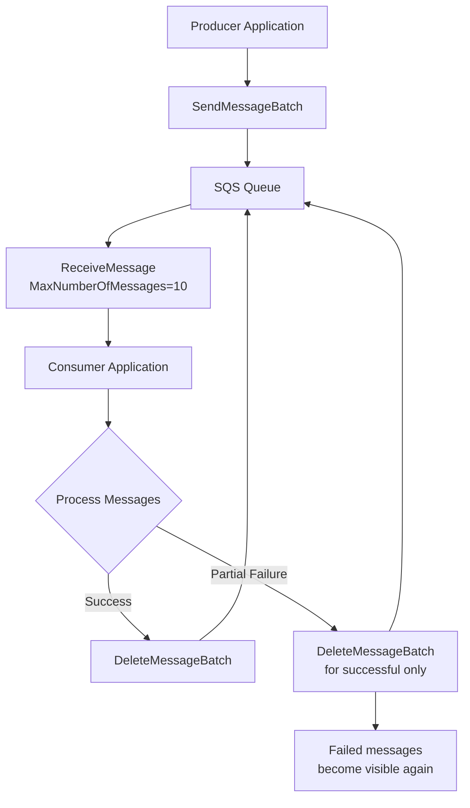
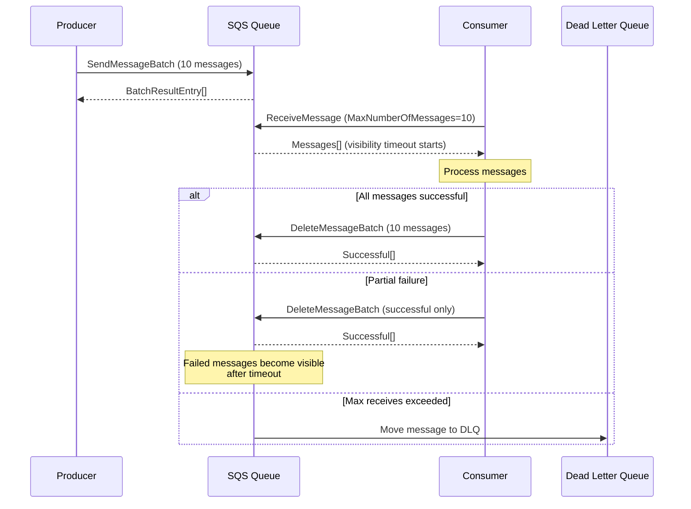
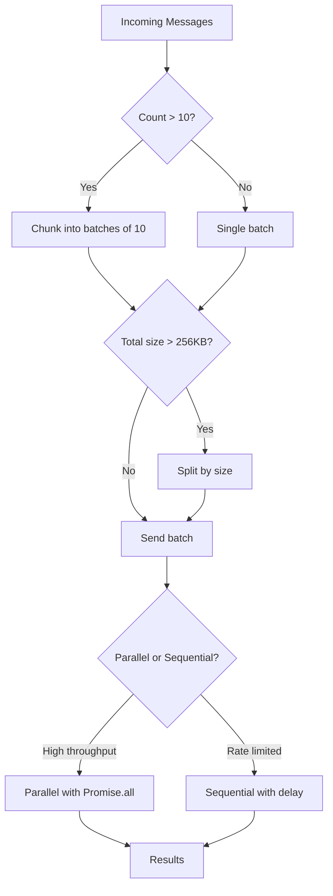

# How to Batch Operations in SQS

Author: [nawazdhandala](https://github.com/nawazdhandala)

Tags: AWS, SQS, Message Queue, Batch Processing, Node.js, Python, Performance, Cloud

Description: Learn how to batch operations in Amazon SQS to improve throughput, reduce costs, and optimize performance. Covers batch sending, receiving, deleting, and best practices for production workloads.

---

Amazon Simple Queue Service (SQS) allows you to batch multiple operations into a single API call, significantly improving throughput and reducing costs. Instead of making individual API calls for each message, batch operations let you send, receive, or delete up to 10 messages at once. Organizations processing millions of messages daily can see cost reductions of up to 90% by switching from individual to batch operations.

## Why Batch Operations Matter

| Metric | Individual Operations | Batch Operations |
|--------|----------------------|------------------|
| API calls per 1000 messages | 1000 | 100 |
| Network round trips | 1000 | 100 |
| Cost (per million messages) | $0.40 | $0.04 |
| Throughput | ~100 msg/sec | ~1000 msg/sec |
| Latency overhead | High | Low |

## Batch Operations Overview

SQS provides three primary batch operations that work together to optimize message processing workflows.



## Batch Send Messages

Sending messages in batches reduces API calls and improves throughput. Each batch can contain up to 10 messages with a combined payload size of 256 KB.

The following Node.js example demonstrates sending multiple messages in a single batch request using the AWS SDK v3.

```javascript
const { SQSClient, SendMessageBatchCommand } = require('@aws-sdk/client-sqs');

// Initialize the SQS client with your region
const sqsClient = new SQSClient({ region: 'us-east-1' });

// Queue URL from AWS Console or CloudFormation output
const QUEUE_URL = 'https://sqs.us-east-1.amazonaws.com/123456789012/my-queue';

// Send multiple messages in a single batch request
// Each message needs a unique Id within the batch for tracking results
async function sendMessageBatch(messages) {
  // Transform messages into the format required by SQS batch API
  // Id must be unique within each batch request
  const entries = messages.map((message, index) => ({
    Id: `msg-${index}`,
    MessageBody: JSON.stringify(message.body),
    // Optional: Add message attributes for filtering or metadata
    MessageAttributes: message.attributes || {},
    // Optional: Delay delivery of specific messages (0-900 seconds)
    DelaySeconds: message.delaySeconds || 0,
  }));

  const command = new SendMessageBatchCommand({
    QueueUrl: QUEUE_URL,
    Entries: entries,
  });

  try {
    const response = await sqsClient.send(command);

    // Track successful and failed messages separately
    console.log(`Successfully sent: ${response.Successful?.length || 0}`);
    console.log(`Failed to send: ${response.Failed?.length || 0}`);

    // Handle partial failures by logging or retrying failed messages
    if (response.Failed && response.Failed.length > 0) {
      response.Failed.forEach(failure => {
        console.error(`Failed message ${failure.Id}: ${failure.Message}`);
      });
    }

    return response;
  } catch (error) {
    console.error('Batch send failed:', error.message);
    throw error;
  }
}

// Example usage with multiple order messages
async function processOrders() {
  const orders = [
    { body: { orderId: 'ORD-001', amount: 99.99, customer: 'alice@example.com' } },
    { body: { orderId: 'ORD-002', amount: 149.99, customer: 'bob@example.com' } },
    { body: { orderId: 'ORD-003', amount: 29.99, customer: 'carol@example.com' } },
    { body: { orderId: 'ORD-004', amount: 199.99, customer: 'dave@example.com' } },
    { body: { orderId: 'ORD-005', amount: 79.99, customer: 'eve@example.com' } },
  ];

  await sendMessageBatch(orders);
}

processOrders().catch(console.error);
```

## Chunking Large Message Sets

When processing more than 10 messages, you need to split them into chunks of 10 and send multiple batch requests.

The following utility function handles chunking automatically and processes batches in parallel for maximum throughput.

```javascript
const { SQSClient, SendMessageBatchCommand } = require('@aws-sdk/client-sqs');

const sqsClient = new SQSClient({ region: 'us-east-1' });
const QUEUE_URL = 'https://sqs.us-east-1.amazonaws.com/123456789012/my-queue';

// Maximum batch size allowed by SQS
const MAX_BATCH_SIZE = 10;

// Split an array into chunks of specified size
function chunkArray(array, chunkSize) {
  const chunks = [];
  for (let i = 0; i < array.length; i += chunkSize) {
    chunks.push(array.slice(i, i + chunkSize));
  }
  return chunks;
}

// Send a large number of messages by splitting into batches
// Processes batches in parallel for better throughput
async function sendManyMessages(messages) {
  // Split messages into chunks of 10
  const batches = chunkArray(messages, MAX_BATCH_SIZE);

  console.log(`Sending ${messages.length} messages in ${batches.length} batches`);

  // Track results across all batches
  const results = {
    successful: [],
    failed: [],
  };

  // Process all batches in parallel for maximum throughput
  // For rate-limited scenarios, consider processing sequentially
  const batchPromises = batches.map(async (batch, batchIndex) => {
    const entries = batch.map((message, msgIndex) => ({
      // Create globally unique IDs using batch and message index
      Id: `batch-${batchIndex}-msg-${msgIndex}`,
      MessageBody: JSON.stringify(message),
    }));

    const command = new SendMessageBatchCommand({
      QueueUrl: QUEUE_URL,
      Entries: entries,
    });

    try {
      const response = await sqsClient.send(command);

      if (response.Successful) {
        results.successful.push(...response.Successful);
      }
      if (response.Failed) {
        results.failed.push(...response.Failed);
      }
    } catch (error) {
      // If entire batch fails, mark all messages as failed
      entries.forEach(entry => {
        results.failed.push({
          Id: entry.Id,
          Message: error.message,
          Code: 'BatchError',
        });
      });
    }
  });

  await Promise.all(batchPromises);

  console.log(`Total successful: ${results.successful.length}`);
  console.log(`Total failed: ${results.failed.length}`);

  return results;
}

// Example: Send 50 messages
async function main() {
  const messages = Array.from({ length: 50 }, (_, i) => ({
    id: i + 1,
    data: `Message payload ${i + 1}`,
    timestamp: new Date().toISOString(),
  }));

  await sendManyMessages(messages);
}

main().catch(console.error);
```

## Batch Receive Messages

Receiving messages in batches is more efficient than fetching one at a time. Configure `MaxNumberOfMessages` to retrieve up to 10 messages per request.

The following example shows how to configure long polling with batch receive for optimal efficiency.

```javascript
const { SQSClient, ReceiveMessageCommand } = require('@aws-sdk/client-sqs');

const sqsClient = new SQSClient({ region: 'us-east-1' });
const QUEUE_URL = 'https://sqs.us-east-1.amazonaws.com/123456789012/my-queue';

// Receive up to 10 messages in a single API call
// Long polling reduces empty responses and API costs
async function receiveMessageBatch() {
  const command = new ReceiveMessageCommand({
    QueueUrl: QUEUE_URL,
    // Request maximum messages per call (1-10)
    MaxNumberOfMessages: 10,
    // Long polling: wait up to 20 seconds for messages
    // Reduces empty responses and API costs
    WaitTimeSeconds: 20,
    // How long messages stay invisible while processing (seconds)
    VisibilityTimeout: 60,
    // Include message attributes in response
    MessageAttributeNames: ['All'],
    // Include system attributes like ApproximateReceiveCount
    AttributeNames: ['All'],
  });

  try {
    const response = await sqsClient.send(command);

    // Response.Messages may be undefined if queue is empty
    const messages = response.Messages || [];
    console.log(`Received ${messages.length} messages`);

    return messages;
  } catch (error) {
    console.error('Receive failed:', error.message);
    throw error;
  }
}

// Process messages with proper error handling
async function processMessages(messages) {
  const results = {
    successful: [],
    failed: [],
  };

  for (const message of messages) {
    try {
      // Parse the message body
      const body = JSON.parse(message.Body);
      console.log(`Processing message ${message.MessageId}:`, body);

      // Your business logic here
      await processBusinessLogic(body);

      results.successful.push(message);
    } catch (error) {
      console.error(`Failed to process ${message.MessageId}:`, error.message);
      results.failed.push({ message, error });
    }
  }

  return results;
}

async function processBusinessLogic(data) {
  // Simulate processing time
  await new Promise(resolve => setTimeout(resolve, 100));
  console.log('Processed:', data);
}

// Main consumer loop
async function startConsumer() {
  console.log('Starting consumer...');

  while (true) {
    const messages = await receiveMessageBatch();

    if (messages.length > 0) {
      const results = await processMessages(messages);

      // Delete only successfully processed messages
      if (results.successful.length > 0) {
        await deleteMessageBatch(results.successful);
      }

      // Failed messages will become visible again after VisibilityTimeout
      if (results.failed.length > 0) {
        console.log(`${results.failed.length} messages will be retried`);
      }
    }
  }
}
```

## Batch Delete Messages

After processing messages, delete them in batches to remove them from the queue efficiently.

The following function deletes multiple messages using their receipt handles in a single API call.

```javascript
const { SQSClient, DeleteMessageBatchCommand } = require('@aws-sdk/client-sqs');

const sqsClient = new SQSClient({ region: 'us-east-1' });
const QUEUE_URL = 'https://sqs.us-east-1.amazonaws.com/123456789012/my-queue';

// Delete multiple messages in a single API call
// Only delete messages that were successfully processed
async function deleteMessageBatch(messages) {
  // Map messages to delete entries using their receipt handles
  // ReceiptHandle is required for deletion and is unique per receive
  const entries = messages.map((message, index) => ({
    Id: `delete-${index}`,
    ReceiptHandle: message.ReceiptHandle,
  }));

  const command = new DeleteMessageBatchCommand({
    QueueUrl: QUEUE_URL,
    Entries: entries,
  });

  try {
    const response = await sqsClient.send(command);

    console.log(`Deleted: ${response.Successful?.length || 0}`);

    // Handle partial failures
    if (response.Failed && response.Failed.length > 0) {
      console.error('Some deletes failed:');
      response.Failed.forEach(failure => {
        console.error(`  ${failure.Id}: ${failure.Message}`);
      });
    }

    return response;
  } catch (error) {
    console.error('Batch delete failed:', error.message);
    throw error;
  }
}
```

## Python Implementation

The following Python example demonstrates batch operations using boto3, covering send, receive, and delete operations.

```python
import json
import boto3
from typing import List, Dict, Any
from dataclasses import dataclass
from concurrent.futures import ThreadPoolExecutor

# Initialize SQS client
sqs = boto3.client('sqs', region_name='us-east-1')

QUEUE_URL = 'https://sqs.us-east-1.amazonaws.com/123456789012/my-queue'
MAX_BATCH_SIZE = 10


def send_message_batch(messages: List[Dict[str, Any]]) -> Dict[str, Any]:
    """
    Send multiple messages to SQS in a single batch request.

    Args:
        messages: List of message dictionaries with 'body' and optional 'attributes'

    Returns:
        Dictionary with 'Successful' and 'Failed' lists
    """
    # Build entries for batch request
    entries = []
    for index, message in enumerate(messages):
        entry = {
            'Id': f'msg-{index}',
            'MessageBody': json.dumps(message.get('body', message)),
        }

        # Add message attributes if provided
        if 'attributes' in message:
            entry['MessageAttributes'] = message['attributes']

        # Add delay if specified
        if 'delay_seconds' in message:
            entry['DelaySeconds'] = message['delay_seconds']

        entries.append(entry)

    response = sqs.send_message_batch(
        QueueUrl=QUEUE_URL,
        Entries=entries
    )

    successful_count = len(response.get('Successful', []))
    failed_count = len(response.get('Failed', []))

    print(f'Sent {successful_count} messages, {failed_count} failed')

    # Log any failures for debugging
    for failure in response.get('Failed', []):
        print(f"Failed to send {failure['Id']}: {failure['Message']}")

    return response


def send_many_messages(messages: List[Dict[str, Any]]) -> Dict[str, List]:
    """
    Send large number of messages by splitting into batches.
    Processes batches in parallel for better throughput.

    Args:
        messages: List of messages to send

    Returns:
        Dictionary with all successful and failed results
    """
    # Split messages into chunks of 10
    batches = [
        messages[i:i + MAX_BATCH_SIZE]
        for i in range(0, len(messages), MAX_BATCH_SIZE)
    ]

    print(f'Sending {len(messages)} messages in {len(batches)} batches')

    results = {'successful': [], 'failed': []}

    # Process batches in parallel using thread pool
    with ThreadPoolExecutor(max_workers=10) as executor:
        futures = [
            executor.submit(send_message_batch, batch)
            for batch in batches
        ]

        for future in futures:
            try:
                response = future.result()
                results['successful'].extend(response.get('Successful', []))
                results['failed'].extend(response.get('Failed', []))
            except Exception as e:
                print(f'Batch failed with error: {e}')

    return results


def receive_message_batch(max_messages: int = 10) -> List[Dict]:
    """
    Receive messages from SQS using long polling.

    Args:
        max_messages: Maximum number of messages to receive (1-10)

    Returns:
        List of received messages
    """
    response = sqs.receive_message(
        QueueUrl=QUEUE_URL,
        MaxNumberOfMessages=min(max_messages, 10),
        WaitTimeSeconds=20,  # Long polling
        VisibilityTimeout=60,
        MessageAttributeNames=['All'],
        AttributeNames=['All']
    )

    messages = response.get('Messages', [])
    print(f'Received {len(messages)} messages')

    return messages


def delete_message_batch(messages: List[Dict]) -> Dict[str, Any]:
    """
    Delete multiple messages from SQS in a single batch request.

    Args:
        messages: List of message objects with ReceiptHandle

    Returns:
        Batch delete response
    """
    if not messages:
        return {'Successful': [], 'Failed': []}

    entries = [
        {
            'Id': f'delete-{index}',
            'ReceiptHandle': message['ReceiptHandle']
        }
        for index, message in enumerate(messages)
    ]

    response = sqs.delete_message_batch(
        QueueUrl=QUEUE_URL,
        Entries=entries
    )

    successful_count = len(response.get('Successful', []))
    failed_count = len(response.get('Failed', []))

    print(f'Deleted {successful_count} messages, {failed_count} failed')

    return response


def process_message(message: Dict) -> bool:
    """
    Process a single message. Returns True if successful.
    """
    try:
        body = json.loads(message['Body'])
        print(f"Processing message {message['MessageId']}: {body}")

        # Your business logic here
        # ...

        return True
    except Exception as e:
        print(f"Failed to process {message['MessageId']}: {e}")
        return False


def consumer_loop():
    """
    Main consumer loop that receives and processes messages in batches.
    """
    print('Starting consumer...')

    while True:
        # Receive batch of messages
        messages = receive_message_batch()

        if not messages:
            continue

        # Process messages and track results
        successful = []
        failed = []

        for message in messages:
            if process_message(message):
                successful.append(message)
            else:
                failed.append(message)

        # Delete only successfully processed messages
        if successful:
            delete_message_batch(successful)

        if failed:
            print(f'{len(failed)} messages will be retried after visibility timeout')


# Example usage
if __name__ == '__main__':
    # Send batch of messages
    orders = [
        {'body': {'order_id': f'ORD-{i}', 'amount': 99.99 * i}}
        for i in range(1, 26)
    ]

    send_many_messages(orders)
```

## Message Processing Flow

Understanding the complete message lifecycle helps design robust batch processing systems.



## Change Message Visibility in Batches

When processing takes longer than expected, extend the visibility timeout to prevent messages from becoming visible to other consumers.

The following function extends visibility for multiple messages simultaneously.

```javascript
const { SQSClient, ChangeMessageVisibilityBatchCommand } = require('@aws-sdk/client-sqs');

const sqsClient = new SQSClient({ region: 'us-east-1' });
const QUEUE_URL = 'https://sqs.us-east-1.amazonaws.com/123456789012/my-queue';

// Extend visibility timeout for messages that need more processing time
// Prevents messages from becoming visible to other consumers
async function extendVisibilityBatch(messages, additionalSeconds) {
  const entries = messages.map((message, index) => ({
    Id: `visibility-${index}`,
    ReceiptHandle: message.ReceiptHandle,
    // New visibility timeout from now (0-43200 seconds)
    VisibilityTimeout: additionalSeconds,
  }));

  const command = new ChangeMessageVisibilityBatchCommand({
    QueueUrl: QUEUE_URL,
    Entries: entries,
  });

  try {
    const response = await sqsClient.send(command);
    console.log(`Extended visibility for ${response.Successful?.length || 0} messages`);
    return response;
  } catch (error) {
    console.error('Visibility change failed:', error.message);
    throw error;
  }
}

// Example: Processing with visibility extension
async function processWithVisibilityExtension(messages) {
  // Set up periodic visibility extension every 30 seconds
  const extensionInterval = setInterval(async () => {
    try {
      // Extend by 60 seconds each time
      await extendVisibilityBatch(messages, 60);
    } catch (error) {
      console.error('Failed to extend visibility:', error);
    }
  }, 30000);

  try {
    // Process messages (potentially long-running)
    for (const message of messages) {
      await processLongRunningTask(message);
    }
  } finally {
    // Clean up interval when processing completes
    clearInterval(extensionInterval);
  }
}

async function processLongRunningTask(message) {
  // Simulate long processing
  await new Promise(resolve => setTimeout(resolve, 45000));
}
```

## FIFO Queue Batch Operations

FIFO queues require additional parameters for batch operations, including message group IDs and deduplication IDs.

The following example shows batch sending to a FIFO queue with proper grouping.

```javascript
const { SQSClient, SendMessageBatchCommand } = require('@aws-sdk/client-sqs');

const sqsClient = new SQSClient({ region: 'us-east-1' });

// FIFO queue URLs end with .fifo
const FIFO_QUEUE_URL = 'https://sqs.us-east-1.amazonaws.com/123456789012/my-queue.fifo';

// Send batch to FIFO queue with message grouping
// Messages in the same group are processed in order
async function sendFifoBatch(messages) {
  const entries = messages.map((message, index) => ({
    Id: `msg-${index}`,
    MessageBody: JSON.stringify(message.body),
    // Messages with same GroupId are processed in FIFO order
    // Use different groups for parallel processing of unrelated messages
    MessageGroupId: message.groupId || 'default-group',
    // Unique ID for deduplication (prevents duplicate delivery)
    // Required if ContentBasedDeduplication is not enabled on queue
    MessageDeduplicationId: message.deduplicationId || `${Date.now()}-${index}`,
  }));

  const command = new SendMessageBatchCommand({
    QueueUrl: FIFO_QUEUE_URL,
    Entries: entries,
  });

  try {
    const response = await sqsClient.send(command);
    console.log(`FIFO batch sent: ${response.Successful?.length || 0} successful`);
    return response;
  } catch (error) {
    console.error('FIFO batch send failed:', error.message);
    throw error;
  }
}

// Example: Group orders by customer for sequential processing per customer
async function sendCustomerOrders() {
  const orders = [
    { body: { orderId: 'ORD-1', item: 'Widget' }, groupId: 'customer-123' },
    { body: { orderId: 'ORD-2', item: 'Gadget' }, groupId: 'customer-456' },
    { body: { orderId: 'ORD-3', item: 'Widget' }, groupId: 'customer-123' },
    { body: { orderId: 'ORD-4', item: 'Tool' }, groupId: 'customer-789' },
    { body: { orderId: 'ORD-5', item: 'Part' }, groupId: 'customer-456' },
  ];

  // Generate unique deduplication IDs
  const messagesWithDedup = orders.map((order, index) => ({
    ...order,
    deduplicationId: `${order.body.orderId}-${Date.now()}`,
  }));

  await sendFifoBatch(messagesWithDedup);
}

sendCustomerOrders().catch(console.error);
```

## Error Handling and Retry Logic

Robust error handling ensures messages are not lost when batch operations partially fail.

The following implementation includes automatic retry for failed messages with exponential backoff.

```javascript
const { SQSClient, SendMessageBatchCommand } = require('@aws-sdk/client-sqs');

const sqsClient = new SQSClient({ region: 'us-east-1' });
const QUEUE_URL = 'https://sqs.us-east-1.amazonaws.com/123456789012/my-queue';

// Configuration for retry behavior
const RETRY_CONFIG = {
  maxRetries: 3,
  baseDelayMs: 1000,
  maxDelayMs: 10000,
};

// Calculate delay with exponential backoff and jitter
function calculateBackoff(attempt) {
  const exponentialDelay = RETRY_CONFIG.baseDelayMs * Math.pow(2, attempt);
  const cappedDelay = Math.min(exponentialDelay, RETRY_CONFIG.maxDelayMs);
  // Add random jitter (0-25% of delay) to prevent thundering herd
  const jitter = cappedDelay * Math.random() * 0.25;
  return cappedDelay + jitter;
}

// Sleep for specified milliseconds
function sleep(ms) {
  return new Promise(resolve => setTimeout(resolve, ms));
}

// Send batch with automatic retry for failed messages
async function sendBatchWithRetry(messages, attempt = 0) {
  const entries = messages.map((message, index) => ({
    Id: message.id || `msg-${index}`,
    MessageBody: JSON.stringify(message.body || message),
  }));

  const command = new SendMessageBatchCommand({
    QueueUrl: QUEUE_URL,
    Entries: entries,
  });

  try {
    const response = await sqsClient.send(command);

    const successful = response.Successful || [];
    const failed = response.Failed || [];

    // If all messages succeeded, return results
    if (failed.length === 0) {
      return { successful, failed: [] };
    }

    // Check if we should retry failed messages
    if (attempt < RETRY_CONFIG.maxRetries) {
      console.log(`Retrying ${failed.length} failed messages (attempt ${attempt + 1})`);

      // Wait with exponential backoff before retry
      const delay = calculateBackoff(attempt);
      await sleep(delay);

      // Extract failed messages for retry
      const failedIds = new Set(failed.map(f => f.Id));
      const messagesToRetry = messages.filter((m, i) =>
        failedIds.has(m.id || `msg-${i}`)
      );

      // Recursively retry failed messages
      const retryResult = await sendBatchWithRetry(messagesToRetry, attempt + 1);

      return {
        successful: [...successful, ...retryResult.successful],
        failed: retryResult.failed,
      };
    }

    // Max retries exceeded, return remaining failures
    console.error(`Max retries exceeded for ${failed.length} messages`);
    return { successful, failed };

  } catch (error) {
    // Handle complete batch failure
    if (attempt < RETRY_CONFIG.maxRetries) {
      console.log(`Batch failed, retrying (attempt ${attempt + 1}): ${error.message}`);

      const delay = calculateBackoff(attempt);
      await sleep(delay);

      return sendBatchWithRetry(messages, attempt + 1);
    }

    throw new Error(`Batch send failed after ${RETRY_CONFIG.maxRetries} retries: ${error.message}`);
  }
}

// Example usage with error handling
async function main() {
  const messages = [
    { id: 'order-1', body: { type: 'order', data: 'payload 1' } },
    { id: 'order-2', body: { type: 'order', data: 'payload 2' } },
    { id: 'order-3', body: { type: 'order', data: 'payload 3' } },
  ];

  try {
    const result = await sendBatchWithRetry(messages);
    console.log(`Completed: ${result.successful.length} sent, ${result.failed.length} failed`);
  } catch (error) {
    console.error('Failed to send messages:', error.message);
  }
}

main();
```

## Performance Optimization Strategies

Maximizing batch operation performance requires understanding SQS limits and optimizing accordingly.



The following implementation includes message size tracking and automatic batch splitting.

```javascript
const { SQSClient, SendMessageBatchCommand } = require('@aws-sdk/client-sqs');

const sqsClient = new SQSClient({ region: 'us-east-1' });
const QUEUE_URL = 'https://sqs.us-east-1.amazonaws.com/123456789012/my-queue';

// SQS limits
const MAX_BATCH_SIZE = 10;
const MAX_BATCH_BYTES = 262144; // 256 KB
const MAX_MESSAGE_BYTES = 262144; // 256 KB per message

// Calculate message size in bytes (approximate)
function getMessageSize(message) {
  const json = JSON.stringify(message);
  return Buffer.byteLength(json, 'utf8');
}

// Split messages into batches respecting both count and size limits
function createOptimalBatches(messages) {
  const batches = [];
  let currentBatch = [];
  let currentBatchSize = 0;

  for (const message of messages) {
    const messageSize = getMessageSize(message);

    // Check if message is too large
    if (messageSize > MAX_MESSAGE_BYTES) {
      console.warn(`Message exceeds size limit (${messageSize} bytes), skipping`);
      continue;
    }

    // Check if adding this message would exceed batch limits
    const wouldExceedCount = currentBatch.length >= MAX_BATCH_SIZE;
    const wouldExceedSize = currentBatchSize + messageSize > MAX_BATCH_BYTES;

    if (wouldExceedCount || wouldExceedSize) {
      // Start a new batch
      if (currentBatch.length > 0) {
        batches.push(currentBatch);
      }
      currentBatch = [];
      currentBatchSize = 0;
    }

    currentBatch.push(message);
    currentBatchSize += messageSize;
  }

  // Add remaining messages
  if (currentBatch.length > 0) {
    batches.push(currentBatch);
  }

  return batches;
}

// Send with optimal batching and configurable parallelism
async function sendOptimized(messages, options = {}) {
  const {
    parallel = true,
    maxConcurrent = 10,
    delayBetweenBatches = 0,
  } = options;

  const batches = createOptimalBatches(messages);
  console.log(`Created ${batches.length} optimal batches from ${messages.length} messages`);

  const results = { successful: [], failed: [] };

  if (parallel) {
    // Process batches in parallel with concurrency limit
    const chunks = [];
    for (let i = 0; i < batches.length; i += maxConcurrent) {
      chunks.push(batches.slice(i, i + maxConcurrent));
    }

    for (const chunk of chunks) {
      const promises = chunk.map(batch => sendSingleBatch(batch));
      const chunkResults = await Promise.all(promises);

      for (const result of chunkResults) {
        results.successful.push(...result.successful);
        results.failed.push(...result.failed);
      }
    }
  } else {
    // Process batches sequentially with optional delay
    for (const batch of batches) {
      const result = await sendSingleBatch(batch);
      results.successful.push(...result.successful);
      results.failed.push(...result.failed);

      if (delayBetweenBatches > 0) {
        await new Promise(r => setTimeout(r, delayBetweenBatches));
      }
    }
  }

  return results;
}

async function sendSingleBatch(messages) {
  const entries = messages.map((msg, i) => ({
    Id: `msg-${i}`,
    MessageBody: JSON.stringify(msg),
  }));

  const command = new SendMessageBatchCommand({
    QueueUrl: QUEUE_URL,
    Entries: entries,
  });

  const response = await sqsClient.send(command);

  return {
    successful: response.Successful || [],
    failed: response.Failed || [],
  };
}

// Example usage
async function main() {
  // Generate messages of varying sizes
  const messages = Array.from({ length: 100 }, (_, i) => ({
    id: i + 1,
    data: 'x'.repeat(Math.floor(Math.random() * 10000)),
    timestamp: new Date().toISOString(),
  }));

  const result = await sendOptimized(messages, {
    parallel: true,
    maxConcurrent: 5,
  });

  console.log(`Sent: ${result.successful.length}, Failed: ${result.failed.length}`);
}

main().catch(console.error);
```

## Monitoring Batch Operations

Track batch operation metrics to identify performance issues and optimize throughput.

```javascript
const { SQSClient, SendMessageBatchCommand } = require('@aws-sdk/client-sqs');

const sqsClient = new SQSClient({ region: 'us-east-1' });
const QUEUE_URL = 'https://sqs.us-east-1.amazonaws.com/123456789012/my-queue';

// Metrics collector for batch operations
class BatchMetrics {
  constructor() {
    this.metrics = {
      totalBatches: 0,
      totalMessages: 0,
      successfulMessages: 0,
      failedMessages: 0,
      totalLatencyMs: 0,
      batchSizes: [],
    };
  }

  recordBatch(batchSize, successCount, failCount, latencyMs) {
    this.metrics.totalBatches++;
    this.metrics.totalMessages += batchSize;
    this.metrics.successfulMessages += successCount;
    this.metrics.failedMessages += failCount;
    this.metrics.totalLatencyMs += latencyMs;
    this.metrics.batchSizes.push(batchSize);
  }

  getStats() {
    const { totalBatches, totalMessages, successfulMessages, failedMessages, totalLatencyMs, batchSizes } = this.metrics;

    return {
      totalBatches,
      totalMessages,
      successRate: totalMessages > 0 ? (successfulMessages / totalMessages * 100).toFixed(2) + '%' : '0%',
      averageLatencyMs: totalBatches > 0 ? (totalLatencyMs / totalBatches).toFixed(2) : 0,
      averageBatchSize: batchSizes.length > 0 ? (batchSizes.reduce((a, b) => a + b, 0) / batchSizes.length).toFixed(2) : 0,
      throughputPerSecond: totalLatencyMs > 0 ? (totalMessages / (totalLatencyMs / 1000)).toFixed(2) : 0,
    };
  }

  reset() {
    this.metrics = {
      totalBatches: 0,
      totalMessages: 0,
      successfulMessages: 0,
      failedMessages: 0,
      totalLatencyMs: 0,
      batchSizes: [],
    };
  }
}

const metrics = new BatchMetrics();

// Send batch with metrics collection
async function sendBatchWithMetrics(messages) {
  const startTime = Date.now();

  const entries = messages.map((msg, i) => ({
    Id: `msg-${i}`,
    MessageBody: JSON.stringify(msg),
  }));

  const command = new SendMessageBatchCommand({
    QueueUrl: QUEUE_URL,
    Entries: entries,
  });

  try {
    const response = await sqsClient.send(command);
    const latency = Date.now() - startTime;

    const successCount = response.Successful?.length || 0;
    const failCount = response.Failed?.length || 0;

    metrics.recordBatch(messages.length, successCount, failCount, latency);

    return response;
  } catch (error) {
    const latency = Date.now() - startTime;
    metrics.recordBatch(messages.length, 0, messages.length, latency);
    throw error;
  }
}

// Example: Send messages and report metrics
async function main() {
  const batches = 10;
  const messagesPerBatch = 10;

  for (let i = 0; i < batches; i++) {
    const messages = Array.from({ length: messagesPerBatch }, (_, j) => ({
      id: i * messagesPerBatch + j,
      data: `Message ${i * messagesPerBatch + j}`,
    }));

    await sendBatchWithMetrics(messages);
  }

  console.log('Batch Operation Metrics:');
  console.log(JSON.stringify(metrics.getStats(), null, 2));
}

main().catch(console.error);
```

## Best Practices

| Practice | Description |
|----------|-------------|
| **Always use batch operations** | Individual API calls are 10x more expensive and slower |
| **Maximize batch size** | Fill batches to 10 messages when possible for best efficiency |
| **Use long polling** | Set WaitTimeSeconds to 20 to reduce empty responses |
| **Handle partial failures** | Check both Successful and Failed arrays in responses |
| **Implement retry with backoff** | Use exponential backoff for transient failures |
| **Track message size** | Monitor payload sizes to avoid hitting the 256 KB limit |
| **Delete after processing** | Only delete messages that were successfully processed |
| **Extend visibility proactively** | For long-running tasks, extend visibility before timeout |
| **Monitor batch metrics** | Track success rates, latencies, and throughput |
| **Use FIFO queues carefully** | Group IDs limit throughput to 300 messages per second per group |

## Summary

Batch operations in SQS dramatically improve throughput and reduce costs compared to individual message operations. By sending, receiving, and deleting messages in batches of up to 10, you can achieve up to 10x cost savings and significantly higher throughput. Key practices include maximizing batch sizes, handling partial failures gracefully, implementing retry logic with exponential backoff, and monitoring batch operation metrics to identify optimization opportunities. For applications processing high message volumes, batch operations are essential for building cost-effective and performant messaging systems.
