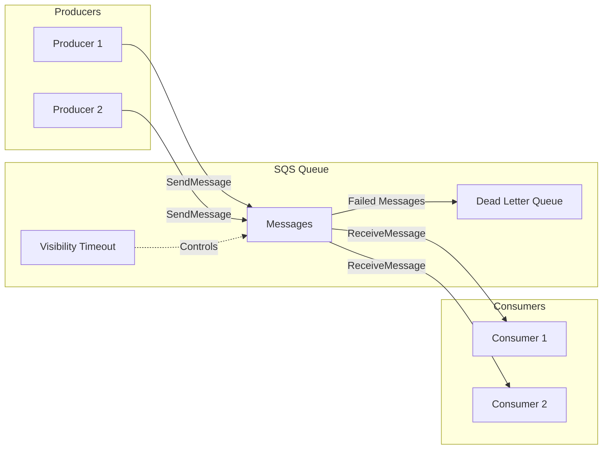
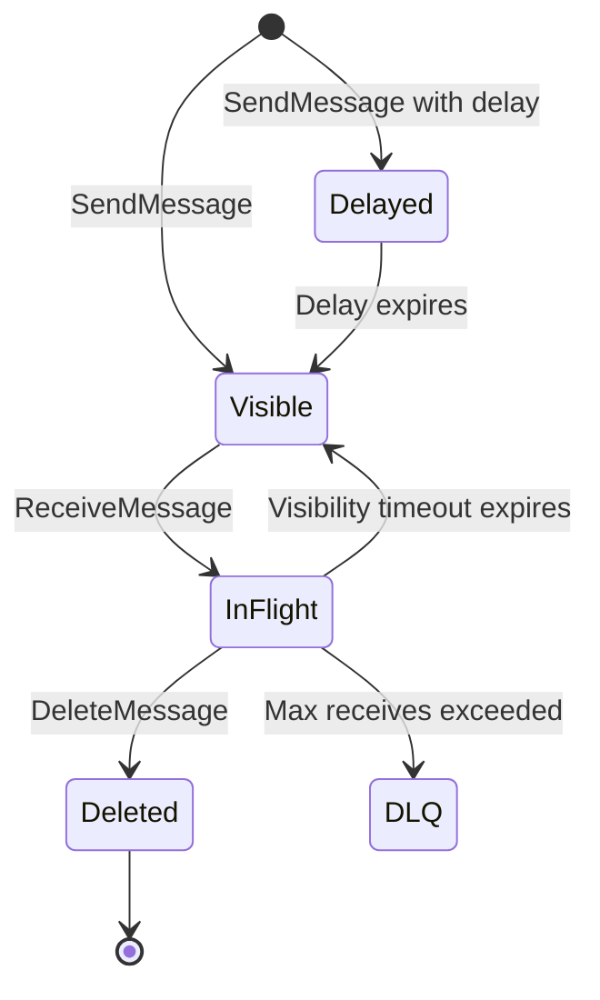
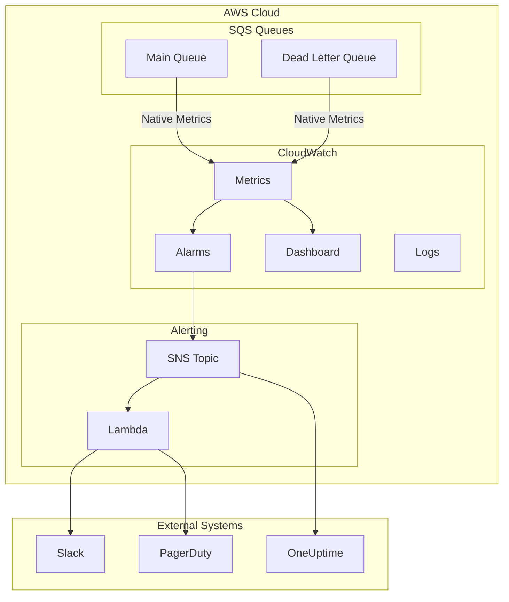

# How to Monitor SQS with CloudWatch

Author: [nawazdhandala](https://www.github.com/nawazdhandala)

Tags: AWS, SQS, CloudWatch, Monitoring, Queues, DevOps, Observability, Metrics, Alarms

Description: Learn how to effectively monitor Amazon SQS queues using CloudWatch. Covers essential metrics, custom dashboards, alerting strategies, and best practices for maintaining healthy queue-based architectures.

---

> Amazon Simple Queue Service (SQS) is a cornerstone of distributed systems, enabling reliable asynchronous communication between services. Proper monitoring ensures your queues remain healthy and your applications responsive.

CloudWatch provides native integration with SQS, offering metrics that reveal queue health, consumer performance, and potential bottlenecks. Understanding these metrics is essential for operating reliable queue-based systems.

---

## Understanding SQS Architecture

Before diving into monitoring, understanding how SQS works helps you interpret the metrics correctly.

The following diagram illustrates the message lifecycle in SQS:



Key concepts:
- **Visible Messages**: Messages available for consumers to process
- **In-Flight Messages**: Messages currently being processed (within visibility timeout)
- **Dead Letter Queue (DLQ)**: Queue that receives messages that fail processing repeatedly

---

## Essential SQS Metrics

CloudWatch automatically collects several metrics for every SQS queue. Understanding each metric helps you build effective monitoring.

### Core Queue Metrics

| Metric | Description | Unit |
|--------|-------------|------|
| `ApproximateNumberOfMessagesVisible` | Messages available for retrieval | Count |
| `ApproximateNumberOfMessagesNotVisible` | Messages being processed (in-flight) | Count |
| `ApproximateNumberOfMessagesDelayed` | Messages in delay queue | Count |
| `NumberOfMessagesSent` | Messages added to queue | Count |
| `NumberOfMessagesReceived` | Messages delivered to consumers | Count |
| `NumberOfMessagesDeleted` | Messages removed after processing | Count |
| `ApproximateAgeOfOldestMessage` | Age of oldest message in queue | Seconds |
| `SentMessageSize` | Size of messages sent | Bytes |

The following diagram shows how messages transition between states:



---

## Setting Up CloudWatch Monitoring

### Viewing Metrics in AWS Console

Navigate to CloudWatch in the AWS Console and select SQS metrics. Each queue publishes metrics under the `AWS/SQS` namespace.

The following AWS CLI command retrieves the current message count for a queue:

```bash
# Get the approximate number of visible messages in a queue
# Replace YOUR_QUEUE_NAME with your actual queue name
aws cloudwatch get-metric-statistics \
    --namespace AWS/SQS \
    --metric-name ApproximateNumberOfMessagesVisible \
    --dimensions Name=QueueName,Value=YOUR_QUEUE_NAME \
    --start-time $(date -u -d '1 hour ago' +%Y-%m-%dT%H:%M:%SZ) \
    --end-time $(date -u +%Y-%m-%dT%H:%M:%SZ) \
    --period 300 \
    --statistics Average
```

### Using AWS SDK (Python/Boto3)

The following Python script retrieves SQS queue attributes directly, which is often faster than querying CloudWatch for current values:

```python
import boto3
from datetime import datetime, timedelta

# Initialize the SQS client
# Credentials are loaded from environment variables or IAM role
sqs = boto3.client('sqs', region_name='us-east-1')
cloudwatch = boto3.client('cloudwatch', region_name='us-east-1')

def get_queue_metrics(queue_url: str) -> dict:
    """
    Retrieve current queue attributes directly from SQS.
    Faster than CloudWatch for real-time monitoring.
    """
    # Request all relevant queue attributes in a single API call
    response = sqs.get_queue_attributes(
        QueueUrl=queue_url,
        AttributeNames=[
            'ApproximateNumberOfMessages',           # Visible messages
            'ApproximateNumberOfMessagesNotVisible', # In-flight messages
            'ApproximateNumberOfMessagesDelayed',    # Delayed messages
        ]
    )

    attrs = response['Attributes']
    return {
        'visible': int(attrs['ApproximateNumberOfMessages']),
        'in_flight': int(attrs['ApproximateNumberOfMessagesNotVisible']),
        'delayed': int(attrs['ApproximateNumberOfMessagesDelayed']),
        'total': (
            int(attrs['ApproximateNumberOfMessages']) +
            int(attrs['ApproximateNumberOfMessagesNotVisible']) +
            int(attrs['ApproximateNumberOfMessagesDelayed'])
        )
    }

def get_oldest_message_age(queue_name: str) -> float:
    """
    Retrieve the age of the oldest message from CloudWatch.
    High values indicate processing bottlenecks.
    """
    end_time = datetime.utcnow()
    start_time = end_time - timedelta(minutes=5)

    response = cloudwatch.get_metric_statistics(
        Namespace='AWS/SQS',
        MetricName='ApproximateAgeOfOldestMessage',
        Dimensions=[
            {'Name': 'QueueName', 'Value': queue_name}
        ],
        StartTime=start_time,
        EndTime=end_time,
        Period=60,          # 1-minute resolution
        Statistics=['Maximum']
    )

    # Return the most recent data point
    if response['Datapoints']:
        # Sort by timestamp to get the latest value
        sorted_points = sorted(response['Datapoints'], key=lambda x: x['Timestamp'])
        return sorted_points[-1]['Maximum']
    return 0.0

# Example usage
queue_url = 'https://sqs.us-east-1.amazonaws.com/123456789012/my-queue'
metrics = get_queue_metrics(queue_url)
print(f"Visible: {metrics['visible']}, In-flight: {metrics['in_flight']}")
```

---

## Creating CloudWatch Alarms

Alarms notify you when queues exhibit unhealthy behavior. Setting appropriate thresholds prevents alert fatigue while catching real issues.

### Queue Depth Alarm

A growing queue depth indicates consumers cannot keep up with producers. The following Terraform configuration creates an alarm for queue depth:

```hcl
# Terraform configuration for SQS queue depth alarm
# Triggers when visible messages exceed threshold for sustained period

resource "aws_cloudwatch_metric_alarm" "queue_depth_high" {
  alarm_name          = "sqs-${var.queue_name}-depth-high"
  comparison_operator = "GreaterThanThreshold"
  evaluation_periods  = 3           # Require 3 consecutive breaches
  metric_name         = "ApproximateNumberOfMessagesVisible"
  namespace           = "AWS/SQS"
  period              = 300         # 5-minute periods
  statistic           = "Average"
  threshold           = 1000        # Alert when queue exceeds 1000 messages
  alarm_description   = "Queue depth exceeds 1000 messages for 15 minutes"

  # Dimension specifies which queue to monitor
  dimensions = {
    QueueName = var.queue_name
  }

  # Actions to take when alarm triggers
  alarm_actions = [
    aws_sns_topic.alerts.arn
  ]

  # Actions when alarm returns to OK state
  ok_actions = [
    aws_sns_topic.alerts.arn
  ]

  # Treat missing data as not breaching (queue might be empty)
  treat_missing_data = "notBreaching"
}
```

### Message Age Alarm

Old messages indicate processing delays. The following alarm triggers when messages wait too long:

```hcl
# Alarm for message age - catches processing bottlenecks
# Critical for time-sensitive workloads

resource "aws_cloudwatch_metric_alarm" "message_age_high" {
  alarm_name          = "sqs-${var.queue_name}-age-high"
  comparison_operator = "GreaterThanThreshold"
  evaluation_periods  = 2
  metric_name         = "ApproximateAgeOfOldestMessage"
  namespace           = "AWS/SQS"
  period              = 300
  statistic           = "Maximum"
  threshold           = 3600        # Alert if oldest message > 1 hour
  alarm_description   = "Oldest message in queue exceeds 1 hour"

  dimensions = {
    QueueName = var.queue_name
  }

  alarm_actions = [aws_sns_topic.alerts.arn]
}
```

### Dead Letter Queue Alarm

Messages in the DLQ require immediate attention. Even a single message warrants investigation:

```hcl
# Dead Letter Queue alarm - any messages require attention
# DLQ messages indicate processing failures that need debugging

resource "aws_cloudwatch_metric_alarm" "dlq_not_empty" {
  alarm_name          = "sqs-${var.dlq_name}-not-empty"
  comparison_operator = "GreaterThanThreshold"
  evaluation_periods  = 1           # Alert immediately
  metric_name         = "ApproximateNumberOfMessagesVisible"
  namespace           = "AWS/SQS"
  period              = 60          # Check every minute
  statistic           = "Sum"
  threshold           = 0           # Any messages in DLQ triggers alarm
  alarm_description   = "Dead letter queue has messages requiring attention"

  dimensions = {
    QueueName = var.dlq_name
  }

  alarm_actions = [aws_sns_topic.critical_alerts.arn]

  # Important: treat missing data as OK (empty DLQ is expected)
  treat_missing_data = "notBreaching"
}
```

---

## Building a CloudWatch Dashboard

Dashboards provide at-a-glance visibility into queue health. The following CloudFormation template creates a comprehensive SQS dashboard:

```yaml
# CloudFormation template for SQS monitoring dashboard
# Provides unified view of queue health metrics

AWSTemplateFormatVersion: '2010-09-09'
Description: SQS Monitoring Dashboard

Parameters:
  QueueName:
    Type: String
    Description: Name of the SQS queue to monitor
  DLQName:
    Type: String
    Description: Name of the dead letter queue

Resources:
  SQSDashboard:
    Type: AWS::CloudWatch::Dashboard
    Properties:
      DashboardName: !Sub 'SQS-${QueueName}-Dashboard'
      DashboardBody: !Sub |
        {
          "widgets": [
            {
              "type": "metric",
              "x": 0,
              "y": 0,
              "width": 12,
              "height": 6,
              "properties": {
                "title": "Queue Depth",
                "metrics": [
                  ["AWS/SQS", "ApproximateNumberOfMessagesVisible", "QueueName", "${QueueName}", {"label": "Visible"}],
                  [".", "ApproximateNumberOfMessagesNotVisible", ".", ".", {"label": "In Flight"}],
                  [".", "ApproximateNumberOfMessagesDelayed", ".", ".", {"label": "Delayed"}]
                ],
                "view": "timeSeries",
                "stacked": true,
                "region": "${AWS::Region}",
                "period": 60
              }
            },
            {
              "type": "metric",
              "x": 12,
              "y": 0,
              "width": 12,
              "height": 6,
              "properties": {
                "title": "Message Age (seconds)",
                "metrics": [
                  ["AWS/SQS", "ApproximateAgeOfOldestMessage", "QueueName", "${QueueName}"]
                ],
                "view": "timeSeries",
                "region": "${AWS::Region}",
                "period": 60,
                "stat": "Maximum"
              }
            },
            {
              "type": "metric",
              "x": 0,
              "y": 6,
              "width": 8,
              "height": 6,
              "properties": {
                "title": "Messages Sent vs Received",
                "metrics": [
                  ["AWS/SQS", "NumberOfMessagesSent", "QueueName", "${QueueName}", {"label": "Sent"}],
                  [".", "NumberOfMessagesReceived", ".", ".", {"label": "Received"}]
                ],
                "view": "timeSeries",
                "region": "${AWS::Region}",
                "period": 60,
                "stat": "Sum"
              }
            },
            {
              "type": "metric",
              "x": 8,
              "y": 6,
              "width": 8,
              "height": 6,
              "properties": {
                "title": "Messages Deleted",
                "metrics": [
                  ["AWS/SQS", "NumberOfMessagesDeleted", "QueueName", "${QueueName}"]
                ],
                "view": "timeSeries",
                "region": "${AWS::Region}",
                "period": 60,
                "stat": "Sum"
              }
            },
            {
              "type": "metric",
              "x": 16,
              "y": 6,
              "width": 8,
              "height": 6,
              "properties": {
                "title": "Dead Letter Queue",
                "metrics": [
                  ["AWS/SQS", "ApproximateNumberOfMessagesVisible", "QueueName", "${DLQName}"]
                ],
                "view": "timeSeries",
                "region": "${AWS::Region}",
                "period": 60,
                "annotations": {
                  "horizontal": [
                    {"value": 1, "label": "Alert Threshold", "color": "#ff0000"}
                  ]
                }
              }
            }
          ]
        }
```

---

## Advanced Monitoring Patterns

### Consumer Lag Detection

Consumer lag measures the difference between message production and consumption rates. The following Python script calculates lag:

```python
import boto3
from datetime import datetime, timedelta
from typing import Tuple

cloudwatch = boto3.client('cloudwatch', region_name='us-east-1')

def calculate_consumer_lag(queue_name: str, minutes: int = 15) -> Tuple[float, float]:
    """
    Calculate the difference between send and delete rates.
    Positive lag indicates consumers falling behind.
    Returns (sent_rate, deleted_rate) in messages per minute.
    """
    end_time = datetime.utcnow()
    start_time = end_time - timedelta(minutes=minutes)

    # Get messages sent during the period
    sent_response = cloudwatch.get_metric_statistics(
        Namespace='AWS/SQS',
        MetricName='NumberOfMessagesSent',
        Dimensions=[{'Name': 'QueueName', 'Value': queue_name}],
        StartTime=start_time,
        EndTime=end_time,
        Period=minutes * 60,  # Aggregate over entire period
        Statistics=['Sum']
    )

    # Get messages deleted during the period
    deleted_response = cloudwatch.get_metric_statistics(
        Namespace='AWS/SQS',
        MetricName='NumberOfMessagesDeleted',
        Dimensions=[{'Name': 'QueueName', 'Value': queue_name}],
        StartTime=start_time,
        EndTime=end_time,
        Period=minutes * 60,
        Statistics=['Sum']
    )

    # Calculate rates (messages per minute)
    sent_total = sent_response['Datapoints'][0]['Sum'] if sent_response['Datapoints'] else 0
    deleted_total = deleted_response['Datapoints'][0]['Sum'] if deleted_response['Datapoints'] else 0

    sent_rate = sent_total / minutes
    deleted_rate = deleted_total / minutes

    return sent_rate, deleted_rate

def check_queue_health(queue_name: str) -> dict:
    """
    Perform comprehensive health check on a queue.
    Returns health status with recommendations.
    """
    sent_rate, deleted_rate = calculate_consumer_lag(queue_name)
    lag = sent_rate - deleted_rate

    health = {
        'queue_name': queue_name,
        'sent_rate_per_min': round(sent_rate, 2),
        'deleted_rate_per_min': round(deleted_rate, 2),
        'lag_per_min': round(lag, 2),
        'status': 'healthy',
        'recommendations': []
    }

    # Analyze the results and provide recommendations
    if lag > 100:
        health['status'] = 'critical'
        health['recommendations'].append('Scale up consumers immediately')
    elif lag > 10:
        health['status'] = 'warning'
        health['recommendations'].append('Consider adding more consumers')

    if deleted_rate == 0 and sent_rate > 0:
        health['status'] = 'critical'
        health['recommendations'].append('No messages being processed - check consumers')

    return health

# Example usage
health = check_queue_health('my-orders-queue')
print(f"Queue: {health['queue_name']}")
print(f"Status: {health['status']}")
print(f"Lag: {health['lag_per_min']} messages/minute")
```

### Custom Metric for Processing Time

SQS does not provide built-in processing time metrics. The following code publishes custom metrics from your consumers:

```python
import boto3
import time
from contextlib import contextmanager
from typing import Generator

cloudwatch = boto3.client('cloudwatch', region_name='us-east-1')

@contextmanager
def track_processing_time(queue_name: str, message_type: str) -> Generator:
    """
    Context manager that tracks and publishes message processing time.
    Usage: with track_processing_time('my-queue', 'order'): process_message()
    """
    start_time = time.time()
    success = False

    try:
        yield
        success = True
    finally:
        duration_ms = (time.time() - start_time) * 1000

        # Publish processing time metric
        cloudwatch.put_metric_data(
            Namespace='Custom/SQS',
            MetricData=[
                {
                    'MetricName': 'MessageProcessingTime',
                    'Dimensions': [
                        {'Name': 'QueueName', 'Value': queue_name},
                        {'Name': 'MessageType', 'Value': message_type}
                    ],
                    'Value': duration_ms,
                    'Unit': 'Milliseconds'
                },
                {
                    'MetricName': 'MessageProcessed',
                    'Dimensions': [
                        {'Name': 'QueueName', 'Value': queue_name},
                        {'Name': 'Success', 'Value': str(success)}
                    ],
                    'Value': 1,
                    'Unit': 'Count'
                }
            ]
        )

def process_message(message: dict, queue_name: str):
    """
    Example message processor with timing instrumentation.
    """
    message_type = message.get('type', 'unknown')

    with track_processing_time(queue_name, message_type):
        # Your actual processing logic here
        handle_message(message)
```

---

## Monitoring Architecture Overview

The following diagram shows a complete monitoring setup for SQS:



---

## Alerting Best Practices

### Threshold Selection

Choose alarm thresholds based on your workload characteristics:

| Metric | Low Volume Queue | High Volume Queue |
|--------|------------------|-------------------|
| Queue Depth | 100 messages | 10,000 messages |
| Message Age | 5 minutes | 30 seconds |
| DLQ Messages | 1 message | 10 messages |
| Consumer Lag | 10 msg/min | 1,000 msg/min |

### Alert Fatigue Prevention

The following Python configuration demonstrates tiered alerting:

```python
# Configuration for tiered alerting based on severity
# Prevents alert fatigue while ensuring critical issues get attention

ALERT_CONFIG = {
    'queue_depth': {
        'warning': {
            'threshold': 1000,
            'evaluation_periods': 3,
            'period_seconds': 300,
            'channels': ['slack-ops']
        },
        'critical': {
            'threshold': 10000,
            'evaluation_periods': 2,
            'period_seconds': 60,
            'channels': ['slack-ops', 'pagerduty']
        }
    },
    'message_age': {
        'warning': {
            'threshold': 300,      # 5 minutes
            'evaluation_periods': 2,
            'period_seconds': 60,
            'channels': ['slack-ops']
        },
        'critical': {
            'threshold': 1800,     # 30 minutes
            'evaluation_periods': 1,
            'period_seconds': 60,
            'channels': ['slack-ops', 'pagerduty']
        }
    },
    'dlq_messages': {
        'warning': {
            'threshold': 0,        # Any messages
            'evaluation_periods': 1,
            'period_seconds': 60,
            'channels': ['slack-ops']
        },
        'critical': {
            'threshold': 100,
            'evaluation_periods': 1,
            'period_seconds': 60,
            'channels': ['slack-ops', 'pagerduty', 'email-oncall']
        }
    }
}

def create_tiered_alarms(queue_name: str, config: dict) -> list:
    """
    Create CloudWatch alarms based on tiered configuration.
    Returns list of created alarm ARNs.
    """
    cloudwatch = boto3.client('cloudwatch')
    alarm_arns = []

    metric_to_cloudwatch = {
        'queue_depth': 'ApproximateNumberOfMessagesVisible',
        'message_age': 'ApproximateAgeOfOldestMessage',
        'dlq_messages': 'ApproximateNumberOfMessagesVisible'
    }

    for metric_type, severities in config.items():
        for severity, settings in severities.items():
            alarm_name = f"sqs-{queue_name}-{metric_type}-{severity}"

            cloudwatch.put_metric_alarm(
                AlarmName=alarm_name,
                ComparisonOperator='GreaterThanThreshold',
                EvaluationPeriods=settings['evaluation_periods'],
                MetricName=metric_to_cloudwatch[metric_type],
                Namespace='AWS/SQS',
                Period=settings['period_seconds'],
                Statistic='Maximum' if metric_type == 'message_age' else 'Average',
                Threshold=settings['threshold'],
                AlarmDescription=f'{severity.upper()}: {metric_type} exceeded threshold',
                Dimensions=[{'Name': 'QueueName', 'Value': queue_name}],
                AlarmActions=[get_sns_arn(channel) for channel in settings['channels']],
                TreatMissingData='notBreaching'
            )

            alarm_arns.append(alarm_name)

    return alarm_arns
```

---

## Troubleshooting Common Issues

### High Queue Depth

When queue depth increases consistently:

1. **Check consumer health**: Are consumers running and processing messages?
2. **Verify consumer count**: Do you have enough consumers for the load?
3. **Examine processing time**: Are individual messages taking too long?
4. **Look for poison messages**: Are certain messages causing failures?

The following query helps identify patterns in high queue depth situations:

```bash
# Check consumer count and status (for ECS)
aws ecs describe-services \
    --cluster my-cluster \
    --services my-consumer-service \
    --query 'services[0].{running:runningCount,desired:desiredCount}'

# Get recent CloudWatch Logs for consumer errors
aws logs filter-log-events \
    --log-group-name /ecs/my-consumer \
    --filter-pattern "ERROR" \
    --start-time $(date -d '1 hour ago' +%s)000 \
    --limit 50
```

### Messages in Dead Letter Queue

DLQ messages indicate processing failures. Investigate with the following approach:

```python
import json
import boto3

sqs = boto3.client('sqs', region_name='us-east-1')

def analyze_dlq_messages(dlq_url: str, sample_size: int = 10) -> dict:
    """
    Analyze messages in DLQ to identify failure patterns.
    Returns summary of error types and affected message types.
    """
    analysis = {
        'total_sampled': 0,
        'error_types': {},
        'message_types': {},
        'sample_messages': []
    }

    # Receive messages without deleting them (for analysis)
    response = sqs.receive_message(
        QueueUrl=dlq_url,
        MaxNumberOfMessages=min(sample_size, 10),
        AttributeNames=['All'],
        MessageAttributeNames=['All'],
        VisibilityTimeout=30  # Short timeout for analysis
    )

    messages = response.get('Messages', [])
    analysis['total_sampled'] = len(messages)

    for msg in messages:
        # Parse message body
        try:
            body = json.loads(msg['Body'])
            msg_type = body.get('type', 'unknown')
            error = body.get('error', msg.get('Attributes', {}).get('DeadLetterQueueSourceArn', 'unknown'))
        except json.JSONDecodeError:
            msg_type = 'unparseable'
            error = 'JSON decode error'

        # Count occurrences
        analysis['message_types'][msg_type] = analysis['message_types'].get(msg_type, 0) + 1
        analysis['error_types'][error] = analysis['error_types'].get(error, 0) + 1

        # Store sample for debugging
        analysis['sample_messages'].append({
            'message_id': msg['MessageId'],
            'type': msg_type,
            'receive_count': msg.get('Attributes', {}).get('ApproximateReceiveCount', 'N/A'),
            'first_received': msg.get('Attributes', {}).get('ApproximateFirstReceiveTimestamp', 'N/A')
        })

        # Return message to queue (make it visible again)
        sqs.change_message_visibility(
            QueueUrl=dlq_url,
            ReceiptHandle=msg['ReceiptHandle'],
            VisibilityTimeout=0
        )

    return analysis

# Example usage
dlq_url = 'https://sqs.us-east-1.amazonaws.com/123456789012/my-queue-dlq'
analysis = analyze_dlq_messages(dlq_url)
print(f"Error types: {analysis['error_types']}")
print(f"Message types affected: {analysis['message_types']}")
```

---

## Integration with External Monitoring

### Sending Metrics to OneUptime

Forward SQS metrics to external monitoring platforms for unified observability:

```python
import boto3
import requests
from datetime import datetime, timedelta

def forward_metrics_to_oneuptime(queue_name: str, api_key: str):
    """
    Forward SQS metrics to OneUptime for centralized monitoring.
    Enables correlation with application and infrastructure metrics.
    """
    sqs = boto3.client('sqs', region_name='us-east-1')
    cloudwatch = boto3.client('cloudwatch', region_name='us-east-1')

    # Get queue URL
    queue_url = sqs.get_queue_url(QueueName=queue_name)['QueueUrl']

    # Get current metrics
    attrs = sqs.get_queue_attributes(
        QueueUrl=queue_url,
        AttributeNames=[
            'ApproximateNumberOfMessages',
            'ApproximateNumberOfMessagesNotVisible',
            'ApproximateNumberOfMessagesDelayed'
        ]
    )['Attributes']

    # Get oldest message age from CloudWatch
    end_time = datetime.utcnow()
    start_time = end_time - timedelta(minutes=5)

    age_response = cloudwatch.get_metric_statistics(
        Namespace='AWS/SQS',
        MetricName='ApproximateAgeOfOldestMessage',
        Dimensions=[{'Name': 'QueueName', 'Value': queue_name}],
        StartTime=start_time,
        EndTime=end_time,
        Period=60,
        Statistics=['Maximum']
    )

    oldest_age = 0
    if age_response['Datapoints']:
        oldest_age = max(dp['Maximum'] for dp in age_response['Datapoints'])

    # Format metrics for OneUptime
    metrics = {
        'timestamp': datetime.utcnow().isoformat(),
        'source': f'sqs-{queue_name}',
        'metrics': {
            'queue_depth_visible': int(attrs['ApproximateNumberOfMessages']),
            'queue_depth_inflight': int(attrs['ApproximateNumberOfMessagesNotVisible']),
            'queue_depth_delayed': int(attrs['ApproximateNumberOfMessagesDelayed']),
            'oldest_message_age_seconds': oldest_age
        }
    }

    # Send to OneUptime (replace with your actual endpoint)
    response = requests.post(
        'https://oneuptime.com/api/v1/metrics',
        json=metrics,
        headers={'Authorization': f'Bearer {api_key}'}
    )

    return response.status_code == 200
```

---

## Summary

Effective SQS monitoring requires attention to these key areas:

1. **Queue Depth**: Track visible, in-flight, and delayed messages to understand backlog
2. **Message Age**: Monitor oldest message age to detect processing delays
3. **Dead Letter Queue**: Any DLQ messages require immediate investigation
4. **Consumer Lag**: Compare send and delete rates to ensure consumers keep pace
5. **Custom Metrics**: Instrument processing time and success rates for deeper visibility

The combination of CloudWatch native metrics, custom metrics, and well-tuned alarms provides comprehensive visibility into your queue-based architecture.

---

*Looking for unified monitoring across your entire stack? [OneUptime](https://oneuptime.com) integrates with AWS CloudWatch to provide correlated observability for queues, applications, and infrastructure.*
