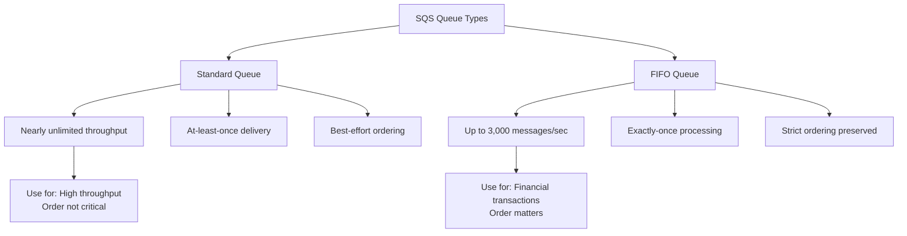
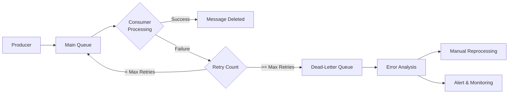
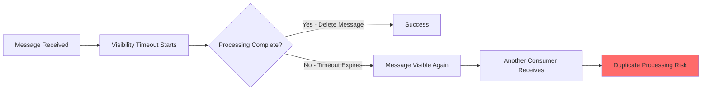

# How to Create SQS Queues

Author: [nawazdhandala](https://github.com/nawazdhandala)

Tags: AWS, SQS, Message Queue, Cloud, Serverless, Distributed Systems

Description: Learn how to create and configure Amazon SQS queues using the AWS Console, CLI, and SDKs. Covers standard and FIFO queues, dead-letter queues, access policies, and best practices for production deployments.

---

Amazon Simple Queue Service (SQS) is a fully managed message queuing service that enables decoupling and scaling of microservices, distributed systems, and serverless applications. SQS eliminates the complexity of managing and operating message-oriented middleware, allowing developers to focus on building applications rather than infrastructure.

## Understanding SQS Queue Types

Before creating a queue, you need to understand the two types of SQS queues and their characteristics.



Standard queues offer maximum throughput and best-effort ordering, while FIFO queues guarantee exactly-once processing and maintain strict message order at lower throughput.

## Creating SQS Queues via AWS Console

### Standard Queue Creation

Navigate to the SQS service in AWS Console and follow these steps to create a standard queue.

1. Click "Create queue"
2. Select "Standard" as the queue type
3. Enter a unique queue name
4. Configure the following settings:
   - Visibility timeout: Time a message stays hidden after being received
   - Message retention period: How long messages are kept (1 minute to 14 days)
   - Maximum message size: Up to 256 KB
   - Delivery delay: Time before messages become available

### FIFO Queue Creation

FIFO queues require additional configuration and must have names ending with `.fifo`.

1. Click "Create queue"
2. Select "FIFO" as the queue type
3. Enter a queue name ending with `.fifo` (e.g., `orders-processing.fifo`)
4. Configure FIFO-specific settings:
   - Content-based deduplication: Automatically generates deduplication ID from message body
   - Deduplication scope: Message group or queue level
   - FIFO throughput limit: Per queue or per message group

## Creating SQS Queues via AWS CLI

### Standard Queue with CLI

Use the AWS CLI to create queues programmatically or in automation scripts. The following command creates a standard queue with custom attributes.

```bash
# Create a basic standard queue
aws sqs create-queue \
  --queue-name my-application-queue \
  --region us-east-1

# Create a standard queue with custom configuration
# Attributes are specified in seconds for timeouts and retention
aws sqs create-queue \
  --queue-name order-processing-queue \
  --attributes '{
    "VisibilityTimeout": "60",
    "MessageRetentionPeriod": "1209600",
    "MaximumMessageSize": "262144",
    "DelaySeconds": "0",
    "ReceiveMessageWaitTimeSeconds": "20"
  }' \
  --region us-east-1
```

### FIFO Queue with CLI

FIFO queues require specific attributes and naming conventions. The following commands demonstrate FIFO queue creation.

```bash
# Create a FIFO queue with content-based deduplication
# The queue name must end with .fifo
aws sqs create-queue \
  --queue-name payment-transactions.fifo \
  --attributes '{
    "FifoQueue": "true",
    "ContentBasedDeduplication": "true",
    "VisibilityTimeout": "30",
    "MessageRetentionPeriod": "345600"
  }' \
  --region us-east-1

# Create a high-throughput FIFO queue
# Enables higher throughput with per-message-group-id settings
aws sqs create-queue \
  --queue-name high-throughput-orders.fifo \
  --attributes '{
    "FifoQueue": "true",
    "ContentBasedDeduplication": "false",
    "DeduplicationScope": "messageGroup",
    "FifoThroughputLimit": "perMessageGroupId"
  }' \
  --region us-east-1
```

### Verify Queue Creation

After creating a queue, retrieve its URL and attributes to verify the configuration.

```bash
# Get the queue URL by name
aws sqs get-queue-url \
  --queue-name order-processing-queue \
  --region us-east-1

# Get all queue attributes
aws sqs get-queue-attributes \
  --queue-url https://sqs.us-east-1.amazonaws.com/123456789012/order-processing-queue \
  --attribute-names All \
  --region us-east-1

# List all queues in the account
aws sqs list-queues --region us-east-1

# List queues with a specific prefix
aws sqs list-queues \
  --queue-name-prefix order \
  --region us-east-1
```

## Creating SQS Queues with Node.js SDK

### SDK Setup and Installation

Install the AWS SDK v3 for JavaScript to interact with SQS programmatically.

```bash
npm install @aws-sdk/client-sqs
```

### Basic Queue Creation

Create a reusable module for SQS queue operations. The SQSClient handles authentication and region configuration automatically.

```javascript
// sqs-client.js
const { SQSClient } = require('@aws-sdk/client-sqs');

// Create SQS client with region configuration
// Credentials are loaded from environment or IAM role
const sqsClient = new SQSClient({
  region: process.env.AWS_REGION || 'us-east-1',
});

module.exports = { sqsClient };
```

### Creating Standard Queues Programmatically

The following code demonstrates creating standard queues with various configurations.

```javascript
// create-standard-queue.js
const { CreateQueueCommand, GetQueueAttributesCommand } = require('@aws-sdk/client-sqs');
const { sqsClient } = require('./sqs-client');

// Create a standard queue with production-ready settings
async function createStandardQueue(queueName, options = {}) {
  // Define queue attributes with sensible defaults
  const attributes = {
    // Visibility timeout - 30 seconds is good for most workloads
    VisibilityTimeout: String(options.visibilityTimeout || 30),
    // Retain messages for 4 days (in seconds)
    MessageRetentionPeriod: String(options.retentionPeriod || 345600),
    // Maximum message size - 256KB is the maximum allowed
    MaximumMessageSize: String(options.maxMessageSize || 262144),
    // No delay by default - messages available immediately
    DelaySeconds: String(options.delaySeconds || 0),
    // Long polling - reduces empty responses and costs
    ReceiveMessageWaitTimeSeconds: String(options.waitTimeSeconds || 20),
  };

  const params = {
    QueueName: queueName,
    Attributes: attributes,
  };

  try {
    const command = new CreateQueueCommand(params);
    const response = await sqsClient.send(command);

    console.log(`Queue created successfully: ${response.QueueUrl}`);
    return {
      queueUrl: response.QueueUrl,
      queueName: queueName,
    };
  } catch (error) {
    // Handle specific error cases
    if (error.name === 'QueueNameExists') {
      console.log(`Queue ${queueName} already exists`);
      // Return existing queue URL
      return getQueueUrl(queueName);
    }
    throw error;
  }
}

// Retrieve queue URL for an existing queue
async function getQueueUrl(queueName) {
  const { GetQueueUrlCommand } = require('@aws-sdk/client-sqs');

  const command = new GetQueueUrlCommand({
    QueueName: queueName,
  });

  const response = await sqsClient.send(command);
  return { queueUrl: response.QueueUrl, queueName };
}

// Example usage
async function main() {
  // Create queue for order processing
  const orderQueue = await createStandardQueue('order-processing', {
    visibilityTimeout: 60,  // Allow 60 seconds for processing
    retentionPeriod: 1209600,  // Keep messages for 14 days
  });

  console.log('Order queue created:', orderQueue);
}

main().catch(console.error);
```

### Creating FIFO Queues Programmatically

FIFO queues require specific naming and attribute configuration for guaranteed ordering.

```javascript
// create-fifo-queue.js
const { CreateQueueCommand } = require('@aws-sdk/client-sqs');
const { sqsClient } = require('./sqs-client');

// Create a FIFO queue with exactly-once processing
async function createFifoQueue(queueName, options = {}) {
  // Ensure queue name ends with .fifo suffix
  const fifoQueueName = queueName.endsWith('.fifo')
    ? queueName
    : `${queueName}.fifo`;

  const attributes = {
    // Required attribute for FIFO queues
    FifoQueue: 'true',
    // Enable content-based deduplication for automatic duplicate detection
    // When enabled, SQS uses SHA-256 hash of message body as deduplication ID
    ContentBasedDeduplication: String(options.contentBasedDeduplication !== false),
    // Visibility timeout for processing
    VisibilityTimeout: String(options.visibilityTimeout || 30),
    // Message retention period
    MessageRetentionPeriod: String(options.retentionPeriod || 345600),
    // Long polling for efficient message retrieval
    ReceiveMessageWaitTimeSeconds: String(options.waitTimeSeconds || 20),
  };

  // Configure high-throughput mode if specified
  // Increases throughput from 300 to 3000 messages per second
  if (options.highThroughput) {
    attributes.DeduplicationScope = 'messageGroup';
    attributes.FifoThroughputLimit = 'perMessageGroupId';
  }

  const params = {
    QueueName: fifoQueueName,
    Attributes: attributes,
  };

  try {
    const command = new CreateQueueCommand(params);
    const response = await sqsClient.send(command);

    console.log(`FIFO Queue created: ${response.QueueUrl}`);
    return {
      queueUrl: response.QueueUrl,
      queueName: fifoQueueName,
      isFifo: true,
    };
  } catch (error) {
    if (error.name === 'QueueNameExists') {
      console.log(`FIFO Queue ${fifoQueueName} already exists`);
    }
    throw error;
  }
}

// Example: Create queues for financial transactions
async function setupTransactionQueues() {
  // Create FIFO queue for payment processing
  // Ensures payments are processed in order and exactly once
  const paymentQueue = await createFifoQueue('payment-processing', {
    visibilityTimeout: 60,
    contentBasedDeduplication: true,
  });

  // Create high-throughput FIFO queue for audit logs
  // Higher throughput when using different message groups
  const auditQueue = await createFifoQueue('audit-events', {
    visibilityTimeout: 30,
    highThroughput: true,
    contentBasedDeduplication: false,  // We will provide explicit deduplication IDs
  });

  return { paymentQueue, auditQueue };
}

setupTransactionQueues().catch(console.error);
```

## Creating Dead-Letter Queues

### Dead-Letter Queue Architecture

Dead-letter queues (DLQ) capture messages that fail processing after multiple attempts. Every production queue should have an associated DLQ for error handling and debugging.



### Creating a Queue with Dead-Letter Queue

Set up a main queue with an associated dead-letter queue for comprehensive error handling.

```javascript
// create-queue-with-dlq.js
const {
  CreateQueueCommand,
  GetQueueAttributesCommand,
  SetQueueAttributesCommand
} = require('@aws-sdk/client-sqs');
const { sqsClient } = require('./sqs-client');

// Create a complete queue setup with dead-letter queue
async function createQueueWithDLQ(baseName, options = {}) {
  // Step 1: Create the dead-letter queue first
  // DLQ receives messages that fail processing in the main queue
  const dlqName = `${baseName}-dlq`;
  const dlqCommand = new CreateQueueCommand({
    QueueName: dlqName,
    Attributes: {
      // Longer retention for DLQ - keep failed messages for analysis
      MessageRetentionPeriod: String(options.dlqRetentionPeriod || 1209600),  // 14 days
      VisibilityTimeout: '300',  // 5 minutes for manual inspection
    },
  });

  const dlqResponse = await sqsClient.send(dlqCommand);
  console.log(`Dead-letter queue created: ${dlqResponse.QueueUrl}`);

  // Step 2: Get the DLQ ARN (required for redrive policy)
  const dlqArn = await getQueueArn(dlqResponse.QueueUrl);

  // Step 3: Create the main queue with redrive policy
  const mainCommand = new CreateQueueCommand({
    QueueName: baseName,
    Attributes: {
      VisibilityTimeout: String(options.visibilityTimeout || 30),
      MessageRetentionPeriod: String(options.retentionPeriod || 345600),
      ReceiveMessageWaitTimeSeconds: String(options.waitTimeSeconds || 20),
      // Redrive policy configuration
      // maxReceiveCount: Number of times a message can be received before moving to DLQ
      RedrivePolicy: JSON.stringify({
        deadLetterTargetArn: dlqArn,
        maxReceiveCount: options.maxReceiveCount || 3,
      }),
    },
  });

  const mainResponse = await sqsClient.send(mainCommand);
  console.log(`Main queue created: ${mainResponse.QueueUrl}`);

  return {
    mainQueue: {
      url: mainResponse.QueueUrl,
      name: baseName,
    },
    deadLetterQueue: {
      url: dlqResponse.QueueUrl,
      name: dlqName,
      arn: dlqArn,
    },
  };
}

// Helper function to get queue ARN from URL
async function getQueueArn(queueUrl) {
  const command = new GetQueueAttributesCommand({
    QueueUrl: queueUrl,
    AttributeNames: ['QueueArn'],
  });

  const response = await sqsClient.send(command);
  return response.Attributes.QueueArn;
}

// Create FIFO queue with dead-letter queue
async function createFifoQueueWithDLQ(baseName, options = {}) {
  // FIFO DLQ must also be FIFO
  const dlqName = `${baseName}-dlq.fifo`;
  const mainName = `${baseName}.fifo`;

  // Create FIFO DLQ
  const dlqCommand = new CreateQueueCommand({
    QueueName: dlqName,
    Attributes: {
      FifoQueue: 'true',
      ContentBasedDeduplication: 'true',
      MessageRetentionPeriod: '1209600',
    },
  });

  const dlqResponse = await sqsClient.send(dlqCommand);
  const dlqArn = await getQueueArn(dlqResponse.QueueUrl);

  // Create main FIFO queue with redrive policy
  const mainCommand = new CreateQueueCommand({
    QueueName: mainName,
    Attributes: {
      FifoQueue: 'true',
      ContentBasedDeduplication: String(options.contentBasedDeduplication !== false),
      VisibilityTimeout: String(options.visibilityTimeout || 30),
      RedrivePolicy: JSON.stringify({
        deadLetterTargetArn: dlqArn,
        maxReceiveCount: options.maxReceiveCount || 3,
      }),
    },
  });

  const mainResponse = await sqsClient.send(mainCommand);

  return {
    mainQueue: { url: mainResponse.QueueUrl, name: mainName },
    deadLetterQueue: { url: dlqResponse.QueueUrl, name: dlqName, arn: dlqArn },
  };
}

// Example usage
async function setupApplicationQueues() {
  // Standard queue for notifications
  const notificationQueues = await createQueueWithDLQ('user-notifications', {
    maxReceiveCount: 5,
    visibilityTimeout: 60,
  });

  // FIFO queue for order processing
  const orderQueues = await createFifoQueueWithDLQ('order-events', {
    maxReceiveCount: 3,
    visibilityTimeout: 120,
  });

  console.log('Application queues created:', {
    notifications: notificationQueues,
    orders: orderQueues,
  });
}

setupApplicationQueues().catch(console.error);
```

## Configuring Queue Access Policies

### IAM-Based Access Control

Queue policies control which AWS accounts and IAM entities can access your queues. The following examples show common policy configurations.

```javascript
// configure-queue-policy.js
const { SetQueueAttributesCommand } = require('@aws-sdk/client-sqs');
const { sqsClient } = require('./sqs-client');

// Set a queue policy allowing cross-account access
async function setQueuePolicy(queueUrl, policy) {
  const command = new SetQueueAttributesCommand({
    QueueUrl: queueUrl,
    Attributes: {
      Policy: JSON.stringify(policy),
    },
  });

  await sqsClient.send(command);
  console.log('Queue policy updated successfully');
}

// Create a policy allowing SNS to send messages to the queue
function createSNSPublishPolicy(queueArn, snsTopicArn) {
  return {
    Version: '2012-10-17',
    Id: 'SNSPublishPolicy',
    Statement: [
      {
        Sid: 'AllowSNSPublish',
        Effect: 'Allow',
        Principal: {
          Service: 'sns.amazonaws.com',
        },
        Action: 'sqs:SendMessage',
        Resource: queueArn,
        Condition: {
          ArnEquals: {
            'aws:SourceArn': snsTopicArn,
          },
        },
      },
    ],
  };
}

// Create a policy for cross-account access
function createCrossAccountPolicy(queueArn, allowedAccountIds) {
  return {
    Version: '2012-10-17',
    Id: 'CrossAccountPolicy',
    Statement: [
      {
        Sid: 'AllowCrossAccountSend',
        Effect: 'Allow',
        Principal: {
          AWS: allowedAccountIds.map(id => `arn:aws:iam::${id}:root`),
        },
        Action: [
          'sqs:SendMessage',
          'sqs:GetQueueAttributes',
        ],
        Resource: queueArn,
      },
    ],
  };
}

// Create a policy allowing Lambda to process messages
function createLambdaPolicy(queueArn, lambdaRoleArn) {
  return {
    Version: '2012-10-17',
    Id: 'LambdaProcessorPolicy',
    Statement: [
      {
        Sid: 'AllowLambdaToReceiveMessages',
        Effect: 'Allow',
        Principal: {
          AWS: lambdaRoleArn,
        },
        Action: [
          'sqs:ReceiveMessage',
          'sqs:DeleteMessage',
          'sqs:GetQueueAttributes',
          'sqs:ChangeMessageVisibility',
        ],
        Resource: queueArn,
      },
    ],
  };
}

// Example: Configure queue for SNS fan-out pattern
async function configureQueueForSNS(queueUrl, queueArn, snsTopicArn) {
  const policy = createSNSPublishPolicy(queueArn, snsTopicArn);
  await setQueuePolicy(queueUrl, policy);
  console.log(`Queue configured to receive messages from SNS topic: ${snsTopicArn}`);
}
```

## Creating SQS Queues with Python SDK

### Boto3 Setup and Configuration

Use the AWS SDK for Python (Boto3) to create and manage SQS queues.

```bash
pip install boto3
```

### Python Queue Creation Examples

The following Python code demonstrates creating various queue types with comprehensive configurations.

```python
# sqs_queue_manager.py
import boto3
import json
from botocore.exceptions import ClientError

class SQSQueueManager:
    """Manager class for creating and configuring SQS queues."""

    def __init__(self, region_name='us-east-1'):
        # Initialize SQS client with specified region
        self.sqs = boto3.client('sqs', region_name=region_name)
        self.region = region_name

    def create_standard_queue(self, queue_name, **kwargs):
        """
        Create a standard SQS queue with configurable attributes.

        Args:
            queue_name: Name for the queue
            visibility_timeout: Seconds a message is hidden after being received
            retention_period: Seconds to retain messages (max 1209600 = 14 days)
            delay_seconds: Seconds before messages become available
            wait_time_seconds: Long polling wait time

        Returns:
            Dictionary with queue URL and name
        """
        attributes = {
            'VisibilityTimeout': str(kwargs.get('visibility_timeout', 30)),
            'MessageRetentionPeriod': str(kwargs.get('retention_period', 345600)),
            'MaximumMessageSize': str(kwargs.get('max_message_size', 262144)),
            'DelaySeconds': str(kwargs.get('delay_seconds', 0)),
            'ReceiveMessageWaitTimeSeconds': str(kwargs.get('wait_time_seconds', 20)),
        }

        try:
            response = self.sqs.create_queue(
                QueueName=queue_name,
                Attributes=attributes
            )
            print(f"Standard queue created: {response['QueueUrl']}")
            return {
                'queue_url': response['QueueUrl'],
                'queue_name': queue_name
            }
        except ClientError as e:
            if e.response['Error']['Code'] == 'QueueAlreadyExists':
                print(f"Queue {queue_name} already exists")
                return self.get_queue_url(queue_name)
            raise

    def create_fifo_queue(self, queue_name, **kwargs):
        """
        Create a FIFO queue with exactly-once processing.

        FIFO queues maintain strict message ordering and prevent duplicates.
        Queue name must end with .fifo suffix.
        """
        # Ensure .fifo suffix
        fifo_name = queue_name if queue_name.endswith('.fifo') else f"{queue_name}.fifo"

        attributes = {
            'FifoQueue': 'true',
            'ContentBasedDeduplication': str(kwargs.get('content_based_dedup', True)).lower(),
            'VisibilityTimeout': str(kwargs.get('visibility_timeout', 30)),
            'MessageRetentionPeriod': str(kwargs.get('retention_period', 345600)),
            'ReceiveMessageWaitTimeSeconds': str(kwargs.get('wait_time_seconds', 20)),
        }

        # Enable high-throughput mode if requested
        if kwargs.get('high_throughput', False):
            attributes['DeduplicationScope'] = 'messageGroup'
            attributes['FifoThroughputLimit'] = 'perMessageGroupId'

        try:
            response = self.sqs.create_queue(
                QueueName=fifo_name,
                Attributes=attributes
            )
            print(f"FIFO queue created: {response['QueueUrl']}")
            return {
                'queue_url': response['QueueUrl'],
                'queue_name': fifo_name,
                'is_fifo': True
            }
        except ClientError as e:
            print(f"Error creating FIFO queue: {e}")
            raise

    def create_queue_with_dlq(self, base_name, is_fifo=False, max_receive_count=3, **kwargs):
        """
        Create a queue with an associated dead-letter queue.

        Messages that fail processing after max_receive_count attempts
        are automatically moved to the dead-letter queue.
        """
        # Create DLQ first
        if is_fifo:
            dlq_name = f"{base_name}-dlq.fifo"
            dlq_attrs = {'FifoQueue': 'true', 'ContentBasedDeduplication': 'true'}
        else:
            dlq_name = f"{base_name}-dlq"
            dlq_attrs = {}

        dlq_attrs['MessageRetentionPeriod'] = '1209600'  # 14 days for analysis

        dlq_response = self.sqs.create_queue(
            QueueName=dlq_name,
            Attributes=dlq_attrs
        )

        # Get DLQ ARN for redrive policy
        dlq_arn = self._get_queue_arn(dlq_response['QueueUrl'])

        # Create main queue with redrive policy
        main_name = f"{base_name}.fifo" if is_fifo else base_name
        main_attrs = {
            'VisibilityTimeout': str(kwargs.get('visibility_timeout', 30)),
            'MessageRetentionPeriod': str(kwargs.get('retention_period', 345600)),
            'ReceiveMessageWaitTimeSeconds': str(kwargs.get('wait_time_seconds', 20)),
            'RedrivePolicy': json.dumps({
                'deadLetterTargetArn': dlq_arn,
                'maxReceiveCount': max_receive_count
            })
        }

        if is_fifo:
            main_attrs['FifoQueue'] = 'true'
            main_attrs['ContentBasedDeduplication'] = str(kwargs.get('content_based_dedup', True)).lower()

        main_response = self.sqs.create_queue(
            QueueName=main_name,
            Attributes=main_attrs
        )

        print(f"Queue with DLQ created successfully")
        return {
            'main_queue': {
                'url': main_response['QueueUrl'],
                'name': main_name
            },
            'dead_letter_queue': {
                'url': dlq_response['QueueUrl'],
                'name': dlq_name,
                'arn': dlq_arn
            }
        }

    def _get_queue_arn(self, queue_url):
        """Retrieve the ARN for a queue given its URL."""
        response = self.sqs.get_queue_attributes(
            QueueUrl=queue_url,
            AttributeNames=['QueueArn']
        )
        return response['Attributes']['QueueArn']

    def get_queue_url(self, queue_name):
        """Get the URL for an existing queue by name."""
        response = self.sqs.get_queue_url(QueueName=queue_name)
        return {
            'queue_url': response['QueueUrl'],
            'queue_name': queue_name
        }


# Example usage
if __name__ == '__main__':
    manager = SQSQueueManager(region_name='us-east-1')

    # Create standard queue for notifications
    notifications = manager.create_standard_queue(
        'user-notifications',
        visibility_timeout=60,
        retention_period=604800  # 7 days
    )

    # Create FIFO queue for order events
    orders = manager.create_fifo_queue(
        'order-events',
        visibility_timeout=120,
        high_throughput=True
    )

    # Create queue with dead-letter queue
    email_queue = manager.create_queue_with_dlq(
        'email-delivery',
        is_fifo=False,
        max_receive_count=5
    )

    print("All queues created successfully")
```

## Infrastructure as Code with Terraform

### Terraform Queue Configuration

Define SQS queues as infrastructure as code for repeatable deployments and version control.

```hcl
# sqs.tf - Terraform configuration for SQS queues

# Configure the AWS provider
provider "aws" {
  region = var.aws_region
}

# Variables for queue configuration
variable "aws_region" {
  description = "AWS region for resources"
  default     = "us-east-1"
}

variable "environment" {
  description = "Environment name (dev, staging, prod)"
  default     = "dev"
}

# Standard queue with dead-letter queue
resource "aws_sqs_queue" "main_queue_dlq" {
  name = "${var.environment}-order-processing-dlq"

  # Retain failed messages for 14 days for analysis
  message_retention_seconds = 1209600

  # Tags for resource management
  tags = {
    Environment = var.environment
    Purpose     = "Dead-letter queue for order processing"
  }
}

resource "aws_sqs_queue" "main_queue" {
  name = "${var.environment}-order-processing"

  # Queue configuration
  visibility_timeout_seconds  = 60
  message_retention_seconds   = 345600  # 4 days
  max_message_size           = 262144   # 256 KB
  delay_seconds              = 0
  receive_wait_time_seconds  = 20       # Long polling

  # Redrive policy - send to DLQ after 3 failures
  redrive_policy = jsonencode({
    deadLetterTargetArn = aws_sqs_queue.main_queue_dlq.arn
    maxReceiveCount     = 3
  })

  tags = {
    Environment = var.environment
    Purpose     = "Order processing queue"
  }
}

# FIFO queue for payment transactions
resource "aws_sqs_queue" "payment_queue_dlq" {
  name                       = "${var.environment}-payment-transactions-dlq.fifo"
  fifo_queue                 = true
  content_based_deduplication = true
  message_retention_seconds  = 1209600

  tags = {
    Environment = var.environment
    Purpose     = "Dead-letter queue for payment transactions"
  }
}

resource "aws_sqs_queue" "payment_queue" {
  name                       = "${var.environment}-payment-transactions.fifo"
  fifo_queue                 = true
  content_based_deduplication = true

  visibility_timeout_seconds = 120
  message_retention_seconds  = 345600
  receive_wait_time_seconds  = 20

  # High-throughput FIFO configuration
  deduplication_scope   = "messageGroup"
  fifo_throughput_limit = "perMessageGroupId"

  redrive_policy = jsonencode({
    deadLetterTargetArn = aws_sqs_queue.payment_queue_dlq.arn
    maxReceiveCount     = 3
  })

  tags = {
    Environment = var.environment
    Purpose     = "Payment transaction processing"
  }
}

# Queue policy allowing SNS to publish messages
resource "aws_sqs_queue_policy" "sns_publish_policy" {
  queue_url = aws_sqs_queue.main_queue.id

  policy = jsonencode({
    Version = "2012-10-17"
    Statement = [
      {
        Sid       = "AllowSNSPublish"
        Effect    = "Allow"
        Principal = {
          Service = "sns.amazonaws.com"
        }
        Action   = "sqs:SendMessage"
        Resource = aws_sqs_queue.main_queue.arn
        Condition = {
          ArnEquals = {
            "aws:SourceArn" = var.sns_topic_arn
          }
        }
      }
    ]
  })
}

# Outputs for reference
output "main_queue_url" {
  description = "URL of the main processing queue"
  value       = aws_sqs_queue.main_queue.url
}

output "main_queue_arn" {
  description = "ARN of the main processing queue"
  value       = aws_sqs_queue.main_queue.arn
}

output "payment_queue_url" {
  description = "URL of the payment FIFO queue"
  value       = aws_sqs_queue.payment_queue.url
}

output "dlq_urls" {
  description = "URLs of dead-letter queues"
  value = {
    main_dlq    = aws_sqs_queue.main_queue_dlq.url
    payment_dlq = aws_sqs_queue.payment_queue_dlq.url
  }
}
```

## Queue Configuration Best Practices

### Visibility Timeout Guidelines

Set visibility timeout based on your message processing time to avoid duplicate processing.



### Recommended Settings by Use Case

The following table summarizes recommended configurations for common scenarios.

| Use Case | Queue Type | Visibility Timeout | Retention | Max Receive Count |
|----------|------------|-------------------|-----------|-------------------|
| Email notifications | Standard | 30-60 seconds | 4 days | 5 |
| Order processing | FIFO | 60-120 seconds | 7 days | 3 |
| Payment transactions | FIFO | 120-300 seconds | 14 days | 3 |
| Background jobs | Standard | 300-900 seconds | 4 days | 3 |
| Real-time events | Standard | 30 seconds | 1 day | 10 |
| Audit logging | FIFO | 60 seconds | 14 days | 5 |

### Production Queue Setup

Create a comprehensive queue setup function that follows all best practices.

```javascript
// production-queue-setup.js
const {
  CreateQueueCommand,
  SetQueueAttributesCommand,
  TagQueueCommand
} = require('@aws-sdk/client-sqs');
const { sqsClient } = require('./sqs-client');

// Production-ready queue configuration
async function createProductionQueue(config) {
  const {
    name,
    type = 'standard',  // 'standard' or 'fifo'
    environment,
    team,
    maxReceiveCount = 3,
    visibilityTimeout = 60,
    retentionPeriod = 345600,
  } = config;

  // Apply naming convention: environment-service-purpose
  const queueName = type === 'fifo'
    ? `${environment}-${name}.fifo`
    : `${environment}-${name}`;

  const dlqName = type === 'fifo'
    ? `${environment}-${name}-dlq.fifo`
    : `${environment}-${name}-dlq`;

  // Create DLQ first
  const dlqAttributes = {
    MessageRetentionPeriod: '1209600',  // 14 days for debugging
    ReceiveMessageWaitTimeSeconds: '20',
  };

  if (type === 'fifo') {
    dlqAttributes.FifoQueue = 'true';
    dlqAttributes.ContentBasedDeduplication = 'true';
  }

  const dlqCommand = new CreateQueueCommand({
    QueueName: dlqName,
    Attributes: dlqAttributes,
  });

  const dlqResponse = await sqsClient.send(dlqCommand);
  const dlqArn = await getQueueArn(dlqResponse.QueueUrl);

  // Create main queue
  const mainAttributes = {
    VisibilityTimeout: String(visibilityTimeout),
    MessageRetentionPeriod: String(retentionPeriod),
    MaximumMessageSize: '262144',
    DelaySeconds: '0',
    ReceiveMessageWaitTimeSeconds: '20',  // Enable long polling
    RedrivePolicy: JSON.stringify({
      deadLetterTargetArn: dlqArn,
      maxReceiveCount: maxReceiveCount,
    }),
  };

  if (type === 'fifo') {
    mainAttributes.FifoQueue = 'true';
    mainAttributes.ContentBasedDeduplication = 'true';
  }

  const mainCommand = new CreateQueueCommand({
    QueueName: queueName,
    Attributes: mainAttributes,
  });

  const mainResponse = await sqsClient.send(mainCommand);

  // Apply tags for resource management
  const tags = {
    Environment: environment,
    Team: team,
    ManagedBy: 'terraform',  // or 'manual'
    QueueType: type,
    HasDLQ: 'true',
  };

  await tagQueue(mainResponse.QueueUrl, tags);
  await tagQueue(dlqResponse.QueueUrl, { ...tags, IsDLQ: 'true' });

  console.log(`Production queue setup complete: ${queueName}`);

  return {
    mainQueue: {
      url: mainResponse.QueueUrl,
      name: queueName,
    },
    deadLetterQueue: {
      url: dlqResponse.QueueUrl,
      name: dlqName,
      arn: dlqArn,
    },
  };
}

// Add tags to queue for cost allocation and management
async function tagQueue(queueUrl, tags) {
  const command = new TagQueueCommand({
    QueueUrl: queueUrl,
    Tags: tags,
  });
  await sqsClient.send(command);
}

// Helper to get queue ARN
async function getQueueArn(queueUrl) {
  const { GetQueueAttributesCommand } = require('@aws-sdk/client-sqs');
  const command = new GetQueueAttributesCommand({
    QueueUrl: queueUrl,
    AttributeNames: ['QueueArn'],
  });
  const response = await sqsClient.send(command);
  return response.Attributes.QueueArn;
}

// Setup all queues for an application
async function setupApplicationQueues(environment, team) {
  const queues = await Promise.all([
    createProductionQueue({
      name: 'order-processing',
      type: 'fifo',
      environment,
      team,
      visibilityTimeout: 120,
      maxReceiveCount: 3,
    }),
    createProductionQueue({
      name: 'email-notifications',
      type: 'standard',
      environment,
      team,
      visibilityTimeout: 60,
      maxReceiveCount: 5,
    }),
    createProductionQueue({
      name: 'analytics-events',
      type: 'standard',
      environment,
      team,
      visibilityTimeout: 30,
      maxReceiveCount: 10,
    }),
  ]);

  return queues;
}

// Example usage
setupApplicationQueues('production', 'platform-team')
  .then(queues => {
    console.log('All queues created:', JSON.stringify(queues, null, 2));
  })
  .catch(console.error);
```

## Summary

| Queue Type | Throughput | Ordering | Deduplication | Use Case |
|------------|------------|----------|---------------|----------|
| Standard | Nearly unlimited | Best-effort | None | High-volume, order not critical |
| FIFO | 300/3000 msg/sec | Guaranteed | 5-minute window | Financial, sequential processing |

Amazon SQS provides reliable message queuing with minimal operational overhead. Standard queues suit high-throughput scenarios where occasional duplicates are acceptable, while FIFO queues guarantee ordering for critical workflows. Always configure dead-letter queues for production workloads to capture and analyze failed messages. Choose visibility timeouts based on expected processing times, and enable long polling to reduce costs and improve responsiveness.
