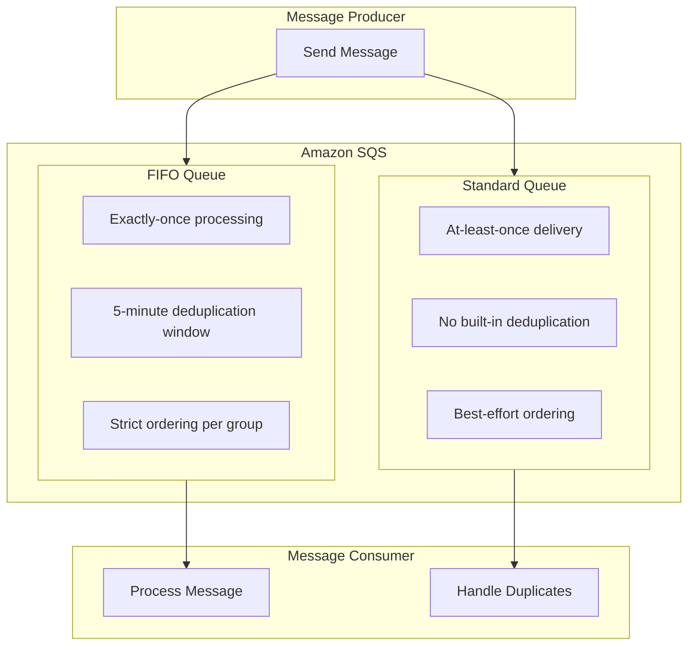
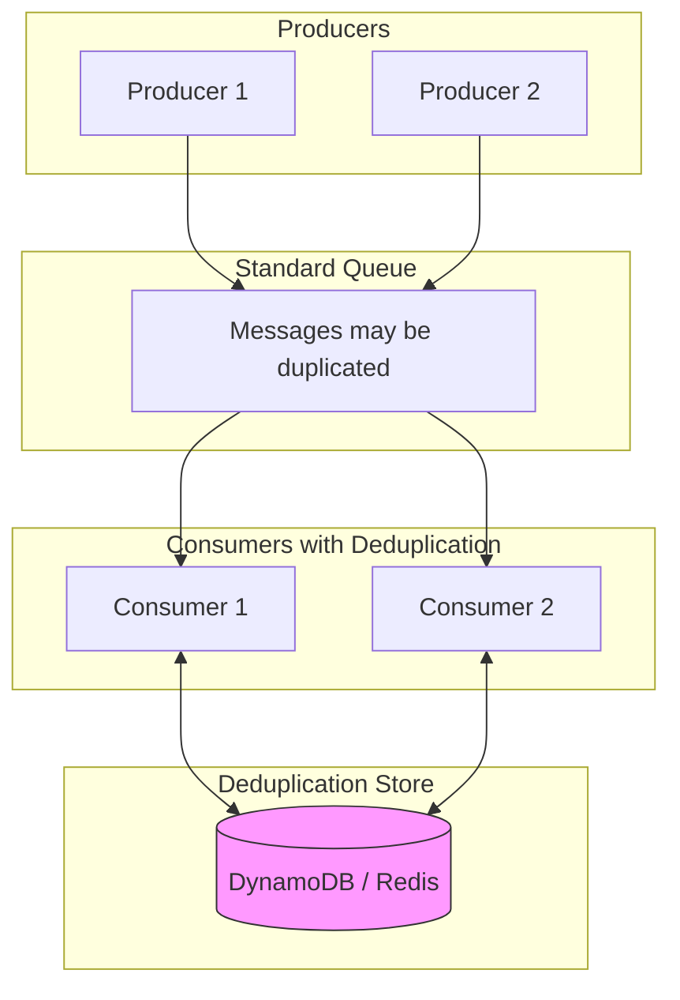
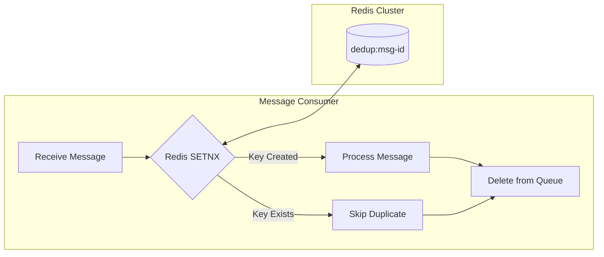
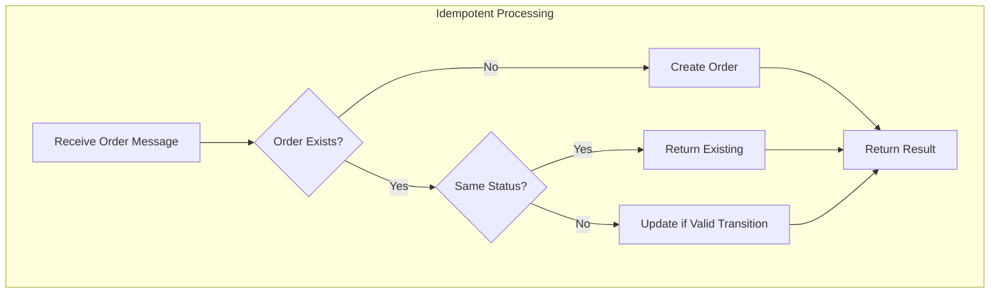
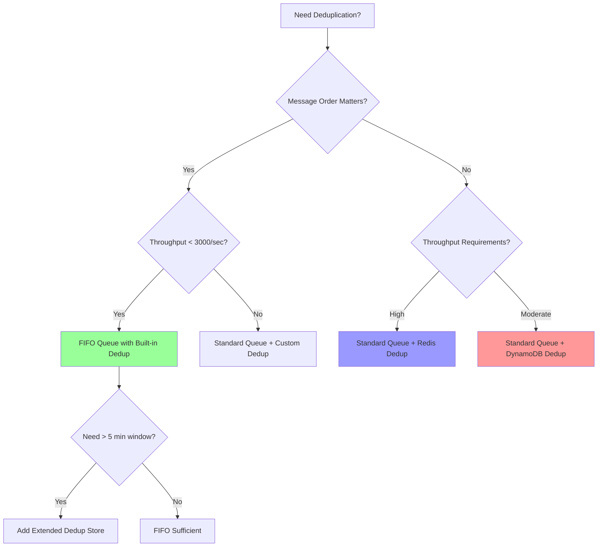

# How to Implement Message Deduplication in SQS

Author: [nawazdhandala](https://github.com/nawazdhandala)

Tags: AWS, SQS, Message Queue, Deduplication, Distributed Systems, Node.js

Description: Learn how to implement message deduplication in Amazon SQS using FIFO queues, content-based deduplication, and custom deduplication strategies to prevent duplicate processing in distributed systems.

---

Duplicate messages are inevitable in distributed systems. Network retries, producer failures, and at-least-once delivery guarantees all contribute to the same message arriving multiple times. Amazon SQS provides built-in deduplication mechanisms for FIFO queues, but standard queues require custom solutions. Understanding when and how to apply each approach is crucial for building reliable message-driven architectures.

## Understanding SQS Queue Types and Deduplication

Amazon SQS offers two queue types with different deduplication capabilities:



| Feature | Standard Queue | FIFO Queue |
|---------|---------------|------------|
| **Throughput** | Unlimited | 300-3000 msgs/sec |
| **Ordering** | Best effort | Strict per message group |
| **Deduplication** | None built-in | 5-minute window |
| **Delivery** | At-least-once | Exactly-once |
| **Use case** | High throughput | Order-sensitive, dedupe needed |

## FIFO Queue Deduplication with Message Deduplication ID

FIFO queues automatically deduplicate messages within a 5-minute window using the MessageDeduplicationId. When you send multiple messages with the same deduplication ID within that window, SQS accepts only the first one.

The following code demonstrates sending messages with explicit deduplication IDs to a FIFO queue. Each unique deduplication ID represents a distinct message, and duplicates within 5 minutes are automatically rejected.

```javascript
// AWS SDK v3 setup for SQS FIFO queue operations
// MessageDeduplicationId prevents duplicate processing within 5-minute window
const { SQSClient, SendMessageCommand, ReceiveMessageCommand, DeleteMessageCommand } = require('@aws-sdk/client-sqs');

const client = new SQSClient({ region: 'us-east-1' });

// FIFO queue URL must end with .fifo
const QUEUE_URL = 'https://sqs.us-east-1.amazonaws.com/123456789012/orders.fifo';

async function sendOrderMessage(order) {
  // MessageDeduplicationId: unique identifier for deduplication
  // MessageGroupId: messages with same group ID are processed in order
  const command = new SendMessageCommand({
    QueueUrl: QUEUE_URL,
    MessageBody: JSON.stringify(order),
    // Use order ID as deduplication key - same order won't be processed twice
    MessageDeduplicationId: order.orderId,
    // Group by customer for ordered processing per customer
    MessageGroupId: order.customerId,
  });

  try {
    const response = await client.send(command);
    console.log(`Message sent: ${response.MessageId}`);
    return response;
  } catch (error) {
    // SQS returns success for duplicates - they're silently ignored
    console.error('Failed to send message:', error);
    throw error;
  }
}

// Sending the same order twice - second one is deduplicated
await sendOrderMessage({
  orderId: 'ORD-12345',
  customerId: 'CUST-001',
  items: ['item-a', 'item-b'],
  total: 99.99,
});

// Duplicate within 5 minutes - SQS accepts but doesn't deliver
await sendOrderMessage({
  orderId: 'ORD-12345',
  customerId: 'CUST-001',
  items: ['item-a', 'item-b'],
  total: 99.99,
});
```

## Content-Based Deduplication

FIFO queues support content-based deduplication, which automatically generates the deduplication ID from a SHA-256 hash of the message body. Enable this when your message content is naturally unique.

The following configuration enables content-based deduplication on a FIFO queue using AWS CDK. When enabled, you do not need to provide a MessageDeduplicationId since SQS computes it from the message body.

```javascript
// AWS CDK example: Create FIFO queue with content-based deduplication
// When enabled, SQS hashes the message body to generate deduplication ID
const { Stack } = require('aws-cdk-lib');
const { Queue } = require('aws-cdk-lib/aws-sqs');

class OrderQueueStack extends Stack {
  constructor(scope, id, props) {
    super(scope, id, props);

    // FIFO queue with content-based deduplication enabled
    // No need to provide MessageDeduplicationId - body hash is used
    this.orderQueue = new Queue(this, 'OrderQueue', {
      queueName: 'orders.fifo',
      fifo: true,
      contentBasedDeduplication: true,
      // Visibility timeout should exceed processing time
      visibilityTimeout: Duration.seconds(300),
      // Dead letter queue for failed messages
      deadLetterQueue: {
        queue: this.dlq,
        maxReceiveCount: 3,
      },
    });
  }
}
```

When using content-based deduplication, identical message bodies produce the same hash. Be careful with timestamps or random data in your messages, as they would make every message unique and defeat deduplication.

```javascript
// Sending messages with content-based deduplication
// No MessageDeduplicationId needed - SQS hashes the body
async function sendWithContentDeduplication(data) {
  const command = new SendMessageCommand({
    QueueUrl: QUEUE_URL,
    MessageBody: JSON.stringify(data),
    MessageGroupId: data.groupId,
    // Omit MessageDeduplicationId - content hash is used
  });

  return client.send(command);
}

// Warning: avoid timestamps in message body with content-based deduplication
// These two messages have different hashes despite being logically the same
const bad1 = { orderId: 'ORD-1', timestamp: Date.now() }; // Hash: abc123
const bad2 = { orderId: 'ORD-1', timestamp: Date.now() }; // Hash: def456 (different!)

// Good: deterministic content produces consistent hashes
const good1 = { orderId: 'ORD-1', items: ['a', 'b'] }; // Hash: xyz789
const good2 = { orderId: 'ORD-1', items: ['a', 'b'] }; // Hash: xyz789 (same!)
```

## Deduplication Architecture for Standard Queues

Standard queues offer higher throughput but require custom deduplication. Implement deduplication at the consumer level using a distributed store like DynamoDB or Redis.



The following consumer implementation checks a DynamoDB table before processing each message. If the message ID exists in the table, the message is a duplicate and gets skipped. Otherwise, the message is processed and its ID is stored to prevent future duplicates.

```javascript
// Consumer-side deduplication for Standard SQS queues
// Uses DynamoDB to track processed message IDs with TTL for automatic cleanup
const { DynamoDBClient, PutItemCommand, GetItemCommand } = require('@aws-sdk/client-dynamodb');
const { SQSClient, ReceiveMessageCommand, DeleteMessageCommand } = require('@aws-sdk/client-sqs');

const sqsClient = new SQSClient({ region: 'us-east-1' });
const dynamoClient = new DynamoDBClient({ region: 'us-east-1' });

const QUEUE_URL = 'https://sqs.us-east-1.amazonaws.com/123456789012/orders';
const DEDUP_TABLE = 'message-deduplication';

class DeduplicatingConsumer {
  constructor(options = {}) {
    this.queueUrl = options.queueUrl;
    this.dedupTable = options.dedupTable;
    // TTL for deduplication records - should exceed max retry window
    this.dedupTtlSeconds = options.dedupTtlSeconds || 7 * 24 * 60 * 60; // 7 days
  }

  // Check if message was already processed using DynamoDB
  async isDuplicate(messageId) {
    const command = new GetItemCommand({
      TableName: this.dedupTable,
      Key: {
        messageId: { S: messageId },
      },
    });

    const response = await dynamoClient.send(command);
    return !!response.Item;
  }

  // Mark message as processed with TTL for automatic cleanup
  async markProcessed(messageId) {
    const ttl = Math.floor(Date.now() / 1000) + this.dedupTtlSeconds;

    const command = new PutItemCommand({
      TableName: this.dedupTable,
      Item: {
        messageId: { S: messageId },
        processedAt: { N: Date.now().toString() },
        ttl: { N: ttl.toString() },
      },
      // Conditional write prevents race condition between consumers
      ConditionExpression: 'attribute_not_exists(messageId)',
    });

    try {
      await dynamoClient.send(command);
      return true;
    } catch (error) {
      if (error.name === 'ConditionalCheckFailedException') {
        // Another consumer already processed this message
        return false;
      }
      throw error;
    }
  }

  async processMessage(message) {
    const body = JSON.parse(message.Body);
    // Use business key or message attribute for deduplication
    const deduplicationId = body.orderId || message.MessageId;

    // Check for duplicate before processing
    if (await this.isDuplicate(deduplicationId)) {
      console.log(`Duplicate message detected: ${deduplicationId}`);
      // Delete duplicate from queue
      await this.deleteMessage(message.ReceiptHandle);
      return { status: 'duplicate', id: deduplicationId };
    }

    // Attempt to claim the message with conditional write
    const claimed = await this.markProcessed(deduplicationId);
    if (!claimed) {
      console.log(`Message claimed by another consumer: ${deduplicationId}`);
      await this.deleteMessage(message.ReceiptHandle);
      return { status: 'claimed', id: deduplicationId };
    }

    try {
      // Process the message
      await this.handleOrder(body);
      // Delete from queue after successful processing
      await this.deleteMessage(message.ReceiptHandle);
      return { status: 'processed', id: deduplicationId };
    } catch (error) {
      // Processing failed - message will return to queue after visibility timeout
      // Dedup record exists, so retries will see it as duplicate
      // Consider removing dedup record for retriable errors
      console.error(`Processing failed: ${deduplicationId}`, error);
      throw error;
    }
  }

  async handleOrder(order) {
    console.log(`Processing order: ${order.orderId}`);
    // Business logic here
  }

  async deleteMessage(receiptHandle) {
    const command = new DeleteMessageCommand({
      QueueUrl: this.queueUrl,
      ReceiptHandle: receiptHandle,
    });
    await sqsClient.send(command);
  }

  async poll() {
    const command = new ReceiveMessageCommand({
      QueueUrl: this.queueUrl,
      MaxNumberOfMessages: 10,
      WaitTimeSeconds: 20, // Long polling
      VisibilityTimeout: 300,
    });

    const response = await sqsClient.send(command);
    const messages = response.Messages || [];

    const results = await Promise.all(
      messages.map(msg => this.processMessage(msg).catch(e => ({ status: 'error', error: e })))
    );

    return results;
  }
}

// Usage
const consumer = new DeduplicatingConsumer({
  queueUrl: QUEUE_URL,
  dedupTable: DEDUP_TABLE,
});

// Continuous polling loop
async function run() {
  while (true) {
    try {
      const results = await consumer.poll();
      console.log(`Processed batch: ${JSON.stringify(results)}`);
    } catch (error) {
      console.error('Polling error:', error);
      await new Promise(r => setTimeout(r, 5000));
    }
  }
}

run();
```

## DynamoDB Table for Deduplication

Create a DynamoDB table optimized for deduplication lookups. Use TTL to automatically clean up old records and prevent unbounded growth.

```javascript
// CloudFormation/CDK template for deduplication table
// TTL attribute enables automatic cleanup of old deduplication records
const { Table, AttributeType, BillingMode } = require('aws-cdk-lib/aws-dynamodb');

class DeduplicationTableStack extends Stack {
  constructor(scope, id, props) {
    super(scope, id, props);

    this.dedupTable = new Table(this, 'MessageDeduplication', {
      tableName: 'message-deduplication',
      partitionKey: {
        name: 'messageId',
        type: AttributeType.STRING,
      },
      billingMode: BillingMode.PAY_PER_REQUEST,
      // TTL automatically deletes expired items
      timeToLiveAttribute: 'ttl',
      // Point-in-time recovery for compliance
      pointInTimeRecovery: true,
    });
  }
}
```

## Redis-Based Deduplication for High Throughput

For extremely high throughput scenarios, Redis provides faster lookups than DynamoDB. Use Redis SET with NX (only set if not exists) and EX (expiration) for atomic deduplication checks.



The following Redis-based deduplication implementation uses the SET command with NX and EX flags for atomic duplicate detection. A single Redis command both checks for duplicates and marks the message as being processed.

```javascript
// Redis-based deduplication for high-throughput scenarios
// SETNX provides atomic check-and-set in a single operation
const Redis = require('ioredis');

class RedisDeduplicator {
  constructor(options = {}) {
    this.redis = new Redis({
      host: options.redisHost || 'localhost',
      port: options.redisPort || 6379,
      // Use cluster mode for production
      enableReadyCheck: true,
      maxRetriesPerRequest: 3,
    });
    // Deduplication window in seconds
    this.ttlSeconds = options.ttlSeconds || 7 * 24 * 60 * 60; // 7 days
    this.keyPrefix = options.keyPrefix || 'dedup:';
  }

  // Atomic check-and-set using Redis SETNX
  // Returns true if this is a new message, false if duplicate
  async tryAcquire(messageId) {
    const key = `${this.keyPrefix}${messageId}`;
    // SET with NX (only if not exists) and EX (expiration)
    // Single atomic operation prevents race conditions
    const result = await this.redis.set(key, Date.now(), 'EX', this.ttlSeconds, 'NX');
    return result === 'OK';
  }

  // Check if message was already processed (without acquiring)
  async isDuplicate(messageId) {
    const key = `${this.keyPrefix}${messageId}`;
    const exists = await this.redis.exists(key);
    return exists === 1;
  }

  // Extend TTL if processing takes longer than expected
  async extendLock(messageId, additionalSeconds) {
    const key = `${this.keyPrefix}${messageId}`;
    const ttl = await this.redis.ttl(key);
    if (ttl > 0) {
      await this.redis.expire(key, ttl + additionalSeconds);
    }
  }

  // Remove deduplication record (use carefully - allows reprocessing)
  async release(messageId) {
    const key = `${this.keyPrefix}${messageId}`;
    await this.redis.del(key);
  }
}

// Consumer using Redis deduplication
class RedisDeduplicatingConsumer {
  constructor(options) {
    this.deduplicator = new RedisDeduplicator(options);
    this.queueUrl = options.queueUrl;
  }

  async processMessage(message) {
    const body = JSON.parse(message.Body);
    const deduplicationId = body.orderId || message.MessageId;

    // Atomic duplicate check and acquisition
    const acquired = await this.deduplicator.tryAcquire(deduplicationId);

    if (!acquired) {
      console.log(`Duplicate detected: ${deduplicationId}`);
      return { status: 'duplicate', id: deduplicationId };
    }

    try {
      // Process the message
      await this.handleOrder(body);
      return { status: 'processed', id: deduplicationId };
    } catch (error) {
      // On retriable errors, consider releasing the lock
      if (this.isRetriable(error)) {
        await this.deduplicator.release(deduplicationId);
      }
      throw error;
    }
  }

  isRetriable(error) {
    // Define which errors should allow retry
    return error.code === 'ETIMEDOUT' || error.code === 'ECONNRESET';
  }

  async handleOrder(order) {
    console.log(`Processing order: ${order.orderId}`);
  }
}
```

## Idempotent Message Processing

Beyond deduplication, make your message handlers idempotent. An idempotent operation produces the same result whether executed once or multiple times. Even with deduplication, edge cases like consumer crashes can lead to reprocessing.



The following example demonstrates an idempotent order processor. Each order has a unique ID and status. Processing the same order multiple times safely handles both new orders and duplicate requests.

```javascript
// Idempotent order processor that handles duplicates gracefully
// Uses database constraints and status checks for safe reprocessing
class IdempotentOrderProcessor {
  constructor(db) {
    this.db = db;
  }

  async processOrder(orderData) {
    const { orderId, customerId, items, total } = orderData;

    // Try to create order with unique constraint on orderId
    try {
      const order = await this.db.orders.create({
        data: {
          orderId,
          customerId,
          items: JSON.stringify(items),
          total,
          status: 'pending',
          createdAt: new Date(),
        },
      });

      // New order created - proceed with payment
      await this.processPayment(order);
      return { status: 'created', order };

    } catch (error) {
      // Unique constraint violation - order already exists
      if (error.code === 'P2002') {
        const existingOrder = await this.db.orders.findUnique({
          where: { orderId },
        });

        // Return existing order - idempotent response
        console.log(`Order ${orderId} already exists with status: ${existingOrder.status}`);
        return { status: 'existing', order: existingOrder };
      }

      throw error;
    }
  }

  async processPayment(order) {
    // Use idempotency key with payment provider
    const paymentResult = await this.paymentProvider.charge({
      idempotencyKey: `payment-${order.orderId}`,
      amount: order.total,
      customerId: order.customerId,
    });

    // Update order status atomically
    await this.db.orders.update({
      where: {
        orderId: order.orderId,
        // Only update if still pending - prevents double processing
        status: 'pending',
      },
      data: {
        status: paymentResult.success ? 'paid' : 'payment_failed',
        paymentId: paymentResult.paymentId,
      },
    });

    return paymentResult;
  }
}
```

## Handling the 5-Minute FIFO Deduplication Window

FIFO queues only deduplicate within a 5-minute window. For longer processing times or delayed retries, implement application-level deduplication alongside FIFO deduplication.

```javascript
// Extended deduplication beyond FIFO's 5-minute window
// Combines FIFO deduplication with persistent storage for long-term tracking
class ExtendedDeduplicationProducer {
  constructor(options) {
    this.queueUrl = options.queueUrl;
    this.dedupStore = options.dedupStore; // DynamoDB or Redis
    this.extendedWindowHours = options.extendedWindowHours || 24;
  }

  async sendMessage(data, deduplicationId) {
    // Check extended deduplication window first
    const existsInExtendedWindow = await this.dedupStore.exists(deduplicationId);

    if (existsInExtendedWindow) {
      console.log(`Message ${deduplicationId} already sent within extended window`);
      return { deduplicated: true, source: 'extended-window' };
    }

    // Send to FIFO queue (handles 5-minute window)
    const command = new SendMessageCommand({
      QueueUrl: this.queueUrl,
      MessageBody: JSON.stringify(data),
      MessageDeduplicationId: deduplicationId,
      MessageGroupId: data.groupId,
    });

    const response = await sqsClient.send(command);

    // Record in extended deduplication store
    await this.dedupStore.set(deduplicationId, {
      messageId: response.MessageId,
      sentAt: Date.now(),
    }, this.extendedWindowHours * 60 * 60);

    return { deduplicated: false, messageId: response.MessageId };
  }
}

// Usage for scenarios requiring deduplication beyond 5 minutes
const producer = new ExtendedDeduplicationProducer({
  queueUrl: 'https://sqs.us-east-1.amazonaws.com/123456789012/orders.fifo',
  dedupStore: new RedisDeduplicator({ ttlSeconds: 24 * 60 * 60 }),
  extendedWindowHours: 24,
});

// Send order - deduplicated for 24 hours, not just 5 minutes
await producer.sendMessage(
  { orderId: 'ORD-123', items: ['item-a'] },
  'ORD-123'
);
```

## Batch Processing with Deduplication

When processing messages in batches, handle deduplication efficiently by checking all message IDs in a single operation.

```javascript
// Batch deduplication using Redis pipeline for efficiency
// Single round-trip checks multiple message IDs
class BatchDeduplicator {
  constructor(redis) {
    this.redis = redis;
    this.keyPrefix = 'dedup:';
    this.ttlSeconds = 7 * 24 * 60 * 60;
  }

  // Check and acquire multiple messages in single Redis round-trip
  async acquireBatch(messageIds) {
    const pipeline = this.redis.pipeline();

    // Queue SET NX commands for all messages
    messageIds.forEach(id => {
      const key = `${this.keyPrefix}${id}`;
      pipeline.set(key, Date.now(), 'EX', this.ttlSeconds, 'NX');
    });

    // Execute all commands in single round-trip
    const results = await pipeline.exec();

    // Map results to message IDs
    return messageIds.map((id, index) => ({
      messageId: id,
      acquired: results[index][1] === 'OK',
    }));
  }

  // Check duplicates without acquiring
  async checkBatch(messageIds) {
    const pipeline = this.redis.pipeline();

    messageIds.forEach(id => {
      pipeline.exists(`${this.keyPrefix}${id}`);
    });

    const results = await pipeline.exec();

    return messageIds.map((id, index) => ({
      messageId: id,
      isDuplicate: results[index][1] === 1,
    }));
  }
}

// Batch consumer with efficient deduplication
class BatchConsumer {
  constructor(options) {
    this.deduplicator = new BatchDeduplicator(options.redis);
    this.queueUrl = options.queueUrl;
  }

  async processBatch(messages) {
    // Extract deduplication IDs from all messages
    const messageMap = new Map();
    messages.forEach(msg => {
      const body = JSON.parse(msg.Body);
      const dedupId = body.orderId || msg.MessageId;
      messageMap.set(dedupId, msg);
    });

    // Batch deduplication check
    const dedupResults = await this.deduplicator.acquireBatch([...messageMap.keys()]);

    // Separate new messages from duplicates
    const toProcess = [];
    const duplicates = [];

    dedupResults.forEach(result => {
      const msg = messageMap.get(result.messageId);
      if (result.acquired) {
        toProcess.push(msg);
      } else {
        duplicates.push(msg);
      }
    });

    console.log(`Batch: ${toProcess.length} new, ${duplicates.length} duplicates`);

    // Process new messages
    const processResults = await Promise.all(
      toProcess.map(msg => this.handleMessage(msg))
    );

    // Delete all processed messages (including duplicates)
    await this.deleteMessages([...toProcess, ...duplicates]);

    return {
      processed: processResults.length,
      duplicates: duplicates.length,
    };
  }

  async handleMessage(message) {
    const body = JSON.parse(message.Body);
    console.log(`Processing: ${body.orderId}`);
    // Business logic here
  }

  async deleteMessages(messages) {
    // Use batch delete for efficiency
    const entries = messages.map((msg, idx) => ({
      Id: idx.toString(),
      ReceiptHandle: msg.ReceiptHandle,
    }));

    // SQS batch delete supports up to 10 messages
    const batches = [];
    for (let i = 0; i < entries.length; i += 10) {
      batches.push(entries.slice(i, i + 10));
    }

    await Promise.all(batches.map(batch =>
      sqsClient.send(new DeleteMessageBatchCommand({
        QueueUrl: this.queueUrl,
        Entries: batch,
      }))
    ));
  }
}
```

## Deduplication Strategy Selection

Choose your deduplication strategy based on throughput requirements, consistency needs, and acceptable complexity.



| Scenario | Recommended Approach |
|----------|---------------------|
| Order matters, moderate throughput | FIFO queue with message deduplication ID |
| Identical messages need dedup | FIFO queue with content-based deduplication |
| High throughput, order not critical | Standard queue + Redis deduplication |
| Compliance and audit requirements | Standard queue + DynamoDB deduplication |
| Extended deduplication window needed | FIFO + external dedup store |

## Monitoring Deduplication

Track deduplication metrics to understand message patterns and identify issues. High duplicate rates may indicate producer problems or retry storms.

```javascript
// CloudWatch metrics for deduplication monitoring
// Track duplicate rates to identify producer issues or retry storms
const { CloudWatchClient, PutMetricDataCommand } = require('@aws-sdk/client-cloudwatch');

const cloudwatch = new CloudWatchClient({ region: 'us-east-1' });

class DeduplicationMetrics {
  constructor(namespace = 'SQS/Deduplication') {
    this.namespace = namespace;
  }

  async recordProcessed(queueName, count = 1) {
    await this.putMetric(queueName, 'MessagesProcessed', count);
  }

  async recordDuplicate(queueName, count = 1) {
    await this.putMetric(queueName, 'DuplicatesDetected', count);
  }

  async recordDeduplicationLatency(queueName, latencyMs) {
    await this.putMetric(queueName, 'DeduplicationLatency', latencyMs, 'Milliseconds');
  }

  async putMetric(queueName, metricName, value, unit = 'Count') {
    const command = new PutMetricDataCommand({
      Namespace: this.namespace,
      MetricData: [{
        MetricName: metricName,
        Dimensions: [{ Name: 'QueueName', Value: queueName }],
        Value: value,
        Unit: unit,
        Timestamp: new Date(),
      }],
    });

    await cloudwatch.send(command);
  }
}

// Usage in consumer
const metrics = new DeduplicationMetrics();

async function processWithMetrics(message, queueName) {
  const startTime = Date.now();
  const isDuplicate = await deduplicator.isDuplicate(message.deduplicationId);

  await metrics.recordDeduplicationLatency(queueName, Date.now() - startTime);

  if (isDuplicate) {
    await metrics.recordDuplicate(queueName);
    return;
  }

  await processMessage(message);
  await metrics.recordProcessed(queueName);
}
```

## Summary

| Deduplication Method | Window | Throughput | Complexity |
|---------------------|--------|------------|------------|
| **FIFO MessageDeduplicationId** | 5 minutes | 300-3000/sec | Low |
| **FIFO Content-Based** | 5 minutes | 300-3000/sec | Very Low |
| **DynamoDB Consumer-Side** | Configurable | Unlimited | Medium |
| **Redis Consumer-Side** | Configurable | Very High | Medium |
| **Idempotent Processing** | Permanent | N/A | High |

Message deduplication in SQS requires choosing the right approach for your use case. FIFO queues provide simple built-in deduplication for moderate throughput scenarios. Standard queues with custom deduplication offer flexibility and higher throughput. Combining multiple approaches, like FIFO with extended deduplication stores, handles edge cases where the 5-minute window is insufficient. Always make your message handlers idempotent as the final safety net against duplicate processing.
