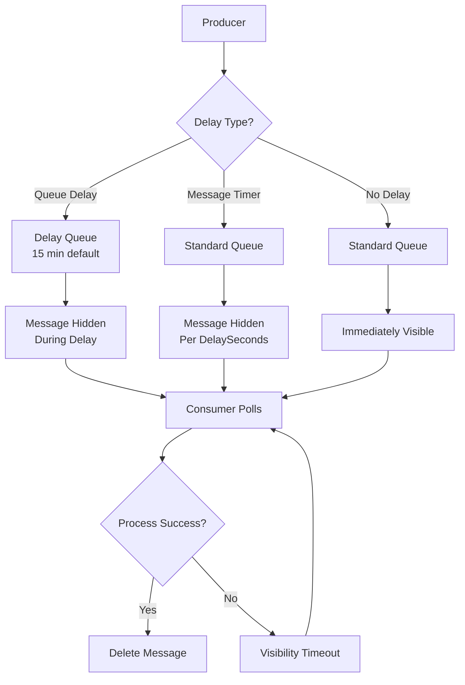
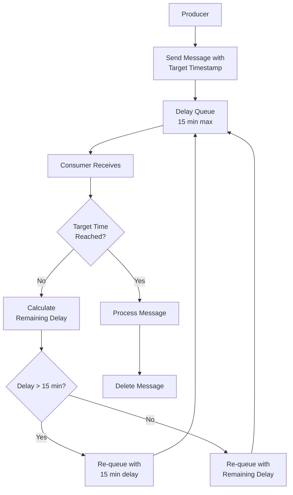
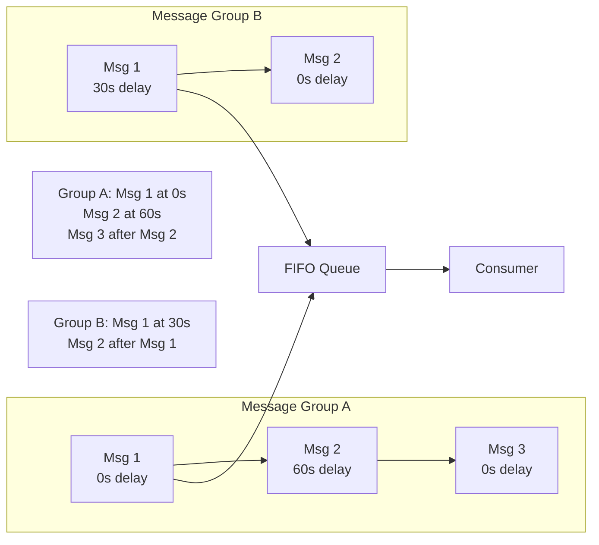

# How to Implement Delay Queues in SQS

Author: [nawazdhandala](https://github.com/nawazdhandala)

Tags: AWS, SQS, Message Queue, Delay Queue, Serverless, Node.js, Python, Event-Driven Architecture

Description: Learn how to implement delay queues in Amazon SQS for scheduled message processing. Covers queue-level delays, per-message delays, visibility timeout patterns, and production best practices for building reliable delayed processing systems.

---

Scheduling message delivery for a future time is a common requirement in distributed systems. Order processing might need to wait for payment confirmation, notification systems may require rate limiting, and retry mechanisms often benefit from exponential backoff. Amazon SQS provides built-in support for delay queues that enable these patterns without external scheduling infrastructure.

## Understanding SQS Delay Mechanisms

Amazon SQS offers two primary mechanisms for delaying message delivery. Queue-level delays apply to all messages in a queue, while per-message delays provide fine-grained control over individual message timing.

| Mechanism | Scope | Maximum Delay | Use Case |
|-----------|-------|---------------|----------|
| Delay Queue | All messages | 15 minutes | Consistent delay for all processing |
| Message Timer | Individual message | 15 minutes | Variable delays per message |
| Visibility Timeout | Received messages | 12 hours | Processing time and retry delays |

## Delay Queue Architecture

The following diagram illustrates how messages flow through an SQS delay queue system with different delay configurations.



## Creating a Delay Queue with AWS SDK

A delay queue applies a default delay to all messages. Use queue-level delays when you need consistent timing for all messages in a particular workflow.

The following code creates an SQS queue with a 5-minute default delay using the AWS SDK for JavaScript.

```javascript
// Import the AWS SDK v3 SQS client
const { SQSClient, CreateQueueCommand, GetQueueAttributesCommand } = require('@aws-sdk/client-sqs');

// Initialize the SQS client with your region
const sqsClient = new SQSClient({ region: 'us-east-1' });

// Function to create a delay queue with specified default delay
async function createDelayQueue(queueName, delaySeconds) {
  // Validate delay is within SQS limits (0-900 seconds)
  if (delaySeconds < 0 || delaySeconds > 900) {
    throw new Error('DelaySeconds must be between 0 and 900 (15 minutes)');
  }

  const params = {
    QueueName: queueName,
    Attributes: {
      // Default delay applied to all messages in this queue
      DelaySeconds: String(delaySeconds),

      // Message retention period (4 days)
      MessageRetentionPeriod: '345600',

      // Visibility timeout for processing (30 seconds)
      VisibilityTimeout: '30',

      // Enable long polling to reduce empty responses
      ReceiveMessageWaitTimeSeconds: '20',
    },
  };

  try {
    const command = new CreateQueueCommand(params);
    const response = await sqsClient.send(command);

    console.log(`Queue created: ${response.QueueUrl}`);
    return response.QueueUrl;

  } catch (error) {
    // Handle queue already exists case
    if (error.name === 'QueueNameExists') {
      console.log('Queue already exists, retrieving URL...');
      return await getQueueUrl(queueName);
    }
    throw error;
  }
}

// Helper function to get existing queue URL
async function getQueueUrl(queueName) {
  const { GetQueueUrlCommand } = require('@aws-sdk/client-sqs');
  const command = new GetQueueUrlCommand({ QueueName: queueName });
  const response = await sqsClient.send(command);
  return response.QueueUrl;
}

// Create a queue with 5-minute delay
createDelayQueue('order-processing-delay-queue', 300)
  .then(url => console.log(`Queue URL: ${url}`))
  .catch(console.error);
```

## Per-Message Delay with Message Timers

When different messages need different delays, use the DelaySeconds parameter on individual messages. Per-message delays override the queue default.

The following example demonstrates sending messages with variable delays based on priority.

```javascript
const { SQSClient, SendMessageCommand, SendMessageBatchCommand } = require('@aws-sdk/client-sqs');

const sqsClient = new SQSClient({ region: 'us-east-1' });

// Send a single message with a specific delay
async function sendDelayedMessage(queueUrl, messageBody, delaySeconds) {
  const params = {
    QueueUrl: queueUrl,
    MessageBody: JSON.stringify(messageBody),

    // Per-message delay overrides queue default (0-900 seconds)
    DelaySeconds: delaySeconds,

    // Message attributes for routing and filtering
    MessageAttributes: {
      'MessageType': {
        DataType: 'String',
        StringValue: messageBody.type || 'default',
      },
      'ScheduledTime': {
        DataType: 'Number',
        StringValue: String(Date.now() + (delaySeconds * 1000)),
      },
    },
  };

  const command = new SendMessageCommand(params);
  const response = await sqsClient.send(command);

  console.log(`Message sent with ${delaySeconds}s delay. MessageId: ${response.MessageId}`);
  return response;
}

// Send multiple messages with different delays in a batch
async function sendBatchWithVariableDelays(queueUrl, messages) {
  // SQS batch limit is 10 messages
  const batchSize = 10;
  const results = [];

  for (let i = 0; i < messages.length; i += batchSize) {
    const batch = messages.slice(i, i + batchSize);

    const entries = batch.map((msg, index) => ({
      Id: `msg-${i + index}`,
      MessageBody: JSON.stringify(msg.body),
      DelaySeconds: msg.delaySeconds || 0,
      MessageAttributes: {
        'Priority': {
          DataType: 'Number',
          StringValue: String(msg.priority || 0),
        },
      },
    }));

    const command = new SendMessageBatchCommand({
      QueueUrl: queueUrl,
      Entries: entries,
    });

    const response = await sqsClient.send(command);
    results.push(response);

    // Log any failed messages
    if (response.Failed && response.Failed.length > 0) {
      console.error('Failed messages:', response.Failed);
    }
  }

  return results;
}

// Example: Schedule notifications with different delays based on priority
async function scheduleNotifications(queueUrl) {
  const notifications = [
    { body: { userId: 'u1', message: 'Urgent alert' }, delaySeconds: 0, priority: 1 },
    { body: { userId: 'u2', message: 'Standard notification' }, delaySeconds: 300, priority: 2 },
    { body: { userId: 'u3', message: 'Low priority digest' }, delaySeconds: 900, priority: 3 },
  ];

  return await sendBatchWithVariableDelays(queueUrl, notifications);
}
```

## Python Implementation with Boto3

For Python applications, Boto3 provides the same delay queue capabilities with a Pythonic interface.

```python
import boto3
import json
from datetime import datetime, timedelta
from typing import Optional, Dict, Any, List

# Initialize the SQS client
sqs = boto3.client('sqs', region_name='us-east-1')

def create_delay_queue(
    queue_name: str,
    delay_seconds: int = 0,
    visibility_timeout: int = 30
) -> str:
    """
    Create an SQS queue with a default message delay.

    Args:
        queue_name: Name of the queue to create
        delay_seconds: Default delay for all messages (0-900)
        visibility_timeout: How long a message is hidden after being received

    Returns:
        Queue URL
    """
    # Validate delay within SQS limits
    if not 0 <= delay_seconds <= 900:
        raise ValueError("delay_seconds must be between 0 and 900")

    response = sqs.create_queue(
        QueueName=queue_name,
        Attributes={
            'DelaySeconds': str(delay_seconds),
            'VisibilityTimeout': str(visibility_timeout),
            'MessageRetentionPeriod': '345600',  # 4 days
            'ReceiveMessageWaitTimeSeconds': '20',  # Long polling
        }
    )

    print(f"Queue created: {response['QueueUrl']}")
    return response['QueueUrl']


def send_delayed_message(
    queue_url: str,
    message_body: Dict[str, Any],
    delay_seconds: int = 0,
    message_attributes: Optional[Dict] = None
) -> Dict:
    """
    Send a message with a specific delay.

    Args:
        queue_url: URL of the target queue
        message_body: Message content as a dictionary
        delay_seconds: Delay before message becomes visible (0-900)
        message_attributes: Optional message attributes

    Returns:
        SQS SendMessage response
    """
    params = {
        'QueueUrl': queue_url,
        'MessageBody': json.dumps(message_body),
        'DelaySeconds': delay_seconds,
    }

    # Add message attributes if provided
    if message_attributes:
        params['MessageAttributes'] = message_attributes

    response = sqs.send_message(**params)

    print(f"Message sent with {delay_seconds}s delay. ID: {response['MessageId']}")
    return response


def schedule_with_retry_backoff(
    queue_url: str,
    message_body: Dict[str, Any],
    retry_count: int = 0,
    max_retries: int = 5
) -> Dict:
    """
    Send a message with exponential backoff delay based on retry count.

    Delay pattern: 0s, 30s, 120s, 300s, 600s, 900s (capped at 15 min)

    Args:
        queue_url: URL of the target queue
        message_body: Message content
        retry_count: Current retry attempt number
        max_retries: Maximum number of retries allowed

    Returns:
        SQS SendMessage response
    """
    # Calculate exponential backoff delay
    # Base delay of 30 seconds, doubled each retry, capped at 900
    if retry_count == 0:
        delay = 0
    else:
        delay = min(30 * (2 ** (retry_count - 1)), 900)

    # Add retry metadata to message
    message_with_metadata = {
        **message_body,
        '_retry_metadata': {
            'retry_count': retry_count,
            'max_retries': max_retries,
            'scheduled_at': datetime.utcnow().isoformat(),
            'delay_seconds': delay,
        }
    }

    return send_delayed_message(
        queue_url=queue_url,
        message_body=message_with_metadata,
        delay_seconds=delay,
        message_attributes={
            'RetryCount': {
                'DataType': 'Number',
                'StringValue': str(retry_count),
            },
        }
    )


def send_batch_with_delays(
    queue_url: str,
    messages: List[Dict[str, Any]]
) -> Dict:
    """
    Send multiple messages with individual delays in batches of 10.

    Args:
        queue_url: URL of the target queue
        messages: List of dicts with 'body', 'delay_seconds', and optional 'id'

    Returns:
        Combined response with successful and failed message IDs
    """
    results = {'Successful': [], 'Failed': []}

    # Process in batches of 10 (SQS limit)
    for i in range(0, len(messages), 10):
        batch = messages[i:i + 10]

        entries = []
        for idx, msg in enumerate(batch):
            entry = {
                'Id': msg.get('id', f'msg-{i + idx}'),
                'MessageBody': json.dumps(msg['body']),
                'DelaySeconds': msg.get('delay_seconds', 0),
            }
            entries.append(entry)

        response = sqs.send_message_batch(
            QueueUrl=queue_url,
            Entries=entries
        )

        results['Successful'].extend(response.get('Successful', []))
        results['Failed'].extend(response.get('Failed', []))

    return results
```

## Extended Delays Beyond 15 Minutes

SQS has a maximum delay of 15 minutes. For longer delays, implement a re-queuing pattern that checks if the target time has arrived.

The following diagram shows how to implement delays longer than 15 minutes using a polling and re-queuing approach.



Implementing extended delays requires storing the target execution time within the message body and checking it during processing.

```javascript
const { SQSClient, SendMessageCommand, ReceiveMessageCommand, DeleteMessageCommand } = require('@aws-sdk/client-sqs');

const sqsClient = new SQSClient({ region: 'us-east-1' });
const MAX_SQS_DELAY = 900; // 15 minutes in seconds

// Send a message scheduled for a specific future time
async function scheduleForFutureTime(queueUrl, messageBody, executeAt) {
  const now = Date.now();
  const targetTime = executeAt instanceof Date ? executeAt.getTime() : executeAt;
  const delayMs = targetTime - now;

  // Calculate the initial delay (capped at 15 minutes)
  const delaySeconds = Math.min(Math.floor(delayMs / 1000), MAX_SQS_DELAY);

  // Wrap the original message with scheduling metadata
  const scheduledMessage = {
    _scheduling: {
      originalMessage: messageBody,
      targetExecutionTime: targetTime,
      createdAt: now,
      hopCount: 0,
    },
  };

  const command = new SendMessageCommand({
    QueueUrl: queueUrl,
    MessageBody: JSON.stringify(scheduledMessage),
    DelaySeconds: Math.max(0, delaySeconds),
    MessageAttributes: {
      'TargetExecutionTime': {
        DataType: 'Number',
        StringValue: String(targetTime),
      },
    },
  });

  const response = await sqsClient.send(command);
  console.log(`Scheduled message for ${new Date(targetTime).toISOString()}`);
  return response;
}

// Process messages and re-queue if target time not reached
async function processScheduledMessages(queueUrl, processCallback) {
  const receiveCommand = new ReceiveMessageCommand({
    QueueUrl: queueUrl,
    MaxNumberOfMessages: 10,
    WaitTimeSeconds: 20,
    MessageAttributeNames: ['All'],
  });

  const response = await sqsClient.send(receiveCommand);

  if (!response.Messages || response.Messages.length === 0) {
    return;
  }

  for (const message of response.Messages) {
    const body = JSON.parse(message.Body);
    const now = Date.now();

    // Check if message has scheduling metadata
    if (body._scheduling) {
      const { targetExecutionTime, originalMessage, hopCount } = body._scheduling;
      const remainingMs = targetExecutionTime - now;

      if (remainingMs > 1000) {
        // Target time not reached - re-queue with appropriate delay
        const delaySeconds = Math.min(Math.floor(remainingMs / 1000), MAX_SQS_DELAY);

        console.log(`Re-queuing message. Remaining: ${Math.floor(remainingMs / 1000)}s, ` +
          `Delay: ${delaySeconds}s, Hop: ${hopCount + 1}`);

        const reQueuedMessage = {
          _scheduling: {
            originalMessage,
            targetExecutionTime,
            createdAt: body._scheduling.createdAt,
            hopCount: hopCount + 1,
          },
        };

        await sqsClient.send(new SendMessageCommand({
          QueueUrl: queueUrl,
          MessageBody: JSON.stringify(reQueuedMessage),
          DelaySeconds: delaySeconds,
        }));

      } else {
        // Target time reached - process the original message
        console.log(`Processing scheduled message after ${hopCount + 1} hops`);
        await processCallback(originalMessage);
      }
    } else {
      // Regular message without scheduling - process immediately
      await processCallback(body);
    }

    // Delete the processed message
    await sqsClient.send(new DeleteMessageCommand({
      QueueUrl: queueUrl,
      ReceiptHandle: message.ReceiptHandle,
    }));
  }
}

// Example: Schedule a message for 1 hour from now
async function example() {
  const queueUrl = 'https://sqs.us-east-1.amazonaws.com/123456789/my-delay-queue';
  const oneHourFromNow = new Date(Date.now() + 60 * 60 * 1000);

  await scheduleForFutureTime(
    queueUrl,
    { action: 'send_reminder', userId: 'user123' },
    oneHourFromNow
  );
}
```

## Visibility Timeout for Processing Delays

Visibility timeout controls how long a message remains hidden after being received. Adjusting visibility timeout during processing enables retry delays without re-queuing.

```javascript
const { SQSClient, ReceiveMessageCommand, ChangeMessageVisibilityCommand, DeleteMessageCommand } = require('@aws-sdk/client-sqs');

const sqsClient = new SQSClient({ region: 'us-east-1' });

// Process messages with dynamic visibility timeout adjustment
async function processWithDynamicTimeout(queueUrl, processingFunction) {
  const receiveCommand = new ReceiveMessageCommand({
    QueueUrl: queueUrl,
    MaxNumberOfMessages: 1,
    WaitTimeSeconds: 20,
    VisibilityTimeout: 30, // Initial visibility timeout
  });

  const response = await sqsClient.send(receiveCommand);

  if (!response.Messages || response.Messages.length === 0) {
    return null;
  }

  const message = response.Messages[0];
  const receiptHandle = message.ReceiptHandle;

  // Start a heartbeat to extend visibility during long processing
  let isProcessing = true;
  const heartbeatInterval = setInterval(async () => {
    if (!isProcessing) return;

    try {
      // Extend visibility by another 30 seconds
      await sqsClient.send(new ChangeMessageVisibilityCommand({
        QueueUrl: queueUrl,
        ReceiptHandle: receiptHandle,
        VisibilityTimeout: 30,
      }));
      console.log('Extended message visibility');
    } catch (error) {
      console.error('Failed to extend visibility:', error.message);
    }
  }, 20000); // Extend every 20 seconds (before the 30s timeout)

  try {
    // Process the message
    const result = await processingFunction(JSON.parse(message.Body));

    // Delete on successful processing
    await sqsClient.send(new DeleteMessageCommand({
      QueueUrl: queueUrl,
      ReceiptHandle: receiptHandle,
    }));

    console.log('Message processed and deleted');
    return result;

  } catch (error) {
    console.error('Processing failed:', error.message);

    // On failure, set a longer visibility timeout for retry delay
    // Calculate backoff based on approximate receive count
    const retryDelay = Math.min(
      30 * Math.pow(2, parseInt(message.Attributes?.ApproximateReceiveCount || '1')),
      43200 // Max 12 hours
    );

    await sqsClient.send(new ChangeMessageVisibilityCommand({
      QueueUrl: queueUrl,
      ReceiptHandle: receiptHandle,
      VisibilityTimeout: retryDelay,
    }));

    console.log(`Set retry delay of ${retryDelay} seconds`);
    throw error;

  } finally {
    isProcessing = false;
    clearInterval(heartbeatInterval);
  }
}
```

## FIFO Queue Delays

FIFO queues support delays but with important caveats. Message group ordering is maintained, and delays affect the entire group.



The following code demonstrates sending delayed messages to a FIFO queue with proper message grouping.

```python
import boto3
import json
import uuid
from datetime import datetime

sqs = boto3.client('sqs', region_name='us-east-1')

def create_fifo_delay_queue(queue_name: str, delay_seconds: int = 0) -> str:
    """
    Create a FIFO queue with default delay.
    FIFO queue names must end with .fifo suffix.
    """
    if not queue_name.endswith('.fifo'):
        queue_name = f"{queue_name}.fifo"

    response = sqs.create_queue(
        QueueName=queue_name,
        Attributes={
            'FifoQueue': 'true',
            'DelaySeconds': str(delay_seconds),
            'ContentBasedDeduplication': 'true',  # Auto-generate dedup ID from content
            'DeduplicationScope': 'messageGroup',  # Dedup within message groups
            'FifoThroughputLimit': 'perMessageGroupId',  # Higher throughput per group
        }
    )

    return response['QueueUrl']


def send_fifo_delayed_message(
    queue_url: str,
    message_body: dict,
    message_group_id: str,
    delay_seconds: int = 0,
    deduplication_id: str = None
) -> dict:
    """
    Send a delayed message to a FIFO queue.

    Args:
        queue_url: FIFO queue URL
        message_body: Message content
        message_group_id: Group ID for ordering (messages in same group are ordered)
        delay_seconds: Delay before visibility (0-900)
        deduplication_id: Optional dedup ID (auto-generated if content-based dedup enabled)

    Returns:
        SendMessage response
    """
    params = {
        'QueueUrl': queue_url,
        'MessageBody': json.dumps(message_body),
        'MessageGroupId': message_group_id,
        'DelaySeconds': delay_seconds,
    }

    # Add deduplication ID if not using content-based deduplication
    if deduplication_id:
        params['MessageDeduplicationId'] = deduplication_id

    response = sqs.send_message(**params)

    print(f"FIFO message sent to group '{message_group_id}' with {delay_seconds}s delay")
    return response


def send_ordered_workflow_steps(queue_url: str, workflow_id: str, steps: list) -> list:
    """
    Send workflow steps that execute in order with specified delays between them.

    Args:
        queue_url: FIFO queue URL
        workflow_id: Unique workflow identifier (used as message group)
        steps: List of dicts with 'action', 'data', and 'delay_seconds'

    Returns:
        List of message responses
    """
    responses = []

    for i, step in enumerate(steps):
        message = {
            'workflow_id': workflow_id,
            'step_number': i + 1,
            'total_steps': len(steps),
            'action': step['action'],
            'data': step.get('data', {}),
            'timestamp': datetime.utcnow().isoformat(),
        }

        response = send_fifo_delayed_message(
            queue_url=queue_url,
            message_body=message,
            message_group_id=workflow_id,  # Same group ensures ordering
            delay_seconds=step.get('delay_seconds', 0),
            deduplication_id=f"{workflow_id}-step-{i + 1}-{uuid.uuid4().hex[:8]}",
        )

        responses.append(response)

    return responses


# Example: Order fulfillment workflow with timed steps
def schedule_order_workflow(queue_url: str, order_id: str):
    """
    Schedule an order fulfillment workflow with delays between steps.
    """
    steps = [
        {'action': 'validate_payment', 'data': {'order_id': order_id}, 'delay_seconds': 0},
        {'action': 'reserve_inventory', 'data': {'order_id': order_id}, 'delay_seconds': 30},
        {'action': 'notify_warehouse', 'data': {'order_id': order_id}, 'delay_seconds': 60},
        {'action': 'send_confirmation', 'data': {'order_id': order_id}, 'delay_seconds': 120},
    ]

    return send_ordered_workflow_steps(
        queue_url=queue_url,
        workflow_id=f"order-{order_id}",
        steps=steps
    )
```

## Monitoring Delay Queue Metrics

CloudWatch provides metrics for monitoring delay queue performance. Key metrics include approximate age of oldest message and number of delayed messages.

```javascript
const { CloudWatchClient, GetMetricDataCommand, PutMetricAlarmCommand } = require('@aws-sdk/client-cloudwatch');
const { SQSClient, GetQueueAttributesCommand } = require('@aws-sdk/client-sqs');

const cloudWatch = new CloudWatchClient({ region: 'us-east-1' });
const sqsClient = new SQSClient({ region: 'us-east-1' });

// Get current queue metrics
async function getQueueMetrics(queueUrl) {
  const command = new GetQueueAttributesCommand({
    QueueUrl: queueUrl,
    AttributeNames: [
      'ApproximateNumberOfMessages',
      'ApproximateNumberOfMessagesDelayed',
      'ApproximateNumberOfMessagesNotVisible',
    ],
  });

  const response = await sqsClient.send(command);

  return {
    visibleMessages: parseInt(response.Attributes.ApproximateNumberOfMessages),
    delayedMessages: parseInt(response.Attributes.ApproximateNumberOfMessagesDelayed),
    inFlightMessages: parseInt(response.Attributes.ApproximateNumberOfMessagesNotVisible),
    totalMessages:
      parseInt(response.Attributes.ApproximateNumberOfMessages) +
      parseInt(response.Attributes.ApproximateNumberOfMessagesDelayed) +
      parseInt(response.Attributes.ApproximateNumberOfMessagesNotVisible),
  };
}

// Create CloudWatch alarm for delayed message backlog
async function createDelayedMessagesAlarm(queueName, threshold) {
  const command = new PutMetricAlarmCommand({
    AlarmName: `${queueName}-delayed-messages-high`,
    AlarmDescription: 'Alert when delayed message count exceeds threshold',
    MetricName: 'ApproximateNumberOfMessagesDelayed',
    Namespace: 'AWS/SQS',
    Dimensions: [
      {
        Name: 'QueueName',
        Value: queueName,
      },
    ],
    Statistic: 'Average',
    Period: 300, // 5 minutes
    EvaluationPeriods: 2,
    Threshold: threshold,
    ComparisonOperator: 'GreaterThanThreshold',
    ActionsEnabled: true,
    AlarmActions: [
      // Add SNS topic ARN for notifications
      'arn:aws:sns:us-east-1:123456789:alerts',
    ],
  });

  await cloudWatch.send(command);
  console.log(`Alarm created for ${queueName} with threshold ${threshold}`);
}

// Get historical metrics for analysis
async function getDelayMetricsHistory(queueName, hoursBack = 24) {
  const endTime = new Date();
  const startTime = new Date(endTime.getTime() - (hoursBack * 60 * 60 * 1000));

  const command = new GetMetricDataCommand({
    MetricDataQueries: [
      {
        Id: 'delayed',
        MetricStat: {
          Metric: {
            Namespace: 'AWS/SQS',
            MetricName: 'ApproximateNumberOfMessagesDelayed',
            Dimensions: [{ Name: 'QueueName', Value: queueName }],
          },
          Period: 300,
          Stat: 'Average',
        },
      },
      {
        Id: 'age',
        MetricStat: {
          Metric: {
            Namespace: 'AWS/SQS',
            MetricName: 'ApproximateAgeOfOldestMessage',
            Dimensions: [{ Name: 'QueueName', Value: queueName }],
          },
          Period: 300,
          Stat: 'Maximum',
        },
      },
    ],
    StartTime: startTime,
    EndTime: endTime,
  });

  const response = await cloudWatch.send(command);
  return response.MetricDataResults;
}
```

## Lambda Integration with Delay Queues

AWS Lambda integrates seamlessly with SQS delay queues as an event source. Configure the event source mapping for optimal processing.

```python
import boto3
import json
from datetime import datetime

lambda_client = boto3.client('lambda', region_name='us-east-1')
sqs = boto3.client('sqs', region_name='us-east-1')

def create_lambda_sqs_trigger(
    function_name: str,
    queue_arn: str,
    batch_size: int = 10,
    max_batching_window: int = 0
) -> dict:
    """
    Create an event source mapping between Lambda and SQS queue.

    Args:
        function_name: Lambda function name or ARN
        queue_arn: SQS queue ARN
        batch_size: Number of messages per Lambda invocation (1-10)
        max_batching_window: Max seconds to wait for a full batch (0-300)

    Returns:
        Event source mapping configuration
    """
    response = lambda_client.create_event_source_mapping(
        EventSourceArn=queue_arn,
        FunctionName=function_name,
        Enabled=True,
        BatchSize=batch_size,
        MaximumBatchingWindowInSeconds=max_batching_window,
        FunctionResponseTypes=['ReportBatchItemFailures'],  # Partial batch failure support
    )

    print(f"Event source mapping created: {response['UUID']}")
    return response


# Lambda handler for processing delayed messages
def lambda_handler(event, context):
    """
    Process messages from SQS delay queue.
    Supports partial batch failure reporting.
    """
    batch_item_failures = []

    for record in event['Records']:
        message_id = record['messageId']

        try:
            body = json.loads(record['body'])

            # Check if message was scheduled for future execution
            if '_scheduling' in body:
                scheduled_time = body['_scheduling'].get('targetExecutionTime')
                if scheduled_time and scheduled_time > datetime.utcnow().timestamp() * 1000:
                    # Re-queue for later if not yet time
                    requeue_scheduled_message(body, record)
                    continue

                # Extract original message
                body = body['_scheduling']['originalMessage']

            # Process the message
            process_message(body)
            print(f"Processed message: {message_id}")

        except Exception as e:
            print(f"Failed to process message {message_id}: {str(e)}")
            batch_item_failures.append({'itemIdentifier': message_id})

    # Return failed items for retry
    return {'batchItemFailures': batch_item_failures}


def process_message(body: dict):
    """Business logic for message processing."""
    message_type = body.get('type', 'unknown')

    if message_type == 'send_notification':
        send_notification(body)
    elif message_type == 'process_payment':
        process_payment(body)
    else:
        print(f"Unknown message type: {message_type}")


def requeue_scheduled_message(body: dict, original_record: dict):
    """Re-queue a message that is not yet ready for processing."""
    queue_url = get_queue_url_from_arn(original_record['eventSourceARN'])
    target_time = body['_scheduling']['targetExecutionTime']
    remaining_ms = target_time - (datetime.utcnow().timestamp() * 1000)
    delay_seconds = min(int(remaining_ms / 1000), 900)

    sqs.send_message(
        QueueUrl=queue_url,
        MessageBody=json.dumps(body),
        DelaySeconds=max(0, delay_seconds)
    )
```

## Best Practices

| Practice | Description |
|----------|-------------|
| **Use queue-level delays for consistency** | When all messages need the same delay, set it at the queue level to simplify producer code |
| **Implement idempotent consumers** | Messages may be delivered more than once, especially with extended delay patterns |
| **Monitor delayed message count** | Set alerts on ApproximateNumberOfMessagesDelayed to catch processing issues |
| **Handle visibility timeout carefully** | Extend timeout during processing to prevent duplicate delivery |
| **Use FIFO queues for ordered delays** | When message order matters within delay windows, use FIFO with message groups |
| **Plan for 15-minute limit** | Design re-queuing patterns for delays longer than the SQS maximum |
| **Set appropriate retention** | Configure message retention to exceed your maximum expected delay |
| **Test failure scenarios** | Verify retry and DLQ behavior under various failure conditions |

## Summary

Amazon SQS delay queues provide a robust foundation for building scheduled message processing systems. Queue-level delays offer simplicity for consistent timing, while per-message delays enable flexible scheduling per item. For delays exceeding the 15-minute limit, implement re-queuing patterns with target timestamps. Combining delay queues with visibility timeout management and proper monitoring creates reliable systems for handling scheduled workloads at scale. Key considerations include choosing between Standard and FIFO queues based on ordering requirements, implementing idempotent consumers for reliability, and monitoring delayed message counts to detect processing bottlenecks early.
