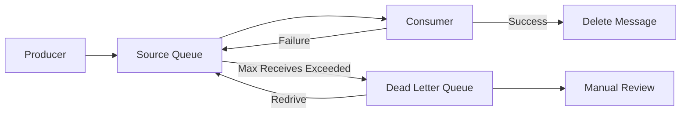
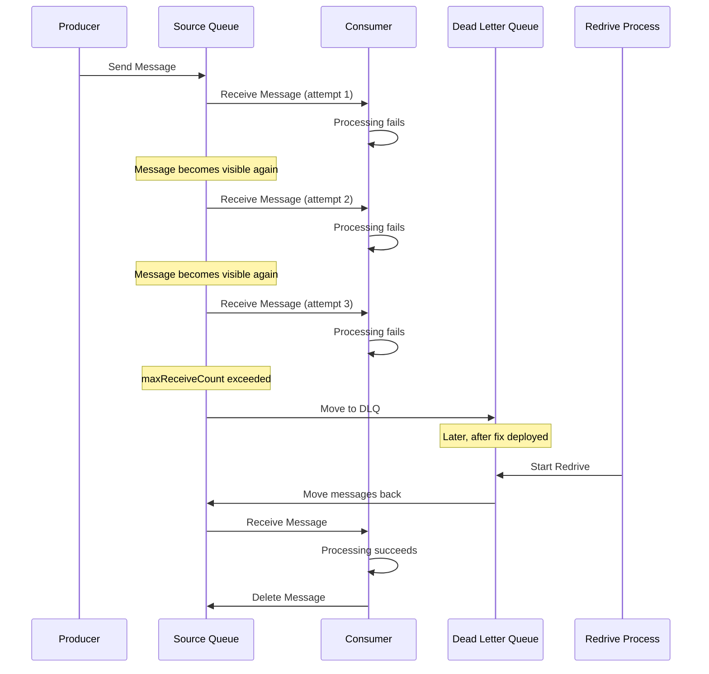
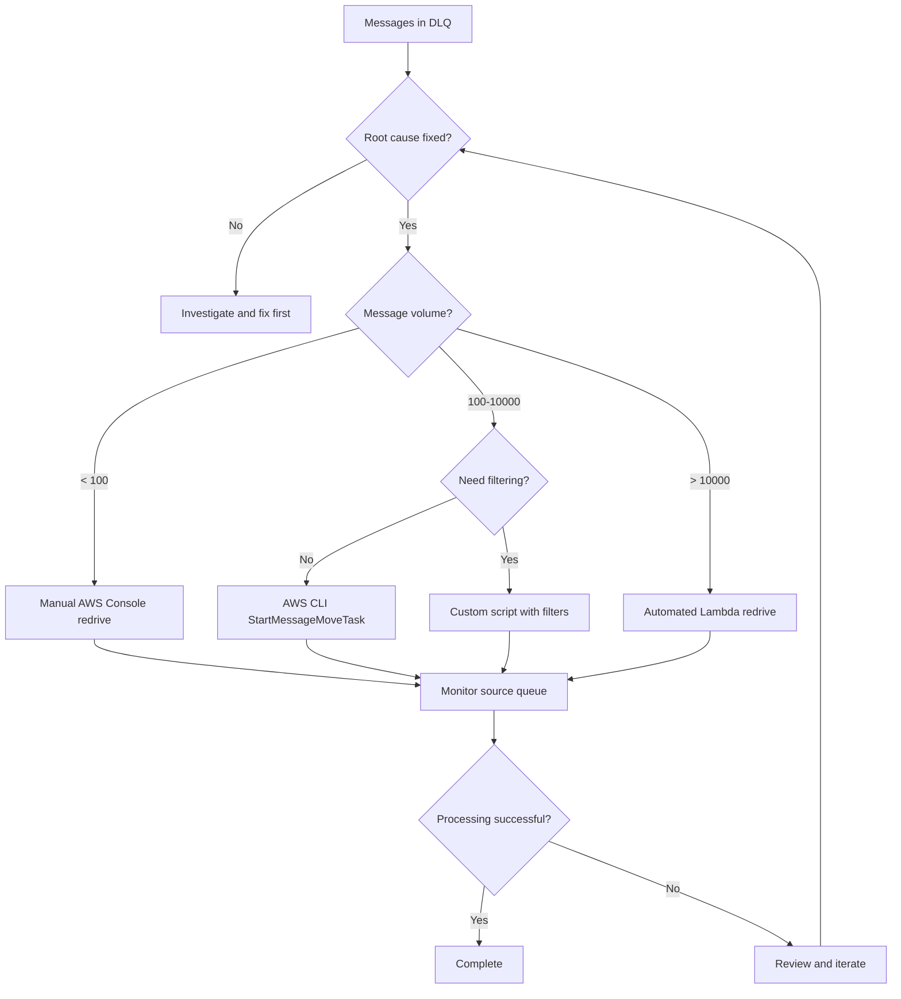

# How to Configure SQS DLQ Redrive Policies

Author: [nawazdhandala](https://github.com/nawazdhandala)

Tags: AWS, SQS, DLQ, Dead Letter Queue, Message Queue, DevOps, Cloud

Description: Learn how to configure Amazon SQS Dead Letter Queue redrive policies to handle failed messages, implement automatic and manual redrive strategies, and build robust message processing systems.

---

Amazon SQS Dead Letter Queues (DLQs) capture messages that fail processing after a specified number of attempts. Without a proper redrive policy, these messages sit indefinitely in the DLQ, creating operational debt and potentially losing critical data. A well-configured redrive policy lets you automatically or manually move messages back to the source queue for reprocessing.

## Understanding DLQ Architecture

Before diving into configuration, let's understand how messages flow between source queues and dead letter queues.



| Component | Purpose |
|-----------|---------|
| Source Queue | Primary queue where messages arrive |
| Consumer | Application processing messages |
| DLQ | Captures messages that exceed maxReceiveCount |
| Redrive Policy | Rules for moving messages back to source |

## Basic DLQ Configuration with AWS CLI

The following command creates a dead letter queue and configures the redrive policy on the source queue to send failed messages to the DLQ after 3 processing attempts.

```bash
# Create the dead letter queue
aws sqs create-queue \
  --queue-name orders-dlq \
  --attributes '{
    "MessageRetentionPeriod": "1209600"
  }'

# Get the DLQ ARN
DLQ_ARN=$(aws sqs get-queue-attributes \
  --queue-url https://sqs.us-east-1.amazonaws.com/123456789012/orders-dlq \
  --attribute-names QueueArn \
  --query 'Attributes.QueueArn' \
  --output text)

# Create source queue with redrive policy
aws sqs create-queue \
  --queue-name orders-queue \
  --attributes '{
    "RedrivePolicy": "{\"deadLetterTargetArn\":\"'$DLQ_ARN'\",\"maxReceiveCount\":\"3\"}",
    "VisibilityTimeout": "30"
  }'
```

## Terraform Configuration

Infrastructure as code provides repeatable and version-controlled queue configuration. The following Terraform module creates both queues with proper redrive policies and IAM permissions.

```hcl
# Define the dead letter queue with extended retention
resource "aws_sqs_queue" "orders_dlq" {
  name                      = "orders-dlq"
  message_retention_seconds = 1209600  # 14 days

  tags = {
    Environment = "production"
    Purpose     = "dead-letter-queue"
  }
}

# Define the source queue with redrive policy pointing to DLQ
resource "aws_sqs_queue" "orders" {
  name                       = "orders-queue"
  visibility_timeout_seconds = 30
  message_retention_seconds  = 345600  # 4 days
  receive_wait_time_seconds  = 20      # Long polling

  redrive_policy = jsonencode({
    deadLetterTargetArn = aws_sqs_queue.orders_dlq.arn
    maxReceiveCount     = 3
  })

  tags = {
    Environment = "production"
    Purpose     = "order-processing"
  }
}

# Configure redrive allow policy on the DLQ
# Specifies which source queues can use the DLQ for redrive
resource "aws_sqs_queue_redrive_allow_policy" "orders_dlq_allow" {
  queue_url = aws_sqs_queue.orders_dlq.id

  redrive_allow_policy = jsonencode({
    redrivePermission = "byQueue"
    sourceQueueArns   = [aws_sqs_queue.orders.arn]
  })
}

# IAM policy for applications to interact with both queues
resource "aws_iam_policy" "sqs_access" {
  name = "orders-sqs-access"

  policy = jsonencode({
    Version = "2012-10-17"
    Statement = [
      {
        Effect = "Allow"
        Action = [
          "sqs:SendMessage",
          "sqs:ReceiveMessage",
          "sqs:DeleteMessage",
          "sqs:GetQueueAttributes",
          "sqs:GetQueueUrl"
        ]
        Resource = [
          aws_sqs_queue.orders.arn,
          aws_sqs_queue.orders_dlq.arn
        ]
      },
      {
        Effect = "Allow"
        Action = [
          "sqs:StartMessageMoveTask",
          "sqs:CancelMessageMoveTask",
          "sqs:ListMessageMoveTasks"
        ]
        Resource = aws_sqs_queue.orders_dlq.arn
      }
    ]
  })
}
```

## DLQ Redrive Message Flow

Understanding when and how messages move between queues helps in designing robust error handling.



## Manual Redrive with AWS CLI

AWS provides native support for moving messages from DLQ back to the source queue. The following commands demonstrate how to start, monitor, and manage a redrive task.

```bash
# Start a redrive task to move all messages from DLQ to source queue
aws sqs start-message-move-task \
  --source-arn arn:aws:sqs:us-east-1:123456789012:orders-dlq \
  --destination-arn arn:aws:sqs:us-east-1:123456789012:orders-queue \
  --max-number-of-messages-per-second 50

# Check the status of the redrive task
aws sqs list-message-move-tasks \
  --source-arn arn:aws:sqs:us-east-1:123456789012:orders-dlq

# Cancel a running redrive task if needed
aws sqs cancel-message-move-task \
  --task-handle "task-handle-from-start-command"
```

## Programmatic Redrive with Python

For more control over the redrive process, implement custom logic that filters, transforms, or validates messages before reprocessing. The following Python script provides selective redrive with message inspection.

```python
import boto3
import json
import logging
from typing import Optional, Callable
from dataclasses import dataclass

logging.basicConfig(level=logging.INFO)
logger = logging.getLogger(__name__)

@dataclass
class RedriveConfig:
    """Configuration for DLQ redrive operations."""
    dlq_url: str
    source_queue_url: str
    batch_size: int = 10
    max_messages: Optional[int] = None
    visibility_timeout: int = 30


class DLQRedriveManager:
    """
    Manages redrive operations from DLQ to source queue.
    Supports filtering, transformation, and validation of messages.
    """

    def __init__(self, config: RedriveConfig):
        self.config = config
        self.sqs = boto3.client('sqs')
        self.processed_count = 0
        self.failed_count = 0
        self.skipped_count = 0

    def redrive_all(
        self,
        message_filter: Optional[Callable] = None,
        transform: Optional[Callable] = None
    ) -> dict:
        """
        Move messages from DLQ back to source queue.

        Args:
            message_filter: Optional function to filter messages.
                           Return True to redrive, False to skip.
            transform: Optional function to transform message body
                      before sending to source queue.

        Returns:
            Dictionary with redrive statistics.
        """
        logger.info(f"Starting redrive from {self.config.dlq_url}")

        while True:
            # Check if we have reached the max messages limit
            if (self.config.max_messages and
                self.processed_count >= self.config.max_messages):
                logger.info("Reached max messages limit")
                break

            # Receive batch of messages from DLQ
            response = self.sqs.receive_message(
                QueueUrl=self.config.dlq_url,
                MaxNumberOfMessages=min(
                    self.config.batch_size,
                    (self.config.max_messages or float('inf')) - self.processed_count
                ),
                VisibilityTimeout=self.config.visibility_timeout,
                MessageAttributeNames=['All'],
                AttributeNames=['All'],
                WaitTimeSeconds=5
            )

            messages = response.get('Messages', [])
            if not messages:
                logger.info("No more messages in DLQ")
                break

            # Process each message in the batch
            for message in messages:
                self._process_message(message, message_filter, transform)

        stats = {
            'processed': self.processed_count,
            'failed': self.failed_count,
            'skipped': self.skipped_count
        }
        logger.info(f"Redrive complete: {stats}")
        return stats

    def _process_message(
        self,
        message: dict,
        message_filter: Optional[Callable],
        transform: Optional[Callable]
    ):
        """Process a single message from the DLQ."""
        message_id = message['MessageId']
        body = message['Body']

        try:
            # Apply filter if provided
            if message_filter and not message_filter(message):
                logger.info(f"Skipping message {message_id} (filtered)")
                self.skipped_count += 1
                # Delete filtered messages from DLQ
                self._delete_message(message)
                return

            # Apply transformation if provided
            if transform:
                body = transform(body)

            # Send message to source queue
            send_params = {
                'QueueUrl': self.config.source_queue_url,
                'MessageBody': body
            }

            # Preserve message attributes if present
            if 'MessageAttributes' in message:
                send_params['MessageAttributes'] = message['MessageAttributes']

            self.sqs.send_message(**send_params)

            # Delete from DLQ after successful send
            self._delete_message(message)

            self.processed_count += 1
            logger.debug(f"Redrived message {message_id}")

        except Exception as e:
            logger.error(f"Failed to redrive message {message_id}: {e}")
            self.failed_count += 1

    def _delete_message(self, message: dict):
        """Delete a message from the DLQ."""
        self.sqs.delete_message(
            QueueUrl=self.config.dlq_url,
            ReceiptHandle=message['ReceiptHandle']
        )


# Example usage with custom filter and transform
def main():
    config = RedriveConfig(
        dlq_url='https://sqs.us-east-1.amazonaws.com/123456789012/orders-dlq',
        source_queue_url='https://sqs.us-east-1.amazonaws.com/123456789012/orders-queue',
        batch_size=10,
        max_messages=1000
    )

    manager = DLQRedriveManager(config)

    # Filter: Only redrive messages from the last 24 hours
    def recent_messages_only(message: dict) -> bool:
        import time
        sent_timestamp = int(message['Attributes'].get('SentTimestamp', 0))
        age_hours = (time.time() * 1000 - sent_timestamp) / (1000 * 60 * 60)
        return age_hours < 24

    # Transform: Add retry metadata to message body
    def add_retry_metadata(body: str) -> str:
        import time
        data = json.loads(body)
        data['_retry_metadata'] = {
            'redriven_at': time.time(),
            'source': 'dlq-redrive'
        }
        return json.dumps(data)

    stats = manager.redrive_all(
        message_filter=recent_messages_only,
        transform=add_retry_metadata
    )

    print(f"Redrive complete: {stats}")


if __name__ == '__main__':
    main()
```

## Node.js Redrive Implementation

The following Node.js implementation provides similar functionality with async/await patterns and better error handling for production use.

```javascript
const {
  SQSClient,
  ReceiveMessageCommand,
  SendMessageCommand,
  DeleteMessageCommand,
  GetQueueAttributesCommand
} = require('@aws-sdk/client-sqs');

/**
 * DLQ Redrive Manager for Node.js applications.
 * Handles moving messages from DLQ back to source queue
 * with support for filtering and transformation.
 */
class DLQRedriveManager {
  constructor(config) {
    this.dlqUrl = config.dlqUrl;
    this.sourceQueueUrl = config.sourceQueueUrl;
    this.batchSize = config.batchSize || 10;
    this.maxMessages = config.maxMessages || Infinity;
    this.visibilityTimeout = config.visibilityTimeout || 30;

    this.sqs = new SQSClient({ region: config.region || 'us-east-1' });

    this.stats = {
      processed: 0,
      failed: 0,
      skipped: 0
    };
  }

  /**
   * Get current queue statistics including approximate message count.
   */
  async getQueueStats() {
    const command = new GetQueueAttributesCommand({
      QueueUrl: this.dlqUrl,
      AttributeNames: [
        'ApproximateNumberOfMessages',
        'ApproximateNumberOfMessagesNotVisible'
      ]
    });

    const response = await this.sqs.send(command);
    return {
      messagesAvailable: parseInt(response.Attributes.ApproximateNumberOfMessages, 10),
      messagesInFlight: parseInt(response.Attributes.ApproximateNumberOfMessagesNotVisible, 10)
    };
  }

  /**
   * Redrive messages from DLQ to source queue.
   * @param {Object} options - Redrive options
   * @param {Function} options.filter - Optional filter function
   * @param {Function} options.transform - Optional transform function
   * @param {Function} options.onProgress - Progress callback
   */
  async redrive(options = {}) {
    const { filter, transform, onProgress } = options;

    console.log(`Starting redrive from ${this.dlqUrl}`);
    const startTime = Date.now();

    while (this.stats.processed < this.maxMessages) {
      // Receive messages from DLQ
      const receiveCommand = new ReceiveMessageCommand({
        QueueUrl: this.dlqUrl,
        MaxNumberOfMessages: Math.min(
          this.batchSize,
          this.maxMessages - this.stats.processed
        ),
        VisibilityTimeout: this.visibilityTimeout,
        MessageAttributeNames: ['All'],
        AttributeNames: ['All'],
        WaitTimeSeconds: 5
      });

      const response = await this.sqs.send(receiveCommand);
      const messages = response.Messages || [];

      if (messages.length === 0) {
        console.log('No more messages in DLQ');
        break;
      }

      // Process messages concurrently within the batch
      await Promise.all(
        messages.map(msg => this.processMessage(msg, { filter, transform }))
      );

      // Report progress if callback provided
      if (onProgress) {
        onProgress(this.stats);
      }
    }

    const duration = (Date.now() - startTime) / 1000;
    console.log(`Redrive complete in ${duration}s:`, this.stats);

    return this.stats;
  }

  /**
   * Process a single message from the DLQ.
   */
  async processMessage(message, { filter, transform }) {
    const messageId = message.MessageId;

    try {
      // Apply filter if provided
      if (filter) {
        const shouldRedrive = await filter(message);
        if (!shouldRedrive) {
          console.log(`Skipping message ${messageId} (filtered)`);
          this.stats.skipped++;
          await this.deleteMessage(message);
          return;
        }
      }

      // Prepare message body, applying transform if provided
      let body = message.Body;
      if (transform) {
        body = await transform(body, message);
      }

      // Build send parameters
      const sendParams = {
        QueueUrl: this.sourceQueueUrl,
        MessageBody: body
      };

      // Preserve message attributes
      if (message.MessageAttributes) {
        sendParams.MessageAttributes = message.MessageAttributes;
      }

      // Send to source queue
      const sendCommand = new SendMessageCommand(sendParams);
      await this.sqs.send(sendCommand);

      // Delete from DLQ after successful send
      await this.deleteMessage(message);

      this.stats.processed++;

    } catch (error) {
      console.error(`Failed to redrive message ${messageId}:`, error.message);
      this.stats.failed++;
    }
  }

  /**
   * Delete a message from the DLQ.
   */
  async deleteMessage(message) {
    const command = new DeleteMessageCommand({
      QueueUrl: this.dlqUrl,
      ReceiptHandle: message.ReceiptHandle
    });
    await this.sqs.send(command);
  }
}

// Example usage
async function main() {
  const manager = new DLQRedriveManager({
    dlqUrl: 'https://sqs.us-east-1.amazonaws.com/123456789012/orders-dlq',
    sourceQueueUrl: 'https://sqs.us-east-1.amazonaws.com/123456789012/orders-queue',
    region: 'us-east-1',
    batchSize: 10,
    maxMessages: 1000
  });

  // Check queue status before redrive
  const queueStats = await manager.getQueueStats();
  console.log(`DLQ has ${queueStats.messagesAvailable} messages available`);

  // Define a filter to only redrive orders above a certain amount
  const orderAmountFilter = async (message) => {
    try {
      const body = JSON.parse(message.Body);
      return body.orderAmount > 100;
    } catch {
      return true;  // Redrive if we cannot parse
    }
  };

  // Transform to add retry information
  const addRetryInfo = async (body, message) => {
    const data = JSON.parse(body);
    data._redrive = {
      originalMessageId: message.MessageId,
      redrivedAt: new Date().toISOString(),
      receiveCount: message.Attributes?.ApproximateReceiveCount
    };
    return JSON.stringify(data);
  };

  // Run redrive with progress reporting
  const stats = await manager.redrive({
    filter: orderAmountFilter,
    transform: addRetryInfo,
    onProgress: (s) => console.log(`Progress: ${s.processed} processed, ${s.skipped} skipped`)
  });

  console.log('Final stats:', stats);
}

main().catch(console.error);
```

## Automated Redrive with Lambda

For scheduled or event-driven redrive operations, AWS Lambda provides a serverless solution. The following Lambda function automatically redrives messages on a schedule.

```python
import boto3
import json
import os
import logging
from datetime import datetime, timedelta

logger = logging.getLogger()
logger.setLevel(logging.INFO)

sqs = boto3.client('sqs')

def lambda_handler(event, context):
    """
    Lambda function to automatically redrive DLQ messages.
    Triggered by CloudWatch Events on a schedule.
    """
    dlq_url = os.environ['DLQ_URL']
    source_queue_url = os.environ['SOURCE_QUEUE_URL']
    max_age_hours = int(os.environ.get('MAX_AGE_HOURS', '24'))

    stats = {
        'processed': 0,
        'skipped': 0,
        'failed': 0
    }

    # Calculate cutoff time for old messages
    cutoff_time = datetime.now() - timedelta(hours=max_age_hours)
    cutoff_timestamp = int(cutoff_time.timestamp() * 1000)

    logger.info(f"Starting auto-redrive from {dlq_url}")
    logger.info(f"Will skip messages older than {max_age_hours} hours")

    while True:
        # Receive messages from DLQ
        response = sqs.receive_message(
            QueueUrl=dlq_url,
            MaxNumberOfMessages=10,
            VisibilityTimeout=60,
            AttributeNames=['All'],
            MessageAttributeNames=['All'],
            WaitTimeSeconds=1
        )

        messages = response.get('Messages', [])
        if not messages:
            logger.info("No more messages in DLQ")
            break

        for message in messages:
            message_id = message['MessageId']
            sent_timestamp = int(message['Attributes'].get('SentTimestamp', 0))

            # Skip messages older than cutoff
            if sent_timestamp < cutoff_timestamp:
                logger.info(f"Skipping old message {message_id}")
                stats['skipped'] += 1
                continue

            try:
                # Send to source queue
                send_params = {
                    'QueueUrl': source_queue_url,
                    'MessageBody': message['Body']
                }

                if 'MessageAttributes' in message:
                    send_params['MessageAttributes'] = message['MessageAttributes']

                sqs.send_message(**send_params)

                # Delete from DLQ
                sqs.delete_message(
                    QueueUrl=dlq_url,
                    ReceiptHandle=message['ReceiptHandle']
                )

                stats['processed'] += 1
                logger.debug(f"Redrived message {message_id}")

            except Exception as e:
                logger.error(f"Failed to redrive {message_id}: {e}")
                stats['failed'] += 1

        # Lambda timeout safety - check remaining time
        remaining_time = context.get_remaining_time_in_millis()
        if remaining_time < 30000:  # Less than 30 seconds remaining
            logger.warning("Running low on time, stopping redrive")
            break

    logger.info(f"Auto-redrive complete: {stats}")

    # Publish metrics to CloudWatch
    publish_metrics(stats)

    return stats


def publish_metrics(stats):
    """Publish redrive metrics to CloudWatch."""
    cloudwatch = boto3.client('cloudwatch')

    cloudwatch.put_metric_data(
        Namespace='DLQ/Redrive',
        MetricData=[
            {
                'MetricName': 'MessagesRedrived',
                'Value': stats['processed'],
                'Unit': 'Count'
            },
            {
                'MetricName': 'MessagesSkipped',
                'Value': stats['skipped'],
                'Unit': 'Count'
            },
            {
                'MetricName': 'MessagesFailed',
                'Value': stats['failed'],
                'Unit': 'Count'
            }
        ]
    )
```

## CloudWatch Alarms for DLQ Monitoring

Monitoring DLQ depth helps identify processing issues before they become critical. The following Terraform configuration creates CloudWatch alarms for proactive alerting.

```hcl
# CloudWatch alarm when DLQ messages exceed threshold
resource "aws_cloudwatch_metric_alarm" "dlq_messages_alarm" {
  alarm_name          = "orders-dlq-messages-high"
  comparison_operator = "GreaterThanThreshold"
  evaluation_periods  = 2
  metric_name         = "ApproximateNumberOfMessagesVisible"
  namespace           = "AWS/SQS"
  period              = 300
  statistic           = "Average"
  threshold           = 100
  alarm_description   = "DLQ message count exceeds threshold"

  dimensions = {
    QueueName = aws_sqs_queue.orders_dlq.name
  }

  alarm_actions = [aws_sns_topic.alerts.arn]
  ok_actions    = [aws_sns_topic.alerts.arn]

  tags = {
    Environment = "production"
  }
}

# Alarm for DLQ message age
resource "aws_cloudwatch_metric_alarm" "dlq_age_alarm" {
  alarm_name          = "orders-dlq-message-age-high"
  comparison_operator = "GreaterThanThreshold"
  evaluation_periods  = 1
  metric_name         = "ApproximateAgeOfOldestMessage"
  namespace           = "AWS/SQS"
  period              = 300
  statistic           = "Maximum"
  threshold           = 86400  # 24 hours in seconds
  alarm_description   = "DLQ has messages older than 24 hours"

  dimensions = {
    QueueName = aws_sqs_queue.orders_dlq.name
  }

  alarm_actions = [aws_sns_topic.alerts.arn]

  tags = {
    Environment = "production"
  }
}

# SNS topic for alerts
resource "aws_sns_topic" "alerts" {
  name = "dlq-alerts"
}
```

## Redrive Strategy Decision Tree

Choosing the right redrive strategy depends on your use case and operational requirements.



## Best Practices Summary

| Practice | Description |
|----------|-------------|
| Set appropriate maxReceiveCount | 3-5 attempts balances retry opportunity with DLQ escalation |
| Configure redrive allow policy | Explicitly specify which queues can redrive to prevent misuse |
| Monitor DLQ depth | Alert when messages accumulate to catch issues early |
| Preserve message attributes | Maintain context when redriving for debugging |
| Add redrive metadata | Track redrive history to identify recurring failures |
| Test redrive process | Verify messages process correctly after redrive |
| Set visibility timeout | Ensure timeout exceeds processing time to prevent duplicates |
| Use idempotent consumers | Handle potential duplicate processing during redrive |

## Common Pitfalls to Avoid

Several mistakes can undermine your DLQ strategy.

**Redriving without fixing the root cause**: Messages will immediately fail again and return to the DLQ, wasting resources and creating noise.

**Missing redrive allow policy**: Without explicit permission, redrive operations will fail with access denied errors.

**Ignoring message attributes**: Losing attributes during redrive can break downstream processing that depends on them.

**No rate limiting**: Redriving thousands of messages simultaneously can overwhelm your consumer and create cascading failures.

**Forgetting FIFO queue considerations**: FIFO queues require matching message group IDs, and redrive must maintain ordering guarantees.

## Conclusion

A well-configured SQS DLQ redrive policy ensures failed messages get a second chance at processing while maintaining visibility into system health. Start with basic configuration using AWS-native tools, then evolve to custom solutions as your requirements grow. Monitor your DLQ depth, investigate failures promptly, and always verify the root cause is fixed before initiating a redrive.
