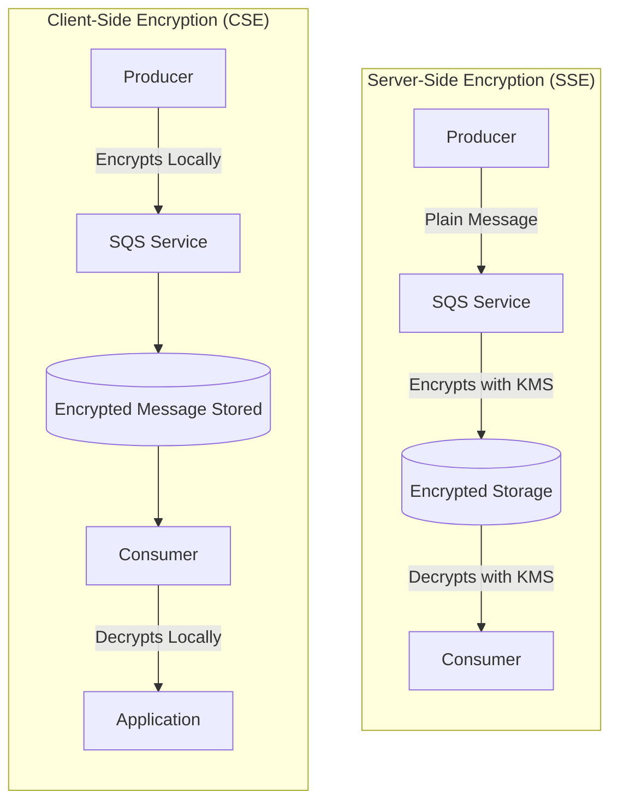
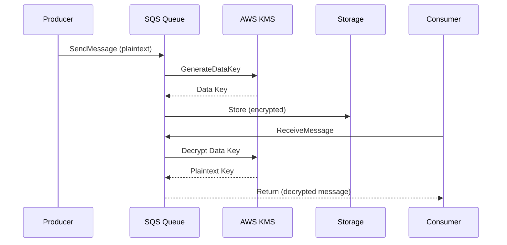
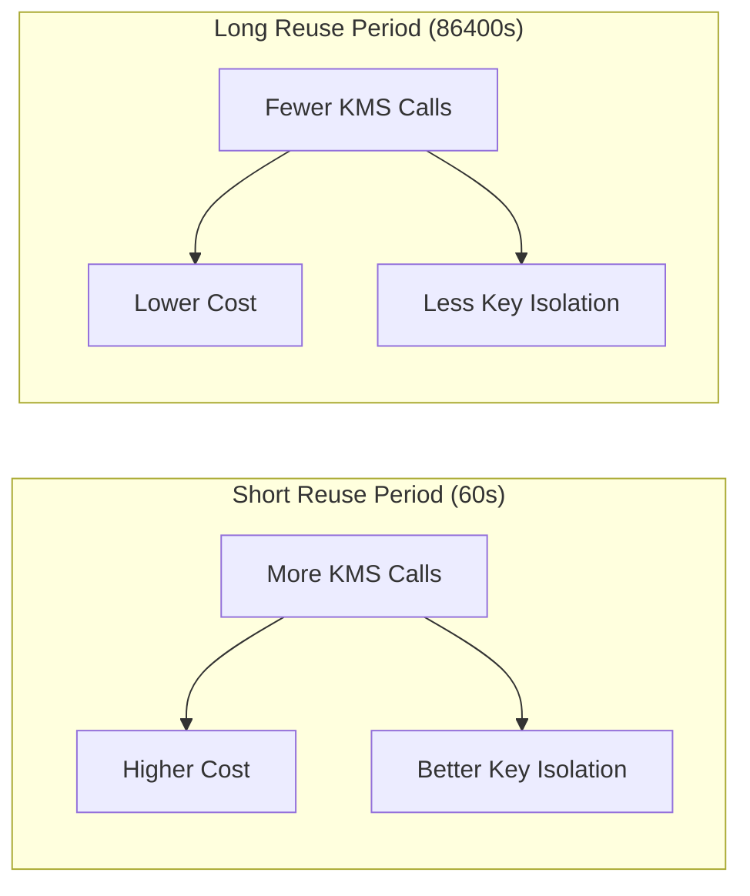
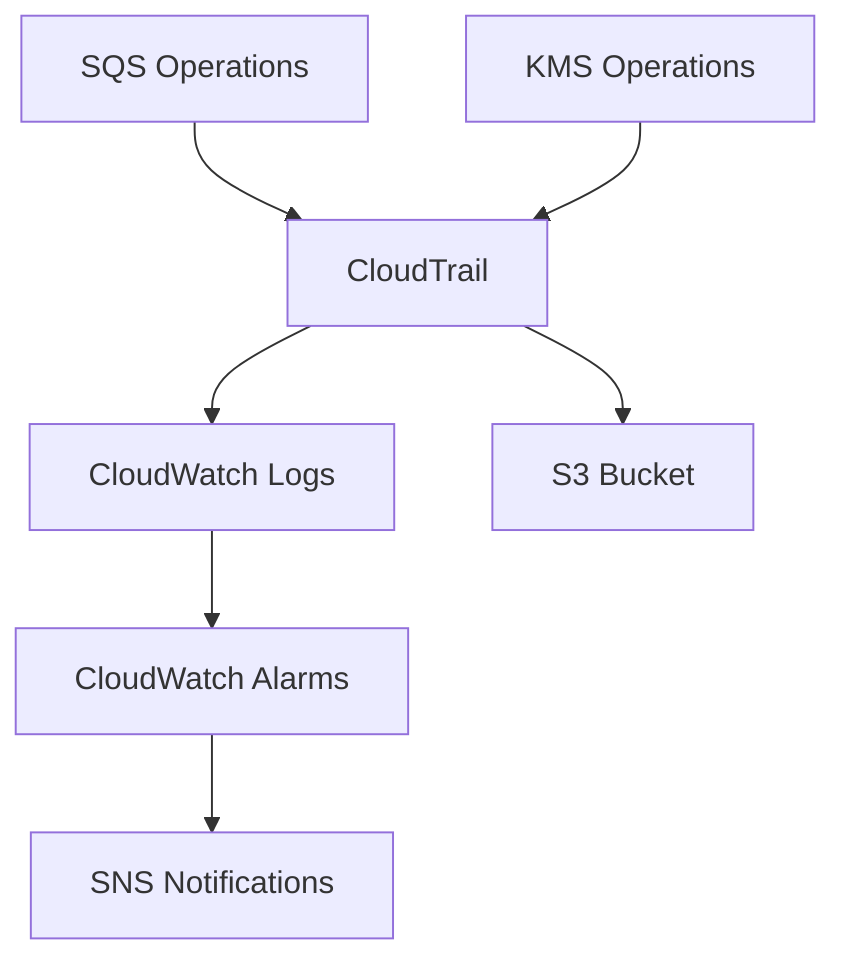

# How to Configure SQS Encryption

Author: [nawazdhandala](https://www.github.com/nawazdhandala)

Tags: AWS, SQS, Encryption, Security, KMS, Message Queue, Cloud Security

Description: A comprehensive guide to configuring encryption for Amazon SQS queues, covering server-side encryption with AWS KMS, client-side encryption, key management best practices, and security compliance considerations.

---

Amazon Simple Queue Service (SQS) handles sensitive data in many production systems. Leaving messages unencrypted creates security risks and compliance violations. Encryption at rest ensures that message contents remain protected even if unauthorized access occurs at the storage layer.

## Understanding SQS Encryption Options

SQS offers two primary encryption approaches: server-side encryption (SSE) managed by AWS and client-side encryption managed by your application.



### Choosing Between SSE and CSE

| Feature | Server-Side Encryption | Client-Side Encryption |
|---------|----------------------|------------------------|
| Key Management | AWS KMS handles keys | Application manages keys |
| Performance | Minimal overhead | Additional latency |
| Compliance | Meets most requirements | Required for some regulations |
| Complexity | Simple setup | More implementation work |
| End-to-End | Decrypted at SQS | Message stays encrypted |

## Server-Side Encryption with AWS KMS

SSE-KMS is the recommended approach for most use cases. AWS handles encryption and decryption automatically using AWS Key Management Service.

### Architecture Overview



### Enabling SSE via AWS Console

Navigate to the SQS console, select your queue, and enable encryption in the Encryption settings section. You can choose between an AWS managed key or a customer managed key.

### Enabling SSE with AWS CLI

The following command creates a new SQS queue with encryption enabled using the default AWS managed key for SQS.

```bash
# Create an encrypted queue with AWS managed key
aws sqs create-queue \
    --queue-name my-encrypted-queue \
    --attributes '{
        "KmsMasterKeyId": "alias/aws/sqs",
        "KmsDataKeyReusePeriodSeconds": "300"
    }'
```

For existing queues, use the set-queue-attributes command to enable encryption without recreating the queue.

```bash
# Enable encryption on existing queue
aws sqs set-queue-attributes \
    --queue-url https://sqs.us-east-1.amazonaws.com/123456789012/my-queue \
    --attributes '{
        "KmsMasterKeyId": "alias/aws/sqs",
        "KmsDataKeyReusePeriodSeconds": "300"
    }'
```

### Enabling SSE with Terraform

Infrastructure as code ensures consistent encryption configuration across environments. The following Terraform configuration creates an encrypted SQS queue with a custom KMS key.

```hcl
# Create a customer managed KMS key for SQS encryption
resource "aws_kms_key" "sqs_key" {
  description             = "KMS key for SQS queue encryption"
  deletion_window_in_days = 30
  enable_key_rotation     = true

  # Policy allowing SQS service to use the key
  policy = jsonencode({
    Version = "2012-10-17"
    Statement = [
      {
        Sid    = "Enable IAM User Permissions"
        Effect = "Allow"
        Principal = {
          AWS = "arn:aws:iam::${data.aws_caller_identity.current.account_id}:root"
        }
        Action   = "kms:*"
        Resource = "*"
      },
      {
        Sid    = "Allow SQS Service"
        Effect = "Allow"
        Principal = {
          Service = "sqs.amazonaws.com"
        }
        Action = [
          "kms:GenerateDataKey",
          "kms:Decrypt"
        ]
        Resource = "*"
      }
    ]
  })

  tags = {
    Environment = "production"
    Purpose     = "sqs-encryption"
  }
}

# Create an alias for easier key reference
resource "aws_kms_alias" "sqs_key_alias" {
  name          = "alias/sqs-encryption-key"
  target_key_id = aws_kms_key.sqs_key.key_id
}

# Create the encrypted SQS queue
resource "aws_sqs_queue" "encrypted_queue" {
  name = "my-encrypted-queue"

  # Enable server-side encryption
  kms_master_key_id                 = aws_kms_key.sqs_key.arn
  kms_data_key_reuse_period_seconds = 300

  # Additional queue configuration
  message_retention_seconds  = 1209600  # 14 days
  visibility_timeout_seconds = 30
  receive_wait_time_seconds  = 20       # Long polling

  tags = {
    Environment = "production"
    Encrypted   = "true"
  }
}

# Output the queue URL for reference
output "queue_url" {
  value = aws_sqs_queue.encrypted_queue.url
}

output "kms_key_arn" {
  value = aws_kms_key.sqs_key.arn
}
```

### Enabling SSE with CloudFormation

CloudFormation templates provide another infrastructure as code option for AWS-native deployments.

```yaml
AWSTemplateFormatVersion: '2010-09-09'
Description: Encrypted SQS Queue with Customer Managed KMS Key

Resources:
  # KMS Key for SQS encryption
  SQSEncryptionKey:
    Type: AWS::KMS::Key
    Properties:
      Description: KMS key for SQS queue encryption
      EnableKeyRotation: true
      KeyPolicy:
        Version: '2012-10-17'
        Statement:
          - Sid: Enable IAM User Permissions
            Effect: Allow
            Principal:
              AWS: !Sub 'arn:aws:iam::${AWS::AccountId}:root'
            Action: 'kms:*'
            Resource: '*'
          - Sid: Allow SQS Service
            Effect: Allow
            Principal:
              Service: sqs.amazonaws.com
            Action:
              - 'kms:GenerateDataKey'
              - 'kms:Decrypt'
            Resource: '*'
      Tags:
        - Key: Purpose
          Value: sqs-encryption

  # KMS Key Alias
  SQSEncryptionKeyAlias:
    Type: AWS::KMS::Alias
    Properties:
      AliasName: alias/sqs-encryption-key
      TargetKeyId: !Ref SQSEncryptionKey

  # Encrypted SQS Queue
  EncryptedQueue:
    Type: AWS::SQS::Queue
    Properties:
      QueueName: my-encrypted-queue
      KmsMasterKeyId: !GetAtt SQSEncryptionKey.Arn
      KmsDataKeyReusePeriodSeconds: 300
      MessageRetentionPeriod: 1209600
      VisibilityTimeout: 30
      ReceiveMessageWaitTimeSeconds: 20
      Tags:
        - Key: Encrypted
          Value: 'true'

Outputs:
  QueueURL:
    Description: URL of the encrypted queue
    Value: !Ref EncryptedQueue
  QueueArn:
    Description: ARN of the encrypted queue
    Value: !GetAtt EncryptedQueue.Arn
  KMSKeyArn:
    Description: ARN of the KMS key
    Value: !GetAtt SQSEncryptionKey.Arn
```

## Data Key Reuse Period

The KmsDataKeyReusePeriodSeconds parameter controls how long SQS reuses data keys before requesting new ones from KMS. Understanding this setting helps balance security and cost.



| Reuse Period | KMS API Calls | Cost Impact | Security |
|--------------|---------------|-------------|----------|
| 60 seconds | High | Higher | Maximum isolation |
| 300 seconds | Medium | Balanced | Recommended default |
| 86400 seconds | Low | Minimal | Acceptable for most cases |

## IAM Permissions for Encrypted Queues

Producers and consumers need permissions for both SQS and KMS operations. Missing KMS permissions cause AccessDenied errors even with correct SQS permissions.

### Producer IAM Policy

Producers need permission to send messages and use KMS for encryption.

```json
{
    "Version": "2012-10-17",
    "Statement": [
        {
            "Sid": "SQSSendMessage",
            "Effect": "Allow",
            "Action": [
                "sqs:SendMessage",
                "sqs:GetQueueUrl",
                "sqs:GetQueueAttributes"
            ],
            "Resource": "arn:aws:sqs:us-east-1:123456789012:my-encrypted-queue"
        },
        {
            "Sid": "KMSEncrypt",
            "Effect": "Allow",
            "Action": [
                "kms:GenerateDataKey",
                "kms:Decrypt"
            ],
            "Resource": "arn:aws:kms:us-east-1:123456789012:key/your-key-id"
        }
    ]
}
```

### Consumer IAM Policy

Consumers need permission to receive, delete messages, and use KMS for decryption.

```json
{
    "Version": "2012-10-17",
    "Statement": [
        {
            "Sid": "SQSReceiveMessage",
            "Effect": "Allow",
            "Action": [
                "sqs:ReceiveMessage",
                "sqs:DeleteMessage",
                "sqs:GetQueueUrl",
                "sqs:GetQueueAttributes",
                "sqs:ChangeMessageVisibility"
            ],
            "Resource": "arn:aws:sqs:us-east-1:123456789012:my-encrypted-queue"
        },
        {
            "Sid": "KMSDecrypt",
            "Effect": "Allow",
            "Action": [
                "kms:Decrypt"
            ],
            "Resource": "arn:aws:kms:us-east-1:123456789012:key/your-key-id"
        }
    ]
}
```

## Client-Side Encryption

For scenarios requiring end-to-end encryption where even AWS cannot access message contents, implement client-side encryption.

### Python Implementation with AWS Encryption SDK

The AWS Encryption SDK simplifies client-side encryption with envelope encryption and key management.

```python
# Install required packages:
# pip install aws-encryption-sdk boto3

import boto3
import aws_encryption_sdk
from aws_encryption_sdk.identifiers import CommitmentPolicy

# Initialize the encryption client with the latest commitment policy
# for maximum security against key commitment attacks
client = aws_encryption_sdk.EncryptionSDKClient(
    commitment_policy=CommitmentPolicy.REQUIRE_ENCRYPT_REQUIRE_DECRYPT
)

# Create a KMS key provider using your customer managed key
# Replace with your actual KMS key ARN
kms_key_arn = "arn:aws:kms:us-east-1:123456789012:key/your-key-id"
kms_key_provider = aws_encryption_sdk.StrictAwsKmsMasterKeyProvider(
    key_ids=[kms_key_arn]
)

# Initialize SQS client
sqs = boto3.client('sqs', region_name='us-east-1')
queue_url = 'https://sqs.us-east-1.amazonaws.com/123456789012/my-queue'


def encrypt_and_send_message(message_body: str, message_attributes: dict = None):
    """
    Encrypt a message using client-side encryption and send to SQS.

    Args:
        message_body: The plaintext message content
        message_attributes: Optional SQS message attributes (not encrypted)

    Returns:
        The SQS SendMessage response
    """
    # Encrypt the message body
    # The encryption context helps prevent ciphertext swapping attacks
    ciphertext, encryptor_header = client.encrypt(
        source=message_body.encode('utf-8'),
        key_provider=kms_key_provider,
        encryption_context={
            'purpose': 'sqs-message',
            'queue': queue_url
        }
    )

    # Send encrypted message to SQS
    # Base64 encode for safe transmission
    import base64
    encoded_message = base64.b64encode(ciphertext).decode('utf-8')

    params = {
        'QueueUrl': queue_url,
        'MessageBody': encoded_message
    }

    if message_attributes:
        params['MessageAttributes'] = message_attributes

    return sqs.send_message(**params)


def receive_and_decrypt_message():
    """
    Receive a message from SQS and decrypt using client-side decryption.

    Returns:
        Tuple of (decrypted message body, receipt handle) or (None, None)
    """
    import base64

    # Receive message from SQS
    response = sqs.receive_message(
        QueueUrl=queue_url,
        MaxNumberOfMessages=1,
        WaitTimeSeconds=20,
        MessageAttributeNames=['All']
    )

    messages = response.get('Messages', [])
    if not messages:
        return None, None

    message = messages[0]
    receipt_handle = message['ReceiptHandle']

    # Decode and decrypt the message
    encrypted_body = base64.b64decode(message['Body'])

    plaintext, decryptor_header = client.decrypt(
        source=encrypted_body,
        key_provider=kms_key_provider
    )

    return plaintext.decode('utf-8'), receipt_handle


def delete_message(receipt_handle: str):
    """Delete a processed message from the queue."""
    sqs.delete_message(
        QueueUrl=queue_url,
        ReceiptHandle=receipt_handle
    )


# Example usage
if __name__ == "__main__":
    # Send an encrypted message
    response = encrypt_and_send_message(
        message_body='{"user_id": 12345, "ssn": "123-45-6789"}',
        message_attributes={
            'MessageType': {
                'DataType': 'String',
                'StringValue': 'UserData'
            }
        }
    )
    print(f"Message sent: {response['MessageId']}")

    # Receive and decrypt
    decrypted_body, receipt_handle = receive_and_decrypt_message()
    if decrypted_body:
        print(f"Decrypted message: {decrypted_body}")
        delete_message(receipt_handle)
```

### Node.js Implementation

Node.js applications can use the AWS Encryption SDK for JavaScript.

```javascript
// Install required packages:
// npm install @aws-crypto/client-node @aws-sdk/client-sqs @aws-sdk/client-kms

const { KmsKeyringNode, buildClient, CommitmentPolicy } = require('@aws-crypto/client-node');
const { SQSClient, SendMessageCommand, ReceiveMessageCommand, DeleteMessageCommand } = require('@aws-sdk/client-sqs');

// Initialize the encryption client with commitment policy
const { encrypt, decrypt } = buildClient(
    CommitmentPolicy.REQUIRE_ENCRYPT_REQUIRE_DECRYPT
);

// Configuration
const kmsKeyArn = 'arn:aws:kms:us-east-1:123456789012:key/your-key-id';
const queueUrl = 'https://sqs.us-east-1.amazonaws.com/123456789012/my-queue';
const region = 'us-east-1';

// Initialize clients
const sqsClient = new SQSClient({ region });

// Create KMS keyring for encryption operations
const keyring = new KmsKeyringNode({
    generatorKeyId: kmsKeyArn
});

/**
 * Encrypt a message and send it to SQS
 * @param {string} messageBody - The plaintext message to encrypt
 * @param {object} messageAttributes - Optional SQS message attributes
 * @returns {Promise<object>} - The SQS SendMessage response
 */
async function encryptAndSendMessage(messageBody, messageAttributes = {}) {
    // Encrypt the message with encryption context
    const { result } = await encrypt(keyring, Buffer.from(messageBody), {
        encryptionContext: {
            purpose: 'sqs-message',
            queue: queueUrl
        }
    });

    // Base64 encode for safe transmission
    const encodedMessage = result.toString('base64');

    // Send to SQS
    const command = new SendMessageCommand({
        QueueUrl: queueUrl,
        MessageBody: encodedMessage,
        MessageAttributes: messageAttributes
    });

    return sqsClient.send(command);
}

/**
 * Receive and decrypt a message from SQS
 * @returns {Promise<{body: string, receiptHandle: string}|null>}
 */
async function receiveAndDecryptMessage() {
    const command = new ReceiveMessageCommand({
        QueueUrl: queueUrl,
        MaxNumberOfMessages: 1,
        WaitTimeSeconds: 20,
        MessageAttributeNames: ['All']
    });

    const response = await sqsClient.send(command);

    if (!response.Messages || response.Messages.length === 0) {
        return null;
    }

    const message = response.Messages[0];

    // Decode and decrypt
    const encryptedBody = Buffer.from(message.Body, 'base64');
    const { plaintext } = await decrypt(keyring, encryptedBody);

    return {
        body: plaintext.toString('utf-8'),
        receiptHandle: message.ReceiptHandle
    };
}

/**
 * Delete a processed message
 * @param {string} receiptHandle - The receipt handle of the message to delete
 */
async function deleteMessage(receiptHandle) {
    const command = new DeleteMessageCommand({
        QueueUrl: queueUrl,
        ReceiptHandle: receiptHandle
    });

    return sqsClient.send(command);
}

// Example usage
async function main() {
    try {
        // Send encrypted message
        const sendResponse = await encryptAndSendMessage(
            JSON.stringify({ userId: 12345, ssn: '123-45-6789' }),
            {
                MessageType: {
                    DataType: 'String',
                    StringValue: 'UserData'
                }
            }
        );
        console.log(`Message sent: ${sendResponse.MessageId}`);

        // Receive and decrypt
        const received = await receiveAndDecryptMessage();
        if (received) {
            console.log(`Decrypted message: ${received.body}`);
            await deleteMessage(received.receiptHandle);
            console.log('Message deleted');
        }
    } catch (error) {
        console.error('Error:', error);
    }
}

main();
```

## Cross-Account Encryption

When SQS queues need to receive messages from different AWS accounts, configure the KMS key policy to allow cross-account access.

### KMS Key Policy for Cross-Account Access

```json
{
    "Version": "2012-10-17",
    "Statement": [
        {
            "Sid": "Enable IAM User Permissions",
            "Effect": "Allow",
            "Principal": {
                "AWS": "arn:aws:iam::111111111111:root"
            },
            "Action": "kms:*",
            "Resource": "*"
        },
        {
            "Sid": "Allow Cross Account Encrypt",
            "Effect": "Allow",
            "Principal": {
                "AWS": "arn:aws:iam::222222222222:role/producer-role"
            },
            "Action": [
                "kms:GenerateDataKey",
                "kms:Decrypt"
            ],
            "Resource": "*",
            "Condition": {
                "StringEquals": {
                    "kms:ViaService": "sqs.us-east-1.amazonaws.com",
                    "kms:CallerAccount": "222222222222"
                }
            }
        }
    ]
}
```

### Cross-Account SQS Queue Policy

```json
{
    "Version": "2012-10-17",
    "Statement": [
        {
            "Sid": "AllowCrossAccountSend",
            "Effect": "Allow",
            "Principal": {
                "AWS": "arn:aws:iam::222222222222:role/producer-role"
            },
            "Action": "sqs:SendMessage",
            "Resource": "arn:aws:sqs:us-east-1:111111111111:my-encrypted-queue"
        }
    ]
}
```

## Monitoring and Auditing

Enable CloudTrail logging to track KMS key usage and encryption operations.



### CloudWatch Alarm for KMS Key Usage

Create an alarm to detect unusual KMS API call patterns that might indicate compromise.

```json
{
    "AlarmName": "SQS-KMS-UnusualActivity",
    "MetricName": "CallCount",
    "Namespace": "AWS/KMS",
    "Statistic": "Sum",
    "Period": 300,
    "EvaluationPeriods": 3,
    "Threshold": 1000,
    "ComparisonOperator": "GreaterThanThreshold",
    "Dimensions": [
        {
            "Name": "KeyId",
            "Value": "your-key-id"
        }
    ],
    "AlarmActions": [
        "arn:aws:sns:us-east-1:123456789012:security-alerts"
    ]
}
```

### Query CloudTrail for Encryption Events

```bash
# Find all SQS encryption-related events in the last 24 hours
aws cloudtrail lookup-events \
    --lookup-attributes AttributeKey=EventSource,AttributeValue=kms.amazonaws.com \
    --start-time $(date -u -d '24 hours ago' +%Y-%m-%dT%H:%M:%SZ) \
    --query 'Events[?contains(CloudTrailEvent, `sqs`)].{Time:EventTime,Event:CloudTrailEvent}' \
    --output table
```

## Troubleshooting Common Issues

### AccessDeniedException on SendMessage

When producers receive access denied errors, verify both SQS and KMS permissions.

```bash
# Check if the producer role has KMS permissions
aws iam simulate-principal-policy \
    --policy-source-arn arn:aws:iam::123456789012:role/producer-role \
    --action-names kms:GenerateDataKey kms:Decrypt \
    --resource-arns arn:aws:kms:us-east-1:123456789012:key/your-key-id
```

### KMS Key Not Found

Ensure the key alias or ARN is correct and the key exists in the same region as the queue.

```bash
# Verify the KMS key exists and is enabled
aws kms describe-key --key-id alias/sqs-encryption-key
```

### Performance Issues with High Message Volume

For high-throughput queues, increase the data key reuse period to reduce KMS API calls.

```bash
# Update data key reuse period to maximum (24 hours)
aws sqs set-queue-attributes \
    --queue-url https://sqs.us-east-1.amazonaws.com/123456789012/my-queue \
    --attributes '{"KmsDataKeyReusePeriodSeconds": "86400"}'
```

## Security Best Practices Checklist

- [ ] Use customer managed KMS keys instead of AWS managed keys for production
- [ ] Enable automatic key rotation on customer managed keys
- [ ] Apply least privilege IAM policies for both SQS and KMS
- [ ] Use encryption context to bind ciphertext to specific queues
- [ ] Enable CloudTrail logging for KMS and SQS
- [ ] Set up CloudWatch alarms for unusual encryption activity
- [ ] Regularly audit key policies and queue policies
- [ ] Use VPC endpoints to keep traffic off the public internet
- [ ] Implement client-side encryption for highly sensitive data
- [ ] Document key recovery procedures for disaster recovery

---

Encryption protects sensitive data in your message queues from unauthorized access. Server-side encryption with KMS provides a straightforward solution for most compliance requirements. For maximum security, combine SSE with client-side encryption to ensure end-to-end protection of your most sensitive messages.
