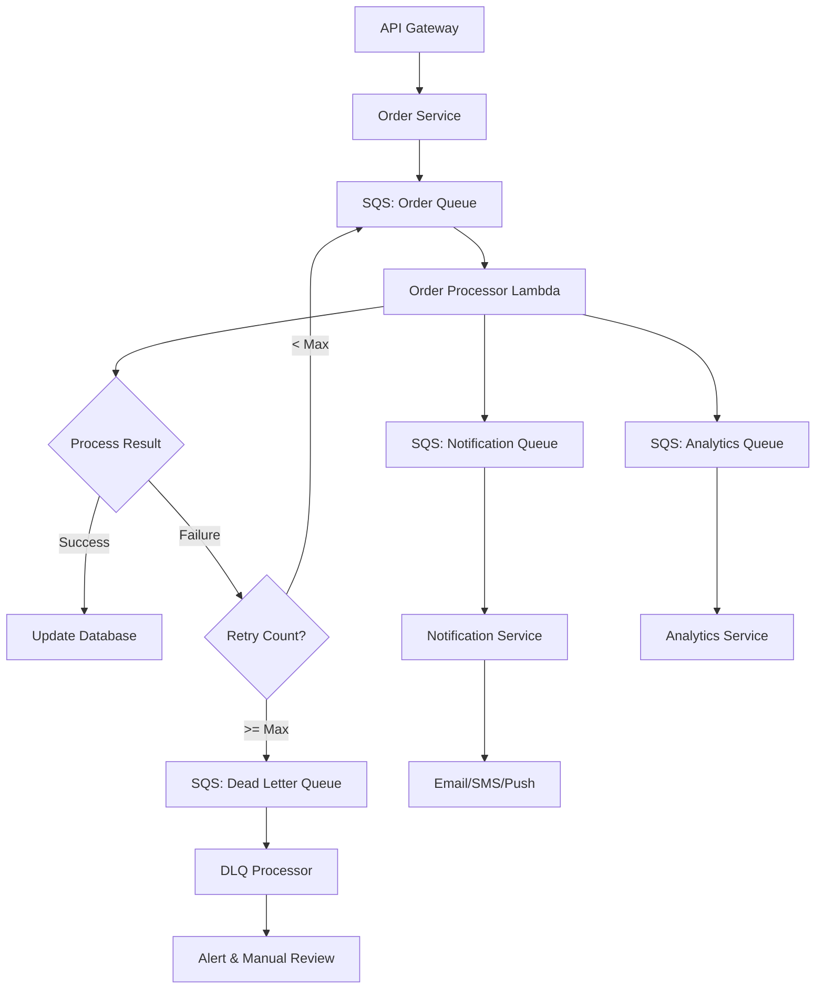
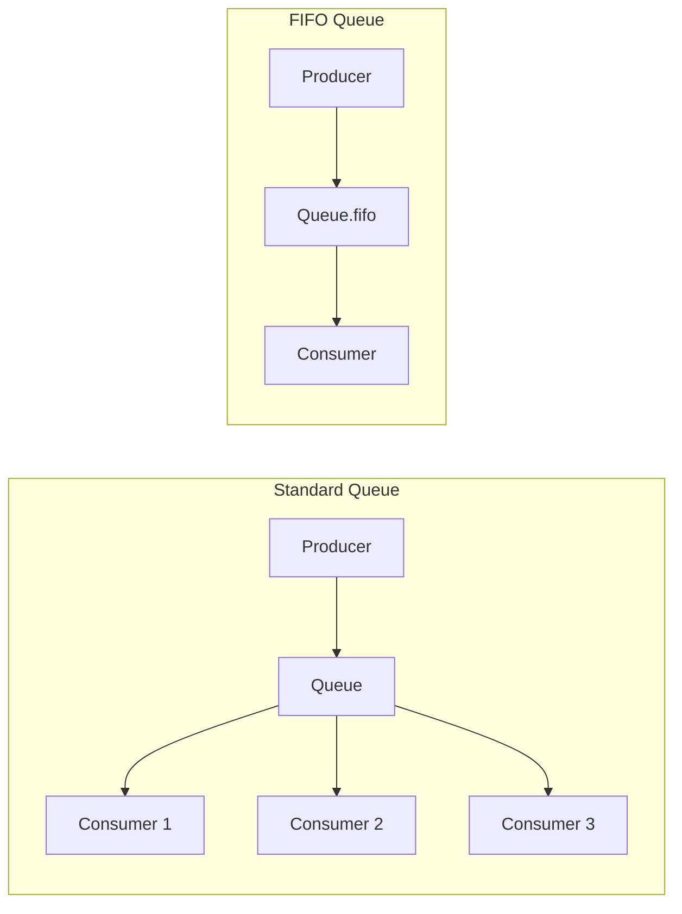
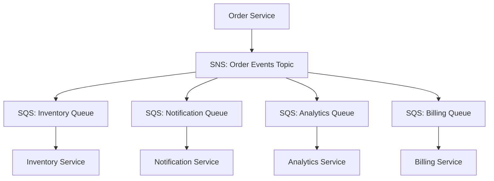

# How to Use SQS for Event-Driven Architecture

Author: [nawazdhandala](https://github.com/nawazdhandala)

Tags: AWS, SQS, Event-Driven Architecture, Microservices, Message Queue, Serverless, Node.js, Python

Description: Learn how to build event-driven architectures using Amazon SQS. Covers queue types, message patterns, Lambda integration, error handling with DLQs, and production best practices for scalable distributed systems.

---

Amazon Simple Queue Service (SQS) provides a fully managed message queuing service that enables decoupling and scaling of microservices, distributed systems, and serverless applications. By adopting event-driven architecture with SQS, you can build systems that are more resilient, scalable, and easier to maintain than traditional synchronous architectures.

## Why Event-Driven Architecture with SQS?

| Challenge | Synchronous Approach | Event-Driven with SQS |
|-----------|---------------------|----------------------|
| Service coupling | Direct dependencies between services | Loose coupling via message queues |
| Failure handling | Cascading failures across services | Isolated failures, automatic retries |
| Scalability | Bottlenecked by slowest service | Independent scaling per service |
| Peak traffic | Requires over-provisioning | Natural load leveling via queues |
| Deployment | Coordinated deployments needed | Independent service updates |

## SQS Architecture Overview

The following diagram illustrates a typical event-driven architecture using SQS as the message broker between producers and consumers.



## Standard vs FIFO Queues

SQS offers two queue types, each suited for different use cases.



| Feature | Standard Queue | FIFO Queue |
|---------|---------------|------------|
| Throughput | Nearly unlimited | 300 msg/sec (3000 with batching) |
| Ordering | Best-effort | Strict ordering per message group |
| Delivery | At-least-once (possible duplicates) | Exactly-once processing |
| Use case | High throughput, order not critical | Financial transactions, sequencing |

## Setting Up SQS Queues with AWS SDK

The following Node.js code demonstrates creating both standard and FIFO queues with appropriate configurations for production use.

```javascript
const { SQSClient, CreateQueueCommand, GetQueueUrlCommand } = require('@aws-sdk/client-sqs');

// Initialize SQS client with region configuration
const sqsClient = new SQSClient({
  region: process.env.AWS_REGION || 'us-east-1',
});

// Create a standard queue with visibility timeout and DLQ configuration
async function createStandardQueue(queueName, dlqArn) {
  const params = {
    QueueName: queueName,
    Attributes: {
      // Time a message is hidden after being received (seconds)
      VisibilityTimeout: '300',

      // How long messages are retained (seconds) - 14 days max
      MessageRetentionPeriod: '1209600',

      // Long polling wait time (seconds) - reduces empty responses
      ReceiveMessageWaitTimeSeconds: '20',

      // Dead Letter Queue configuration
      RedrivePolicy: JSON.stringify({
        deadLetterTargetArn: dlqArn,
        maxReceiveCount: 3,  // Send to DLQ after 3 failed processing attempts
      }),
    },
  };

  try {
    const command = new CreateQueueCommand(params);
    const response = await sqsClient.send(command);
    console.log(`Queue created: ${response.QueueUrl}`);
    return response.QueueUrl;
  } catch (error) {
    console.error('Error creating queue:', error);
    throw error;
  }
}

// Create a FIFO queue for ordered message processing
async function createFIFOQueue(queueName, dlqArn) {
  // FIFO queue names must end with .fifo
  const fifoQueueName = queueName.endsWith('.fifo') ? queueName : `${queueName}.fifo`;

  const params = {
    QueueName: fifoQueueName,
    Attributes: {
      // Enable FIFO queue type
      FifoQueue: 'true',

      // Enable content-based deduplication using message body hash
      ContentBasedDeduplication: 'true',

      // Visibility timeout should match your processing time
      VisibilityTimeout: '300',

      MessageRetentionPeriod: '1209600',

      // DLQ for FIFO must also be FIFO
      RedrivePolicy: JSON.stringify({
        deadLetterTargetArn: dlqArn,
        maxReceiveCount: 3,
      }),

      // Enable high throughput mode for FIFO (3000 msg/sec with batching)
      DeduplicationScope: 'messageGroup',
      FifoThroughputLimit: 'perMessageGroupId',
    },
  };

  try {
    const command = new CreateQueueCommand(params);
    const response = await sqsClient.send(command);
    console.log(`FIFO Queue created: ${response.QueueUrl}`);
    return response.QueueUrl;
  } catch (error) {
    console.error('Error creating FIFO queue:', error);
    throw error;
  }
}

// Create a Dead Letter Queue for failed message handling
async function createDeadLetterQueue(baseName, isFifo = false) {
  const dlqName = isFifo ? `${baseName}-dlq.fifo` : `${baseName}-dlq`;

  const params = {
    QueueName: dlqName,
    Attributes: {
      // Longer retention for DLQ to allow investigation
      MessageRetentionPeriod: '1209600',  // 14 days
      VisibilityTimeout: '300',
    },
  };

  // Add FIFO attributes if needed
  if (isFifo) {
    params.Attributes.FifoQueue = 'true';
    params.Attributes.ContentBasedDeduplication = 'true';
  }

  try {
    const command = new CreateQueueCommand(params);
    const response = await sqsClient.send(command);
    console.log(`DLQ created: ${response.QueueUrl}`);
    return response.QueueUrl;
  } catch (error) {
    console.error('Error creating DLQ:', error);
    throw error;
  }
}
```

## Sending Messages to SQS

The following code shows how to send individual messages and batches to both standard and FIFO queues with proper error handling.

```javascript
const {
  SQSClient,
  SendMessageCommand,
  SendMessageBatchCommand,
} = require('@aws-sdk/client-sqs');
const { v4: uuidv4 } = require('uuid');

const sqsClient = new SQSClient({ region: process.env.AWS_REGION || 'us-east-1' });

// Send a single message to a standard queue
async function sendMessage(queueUrl, messageBody, attributes = {}) {
  const params = {
    QueueUrl: queueUrl,
    MessageBody: JSON.stringify(messageBody),

    // Optional: Add message attributes for filtering and routing
    MessageAttributes: {
      EventType: {
        DataType: 'String',
        StringValue: attributes.eventType || 'default',
      },
      Priority: {
        DataType: 'Number',
        StringValue: String(attributes.priority || 1),
      },
      Source: {
        DataType: 'String',
        StringValue: attributes.source || 'api',
      },
    },

    // Optional: Delay delivery of the message (0-900 seconds)
    DelaySeconds: attributes.delaySeconds || 0,
  };

  try {
    const command = new SendMessageCommand(params);
    const response = await sqsClient.send(command);

    console.log(`Message sent - ID: ${response.MessageId}`);
    return response;
  } catch (error) {
    console.error('Error sending message:', error);
    throw error;
  }
}

// Send a message to a FIFO queue with ordering guarantees
async function sendFIFOMessage(queueUrl, messageBody, messageGroupId, deduplicationId = null) {
  const params = {
    QueueUrl: queueUrl,
    MessageBody: JSON.stringify(messageBody),

    // MessageGroupId ensures messages in the same group are processed in order
    MessageGroupId: messageGroupId,

    // Deduplication ID prevents duplicate messages within 5-minute window
    // If not provided and ContentBasedDeduplication is enabled, body hash is used
    MessageDeduplicationId: deduplicationId || uuidv4(),

    MessageAttributes: {
      EventType: {
        DataType: 'String',
        StringValue: messageBody.eventType || 'default',
      },
    },
  };

  try {
    const command = new SendMessageCommand(params);
    const response = await sqsClient.send(command);

    console.log(`FIFO Message sent - ID: ${response.MessageId}, Sequence: ${response.SequenceNumber}`);
    return response;
  } catch (error) {
    console.error('Error sending FIFO message:', error);
    throw error;
  }
}

// Send messages in batches for better throughput (up to 10 messages per batch)
async function sendMessageBatch(queueUrl, messages, isFifo = false) {
  // SQS allows maximum 10 messages per batch
  const batchSize = 10;
  const results = [];

  for (let i = 0; i < messages.length; i += batchSize) {
    const batch = messages.slice(i, i + batchSize);

    const entries = batch.map((msg, index) => {
      const entry = {
        Id: `msg-${i + index}`,  // Unique ID within batch
        MessageBody: JSON.stringify(msg.body),
        MessageAttributes: {
          EventType: {
            DataType: 'String',
            StringValue: msg.eventType || 'default',
          },
        },
      };

      // Add FIFO-specific attributes
      if (isFifo) {
        entry.MessageGroupId = msg.groupId || 'default';
        entry.MessageDeduplicationId = msg.deduplicationId || uuidv4();
      }

      return entry;
    });

    const params = {
      QueueUrl: queueUrl,
      Entries: entries,
    };

    try {
      const command = new SendMessageBatchCommand(params);
      const response = await sqsClient.send(command);

      // Log successful sends
      response.Successful?.forEach(success => {
        console.log(`Batch message sent - ID: ${success.MessageId}`);
      });

      // Handle failed messages in the batch
      if (response.Failed?.length > 0) {
        console.error('Some messages failed:', response.Failed);
        // Implement retry logic for failed messages
      }

      results.push(response);
    } catch (error) {
      console.error('Error sending batch:', error);
      throw error;
    }
  }

  return results;
}

// Example: Publishing an order event
async function publishOrderEvent(queueUrl, order) {
  const event = {
    eventType: 'ORDER_CREATED',
    timestamp: new Date().toISOString(),
    version: '1.0',
    data: {
      orderId: order.id,
      customerId: order.customerId,
      items: order.items,
      totalAmount: order.totalAmount,
      status: 'pending',
    },
  };

  return sendMessage(queueUrl, event, {
    eventType: 'ORDER_CREATED',
    priority: order.isPriority ? 10 : 1,
    source: 'order-service',
  });
}
```

## Consuming Messages from SQS

The following consumer implementation demonstrates long polling, visibility timeout management, and proper message deletion after successful processing.

```javascript
const {
  SQSClient,
  ReceiveMessageCommand,
  DeleteMessageCommand,
  ChangeMessageVisibilityCommand,
} = require('@aws-sdk/client-sqs');

const sqsClient = new SQSClient({ region: process.env.AWS_REGION || 'us-east-1' });

// Consumer configuration
const CONSUMER_CONFIG = {
  maxMessages: 10,           // Maximum messages to receive per poll (1-10)
  waitTimeSeconds: 20,       // Long polling duration (0-20 seconds)
  visibilityTimeout: 300,    // Time to process before message becomes visible again
  pollIntervalMs: 1000,      // Interval between polls when queue is empty
};

// Process messages from the queue continuously
async function startConsumer(queueUrl, messageHandler) {
  console.log(`Starting consumer for queue: ${queueUrl}`);
  let isRunning = true;

  // Graceful shutdown handler
  process.on('SIGTERM', () => {
    console.log('Received SIGTERM, stopping consumer...');
    isRunning = false;
  });

  process.on('SIGINT', () => {
    console.log('Received SIGINT, stopping consumer...');
    isRunning = false;
  });

  while (isRunning) {
    try {
      const messages = await receiveMessages(queueUrl);

      if (messages.length > 0) {
        console.log(`Received ${messages.length} messages`);

        // Process messages concurrently
        await Promise.all(
          messages.map(message => processMessage(queueUrl, message, messageHandler))
        );
      }
    } catch (error) {
      console.error('Error in consumer loop:', error);
      // Wait before retrying to avoid tight error loops
      await sleep(CONSUMER_CONFIG.pollIntervalMs);
    }
  }

  console.log('Consumer stopped');
}

// Receive messages from the queue using long polling
async function receiveMessages(queueUrl) {
  const params = {
    QueueUrl: queueUrl,
    MaxNumberOfMessages: CONSUMER_CONFIG.maxMessages,
    WaitTimeSeconds: CONSUMER_CONFIG.waitTimeSeconds,
    VisibilityTimeout: CONSUMER_CONFIG.visibilityTimeout,

    // Request all message attributes
    MessageAttributeNames: ['All'],

    // Request system attributes for debugging
    AttributeNames: ['All'],
  };

  try {
    const command = new ReceiveMessageCommand(params);
    const response = await sqsClient.send(command);
    return response.Messages || [];
  } catch (error) {
    console.error('Error receiving messages:', error);
    throw error;
  }
}

// Process a single message with error handling
async function processMessage(queueUrl, message, handler) {
  const startTime = Date.now();

  try {
    // Parse message body
    const body = JSON.parse(message.Body);

    // Extract message attributes for context
    const attributes = extractMessageAttributes(message);

    console.log(`Processing message ${message.MessageId} - Type: ${attributes.EventType}`);

    // Call the message handler
    await handler(body, attributes, message);

    // Delete message after successful processing
    await deleteMessage(queueUrl, message.ReceiptHandle);

    const duration = Date.now() - startTime;
    console.log(`Message ${message.MessageId} processed successfully in ${duration}ms`);

  } catch (error) {
    console.error(`Error processing message ${message.MessageId}:`, error);

    // Optionally extend visibility timeout if more processing time is needed
    // Or let the message become visible again for retry
    await handleProcessingError(queueUrl, message, error);
  }
}

// Extract message attributes into a simple object
function extractMessageAttributes(message) {
  const attributes = {};

  if (message.MessageAttributes) {
    Object.entries(message.MessageAttributes).forEach(([key, value]) => {
      if (value.DataType === 'Number') {
        attributes[key] = Number(value.StringValue);
      } else {
        attributes[key] = value.StringValue;
      }
    });
  }

  return attributes;
}

// Delete a message after successful processing
async function deleteMessage(queueUrl, receiptHandle) {
  const params = {
    QueueUrl: queueUrl,
    ReceiptHandle: receiptHandle,
  };

  try {
    const command = new DeleteMessageCommand(params);
    await sqsClient.send(command);
  } catch (error) {
    console.error('Error deleting message:', error);
    throw error;
  }
}

// Handle processing errors with visibility timeout management
async function handleProcessingError(queueUrl, message, error) {
  // Get approximate receive count from message attributes
  const receiveCount = parseInt(message.Attributes?.ApproximateReceiveCount || '1', 10);

  console.log(`Message ${message.MessageId} failed, receive count: ${receiveCount}`);

  // For transient errors, reduce visibility timeout for faster retry
  if (isTransientError(error) && receiveCount < 3) {
    await changeMessageVisibility(queueUrl, message.ReceiptHandle, 30);
    console.log('Reduced visibility timeout for faster retry');
  }

  // Message will automatically be retried or sent to DLQ based on queue configuration
}

// Extend or reduce message visibility timeout
async function changeMessageVisibility(queueUrl, receiptHandle, visibilityTimeout) {
  const params = {
    QueueUrl: queueUrl,
    ReceiptHandle: receiptHandle,
    VisibilityTimeout: visibilityTimeout,
  };

  try {
    const command = new ChangeMessageVisibilityCommand(params);
    await sqsClient.send(command);
  } catch (error) {
    console.error('Error changing message visibility:', error);
  }
}

// Check if an error is transient and worth retrying
function isTransientError(error) {
  const transientCodes = [
    'ECONNREFUSED',
    'ETIMEDOUT',
    'ENOTFOUND',
    'ServiceUnavailable',
    'ThrottlingException',
  ];

  return transientCodes.some(code =>
    error.code === code || error.message?.includes(code)
  );
}

function sleep(ms) {
  return new Promise(resolve => setTimeout(resolve, ms));
}

// Example message handler for order events
async function orderEventHandler(body, attributes, rawMessage) {
  const { eventType, data } = body;

  switch (eventType) {
    case 'ORDER_CREATED':
      await handleOrderCreated(data);
      break;
    case 'ORDER_UPDATED':
      await handleOrderUpdated(data);
      break;
    case 'ORDER_CANCELLED':
      await handleOrderCancelled(data);
      break;
    default:
      console.warn(`Unknown event type: ${eventType}`);
  }
}

async function handleOrderCreated(data) {
  console.log(`Processing new order: ${data.orderId}`);
  // Implement order processing logic
}

async function handleOrderUpdated(data) {
  console.log(`Updating order: ${data.orderId}`);
  // Implement order update logic
}

async function handleOrderCancelled(data) {
  console.log(`Cancelling order: ${data.orderId}`);
  // Implement order cancellation logic
}

// Start the consumer
// startConsumer(process.env.QUEUE_URL, orderEventHandler);
```

## Lambda Integration with SQS

AWS Lambda integrates natively with SQS as an event source. The following example shows a Lambda function configured to process SQS messages with batch handling.

```javascript
// Lambda handler for SQS events
exports.handler = async (event) => {
  console.log(`Received ${event.Records.length} messages`);

  // Track failed message IDs for partial batch response
  const failedMessageIds = [];

  // Process each message in the batch
  const processingPromises = event.Records.map(async (record) => {
    try {
      await processRecord(record);
    } catch (error) {
      console.error(`Failed to process message ${record.messageId}:`, error);
      failedMessageIds.push(record.messageId);
    }
  });

  await Promise.all(processingPromises);

  // Return partial batch failure response
  // Only failed messages will be retried, successful ones are deleted
  if (failedMessageIds.length > 0) {
    console.log(`${failedMessageIds.length} messages failed processing`);
    return {
      batchItemFailures: failedMessageIds.map(id => ({
        itemIdentifier: id,
      })),
    };
  }

  console.log('All messages processed successfully');
  return { batchItemFailures: [] };
};

// Process a single SQS record
async function processRecord(record) {
  // Parse the message body
  const body = JSON.parse(record.body);

  // Extract message attributes
  const eventType = record.messageAttributes?.EventType?.stringValue || 'unknown';
  const priority = parseInt(record.messageAttributes?.Priority?.stringValue || '1', 10);

  console.log(`Processing ${eventType} event with priority ${priority}`);

  // Get approximate receive count for retry tracking
  const receiveCount = parseInt(record.attributes.ApproximateReceiveCount, 10);

  if (receiveCount > 1) {
    console.log(`Retry attempt ${receiveCount} for message ${record.messageId}`);
  }

  // Process based on event type
  switch (body.eventType) {
    case 'ORDER_CREATED':
      await processOrderCreated(body.data);
      break;
    case 'PAYMENT_RECEIVED':
      await processPaymentReceived(body.data);
      break;
    case 'SHIPMENT_CREATED':
      await processShipmentCreated(body.data);
      break;
    default:
      console.warn(`Unknown event type: ${body.eventType}`);
  }
}

async function processOrderCreated(data) {
  // Validate order data
  if (!data.orderId || !data.customerId) {
    throw new Error('Invalid order data: missing required fields');
  }

  // Process the order
  console.log(`Processing order ${data.orderId} for customer ${data.customerId}`);

  // Simulate external service call
  await callExternalService(data);
}

async function processPaymentReceived(data) {
  console.log(`Processing payment for order ${data.orderId}`);
  // Payment processing logic
}

async function processShipmentCreated(data) {
  console.log(`Processing shipment for order ${data.orderId}`);
  // Shipment processing logic
}

async function callExternalService(data) {
  // Simulate external API call with potential failure
  const response = await fetch(process.env.ORDER_SERVICE_URL, {
    method: 'POST',
    headers: { 'Content-Type': 'application/json' },
    body: JSON.stringify(data),
  });

  if (!response.ok) {
    throw new Error(`External service error: ${response.status}`);
  }

  return response.json();
}
```

## Infrastructure as Code with Terraform

The following Terraform configuration creates a complete SQS setup with queues, DLQs, and Lambda integration.

```hcl
# Provider configuration
provider "aws" {
  region = var.aws_region
}

variable "aws_region" {
  default = "us-east-1"
}

variable "environment" {
  default = "production"
}

# Dead Letter Queue for failed messages
resource "aws_sqs_queue" "orders_dlq" {
  name = "orders-dlq-${var.environment}"

  # Extended retention for DLQ to allow investigation
  message_retention_seconds = 1209600  # 14 days

  # Tags for resource management
  tags = {
    Environment = var.environment
    Service     = "order-processing"
    Type        = "dlq"
  }
}

# Main orders queue with DLQ configuration
resource "aws_sqs_queue" "orders" {
  name = "orders-${var.environment}"

  # Visibility timeout should be at least 6x your Lambda timeout
  visibility_timeout_seconds = 300

  # Long polling reduces empty responses and costs
  receive_wait_time_seconds = 20

  # Message retention period
  message_retention_seconds = 345600  # 4 days

  # DLQ configuration
  redrive_policy = jsonencode({
    deadLetterTargetArn = aws_sqs_queue.orders_dlq.arn
    maxReceiveCount     = 3
  })

  tags = {
    Environment = var.environment
    Service     = "order-processing"
  }
}

# FIFO Queue for ordered processing
resource "aws_sqs_queue" "payments_fifo" {
  name                        = "payments-${var.environment}.fifo"
  fifo_queue                  = true
  content_based_deduplication = true
  deduplication_scope         = "messageGroup"
  fifo_throughput_limit       = "perMessageGroupId"

  visibility_timeout_seconds = 300
  receive_wait_time_seconds  = 20

  tags = {
    Environment = var.environment
    Service     = "payment-processing"
  }
}

# IAM role for Lambda to access SQS
resource "aws_iam_role" "lambda_sqs_role" {
  name = "lambda-sqs-role-${var.environment}"

  assume_role_policy = jsonencode({
    Version = "2012-10-17"
    Statement = [
      {
        Action = "sts:AssumeRole"
        Effect = "Allow"
        Principal = {
          Service = "lambda.amazonaws.com"
        }
      }
    ]
  })
}

# IAM policy for SQS access
resource "aws_iam_role_policy" "lambda_sqs_policy" {
  name = "lambda-sqs-policy-${var.environment}"
  role = aws_iam_role.lambda_sqs_role.id

  policy = jsonencode({
    Version = "2012-10-17"
    Statement = [
      {
        Effect = "Allow"
        Action = [
          "sqs:ReceiveMessage",
          "sqs:DeleteMessage",
          "sqs:GetQueueAttributes",
          "sqs:ChangeMessageVisibility"
        ]
        Resource = [
          aws_sqs_queue.orders.arn,
          aws_sqs_queue.orders_dlq.arn
        ]
      },
      {
        Effect = "Allow"
        Action = [
          "logs:CreateLogGroup",
          "logs:CreateLogStream",
          "logs:PutLogEvents"
        ]
        Resource = "arn:aws:logs:*:*:*"
      }
    ]
  })
}

# Lambda function for order processing
resource "aws_lambda_function" "order_processor" {
  filename         = "lambda.zip"
  function_name    = "order-processor-${var.environment}"
  role             = aws_iam_role.lambda_sqs_role.arn
  handler          = "index.handler"
  runtime          = "nodejs18.x"
  timeout          = 30
  memory_size      = 256

  environment {
    variables = {
      ENVIRONMENT = var.environment
      LOG_LEVEL   = "INFO"
    }
  }

  tags = {
    Environment = var.environment
    Service     = "order-processing"
  }
}

# SQS event source mapping for Lambda
resource "aws_lambda_event_source_mapping" "orders_to_lambda" {
  event_source_arn = aws_sqs_queue.orders.arn
  function_name    = aws_lambda_function.order_processor.arn

  # Batch configuration
  batch_size                         = 10
  maximum_batching_window_in_seconds = 5

  # Enable partial batch failure reporting
  function_response_types = ["ReportBatchItemFailures"]

  # Scaling configuration
  scaling_config {
    maximum_concurrency = 100
  }
}

# CloudWatch alarm for DLQ messages
resource "aws_cloudwatch_metric_alarm" "dlq_messages" {
  alarm_name          = "orders-dlq-messages-${var.environment}"
  comparison_operator = "GreaterThanThreshold"
  evaluation_periods  = 1
  metric_name         = "ApproximateNumberOfMessagesVisible"
  namespace           = "AWS/SQS"
  period              = 300
  statistic           = "Sum"
  threshold           = 10
  alarm_description   = "Alert when DLQ has more than 10 messages"

  dimensions = {
    QueueName = aws_sqs_queue.orders_dlq.name
  }

  alarm_actions = [aws_sns_topic.alerts.arn]
}

# SNS topic for alerts
resource "aws_sns_topic" "alerts" {
  name = "sqs-alerts-${var.environment}"
}

# Output queue URLs for application configuration
output "orders_queue_url" {
  value = aws_sqs_queue.orders.url
}

output "orders_dlq_url" {
  value = aws_sqs_queue.orders_dlq.url
}

output "payments_fifo_queue_url" {
  value = aws_sqs_queue.payments_fifo.url
}
```

## Python Implementation with Boto3

The following Python implementation demonstrates a robust SQS consumer with concurrent message processing.

```python
import json
import logging
import signal
import sys
from concurrent.futures import ThreadPoolExecutor, as_completed
from dataclasses import dataclass
from typing import Callable, Dict, Any, List, Optional
import boto3
from botocore.exceptions import ClientError

# Configure logging
logging.basicConfig(
    level=logging.INFO,
    format='%(asctime)s - %(name)s - %(levelname)s - %(message)s'
)
logger = logging.getLogger(__name__)


@dataclass
class ConsumerConfig:
    """Configuration for SQS consumer."""
    queue_url: str
    max_messages: int = 10
    wait_time_seconds: int = 20
    visibility_timeout: int = 300
    max_workers: int = 10
    region: str = 'us-east-1'


class SQSConsumer:
    """
    A robust SQS consumer with concurrent message processing,
    graceful shutdown, and error handling.
    """

    def __init__(self, config: ConsumerConfig, message_handler: Callable):
        self.config = config
        self.message_handler = message_handler
        self.running = False

        # Initialize SQS client
        self.sqs = boto3.client('sqs', region_name=config.region)

        # Thread pool for concurrent message processing
        self.executor = ThreadPoolExecutor(max_workers=config.max_workers)

        # Set up signal handlers for graceful shutdown
        signal.signal(signal.SIGTERM, self._signal_handler)
        signal.signal(signal.SIGINT, self._signal_handler)

    def _signal_handler(self, signum, frame):
        """Handle shutdown signals gracefully."""
        logger.info(f'Received signal {signum}, initiating graceful shutdown...')
        self.running = False

    def start(self):
        """Start the consumer loop."""
        logger.info(f'Starting consumer for queue: {self.config.queue_url}')
        self.running = True

        while self.running:
            try:
                messages = self._receive_messages()

                if messages:
                    logger.info(f'Received {len(messages)} messages')
                    self._process_messages_concurrently(messages)

            except ClientError as e:
                logger.error(f'AWS error in consumer loop: {e}')
                self._handle_aws_error(e)
            except Exception as e:
                logger.error(f'Unexpected error in consumer loop: {e}')

        # Shutdown thread pool
        self.executor.shutdown(wait=True)
        logger.info('Consumer stopped')

    def _receive_messages(self) -> List[Dict]:
        """Receive messages from SQS using long polling."""
        response = self.sqs.receive_message(
            QueueUrl=self.config.queue_url,
            MaxNumberOfMessages=self.config.max_messages,
            WaitTimeSeconds=self.config.wait_time_seconds,
            VisibilityTimeout=self.config.visibility_timeout,
            MessageAttributeNames=['All'],
            AttributeNames=['All']
        )
        return response.get('Messages', [])

    def _process_messages_concurrently(self, messages: List[Dict]):
        """Process messages concurrently using thread pool."""
        futures = {
            self.executor.submit(self._process_single_message, msg): msg
            for msg in messages
        }

        for future in as_completed(futures):
            message = futures[future]
            try:
                future.result()
            except Exception as e:
                logger.error(
                    f'Error processing message {message["MessageId"]}: {e}'
                )

    def _process_single_message(self, message: Dict):
        """Process a single message with error handling."""
        message_id = message['MessageId']
        receipt_handle = message['ReceiptHandle']
        receive_count = int(message['Attributes'].get('ApproximateReceiveCount', 1))

        logger.info(f'Processing message {message_id} (attempt {receive_count})')

        try:
            # Parse message body
            body = json.loads(message['Body'])

            # Extract message attributes
            attributes = self._extract_attributes(message)

            # Call the message handler
            self.message_handler(body, attributes)

            # Delete message after successful processing
            self._delete_message(receipt_handle)
            logger.info(f'Message {message_id} processed successfully')

        except json.JSONDecodeError as e:
            logger.error(f'Invalid JSON in message {message_id}: {e}')
            # Let message go to DLQ - invalid format is not retryable

        except ValidationError as e:
            logger.error(f'Validation error for message {message_id}: {e}')
            # Let message go to DLQ - validation errors are not retryable

        except TransientError as e:
            logger.warning(f'Transient error for message {message_id}: {e}')
            # Reduce visibility timeout for faster retry
            self._change_visibility(receipt_handle, 30)

        except Exception as e:
            logger.error(f'Unexpected error processing message {message_id}: {e}')
            raise

    def _extract_attributes(self, message: Dict) -> Dict[str, Any]:
        """Extract message attributes into a simple dictionary."""
        attributes = {}

        if 'MessageAttributes' in message:
            for key, value in message['MessageAttributes'].items():
                if value['DataType'] == 'Number':
                    attributes[key] = float(value['StringValue'])
                else:
                    attributes[key] = value['StringValue']

        return attributes

    def _delete_message(self, receipt_handle: str):
        """Delete a message from the queue."""
        self.sqs.delete_message(
            QueueUrl=self.config.queue_url,
            ReceiptHandle=receipt_handle
        )

    def _change_visibility(self, receipt_handle: str, timeout: int):
        """Change message visibility timeout."""
        try:
            self.sqs.change_message_visibility(
                QueueUrl=self.config.queue_url,
                ReceiptHandle=receipt_handle,
                VisibilityTimeout=timeout
            )
        except ClientError as e:
            logger.warning(f'Failed to change visibility: {e}')

    def _handle_aws_error(self, error: ClientError):
        """Handle AWS-specific errors."""
        error_code = error.response['Error']['Code']

        if error_code == 'AWS.SimpleQueueService.NonExistentQueue':
            logger.critical('Queue does not exist, stopping consumer')
            self.running = False
        elif error_code in ['RequestThrottled', 'ThrottlingException']:
            logger.warning('Request throttled, backing off...')
            import time
            time.sleep(5)


class ValidationError(Exception):
    """Raised when message validation fails."""
    pass


class TransientError(Exception):
    """Raised for transient errors that should be retried."""
    pass


# Example message handler
def order_handler(body: Dict, attributes: Dict):
    """Handle order events."""
    event_type = body.get('eventType')
    data = body.get('data', {})

    logger.info(f'Handling {event_type} event')

    if event_type == 'ORDER_CREATED':
        # Validate required fields
        if not data.get('orderId'):
            raise ValidationError('Missing orderId')

        # Process the order
        process_new_order(data)

    elif event_type == 'ORDER_UPDATED':
        update_order(data)

    elif event_type == 'ORDER_CANCELLED':
        cancel_order(data)

    else:
        logger.warning(f'Unknown event type: {event_type}')


def process_new_order(data: Dict):
    """Process a new order."""
    logger.info(f"Processing order {data['orderId']}")
    # Add business logic here


def update_order(data: Dict):
    """Update an existing order."""
    logger.info(f"Updating order {data.get('orderId')}")
    # Add business logic here


def cancel_order(data: Dict):
    """Cancel an order."""
    logger.info(f"Cancelling order {data.get('orderId')}")
    # Add business logic here


if __name__ == '__main__':
    import os

    config = ConsumerConfig(
        queue_url=os.environ.get('QUEUE_URL'),
        max_workers=5,
        region=os.environ.get('AWS_REGION', 'us-east-1')
    )

    consumer = SQSConsumer(config, order_handler)
    consumer.start()
```

## Event Fan-Out Pattern with SNS and SQS

For scenarios where multiple services need to react to the same event, combine SNS with SQS for event fan-out.



The following code demonstrates setting up SNS-SQS fan-out.

```javascript
const {
  SNSClient,
  CreateTopicCommand,
  SubscribeCommand,
  PublishCommand,
} = require('@aws-sdk/client-sns');
const {
  SQSClient,
  CreateQueueCommand,
  GetQueueAttributesCommand,
  SetQueueAttributesCommand,
} = require('@aws-sdk/client-sqs');

const snsClient = new SNSClient({ region: process.env.AWS_REGION || 'us-east-1' });
const sqsClient = new SQSClient({ region: process.env.AWS_REGION || 'us-east-1' });

// Create an SNS topic for order events
async function createOrderEventsTopic() {
  const command = new CreateTopicCommand({
    Name: 'order-events',
    Attributes: {
      DisplayName: 'Order Events',
    },
  });

  const response = await snsClient.send(command);
  console.log(`Topic created: ${response.TopicArn}`);
  return response.TopicArn;
}

// Subscribe an SQS queue to the SNS topic
async function subscribeQueueToTopic(topicArn, queueArn, queueUrl) {
  // First, set the queue policy to allow SNS to send messages
  await setQueuePolicyForSNS(queueUrl, topicArn, queueArn);

  // Subscribe the queue to the topic
  const command = new SubscribeCommand({
    TopicArn: topicArn,
    Protocol: 'sqs',
    Endpoint: queueArn,
    Attributes: {
      // Enable raw message delivery to skip SNS envelope
      RawMessageDelivery: 'true',
    },
  });

  const response = await snsClient.send(command);
  console.log(`Queue subscribed: ${response.SubscriptionArn}`);
  return response.SubscriptionArn;
}

// Set queue policy to allow SNS topic to send messages
async function setQueuePolicyForSNS(queueUrl, topicArn, queueArn) {
  const policy = {
    Version: '2012-10-17',
    Statement: [
      {
        Sid: 'AllowSNSMessages',
        Effect: 'Allow',
        Principal: {
          Service: 'sns.amazonaws.com',
        },
        Action: 'sqs:SendMessage',
        Resource: queueArn,
        Condition: {
          ArnEquals: {
            'aws:SourceArn': topicArn,
          },
        },
      },
    ],
  };

  const command = new SetQueueAttributesCommand({
    QueueUrl: queueUrl,
    Attributes: {
      Policy: JSON.stringify(policy),
    },
  });

  await sqsClient.send(command);
  console.log('Queue policy updated for SNS access');
}

// Publish an event to the SNS topic
async function publishOrderEvent(topicArn, event) {
  const command = new PublishCommand({
    TopicArn: topicArn,
    Message: JSON.stringify(event),
    MessageAttributes: {
      eventType: {
        DataType: 'String',
        StringValue: event.eventType,
      },
      orderId: {
        DataType: 'String',
        StringValue: event.data.orderId,
      },
    },
  });

  const response = await snsClient.send(command);
  console.log(`Event published: ${response.MessageId}`);
  return response.MessageId;
}

// Example: Set up complete fan-out architecture
async function setupFanOutArchitecture() {
  // Create SNS topic
  const topicArn = await createOrderEventsTopic();

  // Create subscriber queues
  const queues = [
    { name: 'inventory-queue', purpose: 'inventory updates' },
    { name: 'notification-queue', purpose: 'customer notifications' },
    { name: 'analytics-queue', purpose: 'analytics processing' },
    { name: 'billing-queue', purpose: 'billing operations' },
  ];

  for (const queue of queues) {
    // Create queue
    const createQueueCommand = new CreateQueueCommand({
      QueueName: queue.name,
      Attributes: {
        VisibilityTimeout: '300',
        ReceiveMessageWaitTimeSeconds: '20',
      },
    });

    const createResponse = await sqsClient.send(createQueueCommand);
    const queueUrl = createResponse.QueueUrl;

    // Get queue ARN
    const getAttrsCommand = new GetQueueAttributesCommand({
      QueueUrl: queueUrl,
      AttributeNames: ['QueueArn'],
    });

    const attrsResponse = await sqsClient.send(getAttrsCommand);
    const queueArn = attrsResponse.Attributes.QueueArn;

    // Subscribe queue to topic
    await subscribeQueueToTopic(topicArn, queueArn, queueUrl);

    console.log(`${queue.name} configured for ${queue.purpose}`);
  }

  return topicArn;
}
```

## Monitoring and Observability

Monitor SQS queues to ensure healthy message processing and catch issues early.

```javascript
const {
  CloudWatchClient,
  PutMetricAlarmCommand,
  GetMetricStatisticsCommand,
} = require('@aws-sdk/client-cloudwatch');
const { SQSClient, GetQueueAttributesCommand } = require('@aws-sdk/client-sqs');

const cloudwatchClient = new CloudWatchClient({ region: process.env.AWS_REGION || 'us-east-1' });
const sqsClient = new SQSClient({ region: process.env.AWS_REGION || 'us-east-1' });

// Get current queue metrics
async function getQueueMetrics(queueUrl) {
  const command = new GetQueueAttributesCommand({
    QueueUrl: queueUrl,
    AttributeNames: [
      'ApproximateNumberOfMessages',           // Messages available
      'ApproximateNumberOfMessagesNotVisible', // Messages being processed
      'ApproximateNumberOfMessagesDelayed',    // Delayed messages
    ],
  });

  const response = await sqsClient.send(command);
  const attrs = response.Attributes;

  return {
    messagesAvailable: parseInt(attrs.ApproximateNumberOfMessages, 10),
    messagesInFlight: parseInt(attrs.ApproximateNumberOfMessagesNotVisible, 10),
    messagesDelayed: parseInt(attrs.ApproximateNumberOfMessagesDelayed, 10),
    totalMessages: parseInt(attrs.ApproximateNumberOfMessages, 10) +
                   parseInt(attrs.ApproximateNumberOfMessagesNotVisible, 10) +
                   parseInt(attrs.ApproximateNumberOfMessagesDelayed, 10),
  };
}

// Create CloudWatch alarm for queue depth
async function createQueueDepthAlarm(queueName, threshold, snsTopicArn) {
  const command = new PutMetricAlarmCommand({
    AlarmName: `${queueName}-depth-alarm`,
    AlarmDescription: `Alert when ${queueName} has more than ${threshold} messages`,
    MetricName: 'ApproximateNumberOfMessagesVisible',
    Namespace: 'AWS/SQS',
    Dimensions: [
      {
        Name: 'QueueName',
        Value: queueName,
      },
    ],
    Statistic: 'Average',
    Period: 300,  // 5 minutes
    EvaluationPeriods: 2,
    Threshold: threshold,
    ComparisonOperator: 'GreaterThanThreshold',
    AlarmActions: [snsTopicArn],
    OKActions: [snsTopicArn],
  });

  await cloudwatchClient.send(command);
  console.log(`Alarm created for ${queueName}`);
}

// Create alarm for message age (oldest message)
async function createMessageAgeAlarm(queueName, maxAgeSeconds, snsTopicArn) {
  const command = new PutMetricAlarmCommand({
    AlarmName: `${queueName}-message-age-alarm`,
    AlarmDescription: `Alert when oldest message in ${queueName} exceeds ${maxAgeSeconds} seconds`,
    MetricName: 'ApproximateAgeOfOldestMessage',
    Namespace: 'AWS/SQS',
    Dimensions: [
      {
        Name: 'QueueName',
        Value: queueName,
      },
    ],
    Statistic: 'Maximum',
    Period: 300,
    EvaluationPeriods: 2,
    Threshold: maxAgeSeconds,
    ComparisonOperator: 'GreaterThanThreshold',
    AlarmActions: [snsTopicArn],
  });

  await cloudwatchClient.send(command);
  console.log(`Message age alarm created for ${queueName}`);
}

// Get historical queue metrics from CloudWatch
async function getHistoricalMetrics(queueName, metricName, startTime, endTime) {
  const command = new GetMetricStatisticsCommand({
    Namespace: 'AWS/SQS',
    MetricName: metricName,
    Dimensions: [
      {
        Name: 'QueueName',
        Value: queueName,
      },
    ],
    StartTime: startTime,
    EndTime: endTime,
    Period: 300,  // 5 minute intervals
    Statistics: ['Average', 'Maximum', 'Minimum', 'Sum'],
  });

  const response = await cloudwatchClient.send(command);
  return response.Datapoints;
}

// Monitor queue health and log metrics
async function monitorQueueHealth(queueUrl, queueName) {
  const metrics = await getQueueMetrics(queueUrl);

  console.log(`Queue Health - ${queueName}`);
  console.log(`  Messages Available: ${metrics.messagesAvailable}`);
  console.log(`  Messages In Flight: ${metrics.messagesInFlight}`);
  console.log(`  Messages Delayed: ${metrics.messagesDelayed}`);
  console.log(`  Total Messages: ${metrics.totalMessages}`);

  // Check for concerning patterns
  if (metrics.messagesAvailable > 1000) {
    console.warn(`WARNING: High message backlog (${metrics.messagesAvailable})`);
  }

  if (metrics.messagesInFlight === 0 && metrics.messagesAvailable > 0) {
    console.warn('WARNING: Messages available but none being processed');
  }

  return metrics;
}
```

## Best Practices Summary

| Practice | Description |
|----------|-------------|
| **Use long polling** | Set ReceiveMessageWaitTimeSeconds to 20 to reduce empty responses and costs |
| **Configure visibility timeout** | Set at least 6x your expected processing time to prevent duplicate processing |
| **Implement DLQs** | Always configure dead-letter queues to capture failed messages |
| **Use batch operations** | Send and receive messages in batches for better throughput |
| **Enable partial batch failures** | For Lambda, return failed message IDs instead of failing entire batch |
| **Monitor queue depth** | Set alarms on message count and age to catch processing issues |
| **Use FIFO for ordering** | Choose FIFO queues when message order or exactly-once processing matters |
| **Design idempotent handlers** | Standard queues may deliver messages more than once |
| **Implement graceful shutdown** | Handle SIGTERM signals to complete in-flight messages |
| **Use message attributes** | Add metadata for filtering, routing, and debugging |

## Summary

Amazon SQS provides a robust foundation for building event-driven architectures. By decoupling services through message queues, you gain resilience against failures, natural load leveling, and the ability to scale services independently. Key patterns include using standard queues for high throughput scenarios, FIFO queues for ordered processing, DLQs for error handling, and SNS-SQS fan-out for distributing events to multiple consumers. Proper monitoring and alerting ensure you catch issues before they impact your users.
