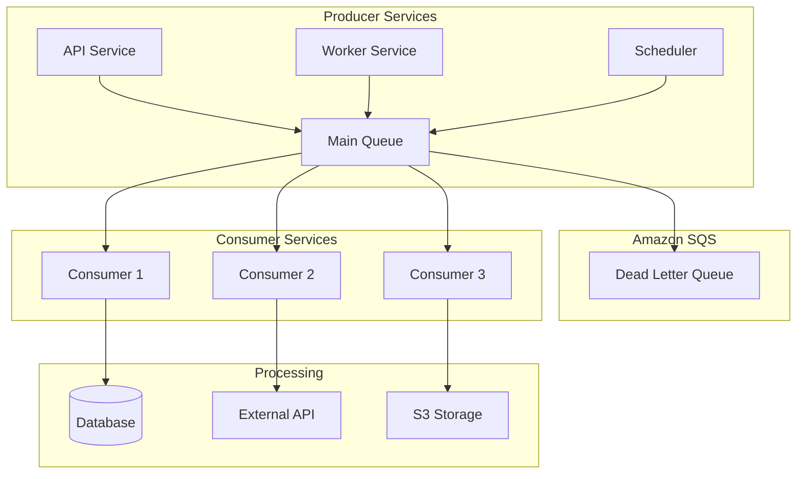
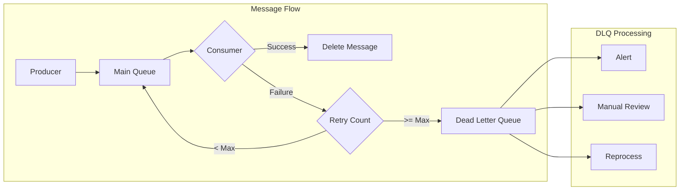
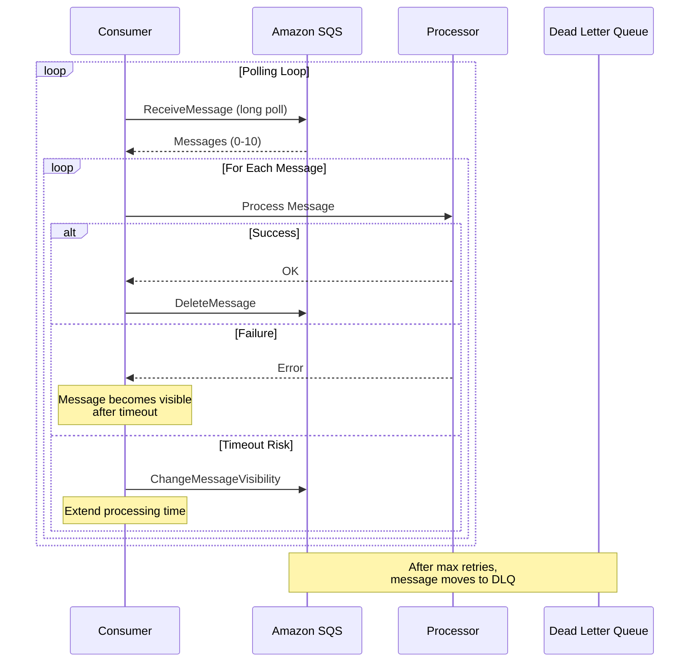

# How to Use SQS with Go

Author: [nawazdhandala](https://github.com/nawazdhandala)

Tags: AWS, SQS, Go, Golang, Message Queue, Distributed Systems, Cloud, Microservices

Description: Learn how to integrate Amazon SQS with Go applications for reliable message processing. Covers queue operations, message handling, batch processing, dead-letter queues, FIFO queues, and production best practices.

---

Amazon Simple Queue Service (SQS) is a fully managed message queuing service that enables decoupling of microservices and distributed systems. Go, with its excellent concurrency primitives and low latency, makes an ideal choice for building high-throughput message processing applications with SQS.

## Architecture Overview

The following diagram illustrates a typical architecture using SQS for asynchronous message processing.



## Setting Up the Project

### Prerequisites

Before starting, ensure you have Go 1.21 or later installed. You will need AWS credentials configured either through environment variables, an IAM role, or the AWS credentials file.

Install the AWS SDK for Go v2 using Go modules.

```bash
go mod init myapp
go get github.com/aws/aws-sdk-go-v2
go get github.com/aws/aws-sdk-go-v2/config
go get github.com/aws/aws-sdk-go-v2/service/sqs
```

### AWS Configuration

Create a configuration module that initializes the AWS SDK with proper credentials and region settings.

```go
package awsconfig

import (
    "context"
    "fmt"
    "os"

    "github.com/aws/aws-sdk-go-v2/config"
    "github.com/aws/aws-sdk-go-v2/credentials"
    "github.com/aws/aws-sdk-go-v2/service/sqs"
)

// Config holds AWS configuration parameters
type Config struct {
    Region          string
    AccessKeyID     string
    SecretAccessKey string
    Endpoint        string // Optional: for LocalStack or custom endpoints
}

// LoadFromEnv creates a Config from environment variables
// Environment variables take precedence over default credentials chain
func LoadFromEnv() *Config {
    return &Config{
        Region:          getEnv("AWS_REGION", "us-east-1"),
        AccessKeyID:     os.Getenv("AWS_ACCESS_KEY_ID"),
        SecretAccessKey: os.Getenv("AWS_SECRET_ACCESS_KEY"),
        Endpoint:        os.Getenv("AWS_ENDPOINT"), // For local development
    }
}

// getEnv retrieves an environment variable with a fallback default
func getEnv(key, defaultValue string) string {
    if value := os.Getenv(key); value != "" {
        return value
    }
    return defaultValue
}

// NewSQSClient creates a new SQS client with the given configuration
// The client automatically handles retries and credential refresh
func NewSQSClient(ctx context.Context, cfg *Config) (*sqs.Client, error) {
    var opts []func(*config.LoadOptions) error

    // Set the AWS region
    opts = append(opts, config.WithRegion(cfg.Region))

    // Use explicit credentials if provided
    if cfg.AccessKeyID != "" && cfg.SecretAccessKey != "" {
        opts = append(opts, config.WithCredentialsProvider(
            credentials.NewStaticCredentialsProvider(
                cfg.AccessKeyID,
                cfg.SecretAccessKey,
                "", // Session token, empty for IAM users
            ),
        ))
    }

    // Load the AWS configuration
    awsCfg, err := config.LoadDefaultConfig(ctx, opts...)
    if err != nil {
        return nil, fmt.Errorf("loading AWS config: %w", err)
    }

    // Create SQS client options
    var sqsOpts []func(*sqs.Options)

    // Use custom endpoint for LocalStack or testing
    if cfg.Endpoint != "" {
        sqsOpts = append(sqsOpts, func(o *sqs.Options) {
            o.BaseEndpoint = &cfg.Endpoint
        })
    }

    return sqs.NewFromConfig(awsCfg, sqsOpts...), nil
}
```

## Queue Operations

### Creating and Managing Queues

SQS supports two types of queues: Standard queues for maximum throughput and FIFO queues for ordered, exactly-once processing.

```go
package queue

import (
    "context"
    "fmt"
    "strconv"

    "github.com/aws/aws-sdk-go-v2/aws"
    "github.com/aws/aws-sdk-go-v2/service/sqs"
    "github.com/aws/aws-sdk-go-v2/service/sqs/types"
)

// QueueManager handles SQS queue operations
type QueueManager struct {
    client *sqs.Client
}

// NewQueueManager creates a new QueueManager instance
func NewQueueManager(client *sqs.Client) *QueueManager {
    return &QueueManager{client: client}
}

// CreateStandardQueue creates a new standard SQS queue with specified settings
// Standard queues offer maximum throughput with at-least-once delivery
func (m *QueueManager) CreateStandardQueue(
    ctx context.Context,
    name string,
    visibilityTimeout int,
    messageRetention int,
) (string, error) {
    input := &sqs.CreateQueueInput{
        QueueName: aws.String(name),
        Attributes: map[string]string{
            // Time in seconds that a message is hidden after being received
            "VisibilityTimeout": strconv.Itoa(visibilityTimeout),
            // Time in seconds to retain messages (default 4 days, max 14 days)
            "MessageRetentionPeriod": strconv.Itoa(messageRetention),
            // Enable long polling to reduce empty responses
            "ReceiveMessageWaitTimeSeconds": "20",
        },
    }

    result, err := m.client.CreateQueue(ctx, input)
    if err != nil {
        return "", fmt.Errorf("creating standard queue: %w", err)
    }

    return *result.QueueUrl, nil
}

// CreateFIFOQueue creates a FIFO queue for ordered, exactly-once processing
// FIFO queues guarantee message ordering and deduplication
func (m *QueueManager) CreateFIFOQueue(
    ctx context.Context,
    name string,
    contentBasedDedup bool,
) (string, error) {
    // FIFO queue names must end with .fifo
    fifoName := name + ".fifo"

    attributes := map[string]string{
        "FifoQueue":                 "true",
        "VisibilityTimeout":         "30",
        "ReceiveMessageWaitTimeSeconds": "20",
    }

    // Content-based deduplication uses message body hash
    if contentBasedDedup {
        attributes["ContentBasedDeduplication"] = "true"
    }

    input := &sqs.CreateQueueInput{
        QueueName:  aws.String(fifoName),
        Attributes: attributes,
    }

    result, err := m.client.CreateQueue(ctx, input)
    if err != nil {
        return "", fmt.Errorf("creating FIFO queue: %w", err)
    }

    return *result.QueueUrl, nil
}

// GetQueueURL retrieves the URL for an existing queue by name
func (m *QueueManager) GetQueueURL(ctx context.Context, name string) (string, error) {
    input := &sqs.GetQueueUrlInput{
        QueueName: aws.String(name),
    }

    result, err := m.client.GetQueueUrl(ctx, input)
    if err != nil {
        return "", fmt.Errorf("getting queue URL: %w", err)
    }

    return *result.QueueUrl, nil
}

// DeleteQueue removes a queue and all its messages permanently
func (m *QueueManager) DeleteQueue(ctx context.Context, queueURL string) error {
    input := &sqs.DeleteQueueInput{
        QueueUrl: aws.String(queueURL),
    }

    _, err := m.client.DeleteQueue(ctx, input)
    if err != nil {
        return fmt.Errorf("deleting queue: %w", err)
    }

    return nil
}

// PurgeQueue deletes all messages in a queue without deleting the queue
func (m *QueueManager) PurgeQueue(ctx context.Context, queueURL string) error {
    input := &sqs.PurgeQueueInput{
        QueueUrl: aws.String(queueURL),
    }

    _, err := m.client.PurgeQueue(ctx, input)
    if err != nil {
        return fmt.Errorf("purging queue: %w", err)
    }

    return nil
}
```

### Setting Up Dead Letter Queues

Dead letter queues capture messages that fail processing after multiple attempts.



Configure a dead letter queue to handle failed messages.

```go
// ConfigureDeadLetterQueue sets up a DLQ for the main queue
// Messages are moved to DLQ after maxReceiveCount failed processing attempts
func (m *QueueManager) ConfigureDeadLetterQueue(
    ctx context.Context,
    mainQueueURL string,
    dlqARN string,
    maxReceiveCount int,
) error {
    // Create the redrive policy JSON
    redrivePolicy := fmt.Sprintf(
        `{"deadLetterTargetArn":"%s","maxReceiveCount":"%d"}`,
        dlqARN,
        maxReceiveCount,
    )

    input := &sqs.SetQueueAttributesInput{
        QueueUrl: aws.String(mainQueueURL),
        Attributes: map[string]string{
            "RedrivePolicy": redrivePolicy,
        },
    }

    _, err := m.client.SetQueueAttributes(ctx, input)
    if err != nil {
        return fmt.Errorf("configuring dead letter queue: %w", err)
    }

    return nil
}

// GetQueueARN retrieves the ARN for a queue given its URL
func (m *QueueManager) GetQueueARN(ctx context.Context, queueURL string) (string, error) {
    input := &sqs.GetQueueAttributesInput{
        QueueUrl:       aws.String(queueURL),
        AttributeNames: []types.QueueAttributeName{types.QueueAttributeNameQueueArn},
    }

    result, err := m.client.GetQueueAttributes(ctx, input)
    if err != nil {
        return "", fmt.Errorf("getting queue ARN: %w", err)
    }

    return result.Attributes["QueueArn"], nil
}
```

## Sending Messages

### Single Message Producer

Create a producer that sends individual messages with optional attributes and delay.

```go
package producer

import (
    "context"
    "encoding/json"
    "fmt"
    "time"

    "github.com/aws/aws-sdk-go-v2/aws"
    "github.com/aws/aws-sdk-go-v2/service/sqs"
    "github.com/aws/aws-sdk-go-v2/service/sqs/types"
    "github.com/google/uuid"
)

// Producer handles sending messages to SQS
type Producer struct {
    client   *sqs.Client
    queueURL string
}

// NewProducer creates a new Producer instance
func NewProducer(client *sqs.Client, queueURL string) *Producer {
    return &Producer{
        client:   client,
        queueURL: queueURL,
    }
}

// Message represents a message to be sent to SQS
type Message struct {
    ID        string                 `json:"id"`
    Type      string                 `json:"type"`
    Payload   map[string]interface{} `json:"payload"`
    Timestamp time.Time              `json:"timestamp"`
}

// SendMessage sends a single message to the queue
// Returns the message ID assigned by SQS
func (p *Producer) SendMessage(
    ctx context.Context,
    msg *Message,
    delaySeconds int32,
) (string, error) {
    // Assign a unique ID if not provided
    if msg.ID == "" {
        msg.ID = uuid.New().String()
    }
    msg.Timestamp = time.Now().UTC()

    // Serialize message to JSON
    body, err := json.Marshal(msg)
    if err != nil {
        return "", fmt.Errorf("marshaling message: %w", err)
    }

    input := &sqs.SendMessageInput{
        QueueUrl:     aws.String(p.queueURL),
        MessageBody:  aws.String(string(body)),
        DelaySeconds: delaySeconds,
        // Message attributes for filtering without parsing body
        MessageAttributes: map[string]types.MessageAttributeValue{
            "MessageType": {
                DataType:    aws.String("String"),
                StringValue: aws.String(msg.Type),
            },
            "CorrelationId": {
                DataType:    aws.String("String"),
                StringValue: aws.String(msg.ID),
            },
        },
    }

    result, err := p.client.SendMessage(ctx, input)
    if err != nil {
        return "", fmt.Errorf("sending message: %w", err)
    }

    return *result.MessageId, nil
}

// SendFIFOMessage sends a message to a FIFO queue with ordering guarantees
// MessageGroupId determines message ordering, DeduplicationId prevents duplicates
func (p *Producer) SendFIFOMessage(
    ctx context.Context,
    msg *Message,
    messageGroupID string,
    deduplicationID string,
) (string, error) {
    if msg.ID == "" {
        msg.ID = uuid.New().String()
    }
    msg.Timestamp = time.Now().UTC()

    body, err := json.Marshal(msg)
    if err != nil {
        return "", fmt.Errorf("marshaling message: %w", err)
    }

    // Use message ID as deduplication ID if not provided
    if deduplicationID == "" {
        deduplicationID = msg.ID
    }

    input := &sqs.SendMessageInput{
        QueueUrl:               aws.String(p.queueURL),
        MessageBody:            aws.String(string(body)),
        MessageGroupId:         aws.String(messageGroupID),
        MessageDeduplicationId: aws.String(deduplicationID),
    }

    result, err := p.client.SendMessage(ctx, input)
    if err != nil {
        return "", fmt.Errorf("sending FIFO message: %w", err)
    }

    return *result.MessageId, nil
}
```

### Batch Message Producer

Batch sending reduces API calls and improves throughput for high-volume scenarios.

```go
// BatchSendResult contains results from a batch send operation
type BatchSendResult struct {
    Successful []string // Message IDs of successfully sent messages
    Failed     []BatchSendError
}

// BatchSendError represents a failed message in a batch send
type BatchSendError struct {
    MessageID string
    Code      string
    Message   string
}

// SendMessageBatch sends up to 10 messages in a single API call
// SQS limits batch size to 10 messages and 256KB total payload
func (p *Producer) SendMessageBatch(
    ctx context.Context,
    messages []*Message,
) (*BatchSendResult, error) {
    if len(messages) == 0 {
        return &BatchSendResult{}, nil
    }

    if len(messages) > 10 {
        return nil, fmt.Errorf("batch size exceeds maximum of 10 messages")
    }

    entries := make([]types.SendMessageBatchRequestEntry, len(messages))

    for i, msg := range messages {
        if msg.ID == "" {
            msg.ID = uuid.New().String()
        }
        msg.Timestamp = time.Now().UTC()

        body, err := json.Marshal(msg)
        if err != nil {
            return nil, fmt.Errorf("marshaling message %d: %w", i, err)
        }

        entries[i] = types.SendMessageBatchRequestEntry{
            Id:          aws.String(msg.ID),
            MessageBody: aws.String(string(body)),
            MessageAttributes: map[string]types.MessageAttributeValue{
                "MessageType": {
                    DataType:    aws.String("String"),
                    StringValue: aws.String(msg.Type),
                },
            },
        }
    }

    input := &sqs.SendMessageBatchInput{
        QueueUrl: aws.String(p.queueURL),
        Entries:  entries,
    }

    result, err := p.client.SendMessageBatch(ctx, input)
    if err != nil {
        return nil, fmt.Errorf("batch sending messages: %w", err)
    }

    batchResult := &BatchSendResult{
        Successful: make([]string, len(result.Successful)),
        Failed:     make([]BatchSendError, len(result.Failed)),
    }

    for i, s := range result.Successful {
        batchResult.Successful[i] = *s.MessageId
    }

    for i, f := range result.Failed {
        batchResult.Failed[i] = BatchSendError{
            MessageID: *f.Id,
            Code:      *f.Code,
            Message:   *f.Message,
        }
    }

    return batchResult, nil
}
```

## Receiving and Processing Messages

### Consumer Implementation

Build a robust consumer that handles message processing with proper error handling and visibility timeout management.



Create a consumer that processes messages concurrently.

```go
package consumer

import (
    "context"
    "encoding/json"
    "fmt"
    "log"
    "sync"
    "time"

    "github.com/aws/aws-sdk-go-v2/aws"
    "github.com/aws/aws-sdk-go-v2/service/sqs"
    "github.com/aws/aws-sdk-go-v2/service/sqs/types"
)

// Message represents a received SQS message
type Message struct {
    ID            string                 `json:"id"`
    Type          string                 `json:"type"`
    Payload       map[string]interface{} `json:"payload"`
    Timestamp     time.Time              `json:"timestamp"`
    ReceiptHandle string                 `json:"-"`
    Attributes    map[string]string      `json:"-"`
}

// Handler is a function that processes a message
// Return nil for successful processing, error to leave message in queue
type Handler func(ctx context.Context, msg *Message) error

// Consumer handles receiving and processing messages from SQS
type Consumer struct {
    client            *sqs.Client
    queueURL          string
    handler           Handler
    maxMessages       int32
    visibilityTimeout int32
    waitTimeSeconds   int32
    workerCount       int
}

// ConsumerConfig holds configuration for the consumer
type ConsumerConfig struct {
    QueueURL          string
    MaxMessages       int32 // Max messages per receive call (1-10)
    VisibilityTimeout int32 // Seconds before message becomes visible again
    WaitTimeSeconds   int32 // Long polling wait time (0-20 seconds)
    WorkerCount       int   // Number of concurrent workers
}

// NewConsumer creates a new Consumer instance
func NewConsumer(client *sqs.Client, cfg ConsumerConfig, handler Handler) *Consumer {
    // Apply sensible defaults
    if cfg.MaxMessages <= 0 || cfg.MaxMessages > 10 {
        cfg.MaxMessages = 10
    }
    if cfg.VisibilityTimeout <= 0 {
        cfg.VisibilityTimeout = 30
    }
    if cfg.WaitTimeSeconds <= 0 {
        cfg.WaitTimeSeconds = 20
    }
    if cfg.WorkerCount <= 0 {
        cfg.WorkerCount = 5
    }

    return &Consumer{
        client:            client,
        queueURL:          cfg.QueueURL,
        handler:           handler,
        maxMessages:       cfg.MaxMessages,
        visibilityTimeout: cfg.VisibilityTimeout,
        waitTimeSeconds:   cfg.WaitTimeSeconds,
        workerCount:       cfg.WorkerCount,
    }
}

// Start begins polling and processing messages
// Blocks until context is cancelled
func (c *Consumer) Start(ctx context.Context) error {
    // Create a channel to distribute messages to workers
    msgChan := make(chan *Message, c.workerCount*2)

    // Start worker goroutines
    var wg sync.WaitGroup
    for i := 0; i < c.workerCount; i++ {
        wg.Add(1)
        go func(workerID int) {
            defer wg.Done()
            c.worker(ctx, workerID, msgChan)
        }(i)
    }

    // Start polling loop
    go func() {
        c.poll(ctx, msgChan)
        close(msgChan)
    }()

    // Wait for workers to finish
    wg.Wait()
    return ctx.Err()
}

// poll continuously retrieves messages from SQS
func (c *Consumer) poll(ctx context.Context, msgChan chan<- *Message) {
    for {
        select {
        case <-ctx.Done():
            return
        default:
            messages, err := c.receiveMessages(ctx)
            if err != nil {
                log.Printf("Error receiving messages: %v", err)
                time.Sleep(time.Second) // Back off on error
                continue
            }

            for _, msg := range messages {
                select {
                case msgChan <- msg:
                case <-ctx.Done():
                    return
                }
            }
        }
    }
}

// worker processes messages from the channel
func (c *Consumer) worker(ctx context.Context, id int, msgChan <-chan *Message) {
    for msg := range msgChan {
        select {
        case <-ctx.Done():
            return
        default:
            c.processMessage(ctx, msg)
        }
    }
}

// receiveMessages fetches messages from SQS using long polling
func (c *Consumer) receiveMessages(ctx context.Context) ([]*Message, error) {
    input := &sqs.ReceiveMessageInput{
        QueueUrl:            aws.String(c.queueURL),
        MaxNumberOfMessages: c.maxMessages,
        VisibilityTimeout:   c.visibilityTimeout,
        WaitTimeSeconds:     c.waitTimeSeconds,
        // Request all available message attributes
        MessageAttributeNames: []string{"All"},
        // Request system attributes like ApproximateReceiveCount
        AttributeNames: []types.QueueAttributeName{
            types.QueueAttributeNameAll,
        },
    }

    result, err := c.client.ReceiveMessage(ctx, input)
    if err != nil {
        return nil, fmt.Errorf("receiving messages: %w", err)
    }

    messages := make([]*Message, len(result.Messages))
    for i, sqsMsg := range result.Messages {
        var msg Message
        if err := json.Unmarshal([]byte(*sqsMsg.Body), &msg); err != nil {
            log.Printf("Error unmarshaling message %s: %v", *sqsMsg.MessageId, err)
            continue
        }

        msg.ReceiptHandle = *sqsMsg.ReceiptHandle
        msg.Attributes = sqsMsg.Attributes
        messages[i] = &msg
    }

    return messages, nil
}

// processMessage handles a single message with the registered handler
func (c *Consumer) processMessage(ctx context.Context, msg *Message) {
    // Create a context with timeout for processing
    processCtx, cancel := context.WithTimeout(ctx, time.Duration(c.visibilityTimeout-5)*time.Second)
    defer cancel()

    // Call the handler
    err := c.handler(processCtx, msg)
    if err != nil {
        log.Printf("Error processing message %s: %v", msg.ID, err)
        // Message will become visible again after visibility timeout
        return
    }

    // Delete successfully processed message
    if err := c.deleteMessage(ctx, msg.ReceiptHandle); err != nil {
        log.Printf("Error deleting message %s: %v", msg.ID, err)
    }
}

// deleteMessage removes a processed message from the queue
func (c *Consumer) deleteMessage(ctx context.Context, receiptHandle string) error {
    input := &sqs.DeleteMessageInput{
        QueueUrl:      aws.String(c.queueURL),
        ReceiptHandle: aws.String(receiptHandle),
    }

    _, err := c.client.DeleteMessage(ctx, input)
    if err != nil {
        return fmt.Errorf("deleting message: %w", err)
    }

    return nil
}
```

### Extending Visibility Timeout

For long-running processing tasks, extend the visibility timeout to prevent duplicate processing.

```go
// VisibilityExtender handles automatic visibility timeout extension
type VisibilityExtender struct {
    client   *sqs.Client
    queueURL string
}

// NewVisibilityExtender creates a new VisibilityExtender
func NewVisibilityExtender(client *sqs.Client, queueURL string) *VisibilityExtender {
    return &VisibilityExtender{
        client:   client,
        queueURL: queueURL,
    }
}

// ExtendVisibility increases the visibility timeout for a message
// Call this periodically during long-running processing
func (e *VisibilityExtender) ExtendVisibility(
    ctx context.Context,
    receiptHandle string,
    additionalSeconds int32,
) error {
    input := &sqs.ChangeMessageVisibilityInput{
        QueueUrl:          aws.String(e.queueURL),
        ReceiptHandle:     aws.String(receiptHandle),
        VisibilityTimeout: additionalSeconds,
    }

    _, err := e.client.ChangeMessageVisibility(ctx, input)
    if err != nil {
        return fmt.Errorf("extending visibility timeout: %w", err)
    }

    return nil
}

// StartVisibilityHeartbeat continuously extends visibility for long tasks
// Stops when the context is cancelled or done channel is closed
func (e *VisibilityExtender) StartVisibilityHeartbeat(
    ctx context.Context,
    receiptHandle string,
    interval time.Duration,
    extension int32,
) {
    ticker := time.NewTicker(interval)
    defer ticker.Stop()

    for {
        select {
        case <-ctx.Done():
            return
        case <-ticker.C:
            if err := e.ExtendVisibility(ctx, receiptHandle, extension); err != nil {
                log.Printf("Failed to extend visibility: %v", err)
                return
            }
        }
    }
}
```

### Batch Message Deletion

Delete multiple processed messages efficiently in a single API call.

```go
// BatchDeleteResult contains results from a batch delete operation
type BatchDeleteResult struct {
    Successful []string
    Failed     []BatchDeleteError
}

// BatchDeleteError represents a failed deletion in a batch
type BatchDeleteError struct {
    ID      string
    Code    string
    Message string
}

// DeleteMessageBatch deletes up to 10 messages in a single API call
func (c *Consumer) DeleteMessageBatch(
    ctx context.Context,
    messages []*Message,
) (*BatchDeleteResult, error) {
    if len(messages) == 0 {
        return &BatchDeleteResult{}, nil
    }

    if len(messages) > 10 {
        return nil, fmt.Errorf("batch size exceeds maximum of 10 messages")
    }

    entries := make([]types.DeleteMessageBatchRequestEntry, len(messages))
    for i, msg := range messages {
        entries[i] = types.DeleteMessageBatchRequestEntry{
            Id:            aws.String(msg.ID),
            ReceiptHandle: aws.String(msg.ReceiptHandle),
        }
    }

    input := &sqs.DeleteMessageBatchInput{
        QueueUrl: aws.String(c.queueURL),
        Entries:  entries,
    }

    result, err := c.client.DeleteMessageBatch(ctx, input)
    if err != nil {
        return nil, fmt.Errorf("batch deleting messages: %w", err)
    }

    batchResult := &BatchDeleteResult{
        Successful: make([]string, len(result.Successful)),
        Failed:     make([]BatchDeleteError, len(result.Failed)),
    }

    for i, s := range result.Successful {
        batchResult.Successful[i] = *s.Id
    }

    for i, f := range result.Failed {
        batchResult.Failed[i] = BatchDeleteError{
            ID:      *f.Id,
            Code:    *f.Code,
            Message: *f.Message,
        }
    }

    return batchResult, nil
}
```

## Monitoring and Metrics

### Queue Statistics

Monitor queue health by tracking message counts and processing metrics.

```go
package monitoring

import (
    "context"
    "fmt"
    "strconv"

    "github.com/aws/aws-sdk-go-v2/aws"
    "github.com/aws/aws-sdk-go-v2/service/sqs"
    "github.com/aws/aws-sdk-go-v2/service/sqs/types"
)

// QueueStats represents queue statistics
type QueueStats struct {
    ApproximateMessages           int64 // Messages available for retrieval
    ApproximateMessagesNotVisible int64 // Messages being processed
    ApproximateMessagesDelayed    int64 // Messages waiting for delay to expire
}

// QueueMonitor provides monitoring capabilities for SQS queues
type QueueMonitor struct {
    client *sqs.Client
}

// NewQueueMonitor creates a new QueueMonitor
func NewQueueMonitor(client *sqs.Client) *QueueMonitor {
    return &QueueMonitor{client: client}
}

// GetQueueStats retrieves current queue statistics
func (m *QueueMonitor) GetQueueStats(ctx context.Context, queueURL string) (*QueueStats, error) {
    input := &sqs.GetQueueAttributesInput{
        QueueUrl: aws.String(queueURL),
        AttributeNames: []types.QueueAttributeName{
            types.QueueAttributeNameApproximateNumberOfMessages,
            types.QueueAttributeNameApproximateNumberOfMessagesNotVisible,
            types.QueueAttributeNameApproximateNumberOfMessagesDelayed,
        },
    }

    result, err := m.client.GetQueueAttributes(ctx, input)
    if err != nil {
        return nil, fmt.Errorf("getting queue attributes: %w", err)
    }

    stats := &QueueStats{}

    if val, ok := result.Attributes["ApproximateNumberOfMessages"]; ok {
        stats.ApproximateMessages, _ = strconv.ParseInt(val, 10, 64)
    }

    if val, ok := result.Attributes["ApproximateNumberOfMessagesNotVisible"]; ok {
        stats.ApproximateMessagesNotVisible, _ = strconv.ParseInt(val, 10, 64)
    }

    if val, ok := result.Attributes["ApproximateNumberOfMessagesDelayed"]; ok {
        stats.ApproximateMessagesDelayed, _ = strconv.ParseInt(val, 10, 64)
    }

    return stats, nil
}

// HealthCheck verifies the queue is accessible and operational
func (m *QueueMonitor) HealthCheck(ctx context.Context, queueURL string) error {
    _, err := m.GetQueueStats(ctx, queueURL)
    if err != nil {
        return fmt.Errorf("queue health check failed: %w", err)
    }
    return nil
}
```

## Complete Application Example

Here is a complete example that ties all components together.

```go
package main

import (
    "context"
    "encoding/json"
    "fmt"
    "log"
    "net/http"
    "os"
    "os/signal"
    "syscall"
    "time"

    "github.com/aws/aws-sdk-go-v2/service/sqs"
    "myapp/awsconfig"
    "myapp/consumer"
    "myapp/monitoring"
    "myapp/producer"
    "myapp/queue"
)

func main() {
    ctx, cancel := context.WithCancel(context.Background())
    defer cancel()

    // Load AWS configuration
    cfg := awsconfig.LoadFromEnv()

    // Create SQS client
    sqsClient, err := awsconfig.NewSQSClient(ctx, cfg)
    if err != nil {
        log.Fatalf("Failed to create SQS client: %v", err)
    }

    // Get or create queue
    queueMgr := queue.NewQueueManager(sqsClient)
    queueURL, err := queueMgr.GetQueueURL(ctx, "my-application-queue")
    if err != nil {
        // Create queue if it does not exist
        queueURL, err = queueMgr.CreateStandardQueue(ctx, "my-application-queue", 30, 345600)
        if err != nil {
            log.Fatalf("Failed to create queue: %v", err)
        }
        log.Printf("Created queue: %s", queueURL)
    }

    // Create producer and consumer
    msgProducer := producer.NewProducer(sqsClient, queueURL)
    msgConsumer := consumer.NewConsumer(sqsClient, consumer.ConsumerConfig{
        QueueURL:          queueURL,
        MaxMessages:       10,
        VisibilityTimeout: 30,
        WaitTimeSeconds:   20,
        WorkerCount:       5,
    }, messageHandler)

    // Create monitor
    monitor := monitoring.NewQueueMonitor(sqsClient)

    // Set up HTTP endpoints
    http.HandleFunc("/health", healthHandler(monitor, queueURL))
    http.HandleFunc("/send", sendHandler(msgProducer))
    http.HandleFunc("/stats", statsHandler(monitor, queueURL))

    // Start HTTP server
    server := &http.Server{
        Addr:         ":8080",
        ReadTimeout:  10 * time.Second,
        WriteTimeout: 10 * time.Second,
    }

    go func() {
        log.Println("Starting HTTP server on :8080")
        if err := server.ListenAndServe(); err != http.ErrServerClosed {
            log.Printf("HTTP server error: %v", err)
        }
    }()

    // Start consumer in background
    go func() {
        log.Println("Starting message consumer")
        if err := msgConsumer.Start(ctx); err != nil && err != context.Canceled {
            log.Printf("Consumer error: %v", err)
        }
    }()

    // Wait for shutdown signal
    quit := make(chan os.Signal, 1)
    signal.Notify(quit, syscall.SIGINT, syscall.SIGTERM)
    <-quit

    log.Println("Shutting down...")
    cancel()

    // Graceful shutdown
    shutdownCtx, shutdownCancel := context.WithTimeout(context.Background(), 30*time.Second)
    defer shutdownCancel()

    if err := server.Shutdown(shutdownCtx); err != nil {
        log.Printf("Server shutdown error: %v", err)
    }

    log.Println("Shutdown complete")
}

// messageHandler processes incoming messages
func messageHandler(ctx context.Context, msg *consumer.Message) error {
    log.Printf("Processing message: %s, type: %s", msg.ID, msg.Type)

    // Simulate processing based on message type
    switch msg.Type {
    case "order.created":
        return processOrder(ctx, msg)
    case "user.registered":
        return processUserRegistration(ctx, msg)
    default:
        log.Printf("Unknown message type: %s", msg.Type)
        return nil // Acknowledge unknown messages to prevent queue buildup
    }
}

func processOrder(ctx context.Context, msg *consumer.Message) error {
    // Simulate order processing
    time.Sleep(100 * time.Millisecond)
    log.Printf("Processed order: %v", msg.Payload)
    return nil
}

func processUserRegistration(ctx context.Context, msg *consumer.Message) error {
    // Simulate user registration processing
    time.Sleep(50 * time.Millisecond)
    log.Printf("Processed user registration: %v", msg.Payload)
    return nil
}

// healthHandler returns queue health status
func healthHandler(monitor *monitoring.QueueMonitor, queueURL string) http.HandlerFunc {
    return func(w http.ResponseWriter, r *http.Request) {
        ctx := r.Context()

        if err := monitor.HealthCheck(ctx, queueURL); err != nil {
            http.Error(w, err.Error(), http.StatusServiceUnavailable)
            return
        }

        json.NewEncoder(w).Encode(map[string]string{
            "status": "healthy",
        })
    }
}

// sendHandler sends a test message to the queue
func sendHandler(p *producer.Producer) http.HandlerFunc {
    return func(w http.ResponseWriter, r *http.Request) {
        if r.Method != http.MethodPost {
            http.Error(w, "Method not allowed", http.StatusMethodNotAllowed)
            return
        }

        ctx := r.Context()

        msg := &producer.Message{
            Type: "order.created",
            Payload: map[string]interface{}{
                "order_id": "12345",
                "amount":   99.99,
            },
        }

        msgID, err := p.SendMessage(ctx, msg, 0)
        if err != nil {
            http.Error(w, err.Error(), http.StatusInternalServerError)
            return
        }

        w.WriteHeader(http.StatusCreated)
        json.NewEncoder(w).Encode(map[string]string{
            "message_id": msgID,
        })
    }
}

// statsHandler returns queue statistics
func statsHandler(monitor *monitoring.QueueMonitor, queueURL string) http.HandlerFunc {
    return func(w http.ResponseWriter, r *http.Request) {
        ctx := r.Context()

        stats, err := monitor.GetQueueStats(ctx, queueURL)
        if err != nil {
            http.Error(w, err.Error(), http.StatusInternalServerError)
            return
        }

        json.NewEncoder(w).Encode(stats)
    }
}
```

## Best Practices Summary

| Practice | Description |
|----------|-------------|
| **Long Polling** | Use 20-second wait time to reduce empty responses and costs |
| **Visibility Timeout** | Set timeout longer than expected processing time |
| **Dead Letter Queues** | Configure DLQs to capture failed messages for analysis |
| **Batch Operations** | Use batch send and delete to reduce API calls |
| **Idempotent Processing** | Design handlers to safely process duplicate messages |
| **Graceful Shutdown** | Stop accepting new messages and finish in-flight processing |
| **FIFO for Ordering** | Use FIFO queues when message order matters |
| **Monitor Queue Depth** | Alert on growing queue sizes indicating processing issues |

## Common Patterns

### Retry with Exponential Backoff

Implement retry logic for transient failures in message processing.

```go
// RetryConfig configures retry behavior
type RetryConfig struct {
    MaxRetries  int
    BaseDelay   time.Duration
    MaxDelay    time.Duration
}

// WithRetry wraps a handler with retry logic
func WithRetry(handler consumer.Handler, cfg RetryConfig) consumer.Handler {
    return func(ctx context.Context, msg *consumer.Message) error {
        var lastErr error

        for attempt := 0; attempt <= cfg.MaxRetries; attempt++ {
            err := handler(ctx, msg)
            if err == nil {
                return nil
            }

            lastErr = err

            // Check if we should retry
            if attempt == cfg.MaxRetries {
                break
            }

            // Calculate delay with exponential backoff
            delay := cfg.BaseDelay * time.Duration(1<<attempt)
            if delay > cfg.MaxDelay {
                delay = cfg.MaxDelay
            }

            select {
            case <-ctx.Done():
                return ctx.Err()
            case <-time.After(delay):
                // Continue to next retry
            }
        }

        return fmt.Errorf("handler failed after %d retries: %w", cfg.MaxRetries, lastErr)
    }
}
```

## Additional Resources

- [AWS SQS Developer Guide](https://docs.aws.amazon.com/sqs/latest/dg/)
- [AWS SDK for Go v2 Documentation](https://pkg.go.dev/github.com/aws/aws-sdk-go-v2/service/sqs)
- [SQS Best Practices](https://docs.aws.amazon.com/sqs/latest/dg/sqs-best-practices.html)

Building Go applications with Amazon SQS provides a reliable foundation for asynchronous message processing. By following these patterns for queue management, message handling, and error recovery, you can build resilient distributed systems that scale with your application demands.
