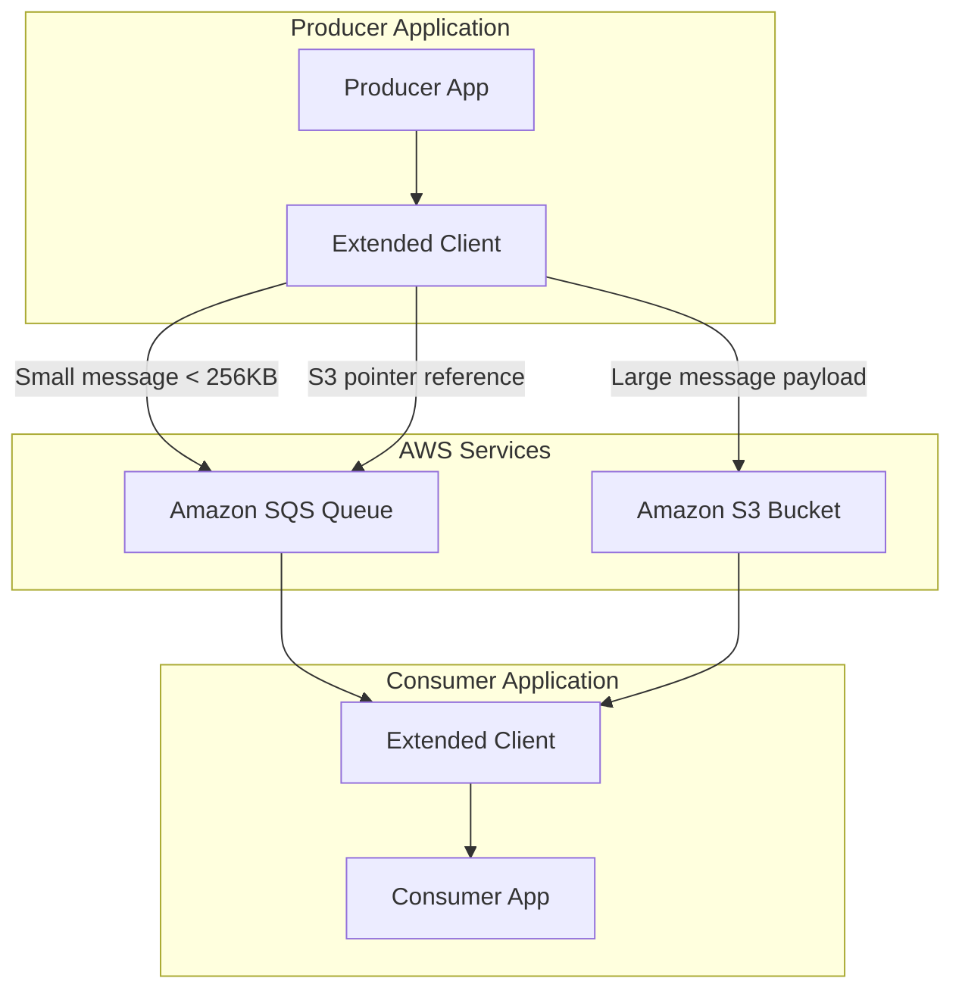
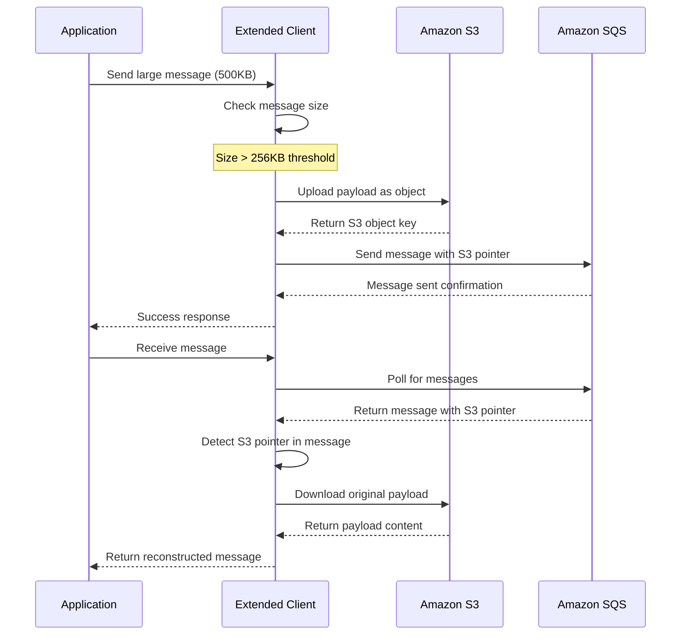
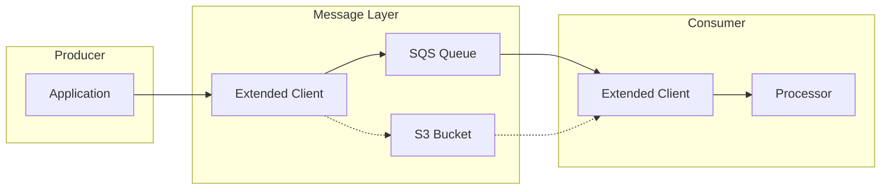
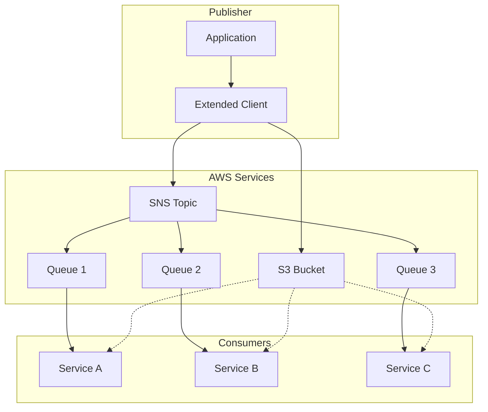
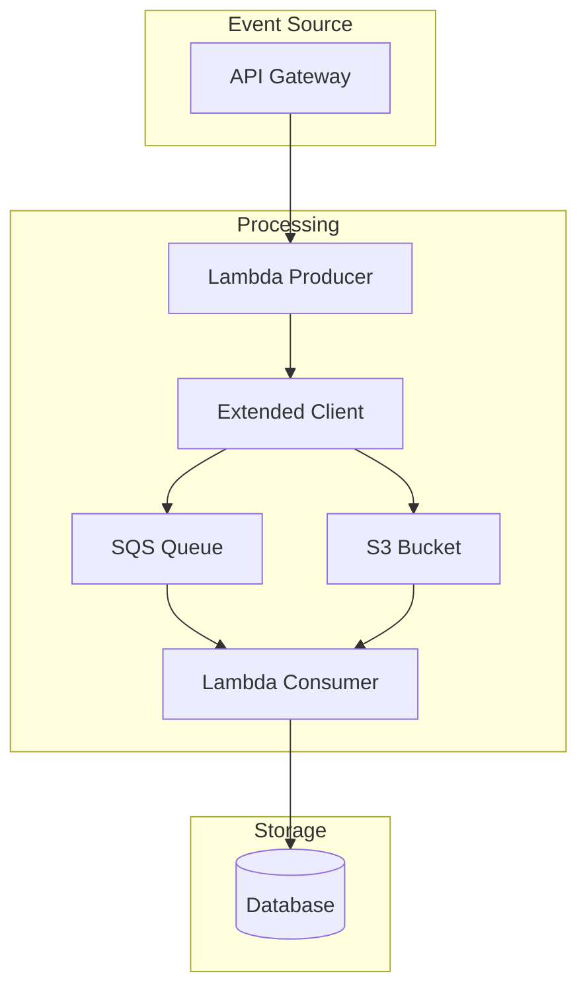

# How to Handle Large Messages with SQS Extended Client

Author: [nicktackes](https://www.github.com/nicktackes)

Tags: AWS, SQS, S3, Large Messages, Java, Python, Node.js

Description: Learn how to handle messages larger than SQS's 256KB limit using the Extended Client Library with S3 storage.

Amazon Simple Queue Service (SQS) has a message size limit of 256 KB, which can be restrictive when working with large payloads such as images, documents, or complex data structures. The SQS Extended Client Library solves this limitation by automatically storing large message payloads in Amazon S3 and passing only a reference through SQS. In this guide, you'll learn how to implement the SQS Extended Client for handling messages of any size.

## Architecture Overview

Understanding how the Extended Client works helps you design robust message processing systems.



## How the Extended Client Works

The Extended Client intercepts messages before they reach SQS and makes intelligent decisions based on message size.



## Prerequisites

Before implementing the Extended Client, ensure you have:

- An AWS account with appropriate IAM permissions
- Java 8 or later, Python 3.7+, or Node.js 14+
- AWS CLI configured with credentials
- An existing SQS queue or permissions to create one
- An S3 bucket for storing large payloads

## Setting Up IAM Permissions

The application needs permissions for both SQS and S3 operations. Create an IAM policy with the minimum required permissions.

```json
{
    "Version": "2012-10-17",
    "Statement": [
        {
            "Sid": "SQSPermissions",
            "Effect": "Allow",
            "Action": [
                "sqs:SendMessage",
                "sqs:ReceiveMessage",
                "sqs:DeleteMessage",
                "sqs:GetQueueAttributes",
                "sqs:GetQueueUrl"
            ],
            "Resource": "arn:aws:sqs:us-east-1:123456789012:my-queue"
        },
        {
            "Sid": "S3Permissions",
            "Effect": "Allow",
            "Action": [
                "s3:PutObject",
                "s3:GetObject",
                "s3:DeleteObject"
            ],
            "Resource": "arn:aws:s3:::my-sqs-payload-bucket/*"
        }
    ]
}
```

## Java Implementation

The Java Extended Client Library provides seamless integration with the AWS SDK.

### Step 1: Add Maven Dependencies

Include the required dependencies in your project's pom.xml file.

```xml
<!-- pom.xml -->
<!-- AWS SDK and Extended Client dependencies for handling large SQS messages -->
<dependencies>
    <!-- AWS SQS Extended Client Library -->
    <dependency>
        <groupId>com.amazonaws</groupId>
        <artifactId>amazon-sqs-java-extended-client-lib</artifactId>
        <version>2.0.4</version>
    </dependency>

    <!-- AWS SDK for SQS -->
    <dependency>
        <groupId>software.amazon.awssdk</groupId>
        <artifactId>sqs</artifactId>
        <version>2.21.0</version>
    </dependency>

    <!-- AWS SDK for S3 -->
    <dependency>
        <groupId>software.amazon.awssdk</groupId>
        <artifactId>s3</artifactId>
        <version>2.21.0</version>
    </dependency>
</dependencies>
```

### Step 2: Configure the Extended Client

Set up the Extended Client with your S3 bucket and configuration options.

```java
// ExtendedClientConfig.java
// Configures the SQS Extended Client with S3 storage for large messages

import com.amazon.sqs.javamessaging.AmazonSQSExtendedClient;
import com.amazon.sqs.javamessaging.ExtendedClientConfiguration;
import software.amazon.awssdk.regions.Region;
import software.amazon.awssdk.services.s3.S3Client;
import software.amazon.awssdk.services.sqs.SqsClient;

public class ExtendedClientConfig {

    // S3 bucket name for storing large message payloads
    private static final String S3_BUCKET_NAME = "my-sqs-payload-bucket";

    // Threshold in bytes - messages larger than this go to S3
    // Default is 256KB, but you can set a lower threshold
    private static final int PAYLOAD_SIZE_THRESHOLD = 256 * 1024;

    /**
     * Creates and configures an SQS Extended Client instance.
     * The client automatically handles large messages by storing them in S3.
     */
    public static AmazonSQSExtendedClient createExtendedClient() {
        // Create S3 client for payload storage
        S3Client s3Client = S3Client.builder()
                .region(Region.US_EAST_1)
                .build();

        // Create standard SQS client
        SqsClient sqsClient = SqsClient.builder()
                .region(Region.US_EAST_1)
                .build();

        // Configure extended client options
        ExtendedClientConfiguration extendedClientConfig =
                new ExtendedClientConfiguration()
                        // Enable large payload support with S3
                        .withPayloadSupportEnabled(s3Client, S3_BUCKET_NAME)
                        // Set the size threshold for S3 storage
                        .withPayloadSizeThreshold(PAYLOAD_SIZE_THRESHOLD)
                        // Always store in S3 regardless of size (optional)
                        // .withAlwaysThroughS3(true)
                        // Clean up S3 objects when messages are deleted
                        .withCleanupS3Payload(true);

        // Wrap the standard client with extended functionality
        return new AmazonSQSExtendedClient(sqsClient, extendedClientConfig);
    }
}
```

### Step 3: Send Large Messages

Use the Extended Client to send messages without worrying about size limits.

```java
// LargeMessageProducer.java
// Sends large messages through SQS using the Extended Client

import com.amazon.sqs.javamessaging.AmazonSQSExtendedClient;
import software.amazon.awssdk.services.sqs.model.SendMessageRequest;
import software.amazon.awssdk.services.sqs.model.SendMessageResponse;

public class LargeMessageProducer {

    private final AmazonSQSExtendedClient extendedClient;
    private final String queueUrl;

    public LargeMessageProducer(String queueUrl) {
        // Initialize the extended client using our configuration
        this.extendedClient = ExtendedClientConfig.createExtendedClient();
        this.queueUrl = queueUrl;
    }

    /**
     * Sends a message of any size to the SQS queue.
     * Large messages are automatically stored in S3.
     *
     * @param messageBody The message content (can exceed 256KB)
     * @return The message ID assigned by SQS
     */
    public String sendLargeMessage(String messageBody) {
        // Build the send message request
        // The extended client handles S3 storage transparently
        SendMessageRequest request = SendMessageRequest.builder()
                .queueUrl(queueUrl)
                .messageBody(messageBody)
                .build();

        // Send the message - large payloads go to S3 automatically
        SendMessageResponse response = extendedClient.sendMessage(request);

        System.out.println("Message sent with ID: " + response.messageId());
        System.out.println("Original size: " + messageBody.length() + " bytes");

        return response.messageId();
    }

    /**
     * Sends a message with custom attributes.
     * Attributes are always sent through SQS, not S3.
     */
    public String sendMessageWithAttributes(String messageBody, String correlationId) {
        SendMessageRequest request = SendMessageRequest.builder()
                .queueUrl(queueUrl)
                .messageBody(messageBody)
                // Message attributes stay in SQS metadata
                .messageAttributes(Map.of(
                        "CorrelationId", MessageAttributeValue.builder()
                                .dataType("String")
                                .stringValue(correlationId)
                                .build()
                ))
                .build();

        SendMessageResponse response = extendedClient.sendMessage(request);
        return response.messageId();
    }
}
```

### Step 4: Receive and Process Large Messages

Consume messages with automatic retrieval of S3-stored payloads.

```java
// LargeMessageConsumer.java
// Receives and processes large messages from SQS

import com.amazon.sqs.javamessaging.AmazonSQSExtendedClient;
import software.amazon.awssdk.services.sqs.model.*;
import java.util.List;

public class LargeMessageConsumer {

    private final AmazonSQSExtendedClient extendedClient;
    private final String queueUrl;

    public LargeMessageConsumer(String queueUrl) {
        this.extendedClient = ExtendedClientConfig.createExtendedClient();
        this.queueUrl = queueUrl;
    }

    /**
     * Polls the queue and processes available messages.
     * Large payloads are automatically retrieved from S3.
     */
    public void processMessages() {
        // Configure the receive request
        ReceiveMessageRequest receiveRequest = ReceiveMessageRequest.builder()
                .queueUrl(queueUrl)
                // Maximum messages to retrieve per poll (1-10)
                .maxNumberOfMessages(10)
                // Long polling - wait up to 20 seconds for messages
                .waitTimeSeconds(20)
                // Include message attributes in the response
                .messageAttributeNames("All")
                .build();

        // Receive messages - S3 payloads are fetched transparently
        ReceiveMessageResponse response = extendedClient.receiveMessage(receiveRequest);
        List<Message> messages = response.messages();

        System.out.println("Received " + messages.size() + " messages");

        for (Message message : messages) {
            try {
                // Process the message - body contains full payload
                processMessage(message);

                // Delete the message after successful processing
                // S3 object is also deleted if cleanup is enabled
                deleteMessage(message.receiptHandle());

            } catch (Exception e) {
                System.err.println("Failed to process message: " + e.getMessage());
                // Message returns to queue after visibility timeout
            }
        }
    }

    /**
     * Processes an individual message.
     * The message body contains the full payload regardless of original size.
     */
    private void processMessage(Message message) {
        String body = message.body();
        String messageId = message.messageId();

        System.out.println("Processing message: " + messageId);
        System.out.println("Payload size: " + body.length() + " bytes");

        // Your business logic here
        // The body contains the complete message content
    }

    /**
     * Deletes a processed message from the queue.
     * Also removes the S3 object if cleanup is configured.
     */
    private void deleteMessage(String receiptHandle) {
        DeleteMessageRequest deleteRequest = DeleteMessageRequest.builder()
                .queueUrl(queueUrl)
                .receiptHandle(receiptHandle)
                .build();

        extendedClient.deleteMessage(deleteRequest);
        System.out.println("Message deleted successfully");
    }
}
```

## Python Implementation

Python applications can use boto3 with a custom wrapper for extended client functionality.

### Install Required Packages

Install the AWS SDK and supporting libraries.

```bash
# Install boto3 for AWS interactions
pip install boto3

# Install the SQS Extended Client library for Python
pip install amazon-sqs-extended-client
```

### Configure the Extended Client in Python

Set up the client with S3 integration for large payload handling.

```python
# extended_client.py
# Python implementation of SQS Extended Client for large messages

import boto3
import json
import uuid
from typing import Optional, Dict, Any

class SQSExtendedClient:
    """
    Extended SQS client that handles messages larger than 256KB
    by automatically storing payloads in S3.
    """

    # S3 pointer marker used to identify extended messages
    S3_POINTER_CLASS = "com.amazon.sqs.javamessaging.MessageS3Pointer"

    def __init__(
        self,
        queue_url: str,
        s3_bucket: str,
        region: str = "us-east-1",
        size_threshold: int = 256 * 1024,
        always_use_s3: bool = False
    ):
        """
        Initialize the extended client with configuration options.

        Args:
            queue_url: The SQS queue URL
            s3_bucket: S3 bucket name for large payloads
            region: AWS region for services
            size_threshold: Size in bytes above which to use S3
            always_use_s3: Store all messages in S3 regardless of size
        """
        self.queue_url = queue_url
        self.s3_bucket = s3_bucket
        self.size_threshold = size_threshold
        self.always_use_s3 = always_use_s3

        # Initialize AWS clients
        self.sqs = boto3.client("sqs", region_name=region)
        self.s3 = boto3.client("s3", region_name=region)

    def send_message(
        self,
        message_body: str,
        message_attributes: Optional[Dict] = None
    ) -> Dict[str, Any]:
        """
        Send a message to SQS, storing large payloads in S3.

        Args:
            message_body: The message content
            message_attributes: Optional message attributes

        Returns:
            SQS SendMessage response
        """
        message_size = len(message_body.encode("utf-8"))

        # Determine if message should be stored in S3
        use_s3 = self.always_use_s3 or message_size > self.size_threshold

        if use_s3:
            # Generate unique S3 key for the payload
            s3_key = f"sqs-payloads/{uuid.uuid4()}"

            # Upload payload to S3
            self.s3.put_object(
                Bucket=self.s3_bucket,
                Key=s3_key,
                Body=message_body.encode("utf-8"),
                ContentType="application/json"
            )

            # Create S3 pointer message (compatible with Java client)
            s3_pointer = {
                "s3BucketName": self.s3_bucket,
                "s3Key": s3_key
            }

            # Wrap pointer in the standard format
            pointer_message = json.dumps([
                self.S3_POINTER_CLASS,
                s3_pointer
            ])

            actual_body = pointer_message
            print(f"Large message ({message_size} bytes) stored in S3: {s3_key}")
        else:
            actual_body = message_body
            print(f"Small message ({message_size} bytes) sent directly to SQS")

        # Build the SQS request
        send_params = {
            "QueueUrl": self.queue_url,
            "MessageBody": actual_body
        }

        if message_attributes:
            send_params["MessageAttributes"] = message_attributes

        # Send to SQS
        response = self.sqs.send_message(**send_params)
        return response

    def receive_messages(
        self,
        max_messages: int = 10,
        wait_time: int = 20,
        visibility_timeout: int = 30
    ) -> list:
        """
        Receive messages from SQS, fetching S3 payloads as needed.

        Args:
            max_messages: Maximum number of messages to retrieve
            wait_time: Long polling wait time in seconds
            visibility_timeout: Time before message becomes visible again

        Returns:
            List of messages with reconstructed payloads
        """
        # Poll SQS for messages
        response = self.sqs.receive_message(
            QueueUrl=self.queue_url,
            MaxNumberOfMessages=max_messages,
            WaitTimeSeconds=wait_time,
            VisibilityTimeout=visibility_timeout,
            MessageAttributeNames=["All"]
        )

        messages = response.get("Messages", [])
        processed_messages = []

        for message in messages:
            body = message["Body"]

            # Check if message contains S3 pointer
            if self._is_s3_pointer(body):
                # Retrieve actual payload from S3
                pointer = self._parse_s3_pointer(body)
                actual_body = self._get_s3_payload(pointer)
                message["Body"] = actual_body
                message["_s3_pointer"] = pointer

            processed_messages.append(message)

        return processed_messages

    def delete_message(
        self,
        receipt_handle: str,
        s3_pointer: Optional[Dict] = None
    ) -> None:
        """
        Delete a message from SQS and optionally clean up S3.

        Args:
            receipt_handle: The message receipt handle
            s3_pointer: Optional S3 pointer for cleanup
        """
        # Delete from SQS
        self.sqs.delete_message(
            QueueUrl=self.queue_url,
            ReceiptHandle=receipt_handle
        )

        # Clean up S3 object if pointer provided
        if s3_pointer:
            self.s3.delete_object(
                Bucket=s3_pointer["s3BucketName"],
                Key=s3_pointer["s3Key"]
            )
            print(f"Cleaned up S3 object: {s3_pointer['s3Key']}")

    def _is_s3_pointer(self, body: str) -> bool:
        """Check if message body contains an S3 pointer."""
        try:
            data = json.loads(body)
            return (
                isinstance(data, list) and
                len(data) == 2 and
                data[0] == self.S3_POINTER_CLASS
            )
        except (json.JSONDecodeError, TypeError):
            return False

    def _parse_s3_pointer(self, body: str) -> Dict:
        """Extract S3 bucket and key from pointer message."""
        data = json.loads(body)
        return data[1]

    def _get_s3_payload(self, pointer: Dict) -> str:
        """Retrieve the actual message payload from S3."""
        response = self.s3.get_object(
            Bucket=pointer["s3BucketName"],
            Key=pointer["s3Key"]
        )
        return response["Body"].read().decode("utf-8")
```

### Using the Python Extended Client

Send and receive large messages with the Python implementation.

```python
# main.py
# Example usage of the SQS Extended Client in Python

from extended_client import SQSExtendedClient
import json

def main():
    # Initialize the extended client
    client = SQSExtendedClient(
        queue_url="https://sqs.us-east-1.amazonaws.com/123456789012/my-queue",
        s3_bucket="my-sqs-payload-bucket",
        region="us-east-1",
        # Store messages larger than 200KB in S3
        size_threshold=200 * 1024
    )

    # Create a large message payload (500KB of data)
    large_payload = {
        "event_type": "data_export",
        "timestamp": "2024-01-15T10:30:00Z",
        # Simulate large data content
        "data": "x" * (500 * 1024)
    }

    # Send the large message
    response = client.send_message(
        message_body=json.dumps(large_payload),
        message_attributes={
            "EventType": {
                "DataType": "String",
                "StringValue": "data_export"
            }
        }
    )

    print(f"Message sent with ID: {response['MessageId']}")

    # Receive and process messages
    messages = client.receive_messages(
        max_messages=5,
        wait_time=10
    )

    for message in messages:
        body = json.loads(message["Body"])
        print(f"Received event type: {body['event_type']}")
        print(f"Payload size: {len(message['Body'])} bytes")

        # Process the message...

        # Delete after processing
        client.delete_message(
            receipt_handle=message["ReceiptHandle"],
            s3_pointer=message.get("_s3_pointer")
        )

if __name__ == "__main__":
    main()
```

## Node.js Implementation

JavaScript applications can implement the Extended Client pattern with the AWS SDK v3.

### Install Node.js Dependencies

Add the required AWS SDK packages to your project.

```bash
# Install AWS SDK v3 clients for SQS and S3
npm install @aws-sdk/client-sqs @aws-sdk/client-s3 uuid
```

### Extended Client Implementation for Node.js

Build a complete Extended Client class for handling large messages.

```javascript
// extendedClient.js
// Node.js implementation of SQS Extended Client

const { SQSClient, SendMessageCommand, ReceiveMessageCommand, DeleteMessageCommand } = require("@aws-sdk/client-sqs");
const { S3Client, PutObjectCommand, GetObjectCommand, DeleteObjectCommand } = require("@aws-sdk/client-s3");
const { v4: uuidv4 } = require("uuid");

/**
 * SQS Extended Client for Node.js
 * Handles messages larger than 256KB by storing payloads in S3
 */
class SQSExtendedClient {
    // Marker class for S3 pointer messages (Java client compatible)
    static S3_POINTER_CLASS = "com.amazon.sqs.javamessaging.MessageS3Pointer";

    /**
     * Create an Extended Client instance
     * @param {Object} config - Configuration options
     * @param {string} config.queueUrl - SQS queue URL
     * @param {string} config.s3Bucket - S3 bucket for large payloads
     * @param {string} config.region - AWS region
     * @param {number} config.sizeThreshold - Threshold in bytes for S3 storage
     * @param {boolean} config.alwaysUseS3 - Force all messages through S3
     */
    constructor(config) {
        this.queueUrl = config.queueUrl;
        this.s3Bucket = config.s3Bucket;
        this.sizeThreshold = config.sizeThreshold || 256 * 1024;
        this.alwaysUseS3 = config.alwaysUseS3 || false;

        // Initialize AWS clients
        this.sqs = new SQSClient({ region: config.region || "us-east-1" });
        this.s3 = new S3Client({ region: config.region || "us-east-1" });
    }

    /**
     * Send a message to SQS, storing large payloads in S3
     * @param {string} messageBody - The message content
     * @param {Object} messageAttributes - Optional message attributes
     * @returns {Promise<Object>} SQS send message response
     */
    async sendMessage(messageBody, messageAttributes = {}) {
        const messageSize = Buffer.byteLength(messageBody, "utf8");
        const useS3 = this.alwaysUseS3 || messageSize > this.sizeThreshold;

        let actualBody = messageBody;
        let s3Key = null;

        if (useS3) {
            // Generate unique S3 key
            s3Key = `sqs-payloads/${uuidv4()}`;

            // Upload payload to S3
            await this.s3.send(new PutObjectCommand({
                Bucket: this.s3Bucket,
                Key: s3Key,
                Body: messageBody,
                ContentType: "application/json"
            }));

            // Create S3 pointer message
            const s3Pointer = {
                s3BucketName: this.s3Bucket,
                s3Key: s3Key
            };

            actualBody = JSON.stringify([
                SQSExtendedClient.S3_POINTER_CLASS,
                s3Pointer
            ]);

            console.log(`Large message (${messageSize} bytes) stored in S3: ${s3Key}`);
        } else {
            console.log(`Small message (${messageSize} bytes) sent directly to SQS`);
        }

        // Send message to SQS
        const response = await this.sqs.send(new SendMessageCommand({
            QueueUrl: this.queueUrl,
            MessageBody: actualBody,
            MessageAttributes: messageAttributes
        }));

        return response;
    }

    /**
     * Receive messages from SQS, fetching S3 payloads as needed
     * @param {Object} options - Receive options
     * @param {number} options.maxMessages - Maximum messages to retrieve
     * @param {number} options.waitTime - Long polling wait time in seconds
     * @returns {Promise<Array>} Array of messages with reconstructed payloads
     */
    async receiveMessages(options = {}) {
        const { maxMessages = 10, waitTime = 20 } = options;

        // Poll SQS for messages
        const response = await this.sqs.send(new ReceiveMessageCommand({
            QueueUrl: this.queueUrl,
            MaxNumberOfMessages: maxMessages,
            WaitTimeSeconds: waitTime,
            MessageAttributeNames: ["All"]
        }));

        const messages = response.Messages || [];
        const processedMessages = [];

        for (const message of messages) {
            let body = message.Body;
            let s3Pointer = null;

            // Check if message contains S3 pointer
            if (this._isS3Pointer(body)) {
                s3Pointer = this._parseS3Pointer(body);
                body = await this._getS3Payload(s3Pointer);
            }

            processedMessages.push({
                ...message,
                Body: body,
                _s3Pointer: s3Pointer
            });
        }

        return processedMessages;
    }

    /**
     * Delete a message from SQS and clean up S3 if needed
     * @param {string} receiptHandle - Message receipt handle
     * @param {Object} s3Pointer - Optional S3 pointer for cleanup
     */
    async deleteMessage(receiptHandle, s3Pointer = null) {
        // Delete from SQS
        await this.sqs.send(new DeleteMessageCommand({
            QueueUrl: this.queueUrl,
            ReceiptHandle: receiptHandle
        }));

        // Clean up S3 object if present
        if (s3Pointer) {
            await this.s3.send(new DeleteObjectCommand({
                Bucket: s3Pointer.s3BucketName,
                Key: s3Pointer.s3Key
            }));
            console.log(`Cleaned up S3 object: ${s3Pointer.s3Key}`);
        }
    }

    /**
     * Check if message body contains an S3 pointer
     * @private
     */
    _isS3Pointer(body) {
        try {
            const data = JSON.parse(body);
            return (
                Array.isArray(data) &&
                data.length === 2 &&
                data[0] === SQSExtendedClient.S3_POINTER_CLASS
            );
        } catch {
            return false;
        }
    }

    /**
     * Parse S3 pointer from message body
     * @private
     */
    _parseS3Pointer(body) {
        const data = JSON.parse(body);
        return data[1];
    }

    /**
     * Retrieve payload from S3
     * @private
     */
    async _getS3Payload(pointer) {
        const response = await this.s3.send(new GetObjectCommand({
            Bucket: pointer.s3BucketName,
            Key: pointer.s3Key
        }));

        // Convert stream to string
        const chunks = [];
        for await (const chunk of response.Body) {
            chunks.push(chunk);
        }
        return Buffer.concat(chunks).toString("utf8");
    }
}

module.exports = { SQSExtendedClient };
```

### Using the Node.js Extended Client

Example application demonstrating message sending and receiving.

```javascript
// app.js
// Example usage of the Node.js SQS Extended Client

const { SQSExtendedClient } = require("./extendedClient");

async function main() {
    // Initialize the extended client
    const client = new SQSExtendedClient({
        queueUrl: "https://sqs.us-east-1.amazonaws.com/123456789012/my-queue",
        s3Bucket: "my-sqs-payload-bucket",
        region: "us-east-1",
        sizeThreshold: 200 * 1024  // 200KB threshold
    });

    // Create a large payload (400KB of data)
    const largePayload = JSON.stringify({
        eventType: "image_processed",
        timestamp: new Date().toISOString(),
        // Simulate large binary data encoded as base64
        imageData: "x".repeat(400 * 1024),
        metadata: {
            format: "jpeg",
            width: 1920,
            height: 1080
        }
    });

    console.log(`Payload size: ${Buffer.byteLength(largePayload)} bytes`);

    // Send the large message
    const sendResponse = await client.sendMessage(largePayload, {
        EventType: {
            DataType: "String",
            StringValue: "image_processed"
        }
    });

    console.log(`Message sent with ID: ${sendResponse.MessageId}`);

    // Wait a moment for the message to be available
    await new Promise(resolve => setTimeout(resolve, 1000));

    // Receive messages
    const messages = await client.receiveMessages({
        maxMessages: 5,
        waitTime: 5
    });

    console.log(`Received ${messages.length} messages`);

    for (const message of messages) {
        const body = JSON.parse(message.Body);
        console.log(`Event type: ${body.eventType}`);
        console.log(`Payload size: ${message.Body.length} bytes`);

        // Process the message...

        // Delete after successful processing
        await client.deleteMessage(
            message.ReceiptHandle,
            message._s3Pointer
        );
    }
}

main().catch(console.error);
```

## S3 Lifecycle Policies for Cleanup

Configure S3 lifecycle rules to automatically clean up orphaned payloads that were not properly deleted.

```json
{
    "Rules": [
        {
            "ID": "CleanupOrphanedSQSPayloads",
            "Status": "Enabled",
            "Filter": {
                "Prefix": "sqs-payloads/"
            },
            "Expiration": {
                "Days": 14
            },
            "NoncurrentVersionExpiration": {
                "NoncurrentDays": 7
            }
        }
    ]
}
```

Apply the lifecycle configuration using the AWS CLI.

```bash
# Apply lifecycle policy to the S3 bucket
aws s3api put-bucket-lifecycle-configuration \
    --bucket my-sqs-payload-bucket \
    --lifecycle-configuration file://lifecycle-policy.json
```

## Message Flow Patterns

Different architectural patterns support various use cases for large message handling.

### Pattern 1: Direct Processing

Simple synchronous processing where consumers handle messages immediately.



### Pattern 2: Fan-Out with SNS

Distribute large messages to multiple queues using SNS.



### Pattern 3: Lambda Processing

Serverless processing of large messages with AWS Lambda.



## Error Handling and Retry Logic

Implement robust error handling for production systems.

```java
// ResilientMessageProcessor.java
// Handles errors and implements retry logic for message processing

import java.util.concurrent.TimeUnit;

public class ResilientMessageProcessor {

    private final AmazonSQSExtendedClient extendedClient;
    private final String queueUrl;
    private static final int MAX_RETRIES = 3;
    private static final long BASE_DELAY_MS = 1000;

    public ResilientMessageProcessor(String queueUrl) {
        this.extendedClient = ExtendedClientConfig.createExtendedClient();
        this.queueUrl = queueUrl;
    }

    /**
     * Send a message with retry logic for transient failures.
     * Uses exponential backoff between retry attempts.
     */
    public String sendWithRetry(String messageBody) throws Exception {
        Exception lastException = null;

        for (int attempt = 1; attempt <= MAX_RETRIES; attempt++) {
            try {
                SendMessageRequest request = SendMessageRequest.builder()
                        .queueUrl(queueUrl)
                        .messageBody(messageBody)
                        .build();

                SendMessageResponse response = extendedClient.sendMessage(request);
                return response.messageId();

            } catch (SqsException e) {
                lastException = e;

                // Check if error is retryable
                if (!isRetryable(e) || attempt == MAX_RETRIES) {
                    throw e;
                }

                // Calculate exponential backoff delay
                long delay = BASE_DELAY_MS * (long) Math.pow(2, attempt - 1);
                System.out.println("Retry attempt " + attempt + " after " + delay + "ms");
                TimeUnit.MILLISECONDS.sleep(delay);
            }
        }

        throw lastException;
    }

    /**
     * Process messages with dead letter queue handling.
     * Failed messages are moved to DLQ after max receive count.
     */
    public void processWithDLQ() {
        ReceiveMessageRequest request = ReceiveMessageRequest.builder()
                .queueUrl(queueUrl)
                .maxNumberOfMessages(10)
                .waitTimeSeconds(20)
                // Include approximate receive count for monitoring
                .attributeNames(QueueAttributeName.APPROXIMATE_RECEIVE_COUNT)
                .build();

        ReceiveMessageResponse response = extendedClient.receiveMessage(request);

        for (Message message : response.messages()) {
            try {
                // Get receive count for logging
                String receiveCount = message.attributes()
                        .get(MessageSystemAttributeName.APPROXIMATE_RECEIVE_COUNT);

                System.out.println("Processing message (receive count: " + receiveCount + ")");

                processMessage(message);
                deleteMessage(message.receiptHandle());

            } catch (Exception e) {
                // Log error - message will return to queue or go to DLQ
                System.err.println("Processing failed: " + e.getMessage());
                // Optionally extend visibility timeout for slow processing
            }
        }
    }

    /**
     * Determine if an exception is retryable.
     */
    private boolean isRetryable(SqsException e) {
        // Retry on throttling or service unavailable
        return e.isThrottlingException() ||
               e.statusCode() == 503 ||
               e.statusCode() == 500;
    }

    private void processMessage(Message message) {
        // Business logic here
    }

    private void deleteMessage(String receiptHandle) {
        extendedClient.deleteMessage(DeleteMessageRequest.builder()
                .queueUrl(queueUrl)
                .receiptHandle(receiptHandle)
                .build());
    }
}
```

## Monitoring and Observability

Track Extended Client operations with CloudWatch metrics.

```python
# monitoring.py
# CloudWatch metrics for SQS Extended Client operations

import boto3
from datetime import datetime

class ExtendedClientMetrics:
    """
    Publishes custom metrics for Extended Client operations.
    Tracks message sizes, S3 usage, and processing times.
    """

    def __init__(self, namespace: str = "SQS/ExtendedClient"):
        self.cloudwatch = boto3.client("cloudwatch")
        self.namespace = namespace

    def record_message_sent(
        self,
        queue_name: str,
        message_size: int,
        used_s3: bool,
        duration_ms: float
    ):
        """
        Record metrics for a sent message.

        Args:
            queue_name: Name of the SQS queue
            message_size: Size of the message in bytes
            used_s3: Whether the message was stored in S3
            duration_ms: Time taken to send the message
        """
        metrics = [
            {
                "MetricName": "MessageSize",
                "Value": message_size,
                "Unit": "Bytes",
                "Dimensions": [
                    {"Name": "QueueName", "Value": queue_name}
                ]
            },
            {
                "MetricName": "SendDuration",
                "Value": duration_ms,
                "Unit": "Milliseconds",
                "Dimensions": [
                    {"Name": "QueueName", "Value": queue_name}
                ]
            },
            {
                "MetricName": "S3StorageUsed",
                "Value": 1 if used_s3 else 0,
                "Unit": "Count",
                "Dimensions": [
                    {"Name": "QueueName", "Value": queue_name}
                ]
            }
        ]

        self.cloudwatch.put_metric_data(
            Namespace=self.namespace,
            MetricData=metrics
        )

    def record_message_received(
        self,
        queue_name: str,
        message_count: int,
        s3_fetch_count: int,
        duration_ms: float
    ):
        """
        Record metrics for received messages.

        Args:
            queue_name: Name of the SQS queue
            message_count: Number of messages received
            s3_fetch_count: Number of S3 fetches performed
            duration_ms: Time taken to receive messages
        """
        metrics = [
            {
                "MetricName": "MessagesReceived",
                "Value": message_count,
                "Unit": "Count",
                "Dimensions": [
                    {"Name": "QueueName", "Value": queue_name}
                ]
            },
            {
                "MetricName": "S3FetchCount",
                "Value": s3_fetch_count,
                "Unit": "Count",
                "Dimensions": [
                    {"Name": "QueueName", "Value": queue_name}
                ]
            },
            {
                "MetricName": "ReceiveDuration",
                "Value": duration_ms,
                "Unit": "Milliseconds",
                "Dimensions": [
                    {"Name": "QueueName", "Value": queue_name}
                ]
            }
        ]

        self.cloudwatch.put_metric_data(
            Namespace=self.namespace,
            MetricData=metrics
        )
```

## Best Practices

Follow these recommendations for optimal Extended Client usage:

### 1. Configure Appropriate Thresholds

Set size thresholds based on your message patterns and cost considerations.

```java
// For high-volume systems with mostly small messages
// Set threshold close to the SQS limit
ExtendedClientConfiguration config = new ExtendedClientConfiguration()
        .withPayloadSupportEnabled(s3Client, bucketName)
        .withPayloadSizeThreshold(250 * 1024);  // 250KB

// For systems with security requirements
// Store all messages in S3 for consistent encryption
ExtendedClientConfiguration secureConfig = new ExtendedClientConfiguration()
        .withPayloadSupportEnabled(s3Client, bucketName)
        .withAlwaysThroughS3(true);
```

### 2. Enable S3 Server-Side Encryption

Protect large payloads at rest with S3 encryption.

```bash
# Enable default encryption on the S3 bucket
aws s3api put-bucket-encryption \
    --bucket my-sqs-payload-bucket \
    --server-side-encryption-configuration '{
        "Rules": [{
            "ApplyServerSideEncryptionByDefault": {
                "SSEAlgorithm": "aws:kms",
                "KMSMasterKeyID": "alias/sqs-payload-key"
            },
            "BucketKeyEnabled": true
        }]
    }'
```

### 3. Use Separate Buckets per Environment

Isolate development, staging, and production payloads.

```yaml
# CloudFormation template for environment-specific buckets
Resources:
  PayloadBucket:
    Type: AWS::S3::Bucket
    Properties:
      BucketName: !Sub "${AWS::StackName}-sqs-payloads-${Environment}"
      VersioningConfiguration:
        Status: Enabled
      LifecycleConfiguration:
        Rules:
          - Id: CleanupOldPayloads
            Status: Enabled
            ExpirationInDays: 14
            Prefix: sqs-payloads/
```

### 4. Implement Payload Compression

Compress large payloads before sending to reduce S3 storage costs.

```python
# compression.py
# Compress payloads before storing in S3

import gzip
import json
from typing import Any

def compress_payload(data: Any) -> bytes:
    """
    Compress JSON payload using gzip.
    Reduces S3 storage costs for large messages.
    """
    json_str = json.dumps(data)
    return gzip.compress(json_str.encode("utf-8"))

def decompress_payload(compressed: bytes) -> Any:
    """
    Decompress gzip payload back to original JSON.
    """
    decompressed = gzip.decompress(compressed)
    return json.loads(decompressed.decode("utf-8"))

# Usage in Extended Client
class CompressedExtendedClient(SQSExtendedClient):
    def send_message(self, message_body: str, **kwargs):
        # Compress if payload is large enough to benefit
        if len(message_body) > 10000:  # 10KB threshold
            compressed = compress_payload(json.loads(message_body))
            # Mark as compressed in attributes
            kwargs.setdefault("message_attributes", {})
            kwargs["message_attributes"]["Compressed"] = {
                "DataType": "String",
                "StringValue": "gzip"
            }
            return super().send_message(
                compressed.decode("latin-1"),
                **kwargs
            )
        return super().send_message(message_body, **kwargs)
```

## Summary

The SQS Extended Client Library provides a seamless solution for handling messages that exceed SQS's 256 KB limit. Key takeaways from this guide include:

1. **Transparent Integration**: The Extended Client automatically handles S3 storage, requiring minimal code changes to existing SQS implementations

2. **Cross-Language Compatibility**: Java, Python, and Node.js implementations use the same S3 pointer format, enabling polyglot architectures

3. **Configurable Thresholds**: Adjust the size threshold based on your cost and performance requirements

4. **Automatic Cleanup**: Enable S3 object deletion when messages are consumed to prevent orphaned payloads

5. **Production Considerations**: Implement encryption, lifecycle policies, and monitoring for robust deployments

6. **Error Handling**: Build retry logic and dead letter queue integration for resilient message processing

By implementing the Extended Client pattern, you can process messages of virtually unlimited size while maintaining the simplicity and reliability of SQS-based architectures.
