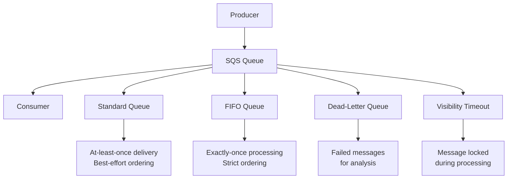
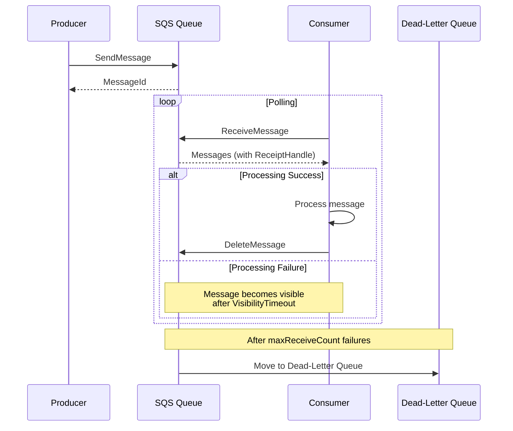
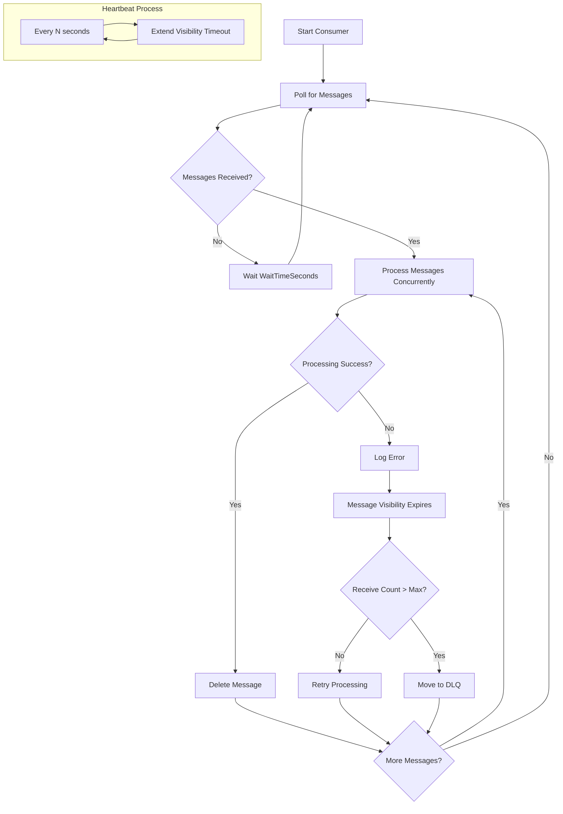

# How to Use SQS with Node.js

Author: [nawazdhandala](https://github.com/nawazdhandala)

Tags: SQS, Node.js, AWS, Message Queue, Serverless, Microservices

Description: Learn how to use Amazon SQS with Node.js for building scalable message-driven applications. Covers queue setup, sending and receiving messages, FIFO queues, dead-letter queues, and production best practices.

---

Amazon Simple Queue Service (SQS) is a fully managed message queuing service that enables decoupling and scaling of microservices, distributed systems, and serverless applications. When combined with Node.js, you can build robust event-driven architectures that handle millions of messages per day reliably.

## Understanding SQS Concepts

Before diving into code, let's understand the key components that make SQS a powerful messaging solution.



## Setting Up the AWS SDK

### Installation

Install the AWS SDK v3 for JavaScript, which provides modular packages optimized for tree-shaking and smaller bundle sizes.

```bash
npm install @aws-sdk/client-sqs
```

### Client Configuration

Create an SQS client with proper configuration for your environment. The client handles authentication, retries, and connection pooling automatically.

```javascript
// sqs-client.js
const { SQSClient } = require('@aws-sdk/client-sqs');

// Create the SQS client with region configuration
// The SDK automatically loads credentials from environment variables,
// AWS credentials file, or IAM role when running on AWS
const sqsClient = new SQSClient({
  region: process.env.AWS_REGION || 'us-east-1',
  // Configure retry behavior for transient failures
  maxAttempts: 3,
  // For local development with LocalStack or ElasticMQ
  ...(process.env.SQS_ENDPOINT && {
    endpoint: process.env.SQS_ENDPOINT,
    credentials: {
      accessKeyId: process.env.AWS_ACCESS_KEY_ID || 'local',
      secretAccessKey: process.env.AWS_SECRET_ACCESS_KEY || 'local',
    },
  }),
});

module.exports = { sqsClient };
```

### Environment Configuration

Set up your environment variables for AWS credentials and queue URLs.

```bash
# .env file
AWS_REGION=us-east-1
AWS_ACCESS_KEY_ID=your_access_key
AWS_SECRET_ACCESS_KEY=your_secret_key

# Queue URLs (obtained after creating queues)
ORDER_QUEUE_URL=https://sqs.us-east-1.amazonaws.com/123456789/orders
NOTIFICATION_QUEUE_URL=https://sqs.us-east-1.amazonaws.com/123456789/notifications

# For local development with LocalStack
SQS_ENDPOINT=http://localhost:4566
```

## Creating Queues

### Standard Queue

Create a standard queue for general-purpose messaging where throughput is prioritized over strict ordering.

```javascript
// create-queue.js
const { CreateQueueCommand, GetQueueAttributesCommand } = require('@aws-sdk/client-sqs');
const { sqsClient } = require('./sqs-client');

// Standard queues offer maximum throughput with at-least-once delivery
// Messages may occasionally be delivered out of order or more than once
async function createStandardQueue(queueName, options = {}) {
  const params = {
    QueueName: queueName,
    Attributes: {
      // Time in seconds before a message becomes visible again after being received
      VisibilityTimeout: String(options.visibilityTimeout || 30),
      // Time in seconds that messages remain in the queue (max 14 days)
      MessageRetentionPeriod: String(options.retentionPeriod || 345600), // 4 days
      // Maximum message size in bytes (max 256 KB)
      MaximumMessageSize: String(options.maxMessageSize || 262144),
      // Delay in seconds before message becomes available (max 15 minutes)
      DelaySeconds: String(options.delaySeconds || 0),
      // Long polling wait time in seconds (reduces empty receives)
      ReceiveMessageWaitTimeSeconds: String(options.waitTimeSeconds || 20),
    },
    // Tags for cost allocation and organization
    tags: {
      Environment: process.env.NODE_ENV || 'development',
      Application: options.application || 'myapp',
    },
  };

  try {
    const command = new CreateQueueCommand(params);
    const result = await sqsClient.send(command);
    console.log(`Queue created: ${result.QueueUrl}`);
    return result.QueueUrl;
  } catch (error) {
    if (error.name === 'QueueNameExists') {
      console.log('Queue already exists');
      // Return existing queue URL
      return await getQueueUrl(queueName);
    }
    throw error;
  }
}

// Retrieve the URL for an existing queue by name
async function getQueueUrl(queueName) {
  const { GetQueueUrlCommand } = require('@aws-sdk/client-sqs');
  const command = new GetQueueUrlCommand({ QueueName: queueName });
  const result = await sqsClient.send(command);
  return result.QueueUrl;
}
```

### FIFO Queue

Create a FIFO (First-In-First-Out) queue when you need strict message ordering and exactly-once processing.

```javascript
// FIFO queues guarantee message order and prevent duplicates
// Queue name must end with .fifo suffix
async function createFifoQueue(queueName, options = {}) {
  // Ensure queue name has .fifo suffix
  const fifoQueueName = queueName.endsWith('.fifo') ? queueName : `${queueName}.fifo`;

  const params = {
    QueueName: fifoQueueName,
    Attributes: {
      // Required for FIFO queues
      FifoQueue: 'true',
      // Enable content-based deduplication using message body hash
      // Alternative: provide MessageDeduplicationId with each message
      ContentBasedDeduplication: String(options.contentBasedDeduplication || true),
      // High throughput mode for FIFO (up to 3000 messages/second)
      DeduplicationScope: options.highThroughput ? 'messageGroup' : 'queue',
      FifoThroughputLimit: options.highThroughput ? 'perMessageGroupId' : 'perQueue',
      VisibilityTimeout: String(options.visibilityTimeout || 30),
      MessageRetentionPeriod: String(options.retentionPeriod || 345600),
    },
  };

  const command = new CreateQueueCommand(params);
  const result = await sqsClient.send(command);
  return result.QueueUrl;
}
```

### Dead-Letter Queue Configuration

Set up a dead-letter queue to capture messages that fail processing repeatedly.

```javascript
// Dead-letter queues capture failed messages for analysis and reprocessing
// Create the DLQ first, then configure the source queue to use it
async function setupDeadLetterQueue(sourceQueueUrl, dlqName, maxReceiveCount = 3) {
  // Create the dead-letter queue
  const dlqUrl = await createStandardQueue(dlqName, {
    retentionPeriod: 1209600, // 14 days - max retention for investigation
  });

  // Get DLQ ARN (required for redrive policy)
  const { GetQueueAttributesCommand, SetQueueAttributesCommand } = require('@aws-sdk/client-sqs');

  const getAttrsCommand = new GetQueueAttributesCommand({
    QueueUrl: dlqUrl,
    AttributeNames: ['QueueArn'],
  });
  const dlqAttrs = await sqsClient.send(getAttrsCommand);
  const dlqArn = dlqAttrs.Attributes.QueueArn;

  // Configure the source queue to send failed messages to DLQ
  // maxReceiveCount defines how many times a message can be received before moving to DLQ
  const setAttrsCommand = new SetQueueAttributesCommand({
    QueueUrl: sourceQueueUrl,
    Attributes: {
      RedrivePolicy: JSON.stringify({
        deadLetterTargetArn: dlqArn,
        maxReceiveCount: maxReceiveCount,
      }),
    },
  });
  await sqsClient.send(setAttrsCommand);

  return { dlqUrl, dlqArn };
}
```

## Message Flow Architecture



## Sending Messages

### Single Message

Send individual messages to the queue with optional attributes and delay.

```javascript
// send-message.js
const { SendMessageCommand } = require('@aws-sdk/client-sqs');
const { sqsClient } = require('./sqs-client');

// Send a single message with optional attributes and delay
// Message attributes allow filtering without parsing the message body
async function sendMessage(queueUrl, messageBody, options = {}) {
  const params = {
    QueueUrl: queueUrl,
    MessageBody: typeof messageBody === 'string' ? messageBody : JSON.stringify(messageBody),
    // Delay delivery of this specific message (0-900 seconds)
    DelaySeconds: options.delaySeconds,
    // Custom attributes for filtering and routing
    MessageAttributes: options.attributes ? formatMessageAttributes(options.attributes) : undefined,
  };

  // FIFO queue specific parameters
  if (options.messageGroupId) {
    // Messages with the same group ID are processed in order
    params.MessageGroupId = options.messageGroupId;
    // Unique ID to prevent duplicate messages (required if content-based dedup is disabled)
    params.MessageDeduplicationId = options.deduplicationId || generateDeduplicationId(messageBody);
  }

  const command = new SendMessageCommand(params);
  const result = await sqsClient.send(command);

  return {
    messageId: result.MessageId,
    sequenceNumber: result.SequenceNumber, // Only for FIFO queues
  };
}

// Convert simple key-value pairs to SQS message attribute format
function formatMessageAttributes(attributes) {
  const formatted = {};

  Object.entries(attributes).forEach(([key, value]) => {
    if (typeof value === 'number') {
      formatted[key] = { DataType: 'Number', StringValue: String(value) };
    } else if (typeof value === 'string') {
      formatted[key] = { DataType: 'String', StringValue: value };
    } else if (Buffer.isBuffer(value)) {
      formatted[key] = { DataType: 'Binary', BinaryValue: value };
    }
  });

  return formatted;
}

// Generate a unique deduplication ID based on message content
function generateDeduplicationId(messageBody) {
  const crypto = require('crypto');
  const content = typeof messageBody === 'string' ? messageBody : JSON.stringify(messageBody);
  return crypto.createHash('sha256').update(content).digest('hex');
}

// Example: Send an order processing message
async function sendOrderMessage(order) {
  return sendMessage(
    process.env.ORDER_QUEUE_URL,
    {
      orderId: order.id,
      customerId: order.customerId,
      items: order.items,
      total: order.total,
      timestamp: new Date().toISOString(),
    },
    {
      attributes: {
        orderType: order.type,
        priority: order.priority || 'normal',
        region: order.region,
      },
      // Use customer ID as message group for FIFO to maintain order per customer
      messageGroupId: order.customerId,
    }
  );
}
```

### Batch Messages

Send up to 10 messages in a single request for improved throughput.

```javascript
// Batch sending reduces API calls and improves throughput
// Maximum 10 messages per batch, total payload max 256 KB
const { SendMessageBatchCommand } = require('@aws-sdk/client-sqs');

async function sendMessageBatch(queueUrl, messages) {
  // Split messages into batches of 10
  const BATCH_SIZE = 10;
  const results = { successful: [], failed: [] };

  for (let i = 0; i < messages.length; i += BATCH_SIZE) {
    const batch = messages.slice(i, i + BATCH_SIZE);

    const params = {
      QueueUrl: queueUrl,
      Entries: batch.map((msg, index) => ({
        // Unique ID within this batch for tracking results
        Id: msg.id || `msg-${i + index}`,
        MessageBody: typeof msg.body === 'string' ? msg.body : JSON.stringify(msg.body),
        DelaySeconds: msg.delaySeconds,
        MessageAttributes: msg.attributes ? formatMessageAttributes(msg.attributes) : undefined,
        // FIFO parameters
        ...(msg.messageGroupId && {
          MessageGroupId: msg.messageGroupId,
          MessageDeduplicationId: msg.deduplicationId || generateDeduplicationId(msg.body),
        }),
      })),
    };

    const command = new SendMessageBatchCommand(params);
    const result = await sqsClient.send(command);

    // Track successful and failed messages
    if (result.Successful) {
      results.successful.push(...result.Successful);
    }
    if (result.Failed) {
      results.failed.push(...result.Failed);
    }
  }

  // Log any failures for debugging
  if (results.failed.length > 0) {
    console.error('Failed to send messages:', results.failed);
  }

  return results;
}

// Example: Send multiple notifications in batch
async function sendNotificationBatch(notifications) {
  const messages = notifications.map(notification => ({
    id: notification.id,
    body: {
      userId: notification.userId,
      type: notification.type,
      title: notification.title,
      message: notification.message,
      timestamp: new Date().toISOString(),
    },
    attributes: {
      notificationType: notification.type,
      channel: notification.channel || 'email',
    },
  }));

  return sendMessageBatch(process.env.NOTIFICATION_QUEUE_URL, messages);
}
```

## Receiving Messages

### Basic Polling

Receive messages with long polling to reduce costs and empty responses.

```javascript
// receive-message.js
const { ReceiveMessageCommand, DeleteMessageCommand } = require('@aws-sdk/client-sqs');
const { sqsClient } = require('./sqs-client');

// Receive messages with long polling (more efficient than short polling)
// Long polling waits up to 20 seconds for messages, reducing empty responses
async function receiveMessages(queueUrl, options = {}) {
  const params = {
    QueueUrl: queueUrl,
    // Maximum messages to receive (1-10)
    MaxNumberOfMessages: options.maxMessages || 10,
    // Long polling wait time (0-20 seconds)
    // Set to 0 for short polling (not recommended)
    WaitTimeSeconds: options.waitTimeSeconds || 20,
    // Time in seconds that received messages are hidden from other consumers
    VisibilityTimeout: options.visibilityTimeout || 30,
    // Include message attributes in response
    MessageAttributeNames: options.attributeNames || ['All'],
    // Include system attributes like ApproximateReceiveCount
    AttributeNames: ['All'],
  };

  const command = new ReceiveMessageCommand(params);
  const result = await sqsClient.send(command);

  // Parse messages and extract useful information
  return (result.Messages || []).map(message => ({
    messageId: message.MessageId,
    receiptHandle: message.ReceiptHandle,
    body: parseMessageBody(message.Body),
    attributes: parseMessageAttributes(message.MessageAttributes),
    // System attributes
    receiveCount: parseInt(message.Attributes?.ApproximateReceiveCount || '1'),
    sentTimestamp: new Date(parseInt(message.Attributes?.SentTimestamp || '0')),
    // FIFO specific
    sequenceNumber: message.Attributes?.SequenceNumber,
    messageGroupId: message.Attributes?.MessageGroupId,
  }));
}

// Safely parse message body as JSON or return as string
function parseMessageBody(body) {
  try {
    return JSON.parse(body);
  } catch {
    return body;
  }
}

// Convert SQS message attributes to simple key-value object
function parseMessageAttributes(attributes) {
  if (!attributes) return {};

  const parsed = {};
  Object.entries(attributes).forEach(([key, value]) => {
    if (value.DataType === 'Number') {
      parsed[key] = Number(value.StringValue);
    } else if (value.DataType === 'Binary') {
      parsed[key] = value.BinaryValue;
    } else {
      parsed[key] = value.StringValue;
    }
  });
  return parsed;
}
```

### Processing and Deleting Messages

Delete messages after successful processing to prevent reprocessing.

```javascript
// Delete a message after successful processing
// ReceiptHandle is required and is only valid for the visibility timeout period
async function deleteMessage(queueUrl, receiptHandle) {
  const params = {
    QueueUrl: queueUrl,
    ReceiptHandle: receiptHandle,
  };

  const command = new DeleteMessageCommand(params);
  await sqsClient.send(command);
}

// Delete multiple messages in batch for efficiency
const { DeleteMessageBatchCommand } = require('@aws-sdk/client-sqs');

async function deleteMessageBatch(queueUrl, messages) {
  // Maximum 10 messages per batch
  const BATCH_SIZE = 10;

  for (let i = 0; i < messages.length; i += BATCH_SIZE) {
    const batch = messages.slice(i, i + BATCH_SIZE);

    const params = {
      QueueUrl: queueUrl,
      Entries: batch.map((msg, index) => ({
        Id: msg.messageId || `msg-${index}`,
        ReceiptHandle: msg.receiptHandle,
      })),
    };

    const command = new DeleteMessageBatchCommand(params);
    const result = await sqsClient.send(command);

    if (result.Failed && result.Failed.length > 0) {
      console.error('Failed to delete messages:', result.Failed);
    }
  }
}
```

## Building a Message Consumer

### Continuous Polling Consumer

Build a robust consumer that continuously polls for messages with proper error handling.

```javascript
// consumer.js
const { ChangeMessageVisibilityCommand } = require('@aws-sdk/client-sqs');
const { sqsClient } = require('./sqs-client');

class SQSConsumer {
  constructor(queueUrl, handler, options = {}) {
    this.queueUrl = queueUrl;
    this.handler = handler;
    this.options = {
      batchSize: options.batchSize || 10,
      visibilityTimeout: options.visibilityTimeout || 30,
      waitTimeSeconds: options.waitTimeSeconds || 20,
      // Extend visibility timeout when processing takes longer
      heartbeatInterval: options.heartbeatInterval || 10,
    };
    this.isRunning = false;
    this.activeMessages = new Map();
  }

  // Start the consumer polling loop
  async start() {
    this.isRunning = true;
    console.log(`Consumer started for queue: ${this.queueUrl}`);

    // Start heartbeat to extend visibility for long-running tasks
    this.startHeartbeat();

    while (this.isRunning) {
      try {
        await this.poll();
      } catch (error) {
        console.error('Polling error:', error);
        // Wait before retrying on error
        await this.sleep(5000);
      }
    }
  }

  // Stop the consumer gracefully
  async stop() {
    console.log('Stopping consumer...');
    this.isRunning = false;

    // Wait for active messages to complete
    while (this.activeMessages.size > 0) {
      console.log(`Waiting for ${this.activeMessages.size} messages to complete...`);
      await this.sleep(1000);
    }

    console.log('Consumer stopped');
  }

  // Poll for messages and process them
  async poll() {
    const messages = await receiveMessages(this.queueUrl, {
      maxMessages: this.options.batchSize,
      visibilityTimeout: this.options.visibilityTimeout,
      waitTimeSeconds: this.options.waitTimeSeconds,
    });

    if (messages.length === 0) {
      return;
    }

    console.log(`Received ${messages.length} messages`);

    // Process messages concurrently
    const processingPromises = messages.map(message =>
      this.processMessage(message)
    );

    await Promise.allSettled(processingPromises);
  }

  // Process a single message with error handling
  async processMessage(message) {
    // Track active message for heartbeat
    this.activeMessages.set(message.messageId, message);

    try {
      // Call the user-provided handler
      await this.handler(message);

      // Delete message on success
      await deleteMessage(this.queueUrl, message.receiptHandle);
      console.log(`Successfully processed message: ${message.messageId}`);
    } catch (error) {
      console.error(`Error processing message ${message.messageId}:`, error);
      // Message will become visible again after visibility timeout
      // and eventually move to DLQ after maxReceiveCount failures
    } finally {
      this.activeMessages.delete(message.messageId);
    }
  }

  // Extend visibility timeout for long-running tasks
  startHeartbeat() {
    setInterval(async () => {
      for (const [messageId, message] of this.activeMessages) {
        try {
          const command = new ChangeMessageVisibilityCommand({
            QueueUrl: this.queueUrl,
            ReceiptHandle: message.receiptHandle,
            VisibilityTimeout: this.options.visibilityTimeout,
          });
          await sqsClient.send(command);
        } catch (error) {
          console.error(`Failed to extend visibility for ${messageId}:`, error);
        }
      }
    }, this.options.heartbeatInterval * 1000);
  }

  sleep(ms) {
    return new Promise(resolve => setTimeout(resolve, ms));
  }
}

module.exports = { SQSConsumer };
```

### Consumer Usage Example

Create and run a consumer with a custom message handler.

```javascript
// order-consumer.js
const { SQSConsumer } = require('./consumer');

// Define the message handler function
async function processOrder(message) {
  const order = message.body;
  console.log(`Processing order: ${order.orderId}`);

  // Validate order data
  if (!order.orderId || !order.customerId) {
    throw new Error('Invalid order data');
  }

  // Simulate order processing
  await validateInventory(order.items);
  await processPayment(order.customerId, order.total);
  await createShipment(order);

  console.log(`Order ${order.orderId} completed`);
}

// Create and start the consumer
const consumer = new SQSConsumer(
  process.env.ORDER_QUEUE_URL,
  processOrder,
  {
    batchSize: 5,
    visibilityTimeout: 60, // 60 seconds for processing
    heartbeatInterval: 15, // Extend every 15 seconds
  }
);

// Handle graceful shutdown
process.on('SIGTERM', async () => {
  await consumer.stop();
  process.exit(0);
});

process.on('SIGINT', async () => {
  await consumer.stop();
  process.exit(0);
});

// Start consuming messages
consumer.start().catch(console.error);
```

## Consumer Architecture



## Working with FIFO Queues

### Message Ordering

FIFO queues maintain strict message ordering within message groups.

```javascript
// fifo-queue.js

// Send messages with ordering guarantees
// Messages in the same group are delivered in order
async function sendOrderedMessages(queueUrl, messages, groupId) {
  const results = [];

  // Messages must be sent sequentially to maintain order within the group
  for (const message of messages) {
    const result = await sendMessage(queueUrl, message.body, {
      messageGroupId: groupId,
      // Unique deduplication ID prevents duplicate messages
      deduplicationId: `${groupId}-${message.sequenceId}-${Date.now()}`,
      attributes: message.attributes,
    });
    results.push(result);
  }

  return results;
}

// Example: Send user action events in order
async function trackUserActions(userId, actions) {
  const messages = actions.map((action, index) => ({
    body: {
      userId,
      action: action.type,
      data: action.data,
      timestamp: new Date().toISOString(),
    },
    sequenceId: index,
    attributes: {
      actionType: action.type,
    },
  }));

  return sendOrderedMessages(
    process.env.USER_EVENTS_QUEUE_URL,
    messages,
    userId // Use userId as group to maintain per-user ordering
  );
}

// Consumer for FIFO queue - processes one message per group at a time
class FifoConsumer extends SQSConsumer {
  constructor(queueUrl, handler, options = {}) {
    super(queueUrl, handler, options);
    // Track which message groups are currently being processed
    this.processingGroups = new Set();
  }

  async processMessage(message) {
    const groupId = message.messageGroupId;

    // FIFO queues ensure only one message per group is in-flight
    // but we track locally for additional safety
    if (this.processingGroups.has(groupId)) {
      console.log(`Group ${groupId} already processing, will retry later`);
      return;
    }

    this.processingGroups.add(groupId);

    try {
      await super.processMessage(message);
    } finally {
      this.processingGroups.delete(groupId);
    }
  }
}
```

## Dead-Letter Queue Processing

### Monitoring and Reprocessing Failed Messages

Build utilities to monitor and reprocess messages from the dead-letter queue.

```javascript
// dlq-processor.js
const { GetQueueAttributesCommand, PurgeQueueCommand } = require('@aws-sdk/client-sqs');

// Get the count of messages in DLQ for monitoring
async function getDLQDepth(dlqUrl) {
  const command = new GetQueueAttributesCommand({
    QueueUrl: dlqUrl,
    AttributeNames: [
      'ApproximateNumberOfMessages',
      'ApproximateNumberOfMessagesNotVisible',
    ],
  });

  const result = await sqsClient.send(command);

  return {
    available: parseInt(result.Attributes.ApproximateNumberOfMessages || '0'),
    inFlight: parseInt(result.Attributes.ApproximateNumberOfMessagesNotVisible || '0'),
  };
}

// Reprocess messages from DLQ back to the source queue
async function reprocessDLQMessages(dlqUrl, sourceQueueUrl, options = {}) {
  const maxMessages = options.maxMessages || 100;
  let processedCount = 0;

  while (processedCount < maxMessages) {
    const messages = await receiveMessages(dlqUrl, {
      maxMessages: 10,
      waitTimeSeconds: 5,
    });

    if (messages.length === 0) {
      break;
    }

    for (const message of messages) {
      try {
        // Optionally transform or filter the message before reprocessing
        if (options.filter && !options.filter(message)) {
          console.log(`Skipping filtered message: ${message.messageId}`);
          await deleteMessage(dlqUrl, message.receiptHandle);
          continue;
        }

        // Send to source queue
        await sendMessage(sourceQueueUrl, message.body, {
          attributes: message.attributes,
        });

        // Delete from DLQ
        await deleteMessage(dlqUrl, message.receiptHandle);
        processedCount++;

        console.log(`Reprocessed message: ${message.messageId}`);
      } catch (error) {
        console.error(`Failed to reprocess message ${message.messageId}:`, error);
      }
    }
  }

  return { processedCount };
}

// Analyze DLQ messages for common error patterns
async function analyzeDLQMessages(dlqUrl, sampleSize = 50) {
  const messages = [];
  let received = 0;

  while (received < sampleSize) {
    const batch = await receiveMessages(dlqUrl, {
      maxMessages: 10,
      visibilityTimeout: 5, // Short timeout since we are just analyzing
    });

    if (batch.length === 0) break;

    messages.push(...batch);
    received += batch.length;
  }

  // Analyze error patterns
  const errorPatterns = {};
  const messageTypes = {};

  messages.forEach(msg => {
    // Group by error type if stored in attributes
    const errorType = msg.attributes?.errorType || 'unknown';
    errorPatterns[errorType] = (errorPatterns[errorType] || 0) + 1;

    // Group by message type
    const msgType = msg.attributes?.messageType || 'unknown';
    messageTypes[msgType] = (messageTypes[msgType] || 0) + 1;
  });

  return {
    totalMessages: messages.length,
    errorPatterns,
    messageTypes,
    sampleMessages: messages.slice(0, 5).map(m => ({
      messageId: m.messageId,
      receiveCount: m.receiveCount,
      body: m.body,
    })),
  };
}
```

## Message Visibility Management

### Extending Visibility Timeout

Extend the visibility timeout for messages that require longer processing time.

```javascript
// visibility-management.js
const { ChangeMessageVisibilityCommand, ChangeMessageVisibilityBatchCommand } = require('@aws-sdk/client-sqs');

// Extend visibility for a single message
// Use when processing takes longer than expected
async function extendVisibility(queueUrl, receiptHandle, newTimeout) {
  const command = new ChangeMessageVisibilityCommand({
    QueueUrl: queueUrl,
    ReceiptHandle: receiptHandle,
    VisibilityTimeout: newTimeout,
  });

  await sqsClient.send(command);
}

// Extend visibility for multiple messages in batch
async function extendVisibilityBatch(queueUrl, messages, newTimeout) {
  const command = new ChangeMessageVisibilityBatchCommand({
    QueueUrl: queueUrl,
    Entries: messages.map((msg, index) => ({
      Id: msg.messageId || `msg-${index}`,
      ReceiptHandle: msg.receiptHandle,
      VisibilityTimeout: newTimeout,
    })),
  });

  const result = await sqsClient.send(command);
  return result;
}

// Process message with automatic visibility extension
async function processWithVisibilityExtension(queueUrl, message, handler, options = {}) {
  const {
    initialTimeout = 30,
    extensionInterval = 20,
    maxExtensions = 10,
  } = options;

  let extensionCount = 0;
  let processing = true;

  // Start visibility extension loop
  const extensionLoop = setInterval(async () => {
    if (!processing || extensionCount >= maxExtensions) {
      clearInterval(extensionLoop);
      return;
    }

    try {
      await extendVisibility(queueUrl, message.receiptHandle, initialTimeout);
      extensionCount++;
      console.log(`Extended visibility for ${message.messageId} (${extensionCount}/${maxExtensions})`);
    } catch (error) {
      console.error('Failed to extend visibility:', error);
      clearInterval(extensionLoop);
    }
  }, extensionInterval * 1000);

  try {
    await handler(message);
  } finally {
    processing = false;
    clearInterval(extensionLoop);
  }
}
```

## Error Handling and Best Practices

### Robust Error Handling

Implement comprehensive error handling for production reliability.

```javascript
// error-handling.js

class SQSError extends Error {
  constructor(message, code, originalError) {
    super(message);
    this.name = 'SQSError';
    this.code = code;
    this.originalError = originalError;
    this.retryable = this.isRetryable(code);
  }

  isRetryable(code) {
    const retryableCodes = [
      'OverLimit',
      'ServiceUnavailable',
      'ThrottlingException',
      'RequestThrottled',
    ];
    return retryableCodes.includes(code);
  }
}

// Wrapper function with error handling and retry logic
async function executeWithRetry(operation, options = {}) {
  const {
    maxRetries = 3,
    baseDelayMs = 100,
    maxDelayMs = 5000,
  } = options;

  let lastError;

  for (let attempt = 0; attempt <= maxRetries; attempt++) {
    try {
      return await operation();
    } catch (error) {
      lastError = error;

      const sqsError = new SQSError(
        error.message,
        error.name || error.code,
        error
      );

      if (!sqsError.retryable || attempt === maxRetries) {
        throw sqsError;
      }

      // Calculate delay with exponential backoff and jitter
      const delay = Math.min(
        maxDelayMs,
        baseDelayMs * Math.pow(2, attempt) + Math.random() * 100
      );

      console.log(`Attempt ${attempt + 1} failed, retrying in ${delay}ms...`);
      await new Promise(resolve => setTimeout(resolve, delay));
    }
  }

  throw lastError;
}

// Validate message before processing
function validateMessage(message, schema) {
  const errors = [];

  for (const [field, rules] of Object.entries(schema)) {
    const value = message.body[field];

    if (rules.required && (value === undefined || value === null)) {
      errors.push(`Missing required field: ${field}`);
    }

    if (rules.type && value !== undefined && typeof value !== rules.type) {
      errors.push(`Invalid type for ${field}: expected ${rules.type}`);
    }

    if (rules.validate && value !== undefined && !rules.validate(value)) {
      errors.push(`Validation failed for ${field}`);
    }
  }

  if (errors.length > 0) {
    throw new Error(`Message validation failed: ${errors.join(', ')}`);
  }

  return true;
}

// Example schema validation
const orderSchema = {
  orderId: { required: true, type: 'string' },
  customerId: { required: true, type: 'string' },
  items: { required: true, validate: (v) => Array.isArray(v) && v.length > 0 },
  total: { required: true, type: 'number', validate: (v) => v > 0 },
};
```

## Monitoring and Observability

### Queue Metrics

Monitor queue health with CloudWatch metrics and custom monitoring.

```javascript
// monitoring.js
const { GetQueueAttributesCommand, ListQueuesCommand } = require('@aws-sdk/client-sqs');

// Get comprehensive queue metrics
async function getQueueMetrics(queueUrl) {
  const command = new GetQueueAttributesCommand({
    QueueUrl: queueUrl,
    AttributeNames: ['All'],
  });

  const result = await sqsClient.send(command);
  const attrs = result.Attributes;

  return {
    // Message counts
    messagesAvailable: parseInt(attrs.ApproximateNumberOfMessages || '0'),
    messagesInFlight: parseInt(attrs.ApproximateNumberOfMessagesNotVisible || '0'),
    messagesDelayed: parseInt(attrs.ApproximateNumberOfMessagesDelayed || '0'),

    // Queue configuration
    visibilityTimeout: parseInt(attrs.VisibilityTimeout || '30'),
    retentionPeriod: parseInt(attrs.MessageRetentionPeriod || '345600'),
    maxMessageSize: parseInt(attrs.MaximumMessageSize || '262144'),

    // Timestamps
    createdTimestamp: new Date(parseInt(attrs.CreatedTimestamp || '0') * 1000),
    lastModifiedTimestamp: new Date(parseInt(attrs.LastModifiedTimestamp || '0') * 1000),

    // Dead-letter queue info
    redrivePolicy: attrs.RedrivePolicy ? JSON.parse(attrs.RedrivePolicy) : null,

    // FIFO specific
    fifoQueue: attrs.FifoQueue === 'true',
    contentBasedDeduplication: attrs.ContentBasedDeduplication === 'true',
  };
}

// Monitor multiple queues
async function monitorQueues(queueUrls) {
  const metrics = {};

  await Promise.all(
    queueUrls.map(async (url) => {
      const queueName = url.split('/').pop();
      metrics[queueName] = await getQueueMetrics(url);
    })
  );

  return metrics;
}

// Health check for consumer applications
async function healthCheck(queueUrls) {
  const results = {
    healthy: true,
    queues: {},
    timestamp: new Date().toISOString(),
  };

  for (const url of queueUrls) {
    const queueName = url.split('/').pop();

    try {
      const metrics = await getQueueMetrics(url);

      const queueHealthy =
        metrics.messagesAvailable < 10000 && // Not too backlogged
        metrics.messagesInFlight < 1000;     // Not too many in-flight

      results.queues[queueName] = {
        healthy: queueHealthy,
        messagesAvailable: metrics.messagesAvailable,
        messagesInFlight: metrics.messagesInFlight,
      };

      if (!queueHealthy) {
        results.healthy = false;
      }
    } catch (error) {
      results.queues[queueName] = {
        healthy: false,
        error: error.message,
      };
      results.healthy = false;
    }
  }

  return results;
}

// Log metrics for monitoring systems
function logMetrics(metrics, logger = console) {
  Object.entries(metrics).forEach(([queueName, data]) => {
    logger.info('SQS Queue Metrics', {
      queue: queueName,
      messagesAvailable: data.messagesAvailable,
      messagesInFlight: data.messagesInFlight,
      messagesDelayed: data.messagesDelayed,
      timestamp: new Date().toISOString(),
    });
  });
}
```

## Local Development with LocalStack

### Docker Compose Setup

Use LocalStack for local SQS development without AWS costs.

```yaml
# docker-compose.yml
version: '3.8'
services:
  localstack:
    image: localstack/localstack:latest
    container_name: localstack
    ports:
      - "4566:4566"
    environment:
      - SERVICES=sqs
      - DEBUG=1
      - DATA_DIR=/var/lib/localstack/data
      - DOCKER_HOST=unix:///var/run/docker.sock
    volumes:
      - localstack-data:/var/lib/localstack
      - /var/run/docker.sock:/var/run/docker.sock
      - ./init-sqs.sh:/etc/localstack/init/ready.d/init-sqs.sh

volumes:
  localstack-data:
```

### Initialization Script

Create queues automatically on LocalStack startup.

```bash
#!/bin/bash
# init-sqs.sh - Place in ./init-sqs.sh

echo "Creating SQS queues..."

# Create standard queues
awslocal sqs create-queue --queue-name orders
awslocal sqs create-queue --queue-name notifications
awslocal sqs create-queue --queue-name orders-dlq

# Configure dead-letter queue
awslocal sqs set-queue-attributes \
  --queue-url http://localhost:4566/000000000000/orders \
  --attributes '{
    "RedrivePolicy": "{\"deadLetterTargetArn\":\"arn:aws:sqs:us-east-1:000000000000:orders-dlq\",\"maxReceiveCount\":\"3\"}"
  }'

# Create FIFO queue
awslocal sqs create-queue \
  --queue-name user-events.fifo \
  --attributes FifoQueue=true,ContentBasedDeduplication=true

echo "SQS queues created successfully"
```

### Integration Tests

Write tests using the local SQS environment.

```javascript
// sqs.test.js
const { sqsClient } = require('./sqs-client');
const { CreateQueueCommand, DeleteQueueCommand } = require('@aws-sdk/client-sqs');

describe('SQS Integration Tests', () => {
  const testQueueName = `test-queue-${Date.now()}`;
  let testQueueUrl;

  beforeAll(async () => {
    // Create test queue
    const command = new CreateQueueCommand({ QueueName: testQueueName });
    const result = await sqsClient.send(command);
    testQueueUrl = result.QueueUrl;
  });

  afterAll(async () => {
    // Cleanup test queue
    if (testQueueUrl) {
      const command = new DeleteQueueCommand({ QueueUrl: testQueueUrl });
      await sqsClient.send(command);
    }
  });

  test('should send and receive message', async () => {
    const testMessage = { test: 'data', timestamp: Date.now() };

    // Send message
    const sendResult = await sendMessage(testQueueUrl, testMessage);
    expect(sendResult.messageId).toBeDefined();

    // Receive message
    const messages = await receiveMessages(testQueueUrl, {
      maxMessages: 1,
      waitTimeSeconds: 5,
    });

    expect(messages.length).toBe(1);
    expect(messages[0].body).toEqual(testMessage);

    // Delete message
    await deleteMessage(testQueueUrl, messages[0].receiptHandle);
  });

  test('should handle batch operations', async () => {
    const testMessages = Array.from({ length: 5 }, (_, i) => ({
      id: `msg-${i}`,
      body: { index: i, data: `test-${i}` },
    }));

    // Send batch
    const sendResult = await sendMessageBatch(testQueueUrl, testMessages);
    expect(sendResult.successful.length).toBe(5);

    // Receive and verify
    const received = await receiveMessages(testQueueUrl, {
      maxMessages: 10,
      waitTimeSeconds: 5,
    });

    expect(received.length).toBe(5);

    // Cleanup
    await deleteMessageBatch(testQueueUrl, received);
  });
});
```

## Summary

| Feature | Standard Queue | FIFO Queue |
|---------|----------------|------------|
| **Throughput** | Unlimited | 3,000 msg/s with batching |
| **Ordering** | Best-effort | Strict FIFO per group |
| **Delivery** | At-least-once | Exactly-once |
| **Deduplication** | Not guaranteed | 5-minute window |
| **Use Case** | High throughput | Order-sensitive processing |

Amazon SQS with Node.js provides a solid foundation for building decoupled, scalable message-driven architectures. Key success factors include choosing the right queue type for your use case, implementing proper error handling with dead-letter queues, using long polling to reduce costs, and monitoring queue depth to ensure timely processing. Start with standard queues for most use cases and switch to FIFO queues only when strict ordering or exactly-once processing is required, as they have lower throughput limits.
