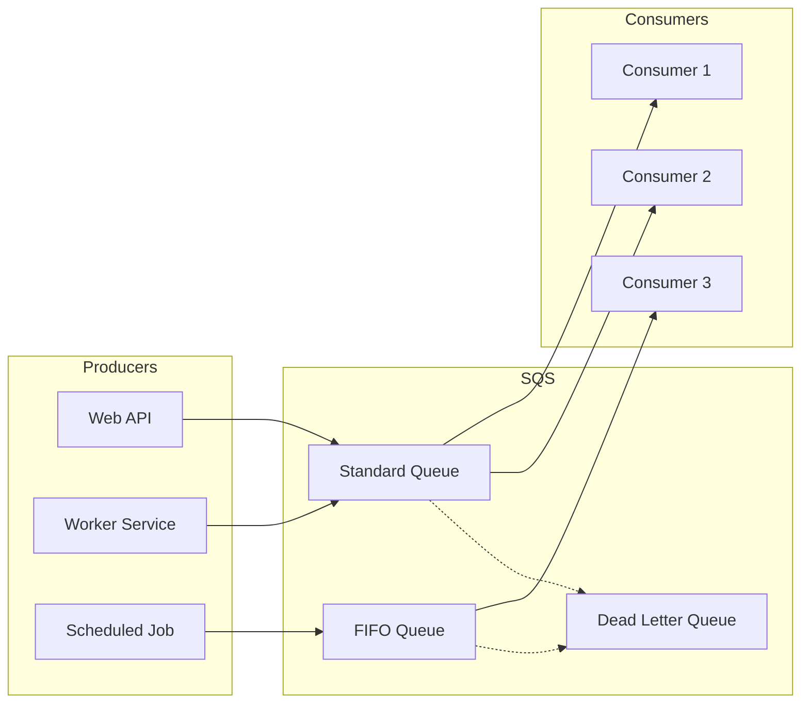
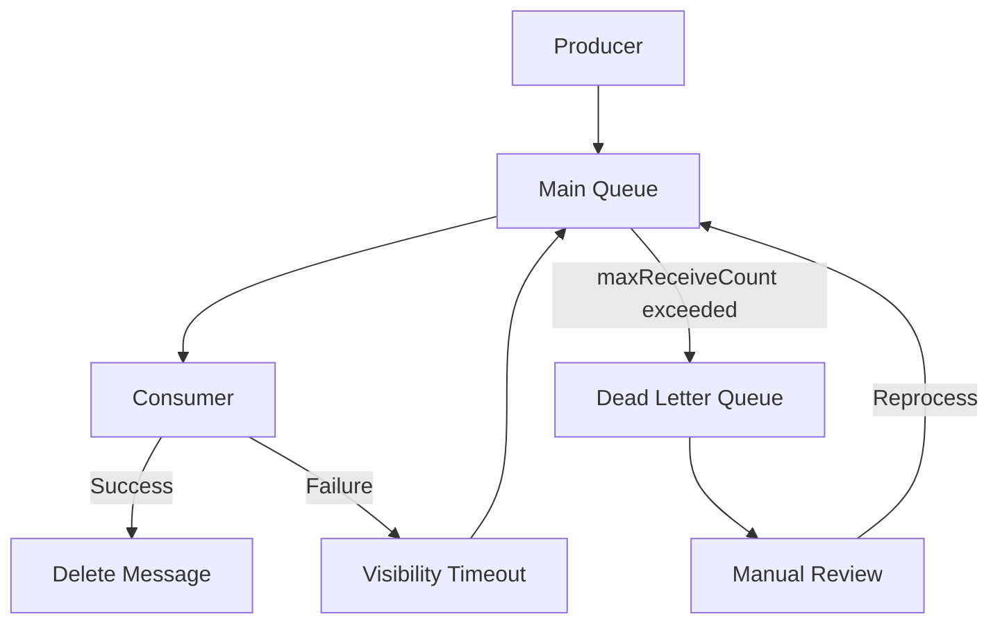
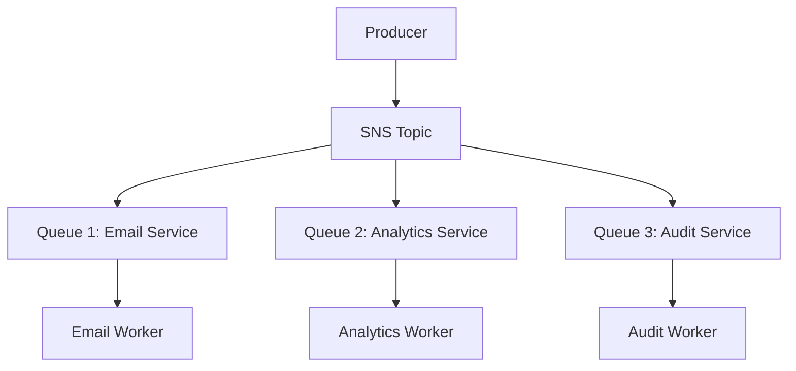

# How to Use SQS with Python (boto3)

Author: [nawazdhandala](https://www.github.com/nawazdhandala)

Tags: AWS, SQS, Python, boto3, Message Queue, Distributed Systems, Cloud

Description: Learn how to use Amazon SQS with Python and boto3. Covers queue creation, sending and receiving messages, dead letter queues, FIFO queues, and production best practices for reliable message processing.

---

> Amazon Simple Queue Service (SQS) provides fully managed message queuing for decoupling and scaling microservices. Combined with Python's boto3 library, you can build reliable, scalable distributed systems without managing message broker infrastructure.

SQS handles the complexity of distributed messaging while boto3 provides a clean Pythonic interface. Together, they enable robust asynchronous communication between services.

---

## Architecture Overview

The following diagram illustrates how SQS fits into a typical distributed system architecture:



---

## Getting Started

### Installation

Install boto3, the AWS SDK for Python:

```bash
pip install boto3
```

### AWS Configuration

Configure your AWS credentials before using boto3. You can use environment variables, AWS credentials file, or IAM roles:

```bash
# Using environment variables
export AWS_ACCESS_KEY_ID=your_access_key
export AWS_SECRET_ACCESS_KEY=your_secret_key
export AWS_DEFAULT_REGION=us-east-1

# Or configure using AWS CLI
aws configure
```

### Basic Client Setup

Create an SQS client with proper configuration for production use:

```python
# sqs_client.py
import boto3
from botocore.config import Config

# Configure retry behavior for resilience
config = Config(
    retries={
        'max_attempts': 3,          # Retry up to 3 times
        'mode': 'exponential'       # Use exponential backoff
    },
    connect_timeout=5,              # Connection timeout in seconds
    read_timeout=10                 # Read timeout in seconds
)

# Create SQS client with configuration
sqs = boto3.client(
    'sqs',
    region_name='us-east-1',
    config=config
)

# Or create SQS resource for object-oriented interface
sqs_resource = boto3.resource(
    'sqs',
    region_name='us-east-1',
    config=config
)
```

---

## Creating Queues

### Standard Queue

Standard queues offer maximum throughput with best-effort ordering:

```python
import boto3

sqs = boto3.client('sqs', region_name='us-east-1')

# Create a standard queue with custom settings
response = sqs.create_queue(
    QueueName='my-application-queue',
    Attributes={
        # Message retention period (4 days in seconds)
        'MessageRetentionPeriod': '345600',

        # Visibility timeout - how long a message is hidden after being received
        'VisibilityTimeout': '60',

        # Long polling wait time - reduces empty receives and cost
        'ReceiveMessageWaitTimeSeconds': '20',

        # Maximum message size (256 KB)
        'MaximumMessageSize': '262144'
    }
)

queue_url = response['QueueUrl']
print(f"Queue created: {queue_url}")
```

### FIFO Queue

FIFO queues guarantee exactly-once processing and strict ordering:

```python
# Create a FIFO queue - name must end with .fifo
response = sqs.create_queue(
    QueueName='my-application-queue.fifo',
    Attributes={
        # Enable FIFO queue
        'FifoQueue': 'true',

        # Enable content-based deduplication
        # SQS uses SHA-256 hash of message body for deduplication
        'ContentBasedDeduplication': 'true',

        # Standard settings
        'MessageRetentionPeriod': '345600',
        'VisibilityTimeout': '60',
        'ReceiveMessageWaitTimeSeconds': '20'
    }
)

fifo_queue_url = response['QueueUrl']
print(f"FIFO Queue created: {fifo_queue_url}")
```

### Dead Letter Queue Setup

Dead letter queues capture messages that fail processing after multiple attempts:

```python
# First, create the dead letter queue
dlq_response = sqs.create_queue(
    QueueName='my-application-dlq',
    Attributes={
        'MessageRetentionPeriod': '1209600'  # 14 days for investigation
    }
)
dlq_url = dlq_response['QueueUrl']

# Get the DLQ ARN (needed for redrive policy)
dlq_attributes = sqs.get_queue_attributes(
    QueueUrl=dlq_url,
    AttributeNames=['QueueArn']
)
dlq_arn = dlq_attributes['Attributes']['QueueArn']

# Create main queue with redrive policy pointing to DLQ
import json

main_queue_response = sqs.create_queue(
    QueueName='my-application-queue',
    Attributes={
        'MessageRetentionPeriod': '345600',
        'VisibilityTimeout': '60',
        'ReceiveMessageWaitTimeSeconds': '20',
        # Redrive policy - send to DLQ after 3 failed processing attempts
        'RedrivePolicy': json.dumps({
            'deadLetterTargetArn': dlq_arn,
            'maxReceiveCount': 3  # Move to DLQ after 3 receives
        })
    }
)

main_queue_url = main_queue_response['QueueUrl']
print(f"Main queue with DLQ configured: {main_queue_url}")
```

The following diagram shows the dead letter queue flow:



---

## Sending Messages

### Send Single Message

Send a message with optional attributes for metadata:

```python
import json
import boto3

sqs = boto3.client('sqs', region_name='us-east-1')
queue_url = 'https://sqs.us-east-1.amazonaws.com/123456789012/my-queue'

# Send a simple message
response = sqs.send_message(
    QueueUrl=queue_url,
    MessageBody=json.dumps({
        'order_id': 'ORD-12345',
        'customer_id': 'CUST-67890',
        'amount': 99.99,
        'items': ['item1', 'item2']
    }),
    # Message attributes for filtering and routing
    MessageAttributes={
        'MessageType': {
            'DataType': 'String',
            'StringValue': 'OrderCreated'
        },
        'Priority': {
            'DataType': 'Number',
            'StringValue': '1'
        }
    },
    # Delay delivery by 30 seconds
    DelaySeconds=30
)

print(f"Message sent with ID: {response['MessageId']}")
print(f"MD5 of body: {response['MD5OfMessageBody']}")
```

### Send to FIFO Queue

FIFO queues require MessageGroupId and optionally MessageDeduplicationId:

```python
# Send message to FIFO queue
response = sqs.send_message(
    QueueUrl=fifo_queue_url,
    MessageBody=json.dumps({
        'order_id': 'ORD-12345',
        'action': 'process_payment'
    }),
    # Messages with same group ID are processed in order
    MessageGroupId='order-ORD-12345',
    # Deduplication ID prevents duplicate messages within 5 minutes
    # Not needed if ContentBasedDeduplication is enabled
    MessageDeduplicationId='ORD-12345-payment-001',
    MessageAttributes={
        'EventType': {
            'DataType': 'String',
            'StringValue': 'PaymentProcessing'
        }
    }
)

print(f"FIFO message sent: {response['MessageId']}")
print(f"Sequence number: {response['SequenceNumber']}")
```

### Batch Send Messages

Batch sending improves throughput and reduces costs:

```python
# Prepare batch of messages (max 10 per batch)
messages = [
    {
        'Id': f'msg-{i}',  # Unique ID within the batch
        'MessageBody': json.dumps({
            'task_id': f'TASK-{i}',
            'data': f'payload-{i}'
        }),
        'MessageAttributes': {
            'BatchIndex': {
                'DataType': 'Number',
                'StringValue': str(i)
            }
        }
    }
    for i in range(10)
]

# Send batch
response = sqs.send_message_batch(
    QueueUrl=queue_url,
    Entries=messages
)

# Check for successful sends
for success in response.get('Successful', []):
    print(f"Sent: {success['Id']} - MessageId: {success['MessageId']}")

# Check for failures
for failure in response.get('Failed', []):
    print(f"Failed: {failure['Id']} - {failure['Message']}")
```

---

## Receiving Messages

### Basic Message Polling

Receive and process messages with proper error handling:

```python
import json
import boto3
from botocore.exceptions import ClientError

sqs = boto3.client('sqs', region_name='us-east-1')
queue_url = 'https://sqs.us-east-1.amazonaws.com/123456789012/my-queue'

def process_message(message):
    """Process a single message - implement your business logic here."""
    body = json.loads(message['Body'])
    print(f"Processing: {body}")
    # Your processing logic here
    return True

def receive_messages():
    """Receive and process messages from the queue."""
    try:
        response = sqs.receive_message(
            QueueUrl=queue_url,
            MaxNumberOfMessages=10,         # Max messages to receive (1-10)
            WaitTimeSeconds=20,             # Long polling - wait up to 20s
            VisibilityTimeout=60,           # Hide message for 60s while processing
            MessageAttributeNames=['All'],  # Receive all message attributes
            AttributeNames=['All']          # Receive all system attributes
        )

        messages = response.get('Messages', [])

        if not messages:
            print("No messages received")
            return

        for message in messages:
            try:
                # Process the message
                if process_message(message):
                    # Delete message after successful processing
                    sqs.delete_message(
                        QueueUrl=queue_url,
                        ReceiptHandle=message['ReceiptHandle']
                    )
                    print(f"Deleted message: {message['MessageId']}")
            except Exception as e:
                print(f"Error processing message: {e}")
                # Message will become visible again after VisibilityTimeout

    except ClientError as e:
        print(f"Error receiving messages: {e}")

# Call the function
receive_messages()
```

### Continuous Polling Worker

Create a robust worker that continuously processes messages:

```python
import json
import time
import signal
import sys
import boto3
from botocore.exceptions import ClientError

class SQSWorker:
    """Robust SQS message processor with graceful shutdown."""

    def __init__(self, queue_url, region='us-east-1'):
        self.queue_url = queue_url
        self.sqs = boto3.client('sqs', region_name=region)
        self.running = True

        # Register signal handlers for graceful shutdown
        signal.signal(signal.SIGINT, self._shutdown_handler)
        signal.signal(signal.SIGTERM, self._shutdown_handler)

    def _shutdown_handler(self, signum, frame):
        """Handle shutdown signals gracefully."""
        print("\nShutdown signal received, finishing current batch...")
        self.running = False

    def process_message(self, message):
        """
        Override in subclass to implement message processing.
        Return True for success, False for failure.
        """
        body = json.loads(message['Body'])
        print(f"Processing message: {body}")
        # Implement your processing logic
        return True

    def run(self):
        """Main worker loop."""
        print(f"Worker started, listening to {self.queue_url}")

        while self.running:
            try:
                # Long poll for messages
                response = self.sqs.receive_message(
                    QueueUrl=self.queue_url,
                    MaxNumberOfMessages=10,
                    WaitTimeSeconds=20,
                    VisibilityTimeout=60,
                    MessageAttributeNames=['All']
                )

                messages = response.get('Messages', [])

                for message in messages:
                    if not self.running:
                        break

                    try:
                        success = self.process_message(message)

                        if success:
                            self.sqs.delete_message(
                                QueueUrl=self.queue_url,
                                ReceiptHandle=message['ReceiptHandle']
                            )
                        else:
                            # Optionally change visibility timeout for retry
                            self.sqs.change_message_visibility(
                                QueueUrl=self.queue_url,
                                ReceiptHandle=message['ReceiptHandle'],
                                VisibilityTimeout=0  # Make immediately visible
                            )

                    except Exception as e:
                        print(f"Error processing message {message['MessageId']}: {e}")

            except ClientError as e:
                print(f"SQS error: {e}")
                time.sleep(5)  # Back off on errors

            except Exception as e:
                print(f"Unexpected error: {e}")
                time.sleep(5)

        print("Worker stopped")

# Usage
if __name__ == '__main__':
    queue_url = 'https://sqs.us-east-1.amazonaws.com/123456789012/my-queue'
    worker = SQSWorker(queue_url)
    worker.run()
```

### Batch Delete Messages

Delete multiple messages efficiently after processing:

```python
def process_and_delete_batch(queue_url, messages):
    """Process messages and delete them in a batch."""
    successful_receipts = []

    for message in messages:
        try:
            if process_message(message):
                successful_receipts.append({
                    'Id': message['MessageId'],
                    'ReceiptHandle': message['ReceiptHandle']
                })
        except Exception as e:
            print(f"Failed to process {message['MessageId']}: {e}")

    # Batch delete successful messages
    if successful_receipts:
        response = sqs.delete_message_batch(
            QueueUrl=queue_url,
            Entries=successful_receipts
        )

        deleted = len(response.get('Successful', []))
        failed = len(response.get('Failed', []))
        print(f"Deleted {deleted} messages, {failed} failed")

        # Handle delete failures
        for failure in response.get('Failed', []):
            print(f"Delete failed for {failure['Id']}: {failure['Message']}")
```

---

## Message Visibility and Timeout Management

### Extend Visibility Timeout

Extend the visibility timeout for long-running processing:

```python
def process_with_heartbeat(queue_url, message, timeout_seconds=60):
    """
    Process message with visibility timeout heartbeat.
    Useful for tasks that may take longer than the initial timeout.
    """
    import threading

    receipt_handle = message['ReceiptHandle']
    processing_complete = threading.Event()

    def heartbeat():
        """Extend visibility timeout periodically."""
        while not processing_complete.is_set():
            # Wait for half the timeout before extending
            if processing_complete.wait(timeout=timeout_seconds // 2):
                break  # Processing complete, stop heartbeat

            try:
                sqs.change_message_visibility(
                    QueueUrl=queue_url,
                    ReceiptHandle=receipt_handle,
                    VisibilityTimeout=timeout_seconds
                )
                print(f"Extended visibility for {message['MessageId']}")
            except ClientError as e:
                print(f"Failed to extend visibility: {e}")
                break

    # Start heartbeat thread
    heartbeat_thread = threading.Thread(target=heartbeat, daemon=True)
    heartbeat_thread.start()

    try:
        # Your long-running processing here
        result = process_long_running_task(message)
        return result
    finally:
        # Signal completion and wait for heartbeat to stop
        processing_complete.set()
        heartbeat_thread.join(timeout=5)
```

---

## Dead Letter Queue Processing

### Process DLQ Messages

Inspect and reprocess messages from the dead letter queue:

```python
import json
import boto3
from datetime import datetime

sqs = boto3.client('sqs', region_name='us-east-1')

dlq_url = 'https://sqs.us-east-1.amazonaws.com/123456789012/my-dlq'
main_queue_url = 'https://sqs.us-east-1.amazonaws.com/123456789012/my-queue'

def inspect_dlq_messages(max_messages=10):
    """Inspect messages in the dead letter queue without removing them."""
    response = sqs.receive_message(
        QueueUrl=dlq_url,
        MaxNumberOfMessages=max_messages,
        WaitTimeSeconds=5,
        MessageAttributeNames=['All'],
        AttributeNames=['All']
    )

    messages = response.get('Messages', [])

    for msg in messages:
        body = json.loads(msg['Body'])
        attributes = msg.get('Attributes', {})

        print(f"\n--- Message: {msg['MessageId']} ---")
        print(f"Body: {json.dumps(body, indent=2)}")
        print(f"Receive count: {attributes.get('ApproximateReceiveCount')}")
        print(f"First received: {attributes.get('ApproximateFirstReceiveTimestamp')}")

        # Change visibility back to 0 so message remains in queue
        sqs.change_message_visibility(
            QueueUrl=dlq_url,
            ReceiptHandle=msg['ReceiptHandle'],
            VisibilityTimeout=0
        )

    return messages

def reprocess_dlq_message(message, delete_from_dlq=True):
    """Move a message from DLQ back to main queue for reprocessing."""
    # Send to main queue
    body = message['Body']

    response = sqs.send_message(
        QueueUrl=main_queue_url,
        MessageBody=body,
        MessageAttributes={
            'ReprocessedAt': {
                'DataType': 'String',
                'StringValue': datetime.utcnow().isoformat()
            },
            'OriginalMessageId': {
                'DataType': 'String',
                'StringValue': message['MessageId']
            }
        }
    )

    if delete_from_dlq:
        sqs.delete_message(
            QueueUrl=dlq_url,
            ReceiptHandle=message['ReceiptHandle']
        )

    print(f"Reprocessed message {message['MessageId']} as {response['MessageId']}")
    return response

def reprocess_all_dlq_messages():
    """Reprocess all messages in the DLQ."""
    total_reprocessed = 0

    while True:
        response = sqs.receive_message(
            QueueUrl=dlq_url,
            MaxNumberOfMessages=10,
            WaitTimeSeconds=5
        )

        messages = response.get('Messages', [])

        if not messages:
            break

        for message in messages:
            reprocess_dlq_message(message)
            total_reprocessed += 1

    print(f"Total messages reprocessed: {total_reprocessed}")
```

---

## Queue Management

### Get Queue Attributes

Monitor queue health and configuration:

```python
def get_queue_stats(queue_url):
    """Get queue statistics and configuration."""
    response = sqs.get_queue_attributes(
        QueueUrl=queue_url,
        AttributeNames=['All']
    )

    attrs = response['Attributes']

    stats = {
        'messages_available': int(attrs.get('ApproximateNumberOfMessages', 0)),
        'messages_in_flight': int(attrs.get('ApproximateNumberOfMessagesNotVisible', 0)),
        'messages_delayed': int(attrs.get('ApproximateNumberOfMessagesDelayed', 0)),
        'visibility_timeout': int(attrs.get('VisibilityTimeout', 0)),
        'retention_period': int(attrs.get('MessageRetentionPeriod', 0)),
        'max_message_size': int(attrs.get('MaximumMessageSize', 0)),
        'created_timestamp': attrs.get('CreatedTimestamp'),
        'last_modified': attrs.get('LastModifiedTimestamp'),
        'queue_arn': attrs.get('QueueArn')
    }

    print(f"Queue: {queue_url}")
    print(f"  Messages available: {stats['messages_available']}")
    print(f"  Messages in flight: {stats['messages_in_flight']}")
    print(f"  Messages delayed: {stats['messages_delayed']}")
    print(f"  Visibility timeout: {stats['visibility_timeout']}s")

    return stats

# Monitor queue
stats = get_queue_stats(queue_url)
```

### Purge Queue

Remove all messages from a queue:

```python
def purge_queue(queue_url, confirm=False):
    """
    Purge all messages from a queue.
    Warning: Purge can only be called once every 60 seconds.
    """
    if not confirm:
        print("Purge not confirmed. Set confirm=True to purge.")
        return False

    try:
        sqs.purge_queue(QueueUrl=queue_url)
        print(f"Queue purged: {queue_url}")
        return True
    except ClientError as e:
        if e.response['Error']['Code'] == 'AWS.SimpleQueueService.PurgeQueueInProgress':
            print("Purge already in progress, wait 60 seconds")
        else:
            print(f"Purge failed: {e}")
        return False

# Purge with confirmation
purge_queue(queue_url, confirm=True)
```

### List All Queues

Discover queues in your account:

```python
def list_queues(prefix=None):
    """List all queues, optionally filtered by prefix."""
    params = {}
    if prefix:
        params['QueueNamePrefix'] = prefix

    response = sqs.list_queues(**params)

    queues = response.get('QueueUrls', [])

    for queue_url in queues:
        queue_name = queue_url.split('/')[-1]
        print(f"  {queue_name}: {queue_url}")

    return queues

# List all queues
all_queues = list_queues()

# List queues with prefix
app_queues = list_queues(prefix='my-application')
```

---

## Message Processing Patterns

### Fan-Out Pattern

Combine SQS with SNS for fan-out messaging:



### Request-Response Pattern

Implement request-response using temporary queues:

```python
import uuid
import json
import boto3

class SQSRequestResponse:
    """Request-response pattern using SQS temporary queues."""

    def __init__(self, request_queue_url, region='us-east-1'):
        self.sqs = boto3.client('sqs', region_name=region)
        self.request_queue_url = request_queue_url

    def send_request(self, request_data, timeout=30):
        """Send request and wait for response."""
        # Create temporary response queue
        correlation_id = str(uuid.uuid4())
        response_queue_name = f'response-{correlation_id}'

        response_queue = self.sqs.create_queue(
            QueueName=response_queue_name,
            Attributes={
                'MessageRetentionPeriod': '300',  # 5 minutes
                'ReceiveMessageWaitTimeSeconds': '20'
            }
        )
        response_queue_url = response_queue['QueueUrl']

        try:
            # Send request with correlation ID and response queue
            self.sqs.send_message(
                QueueUrl=self.request_queue_url,
                MessageBody=json.dumps(request_data),
                MessageAttributes={
                    'CorrelationId': {
                        'DataType': 'String',
                        'StringValue': correlation_id
                    },
                    'ResponseQueueUrl': {
                        'DataType': 'String',
                        'StringValue': response_queue_url
                    }
                }
            )

            # Wait for response
            response = self.sqs.receive_message(
                QueueUrl=response_queue_url,
                MaxNumberOfMessages=1,
                WaitTimeSeconds=min(timeout, 20)
            )

            messages = response.get('Messages', [])
            if messages:
                return json.loads(messages[0]['Body'])

            return None

        finally:
            # Clean up temporary queue
            self.sqs.delete_queue(QueueUrl=response_queue_url)

# Usage
rpc = SQSRequestResponse('https://sqs.../request-queue')
response = rpc.send_request({'action': 'get_user', 'user_id': '123'})
```

---

## Error Handling and Resilience

### Comprehensive Error Handling

Handle various SQS error scenarios:

```python
from botocore.exceptions import ClientError, BotoCoreError
import time

def send_with_retry(queue_url, message_body, max_retries=3):
    """Send message with comprehensive error handling and retries."""

    for attempt in range(max_retries):
        try:
            response = sqs.send_message(
                QueueUrl=queue_url,
                MessageBody=message_body
            )
            return response

        except ClientError as e:
            error_code = e.response['Error']['Code']

            if error_code == 'AWS.SimpleQueueService.NonExistentQueue':
                raise ValueError(f"Queue does not exist: {queue_url}")

            elif error_code == 'InvalidParameterValue':
                raise ValueError(f"Invalid message: {e}")

            elif error_code == 'RequestThrottled':
                # Back off and retry on throttling
                wait_time = (2 ** attempt) + (time.time() % 1)
                print(f"Throttled, waiting {wait_time:.2f}s before retry")
                time.sleep(wait_time)
                continue

            elif error_code in ['ServiceUnavailable', 'InternalError']:
                # Transient error, retry
                wait_time = 2 ** attempt
                print(f"Service error, retrying in {wait_time}s")
                time.sleep(wait_time)
                continue

            else:
                raise

        except BotoCoreError as e:
            # Network or connection error
            wait_time = 2 ** attempt
            print(f"Connection error: {e}, retrying in {wait_time}s")
            time.sleep(wait_time)

    raise RuntimeError(f"Failed to send message after {max_retries} attempts")
```

---

## Testing with LocalStack

Test SQS locally using LocalStack:

```python
import boto3

# Configure boto3 to use LocalStack
sqs_local = boto3.client(
    'sqs',
    endpoint_url='http://localhost:4566',  # LocalStack endpoint
    region_name='us-east-1',
    aws_access_key_id='test',
    aws_secret_access_key='test'
)

# Create queue for testing
response = sqs_local.create_queue(QueueName='test-queue')
queue_url = response['QueueUrl']

# Send test message
sqs_local.send_message(
    QueueUrl=queue_url,
    MessageBody='{"test": "message"}'
)

# Receive and verify
response = sqs_local.receive_message(
    QueueUrl=queue_url,
    MaxNumberOfMessages=1
)

print(f"Received: {response['Messages'][0]['Body']}")
```

Run LocalStack with Docker:

```bash
docker run -d -p 4566:4566 localstack/localstack
```

---

## Production Best Practices

### Configuration Recommendations

Follow these practices for production deployments:

```python
# Production configuration example
PRODUCTION_CONFIG = {
    # Use long polling to reduce costs and improve responsiveness
    'ReceiveMessageWaitTimeSeconds': '20',

    # Set visibility timeout based on processing time (add buffer)
    # If average processing is 30s, set to 60-90s
    'VisibilityTimeout': '90',

    # Retain messages for appropriate duration
    # Default: 4 days, Max: 14 days
    'MessageRetentionPeriod': '345600',

    # Enable server-side encryption
    'KmsMasterKeyId': 'alias/aws/sqs',  # Use AWS managed key
    'KmsDataKeyReusePeriodSeconds': '300'
}
```

### Monitoring Metrics

Track essential CloudWatch metrics:

```python
import boto3
from datetime import datetime, timedelta

cloudwatch = boto3.client('cloudwatch', region_name='us-east-1')

def get_queue_metrics(queue_name, period_minutes=5):
    """Get key SQS metrics from CloudWatch."""
    end_time = datetime.utcnow()
    start_time = end_time - timedelta(minutes=period_minutes)

    metrics_to_fetch = [
        'ApproximateNumberOfMessagesVisible',
        'ApproximateNumberOfMessagesNotVisible',
        'ApproximateNumberOfMessagesDelayed',
        'NumberOfMessagesSent',
        'NumberOfMessagesReceived',
        'NumberOfMessagesDeleted',
        'ApproximateAgeOfOldestMessage'
    ]

    results = {}

    for metric_name in metrics_to_fetch:
        response = cloudwatch.get_metric_statistics(
            Namespace='AWS/SQS',
            MetricName=metric_name,
            Dimensions=[
                {'Name': 'QueueName', 'Value': queue_name}
            ],
            StartTime=start_time,
            EndTime=end_time,
            Period=60,
            Statistics=['Average', 'Maximum']
        )

        datapoints = response.get('Datapoints', [])
        if datapoints:
            latest = max(datapoints, key=lambda x: x['Timestamp'])
            results[metric_name] = {
                'average': latest.get('Average'),
                'maximum': latest.get('Maximum')
            }

    return results

# Monitor your queue
metrics = get_queue_metrics('my-application-queue')
print(f"Messages visible: {metrics.get('ApproximateNumberOfMessagesVisible')}")
print(f"Oldest message age: {metrics.get('ApproximateAgeOfOldestMessage')}")
```

### Cost Optimization

Optimize SQS costs with these strategies:

1. **Use long polling** - Reduces empty receives
2. **Batch operations** - Send and delete up to 10 messages per API call
3. **Right-size visibility timeout** - Avoid unnecessary re-processing
4. **Monitor queue depth** - Scale consumers appropriately

---

## Complete Example Application

Here is a complete order processing application:

```python
# order_processor.py
import json
import boto3
import logging
from datetime import datetime
from botocore.exceptions import ClientError

logging.basicConfig(level=logging.INFO)
logger = logging.getLogger(__name__)

class OrderProcessor:
    """Complete order processing system using SQS."""

    def __init__(self, region='us-east-1'):
        self.sqs = boto3.client('sqs', region_name=region)
        self.queue_url = None
        self.dlq_url = None

    def setup_queues(self, queue_name):
        """Create main queue and DLQ with proper configuration."""
        # Create DLQ first
        dlq_response = self.sqs.create_queue(
            QueueName=f'{queue_name}-dlq',
            Attributes={'MessageRetentionPeriod': '1209600'}
        )
        self.dlq_url = dlq_response['QueueUrl']

        # Get DLQ ARN
        dlq_attrs = self.sqs.get_queue_attributes(
            QueueUrl=self.dlq_url,
            AttributeNames=['QueueArn']
        )
        dlq_arn = dlq_attrs['Attributes']['QueueArn']

        # Create main queue with DLQ
        main_response = self.sqs.create_queue(
            QueueName=queue_name,
            Attributes={
                'VisibilityTimeout': '60',
                'ReceiveMessageWaitTimeSeconds': '20',
                'RedrivePolicy': json.dumps({
                    'deadLetterTargetArn': dlq_arn,
                    'maxReceiveCount': 3
                })
            }
        )
        self.queue_url = main_response['QueueUrl']

        logger.info(f"Queues created: {queue_name}")

    def submit_order(self, order):
        """Submit an order for processing."""
        response = self.sqs.send_message(
            QueueUrl=self.queue_url,
            MessageBody=json.dumps(order),
            MessageAttributes={
                'OrderType': {
                    'DataType': 'String',
                    'StringValue': order.get('type', 'standard')
                },
                'SubmittedAt': {
                    'DataType': 'String',
                    'StringValue': datetime.utcnow().isoformat()
                }
            }
        )
        logger.info(f"Order submitted: {response['MessageId']}")
        return response['MessageId']

    def process_orders(self):
        """Process orders from the queue."""
        while True:
            response = self.sqs.receive_message(
                QueueUrl=self.queue_url,
                MaxNumberOfMessages=10,
                WaitTimeSeconds=20,
                MessageAttributeNames=['All']
            )

            messages = response.get('Messages', [])

            for message in messages:
                try:
                    order = json.loads(message['Body'])
                    logger.info(f"Processing order: {order.get('order_id')}")

                    # Process the order (your business logic)
                    self._process_single_order(order)

                    # Delete on success
                    self.sqs.delete_message(
                        QueueUrl=self.queue_url,
                        ReceiptHandle=message['ReceiptHandle']
                    )
                    logger.info(f"Order completed: {order.get('order_id')}")

                except Exception as e:
                    logger.error(f"Order processing failed: {e}")
                    # Message will return to queue after visibility timeout

    def _process_single_order(self, order):
        """Process a single order - implement business logic."""
        # Validate order
        if not order.get('order_id'):
            raise ValueError("Missing order_id")

        # Process payment, update inventory, send notifications, etc.
        logger.info(f"Order {order['order_id']} processed successfully")

# Usage
if __name__ == '__main__':
    processor = OrderProcessor()
    processor.setup_queues('orders')

    # Submit sample order
    processor.submit_order({
        'order_id': 'ORD-001',
        'customer_id': 'CUST-123',
        'items': [{'sku': 'ITEM-1', 'quantity': 2}],
        'total': 59.99
    })

    # Start processing
    processor.process_orders()
```

---

## Conclusion

Amazon SQS with boto3 provides a powerful foundation for building distributed systems in Python. Key takeaways:

- **Standard queues** offer maximum throughput, while **FIFO queues** guarantee ordering
- **Dead letter queues** capture failed messages for investigation
- **Long polling** reduces costs and improves responsiveness
- **Batch operations** improve throughput and reduce API calls
- **Proper visibility timeout** prevents duplicate processing

---

*Need to monitor your SQS queues and message processing? [OneUptime](https://oneuptime.com) provides comprehensive monitoring for distributed systems with queue depth tracking and alerting.*
