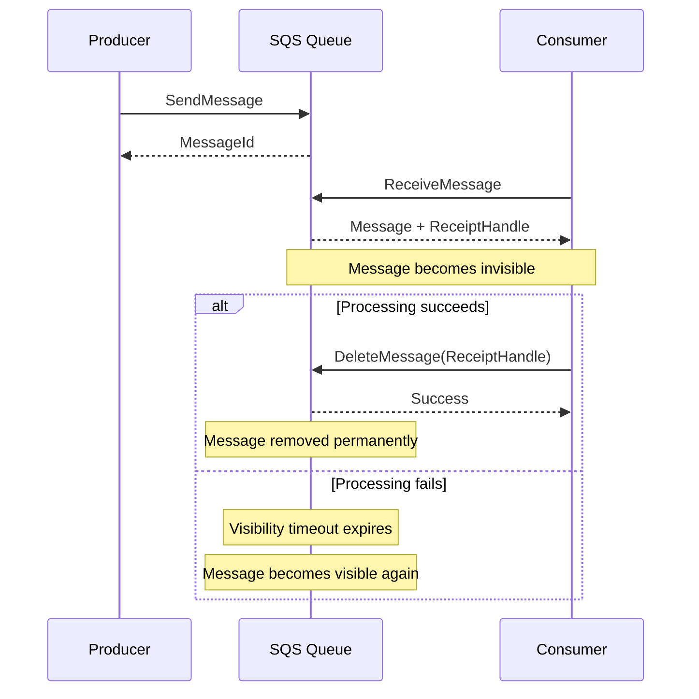
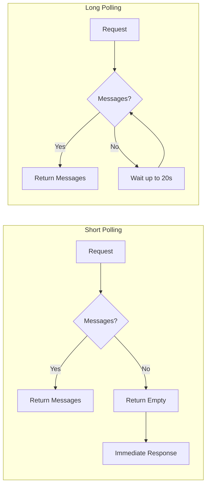
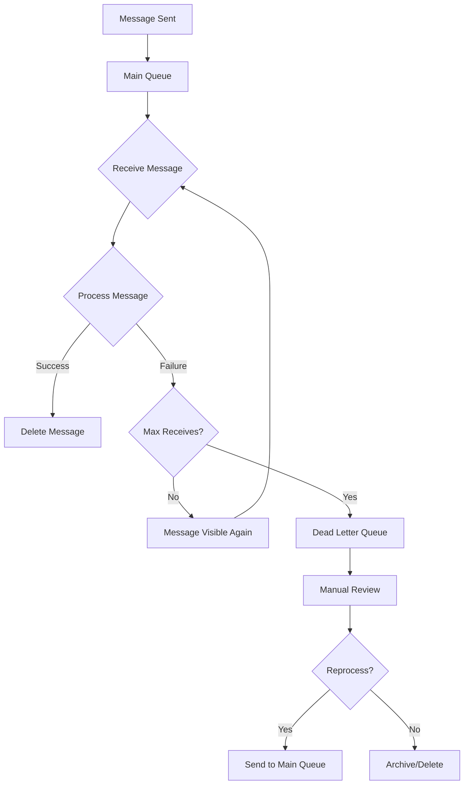
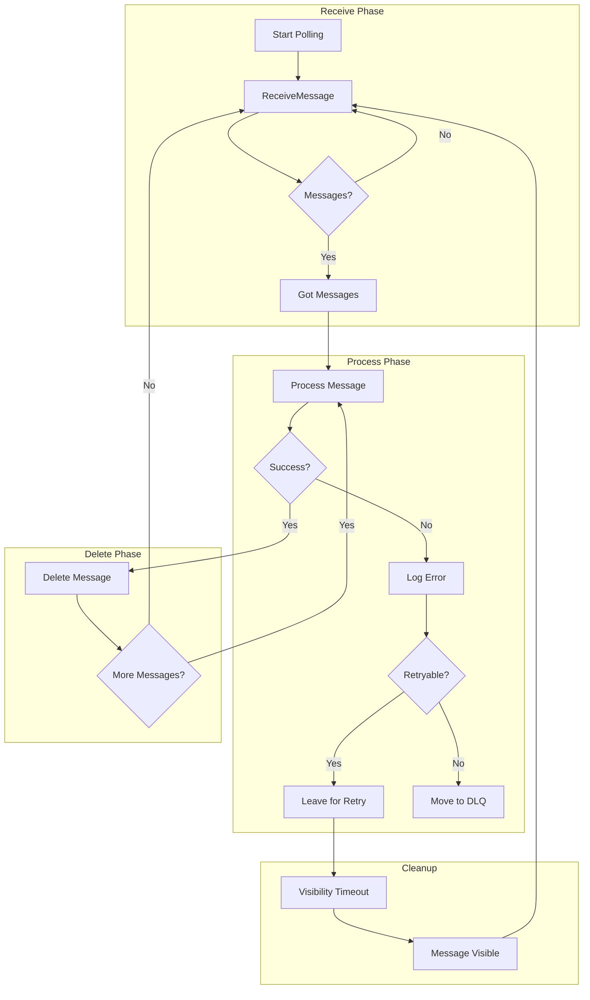

# How to Receive and Delete Messages from SQS

Author: [nawazdhandala](https://github.com/nawazdhandala)

Tags: SQS, AWS, Message Queue, Node.js, Python, Distributed Systems

Description: Learn how to receive and delete messages from Amazon SQS, covering long polling, visibility timeout, batch operations, error handling, and best practices for reliable message processing.

---

Amazon Simple Queue Service (SQS) is a fully managed message queuing service that enables decoupling of distributed systems. Processing messages correctly requires understanding how to receive messages efficiently and delete them only after successful processing. Failing to handle these operations properly can lead to message loss or duplicate processing.

## Understanding SQS Message Lifecycle

Before diving into code, let's understand how messages flow through SQS and the critical points where things can go wrong.



## Key Concepts

Understanding these concepts prevents common pitfalls when working with SQS.

### Visibility Timeout

When a consumer receives a message, SQS hides it from other consumers for a configurable period called the visibility timeout. If your consumer doesn't delete the message before the timeout expires, the message becomes visible again and may be processed by another consumer.

### Receipt Handle

Every time you receive a message, SQS provides a receipt handle. You need the receipt handle to delete or change the visibility of a message. Receipt handles are temporary and change each time a message is received.

### Long Polling vs Short Polling

Short polling returns immediately even if no messages exist, while long polling waits up to 20 seconds for messages to arrive. Long polling reduces costs and latency.



## Setting Up AWS SDK

Install the required dependencies for your chosen language.

### Node.js Installation

Install the AWS SDK v3 for modular imports and smaller bundle sizes.

```bash
npm install @aws-sdk/client-sqs
```

### Python Installation

Install boto3, the official AWS SDK for Python.

```bash
pip install boto3
```

## Configuring the SQS Client

### Node.js Client Configuration

Create a reusable SQS client with proper configuration for your environment.

```javascript
// sqs-client.js
const { SQSClient } = require('@aws-sdk/client-sqs');

// Create the SQS client with region configuration
// The SDK automatically loads credentials from environment variables,
// AWS credentials file, or IAM role when running on AWS
const sqsClient = new SQSClient({
  region: process.env.AWS_REGION || 'us-east-1',
  // Optional: configure retry behavior
  maxAttempts: 3,
});

// Queue URL is required for all operations
// Format: https://sqs.{region}.amazonaws.com/{account-id}/{queue-name}
const QUEUE_URL = process.env.SQS_QUEUE_URL;

module.exports = { sqsClient, QUEUE_URL };
```

### Python Client Configuration

Set up the boto3 client with appropriate configuration.

```python
# sqs_client.py
import os
import boto3
from botocore.config import Config

# Configure retry behavior and timeouts
config = Config(
    region_name=os.environ.get('AWS_REGION', 'us-east-1'),
    retries={
        'max_attempts': 3,
        'mode': 'adaptive'
    },
    connect_timeout=5,
    read_timeout=25  # Longer than long polling wait time
)

# Create the SQS client
# Credentials are loaded automatically from environment variables,
# AWS credentials file, or IAM role
sqs_client = boto3.client('sqs', config=config)

# Queue URL for all operations
QUEUE_URL = os.environ.get('SQS_QUEUE_URL')
```

## Receiving Messages

### Basic Message Receive with Node.js

Receive messages using long polling for efficiency. Always specify WaitTimeSeconds to enable long polling.

```javascript
// receive-messages.js
const { ReceiveMessageCommand } = require('@aws-sdk/client-sqs');
const { sqsClient, QUEUE_URL } = require('./sqs-client');

async function receiveMessages(maxMessages = 10) {
  const params = {
    QueueUrl: QUEUE_URL,
    // Maximum number of messages to receive (1-10)
    MaxNumberOfMessages: maxMessages,
    // Enable long polling - wait up to 20 seconds for messages
    WaitTimeSeconds: 20,
    // Include all message attributes in the response
    MessageAttributeNames: ['All'],
    // Include system attributes like ApproximateReceiveCount
    AttributeNames: ['All'],
    // How long the message stays invisible after being received
    VisibilityTimeout: 30,
  };

  try {
    const command = new ReceiveMessageCommand(params);
    const response = await sqsClient.send(command);

    // Messages array may be undefined if no messages available
    const messages = response.Messages || [];

    console.log(`Received ${messages.length} messages`);
    return messages;
  } catch (error) {
    console.error('Error receiving messages:', error);
    throw error;
  }
}

// Example usage
async function main() {
  const messages = await receiveMessages();

  for (const message of messages) {
    console.log('Message ID:', message.MessageId);
    console.log('Body:', message.Body);
    console.log('Receipt Handle:', message.ReceiptHandle);
    console.log('Receive Count:', message.Attributes?.ApproximateReceiveCount);
  }
}
```

### Basic Message Receive with Python

Receive messages with long polling and attribute retrieval.

```python
# receive_messages.py
from sqs_client import sqs_client, QUEUE_URL

def receive_messages(max_messages=10):
    """
    Receive messages from SQS queue using long polling.

    Args:
        max_messages: Maximum number of messages to receive (1-10)

    Returns:
        List of message dictionaries
    """
    try:
        response = sqs_client.receive_message(
            QueueUrl=QUEUE_URL,
            # Maximum number of messages to receive
            MaxNumberOfMessages=max_messages,
            # Enable long polling - wait up to 20 seconds
            WaitTimeSeconds=20,
            # Include all message attributes
            MessageAttributeNames=['All'],
            # Include system attributes
            AttributeNames=['All'],
            # Visibility timeout in seconds
            VisibilityTimeout=30
        )

        # Messages key may not exist if no messages available
        messages = response.get('Messages', [])

        print(f'Received {len(messages)} messages')
        return messages

    except Exception as e:
        print(f'Error receiving messages: {e}')
        raise

# Example usage
if __name__ == '__main__':
    messages = receive_messages()

    for message in messages:
        print(f"Message ID: {message['MessageId']}")
        print(f"Body: {message['Body']}")
        print(f"Receipt Handle: {message['ReceiptHandle']}")
        print(f"Receive Count: {message['Attributes'].get('ApproximateReceiveCount')}")
```

## Deleting Messages

### Single Message Deletion with Node.js

Delete a message after successful processing using its receipt handle.

```javascript
// delete-message.js
const { DeleteMessageCommand } = require('@aws-sdk/client-sqs');
const { sqsClient, QUEUE_URL } = require('./sqs-client');

async function deleteMessage(receiptHandle) {
  const params = {
    QueueUrl: QUEUE_URL,
    // The receipt handle received when the message was retrieved
    ReceiptHandle: receiptHandle,
  };

  try {
    const command = new DeleteMessageCommand(params);
    await sqsClient.send(command);
    console.log('Message deleted successfully');
    return true;
  } catch (error) {
    // Handle specific error when receipt handle is invalid or expired
    if (error.name === 'ReceiptHandleIsInvalid') {
      console.error('Receipt handle is invalid or expired');
    } else {
      console.error('Error deleting message:', error);
    }
    throw error;
  }
}
```

### Single Message Deletion with Python

Delete a message using the receipt handle from the receive operation.

```python
# delete_message.py
from botocore.exceptions import ClientError
from sqs_client import sqs_client, QUEUE_URL

def delete_message(receipt_handle):
    """
    Delete a message from the queue after successful processing.

    Args:
        receipt_handle: The receipt handle from receive_message response

    Returns:
        True if deletion succeeded
    """
    try:
        sqs_client.delete_message(
            QueueUrl=QUEUE_URL,
            ReceiptHandle=receipt_handle
        )
        print('Message deleted successfully')
        return True

    except ClientError as e:
        error_code = e.response['Error']['Code']

        # Handle invalid or expired receipt handle
        if error_code == 'ReceiptHandleIsInvalid':
            print('Receipt handle is invalid or expired')
        else:
            print(f'Error deleting message: {e}')
        raise
```

## Complete Processing Pattern

### Receive-Process-Delete Pattern with Node.js

Implement a robust pattern that processes messages and deletes them only on success.

```javascript
// message-processor.js
const { ReceiveMessageCommand, DeleteMessageCommand } = require('@aws-sdk/client-sqs');
const { sqsClient, QUEUE_URL } = require('./sqs-client');

async function processMessage(message) {
  // Parse the message body - adjust based on your message format
  const body = JSON.parse(message.Body);

  // Your business logic here
  console.log('Processing message:', body);

  // Simulate processing time
  await new Promise(resolve => setTimeout(resolve, 1000));

  // Return processed result
  return { success: true, data: body };
}

async function receiveAndProcess() {
  const receiveParams = {
    QueueUrl: QUEUE_URL,
    MaxNumberOfMessages: 10,
    WaitTimeSeconds: 20,
    VisibilityTimeout: 60,  // Allow 60 seconds for processing
  };

  try {
    const command = new ReceiveMessageCommand(receiveParams);
    const response = await sqsClient.send(command);
    const messages = response.Messages || [];

    // Process each message individually
    for (const message of messages) {
      try {
        // Attempt to process the message
        await processMessage(message);

        // Only delete after successful processing
        const deleteCommand = new DeleteMessageCommand({
          QueueUrl: QUEUE_URL,
          ReceiptHandle: message.ReceiptHandle,
        });
        await sqsClient.send(deleteCommand);

        console.log(`Successfully processed and deleted message: ${message.MessageId}`);
      } catch (processError) {
        // Log the error but continue processing other messages
        // The message will become visible again after visibility timeout
        console.error(`Failed to process message ${message.MessageId}:`, processError);
      }
    }

    return messages.length;
  } catch (error) {
    console.error('Error in receive and process:', error);
    throw error;
  }
}

// Continuous polling loop
async function startPolling() {
  console.log('Starting message polling...');

  while (true) {
    try {
      const processedCount = await receiveAndProcess();

      if (processedCount === 0) {
        console.log('No messages received, continuing to poll...');
      }
    } catch (error) {
      // Wait before retrying after an error
      console.error('Polling error, waiting before retry:', error.message);
      await new Promise(resolve => setTimeout(resolve, 5000));
    }
  }
}
```

### Receive-Process-Delete Pattern with Python

Implement the same robust pattern in Python with proper error handling.

```python
# message_processor.py
import json
import time
from botocore.exceptions import ClientError
from sqs_client import sqs_client, QUEUE_URL

def process_message(message):
    """
    Process a single message - implement your business logic here.

    Args:
        message: The SQS message dictionary

    Returns:
        Processed result dictionary
    """
    # Parse the message body
    body = json.loads(message['Body'])

    # Your business logic here
    print(f"Processing message: {body}")

    # Simulate processing time
    time.sleep(1)

    return {'success': True, 'data': body}

def receive_and_process():
    """
    Receive messages from queue, process them, and delete on success.

    Returns:
        Number of messages processed
    """
    try:
        response = sqs_client.receive_message(
            QueueUrl=QUEUE_URL,
            MaxNumberOfMessages=10,
            WaitTimeSeconds=20,
            VisibilityTimeout=60  # Allow 60 seconds for processing
        )

        messages = response.get('Messages', [])

        # Process each message individually
        for message in messages:
            try:
                # Attempt to process the message
                process_message(message)

                # Only delete after successful processing
                sqs_client.delete_message(
                    QueueUrl=QUEUE_URL,
                    ReceiptHandle=message['ReceiptHandle']
                )

                print(f"Successfully processed and deleted: {message['MessageId']}")

            except Exception as process_error:
                # Log error but continue processing other messages
                # Message will become visible again after timeout
                print(f"Failed to process {message['MessageId']}: {process_error}")

        return len(messages)

    except ClientError as e:
        print(f"Error in receive and process: {e}")
        raise

def start_polling():
    """
    Continuously poll for and process messages.
    """
    print('Starting message polling...')

    while True:
        try:
            processed_count = receive_and_process()

            if processed_count == 0:
                print('No messages received, continuing to poll...')

        except Exception as e:
            # Wait before retrying after an error
            print(f'Polling error, waiting before retry: {e}')
            time.sleep(5)

if __name__ == '__main__':
    start_polling()
```

## Batch Deletion

### Batch Delete with Node.js

Delete multiple messages in a single API call for better efficiency.

```javascript
// batch-delete.js
const {
  ReceiveMessageCommand,
  DeleteMessageBatchCommand
} = require('@aws-sdk/client-sqs');
const { sqsClient, QUEUE_URL } = require('./sqs-client');

async function processAndDeleteBatch() {
  const receiveParams = {
    QueueUrl: QUEUE_URL,
    MaxNumberOfMessages: 10,
    WaitTimeSeconds: 20,
    VisibilityTimeout: 60,
  };

  const command = new ReceiveMessageCommand(receiveParams);
  const response = await sqsClient.send(command);
  const messages = response.Messages || [];

  if (messages.length === 0) {
    return { processed: 0, deleted: 0, failed: 0 };
  }

  // Track successfully processed messages
  const successfullyProcessed = [];
  const failedProcessing = [];

  // Process all messages
  for (const message of messages) {
    try {
      await processMessage(message);
      successfullyProcessed.push(message);
    } catch (error) {
      failedProcessing.push({ message, error });
    }
  }

  // Batch delete all successfully processed messages
  if (successfullyProcessed.length > 0) {
    const deleteParams = {
      QueueUrl: QUEUE_URL,
      // Each entry needs a unique Id and the ReceiptHandle
      Entries: successfullyProcessed.map((msg, index) => ({
        Id: `msg-${index}`,  // Unique identifier for this batch
        ReceiptHandle: msg.ReceiptHandle,
      })),
    };

    try {
      const deleteCommand = new DeleteMessageBatchCommand(deleteParams);
      const deleteResult = await sqsClient.send(deleteCommand);

      // Check for failed deletions
      if (deleteResult.Failed && deleteResult.Failed.length > 0) {
        console.error('Some deletions failed:', deleteResult.Failed);
      }

      console.log(`Batch deleted ${deleteResult.Successful?.length || 0} messages`);
    } catch (deleteError) {
      console.error('Batch delete failed:', deleteError);
    }
  }

  return {
    processed: messages.length,
    deleted: successfullyProcessed.length,
    failed: failedProcessing.length,
  };
}

async function processMessage(message) {
  const body = JSON.parse(message.Body);
  // Your processing logic here
  return body;
}
```

### Batch Delete with Python

Efficiently delete multiple messages using batch operations.

```python
# batch_delete.py
import json
from botocore.exceptions import ClientError
from sqs_client import sqs_client, QUEUE_URL

def process_and_delete_batch():
    """
    Process messages and delete successfully processed ones in batch.

    Returns:
        Dictionary with processed, deleted, and failed counts
    """
    response = sqs_client.receive_message(
        QueueUrl=QUEUE_URL,
        MaxNumberOfMessages=10,
        WaitTimeSeconds=20,
        VisibilityTimeout=60
    )

    messages = response.get('Messages', [])

    if not messages:
        return {'processed': 0, 'deleted': 0, 'failed': 0}

    # Track processing results
    successfully_processed = []
    failed_processing = []

    # Process all messages
    for message in messages:
        try:
            process_message(message)
            successfully_processed.append(message)
        except Exception as e:
            failed_processing.append({'message': message, 'error': str(e)})

    # Batch delete successfully processed messages
    if successfully_processed:
        entries = [
            {
                'Id': f'msg-{i}',  # Unique identifier for this batch
                'ReceiptHandle': msg['ReceiptHandle']
            }
            for i, msg in enumerate(successfully_processed)
        ]

        try:
            delete_response = sqs_client.delete_message_batch(
                QueueUrl=QUEUE_URL,
                Entries=entries
            )

            # Check for failed deletions
            if delete_response.get('Failed'):
                print(f"Some deletions failed: {delete_response['Failed']}")

            deleted_count = len(delete_response.get('Successful', []))
            print(f'Batch deleted {deleted_count} messages')

        except ClientError as e:
            print(f'Batch delete failed: {e}')
            deleted_count = 0
    else:
        deleted_count = 0

    return {
        'processed': len(messages),
        'deleted': deleted_count,
        'failed': len(failed_processing)
    }

def process_message(message):
    """Process a single message."""
    body = json.loads(message['Body'])
    # Your processing logic here
    return body
```

## Handling Visibility Timeout

### Extending Visibility Timeout with Node.js

Extend the visibility timeout when processing takes longer than expected.

```javascript
// visibility-timeout.js
const {
  ReceiveMessageCommand,
  ChangeMessageVisibilityCommand,
  DeleteMessageCommand
} = require('@aws-sdk/client-sqs');
const { sqsClient, QUEUE_URL } = require('./sqs-client');

async function processWithExtendedVisibility() {
  const receiveParams = {
    QueueUrl: QUEUE_URL,
    MaxNumberOfMessages: 1,
    WaitTimeSeconds: 20,
    VisibilityTimeout: 30,  // Initial 30 second timeout
  };

  const command = new ReceiveMessageCommand(receiveParams);
  const response = await sqsClient.send(command);
  const messages = response.Messages || [];

  if (messages.length === 0) {
    return null;
  }

  const message = messages[0];

  // Set up a timer to extend visibility before it expires
  const visibilityExtender = setInterval(async () => {
    try {
      const changeVisibilityCommand = new ChangeMessageVisibilityCommand({
        QueueUrl: QUEUE_URL,
        ReceiptHandle: message.ReceiptHandle,
        // Extend by another 30 seconds
        VisibilityTimeout: 30,
      });
      await sqsClient.send(changeVisibilityCommand);
      console.log('Extended visibility timeout');
    } catch (error) {
      console.error('Failed to extend visibility:', error);
    }
  }, 20000);  // Extend every 20 seconds (before 30 second timeout)

  try {
    // Process the message - this might take a long time
    await longRunningProcess(message);

    // Delete after successful processing
    const deleteCommand = new DeleteMessageCommand({
      QueueUrl: QUEUE_URL,
      ReceiptHandle: message.ReceiptHandle,
    });
    await sqsClient.send(deleteCommand);

    console.log('Message processed and deleted');
  } finally {
    // Always clear the visibility extender
    clearInterval(visibilityExtender);
  }
}

async function longRunningProcess(message) {
  // Simulate long-running task
  const body = JSON.parse(message.Body);
  console.log('Starting long-running process for:', body);

  // Simulate 2 minutes of processing
  await new Promise(resolve => setTimeout(resolve, 120000));

  console.log('Completed long-running process');
}
```

### Extending Visibility Timeout with Python

Handle long-running processes by extending visibility timeout.

```python
# visibility_timeout.py
import json
import threading
import time
from sqs_client import sqs_client, QUEUE_URL

def process_with_extended_visibility():
    """
    Process a message while automatically extending visibility timeout.
    """
    response = sqs_client.receive_message(
        QueueUrl=QUEUE_URL,
        MaxNumberOfMessages=1,
        WaitTimeSeconds=20,
        VisibilityTimeout=30  # Initial 30 second timeout
    )

    messages = response.get('Messages', [])

    if not messages:
        return None

    message = messages[0]
    stop_event = threading.Event()

    def extend_visibility():
        """Background thread to extend visibility timeout."""
        while not stop_event.is_set():
            # Wait 20 seconds before extending
            if stop_event.wait(20):
                break

            try:
                sqs_client.change_message_visibility(
                    QueueUrl=QUEUE_URL,
                    ReceiptHandle=message['ReceiptHandle'],
                    VisibilityTimeout=30  # Extend by 30 seconds
                )
                print('Extended visibility timeout')
            except Exception as e:
                print(f'Failed to extend visibility: {e}')

    # Start background thread to extend visibility
    extender_thread = threading.Thread(target=extend_visibility)
    extender_thread.start()

    try:
        # Process the message - this might take a long time
        long_running_process(message)

        # Delete after successful processing
        sqs_client.delete_message(
            QueueUrl=QUEUE_URL,
            ReceiptHandle=message['ReceiptHandle']
        )

        print('Message processed and deleted')

    finally:
        # Signal the extender thread to stop
        stop_event.set()
        extender_thread.join()

def long_running_process(message):
    """Simulate a long-running task."""
    body = json.loads(message['Body'])
    print(f'Starting long-running process for: {body}')

    # Simulate 2 minutes of processing
    time.sleep(120)

    print('Completed long-running process')
```

## Dead Letter Queue Handling

### Processing Dead Letter Queue Messages

Handle messages that repeatedly fail processing by moving them to a dead letter queue.



### Dead Letter Queue Processor with Node.js

Process messages from a dead letter queue for investigation or reprocessing.

```javascript
// dlq-processor.js
const {
  ReceiveMessageCommand,
  DeleteMessageCommand,
  SendMessageCommand
} = require('@aws-sdk/client-sqs');
const { sqsClient } = require('./sqs-client');

const DLQ_URL = process.env.SQS_DLQ_URL;
const MAIN_QUEUE_URL = process.env.SQS_QUEUE_URL;

async function processDLQMessages() {
  const receiveParams = {
    QueueUrl: DLQ_URL,
    MaxNumberOfMessages: 10,
    WaitTimeSeconds: 20,
    // Include system attributes to see why message failed
    AttributeNames: ['All'],
    MessageAttributeNames: ['All'],
  };

  const command = new ReceiveMessageCommand(receiveParams);
  const response = await sqsClient.send(command);
  const messages = response.Messages || [];

  for (const message of messages) {
    console.log('DLQ Message:', {
      messageId: message.MessageId,
      body: message.Body,
      receiveCount: message.Attributes?.ApproximateReceiveCount,
      firstReceivedAt: message.Attributes?.ApproximateFirstReceiveTimestamp,
    });

    // Analyze the message to determine action
    const action = await analyzeAndDecide(message);

    switch (action) {
      case 'reprocess':
        // Send back to main queue for reprocessing
        await reprocessMessage(message);
        break;
      case 'archive':
        // Log to archive storage before deleting
        await archiveMessage(message);
        break;
      case 'skip':
        // Just delete the message
        break;
    }

    // Delete from DLQ after handling
    const deleteCommand = new DeleteMessageCommand({
      QueueUrl: DLQ_URL,
      ReceiptHandle: message.ReceiptHandle,
    });
    await sqsClient.send(deleteCommand);
  }

  return messages.length;
}

async function analyzeAndDecide(message) {
  // Implement your logic to decide what to do with failed messages
  // Could check error patterns, message age, retry count, etc.
  const body = JSON.parse(message.Body);

  // Example: retry if it was a transient error
  if (body.errorType === 'transient') {
    return 'reprocess';
  }

  // Archive permanent failures for analysis
  return 'archive';
}

async function reprocessMessage(message) {
  const sendCommand = new SendMessageCommand({
    QueueUrl: MAIN_QUEUE_URL,
    MessageBody: message.Body,
    // Preserve original message attributes
    MessageAttributes: message.MessageAttributes,
    // Add metadata about reprocessing
    MessageSystemAttributes: {
      'AWSTraceHeader': {
        DataType: 'String',
        StringValue: `reprocessed-from-dlq-${Date.now()}`,
      },
    },
  });

  await sqsClient.send(sendCommand);
  console.log(`Requeued message ${message.MessageId} for reprocessing`);
}

async function archiveMessage(message) {
  // Store in S3, database, or logging system
  console.log('Archiving message:', message.MessageId);
  // Implementation depends on your archival strategy
}
```

## Error Handling Best Practices

### Comprehensive Error Handler

Implement robust error handling that distinguishes between different failure types.

```javascript
// error-handler.js
const { SQSServiceException } = require('@aws-sdk/client-sqs');

class MessageProcessingError extends Error {
  constructor(message, isRetryable = true, originalError = null) {
    super(message);
    this.name = 'MessageProcessingError';
    this.isRetryable = isRetryable;
    this.originalError = originalError;
  }
}

async function safeProcessMessage(message, processor) {
  try {
    return await processor(message);
  } catch (error) {
    // Classify the error
    if (error instanceof SQSServiceException) {
      // AWS service errors
      const retryableCodes = [
        'ServiceUnavailable',
        'ThrottlingException',
        'InternalError'
      ];

      throw new MessageProcessingError(
        `SQS service error: ${error.message}`,
        retryableCodes.includes(error.name),
        error
      );
    }

    // Business logic errors
    if (error.name === 'ValidationError') {
      // Data validation errors should not be retried
      throw new MessageProcessingError(
        `Invalid message data: ${error.message}`,
        false,
        error
      );
    }

    // External service errors might be transient
    if (error.code === 'ECONNRESET' || error.code === 'ETIMEDOUT') {
      throw new MessageProcessingError(
        `Network error: ${error.message}`,
        true,
        error
      );
    }

    // Unknown errors - default to retryable
    throw new MessageProcessingError(
      `Unexpected error: ${error.message}`,
      true,
      error
    );
  }
}

async function processWithErrorHandling(messages, processor, onError) {
  const results = {
    successful: [],
    retryable: [],
    permanent: [],
  };

  for (const message of messages) {
    try {
      await safeProcessMessage(message, processor);
      results.successful.push(message);
    } catch (error) {
      if (error instanceof MessageProcessingError) {
        if (error.isRetryable) {
          results.retryable.push({ message, error });
        } else {
          results.permanent.push({ message, error });
        }
      } else {
        results.retryable.push({ message, error });
      }

      if (onError) {
        await onError(message, error);
      }
    }
  }

  return results;
}

module.exports = { MessageProcessingError, safeProcessMessage, processWithErrorHandling };
```

## Performance Optimization

### Concurrent Message Processing

Process multiple messages concurrently while respecting rate limits.

```javascript
// concurrent-processor.js
const {
  ReceiveMessageCommand,
  DeleteMessageBatchCommand
} = require('@aws-sdk/client-sqs');
const { sqsClient, QUEUE_URL } = require('./sqs-client');

async function processConcurrently(concurrency = 5) {
  const receiveParams = {
    QueueUrl: QUEUE_URL,
    MaxNumberOfMessages: 10,
    WaitTimeSeconds: 20,
    VisibilityTimeout: 60,
  };

  const command = new ReceiveMessageCommand(receiveParams);
  const response = await sqsClient.send(command);
  const messages = response.Messages || [];

  if (messages.length === 0) {
    return { processed: 0, succeeded: 0, failed: 0 };
  }

  // Process messages with controlled concurrency
  const results = await processWithConcurrencyLimit(
    messages,
    processMessage,
    concurrency
  );

  // Batch delete successful messages
  const successfulMessages = results
    .filter(r => r.success)
    .map(r => r.message);

  if (successfulMessages.length > 0) {
    const deleteParams = {
      QueueUrl: QUEUE_URL,
      Entries: successfulMessages.map((msg, i) => ({
        Id: `msg-${i}`,
        ReceiptHandle: msg.ReceiptHandle,
      })),
    };

    const deleteCommand = new DeleteMessageBatchCommand(deleteParams);
    await sqsClient.send(deleteCommand);
  }

  return {
    processed: messages.length,
    succeeded: results.filter(r => r.success).length,
    failed: results.filter(r => !r.success).length,
  };
}

async function processWithConcurrencyLimit(items, processor, limit) {
  const results = [];
  const executing = new Set();

  for (const item of items) {
    // Create promise for processing this item
    const promise = (async () => {
      try {
        await processor(item);
        return { message: item, success: true };
      } catch (error) {
        return { message: item, success: false, error };
      }
    })();

    results.push(promise);
    executing.add(promise);

    // Clean up completed promises
    promise.finally(() => executing.delete(promise));

    // Wait if we've reached the concurrency limit
    if (executing.size >= limit) {
      await Promise.race(executing);
    }
  }

  return Promise.all(results);
}

async function processMessage(message) {
  const body = JSON.parse(message.Body);
  // Your processing logic here
  await someAsyncOperation(body);
}
```

## Message Processing Flow Summary



## Summary

| Operation | Use Case | Key Consideration |
|-----------|----------|-------------------|
| **ReceiveMessage** | Fetch messages from queue | Use long polling (WaitTimeSeconds > 0) |
| **DeleteMessage** | Remove processed message | Only delete after successful processing |
| **DeleteMessageBatch** | Bulk removal | Up to 10 messages per request |
| **ChangeMessageVisibility** | Extend processing time | Call before timeout expires |

Proper SQS message handling requires careful attention to the receive-process-delete pattern. Always use long polling to reduce costs and latency, delete messages only after successful processing, implement proper error handling to distinguish between retryable and permanent failures, and use dead letter queues to capture messages that repeatedly fail. With these practices in place, your message processing system will be reliable and efficient.
