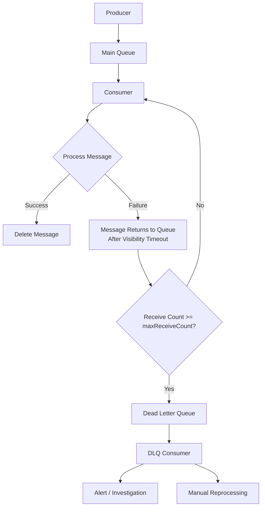
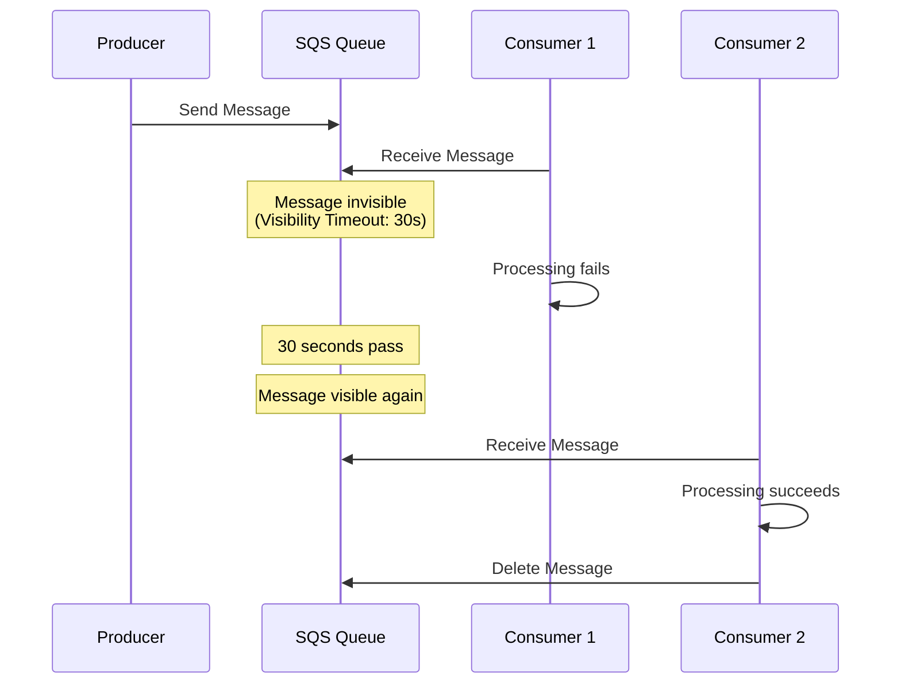
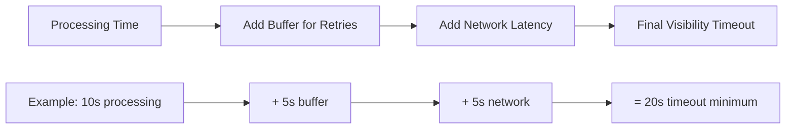

# How to Implement Retry Logic with SQS

Author: [nawazdhandala](https://github.com/nawazdhandala)

Tags: AWS, SQS, Message Queue, Retry Logic, Dead Letter Queue, Error Handling, Node.js, Python

Description: Learn how to implement robust retry logic with Amazon SQS. Covers visibility timeout configuration, exponential backoff strategies, Dead Letter Queue setup, and best practices for handling transient failures in distributed systems.

---

Building reliable distributed systems requires handling transient failures gracefully. Amazon Simple Queue Service (SQS) provides built-in mechanisms for message retry and failure handling that, when configured correctly, create resilient message processing pipelines. Understanding visibility timeouts, receive counts, and Dead Letter Queue (DLQ) redrive policies enables you to build systems that recover automatically from temporary failures while isolating permanently failed messages for investigation.

## Why Retry Logic Matters in SQS

| Scenario | Without Retry Logic | With Retry Logic |
|----------|---------------------|------------------|
| Network timeout | Message lost or stuck | Automatic retry after visibility timeout |
| Database unavailable | Processing fails permanently | Retries until database recovers |
| Invalid message format | Infinite retry loop | Routed to DLQ after max attempts |
| Lambda cold start timeout | Random failures | Configured retry handles cold starts |

## SQS Retry Architecture Overview

The following diagram shows how SQS handles message retries through visibility timeouts and Dead Letter Queue routing.



## Understanding SQS Visibility Timeout

When a consumer receives a message from SQS, the message becomes invisible to other consumers for a configurable duration called the visibility timeout. If the consumer fails to delete the message before the timeout expires, SQS makes the message visible again for reprocessing.



## Basic SQS Setup with Retry Configuration

The following CloudFormation template creates an SQS queue with a Dead Letter Queue for handling failed messages. The redrive policy specifies that messages are moved to the DLQ after 3 failed processing attempts.

```yaml
# CloudFormation template for SQS queue with DLQ
# The redrive policy configures automatic routing of failed messages
# maxReceiveCount determines how many times a message can be received before moving to DLQ

AWSTemplateFormatVersion: '2010-09-09'
Description: SQS Queue with Dead Letter Queue for retry handling

Resources:
  # Dead Letter Queue to store messages that fail processing
  OrdersDLQ:
    Type: AWS::SQS::Queue
    Properties:
      QueueName: orders-dlq
      # Retain failed messages for 14 days for investigation
      MessageRetentionPeriod: 1209600
      # Enable server-side encryption for security
      SqsManagedSseEnabled: true

  # Main processing queue with retry configuration
  OrdersQueue:
    Type: AWS::SQS::Queue
    Properties:
      QueueName: orders-queue
      # Visibility timeout should be longer than your processing time
      # Add buffer for retries and network latency
      VisibilityTimeout: 60
      # Keep messages for 4 days if not processed
      MessageRetentionPeriod: 345600
      # Enable server-side encryption
      SqsManagedSseEnabled: true
      # Configure Dead Letter Queue redrive policy
      RedrivePolicy:
        # Route to DLQ after 3 failed attempts
        maxReceiveCount: 3
        # ARN of the Dead Letter Queue
        deadLetterTargetArn: !GetAtt OrdersDLQ.Arn

Outputs:
  QueueUrl:
    Description: URL of the main orders queue
    Value: !Ref OrdersQueue
  DLQUrl:
    Description: URL of the Dead Letter Queue
    Value: !Ref OrdersDLQ
```

## Node.js Consumer with Exponential Backoff

The following implementation processes SQS messages with exponential backoff retry logic. When processing fails, the consumer extends the visibility timeout before allowing the message to be retried.

```javascript
// SQS consumer with exponential backoff retry logic
// Uses AWS SDK v3 for modern async/await patterns
// Implements visibility timeout extension for controlled retries

const {
  SQSClient,
  ReceiveMessageCommand,
  DeleteMessageCommand,
  ChangeMessageVisibilityCommand,
} = require('@aws-sdk/client-sqs');

// Initialize SQS client with region configuration
const sqsClient = new SQSClient({ region: 'us-east-1' });

// Configuration for retry behavior
const CONFIG = {
  queueUrl: process.env.SQS_QUEUE_URL,
  // Base visibility timeout in seconds
  baseVisibilityTimeout: 30,
  // Maximum visibility timeout (SQS limit is 12 hours)
  maxVisibilityTimeout: 3600,
  // Maximum processing attempts before giving up
  maxAttempts: 5,
  // Wait time for long polling (reduces empty responses)
  waitTimeSeconds: 20,
  // Number of messages to fetch per request
  maxNumberOfMessages: 10,
};

// Calculate exponential backoff delay based on attempt number
// Returns visibility timeout in seconds
function calculateBackoffTimeout(attempt) {
  // Exponential backoff: 30s, 60s, 120s, 240s, 480s
  const timeout = CONFIG.baseVisibilityTimeout * Math.pow(2, attempt);
  // Cap at maximum visibility timeout
  return Math.min(timeout, CONFIG.maxVisibilityTimeout);
}

// Extend message visibility timeout for retry with backoff
async function extendVisibilityTimeout(receiptHandle, attempt) {
  const newTimeout = calculateBackoffTimeout(attempt);

  console.log(`Extending visibility timeout to ${newTimeout}s for attempt ${attempt + 1}`);

  await sqsClient.send(
    new ChangeMessageVisibilityCommand({
      QueueUrl: CONFIG.queueUrl,
      ReceiptHandle: receiptHandle,
      VisibilityTimeout: newTimeout,
    })
  );

  return newTimeout;
}

// Process a single message with retry tracking
async function processMessage(message) {
  // Extract approximate receive count from message attributes
  // SQS tracks this automatically for redrive policy
  const receiveCount = parseInt(
    message.Attributes?.ApproximateReceiveCount || '1',
    10
  );

  console.log(`Processing message (attempt ${receiveCount}): ${message.MessageId}`);

  try {
    // Parse message body
    const body = JSON.parse(message.Body);

    // Validate required fields
    if (!body.orderId) {
      // Validation errors should not be retried
      // Let the message go to DLQ immediately
      throw new ValidationError('Order ID is required');
    }

    // Simulate order processing
    await processOrder(body);

    // Delete message on successful processing
    await sqsClient.send(
      new DeleteMessageCommand({
        QueueUrl: CONFIG.queueUrl,
        ReceiptHandle: message.ReceiptHandle,
      })
    );

    console.log(`Successfully processed order: ${body.orderId}`);

  } catch (error) {
    console.error(`Error processing message: ${error.message}`);

    // Check if error is retryable
    if (isRetryableError(error) && receiveCount < CONFIG.maxAttempts) {
      // Extend visibility timeout with exponential backoff
      // Message will be retried after the new timeout expires
      await extendVisibilityTimeout(message.ReceiptHandle, receiveCount);
      console.log(`Message will be retried after backoff period`);
    } else {
      // Non-retryable error or max attempts reached
      // Let visibility timeout expire normally to trigger DLQ
      console.log(`Message will be routed to DLQ after ${receiveCount} attempts`);
    }

    // Re-throw to indicate processing failure
    throw error;
  }
}

// Determine if an error should trigger a retry
function isRetryableError(error) {
  // Validation errors should not be retried
  if (error instanceof ValidationError) {
    return false;
  }

  // Retryable error patterns
  const retryablePatterns = [
    'ECONNREFUSED',
    'ETIMEDOUT',
    'ENOTFOUND',
    'NetworkError',
    'ServiceUnavailable',
    'ThrottlingException',
    'ProvisionedThroughputExceededException',
  ];

  return retryablePatterns.some(
    (pattern) => error.message && error.message.includes(pattern)
  );
}

// Custom validation error class
class ValidationError extends Error {
  constructor(message) {
    super(message);
    this.name = 'ValidationError';
  }
}

// Simulate order processing with potential failures
async function processOrder(order) {
  // Simulate external service call
  console.log(`Processing order: ${order.orderId}`);

  // Simulate random transient failures for demonstration
  if (Math.random() < 0.3) {
    throw new Error('ECONNREFUSED: Connection refused by payment service');
  }

  // Simulate processing time
  await new Promise((resolve) => setTimeout(resolve, 1000));
}

// Main consumer loop with long polling
async function startConsumer() {
  console.log('Starting SQS consumer...');

  while (true) {
    try {
      // Receive messages with long polling
      const response = await sqsClient.send(
        new ReceiveMessageCommand({
          QueueUrl: CONFIG.queueUrl,
          MaxNumberOfMessages: CONFIG.maxNumberOfMessages,
          WaitTimeSeconds: CONFIG.waitTimeSeconds,
          // Request receive count for retry tracking
          AttributeNames: ['ApproximateReceiveCount'],
          // Request all message attributes
          MessageAttributeNames: ['All'],
        })
      );

      if (!response.Messages || response.Messages.length === 0) {
        console.log('No messages received, continuing to poll...');
        continue;
      }

      console.log(`Received ${response.Messages.length} messages`);

      // Process messages concurrently
      await Promise.allSettled(
        response.Messages.map((message) => processMessage(message))
      );

    } catch (error) {
      console.error(`Consumer error: ${error.message}`);
      // Wait before retrying on consumer-level errors
      await new Promise((resolve) => setTimeout(resolve, 5000));
    }
  }
}

// Graceful shutdown handling
process.on('SIGTERM', () => {
  console.log('Received SIGTERM, shutting down...');
  process.exit(0);
});

process.on('SIGINT', () => {
  console.log('Received SIGINT, shutting down...');
  process.exit(0);
});

// Start the consumer
startConsumer().catch(console.error);
```

## Python Consumer with Boto3

The following Python implementation provides the same retry functionality using boto3. Python's exception handling and type system make error classification straightforward.

```python
# SQS consumer with exponential backoff retry logic in Python
# Uses boto3 for AWS SDK interactions
# Implements structured logging and graceful shutdown

import json
import logging
import signal
import sys
import time
from typing import Optional

import boto3
from botocore.exceptions import ClientError

# Configure structured logging
logging.basicConfig(
    level=logging.INFO,
    format='%(asctime)s - %(levelname)s - %(message)s'
)
logger = logging.getLogger(__name__)

# Initialize SQS client
sqs = boto3.client('sqs', region_name='us-east-1')

# Configuration constants
QUEUE_URL = 'https://sqs.us-east-1.amazonaws.com/123456789012/orders-queue'
BASE_VISIBILITY_TIMEOUT = 30  # seconds
MAX_VISIBILITY_TIMEOUT = 3600  # 1 hour
MAX_ATTEMPTS = 5
WAIT_TIME_SECONDS = 20
MAX_NUMBER_OF_MESSAGES = 10

# Flag for graceful shutdown
running = True


class ValidationError(Exception):
    """Error raised for invalid message content that should not be retried."""
    pass


class RetryableError(Exception):
    """Error raised for transient failures that should be retried."""
    pass


def calculate_backoff_timeout(attempt: int) -> int:
    """
    Calculate exponential backoff timeout based on attempt number.

    Args:
        attempt: Current attempt number (0-indexed)

    Returns:
        Visibility timeout in seconds
    """
    # Exponential backoff: 30s, 60s, 120s, 240s, 480s
    timeout = BASE_VISIBILITY_TIMEOUT * (2 ** attempt)
    # Cap at maximum visibility timeout
    return min(timeout, MAX_VISIBILITY_TIMEOUT)


def extend_visibility_timeout(receipt_handle: str, attempt: int) -> int:
    """
    Extend the visibility timeout for a message to implement backoff.

    Args:
        receipt_handle: SQS receipt handle for the message
        attempt: Current attempt number

    Returns:
        New visibility timeout in seconds
    """
    new_timeout = calculate_backoff_timeout(attempt)

    logger.info(f"Extending visibility timeout to {new_timeout}s for attempt {attempt + 1}")

    sqs.change_message_visibility(
        QueueUrl=QUEUE_URL,
        ReceiptHandle=receipt_handle,
        VisibilityTimeout=new_timeout
    )

    return new_timeout


def is_retryable_error(error: Exception) -> bool:
    """
    Determine if an error should trigger a retry.

    Args:
        error: The exception that occurred

    Returns:
        True if the error is retryable, False otherwise
    """
    # Validation errors should not be retried
    if isinstance(error, ValidationError):
        return False

    # AWS throttling errors are retryable
    if isinstance(error, ClientError):
        error_code = error.response.get('Error', {}).get('Code', '')
        retryable_codes = [
            'ThrottlingException',
            'ProvisionedThroughputExceededException',
            'ServiceUnavailable',
            'InternalError',
        ]
        return error_code in retryable_codes

    # Check error message for retryable patterns
    retryable_patterns = [
        'Connection refused',
        'Connection reset',
        'Timeout',
        'temporarily unavailable',
    ]

    error_message = str(error).lower()
    return any(pattern.lower() in error_message for pattern in retryable_patterns)


def process_order(order: dict) -> None:
    """
    Process an order with potential for transient failures.

    Args:
        order: Order data dictionary

    Raises:
        RetryableError: For transient failures
        ValidationError: For invalid order data
    """
    logger.info(f"Processing order: {order.get('orderId')}")

    # Simulate external service call
    # In production, replace with actual business logic
    time.sleep(0.5)

    # Simulate random failures for demonstration
    import random
    if random.random() < 0.3:
        raise RetryableError("Payment service temporarily unavailable")


def process_message(message: dict) -> bool:
    """
    Process a single SQS message with retry logic.

    Args:
        message: SQS message dictionary

    Returns:
        True if processing succeeded, False otherwise
    """
    # Extract receive count for retry tracking
    receive_count = int(message.get('Attributes', {}).get('ApproximateReceiveCount', 1))
    message_id = message.get('MessageId')
    receipt_handle = message.get('ReceiptHandle')

    logger.info(f"Processing message (attempt {receive_count}): {message_id}")

    try:
        # Parse message body
        body = json.loads(message.get('Body', '{}'))

        # Validate required fields
        if not body.get('orderId'):
            raise ValidationError("Order ID is required")

        # Process the order
        process_order(body)

        # Delete message on success
        sqs.delete_message(
            QueueUrl=QUEUE_URL,
            ReceiptHandle=receipt_handle
        )

        logger.info(f"Successfully processed order: {body.get('orderId')}")
        return True

    except json.JSONDecodeError as e:
        logger.error(f"Invalid JSON in message: {e}")
        # Invalid JSON should go to DLQ - do not retry
        return False

    except ValidationError as e:
        logger.error(f"Validation error: {e}")
        # Validation errors should go to DLQ - do not retry
        return False

    except Exception as e:
        logger.error(f"Error processing message: {e}")

        # Check if error is retryable
        if is_retryable_error(e) and receive_count < MAX_ATTEMPTS:
            # Extend visibility timeout with exponential backoff
            extend_visibility_timeout(receipt_handle, receive_count)
            logger.info("Message will be retried after backoff period")
        else:
            # Non-retryable or max attempts reached - let DLQ handle it
            logger.info(f"Message will be routed to DLQ after {receive_count} attempts")

        return False


def start_consumer() -> None:
    """
    Main consumer loop with long polling.
    Processes messages until shutdown signal received.
    """
    global running
    logger.info("Starting SQS consumer...")

    while running:
        try:
            # Receive messages with long polling
            response = sqs.receive_message(
                QueueUrl=QUEUE_URL,
                MaxNumberOfMessages=MAX_NUMBER_OF_MESSAGES,
                WaitTimeSeconds=WAIT_TIME_SECONDS,
                AttributeNames=['ApproximateReceiveCount'],
                MessageAttributeNames=['All']
            )

            messages = response.get('Messages', [])

            if not messages:
                logger.debug("No messages received, continuing to poll...")
                continue

            logger.info(f"Received {len(messages)} messages")

            # Process each message
            for message in messages:
                if not running:
                    break
                process_message(message)

        except ClientError as e:
            logger.error(f"AWS error: {e}")
            time.sleep(5)

        except Exception as e:
            logger.error(f"Consumer error: {e}")
            time.sleep(5)


def signal_handler(signum, frame) -> None:
    """Handle shutdown signals gracefully."""
    global running
    logger.info(f"Received signal {signum}, shutting down...")
    running = False


# Register signal handlers for graceful shutdown
signal.signal(signal.SIGTERM, signal_handler)
signal.signal(signal.SIGINT, signal_handler)

if __name__ == '__main__':
    start_consumer()
```

## Lambda Function with Built-in Retries

AWS Lambda integrates natively with SQS and provides built-in retry behavior. The following Lambda function leverages SQS event source mapping for automatic retry handling.

```javascript
// Lambda function for SQS message processing
// Uses SQS event source mapping for automatic retry and batching
// Partial batch failure support allows successful messages to be deleted

const { DynamoDBClient, PutItemCommand } = require('@aws-sdk/client-dynamodb');

const dynamoClient = new DynamoDBClient({ region: 'us-east-1' });

// Process a single order and save to DynamoDB
async function processOrder(order) {
  console.log(`Processing order: ${order.orderId}`);

  // Validate order data
  if (!order.orderId || !order.customerId || !order.amount) {
    throw new ValidationError('Missing required order fields');
  }

  // Save order to DynamoDB
  await dynamoClient.send(
    new PutItemCommand({
      TableName: process.env.ORDERS_TABLE,
      Item: {
        orderId: { S: order.orderId },
        customerId: { S: order.customerId },
        amount: { N: String(order.amount) },
        status: { S: 'PROCESSED' },
        processedAt: { S: new Date().toISOString() },
      },
    })
  );

  console.log(`Order saved: ${order.orderId}`);
}

// Custom validation error
class ValidationError extends Error {
  constructor(message) {
    super(message);
    this.name = 'ValidationError';
  }
}

// Lambda handler for SQS events
// Returns batchItemFailures for partial batch failure support
exports.handler = async (event) => {
  console.log(`Processing ${event.Records.length} messages`);

  // Track failed message IDs for partial batch failure reporting
  const batchItemFailures = [];

  for (const record of event.Records) {
    const messageId = record.messageId;

    try {
      // Parse message body
      const body = JSON.parse(record.body);

      // Process the order
      await processOrder(body);

      console.log(`Successfully processed message: ${messageId}`);

    } catch (error) {
      console.error(`Failed to process message ${messageId}: ${error.message}`);

      // Report failure for this specific message
      // SQS will retry this message based on visibility timeout
      batchItemFailures.push({
        itemIdentifier: messageId,
      });
    }
  }

  // Return failed items for partial batch failure handling
  // Successfully processed messages will be deleted automatically
  return {
    batchItemFailures,
  };
};
```

Configure the Lambda function with SQS event source mapping using CloudFormation.

```yaml
# CloudFormation template for Lambda with SQS event source mapping
# Configures automatic retries and partial batch failure handling

AWSTemplateFormatVersion: '2010-09-09'
Description: Lambda function with SQS integration for order processing

Resources:
  # IAM role for Lambda execution
  OrderProcessorRole:
    Type: AWS::IAM::Role
    Properties:
      RoleName: order-processor-role
      AssumeRolePolicyDocument:
        Version: '2012-10-17'
        Statement:
          - Effect: Allow
            Principal:
              Service: lambda.amazonaws.com
            Action: sts:AssumeRole
      ManagedPolicyArns:
        - arn:aws:iam::aws:policy/service-role/AWSLambdaBasicExecutionRole
      Policies:
        - PolicyName: SQSAccess
          PolicyDocument:
            Version: '2012-10-17'
            Statement:
              - Effect: Allow
                Action:
                  - sqs:ReceiveMessage
                  - sqs:DeleteMessage
                  - sqs:GetQueueAttributes
                  - sqs:ChangeMessageVisibility
                Resource: !GetAtt OrdersQueue.Arn
        - PolicyName: DynamoDBAccess
          PolicyDocument:
            Version: '2012-10-17'
            Statement:
              - Effect: Allow
                Action:
                  - dynamodb:PutItem
                Resource: !GetAtt OrdersTable.Arn

  # Lambda function for order processing
  OrderProcessor:
    Type: AWS::Lambda::Function
    Properties:
      FunctionName: order-processor
      Runtime: nodejs18.x
      Handler: index.handler
      Role: !GetAtt OrderProcessorRole.Arn
      # Timeout should be less than queue visibility timeout
      Timeout: 30
      MemorySize: 256
      Environment:
        Variables:
          ORDERS_TABLE: !Ref OrdersTable

  # SQS event source mapping configuration
  # Connects SQS queue to Lambda with retry settings
  OrderProcessorEventSourceMapping:
    Type: AWS::Lambda::EventSourceMapping
    Properties:
      EventSourceArn: !GetAtt OrdersQueue.Arn
      FunctionName: !Ref OrderProcessor
      # Process up to 10 messages per invocation
      BatchSize: 10
      # Wait up to 5 seconds to batch messages
      MaximumBatchingWindowInSeconds: 5
      # Enable partial batch failure reporting
      FunctionResponseTypes:
        - ReportBatchItemFailures
      # Scaling configuration
      ScalingConfig:
        MaximumConcurrency: 10

  # DynamoDB table for storing orders
  OrdersTable:
    Type: AWS::DynamoDB::Table
    Properties:
      TableName: orders
      BillingMode: PAY_PER_REQUEST
      AttributeDefinitions:
        - AttributeName: orderId
          AttributeType: S
      KeySchema:
        - AttributeName: orderId
          KeyType: HASH
```

## DLQ Consumer for Reprocessing

The following implementation consumes messages from the DLQ, analyzes failures, and provides options for reprocessing or archiving.

```python
# DLQ consumer for analyzing and reprocessing failed messages
# Supports manual review and automated reprocessing based on error type

import json
import logging
from datetime import datetime
from typing import Optional

import boto3

logging.basicConfig(level=logging.INFO)
logger = logging.getLogger(__name__)

sqs = boto3.client('sqs', region_name='us-east-1')

# Queue URLs
DLQ_URL = 'https://sqs.us-east-1.amazonaws.com/123456789012/orders-dlq'
MAIN_QUEUE_URL = 'https://sqs.us-east-1.amazonaws.com/123456789012/orders-queue'


def analyze_dlq_message(message: dict) -> dict:
    """
    Analyze a DLQ message to determine failure reason and recommended action.

    Args:
        message: SQS message from DLQ

    Returns:
        Analysis dictionary with error info and recommended action
    """
    body = message.get('Body', '{}')
    attributes = message.get('Attributes', {})

    analysis = {
        'message_id': message.get('MessageId'),
        'receive_count': int(attributes.get('ApproximateReceiveCount', 0)),
        'first_received': attributes.get('ApproximateFirstReceiveTimestamp'),
        'sent_timestamp': attributes.get('SentTimestamp'),
        'body_preview': body[:200] if len(body) > 200 else body,
        'error_type': 'unknown',
        'recommended_action': 'manual_review',
    }

    # Try to parse and analyze the message content
    try:
        parsed_body = json.loads(body)

        # Check for common validation issues
        if not parsed_body.get('orderId'):
            analysis['error_type'] = 'missing_order_id'
            analysis['recommended_action'] = 'fix_and_reprocess'
        elif not parsed_body.get('amount'):
            analysis['error_type'] = 'missing_amount'
            analysis['recommended_action'] = 'fix_and_reprocess'
        else:
            # Message appears valid - likely transient failure
            analysis['error_type'] = 'transient_failure'
            analysis['recommended_action'] = 'reprocess'

    except json.JSONDecodeError:
        analysis['error_type'] = 'invalid_json'
        analysis['recommended_action'] = 'archive'

    return analysis


def reprocess_message(message: dict, target_queue_url: str = MAIN_QUEUE_URL) -> bool:
    """
    Reprocess a DLQ message by sending it back to the main queue.

    Args:
        message: SQS message from DLQ
        target_queue_url: Queue URL to send the message to

    Returns:
        True if reprocessing succeeded, False otherwise
    """
    try:
        # Send message back to main queue
        sqs.send_message(
            QueueUrl=target_queue_url,
            MessageBody=message.get('Body', '{}'),
            MessageAttributes=message.get('MessageAttributes', {})
        )

        # Delete from DLQ
        sqs.delete_message(
            QueueUrl=DLQ_URL,
            ReceiptHandle=message.get('ReceiptHandle')
        )

        logger.info(f"Reprocessed message: {message.get('MessageId')}")
        return True

    except Exception as e:
        logger.error(f"Failed to reprocess message: {e}")
        return False


def archive_message(message: dict, archive_bucket: str, reason: str) -> bool:
    """
    Archive a DLQ message to S3 for long-term storage.

    Args:
        message: SQS message from DLQ
        archive_bucket: S3 bucket name for archives
        reason: Reason for archiving

    Returns:
        True if archiving succeeded, False otherwise
    """
    s3 = boto3.client('s3')

    try:
        archive_data = {
            'message_id': message.get('MessageId'),
            'body': message.get('Body'),
            'attributes': message.get('Attributes', {}),
            'archive_reason': reason,
            'archived_at': datetime.utcnow().isoformat(),
        }

        # Generate archive key with timestamp
        key = f"dlq-archives/{datetime.utcnow().strftime('%Y/%m/%d')}/{message.get('MessageId')}.json"

        s3.put_object(
            Bucket=archive_bucket,
            Key=key,
            Body=json.dumps(archive_data),
            ContentType='application/json'
        )

        # Delete from DLQ
        sqs.delete_message(
            QueueUrl=DLQ_URL,
            ReceiptHandle=message.get('ReceiptHandle')
        )

        logger.info(f"Archived message to s3://{archive_bucket}/{key}")
        return True

    except Exception as e:
        logger.error(f"Failed to archive message: {e}")
        return False


def process_dlq_batch(auto_reprocess: bool = False, archive_bucket: Optional[str] = None) -> dict:
    """
    Process a batch of DLQ messages with analysis and optional auto-reprocessing.

    Args:
        auto_reprocess: Automatically reprocess transient failures
        archive_bucket: S3 bucket for archiving invalid messages

    Returns:
        Summary of actions taken
    """
    summary = {
        'analyzed': 0,
        'reprocessed': 0,
        'archived': 0,
        'pending_review': 0,
    }

    # Receive messages from DLQ
    response = sqs.receive_message(
        QueueUrl=DLQ_URL,
        MaxNumberOfMessages=10,
        WaitTimeSeconds=5,
        AttributeNames=['All'],
        MessageAttributeNames=['All']
    )

    messages = response.get('Messages', [])

    for message in messages:
        summary['analyzed'] += 1

        # Analyze the message
        analysis = analyze_dlq_message(message)
        logger.info(f"Analyzed message {analysis['message_id']}: {analysis['error_type']}")

        # Take action based on analysis
        if analysis['recommended_action'] == 'reprocess' and auto_reprocess:
            if reprocess_message(message):
                summary['reprocessed'] += 1
            else:
                summary['pending_review'] += 1

        elif analysis['recommended_action'] == 'archive' and archive_bucket:
            if archive_message(message, archive_bucket, analysis['error_type']):
                summary['archived'] += 1
            else:
                summary['pending_review'] += 1

        else:
            summary['pending_review'] += 1
            logger.info(f"Message requires manual review: {analysis['message_id']}")

    return summary


if __name__ == '__main__':
    # Process DLQ with automatic reprocessing of transient failures
    result = process_dlq_batch(
        auto_reprocess=True,
        archive_bucket='my-dlq-archive-bucket'
    )
    print(f"DLQ processing summary: {result}")
```

## Monitoring SQS Retry Metrics

CloudWatch metrics and alarms help track retry behavior and DLQ health for proactive incident response.

```yaml
# CloudWatch alarms for SQS retry monitoring
# Track queue depth, age, and DLQ activity

AWSTemplateFormatVersion: '2010-09-09'
Description: CloudWatch alarms for SQS monitoring

Parameters:
  QueueName:
    Type: String
    Default: orders-queue
  DLQName:
    Type: String
    Default: orders-dlq
  AlertEmail:
    Type: String
    Description: Email address for alerts

Resources:
  # SNS topic for alert notifications
  AlertTopic:
    Type: AWS::SNS::Topic
    Properties:
      TopicName: sqs-alerts
      Subscription:
        - Protocol: email
          Endpoint: !Ref AlertEmail

  # Alarm when main queue depth is high
  HighQueueDepthAlarm:
    Type: AWS::CloudWatch::Alarm
    Properties:
      AlarmName: !Sub "${QueueName}-high-depth"
      AlarmDescription: Queue depth is above threshold
      MetricName: ApproximateNumberOfMessagesVisible
      Namespace: AWS/SQS
      Statistic: Average
      Period: 300
      EvaluationPeriods: 3
      Threshold: 1000
      ComparisonOperator: GreaterThanThreshold
      Dimensions:
        - Name: QueueName
          Value: !Ref QueueName
      AlarmActions:
        - !Ref AlertTopic

  # Alarm when messages are stuck in queue (old messages)
  OldMessagesAlarm:
    Type: AWS::CloudWatch::Alarm
    Properties:
      AlarmName: !Sub "${QueueName}-old-messages"
      AlarmDescription: Messages are aging in queue
      MetricName: ApproximateAgeOfOldestMessage
      Namespace: AWS/SQS
      Statistic: Maximum
      Period: 300
      EvaluationPeriods: 2
      # Alert if oldest message is over 1 hour old
      Threshold: 3600
      ComparisonOperator: GreaterThanThreshold
      Dimensions:
        - Name: QueueName
          Value: !Ref QueueName
      AlarmActions:
        - !Ref AlertTopic

  # Alarm when DLQ receives messages
  DLQMessagesAlarm:
    Type: AWS::CloudWatch::Alarm
    Properties:
      AlarmName: !Sub "${DLQName}-messages-received"
      AlarmDescription: Messages are being sent to DLQ
      MetricName: ApproximateNumberOfMessagesVisible
      Namespace: AWS/SQS
      Statistic: Sum
      Period: 300
      EvaluationPeriods: 1
      Threshold: 0
      ComparisonOperator: GreaterThanThreshold
      Dimensions:
        - Name: QueueName
          Value: !Ref DLQName
      AlarmActions:
        - !Ref AlertTopic

  # Alarm when DLQ depth is growing
  DLQBacklogAlarm:
    Type: AWS::CloudWatch::Alarm
    Properties:
      AlarmName: !Sub "${DLQName}-backlog-growing"
      AlarmDescription: DLQ backlog is growing
      MetricName: ApproximateNumberOfMessagesVisible
      Namespace: AWS/SQS
      Statistic: Average
      Period: 900
      EvaluationPeriods: 4
      Threshold: 100
      ComparisonOperator: GreaterThanThreshold
      Dimensions:
        - Name: QueueName
          Value: !Ref DLQName
      AlarmActions:
        - !Ref AlertTopic

  # Dashboard for SQS monitoring
  SQSDashboard:
    Type: AWS::CloudWatch::Dashboard
    Properties:
      DashboardName: sqs-retry-monitoring
      DashboardBody: !Sub |
        {
          "widgets": [
            {
              "type": "metric",
              "width": 12,
              "height": 6,
              "properties": {
                "title": "Queue Depth",
                "metrics": [
                  ["AWS/SQS", "ApproximateNumberOfMessagesVisible", "QueueName", "${QueueName}"],
                  [".", "ApproximateNumberOfMessagesNotVisible", ".", "."]
                ],
                "period": 60,
                "stat": "Average",
                "region": "${AWS::Region}"
              }
            },
            {
              "type": "metric",
              "width": 12,
              "height": 6,
              "properties": {
                "title": "DLQ Depth",
                "metrics": [
                  ["AWS/SQS", "ApproximateNumberOfMessagesVisible", "QueueName", "${DLQName}"]
                ],
                "period": 60,
                "stat": "Sum",
                "region": "${AWS::Region}"
              }
            },
            {
              "type": "metric",
              "width": 12,
              "height": 6,
              "properties": {
                "title": "Message Age",
                "metrics": [
                  ["AWS/SQS", "ApproximateAgeOfOldestMessage", "QueueName", "${QueueName}"]
                ],
                "period": 60,
                "stat": "Maximum",
                "region": "${AWS::Region}"
              }
            },
            {
              "type": "metric",
              "width": 12,
              "height": 6,
              "properties": {
                "title": "Messages Sent/Received",
                "metrics": [
                  ["AWS/SQS", "NumberOfMessagesSent", "QueueName", "${QueueName}"],
                  [".", "NumberOfMessagesReceived", ".", "."],
                  [".", "NumberOfMessagesDeleted", ".", "."]
                ],
                "period": 60,
                "stat": "Sum",
                "region": "${AWS::Region}"
              }
            }
          ]
        }
```

## Best Practices

| Practice | Description |
|----------|-------------|
| **Set appropriate visibility timeout** | Configure visibility timeout to be at least 6x your average processing time |
| **Use exponential backoff** | Increase visibility timeout on each retry to avoid overwhelming downstream services |
| **Classify errors properly** | Distinguish between retryable (transient) and non-retryable (permanent) errors |
| **Configure DLQ redrive policy** | Set maxReceiveCount based on your retry strategy and SLA requirements |
| **Monitor DLQ depth** | Alert when messages accumulate in DLQ to catch systemic issues early |
| **Implement DLQ consumers** | Build tooling to analyze, reprocess, or archive DLQ messages |
| **Use partial batch failure** | With Lambda, report individual failures to avoid reprocessing successful messages |
| **Log receive count** | Track ApproximateReceiveCount to understand retry patterns |

## Visibility Timeout Guidelines



Recommended visibility timeout calculation:

- **Minimum**: Average processing time x 1.5
- **Recommended**: Average processing time x 3
- **Maximum**: p99 processing time x 2

## Summary

Implementing retry logic with SQS requires understanding visibility timeouts, receive counts, and DLQ redrive policies. Key strategies include using exponential backoff to prevent thundering herd problems, classifying errors to avoid retrying permanent failures, and monitoring DLQ depth to catch systemic issues. For Lambda integrations, partial batch failure reporting ensures successful messages are not reprocessed. Building DLQ consumers enables automated reprocessing of transient failures and proper archival of invalid messages.
