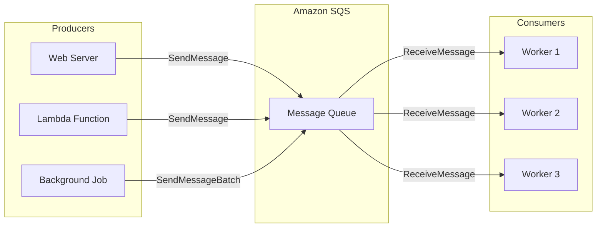
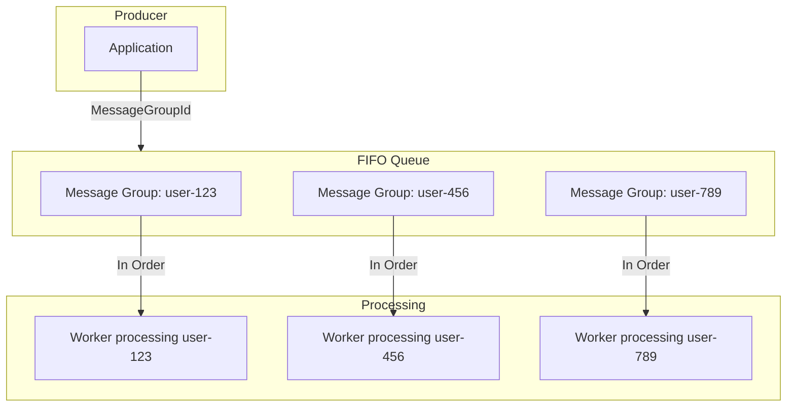
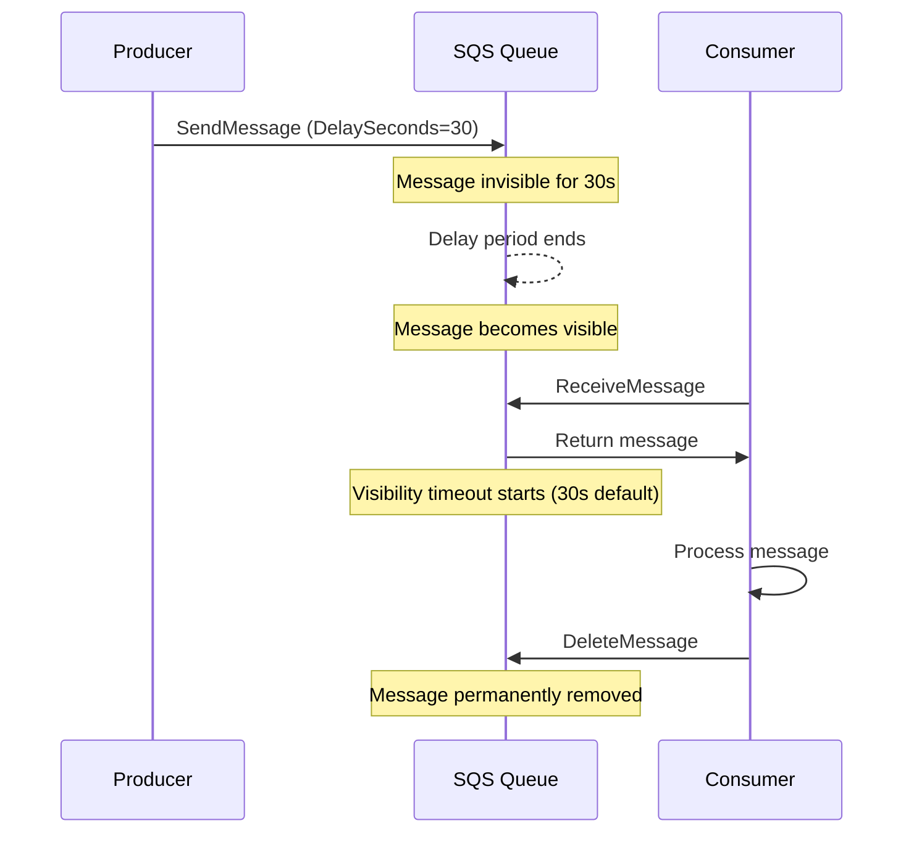

# How to Send Messages to SQS

Author: [nawazdhandala](https://www.github.com/nawazdhandala)

Tags: AWS, SQS, Message Queue, Node.js, Python, Serverless, Cloud

Description: Learn how to send messages to Amazon SQS with practical examples in Node.js and Python. Covers standard and FIFO queues, batch operations, message attributes, and best practices for reliable message delivery.

---

> Amazon Simple Queue Service (SQS) provides a fully managed message queuing service that enables decoupling and scaling of microservices, distributed systems, and serverless applications. Sending messages to SQS is straightforward, but doing it efficiently requires understanding the nuances of the service.

Message queues are fundamental to building resilient distributed systems. SQS handles the heavy lifting of queue management, allowing you to focus on your application logic.

---

## SQS Message Flow Architecture

The following diagram illustrates how messages flow through SQS from producers to consumers:



---

## Getting Started

### Prerequisites

Before sending messages to SQS, you need an AWS account and appropriate IAM permissions. The minimum required permission for sending messages is `sqs:SendMessage`.

Create an SQS queue using the AWS Console or CLI:

```bash
# Create a standard queue
aws sqs create-queue --queue-name my-application-queue

# Create a FIFO queue (requires .fifo suffix)
aws sqs create-queue --queue-name my-application-queue.fifo --attributes FifoQueue=true
```

### Installation

Install the AWS SDK for your preferred language:

```bash
# Node.js
npm install @aws-sdk/client-sqs

# Python
pip install boto3
```

---

## Sending Messages with Node.js

### Basic Message Sending

The SQSClient from AWS SDK v3 provides a modern, modular approach to interacting with SQS. Each operation is a separate command that you send through the client:

```javascript
// Import required modules from AWS SDK v3
const { SQSClient, SendMessageCommand } = require('@aws-sdk/client-sqs');

// Initialize the SQS client with your preferred region
// Credentials are automatically loaded from environment variables,
// AWS credentials file, or IAM role
const sqsClient = new SQSClient({ region: 'us-east-1' });

// Define the queue URL - you can find this in the AWS Console
const QUEUE_URL = 'https://sqs.us-east-1.amazonaws.com/123456789012/my-queue';

async function sendMessage(messageBody) {
    // Create the command with required parameters
    const command = new SendMessageCommand({
        QueueUrl: QUEUE_URL,
        MessageBody: messageBody,
        // Optional: Add a delay before the message becomes visible (0-900 seconds)
        DelaySeconds: 0,
    });

    try {
        // Send the command and await the response
        const response = await sqsClient.send(command);
        console.log('Message sent successfully:', response.MessageId);
        return response;
    } catch (error) {
        console.error('Failed to send message:', error);
        throw error;
    }
}

// Example usage
sendMessage(JSON.stringify({ orderId: '12345', action: 'process' }));
```

### Adding Message Attributes

Message attributes allow you to include structured metadata with your messages. Consumers can use these attributes for filtering or processing decisions without parsing the message body:

```javascript
const { SQSClient, SendMessageCommand } = require('@aws-sdk/client-sqs');

const sqsClient = new SQSClient({ region: 'us-east-1' });
const QUEUE_URL = 'https://sqs.us-east-1.amazonaws.com/123456789012/my-queue';

async function sendMessageWithAttributes(messageBody, priority, eventType) {
    const command = new SendMessageCommand({
        QueueUrl: QUEUE_URL,
        MessageBody: JSON.stringify(messageBody),
        // Message attributes support String, Number, and Binary data types
        MessageAttributes: {
            // String attribute for event classification
            'EventType': {
                DataType: 'String',
                StringValue: eventType,
            },
            // Number attribute for priority-based processing
            'Priority': {
                DataType: 'Number',
                StringValue: priority.toString(),
            },
            // String attribute for tracking message source
            'Source': {
                DataType: 'String',
                StringValue: 'order-service',
            },
        },
    });

    const response = await sqsClient.send(command);
    return response;
}

// Send a high-priority order event
sendMessageWithAttributes(
    { orderId: '12345', items: ['item1', 'item2'] },
    1,
    'ORDER_CREATED'
);
```

### Batch Message Sending

When you need to send multiple messages, batch operations are more efficient than individual sends. A single batch request can include up to 10 messages:

```javascript
const { SQSClient, SendMessageBatchCommand } = require('@aws-sdk/client-sqs');
const { v4: uuidv4 } = require('uuid');

const sqsClient = new SQSClient({ region: 'us-east-1' });
const QUEUE_URL = 'https://sqs.us-east-1.amazonaws.com/123456789012/my-queue';

async function sendBatchMessages(messages) {
    // Transform messages into the batch entry format
    // Each entry needs a unique Id within the batch
    const entries = messages.map((msg, index) => ({
        Id: `msg-${index}-${uuidv4().slice(0, 8)}`,
        MessageBody: JSON.stringify(msg),
        DelaySeconds: 0,
    }));

    const command = new SendMessageBatchCommand({
        QueueUrl: QUEUE_URL,
        Entries: entries,
    });

    try {
        const response = await sqsClient.send(command);

        // Check for partial failures - some messages may succeed while others fail
        if (response.Failed && response.Failed.length > 0) {
            console.error('Some messages failed:', response.Failed);
        }

        console.log(`Successfully sent ${response.Successful.length} messages`);
        return response;
    } catch (error) {
        console.error('Batch send failed:', error);
        throw error;
    }
}

// Send multiple order events in a single API call
const orders = [
    { orderId: '001', status: 'pending' },
    { orderId: '002', status: 'pending' },
    { orderId: '003', status: 'pending' },
];

sendBatchMessages(orders);
```

---

## Sending Messages with Python

### Basic Message Sending

Boto3 is the official AWS SDK for Python. The SQS resource provides a high-level, object-oriented interface for queue operations:

```python
import boto3
import json
from botocore.exceptions import ClientError

# Create SQS client
# Credentials are loaded from environment variables, ~/.aws/credentials,
# or IAM role attached to the compute resource
sqs = boto3.client('sqs', region_name='us-east-1')

QUEUE_URL = 'https://sqs.us-east-1.amazonaws.com/123456789012/my-queue'

def send_message(message_body: dict) -> dict:
    """
    Send a single message to the SQS queue.

    Args:
        message_body: Dictionary containing the message payload

    Returns:
        Response from SQS containing MessageId and MD5 checksum
    """
    try:
        response = sqs.send_message(
            QueueUrl=QUEUE_URL,
            MessageBody=json.dumps(message_body),
            # Delay message visibility by specified seconds (0-900)
            DelaySeconds=0,
        )
        print(f"Message sent: {response['MessageId']}")
        return response
    except ClientError as error:
        print(f"Failed to send message: {error}")
        raise

# Example usage
send_message({'order_id': '12345', 'action': 'process'})
```

### Adding Message Attributes

Message attributes in Python follow the same structure as in Node.js. Use them to pass metadata that consumers can access without deserializing the message body:

```python
import boto3
import json

sqs = boto3.client('sqs', region_name='us-east-1')
QUEUE_URL = 'https://sqs.us-east-1.amazonaws.com/123456789012/my-queue'

def send_message_with_attributes(
    message_body: dict,
    priority: int,
    event_type: str
) -> dict:
    """
    Send a message with custom attributes for filtering and routing.

    Args:
        message_body: The main message payload
        priority: Numeric priority level (lower = higher priority)
        event_type: Classification of the event for routing

    Returns:
        SQS response containing MessageId
    """
    response = sqs.send_message(
        QueueUrl=QUEUE_URL,
        MessageBody=json.dumps(message_body),
        MessageAttributes={
            'EventType': {
                'DataType': 'String',
                'StringValue': event_type,
            },
            'Priority': {
                'DataType': 'Number',
                'StringValue': str(priority),
            },
            'Source': {
                'DataType': 'String',
                'StringValue': 'order-service',
            },
        },
    )
    return response

# Send an order created event with high priority
send_message_with_attributes(
    message_body={'order_id': '12345', 'total': 99.99},
    priority=1,
    event_type='ORDER_CREATED'
)
```

### Batch Message Sending

Batch sending in Python follows the same principles as Node.js. The SDK handles the HTTP request efficiently for multiple messages:

```python
import boto3
import json
import uuid
from typing import List, Dict, Any

sqs = boto3.client('sqs', region_name='us-east-1')
QUEUE_URL = 'https://sqs.us-east-1.amazonaws.com/123456789012/my-queue'

def send_batch_messages(messages: List[Dict[str, Any]]) -> dict:
    """
    Send multiple messages in a single batch request.

    SQS batch operations accept up to 10 messages per request.
    For larger batches, chunk the messages and make multiple calls.

    Args:
        messages: List of message payloads to send

    Returns:
        Response containing Successful and Failed message lists
    """
    # Build batch entries with unique IDs
    entries = [
        {
            'Id': f'msg-{i}-{str(uuid.uuid4())[:8]}',
            'MessageBody': json.dumps(msg),
            'DelaySeconds': 0,
        }
        for i, msg in enumerate(messages)
    ]

    response = sqs.send_message_batch(
        QueueUrl=QUEUE_URL,
        Entries=entries,
    )

    # Handle partial failures gracefully
    if response.get('Failed'):
        for failed in response['Failed']:
            print(f"Failed message {failed['Id']}: {failed['Message']}")

    successful_count = len(response.get('Successful', []))
    print(f"Successfully sent {successful_count} messages")

    return response

# Process multiple orders in one batch
orders = [
    {'order_id': '001', 'status': 'pending'},
    {'order_id': '002', 'status': 'pending'},
    {'order_id': '003', 'status': 'pending'},
]

send_batch_messages(orders)
```

---

## Working with FIFO Queues

FIFO (First-In-First-Out) queues guarantee message ordering and exactly-once processing. They require additional parameters compared to standard queues:



### Node.js FIFO Example

FIFO queues require MessageGroupId and MessageDeduplicationId. The group ID determines message ordering, while the deduplication ID prevents duplicate processing within a 5-minute window:

```javascript
const { SQSClient, SendMessageCommand } = require('@aws-sdk/client-sqs');
const crypto = require('crypto');

const sqsClient = new SQSClient({ region: 'us-east-1' });
// FIFO queue URLs always end with .fifo
const FIFO_QUEUE_URL = 'https://sqs.us-east-1.amazonaws.com/123456789012/my-queue.fifo';

async function sendFifoMessage(messageBody, groupId) {
    // Generate a unique deduplication ID based on message content
    // Messages with the same deduplication ID within 5 minutes are treated as duplicates
    const deduplicationId = crypto
        .createHash('sha256')
        .update(JSON.stringify(messageBody) + Date.now())
        .digest('hex');

    const command = new SendMessageCommand({
        QueueUrl: FIFO_QUEUE_URL,
        MessageBody: JSON.stringify(messageBody),
        // MessageGroupId ensures messages in the same group are processed in order
        // Use a logical grouping like user ID, order ID, or tenant ID
        MessageGroupId: groupId,
        // MessageDeduplicationId prevents duplicate message processing
        MessageDeduplicationId: deduplicationId,
    });

    const response = await sqsClient.send(command);
    console.log('FIFO message sent:', response.MessageId);
    return response;
}

// All messages for user-123 will be processed in the order they were sent
sendFifoMessage({ action: 'update_profile', data: { name: 'John' } }, 'user-123');
sendFifoMessage({ action: 'update_email', data: { email: 'john@example.com' } }, 'user-123');
```

### Python FIFO Example

The Python implementation follows the same FIFO patterns with MessageGroupId and MessageDeduplicationId:

```python
import boto3
import json
import hashlib
from datetime import datetime

sqs = boto3.client('sqs', region_name='us-east-1')
FIFO_QUEUE_URL = 'https://sqs.us-east-1.amazonaws.com/123456789012/my-queue.fifo'

def send_fifo_message(message_body: dict, group_id: str) -> dict:
    """
    Send a message to a FIFO queue with ordering and deduplication.

    Args:
        message_body: The message payload
        group_id: Logical grouping for message ordering

    Returns:
        SQS response with MessageId and SequenceNumber
    """
    # Create deduplication ID from content hash and timestamp
    content = json.dumps(message_body) + str(datetime.utcnow().timestamp())
    deduplication_id = hashlib.sha256(content.encode()).hexdigest()

    response = sqs.send_message(
        QueueUrl=FIFO_QUEUE_URL,
        MessageBody=json.dumps(message_body),
        MessageGroupId=group_id,
        MessageDeduplicationId=deduplication_id,
    )

    # FIFO queues return a SequenceNumber indicating message order
    print(f"Message sent with sequence: {response['SequenceNumber']}")
    return response

# Order operations for the same order should be processed sequentially
send_fifo_message({'order_id': '12345', 'action': 'create'}, 'order-12345')
send_fifo_message({'order_id': '12345', 'action': 'add_item'}, 'order-12345')
send_fifo_message({'order_id': '12345', 'action': 'checkout'}, 'order-12345')
```

---

## Error Handling and Retries

Robust error handling is essential for production systems. Implement exponential backoff to handle transient failures gracefully:

```javascript
const { SQSClient, SendMessageCommand } = require('@aws-sdk/client-sqs');

const sqsClient = new SQSClient({ region: 'us-east-1' });
const QUEUE_URL = 'https://sqs.us-east-1.amazonaws.com/123456789012/my-queue';

async function sendMessageWithRetry(messageBody, maxRetries = 3) {
    let lastError;

    for (let attempt = 1; attempt <= maxRetries; attempt++) {
        try {
            const command = new SendMessageCommand({
                QueueUrl: QUEUE_URL,
                MessageBody: JSON.stringify(messageBody),
            });

            const response = await sqsClient.send(command);
            return response;
        } catch (error) {
            lastError = error;

            // Check if the error is retryable
            const retryableErrors = [
                'ThrottlingException',
                'ServiceUnavailable',
                'InternalError',
            ];

            if (!retryableErrors.includes(error.name)) {
                // Non-retryable error, throw immediately
                throw error;
            }

            if (attempt < maxRetries) {
                // Exponential backoff: 100ms, 200ms, 400ms, etc.
                const delay = Math.pow(2, attempt - 1) * 100;
                console.log(`Retry ${attempt}/${maxRetries} after ${delay}ms`);
                await new Promise(resolve => setTimeout(resolve, delay));
            }
        }
    }

    throw lastError;
}
```

### Python Retry Implementation

```python
import boto3
import json
import time
from botocore.exceptions import ClientError

sqs = boto3.client('sqs', region_name='us-east-1')
QUEUE_URL = 'https://sqs.us-east-1.amazonaws.com/123456789012/my-queue'

def send_message_with_retry(message_body: dict, max_retries: int = 3) -> dict:
    """
    Send a message with exponential backoff retry logic.

    Args:
        message_body: The message payload to send
        max_retries: Maximum number of retry attempts

    Returns:
        SQS response on success

    Raises:
        ClientError: When all retry attempts are exhausted
    """
    last_error = None
    retryable_codes = ['ThrottlingException', 'ServiceUnavailable', 'InternalError']

    for attempt in range(1, max_retries + 1):
        try:
            response = sqs.send_message(
                QueueUrl=QUEUE_URL,
                MessageBody=json.dumps(message_body),
            )
            return response
        except ClientError as error:
            last_error = error
            error_code = error.response['Error']['Code']

            # Only retry on transient errors
            if error_code not in retryable_codes:
                raise

            if attempt < max_retries:
                # Exponential backoff with jitter
                delay = (2 ** (attempt - 1)) * 0.1
                print(f"Retry {attempt}/{max_retries} after {delay}s")
                time.sleep(delay)

    raise last_error
```

---

## Message Visibility and Delay

Understanding visibility timeout and message delay helps you design reliable processing flows:



### Configuring Message Delay

Delayed messages are useful for scheduled tasks, rate limiting, or implementing retry patterns:

```javascript
const { SQSClient, SendMessageCommand } = require('@aws-sdk/client-sqs');

const sqsClient = new SQSClient({ region: 'us-east-1' });
const QUEUE_URL = 'https://sqs.us-east-1.amazonaws.com/123456789012/my-queue';

async function sendDelayedMessage(messageBody, delaySeconds) {
    // DelaySeconds can range from 0 to 900 (15 minutes)
    // Use this for scheduled notifications, rate limiting, or retry delays
    const command = new SendMessageCommand({
        QueueUrl: QUEUE_URL,
        MessageBody: JSON.stringify(messageBody),
        DelaySeconds: Math.min(delaySeconds, 900),
    });

    const response = await sqsClient.send(command);
    console.log(`Message will be visible in ${delaySeconds} seconds`);
    return response;
}

// Send a reminder that becomes visible in 5 minutes
sendDelayedMessage(
    { type: 'reminder', userId: '123', message: 'Complete your profile' },
    300
);
```

---

## Best Practices

### Message Size Optimization

SQS messages have a maximum size of 256 KB. For larger payloads, store data in S3 and pass the reference:

```javascript
const { S3Client, PutObjectCommand } = require('@aws-sdk/client-s3');
const { SQSClient, SendMessageCommand } = require('@aws-sdk/client-sqs');
const { v4: uuidv4 } = require('uuid');

const s3Client = new S3Client({ region: 'us-east-1' });
const sqsClient = new SQSClient({ region: 'us-east-1' });

async function sendLargeMessage(payload) {
    const payloadSize = Buffer.byteLength(JSON.stringify(payload));

    // SQS limit is 256 KB, use S3 for larger payloads
    if (payloadSize > 250000) {
        const objectKey = `sqs-payloads/${uuidv4()}.json`;

        // Store payload in S3
        await s3Client.send(new PutObjectCommand({
            Bucket: 'my-sqs-payloads-bucket',
            Key: objectKey,
            Body: JSON.stringify(payload),
            ContentType: 'application/json',
        }));

        // Send S3 reference to SQS
        const sqsMessage = {
            type: 's3-reference',
            bucket: 'my-sqs-payloads-bucket',
            key: objectKey,
        };

        return sendMessage(sqsMessage);
    }

    return sendMessage(payload);
}
```

### Idempotency Considerations

Design your message handlers to be idempotent since messages may be delivered more than once:

```python
import boto3
import json
import hashlib
from datetime import datetime, timedelta

# Use DynamoDB or Redis to track processed message IDs
dynamodb = boto3.resource('dynamodb')
processed_table = dynamodb.Table('processed-messages')

def generate_idempotency_key(message: dict) -> str:
    """Generate a deterministic key based on message content."""
    content = json.dumps(message, sort_keys=True)
    return hashlib.sha256(content.encode()).hexdigest()

def is_message_processed(idempotency_key: str) -> bool:
    """Check if a message has already been processed."""
    response = processed_table.get_item(Key={'idempotency_key': idempotency_key})
    return 'Item' in response

def mark_message_processed(idempotency_key: str) -> None:
    """Mark a message as processed with TTL for cleanup."""
    ttl = int((datetime.utcnow() + timedelta(days=7)).timestamp())
    processed_table.put_item(
        Item={
            'idempotency_key': idempotency_key,
            'processed_at': datetime.utcnow().isoformat(),
            'ttl': ttl,
        }
    )
```

### Monitoring Queue Health

Track key metrics to ensure your queues are healthy:

```javascript
const {
    SQSClient,
    GetQueueAttributesCommand
} = require('@aws-sdk/client-sqs');

const sqsClient = new SQSClient({ region: 'us-east-1' });
const QUEUE_URL = 'https://sqs.us-east-1.amazonaws.com/123456789012/my-queue';

async function getQueueMetrics() {
    const command = new GetQueueAttributesCommand({
        QueueUrl: QUEUE_URL,
        AttributeNames: [
            'ApproximateNumberOfMessages',
            'ApproximateNumberOfMessagesNotVisible',
            'ApproximateNumberOfMessagesDelayed',
        ],
    });

    const response = await sqsClient.send(command);

    return {
        // Messages waiting to be processed
        messagesAvailable: parseInt(response.Attributes.ApproximateNumberOfMessages),
        // Messages currently being processed
        messagesInFlight: parseInt(response.Attributes.ApproximateNumberOfMessagesNotVisible),
        // Messages waiting for delay to expire
        messagesDelayed: parseInt(response.Attributes.ApproximateNumberOfMessagesDelayed),
    };
}

// Check queue depth periodically
setInterval(async () => {
    const metrics = await getQueueMetrics();
    console.log('Queue metrics:', metrics);

    // Alert if queue is backing up
    if (metrics.messagesAvailable > 10000) {
        console.warn('Queue depth is high, consider scaling consumers');
    }
}, 60000);
```

---

## Standard vs FIFO Queue Comparison

| Feature | Standard Queue | FIFO Queue |
|---------|---------------|------------|
| Throughput | Unlimited | 300 TPS (3000 with batching) |
| Ordering | Best effort | Guaranteed within group |
| Delivery | At least once | Exactly once |
| Deduplication | None | 5-minute window |
| Use Case | High throughput | Ordered processing |

---

## Conclusion

Sending messages to SQS is a fundamental skill for building distributed systems on AWS. Key takeaways include:

- **Use batch operations** when sending multiple messages to reduce API calls and costs
- **Leverage message attributes** for routing and filtering without parsing the message body
- **Choose FIFO queues** when message ordering is critical to your application
- **Implement retry logic** with exponential backoff to handle transient failures
- **Monitor queue depth** to detect processing backlogs early

SQS provides a reliable foundation for asynchronous communication between services. By following these patterns, you can build robust message-driven architectures that scale with your application needs.

---

*Need to monitor your SQS queues and message processing? [OneUptime](https://oneuptime.com) provides comprehensive queue monitoring with alerting on queue depth, processing latency, and dead letter queue growth.*
