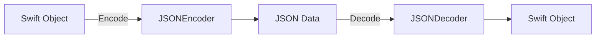
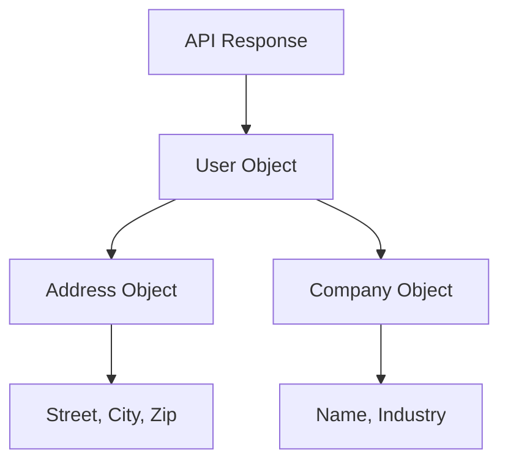
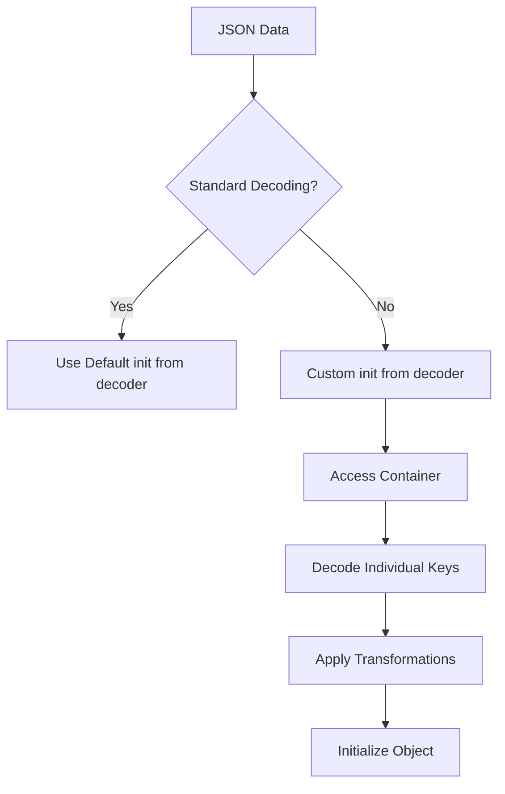

# How to Handle JSON Parsing with Codable in Swift

Author: [nawazdhandala](https://www.github.com/nawazdhandala)

Tags: Swift, Codable, JSON, iOS, Data Parsing, API Integration, Type Safety

Description: Master JSON parsing in Swift using the Codable protocol. Learn encoding, decoding, custom transformations, nested objects, error handling, and production-ready patterns for iOS and macOS development.

---

> JSON is the universal language of APIs. Swift's Codable protocol provides a type-safe, elegant way to convert between JSON and native Swift types. This guide covers everything from basic parsing to advanced customization techniques that will make your code cleaner and more maintainable.

Working with JSON data is a fundamental skill for any iOS or macOS developer. Whether you are fetching data from a REST API, reading configuration files, or persisting data locally, understanding Codable is essential for modern Swift development.

---

## Understanding Codable

Codable is actually a type alias that combines two protocols: `Encodable` and `Decodable`. This means any type conforming to Codable can both encode itself to an external representation (like JSON) and decode from one.



| Protocol | Purpose | Use Case |
|----------|---------|----------|
| **Decodable** | Parse external data into Swift types | API responses, file reading |
| **Encodable** | Convert Swift types to external format | API requests, file writing |
| **Codable** | Both encoding and decoding | Bidirectional data flow |

---

## Basic JSON Decoding

The simplest use case involves mapping JSON keys directly to Swift properties. When your JSON keys match your property names exactly, Swift handles everything automatically.

```swift
// User.swift
// Define a simple model that matches the JSON structure exactly.
// Swift automatically synthesizes the decoding logic when all properties are Codable.
import Foundation

struct User: Codable {
    let id: Int
    let name: String
    let email: String
    let isActive: Bool
}

// Example JSON:
// {"id": 1, "name": "John Doe", "email": "john@example.com", "isActive": true}

// Decoding the JSON data into a User object.
// JSONDecoder handles the conversion from raw Data to our Swift type.
let jsonString = """
{
    "id": 1,
    "name": "John Doe",
    "email": "john@example.com",
    "isActive": true
}
"""

let jsonData = jsonString.data(using: .utf8)!
let decoder = JSONDecoder()

do {
    let user = try decoder.decode(User.self, from: jsonData)
    print("User: \(user.name), Email: \(user.email)")
} catch {
    print("Decoding failed: \(error)")
}
```

---

## Handling Different Key Naming Conventions

APIs often use snake_case for JSON keys while Swift conventions prefer camelCase. The `keyDecodingStrategy` property on JSONDecoder handles this conversion automatically.

```swift
// SnakeCaseExample.swift
// Configure the decoder to automatically convert snake_case keys to camelCase properties.
// This eliminates the need for manual CodingKeys when the only difference is naming convention.
import Foundation

struct UserProfile: Codable {
    let userId: Int
    let firstName: String
    let lastName: String
    let createdAt: String
    let profileImageUrl: String
}

// JSON with snake_case keys:
// {"user_id": 1, "first_name": "Jane", "last_name": "Smith", "created_at": "2024-01-15", "profile_image_url": "https://..."}

let jsonString = """
{
    "user_id": 1,
    "first_name": "Jane",
    "last_name": "Smith",
    "created_at": "2024-01-15",
    "profile_image_url": "https://example.com/avatar.jpg"
}
"""

let decoder = JSONDecoder()

// Enable automatic snake_case to camelCase conversion.
// This setting applies to all keys during decoding.
decoder.keyDecodingStrategy = .convertFromSnakeCase

let jsonData = jsonString.data(using: .utf8)!
let profile = try decoder.decode(UserProfile.self, from: jsonData)
print("Name: \(profile.firstName) \(profile.lastName)")
```

---

## Custom Key Mapping with CodingKeys

When JSON keys do not match your preferred property names, or when you want to rename properties entirely, use a CodingKeys enumeration to define the mapping.

```swift
// CustomKeyMapping.swift
// CodingKeys enum allows complete control over how JSON keys map to Swift properties.
// Each case in the enum corresponds to a property, and the rawValue specifies the JSON key.
import Foundation

struct Product: Codable {
    let identifier: Int
    let productName: String
    let priceInCents: Int
    let stockQuantity: Int
    let isAvailable: Bool

    // Define the mapping between JSON keys and Swift property names.
    // The rawValue of each case is the actual JSON key.
    enum CodingKeys: String, CodingKey {
        case identifier = "id"
        case productName = "name"
        case priceInCents = "price"
        case stockQuantity = "qty"
        case isAvailable = "in_stock"
    }
}

// JSON uses abbreviated or different key names:
// {"id": 101, "name": "Laptop", "price": 99999, "qty": 50, "in_stock": true}

let jsonString = """
{
    "id": 101,
    "name": "Laptop",
    "price": 99999,
    "qty": 50,
    "in_stock": true
}
"""

let jsonData = jsonString.data(using: .utf8)!
let product = try JSONDecoder().decode(Product.self, from: jsonData)
print("Product: \(product.productName), Price: $\(Double(product.priceInCents) / 100)")
```

---

## Handling Nested JSON Objects

Real-world APIs often return deeply nested JSON structures. Codable handles this elegantly through nested types that each conform to Codable.



```swift
// NestedObjects.swift
// Model nested JSON by creating separate Codable structs for each level of nesting.
// The parent type contains properties of the nested types.
import Foundation

// Address model for the nested address object.
struct Address: Codable {
    let street: String
    let city: String
    let state: String
    let zipCode: String

    enum CodingKeys: String, CodingKey {
        case street, city, state
        case zipCode = "zip_code"
    }
}

// Company model for the nested company information.
struct Company: Codable {
    let name: String
    let industry: String
    let employeeCount: Int

    enum CodingKeys: String, CodingKey {
        case name, industry
        case employeeCount = "employee_count"
    }
}

// Main user model containing nested objects.
struct Employee: Codable {
    let id: Int
    let name: String
    let email: String
    let address: Address
    let company: Company
}

let jsonString = """
{
    "id": 1,
    "name": "Alice Johnson",
    "email": "alice@company.com",
    "address": {
        "street": "123 Main St",
        "city": "San Francisco",
        "state": "CA",
        "zip_code": "94102"
    },
    "company": {
        "name": "Tech Corp",
        "industry": "Software",
        "employee_count": 500
    }
}
"""

let decoder = JSONDecoder()
let jsonData = jsonString.data(using: .utf8)!
let employee = try decoder.decode(Employee.self, from: jsonData)

print("Employee: \(employee.name)")
print("City: \(employee.address.city)")
print("Company: \(employee.company.name)")
```

---

## Working with Arrays

JSON arrays can contain primitive values or complex objects. Decoding arrays is straightforward with Codable.

```swift
// ArrayDecoding.swift
// Decode JSON arrays by specifying the array type [Element].self in the decode call.
// Works with both simple arrays and arrays of complex objects.
import Foundation

struct Task: Codable {
    let id: Int
    let title: String
    let completed: Bool
    let priority: String
}

// Array of task objects from an API response.
let jsonString = """
[
    {"id": 1, "title": "Review PR", "completed": false, "priority": "high"},
    {"id": 2, "title": "Write tests", "completed": true, "priority": "medium"},
    {"id": 3, "title": "Update docs", "completed": false, "priority": "low"}
]
"""

let jsonData = jsonString.data(using: .utf8)!
let decoder = JSONDecoder()

// Decode as an array of Task objects.
// The decoder expects the root element to be a JSON array.
let tasks = try decoder.decode([Task].self, from: jsonData)

for task in tasks {
    let status = task.completed ? "Done" : "Pending"
    print("[\(status)] \(task.title) - Priority: \(task.priority)")
}

// Filter incomplete high-priority tasks.
let urgentTasks = tasks.filter { !$0.completed && $0.priority == "high" }
print("Urgent tasks: \(urgentTasks.count)")
```

---

## Handling Optional Fields

APIs often return optional fields that may or may not be present. Swift optionals map perfectly to this scenario.

```swift
// OptionalFields.swift
// Mark properties as optional when the corresponding JSON key might be missing.
// The decoder will set optional properties to nil when the key is absent.
import Foundation

struct Article: Codable {
    let id: Int
    let title: String
    let content: String
    let author: String?           // May not be present
    let publishedAt: String?      // May not be present
    let tags: [String]?           // May be missing or null
    let viewCount: Int?           // Optional numeric field

    enum CodingKeys: String, CodingKey {
        case id, title, content, author, tags
        case publishedAt = "published_at"
        case viewCount = "view_count"
    }
}

// JSON with some missing fields.
let jsonString = """
{
    "id": 42,
    "title": "Swift Codable Guide",
    "content": "Learn how to parse JSON..."
}
"""

let jsonData = jsonString.data(using: .utf8)!
let article = try JSONDecoder().decode(Article.self, from: jsonData)

// Safely unwrap optional values.
// Use nil-coalescing or optional binding to handle missing data.
let authorName = article.author ?? "Anonymous"
let views = article.viewCount ?? 0

print("Article: \(article.title) by \(authorName)")
print("Views: \(views)")
```

---

## Date Handling Strategies

JSON has no native date type, so dates are typically represented as strings or timestamps. JSONDecoder provides built-in strategies for common date formats.

```swift
// DateHandling.swift
// Configure dateDecodingStrategy to automatically convert date strings to Date objects.
// Multiple built-in strategies handle common formats like ISO8601 and Unix timestamps.
import Foundation

struct Event: Codable {
    let id: Int
    let name: String
    let startDate: Date
    let endDate: Date

    enum CodingKeys: String, CodingKey {
        case id, name
        case startDate = "start_date"
        case endDate = "end_date"
    }
}

// JSON with ISO8601 date strings.
let jsonString = """
{
    "id": 1,
    "name": "Swift Conference",
    "start_date": "2024-06-15T09:00:00Z",
    "end_date": "2024-06-17T18:00:00Z"
}
"""

let decoder = JSONDecoder()

// Use ISO8601 date decoding for standard date strings.
// This handles the full ISO8601 format including timezone.
decoder.dateDecodingStrategy = .iso8601

let jsonData = jsonString.data(using: .utf8)!
let event = try decoder.decode(Event.self, from: jsonData)

let formatter = DateFormatter()
formatter.dateStyle = .medium
formatter.timeStyle = .short

print("Event: \(event.name)")
print("Starts: \(formatter.string(from: event.startDate))")
print("Ends: \(formatter.string(from: event.endDate))")
```

### Custom Date Formats

When the API uses a non-standard date format, create a custom formatter.

```swift
// CustomDateFormat.swift
// Use a custom DateFormatter for non-standard date string formats.
// This is common when working with legacy APIs or specific regional formats.
import Foundation

struct BlogPost: Codable {
    let id: Int
    let title: String
    let createdAt: Date

    enum CodingKeys: String, CodingKey {
        case id, title
        case createdAt = "created_at"
    }
}

// JSON with custom date format (MM/dd/yyyy HH:mm).
let jsonString = """
{
    "id": 1,
    "title": "Getting Started with Codable",
    "created_at": "01/15/2024 14:30"
}
"""

let decoder = JSONDecoder()

// Create a custom date formatter matching the API's format.
let dateFormatter = DateFormatter()
dateFormatter.dateFormat = "MM/dd/yyyy HH:mm"
dateFormatter.locale = Locale(identifier: "en_US_POSIX")

// Apply the custom formatter to the decoder.
decoder.dateDecodingStrategy = .formatted(dateFormatter)

let jsonData = jsonString.data(using: .utf8)!
let post = try decoder.decode(BlogPost.self, from: jsonData)

print("Post created: \(post.createdAt)")
```

---

## Custom Encoding and Decoding

For complex transformations that built-in strategies cannot handle, implement custom encoding and decoding logic.



```swift
// CustomDecoding.swift
// Implement init(from:) for complete control over the decoding process.
// This allows transformations, validations, and handling of irregular JSON structures.
import Foundation

struct Temperature: Codable {
    let celsius: Double
    let fahrenheit: Double
    let kelvin: Double

    enum CodingKeys: String, CodingKey {
        case value
        case unit
    }

    // Custom decoding to convert any temperature unit to all three.
    // The JSON contains a single value and unit, we compute all representations.
    init(from decoder: Decoder) throws {
        let container = try decoder.container(keyedBy: CodingKeys.self)
        let value = try container.decode(Double.self, forKey: .value)
        let unit = try container.decode(String.self, forKey: .unit)

        // Convert to all temperature scales based on input unit.
        switch unit.lowercased() {
        case "c", "celsius":
            self.celsius = value
            self.fahrenheit = (value * 9/5) + 32
            self.kelvin = value + 273.15
        case "f", "fahrenheit":
            self.celsius = (value - 32) * 5/9
            self.fahrenheit = value
            self.kelvin = (value - 32) * 5/9 + 273.15
        case "k", "kelvin":
            self.celsius = value - 273.15
            self.fahrenheit = (value - 273.15) * 9/5 + 32
            self.kelvin = value
        default:
            throw DecodingError.dataCorruptedError(
                forKey: .unit,
                in: container,
                debugDescription: "Unknown temperature unit: \(unit)"
            )
        }
    }

    // Custom encoding to output in a standard format.
    func encode(to encoder: Encoder) throws {
        var container = encoder.container(keyedBy: CodingKeys.self)
        try container.encode(celsius, forKey: .value)
        try container.encode("celsius", forKey: .unit)
    }
}

// Input JSON with temperature in Fahrenheit.
let jsonString = """
{
    "value": 98.6,
    "unit": "fahrenheit"
}
"""

let jsonData = jsonString.data(using: .utf8)!
let temp = try JSONDecoder().decode(Temperature.self, from: jsonData)

print("Temperature in Celsius: \(String(format: "%.1f", temp.celsius))")
print("Temperature in Fahrenheit: \(String(format: "%.1f", temp.fahrenheit))")
print("Temperature in Kelvin: \(String(format: "%.1f", temp.kelvin))")
```

---

## Handling Polymorphic JSON

Sometimes JSON contains objects of different types in the same array. Handle this with enums and custom decoding.

```swift
// PolymorphicJSON.swift
// Use an enum with associated values to represent different object types in a JSON array.
// Custom decoding inspects a type field to determine which case to use.
import Foundation

// Define the possible content types in a feed.
enum FeedItem: Codable {
    case article(Article)
    case video(Video)
    case poll(Poll)

    struct Article: Codable {
        let id: Int
        let title: String
        let content: String
        let author: String
    }

    struct Video: Codable {
        let id: Int
        let title: String
        let url: String
        let duration: Int
    }

    struct Poll: Codable {
        let id: Int
        let question: String
        let options: [String]
    }

    enum CodingKeys: String, CodingKey {
        case type
    }

    // Custom decoding to determine the type and decode accordingly.
    init(from decoder: Decoder) throws {
        let container = try decoder.container(keyedBy: CodingKeys.self)
        let type = try container.decode(String.self, forKey: .type)

        // Use singleValueContainer to decode the entire object as the specific type.
        let singleContainer = try decoder.singleValueContainer()

        switch type {
        case "article":
            let article = try singleContainer.decode(Article.self)
            self = .article(article)
        case "video":
            let video = try singleContainer.decode(Video.self)
            self = .video(video)
        case "poll":
            let poll = try singleContainer.decode(Poll.self)
            self = .poll(poll)
        default:
            throw DecodingError.dataCorruptedError(
                in: singleContainer,
                debugDescription: "Unknown feed item type: \(type)"
            )
        }
    }

    func encode(to encoder: Encoder) throws {
        var container = encoder.singleValueContainer()
        switch self {
        case .article(let article):
            try container.encode(article)
        case .video(let video):
            try container.encode(video)
        case .poll(let poll):
            try container.encode(poll)
        }
    }
}

let jsonString = """
[
    {"type": "article", "id": 1, "title": "News", "content": "...", "author": "Jane"},
    {"type": "video", "id": 2, "title": "Tutorial", "url": "https://...", "duration": 300},
    {"type": "poll", "id": 3, "question": "Favorite language?", "options": ["Swift", "Kotlin"]}
]
"""

let jsonData = jsonString.data(using: .utf8)!
let feedItems = try JSONDecoder().decode([FeedItem].self, from: jsonData)

for item in feedItems {
    switch item {
    case .article(let article):
        print("Article: \(article.title)")
    case .video(let video):
        print("Video: \(video.title) (\(video.duration)s)")
    case .poll(let poll):
        print("Poll: \(poll.question)")
    }
}
```

---

## Error Handling Best Practices

Robust error handling is essential for production applications. Codable provides detailed error information through DecodingError.

```swift
// ErrorHandling.swift
// Properly handle decoding errors to provide meaningful feedback and graceful degradation.
// DecodingError has multiple cases that indicate exactly what went wrong.
import Foundation

struct UserData: Codable {
    let id: Int
    let username: String
    let email: String
    let age: Int
}

func parseUserData(from jsonString: String) -> UserData? {
    guard let jsonData = jsonString.data(using: .utf8) else {
        print("Error: Could not convert string to data")
        return nil
    }

    do {
        let user = try JSONDecoder().decode(UserData.self, from: jsonData)
        return user
    } catch let DecodingError.keyNotFound(key, context) {
        // A required key was missing from the JSON.
        print("Missing key: '\(key.stringValue)'")
        print("Path: \(context.codingPath.map { $0.stringValue }.joined(separator: " -> "))")
        print("Debug: \(context.debugDescription)")
    } catch let DecodingError.typeMismatch(type, context) {
        // The value type did not match the expected type.
        print("Type mismatch: expected \(type)")
        print("Path: \(context.codingPath.map { $0.stringValue }.joined(separator: " -> "))")
        print("Debug: \(context.debugDescription)")
    } catch let DecodingError.valueNotFound(type, context) {
        // A null value was found where a non-optional was expected.
        print("Null value for type: \(type)")
        print("Path: \(context.codingPath.map { $0.stringValue }.joined(separator: " -> "))")
    } catch let DecodingError.dataCorrupted(context) {
        // The data was corrupted or not valid JSON.
        print("Data corrupted")
        print("Path: \(context.codingPath.map { $0.stringValue }.joined(separator: " -> "))")
        print("Debug: \(context.debugDescription)")
    } catch {
        // Catch any other errors.
        print("Unknown decoding error: \(error.localizedDescription)")
    }

    return nil
}

// Test with malformed JSON.
let badJson = """
{
    "id": "not_a_number",
    "username": "testuser",
    "email": "test@example.com",
    "age": 25
}
"""

let result = parseUserData(from: badJson)
// Output: Type mismatch: expected Int
```

---

## Creating a Reusable API Client

Combine Codable with networking for a clean, reusable API client.

```swift
// APIClient.swift
// A generic API client that handles JSON encoding and decoding for any Codable types.
// Uses Swift concurrency for clean async/await syntax.
import Foundation

enum APIError: Error {
    case invalidURL
    case noData
    case decodingError(Error)
    case networkError(Error)
    case httpError(statusCode: Int)
}

class APIClient {
    private let baseURL: String
    private let decoder: JSONDecoder
    private let encoder: JSONEncoder
    private let session: URLSession

    init(baseURL: String) {
        self.baseURL = baseURL

        // Configure decoder with common settings.
        self.decoder = JSONDecoder()
        decoder.keyDecodingStrategy = .convertFromSnakeCase
        decoder.dateDecodingStrategy = .iso8601

        // Configure encoder with matching settings.
        self.encoder = JSONEncoder()
        encoder.keyEncodingStrategy = .convertToSnakeCase
        encoder.dateEncodingStrategy = .iso8601

        self.session = URLSession.shared
    }

    // Generic GET request that decodes the response to any Decodable type.
    func get<T: Decodable>(endpoint: String) async throws -> T {
        guard let url = URL(string: baseURL + endpoint) else {
            throw APIError.invalidURL
        }

        let (data, response) = try await session.data(from: url)

        guard let httpResponse = response as? HTTPURLResponse else {
            throw APIError.networkError(NSError(domain: "Invalid response", code: 0))
        }

        guard (200...299).contains(httpResponse.statusCode) else {
            throw APIError.httpError(statusCode: httpResponse.statusCode)
        }

        do {
            return try decoder.decode(T.self, from: data)
        } catch {
            throw APIError.decodingError(error)
        }
    }

    // Generic POST request that encodes the body and decodes the response.
    func post<T: Decodable, U: Encodable>(endpoint: String, body: U) async throws -> T {
        guard let url = URL(string: baseURL + endpoint) else {
            throw APIError.invalidURL
        }

        var request = URLRequest(url: url)
        request.httpMethod = "POST"
        request.setValue("application/json", forHTTPHeaderField: "Content-Type")
        request.httpBody = try encoder.encode(body)

        let (data, response) = try await session.data(for: request)

        guard let httpResponse = response as? HTTPURLResponse else {
            throw APIError.networkError(NSError(domain: "Invalid response", code: 0))
        }

        guard (200...299).contains(httpResponse.statusCode) else {
            throw APIError.httpError(statusCode: httpResponse.statusCode)
        }

        do {
            return try decoder.decode(T.self, from: data)
        } catch {
            throw APIError.decodingError(error)
        }
    }
}

// Usage example with a user service.
struct User: Codable {
    let id: Int
    let name: String
    let email: String
    let createdAt: Date
}

struct CreateUserRequest: Codable {
    let name: String
    let email: String
}

// Example usage with the API client.
// let client = APIClient(baseURL: "https://api.example.com")
// let users: [User] = try await client.get(endpoint: "/users")
// let newUser: User = try await client.post(endpoint: "/users", body: CreateUserRequest(name: "John", email: "john@example.com"))
```

---

## Working with Enums

Codable handles enums naturally when the raw value matches JSON values.

```swift
// EnumHandling.swift
// Enums with raw values automatically conform to Codable.
// The raw value is used for encoding and decoding.
import Foundation

enum Priority: String, Codable {
    case low
    case medium
    case high
    case critical
}

enum Status: Int, Codable {
    case pending = 0
    case inProgress = 1
    case completed = 2
    case cancelled = 3
}

struct Issue: Codable {
    let id: Int
    let title: String
    let priority: Priority
    let status: Status
}

let jsonString = """
{
    "id": 42,
    "title": "Fix login bug",
    "priority": "high",
    "status": 1
}
"""

let jsonData = jsonString.data(using: .utf8)!
let issue = try JSONDecoder().decode(Issue.self, from: jsonData)

print("Issue: \(issue.title)")
print("Priority: \(issue.priority)")    // Output: high
print("Status: \(issue.status)")        // Output: inProgress
```

---

## Default Values and Fallbacks

Provide default values for missing or invalid JSON fields using property wrappers or custom decoding.

```swift
// DefaultValues.swift
// Use a property wrapper to provide default values for missing JSON keys.
// This avoids making every field optional while still handling incomplete data.
import Foundation

// Property wrapper that provides a default value when decoding fails.
@propertyWrapper
struct Default<T: Codable>: Codable {
    var wrappedValue: T

    init(wrappedValue: T) {
        self.wrappedValue = wrappedValue
    }

    init(from decoder: Decoder) throws {
        let container = try decoder.singleValueContainer()
        self.wrappedValue = (try? container.decode(T.self)) ?? wrappedValue
    }

    func encode(to encoder: Encoder) throws {
        var container = encoder.singleValueContainer()
        try container.encode(wrappedValue)
    }
}

// Extension to handle missing keys during decoding.
extension KeyedDecodingContainer {
    func decode<T: Codable>(_ type: Default<T>.Type, forKey key: Key) throws -> Default<T> {
        try decodeIfPresent(type, forKey: key) ?? Default(wrappedValue: T.self as! T)
    }
}

struct Settings: Codable {
    let userId: Int
    @Default var notificationsEnabled: Bool = true
    @Default var theme: String = "light"
    @Default var fontSize: Int = 14
}

// JSON with missing optional fields.
let jsonString = """
{
    "userId": 123
}
"""

let jsonData = jsonString.data(using: .utf8)!
let settings = try JSONDecoder().decode(Settings.self, from: jsonData)

print("User: \(settings.userId)")
print("Notifications: \(settings.notificationsEnabled)")  // Default: true
print("Theme: \(settings.theme)")                          // Default: light
print("Font size: \(settings.fontSize)")                   // Default: 14
```

---

## Encoding Swift Objects to JSON

Encoding works similarly to decoding but in reverse. Use JSONEncoder to convert Swift objects to JSON data.

```swift
// Encoding.swift
// JSONEncoder converts Codable objects to JSON Data.
// Configure output formatting and key encoding strategies as needed.
import Foundation

struct Order: Codable {
    let orderId: String
    let items: [OrderItem]
    let totalAmount: Double
    let createdAt: Date
}

struct OrderItem: Codable {
    let productId: Int
    let quantity: Int
    let unitPrice: Double
}

// Create an order object.
let order = Order(
    orderId: "ORD-2024-001",
    items: [
        OrderItem(productId: 101, quantity: 2, unitPrice: 29.99),
        OrderItem(productId: 205, quantity: 1, unitPrice: 49.99)
    ],
    totalAmount: 109.97,
    createdAt: Date()
)

let encoder = JSONEncoder()

// Configure encoder for readable output.
encoder.outputFormatting = [.prettyPrinted, .sortedKeys]
encoder.keyEncodingStrategy = .convertToSnakeCase
encoder.dateEncodingStrategy = .iso8601

let jsonData = try encoder.encode(order)
let jsonString = String(data: jsonData, encoding: .utf8)!

print(jsonString)
// Output:
// {
//   "created_at" : "2024-01-15T10:30:00Z",
//   "items" : [
//     { "product_id" : 101, "quantity" : 2, "unit_price" : 29.99 },
//     { "product_id" : 205, "quantity" : 1, "unit_price" : 49.99 }
//   ],
//   "order_id" : "ORD-2024-001",
//   "total_amount" : 109.97
// }
```

---

## Performance Considerations

For large JSON payloads or frequent parsing operations, consider these optimizations.

```swift
// Performance.swift
// Optimize JSON parsing for better performance with large or frequent operations.
import Foundation

// 1. Reuse decoder and encoder instances.
// Creating these objects has overhead, so reuse them when possible.
class JSONService {
    // Static instances shared across the app.
    static let decoder: JSONDecoder = {
        let decoder = JSONDecoder()
        decoder.keyDecodingStrategy = .convertFromSnakeCase
        decoder.dateDecodingStrategy = .iso8601
        return decoder
    }()

    static let encoder: JSONEncoder = {
        let encoder = JSONEncoder()
        encoder.keyEncodingStrategy = .convertToSnakeCase
        encoder.dateEncodingStrategy = .iso8601
        return encoder
    }()

    // Generic decode function using the shared decoder.
    static func decode<T: Decodable>(_ type: T.Type, from data: Data) throws -> T {
        try decoder.decode(type, from: data)
    }

    // Generic encode function using the shared encoder.
    static func encode<T: Encodable>(_ value: T) throws -> Data {
        try encoder.encode(value)
    }
}

// 2. Use lazy parsing for large collections.
// Only decode items as they are accessed.
struct LazyJSONArray<Element: Decodable> {
    private let data: Data
    private let decoder: JSONDecoder
    private var cache: [Int: Element] = [:]

    init(data: Data, decoder: JSONDecoder = JSONDecoder()) {
        self.data = data
        self.decoder = decoder
    }

    // Parse and cache individual items on demand.
    mutating func item(at index: Int) throws -> Element {
        if let cached = cache[index] {
            return cached
        }

        // In production, implement proper lazy parsing.
        // This is a simplified example.
        let array = try decoder.decode([Element].self, from: data)
        let element = array[index]
        cache[index] = element
        return element
    }
}

// 3. Background parsing for large payloads.
// Move heavy parsing work off the main thread.
func parseInBackground<T: Decodable>(
    _ type: T.Type,
    from data: Data,
    completion: @escaping (Result<T, Error>) -> Void
) {
    DispatchQueue.global(qos: .userInitiated).async {
        do {
            let result = try JSONService.decode(type, from: data)
            DispatchQueue.main.async {
                completion(.success(result))
            }
        } catch {
            DispatchQueue.main.async {
                completion(.failure(error))
            }
        }
    }
}
```

---

## Best Practices Summary

| Practice | Benefit |
|----------|---------|
| **Use optionals for missing fields** | Gracefully handle incomplete data |
| **Implement CodingKeys explicitly** | Clear mapping, easier refactoring |
| **Reuse encoder/decoder instances** | Better performance |
| **Handle all error cases** | Robust, debuggable code |
| **Use snake_case strategy** | Cleaner code, no manual mapping |
| **Validate data after decoding** | Catch logical errors early |
| **Test with edge cases** | Ensure reliability |

---

## Conclusion

Swift's Codable protocol provides a powerful, type-safe way to work with JSON data. Key takeaways:

- **Start simple** with automatic synthesis for matching keys
- **Use strategies** for common transformations like snake_case and dates
- **Implement custom decoding** for complex transformations
- **Handle errors** gracefully with specific error types
- **Optimize performance** by reusing encoder/decoder instances

Codable eliminates the boilerplate of manual JSON parsing while maintaining complete control when needed. By following these patterns, you will write cleaner, safer, and more maintainable code for handling JSON in your Swift applications.

---

*Building iOS apps that consume APIs? [OneUptime](https://oneuptime.com) provides API monitoring to ensure your backend services stay reliable and performant.*

**Related Reading:**
- [How to Implement Networking in Swift with URLSession](https://oneuptime.com/blog/post/2026-02-02-swift-urlsession-networking/view)
