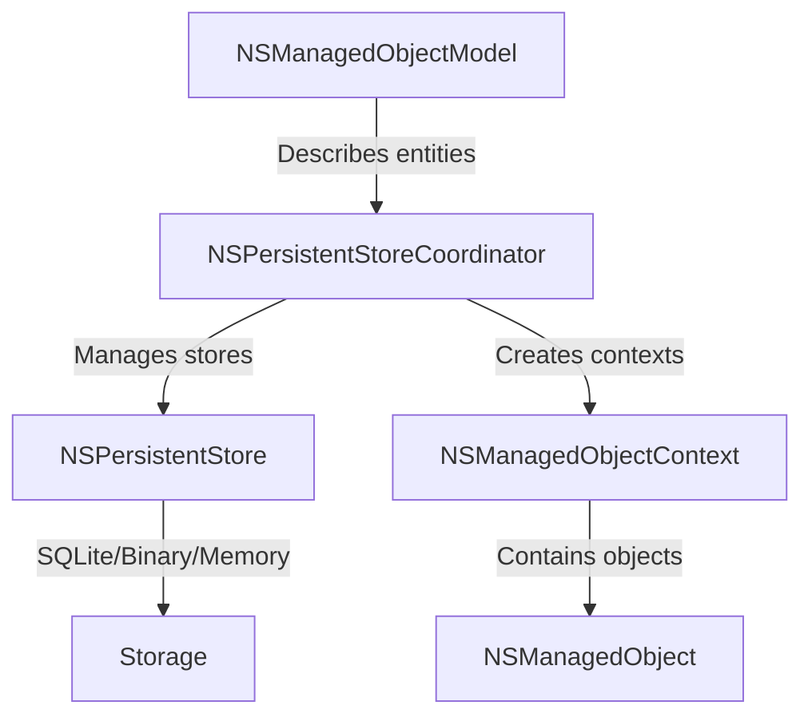

# How to Use Core Data for Persistence in iOS

Author: [nawazdhandala](https://www.github.com/nawazdhandala)

Tags: Swift, Core Data, iOS, Persistence, Database

Description: Learn how to use Core Data for local data persistence in iOS applications, covering model setup, CRUD operations, relationships, and performance optimization.

---

> Core Data is Apple's framework for managing object graphs and persisting data locally on iOS and macOS. It's not a database, but rather an object graph management framework that happens to support persistence. This guide walks you through setting up Core Data, performing CRUD operations, handling relationships, and optimizing for performance.

If you're building iOS apps that need to store data locally, Core Data is the go-to solution. It handles caching, lazy loading, undo management, and works seamlessly with SwiftUI and UIKit. Let's dive in.

---

## Understanding Core Data Architecture

Before writing any code, it helps to understand how Core Data's components fit together.



| Component | Purpose |
|-----------|---------|
| **NSManagedObjectModel** | Defines your data model (entities, attributes, relationships) |
| **NSPersistentStoreCoordinator** | Coordinates between the model and storage |
| **NSPersistentContainer** | Modern wrapper that simplifies stack setup |
| **NSManagedObjectContext** | Workspace for creating and modifying objects |
| **NSManagedObject** | Base class for your data objects |

---

## Setting Up Core Data

### Creating the Data Model

First, create a new Data Model file in Xcode (File > New > File > Data Model). This creates a `.xcdatamodeld` file where you define your entities.

For this guide, we'll build a simple task management app with `Task` and `Category` entities.

### The Persistence Controller

This is the central class that manages your Core Data stack. It creates the container, handles context creation, and provides convenience methods for saving.

```swift
// PersistenceController.swift
// Core Data stack setup with support for previews and testing
import CoreData

class PersistenceController {
    // Singleton for app-wide access
    static let shared = PersistenceController()

    // Container holds the entire Core Data stack
    let container: NSPersistentContainer

    // Main context for UI operations (runs on main thread)
    var viewContext: NSManagedObjectContext {
        container.viewContext
    }

    // Preview instance with sample data for SwiftUI previews
    static var preview: PersistenceController = {
        let controller = PersistenceController(inMemory: true)
        let context = controller.viewContext

        // Create sample data for previews
        for i in 0..<5 {
            let task = Task(context: context)
            task.id = UUID()
            task.title = "Sample Task \(i + 1)"
            task.createdAt = Date()
            task.isCompleted = i % 2 == 0
        }

        // Save the preview data
        try? context.save()
        return controller
    }()

    init(inMemory: Bool = false) {
        // Initialize container with your model name
        container = NSPersistentContainer(name: "TaskModel")

        if inMemory {
            // Use in-memory store for previews and tests
            container.persistentStoreDescriptions.first?.url = URL(fileURLWithPath: "/dev/null")
        }

        // Load the persistent stores
        container.loadPersistentStores { description, error in
            if let error = error {
                // In production, handle this gracefully instead of crashing
                fatalError("Failed to load Core Data: \(error.localizedDescription)")
            }
        }

        // Automatically merge changes from background contexts
        container.viewContext.automaticallyMergesChangesFromParent = true

        // Define merge policy for conflict resolution
        container.viewContext.mergePolicy = NSMergeByPropertyObjectTrumpMergePolicy
    }

    // Save context if there are unsaved changes
    func save() {
        let context = viewContext

        // Only save if there are actual changes
        guard context.hasChanges else { return }

        do {
            try context.save()
        } catch {
            // Log the error - in production, show user-friendly message
            print("Failed to save context: \(error.localizedDescription)")
        }
    }
}
```

---

## Defining Your Data Model

### Entity Classes

You can let Xcode auto-generate NSManagedObject subclasses, or create them manually for more control. Here's how to define them manually with additional computed properties and validation.

```swift
// Task+CoreDataClass.swift
// Custom NSManagedObject subclass for the Task entity
import Foundation
import CoreData

@objc(Task)
public class Task: NSManagedObject {
    // Convenience initializer for creating new tasks
    convenience init(
        context: NSManagedObjectContext,
        title: String,
        notes: String? = nil
    ) {
        self.init(context: context)
        self.id = UUID()
        self.title = title
        self.notes = notes
        self.createdAt = Date()
        self.isCompleted = false
    }
}

// Task+CoreDataProperties.swift
// Properties matching your Core Data model
extension Task {
    @nonobjc public class func fetchRequest() -> NSFetchRequest<Task> {
        return NSFetchRequest<Task>(entityName: "Task")
    }

    // Attributes defined in the data model
    @NSManaged public var id: UUID?
    @NSManaged public var title: String?
    @NSManaged public var notes: String?
    @NSManaged public var createdAt: Date?
    @NSManaged public var completedAt: Date?
    @NSManaged public var isCompleted: Bool
    @NSManaged public var priority: Int16

    // Relationship to Category (optional, to-one)
    @NSManaged public var category: Category?
}

// Computed properties for convenience
extension Task {
    // Non-optional title with fallback
    var wrappedTitle: String {
        title ?? "Untitled Task"
    }

    // Formatted creation date
    var formattedDate: String {
        guard let date = createdAt else { return "Unknown" }
        let formatter = DateFormatter()
        formatter.dateStyle = .medium
        return formatter.string(from: date)
    }

    // Mark task as completed with timestamp
    func markCompleted() {
        isCompleted = true
        completedAt = Date()
    }
}

// Make Task identifiable for SwiftUI lists
extension Task: Identifiable {}
```

### Category Entity

This demonstrates a to-many relationship where one category can contain multiple tasks.

```swift
// Category+CoreDataClass.swift
// Category entity with a to-many relationship to Task
import Foundation
import CoreData

@objc(Category)
public class Category: NSManagedObject {
    convenience init(context: NSManagedObjectContext, name: String) {
        self.init(context: context)
        self.id = UUID()
        self.name = name
    }
}

extension Category {
    @nonobjc public class func fetchRequest() -> NSFetchRequest<Category> {
        return NSFetchRequest<Category>(entityName: "Category")
    }

    @NSManaged public var id: UUID?
    @NSManaged public var name: String?
    @NSManaged public var colorHex: String?

    // To-many relationship to Task
    @NSManaged public var tasks: NSSet?
}

extension Category {
    // Convert NSSet to typed array for easier use
    var tasksArray: [Task] {
        let set = tasks as? Set<Task> ?? []
        return set.sorted { ($0.createdAt ?? Date()) < ($1.createdAt ?? Date()) }
    }

    // Count of incomplete tasks in this category
    var pendingTaskCount: Int {
        tasksArray.filter { !$0.isCompleted }.count
    }

    // Helper methods for managing the relationship
    @objc(addTasksObject:)
    @NSManaged public func addToTasks(_ value: Task)

    @objc(removeTasksObject:)
    @NSManaged public func removeFromTasks(_ value: Task)
}

extension Category: Identifiable {}
```

---

## CRUD Operations

### Creating Objects

Creating new managed objects is straightforward. Always create them within a context.

```swift
// TaskService.swift
// Service class encapsulating CRUD operations for tasks
import CoreData

class TaskService {
    private let context: NSManagedObjectContext

    init(context: NSManagedObjectContext = PersistenceController.shared.viewContext) {
        self.context = context
    }

    // Create a new task
    func createTask(
        title: String,
        notes: String? = nil,
        priority: Int16 = 0,
        category: Category? = nil
    ) -> Task {
        // Create the task in the context
        let task = Task(context: context, title: title, notes: notes)
        task.priority = priority
        task.category = category

        // Save immediately or batch saves later
        saveContext()

        return task
    }

    // Create multiple tasks efficiently
    func createTasks(titles: [String]) -> [Task] {
        var tasks: [Task] = []

        // Batch creation without saving after each one
        for title in titles {
            let task = Task(context: context)
            task.id = UUID()
            task.title = title
            task.createdAt = Date()
            task.isCompleted = false
            tasks.append(task)
        }

        // Single save for all tasks
        saveContext()

        return tasks
    }

    private func saveContext() {
        guard context.hasChanges else { return }

        do {
            try context.save()
        } catch {
            print("Error saving context: \(error)")
        }
    }
}
```

### Reading (Fetching) Objects

Core Data provides powerful querying through NSFetchRequest. You can filter, sort, and limit results.

```swift
extension TaskService {
    // Fetch all tasks
    func fetchAllTasks() -> [Task] {
        let request: NSFetchRequest<Task> = Task.fetchRequest()

        // Sort by creation date, newest first
        request.sortDescriptors = [
            NSSortDescriptor(keyPath: \Task.createdAt, ascending: false)
        ]

        do {
            return try context.fetch(request)
        } catch {
            print("Error fetching tasks: \(error)")
            return []
        }
    }

    // Fetch tasks with filtering
    func fetchIncompleteTasks() -> [Task] {
        let request: NSFetchRequest<Task> = Task.fetchRequest()

        // Filter for incomplete tasks only
        request.predicate = NSPredicate(format: "isCompleted == %@", NSNumber(value: false))

        // Sort by priority (high to low), then by date
        request.sortDescriptors = [
            NSSortDescriptor(keyPath: \Task.priority, ascending: false),
            NSSortDescriptor(keyPath: \Task.createdAt, ascending: true)
        ]

        do {
            return try context.fetch(request)
        } catch {
            print("Error fetching incomplete tasks: \(error)")
            return []
        }
    }

    // Fetch tasks for a specific category
    func fetchTasks(in category: Category) -> [Task] {
        let request: NSFetchRequest<Task> = Task.fetchRequest()

        // Filter by category relationship
        request.predicate = NSPredicate(format: "category == %@", category)
        request.sortDescriptors = [
            NSSortDescriptor(keyPath: \Task.createdAt, ascending: false)
        ]

        do {
            return try context.fetch(request)
        } catch {
            print("Error fetching tasks for category: \(error)")
            return []
        }
    }

    // Search tasks by title
    func searchTasks(query: String) -> [Task] {
        let request: NSFetchRequest<Task> = Task.fetchRequest()

        // Case-insensitive contains search
        request.predicate = NSPredicate(
            format: "title CONTAINS[cd] %@",
            query
        )

        do {
            return try context.fetch(request)
        } catch {
            print("Error searching tasks: \(error)")
            return []
        }
    }

    // Fetch with limit for pagination
    func fetchRecentTasks(limit: Int = 10) -> [Task] {
        let request: NSFetchRequest<Task> = Task.fetchRequest()
        request.sortDescriptors = [
            NSSortDescriptor(keyPath: \Task.createdAt, ascending: false)
        ]
        request.fetchLimit = limit

        do {
            return try context.fetch(request)
        } catch {
            print("Error fetching recent tasks: \(error)")
            return []
        }
    }
}
```

### Updating Objects

Updating is simple since Core Data tracks changes automatically. Just modify the properties and save.

```swift
extension TaskService {
    // Update task properties
    func updateTask(
        _ task: Task,
        title: String? = nil,
        notes: String? = nil,
        priority: Int16? = nil
    ) {
        // Only update properties that were provided
        if let title = title {
            task.title = title
        }
        if let notes = notes {
            task.notes = notes
        }
        if let priority = priority {
            task.priority = priority
        }

        saveContext()
    }

    // Toggle completion status
    func toggleCompletion(_ task: Task) {
        task.isCompleted.toggle()

        if task.isCompleted {
            task.completedAt = Date()
        } else {
            task.completedAt = nil
        }

        saveContext()
    }

    // Move task to a different category
    func moveTask(_ task: Task, to category: Category?) {
        // Remove from old category if exists
        if let oldCategory = task.category {
            oldCategory.removeFromTasks(task)
        }

        // Assign new category
        task.category = category

        // Add to new category if provided
        if let newCategory = category {
            newCategory.addToTasks(task)
        }

        saveContext()
    }

    // Batch update - mark all tasks as completed
    func markAllCompleted() {
        let request: NSFetchRequest<Task> = Task.fetchRequest()
        request.predicate = NSPredicate(format: "isCompleted == %@", NSNumber(value: false))

        do {
            let tasks = try context.fetch(request)
            let now = Date()

            for task in tasks {
                task.isCompleted = true
                task.completedAt = now
            }

            saveContext()
        } catch {
            print("Error in batch update: \(error)")
        }
    }
}
```

### Deleting Objects

Always delete through the context. Core Data handles cascade deletes based on your relationship rules.

```swift
extension TaskService {
    // Delete a single task
    func deleteTask(_ task: Task) {
        context.delete(task)
        saveContext()
    }

    // Delete multiple tasks
    func deleteTasks(_ tasks: [Task]) {
        for task in tasks {
            context.delete(task)
        }
        saveContext()
    }

    // Delete all completed tasks
    func deleteCompletedTasks() {
        let request: NSFetchRequest<Task> = Task.fetchRequest()
        request.predicate = NSPredicate(format: "isCompleted == %@", NSNumber(value: true))

        do {
            let tasks = try context.fetch(request)
            for task in tasks {
                context.delete(task)
            }
            saveContext()
        } catch {
            print("Error deleting completed tasks: \(error)")
        }
    }

    // Batch delete for better performance with large datasets
    func batchDeleteCompletedTasks() {
        let fetchRequest: NSFetchRequest<NSFetchRequestResult> = Task.fetchRequest()
        fetchRequest.predicate = NSPredicate(format: "isCompleted == %@", NSNumber(value: true))

        // Batch delete bypasses the context for better performance
        let batchDelete = NSBatchDeleteRequest(fetchRequest: fetchRequest)
        batchDelete.resultType = .resultTypeObjectIDs

        do {
            let result = try context.execute(batchDelete) as? NSBatchDeleteResult
            let objectIDs = result?.result as? [NSManagedObjectID] ?? []

            // Merge changes into the view context
            let changes = [NSDeletedObjectsKey: objectIDs]
            NSManagedObjectContext.mergeChanges(
                fromRemoteContextSave: changes,
                into: [context]
            )
        } catch {
            print("Error in batch delete: \(error)")
        }
    }
}
```

---

## SwiftUI Integration

### Using @FetchRequest

SwiftUI provides the `@FetchRequest` property wrapper for automatic data binding with Core Data.

```swift
// TaskListView.swift
// SwiftUI view with automatic Core Data updates
import SwiftUI
import CoreData

struct TaskListView: View {
    // Inject the managed object context from environment
    @Environment(\.managedObjectContext) private var context

    // Fetch request automatically updates the view when data changes
    @FetchRequest(
        sortDescriptors: [
            NSSortDescriptor(keyPath: \Task.isCompleted, ascending: true),
            NSSortDescriptor(keyPath: \Task.priority, ascending: false),
            NSSortDescriptor(keyPath: \Task.createdAt, ascending: false)
        ],
        animation: .default
    )
    private var tasks: FetchedResults<Task>

    @State private var showingAddTask = false

    var body: some View {
        NavigationStack {
            List {
                ForEach(tasks) { task in
                    TaskRow(task: task)
                }
                .onDelete(perform: deleteTasks)
            }
            .navigationTitle("Tasks")
            .toolbar {
                ToolbarItem(placement: .navigationBarTrailing) {
                    Button(action: { showingAddTask = true }) {
                        Image(systemName: "plus")
                    }
                }
            }
            .sheet(isPresented: $showingAddTask) {
                AddTaskView()
            }
        }
    }

    private func deleteTasks(at offsets: IndexSet) {
        withAnimation {
            offsets.map { tasks[$0] }.forEach(context.delete)

            do {
                try context.save()
            } catch {
                print("Error deleting tasks: \(error)")
            }
        }
    }
}

struct TaskRow: View {
    // ObservedObject tracks changes to the task
    @ObservedObject var task: Task
    @Environment(\.managedObjectContext) private var context

    var body: some View {
        HStack {
            Button(action: toggleCompletion) {
                Image(systemName: task.isCompleted ? "checkmark.circle.fill" : "circle")
                    .foregroundColor(task.isCompleted ? .green : .gray)
            }
            .buttonStyle(.plain)

            VStack(alignment: .leading, spacing: 4) {
                Text(task.wrappedTitle)
                    .strikethrough(task.isCompleted)
                    .foregroundColor(task.isCompleted ? .secondary : .primary)

                if let notes = task.notes, !notes.isEmpty {
                    Text(notes)
                        .font(.caption)
                        .foregroundColor(.secondary)
                        .lineLimit(1)
                }
            }

            Spacer()

            if task.priority > 0 {
                priorityBadge
            }
        }
        .padding(.vertical, 4)
    }

    private var priorityBadge: some View {
        Text(task.priority == 2 ? "High" : "Medium")
            .font(.caption2)
            .padding(.horizontal, 6)
            .padding(.vertical, 2)
            .background(task.priority == 2 ? Color.red.opacity(0.2) : Color.orange.opacity(0.2))
            .cornerRadius(4)
    }

    private func toggleCompletion() {
        withAnimation {
            task.isCompleted.toggle()
            task.completedAt = task.isCompleted ? Date() : nil

            try? context.save()
        }
    }
}
```

### Dynamic Fetch Requests

For filtering or searching, create dynamic fetch requests that update based on user input.

```swift
// FilteredTaskListView.swift
// Dynamic filtering with Core Data and SwiftUI
import SwiftUI
import CoreData

struct FilteredTaskListView: View {
    @Environment(\.managedObjectContext) private var context

    @State private var searchText = ""
    @State private var showCompletedOnly = false
    @State private var selectedCategory: Category?

    var body: some View {
        NavigationStack {
            VStack {
                // Pass filter criteria to the filtered list
                FilteredTaskList(
                    searchText: searchText,
                    showCompletedOnly: showCompletedOnly,
                    category: selectedCategory
                )
            }
            .searchable(text: $searchText, prompt: "Search tasks")
            .navigationTitle("Tasks")
            .toolbar {
                ToolbarItem(placement: .navigationBarLeading) {
                    Toggle("Completed", isOn: $showCompletedOnly)
                        .toggleStyle(.button)
                }
            }
        }
    }
}

struct FilteredTaskList: View {
    // Dynamic fetch request based on filter criteria
    @FetchRequest var tasks: FetchedResults<Task>

    // Custom initializer to build the fetch request
    init(searchText: String, showCompletedOnly: Bool, category: Category?) {
        var predicates: [NSPredicate] = []

        // Search filter
        if !searchText.isEmpty {
            predicates.append(NSPredicate(
                format: "title CONTAINS[cd] %@",
                searchText
            ))
        }

        // Completion filter
        if showCompletedOnly {
            predicates.append(NSPredicate(
                format: "isCompleted == %@",
                NSNumber(value: true)
            ))
        }

        // Category filter
        if let category = category {
            predicates.append(NSPredicate(
                format: "category == %@",
                category
            ))
        }

        // Combine predicates with AND logic
        let compoundPredicate = predicates.isEmpty
            ? nil
            : NSCompoundPredicate(andPredicateWithSubpredicates: predicates)

        // Initialize the fetch request
        _tasks = FetchRequest(
            sortDescriptors: [
                NSSortDescriptor(keyPath: \Task.createdAt, ascending: false)
            ],
            predicate: compoundPredicate,
            animation: .default
        )
    }

    var body: some View {
        List {
            if tasks.isEmpty {
                ContentUnavailableView(
                    "No Tasks",
                    systemImage: "checklist",
                    description: Text("Tasks matching your criteria will appear here")
                )
            } else {
                ForEach(tasks) { task in
                    TaskRow(task: task)
                }
            }
        }
    }
}
```

---

## Background Context Operations

For heavy operations, use background contexts to avoid blocking the main thread.

```swift
// BackgroundTaskService.swift
// Performing Core Data operations on background threads
import CoreData

class BackgroundTaskService {
    private let persistenceController: PersistenceController

    init(persistenceController: PersistenceController = .shared) {
        self.persistenceController = persistenceController
    }

    // Import large dataset on background thread
    func importTasks(from data: [TaskData]) async throws {
        // Create a background context
        let context = persistenceController.container.newBackgroundContext()
        context.mergePolicy = NSMergeByPropertyObjectTrumpMergePolicy

        try await context.perform {
            for taskData in data {
                // Check if task already exists to avoid duplicates
                let request: NSFetchRequest<Task> = Task.fetchRequest()
                request.predicate = NSPredicate(format: "id == %@", taskData.id as CVarArg)
                request.fetchLimit = 1

                let existingTasks = try context.fetch(request)

                if let existingTask = existingTasks.first {
                    // Update existing task
                    existingTask.title = taskData.title
                    existingTask.notes = taskData.notes
                } else {
                    // Create new task
                    let task = Task(context: context)
                    task.id = taskData.id
                    task.title = taskData.title
                    task.notes = taskData.notes
                    task.createdAt = taskData.createdAt
                    task.isCompleted = taskData.isCompleted
                }
            }

            // Save after processing all items
            if context.hasChanges {
                try context.save()
            }
        }
    }

    // Batch processing with progress tracking
    func processTasksInBatches(
        batchSize: Int = 100,
        progress: @escaping (Float) -> Void
    ) async throws {
        let context = persistenceController.container.newBackgroundContext()

        try await context.perform {
            let request: NSFetchRequest<Task> = Task.fetchRequest()
            request.predicate = NSPredicate(format: "isCompleted == NO")

            let totalCount = try context.count(for: request)
            var processedCount = 0

            // Fetch in batches to manage memory
            request.fetchBatchSize = batchSize
            let tasks = try context.fetch(request)

            for task in tasks {
                // Process task (example: calculate some value)
                self.processTask(task)

                processedCount += 1

                // Report progress
                let currentProgress = Float(processedCount) / Float(totalCount)
                DispatchQueue.main.async {
                    progress(currentProgress)
                }

                // Save periodically to avoid memory pressure
                if processedCount % batchSize == 0 && context.hasChanges {
                    try context.save()
                }
            }

            // Final save
            if context.hasChanges {
                try context.save()
            }
        }
    }

    private func processTask(_ task: Task) {
        // Your processing logic here
    }
}

// Data transfer object for importing
struct TaskData {
    let id: UUID
    let title: String
    let notes: String?
    let createdAt: Date
    let isCompleted: Bool
}
```

---

## Performance Optimization

### Faulting and Prefetching

Core Data uses faulting to load data lazily. You can prefetch relationships to avoid multiple round trips.

```swift
// Optimized fetch with prefetching
func fetchTasksWithCategories() -> [Task] {
    let request: NSFetchRequest<Task> = Task.fetchRequest()

    // Prefetch the category relationship to avoid faulting
    request.relationshipKeyPathsForPrefetching = ["category"]

    // Fetch only needed properties
    request.propertiesToFetch = ["title", "isCompleted", "createdAt"]

    // Return as dictionaries for read-only scenarios (even faster)
    // request.resultType = .dictionaryResultType

    request.sortDescriptors = [
        NSSortDescriptor(keyPath: \Task.createdAt, ascending: false)
    ]

    do {
        return try context.fetch(request)
    } catch {
        print("Error: \(error)")
        return []
    }
}

// Count without loading objects
func countIncompleteTasks() -> Int {
    let request: NSFetchRequest<Task> = Task.fetchRequest()
    request.predicate = NSPredicate(format: "isCompleted == NO")

    do {
        // Count is much faster than fetching all objects
        return try context.count(for: request)
    } catch {
        print("Error counting: \(error)")
        return 0
    }
}
```

### Indexing

Add indexes to frequently queried attributes in your data model for faster lookups.

```swift
// In your .xcdatamodeld file, set these attributes as indexed:
// - Task.isCompleted (frequently filtered)
// - Task.createdAt (frequently sorted)
// - Task.title (if you search by title)
// - Category.name (if you search categories)

// For compound indexes, you can define them programmatically:
extension Task {
    // Example of checking index usage
    static func createOptimizedFetchRequest() -> NSFetchRequest<Task> {
        let request: NSFetchRequest<Task> = Task.fetchRequest()

        // This query benefits from an index on (isCompleted, createdAt)
        request.predicate = NSPredicate(format: "isCompleted == NO")
        request.sortDescriptors = [
            NSSortDescriptor(keyPath: \Task.createdAt, ascending: false)
        ]

        // Limit results for better performance
        request.fetchLimit = 50

        return request
    }
}
```

---

## Error Handling and Validation

### Model Validation

Add validation rules directly in your data model or programmatically.

```swift
extension Task {
    // Validate before saving
    public override func validateForInsert() throws {
        try super.validateForInsert()
        try validateTitle()
    }

    public override func validateForUpdate() throws {
        try super.validateForUpdate()
        try validateTitle()
    }

    private func validateTitle() throws {
        guard let title = title, !title.trimmingCharacters(in: .whitespaces).isEmpty else {
            throw ValidationError.emptyTitle
        }

        guard title.count <= 500 else {
            throw ValidationError.titleTooLong
        }
    }
}

enum ValidationError: LocalizedError {
    case emptyTitle
    case titleTooLong

    var errorDescription: String? {
        switch self {
        case .emptyTitle:
            return "Task title cannot be empty"
        case .titleTooLong:
            return "Task title must be less than 500 characters"
        }
    }
}

// Usage with proper error handling
func createTaskSafely(title: String) -> Result<Task, Error> {
    let task = Task(context: context)
    task.id = UUID()
    task.title = title
    task.createdAt = Date()

    do {
        try context.save()
        return .success(task)
    } catch {
        // Rollback on failure
        context.rollback()
        return .failure(error)
    }
}
```

---

## Migration Strategies

When you change your data model, Core Data needs to migrate existing data.

### Lightweight Migration

For simple changes (adding attributes, renaming), enable automatic lightweight migration.

```swift
// In PersistenceController init
container.persistentStoreDescriptions.first?.setOption(
    true as NSNumber,
    forKey: NSMigratePersistentStoresAutomaticallyOption
)
container.persistentStoreDescriptions.first?.setOption(
    true as NSNumber,
    forKey: NSInferMappingModelAutomaticallyOption
)
```

### Custom Migration

For complex changes, create a mapping model and custom migration policy.

```swift
// CustomMigrationPolicy.swift
// Handle complex data transformations during migration
import CoreData

class TaskMigrationPolicy: NSEntityMigrationPolicy {
    // Called for each object being migrated
    override func createDestinationInstances(
        forSource sourceInstance: NSManagedObject,
        in mapping: NSEntityMapping,
        manager: NSMigrationManager
    ) throws {
        try super.createDestinationInstances(
            forSource: sourceInstance,
            in: mapping,
            manager: manager
        )

        // Get the destination instance
        guard let destination = manager.destinationInstances(
            forEntityMappingName: mapping.name,
            sourceInstances: [sourceInstance]
        ).first else {
            return
        }

        // Custom transformation: convert priority string to integer
        if let priorityString = sourceInstance.value(forKey: "priorityString") as? String {
            let priorityInt: Int16 = {
                switch priorityString.lowercased() {
                case "high": return 2
                case "medium": return 1
                default: return 0
                }
            }()
            destination.setValue(priorityInt, forKey: "priority")
        }
    }
}
```

---

## Conclusion

Core Data is a powerful framework that goes beyond simple persistence. Key takeaways:

- **Use NSPersistentContainer** - It simplifies stack setup and provides modern conveniences
- **Keep contexts in mind** - Use the main context for UI, background contexts for heavy operations
- **Leverage @FetchRequest** - SwiftUI integration makes data binding automatic
- **Optimize queries** - Use predicates, indexes, and prefetching for better performance
- **Handle errors gracefully** - Validate data and use proper error handling

Core Data has a learning curve, but once you understand the fundamentals, it becomes an incredibly useful tool for building data-driven iOS applications.

---

*Building iOS apps that need reliable monitoring? [OneUptime](https://oneuptime.com) helps you track application performance and receive alerts when things go wrong, so your users always have a great experience.*
