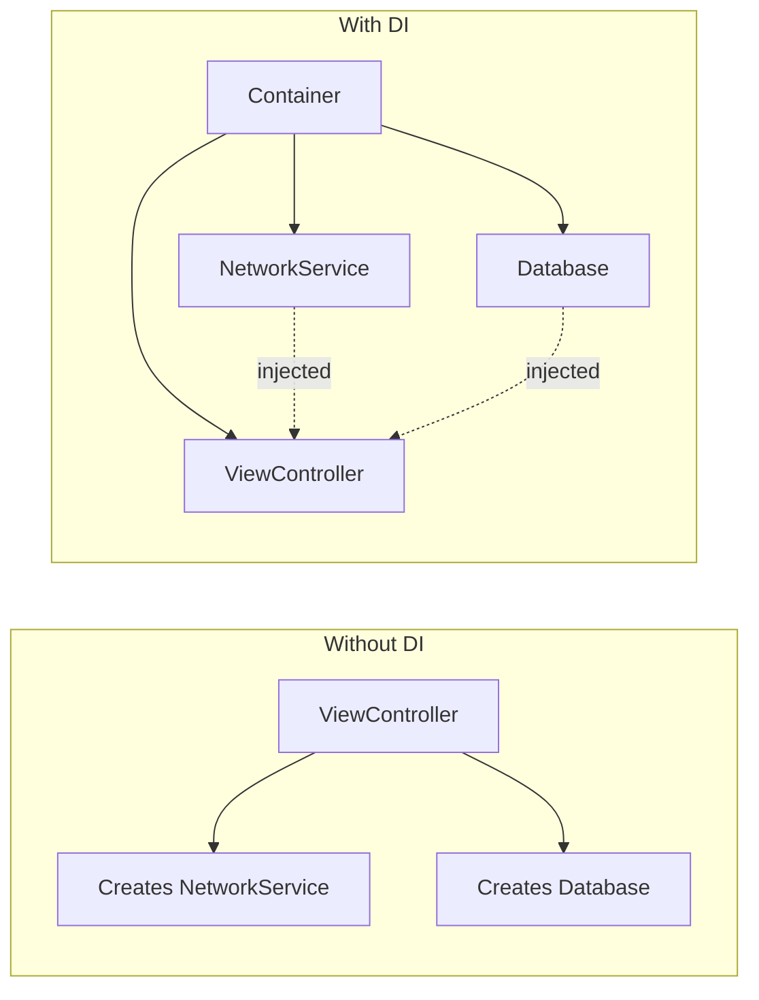
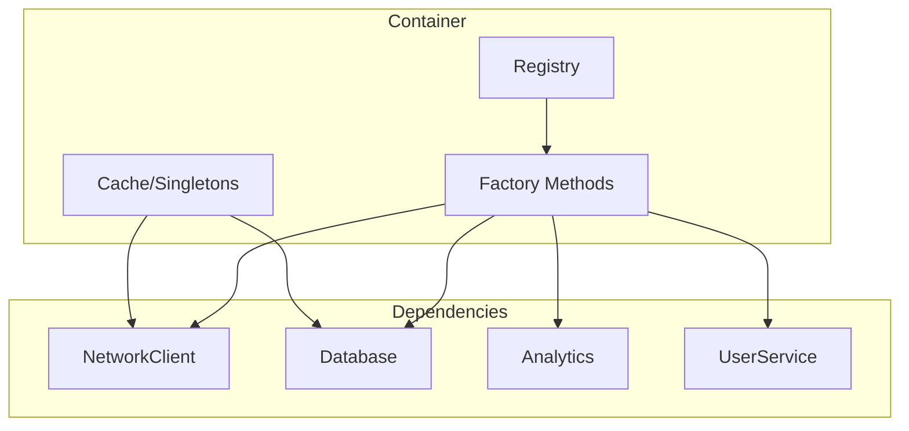
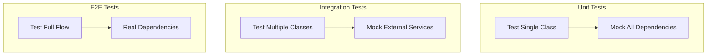

# How to Implement Dependency Injection in Swift

Author: [nawazdhandala](https://www.github.com/nawazdhandala)

Tags: Swift, Dependency Injection, iOS, Architecture, Design Patterns, Testing, SOLID

Description: Learn how to implement dependency injection in Swift for cleaner, more testable iOS applications. This guide covers constructor injection, property injection, DI containers, and best practices for building maintainable Swift code.

---

> Dependency injection is a design pattern that promotes loose coupling and testability by providing dependencies to objects rather than having them create their own. In Swift development, mastering DI transforms your codebase from tightly coupled spaghetti into modular, testable components.

Dependency injection might sound like a complex enterprise pattern, but at its core, it is simply passing dependencies to an object instead of letting it create them. This small shift in thinking has profound implications for code quality, testability, and maintainability.

---

## What is Dependency Injection?

Dependency injection (DI) inverts the traditional flow of control. Instead of a class creating its own dependencies, those dependencies are "injected" from the outside.



### The Problem DI Solves

Consider this common pattern in iOS development:

This class creates its own URLSession dependency, making it impossible to test without hitting the network.

```swift
// BAD: Tight coupling - difficult to test
class UserService {
    // The service creates its own dependency
    private let session = URLSession.shared

    func fetchUser(id: String) async throws -> User {
        let url = URL(string: "https://api.example.com/users/\(id)")!
        let (data, _) = try await session.data(from: url)
        return try JSONDecoder().decode(User.self, from: data)
    }
}
```

With dependency injection, we pass the dependency from outside:

This refactored version accepts its dependency through the initializer, allowing easy testing with mock sessions.

```swift
// GOOD: Loose coupling - easy to test
class UserService {
    // Dependency is injected, not created
    private let session: URLSession

    init(session: URLSession = .shared) {
        self.session = session
    }

    func fetchUser(id: String) async throws -> User {
        let url = URL(string: "https://api.example.com/users/\(id)")!
        let (data, _) = try await session.data(from: url)
        return try JSONDecoder().decode(User.self, from: data)
    }
}
```

---

## Types of Dependency Injection

Swift supports three primary forms of dependency injection, each with distinct use cases.

| Type | When to Use | Pros | Cons |
|------|-------------|------|------|
| **Constructor Injection** | Required dependencies | Immutable, clear contract | Can lead to long init signatures |
| **Property Injection** | Optional dependencies | Flexible, late binding | Mutable state, potential nil issues |
| **Method Injection** | Per-call dependencies | Context-specific | Repetitive if used often |

---

## Constructor Injection

Constructor injection is the most common and recommended approach. Dependencies are passed through the initializer, making them required and immutable.

### Basic Implementation

The NetworkClient protocol defines the contract, allowing different implementations for production and testing.

```swift
// Define a protocol for the dependency
protocol NetworkClient {
    func fetch(url: URL) async throws -> Data
}

// Production implementation
class URLSessionNetworkClient: NetworkClient {
    private let session: URLSession

    init(session: URLSession = .shared) {
        self.session = session
    }

    func fetch(url: URL) async throws -> Data {
        let (data, response) = try await session.data(from: url)

        guard let httpResponse = response as? HTTPURLResponse,
              (200...299).contains(httpResponse.statusCode) else {
            throw NetworkError.invalidResponse
        }

        return data
    }
}

// Define possible network errors
enum NetworkError: Error {
    case invalidResponse
    case decodingError
    case noData
}
```

Now the service accepts a NetworkClient through its initializer, defaulting to the production implementation.

```swift
// Service using constructor injection
class UserRepository {
    private let networkClient: NetworkClient
    private let decoder: JSONDecoder
    private let baseURL: URL

    // Dependencies injected through initializer
    init(
        networkClient: NetworkClient,
        decoder: JSONDecoder = JSONDecoder(),
        baseURL: URL = URL(string: "https://api.example.com")!
    ) {
        self.networkClient = networkClient
        self.decoder = decoder
        self.baseURL = baseURL
    }

    func getUser(id: String) async throws -> User {
        let url = baseURL.appendingPathComponent("users/\(id)")
        let data = try await networkClient.fetch(url: url)
        return try decoder.decode(User.self, from: data)
    }

    func getAllUsers() async throws -> [User] {
        let url = baseURL.appendingPathComponent("users")
        let data = try await networkClient.fetch(url: url)
        return try decoder.decode([User].self, from: data)
    }
}

// User model
struct User: Codable {
    let id: String
    let name: String
    let email: String
}
```

### Testing with Constructor Injection

This mock implementation allows complete control over network responses during testing.

```swift
// Mock implementation for testing
class MockNetworkClient: NetworkClient {
    var mockData: Data?
    var mockError: Error?
    var fetchCallCount = 0
    var lastRequestedURL: URL?

    func fetch(url: URL) async throws -> Data {
        fetchCallCount += 1
        lastRequestedURL = url

        if let error = mockError {
            throw error
        }

        guard let data = mockData else {
            throw NetworkError.noData
        }

        return data
    }
}

// Unit test example
import XCTest

class UserRepositoryTests: XCTestCase {
    var sut: UserRepository!
    var mockClient: MockNetworkClient!

    override func setUp() {
        super.setUp()
        mockClient = MockNetworkClient()
        sut = UserRepository(networkClient: mockClient)
    }

    func testGetUser_Success() async throws {
        // Arrange: Set up mock response
        let expectedUser = User(id: "123", name: "John", email: "john@example.com")
        mockClient.mockData = try JSONEncoder().encode(expectedUser)

        // Act: Call the method under test
        let user = try await sut.getUser(id: "123")

        // Assert: Verify results
        XCTAssertEqual(user.id, "123")
        XCTAssertEqual(user.name, "John")
        XCTAssertEqual(mockClient.fetchCallCount, 1)
        XCTAssertTrue(mockClient.lastRequestedURL?.absoluteString.contains("users/123") ?? false)
    }

    func testGetUser_NetworkError() async {
        // Arrange: Set up mock to throw error
        mockClient.mockError = NetworkError.invalidResponse

        // Act & Assert: Verify error is thrown
        do {
            _ = try await sut.getUser(id: "123")
            XCTFail("Expected error to be thrown")
        } catch {
            XCTAssertEqual(error as? NetworkError, .invalidResponse)
        }
    }
}
```

---

## Property Injection

Property injection sets dependencies after object creation. This is useful for optional dependencies or when using Interface Builder.

Property injection works well with SwiftUI's environment system and optional dependencies.

```swift
// Protocol for analytics tracking
protocol AnalyticsTracker {
    func track(event: String, properties: [String: Any])
}

// Production analytics implementation
class FirebaseAnalyticsTracker: AnalyticsTracker {
    func track(event: String, properties: [String: Any]) {
        // Firebase tracking implementation
        print("Tracking \(event) with \(properties)")
    }
}

// Service with property injection for optional dependency
class CheckoutService {
    private let paymentProcessor: PaymentProcessor

    // Optional dependency via property injection
    // Analytics might not be needed in all environments
    var analyticsTracker: AnalyticsTracker?

    init(paymentProcessor: PaymentProcessor) {
        self.paymentProcessor = paymentProcessor
    }

    func processPayment(amount: Decimal) async throws -> PaymentResult {
        // Track the attempt if analytics is available
        analyticsTracker?.track(
            event: "payment_started",
            properties: ["amount": amount]
        )

        let result = try await paymentProcessor.charge(amount: amount)

        // Track the result
        analyticsTracker?.track(
            event: "payment_completed",
            properties: [
                "amount": amount,
                "success": result.success
            ]
        )

        return result
    }
}

// Payment related types
protocol PaymentProcessor {
    func charge(amount: Decimal) async throws -> PaymentResult
}

struct PaymentResult {
    let success: Bool
    let transactionId: String?
}
```

### SwiftUI Environment Injection

SwiftUI provides built-in property injection through the environment system.

The @EnvironmentObject property wrapper enables automatic dependency injection in SwiftUI view hierarchies.

```swift
import SwiftUI

// Observable dependency
class AuthenticationManager: ObservableObject {
    @Published var isAuthenticated = false
    @Published var currentUser: User?

    func login(email: String, password: String) async throws {
        // Authentication logic
        isAuthenticated = true
        currentUser = User(id: "1", name: "John", email: email)
    }

    func logout() {
        isAuthenticated = false
        currentUser = nil
    }
}

// View using environment injection
struct ProfileView: View {
    // Dependency injected via environment
    @EnvironmentObject var authManager: AuthenticationManager

    var body: some View {
        VStack {
            if let user = authManager.currentUser {
                Text("Welcome, \(user.name)")
                Button("Logout") {
                    authManager.logout()
                }
            } else {
                Text("Please log in")
            }
        }
    }
}

// App setup injecting the dependency
@main
struct MyApp: App {
    @StateObject private var authManager = AuthenticationManager()

    var body: some Scene {
        WindowGroup {
            ContentView()
                .environmentObject(authManager)
        }
    }
}
```

---

## Method Injection

Method injection passes dependencies as function parameters. This is ideal for context-specific or transient dependencies.

Method injection is perfect when different calls require different configurations or contexts.

```swift
// Protocol for logging
protocol Logger {
    func log(_ message: String, level: LogLevel)
}

enum LogLevel {
    case debug, info, warning, error
}

// File processor using method injection
class FileProcessor {
    func process(
        fileURL: URL,
        logger: Logger,
        progressHandler: ((Double) -> Void)? = nil
    ) async throws -> ProcessedFile {
        logger.log("Starting file processing: \(fileURL)", level: .info)

        // Read file
        let data = try Data(contentsOf: fileURL)
        progressHandler?(0.25)

        // Validate
        guard isValid(data) else {
            logger.log("Invalid file format", level: .error)
            throw FileError.invalidFormat
        }
        progressHandler?(0.5)

        // Process
        let processed = try await performProcessing(data)
        progressHandler?(0.75)

        logger.log("File processing complete", level: .info)
        progressHandler?(1.0)

        return processed
    }

    private func isValid(_ data: Data) -> Bool {
        return !data.isEmpty
    }

    private func performProcessing(_ data: Data) async throws -> ProcessedFile {
        // Processing logic
        return ProcessedFile(size: data.count)
    }
}

struct ProcessedFile {
    let size: Int
}

enum FileError: Error {
    case invalidFormat
    case processingFailed
}
```

---

## Building a Dependency Injection Container

For larger applications, a DI container manages dependency creation and lifecycle.



### Simple Container Implementation

This container uses closures as factories, allowing lazy instantiation and flexible configuration.

```swift
// Dependency container using closures for lazy instantiation
class DependencyContainer {
    // Singleton instance for global access
    static let shared = DependencyContainer()

    // Storage for singleton instances
    private var singletons: [String: Any] = [:]

    // Storage for factory closures
    private var factories: [String: () -> Any] = [:]

    // Thread safety lock
    private let lock = NSLock()

    private init() {
        registerDefaults()
    }

    // Register a factory for creating instances
    func register<T>(_ type: T.Type, factory: @escaping () -> T) {
        let key = String(describing: type)
        lock.lock()
        factories[key] = factory
        lock.unlock()
    }

    // Register a singleton instance
    func registerSingleton<T>(_ type: T.Type, factory: @escaping () -> T) {
        let key = String(describing: type)
        lock.lock()
        factories[key] = { [weak self] in
            guard let self = self else { return factory() }

            if let existing = self.singletons[key] as? T {
                return existing
            }

            let instance = factory()
            self.singletons[key] = instance
            return instance
        }
        lock.unlock()
    }

    // Resolve a dependency
    func resolve<T>(_ type: T.Type) -> T {
        let key = String(describing: type)
        lock.lock()
        defer { lock.unlock() }

        guard let factory = factories[key],
              let instance = factory() as? T else {
            fatalError("No registration for type \(type)")
        }

        return instance
    }

    // Register default implementations
    private func registerDefaults() {
        // Network layer - singleton for connection reuse
        registerSingleton(NetworkClient.self) {
            URLSessionNetworkClient()
        }

        // User repository - new instance each time
        register(UserRepository.self) { [weak self] in
            guard let self = self else { fatalError("Container deallocated") }
            return UserRepository(
                networkClient: self.resolve(NetworkClient.self)
            )
        }

        // Analytics - singleton
        registerSingleton(AnalyticsTracker.self) {
            FirebaseAnalyticsTracker()
        }
    }

    // Reset for testing
    func reset() {
        lock.lock()
        singletons.removeAll()
        factories.removeAll()
        lock.unlock()
        registerDefaults()
    }
}
```

### Using the Container

The container provides a central point for dependency resolution throughout the application.

```swift
// Usage in application code
class HomeViewController: UIViewController {
    private let userRepository: UserRepository

    // Resolve dependencies from container
    init(userRepository: UserRepository = DependencyContainer.shared.resolve(UserRepository.self)) {
        self.userRepository = userRepository
        super.init(nibName: nil, bundle: nil)
    }

    required init?(coder: NSCoder) {
        self.userRepository = DependencyContainer.shared.resolve(UserRepository.self)
        super.init(coder: coder)
    }

    override func viewDidLoad() {
        super.viewDidLoad()
        loadUsers()
    }

    private func loadUsers() {
        Task {
            do {
                let users = try await userRepository.getAllUsers()
                updateUI(with: users)
            } catch {
                showError(error)
            }
        }
    }

    private func updateUI(with users: [User]) {
        // Update UI
    }

    private func showError(_ error: Error) {
        // Show error
    }
}
```

---

## Protocol-Based Dependency Injection

Protocols are the foundation of effective DI in Swift. They define contracts that both production code and test mocks can fulfill.

### Designing Injectable Protocols

Each protocol should represent a single responsibility with clear method signatures.

```swift
// Storage protocol for data persistence
protocol DataStorage {
    func save<T: Encodable>(_ value: T, forKey key: String) throws
    func load<T: Decodable>(_ type: T.Type, forKey key: String) throws -> T?
    func delete(forKey key: String) throws
    func exists(forKey key: String) -> Bool
}

// UserDefaults implementation
class UserDefaultsStorage: DataStorage {
    private let defaults: UserDefaults
    private let encoder: JSONEncoder
    private let decoder: JSONDecoder

    init(
        defaults: UserDefaults = .standard,
        encoder: JSONEncoder = JSONEncoder(),
        decoder: JSONDecoder = JSONDecoder()
    ) {
        self.defaults = defaults
        self.encoder = encoder
        self.decoder = decoder
    }

    func save<T: Encodable>(_ value: T, forKey key: String) throws {
        let data = try encoder.encode(value)
        defaults.set(data, forKey: key)
    }

    func load<T: Decodable>(_ type: T.Type, forKey key: String) throws -> T? {
        guard let data = defaults.data(forKey: key) else {
            return nil
        }
        return try decoder.decode(type, from: data)
    }

    func delete(forKey key: String) throws {
        defaults.removeObject(forKey: key)
    }

    func exists(forKey key: String) -> Bool {
        return defaults.object(forKey: key) != nil
    }
}

// File-based implementation for larger data
class FileStorage: DataStorage {
    private let fileManager: FileManager
    private let baseDirectory: URL
    private let encoder: JSONEncoder
    private let decoder: JSONDecoder

    init(
        fileManager: FileManager = .default,
        encoder: JSONEncoder = JSONEncoder(),
        decoder: JSONDecoder = JSONDecoder()
    ) throws {
        self.fileManager = fileManager
        self.encoder = encoder
        self.decoder = decoder

        // Create base directory in documents folder
        let documents = try fileManager.url(
            for: .documentDirectory,
            in: .userDomainMask,
            appropriateFor: nil,
            create: true
        )
        self.baseDirectory = documents.appendingPathComponent("Storage")

        // Ensure directory exists
        try fileManager.createDirectory(
            at: baseDirectory,
            withIntermediateDirectories: true
        )
    }

    private func fileURL(forKey key: String) -> URL {
        return baseDirectory.appendingPathComponent("\(key).json")
    }

    func save<T: Encodable>(_ value: T, forKey key: String) throws {
        let data = try encoder.encode(value)
        try data.write(to: fileURL(forKey: key))
    }

    func load<T: Decodable>(_ type: T.Type, forKey key: String) throws -> T? {
        let url = fileURL(forKey: key)
        guard fileManager.fileExists(atPath: url.path) else {
            return nil
        }
        let data = try Data(contentsOf: url)
        return try decoder.decode(type, from: data)
    }

    func delete(forKey key: String) throws {
        let url = fileURL(forKey: key)
        if fileManager.fileExists(atPath: url.path) {
            try fileManager.removeItem(at: url)
        }
    }

    func exists(forKey key: String) -> Bool {
        return fileManager.fileExists(atPath: fileURL(forKey: key).path)
    }
}
```

### Service Composition

Complex services can be composed from simpler injectable dependencies.

```swift
// User preferences service using storage dependency
class UserPreferencesService {
    private let storage: DataStorage
    private let notificationCenter: NotificationCenter

    struct Preferences: Codable {
        var theme: Theme
        var notificationsEnabled: Bool
        var language: String

        enum Theme: String, Codable {
            case light, dark, system
        }

        static let `default` = Preferences(
            theme: .system,
            notificationsEnabled: true,
            language: "en"
        )
    }

    private let preferencesKey = "user_preferences"

    init(
        storage: DataStorage,
        notificationCenter: NotificationCenter = .default
    ) {
        self.storage = storage
        self.notificationCenter = notificationCenter
    }

    func getPreferences() throws -> Preferences {
        return try storage.load(Preferences.self, forKey: preferencesKey) ?? .default
    }

    func savePreferences(_ preferences: Preferences) throws {
        try storage.save(preferences, forKey: preferencesKey)

        // Notify observers of the change
        notificationCenter.post(
            name: .preferencesDidChange,
            object: nil,
            userInfo: ["preferences": preferences]
        )
    }

    func updateTheme(_ theme: Preferences.Theme) throws {
        var prefs = try getPreferences()
        prefs.theme = theme
        try savePreferences(prefs)
    }

    func resetToDefaults() throws {
        try savePreferences(.default)
    }
}

// Notification name extension
extension Notification.Name {
    static let preferencesDidChange = Notification.Name("preferencesDidChange")
}
```

---

## Advanced DI Patterns

### Factory Pattern with DI

Factories create objects with injected dependencies, useful when the exact type is determined at runtime.

```swift
// Protocol for view controllers that display user profiles
protocol ProfileDisplayable: UIViewController {
    var userId: String { get }
}

// Factory for creating profile view controllers
protocol ProfileViewControllerFactory {
    func makeProfileViewController(for userId: String) -> ProfileDisplayable
}

// Implementation using dependency injection
class DefaultProfileViewControllerFactory: ProfileViewControllerFactory {
    private let userRepository: UserRepository
    private let analyticsTracker: AnalyticsTracker

    init(userRepository: UserRepository, analyticsTracker: AnalyticsTracker) {
        self.userRepository = userRepository
        self.analyticsTracker = analyticsTracker
    }

    func makeProfileViewController(for userId: String) -> ProfileDisplayable {
        return ProfileViewController(
            userId: userId,
            userRepository: userRepository,
            analyticsTracker: analyticsTracker
        )
    }
}

// Profile view controller with injected dependencies
class ProfileViewController: UIViewController, ProfileDisplayable {
    let userId: String
    private let userRepository: UserRepository
    private let analyticsTracker: AnalyticsTracker

    init(
        userId: String,
        userRepository: UserRepository,
        analyticsTracker: AnalyticsTracker
    ) {
        self.userId = userId
        self.userRepository = userRepository
        self.analyticsTracker = analyticsTracker
        super.init(nibName: nil, bundle: nil)
    }

    required init?(coder: NSCoder) {
        fatalError("init(coder:) has not been implemented")
    }

    override func viewDidLoad() {
        super.viewDidLoad()
        analyticsTracker.track(
            event: "profile_viewed",
            properties: ["user_id": userId]
        )
        loadProfile()
    }

    private func loadProfile() {
        Task {
            do {
                let user = try await userRepository.getUser(id: userId)
                updateUI(with: user)
            } catch {
                showError(error)
            }
        }
    }

    private func updateUI(with user: User) {
        title = user.name
    }

    private func showError(_ error: Error) {
        // Handle error
    }
}
```

### Scoped Dependencies

Some dependencies should have different lifetimes. This pattern manages request-scoped dependencies.

```swift
// Request context for scoped dependencies
class RequestContext {
    let requestId: String
    let timestamp: Date
    let logger: Logger

    init(requestId: String = UUID().uuidString) {
        self.requestId = requestId
        self.timestamp = Date()
        self.logger = ScopedLogger(requestId: requestId)
    }
}

// Logger that includes request context
class ScopedLogger: Logger {
    private let requestId: String

    init(requestId: String) {
        self.requestId = requestId
    }

    func log(_ message: String, level: LogLevel) {
        let timestamp = ISO8601DateFormatter().string(from: Date())
        print("[\(timestamp)] [\(requestId)] [\(level)] \(message)")
    }
}

// Service using scoped context
class OrderService {
    private let paymentProcessor: PaymentProcessor
    private let inventoryService: InventoryService

    init(paymentProcessor: PaymentProcessor, inventoryService: InventoryService) {
        self.paymentProcessor = paymentProcessor
        self.inventoryService = inventoryService
    }

    func processOrder(_ order: Order, context: RequestContext) async throws -> OrderResult {
        context.logger.log("Processing order \(order.id)", level: .info)

        // Check inventory
        let available = try await inventoryService.checkAvailability(
            items: order.items,
            context: context
        )

        guard available else {
            context.logger.log("Inventory unavailable for order \(order.id)", level: .warning)
            throw OrderError.inventoryUnavailable
        }

        // Process payment
        let paymentResult = try await paymentProcessor.charge(amount: order.total)

        context.logger.log("Order \(order.id) completed successfully", level: .info)

        return OrderResult(
            orderId: order.id,
            transactionId: paymentResult.transactionId,
            requestId: context.requestId
        )
    }
}

// Supporting types
struct Order {
    let id: String
    let items: [OrderItem]
    let total: Decimal
}

struct OrderItem {
    let productId: String
    let quantity: Int
}

struct OrderResult {
    let orderId: String
    let transactionId: String?
    let requestId: String
}

enum OrderError: Error {
    case inventoryUnavailable
    case paymentFailed
}

protocol InventoryService {
    func checkAvailability(items: [OrderItem], context: RequestContext) async throws -> Bool
}
```

---

## Testing Strategies

Effective DI enables comprehensive testing at multiple levels.



### Comprehensive Mock Example

This mock provides full control over responses and tracks all method calls for verification.

```swift
// Full-featured mock for testing
class MockDataStorage: DataStorage {
    // Track all method calls
    var saveCallCount = 0
    var loadCallCount = 0
    var deleteCallCount = 0

    // Stored data for verification
    var storedData: [String: Data] = [:]

    // Control behavior
    var shouldThrowOnSave = false
    var shouldThrowOnLoad = false

    func save<T: Encodable>(_ value: T, forKey key: String) throws {
        saveCallCount += 1

        if shouldThrowOnSave {
            throw StorageError.saveFailed
        }

        let data = try JSONEncoder().encode(value)
        storedData[key] = data
    }

    func load<T: Decodable>(_ type: T.Type, forKey key: String) throws -> T? {
        loadCallCount += 1

        if shouldThrowOnLoad {
            throw StorageError.loadFailed
        }

        guard let data = storedData[key] else {
            return nil
        }

        return try JSONDecoder().decode(type, from: data)
    }

    func delete(forKey key: String) throws {
        deleteCallCount += 1
        storedData.removeValue(forKey: key)
    }

    func exists(forKey key: String) -> Bool {
        return storedData[key] != nil
    }

    // Reset for reuse between tests
    func reset() {
        saveCallCount = 0
        loadCallCount = 0
        deleteCallCount = 0
        storedData.removeAll()
        shouldThrowOnSave = false
        shouldThrowOnLoad = false
    }
}

enum StorageError: Error {
    case saveFailed
    case loadFailed
}

// Test suite using the mock
class UserPreferencesServiceTests: XCTestCase {
    var sut: UserPreferencesService!
    var mockStorage: MockDataStorage!
    var mockNotificationCenter: NotificationCenter!

    override func setUp() {
        super.setUp()
        mockStorage = MockDataStorage()
        mockNotificationCenter = NotificationCenter()
        sut = UserPreferencesService(
            storage: mockStorage,
            notificationCenter: mockNotificationCenter
        )
    }

    override func tearDown() {
        mockStorage.reset()
        sut = nil
        super.tearDown()
    }

    func testGetPreferences_ReturnsDefault_WhenNoneStored() throws {
        // Act
        let preferences = try sut.getPreferences()

        // Assert
        XCTAssertEqual(preferences.theme, .system)
        XCTAssertTrue(preferences.notificationsEnabled)
        XCTAssertEqual(mockStorage.loadCallCount, 1)
    }

    func testSavePreferences_StoresData() throws {
        // Arrange
        var prefs = UserPreferencesService.Preferences.default
        prefs.theme = .dark

        // Act
        try sut.savePreferences(prefs)

        // Assert
        XCTAssertEqual(mockStorage.saveCallCount, 1)

        // Verify stored data
        let loaded = try sut.getPreferences()
        XCTAssertEqual(loaded.theme, .dark)
    }

    func testSavePreferences_PostsNotification() throws {
        // Arrange
        var receivedNotification = false
        let observer = mockNotificationCenter.addObserver(
            forName: .preferencesDidChange,
            object: nil,
            queue: nil
        ) { _ in
            receivedNotification = true
        }

        // Act
        try sut.savePreferences(.default)

        // Assert
        XCTAssertTrue(receivedNotification)

        // Cleanup
        mockNotificationCenter.removeObserver(observer)
    }

    func testSavePreferences_ThrowsError_WhenStorageFails() {
        // Arrange
        mockStorage.shouldThrowOnSave = true

        // Act & Assert
        XCTAssertThrowsError(try sut.savePreferences(.default)) { error in
            XCTAssertEqual(error as? StorageError, .saveFailed)
        }
    }
}
```

---

## Best Practices

### 1. Prefer Constructor Injection

Constructor injection makes dependencies explicit and ensures objects are fully initialized.

```swift
// GOOD: Clear, immutable dependencies
class GoodService {
    private let dependency1: Protocol1
    private let dependency2: Protocol2

    init(dependency1: Protocol1, dependency2: Protocol2) {
        self.dependency1 = dependency1
        self.dependency2 = dependency2
    }
}

// AVOID: Hidden dependencies
class BadService {
    func doSomething() {
        // Hidden dependency on singleton
        let data = GlobalService.shared.getData()
    }
}
```

### 2. Depend on Abstractions

Program to interfaces (protocols), not concrete implementations.

```swift
// GOOD: Depends on protocol
class DataProcessor {
    private let storage: DataStorage  // Protocol

    init(storage: DataStorage) {
        self.storage = storage
    }
}

// AVOID: Depends on concrete class
class BadDataProcessor {
    private let storage: UserDefaultsStorage  // Concrete class

    init(storage: UserDefaultsStorage) {
        self.storage = storage
    }
}
```

### 3. Keep Dependency Graphs Shallow

Deep dependency chains become difficult to manage and understand.

```swift
// GOOD: Flat dependency structure
class OrderController {
    private let orderService: OrderService
    private let paymentService: PaymentService
    private let notificationService: NotificationService

    init(
        orderService: OrderService,
        paymentService: PaymentService,
        notificationService: NotificationService
    ) {
        self.orderService = orderService
        self.paymentService = paymentService
        self.notificationService = notificationService
    }
}

// AVOID: Deep nesting where OrderController only knows about OrderService
// but OrderService internally creates PaymentService which creates more...
```

### 4. Use Default Parameters for Common Cases

Default parameters reduce boilerplate while maintaining testability.

```swift
class APIClient {
    private let session: URLSession
    private let decoder: JSONDecoder
    private let baseURL: URL

    // Defaults for production, injectable for testing
    init(
        session: URLSession = .shared,
        decoder: JSONDecoder = JSONDecoder(),
        baseURL: URL = URL(string: "https://api.example.com")!
    ) {
        self.session = session
        self.decoder = decoder
        self.baseURL = baseURL
    }
}

// Production: uses all defaults
let client = APIClient()

// Testing: inject mocks
let testClient = APIClient(
    session: mockSession,
    decoder: customDecoder,
    baseURL: URL(string: "https://test.example.com")!
)
```

### 5. Avoid Service Locator Anti-Pattern

While containers are useful, avoid calling them everywhere in your code.

```swift
// AVOID: Service locator pattern spreads container usage
class BadController {
    func doSomething() {
        // Fetching from container in business logic
        let service = Container.shared.resolve(SomeService.self)
        service.process()
    }
}

// GOOD: Inject at construction time
class GoodController {
    private let service: SomeService

    init(service: SomeService) {
        self.service = service
    }

    func doSomething() {
        service.process()
    }
}
```

---

## Conclusion

Dependency injection transforms Swift code from tightly coupled components into flexible, testable modules. Key takeaways:

- **Constructor injection** is the preferred approach for required dependencies
- **Protocols** define contracts that enable swapping implementations
- **Containers** manage complex dependency graphs in larger applications
- **Testing becomes straightforward** when dependencies can be replaced with mocks
- **Default parameters** maintain convenience while enabling full testability

Start with simple constructor injection and gradually introduce more sophisticated patterns as your application grows. The investment in proper DI architecture pays dividends in maintainability, testability, and code quality.

---

*Building iOS applications that require reliable monitoring? [OneUptime](https://oneuptime.com) provides comprehensive monitoring for mobile backends with real-time alerting and performance tracking.*

**Related Reading:**
- [Swift Documentation - Protocols](https://docs.swift.org/swift-book/documentation/the-swift-programming-language/protocols/)
- [Clean Architecture in iOS](https://oneuptime.com/blog)
