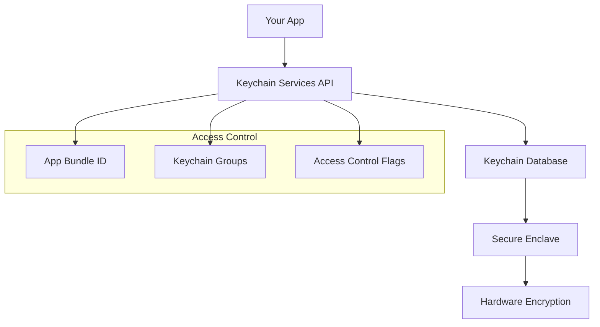
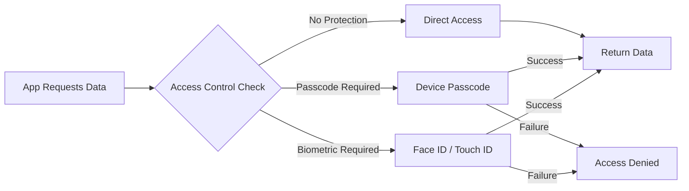
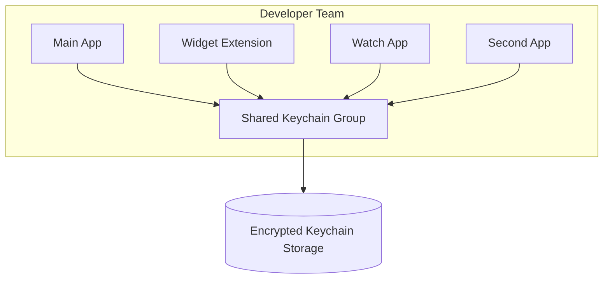

# How to Use Keychain for Secure Storage in Swift

Author: [nawazdhandala](https://www.github.com/nawazdhandala)

Tags: Swift, Keychain, iOS, Security, Data Protection, Apple

Description: Learn how to use the iOS Keychain to securely store sensitive data like passwords, tokens, and cryptographic keys in your Swift applications with practical examples and best practices.

---

> The iOS Keychain is Apple's secure storage solution for sensitive data. Unlike UserDefaults or file storage, Keychain data is encrypted and protected by the device's secure enclave, making it the right choice for storing passwords, API keys, authentication tokens, and other confidential information.

When building iOS applications, you often need to store sensitive user data. Storing credentials in UserDefaults or plain files is a security vulnerability that can expose your users to attacks. The Keychain provides hardware-backed encryption and integrates with iOS security features like Face ID and Touch ID.

---

## Understanding the Keychain

The iOS Keychain is a specialized database for storing small pieces of sensitive data. Each piece of data is called a keychain item, and items are organized by attributes that define how they can be accessed.



### Keychain Item Classes

| Class | Description | Use Case |
|-------|-------------|----------|
| **kSecClassGenericPassword** | Generic password items | API tokens, app passwords |
| **kSecClassInternetPassword** | Internet credentials | Website logins, server auth |
| **kSecClassCertificate** | X.509 certificates | SSL/TLS certificates |
| **kSecClassKey** | Cryptographic keys | Encryption/signing keys |
| **kSecClassIdentity** | Identity (cert + key) | Client authentication |

---

## Basic Keychain Operations

Let's start with the fundamental operations: saving, retrieving, updating, and deleting keychain items.

### Saving Data to Keychain

The following code demonstrates how to save a password to the Keychain. The query dictionary specifies the item class, account identifier, service name, and the actual data to store.

```swift
// KeychainManager.swift
import Foundation
import Security

class KeychainManager {

    // Define possible errors that can occur during Keychain operations
    enum KeychainError: Error {
        case duplicateItem
        case itemNotFound
        case unexpectedStatus(OSStatus)
        case invalidData
    }

    // Save a password or token to the Keychain
    // - Parameters:
    //   - data: The sensitive data to store (converted to Data)
    //   - account: A unique identifier for this credential (e.g., username)
    //   - service: The service this credential belongs to (e.g., app name)
    func save(data: Data, account: String, service: String) throws {
        // Build the query dictionary with required attributes
        let query: [String: Any] = [
            // Specify we're storing a generic password
            kSecClass as String: kSecClassGenericPassword,
            // The account name (acts as a key identifier)
            kSecAttrAccount as String: account,
            // The service name (helps organize items)
            kSecAttrService as String: service,
            // The actual data to store (must be Data type)
            kSecValueData as String: data
        ]

        // Attempt to add the item to the Keychain
        let status = SecItemAdd(query as CFDictionary, nil)

        // Handle the result
        switch status {
        case errSecSuccess:
            // Item was successfully added
            return
        case errSecDuplicateItem:
            // Item already exists - throw error so caller can handle
            throw KeychainError.duplicateItem
        default:
            // Something else went wrong
            throw KeychainError.unexpectedStatus(status)
        }
    }

    // Convenience method to save a string value
    func save(string: String, account: String, service: String) throws {
        guard let data = string.data(using: .utf8) else {
            throw KeychainError.invalidData
        }
        try save(data: data, account: account, service: service)
    }
}
```

### Retrieving Data from Keychain

The retrieval process requires building a query that matches the stored item. The kSecReturnData and kSecMatchLimitOne attributes tell the Keychain to return the actual data for a single matching item.

```swift
extension KeychainManager {

    // Retrieve data from the Keychain
    // - Parameters:
    //   - account: The account identifier used when saving
    //   - service: The service name used when saving
    // - Returns: The stored data, or nil if not found
    func retrieve(account: String, service: String) throws -> Data? {
        // Build the query to find the item
        let query: [String: Any] = [
            kSecClass as String: kSecClassGenericPassword,
            kSecAttrAccount as String: account,
            kSecAttrService as String: service,
            // Request the data be returned
            kSecReturnData as String: true,
            // Only return one item (the first match)
            kSecMatchLimit as String: kSecMatchLimitOne
        ]

        // Variable to hold the retrieved item
        var result: AnyObject?

        // Perform the query
        let status = SecItemCopyMatching(query as CFDictionary, &result)

        switch status {
        case errSecSuccess:
            // Successfully found the item - cast to Data
            return result as? Data
        case errSecItemNotFound:
            // Item doesn't exist
            return nil
        default:
            throw KeychainError.unexpectedStatus(status)
        }
    }

    // Convenience method to retrieve a string value
    func retrieveString(account: String, service: String) throws -> String? {
        guard let data = try retrieve(account: account, service: service) else {
            return nil
        }
        return String(data: data, encoding: .utf8)
    }
}
```

### Updating Keychain Items

When you need to change an existing credential, use SecItemUpdate. This requires two dictionaries: one to identify the item and another containing the new values.

```swift
extension KeychainManager {

    // Update an existing Keychain item
    // - Parameters:
    //   - data: The new data to store
    //   - account: The account identifier
    //   - service: The service name
    func update(data: Data, account: String, service: String) throws {
        // Query to find the existing item
        let query: [String: Any] = [
            kSecClass as String: kSecClassGenericPassword,
            kSecAttrAccount as String: account,
            kSecAttrService as String: service
        ]

        // Attributes to update
        let attributesToUpdate: [String: Any] = [
            kSecValueData as String: data
        ]

        // Perform the update
        let status = SecItemUpdate(
            query as CFDictionary,
            attributesToUpdate as CFDictionary
        )

        switch status {
        case errSecSuccess:
            return
        case errSecItemNotFound:
            throw KeychainError.itemNotFound
        default:
            throw KeychainError.unexpectedStatus(status)
        }
    }

    // Save or update - handles both cases
    func saveOrUpdate(data: Data, account: String, service: String) throws {
        do {
            try save(data: data, account: account, service: service)
        } catch KeychainError.duplicateItem {
            try update(data: data, account: account, service: service)
        }
    }
}
```

### Deleting Keychain Items

Removing items from the Keychain is straightforward. Build a query matching the item and call SecItemDelete.

```swift
extension KeychainManager {

    // Delete an item from the Keychain
    // - Parameters:
    //   - account: The account identifier
    //   - service: The service name
    func delete(account: String, service: String) throws {
        let query: [String: Any] = [
            kSecClass as String: kSecClassGenericPassword,
            kSecAttrAccount as String: account,
            kSecAttrService as String: service
        ]

        let status = SecItemDelete(query as CFDictionary)

        switch status {
        case errSecSuccess, errSecItemNotFound:
            // Success or item didn't exist (both are acceptable outcomes)
            return
        default:
            throw KeychainError.unexpectedStatus(status)
        }
    }

    // Delete all items for a service
    func deleteAll(service: String) throws {
        let query: [String: Any] = [
            kSecClass as String: kSecClassGenericPassword,
            kSecAttrService as String: service
        ]

        let status = SecItemDelete(query as CFDictionary)

        switch status {
        case errSecSuccess, errSecItemNotFound:
            return
        default:
            throw KeychainError.unexpectedStatus(status)
        }
    }
}
```

---

## Access Control and Biometric Authentication

One of the Keychain's most powerful features is its integration with biometric authentication. You can require Face ID or Touch ID before allowing access to sensitive items.



### Saving Items with Biometric Protection

The following code shows how to save sensitive data that requires biometric authentication to retrieve. This is ideal for storing highly sensitive credentials like banking passwords or private keys.

```swift
import LocalAuthentication

extension KeychainManager {

    // Access control policies for Keychain items
    enum AccessPolicy {
        case always                    // No restrictions
        case whenUnlocked             // Only when device is unlocked
        case whenPasscodeSet          // Requires device passcode
        case biometricOnly            // Requires Face ID or Touch ID
        case biometricOrPasscode      // Biometric with passcode fallback
    }

    // Save data with biometric protection
    // - Parameters:
    //   - data: The data to store
    //   - account: Account identifier
    //   - service: Service name
    //   - policy: The access control policy to apply
    //   - reason: The reason shown to user during biometric prompt
    func saveWithBiometric(
        data: Data,
        account: String,
        service: String,
        policy: AccessPolicy = .biometricOrPasscode,
        reason: String = "Authenticate to save credentials"
    ) throws {
        // Create access control object
        var accessControlFlags: SecAccessControlCreateFlags

        switch policy {
        case .always:
            accessControlFlags = []
        case .whenUnlocked:
            accessControlFlags = []
        case .whenPasscodeSet:
            accessControlFlags = .devicePasscode
        case .biometricOnly:
            accessControlFlags = .biometryCurrentSet
        case .biometricOrPasscode:
            accessControlFlags = [.biometryCurrentSet, .or, .devicePasscode]
        }

        // Create the access control object
        var error: Unmanaged<CFError>?
        guard let accessControl = SecAccessControlCreateWithFlags(
            nil,
            kSecAttrAccessibleWhenUnlockedThisDeviceOnly,
            accessControlFlags,
            &error
        ) else {
            if let error = error?.takeRetainedValue() {
                throw error
            }
            throw KeychainError.unexpectedStatus(errSecParam)
        }

        // Build the query with access control
        let query: [String: Any] = [
            kSecClass as String: kSecClassGenericPassword,
            kSecAttrAccount as String: account,
            kSecAttrService as String: service,
            kSecValueData as String: data,
            kSecAttrAccessControl as String: accessControl
        ]

        // Delete existing item first (if any)
        try? delete(account: account, service: service)

        // Add the new item
        let status = SecItemAdd(query as CFDictionary, nil)

        guard status == errSecSuccess else {
            throw KeychainError.unexpectedStatus(status)
        }
    }

    // Retrieve data with biometric authentication
    // - Parameters:
    //   - account: Account identifier
    //   - service: Service name
    //   - reason: The reason shown during biometric prompt
    func retrieveWithBiometric(
        account: String,
        service: String,
        reason: String = "Authenticate to access credentials"
    ) throws -> Data? {
        // Create LAContext for the biometric prompt
        let context = LAContext()
        context.localizedReason = reason

        // Build the query
        let query: [String: Any] = [
            kSecClass as String: kSecClassGenericPassword,
            kSecAttrAccount as String: account,
            kSecAttrService as String: service,
            kSecReturnData as String: true,
            kSecMatchLimit as String: kSecMatchLimitOne,
            // Pass the LAContext to handle biometric authentication
            kSecUseAuthenticationContext as String: context
        ]

        var result: AnyObject?
        let status = SecItemCopyMatching(query as CFDictionary, &result)

        switch status {
        case errSecSuccess:
            return result as? Data
        case errSecItemNotFound:
            return nil
        case errSecUserCanceled:
            // User cancelled biometric authentication
            throw KeychainError.unexpectedStatus(status)
        default:
            throw KeychainError.unexpectedStatus(status)
        }
    }
}
```

---

## Keychain Accessibility Options

The Keychain provides several accessibility options that determine when stored data can be accessed. Choosing the right option is crucial for both security and functionality.

| Accessibility | Description | Survives Backup | Use Case |
|---------------|-------------|-----------------|----------|
| **kSecAttrAccessibleWhenUnlocked** | Available when device unlocked | Yes | General credentials |
| **kSecAttrAccessibleWhenUnlockedThisDeviceOnly** | Unlocked, this device only | No | Sensitive data |
| **kSecAttrAccessibleAfterFirstUnlock** | After first unlock until reboot | Yes | Background tasks |
| **kSecAttrAccessibleAfterFirstUnlockThisDeviceOnly** | After first unlock, this device | No | Background sensitive data |
| **kSecAttrAccessibleWhenPasscodeSetThisDeviceOnly** | Only when passcode is set | No | Highly sensitive data |

### Configuring Accessibility

The accessibility attribute determines when your app can access stored data. For background operations, use AfterFirstUnlock. For maximum security, use WhenPasscodeSetThisDeviceOnly.

```swift
extension KeychainManager {

    // Accessibility levels
    enum Accessibility {
        case whenUnlocked
        case whenUnlockedThisDeviceOnly
        case afterFirstUnlock
        case afterFirstUnlockThisDeviceOnly
        case whenPasscodeSetThisDeviceOnly

        var rawValue: CFString {
            switch self {
            case .whenUnlocked:
                return kSecAttrAccessibleWhenUnlocked
            case .whenUnlockedThisDeviceOnly:
                return kSecAttrAccessibleWhenUnlockedThisDeviceOnly
            case .afterFirstUnlock:
                return kSecAttrAccessibleAfterFirstUnlock
            case .afterFirstUnlockThisDeviceOnly:
                return kSecAttrAccessibleAfterFirstUnlockThisDeviceOnly
            case .whenPasscodeSetThisDeviceOnly:
                return kSecAttrAccessibleWhenPasscodeSetThisDeviceOnly
            }
        }
    }

    // Save with specific accessibility
    func save(
        data: Data,
        account: String,
        service: String,
        accessibility: Accessibility
    ) throws {
        let query: [String: Any] = [
            kSecClass as String: kSecClassGenericPassword,
            kSecAttrAccount as String: account,
            kSecAttrService as String: service,
            kSecValueData as String: data,
            kSecAttrAccessible as String: accessibility.rawValue
        ]

        let status = SecItemAdd(query as CFDictionary, nil)

        switch status {
        case errSecSuccess:
            return
        case errSecDuplicateItem:
            throw KeychainError.duplicateItem
        default:
            throw KeychainError.unexpectedStatus(status)
        }
    }
}
```

---

## Keychain Sharing Between Apps

Apple allows apps from the same developer to share Keychain items using Keychain Access Groups. This is useful for app families or when you have a main app and extensions.



### Setting Up Keychain Sharing

First, configure your app's entitlements to enable keychain sharing. Add the Keychain Sharing capability in Xcode, which creates the entitlements file.

```swift
// Add to your .entitlements file:
// <key>keychain-access-groups</key>
// <array>
//     <string>$(AppIdentifierPrefix)com.yourcompany.shared</string>
// </array>

extension KeychainManager {

    // Save data to a shared Keychain group
    // - Parameters:
    //   - data: The data to store
    //   - account: Account identifier
    //   - service: Service name
    //   - accessGroup: The Keychain access group identifier
    func saveToGroup(
        data: Data,
        account: String,
        service: String,
        accessGroup: String
    ) throws {
        let query: [String: Any] = [
            kSecClass as String: kSecClassGenericPassword,
            kSecAttrAccount as String: account,
            kSecAttrService as String: service,
            kSecValueData as String: data,
            // Specify the access group for sharing
            kSecAttrAccessGroup as String: accessGroup
        ]

        let status = SecItemAdd(query as CFDictionary, nil)

        guard status == errSecSuccess || status == errSecDuplicateItem else {
            throw KeychainError.unexpectedStatus(status)
        }

        if status == errSecDuplicateItem {
            try updateInGroup(
                data: data,
                account: account,
                service: service,
                accessGroup: accessGroup
            )
        }
    }

    // Retrieve data from a shared Keychain group
    func retrieveFromGroup(
        account: String,
        service: String,
        accessGroup: String
    ) throws -> Data? {
        let query: [String: Any] = [
            kSecClass as String: kSecClassGenericPassword,
            kSecAttrAccount as String: account,
            kSecAttrService as String: service,
            kSecAttrAccessGroup as String: accessGroup,
            kSecReturnData as String: true,
            kSecMatchLimit as String: kSecMatchLimitOne
        ]

        var result: AnyObject?
        let status = SecItemCopyMatching(query as CFDictionary, &result)

        switch status {
        case errSecSuccess:
            return result as? Data
        case errSecItemNotFound:
            return nil
        default:
            throw KeychainError.unexpectedStatus(status)
        }
    }

    // Update data in a shared Keychain group
    private func updateInGroup(
        data: Data,
        account: String,
        service: String,
        accessGroup: String
    ) throws {
        let query: [String: Any] = [
            kSecClass as String: kSecClassGenericPassword,
            kSecAttrAccount as String: account,
            kSecAttrService as String: service,
            kSecAttrAccessGroup as String: accessGroup
        ]

        let attributesToUpdate: [String: Any] = [
            kSecValueData as String: data
        ]

        let status = SecItemUpdate(
            query as CFDictionary,
            attributesToUpdate as CFDictionary
        )

        guard status == errSecSuccess else {
            throw KeychainError.unexpectedStatus(status)
        }
    }
}
```

---

## Storing Internet Credentials

For web service authentication, use kSecClassInternetPassword. This item class provides additional attributes for server, protocol, and port information.

```swift
extension KeychainManager {

    // Internet password attributes for organizing web credentials
    struct InternetCredential {
        let username: String
        let password: String
        let server: String
        let port: Int?
        let path: String?
        let securityDomain: String?
        let protocolType: CFString  // kSecAttrProtocolHTTPS, etc.
    }

    // Save internet credentials (useful for web service logins)
    func saveInternetCredential(_ credential: InternetCredential) throws {
        var query: [String: Any] = [
            kSecClass as String: kSecClassInternetPassword,
            kSecAttrAccount as String: credential.username,
            kSecAttrServer as String: credential.server,
            kSecAttrProtocol as String: credential.protocolType,
            kSecValueData as String: credential.password.data(using: .utf8)!
        ]

        // Add optional attributes if provided
        if let port = credential.port {
            query[kSecAttrPort as String] = port
        }
        if let path = credential.path {
            query[kSecAttrPath as String] = path
        }
        if let securityDomain = credential.securityDomain {
            query[kSecAttrSecurityDomain as String] = securityDomain
        }

        let status = SecItemAdd(query as CFDictionary, nil)

        switch status {
        case errSecSuccess:
            return
        case errSecDuplicateItem:
            throw KeychainError.duplicateItem
        default:
            throw KeychainError.unexpectedStatus(status)
        }
    }

    // Retrieve internet credentials
    func retrieveInternetCredential(
        username: String,
        server: String
    ) throws -> String? {
        let query: [String: Any] = [
            kSecClass as String: kSecClassInternetPassword,
            kSecAttrAccount as String: username,
            kSecAttrServer as String: server,
            kSecReturnData as String: true,
            kSecMatchLimit as String: kSecMatchLimitOne
        ]

        var result: AnyObject?
        let status = SecItemCopyMatching(query as CFDictionary, &result)

        switch status {
        case errSecSuccess:
            guard let data = result as? Data else { return nil }
            return String(data: data, encoding: .utf8)
        case errSecItemNotFound:
            return nil
        default:
            throw KeychainError.unexpectedStatus(status)
        }
    }
}
```

---

## Building a Complete Keychain Wrapper

Here is a production-ready Keychain wrapper that combines all the concepts covered above into a reusable class with a clean API.

```swift
// SecureStorage.swift
import Foundation
import Security
import LocalAuthentication

// A complete, production-ready Keychain wrapper
final class SecureStorage {

    // MARK: - Types

    enum StorageError: LocalizedError {
        case dataConversionFailed
        case itemNotFound
        case duplicateItem
        case authenticationFailed
        case accessDenied
        case unknown(OSStatus)

        var errorDescription: String? {
            switch self {
            case .dataConversionFailed:
                return "Failed to convert data"
            case .itemNotFound:
                return "Item not found in Keychain"
            case .duplicateItem:
                return "Item already exists in Keychain"
            case .authenticationFailed:
                return "Biometric authentication failed"
            case .accessDenied:
                return "Access to Keychain was denied"
            case .unknown(let status):
                return "Keychain error: \(status)"
            }
        }
    }

    struct Configuration {
        let service: String
        let accessGroup: String?
        let accessibility: CFString
        let requiresBiometric: Bool

        init(
            service: String,
            accessGroup: String? = nil,
            accessibility: CFString = kSecAttrAccessibleWhenUnlockedThisDeviceOnly,
            requiresBiometric: Bool = false
        ) {
            self.service = service
            self.accessGroup = accessGroup
            self.accessibility = accessibility
            self.requiresBiometric = requiresBiometric
        }
    }

    // MARK: - Properties

    private let configuration: Configuration

    // MARK: - Initialization

    init(configuration: Configuration) {
        self.configuration = configuration
    }

    // Convenience initializer with service name only
    convenience init(service: String) {
        self.init(configuration: Configuration(service: service))
    }

    // MARK: - Public Methods

    // Store any Codable object
    func store<T: Codable>(_ item: T, forKey key: String) throws {
        let data = try JSONEncoder().encode(item)
        try storeData(data, forKey: key)
    }

    // Retrieve any Codable object
    func retrieve<T: Codable>(_ type: T.Type, forKey key: String) throws -> T? {
        guard let data = try retrieveData(forKey: key) else {
            return nil
        }
        return try JSONDecoder().decode(T.self, from: data)
    }

    // Store a string value
    func storeString(_ string: String, forKey key: String) throws {
        guard let data = string.data(using: .utf8) else {
            throw StorageError.dataConversionFailed
        }
        try storeData(data, forKey: key)
    }

    // Retrieve a string value
    func retrieveString(forKey key: String) throws -> String? {
        guard let data = try retrieveData(forKey: key) else {
            return nil
        }
        return String(data: data, encoding: .utf8)
    }

    // Store raw data
    func storeData(_ data: Data, forKey key: String) throws {
        // Delete any existing item first
        try? delete(forKey: key)

        var query = baseQuery(forKey: key)
        query[kSecValueData as String] = data

        // Add access control if biometric is required
        if configuration.requiresBiometric {
            var error: Unmanaged<CFError>?
            guard let accessControl = SecAccessControlCreateWithFlags(
                nil,
                configuration.accessibility,
                [.biometryCurrentSet, .or, .devicePasscode],
                &error
            ) else {
                throw error?.takeRetainedValue() ?? StorageError.unknown(errSecParam)
            }
            query[kSecAttrAccessControl as String] = accessControl
        } else {
            query[kSecAttrAccessible as String] = configuration.accessibility
        }

        let status = SecItemAdd(query as CFDictionary, nil)

        guard status == errSecSuccess else {
            throw mapError(status)
        }
    }

    // Retrieve raw data
    func retrieveData(forKey key: String) throws -> Data? {
        var query = baseQuery(forKey: key)
        query[kSecReturnData as String] = true
        query[kSecMatchLimit as String] = kSecMatchLimitOne

        // Add authentication context if needed
        if configuration.requiresBiometric {
            let context = LAContext()
            context.localizedReason = "Access secure storage"
            query[kSecUseAuthenticationContext as String] = context
        }

        var result: AnyObject?
        let status = SecItemCopyMatching(query as CFDictionary, &result)

        switch status {
        case errSecSuccess:
            return result as? Data
        case errSecItemNotFound:
            return nil
        default:
            throw mapError(status)
        }
    }

    // Delete an item
    func delete(forKey key: String) throws {
        let query = baseQuery(forKey: key)
        let status = SecItemDelete(query as CFDictionary)

        guard status == errSecSuccess || status == errSecItemNotFound else {
            throw mapError(status)
        }
    }

    // Delete all items for this service
    func deleteAll() throws {
        var query: [String: Any] = [
            kSecClass as String: kSecClassGenericPassword,
            kSecAttrService as String: configuration.service
        ]

        if let accessGroup = configuration.accessGroup {
            query[kSecAttrAccessGroup as String] = accessGroup
        }

        let status = SecItemDelete(query as CFDictionary)

        guard status == errSecSuccess || status == errSecItemNotFound else {
            throw mapError(status)
        }
    }

    // Check if an item exists
    func exists(forKey key: String) -> Bool {
        var query = baseQuery(forKey: key)
        query[kSecReturnData as String] = false

        let status = SecItemCopyMatching(query as CFDictionary, nil)
        return status == errSecSuccess
    }

    // MARK: - Private Methods

    private func baseQuery(forKey key: String) -> [String: Any] {
        var query: [String: Any] = [
            kSecClass as String: kSecClassGenericPassword,
            kSecAttrAccount as String: key,
            kSecAttrService as String: configuration.service
        ]

        if let accessGroup = configuration.accessGroup {
            query[kSecAttrAccessGroup as String] = accessGroup
        }

        return query
    }

    private func mapError(_ status: OSStatus) -> StorageError {
        switch status {
        case errSecItemNotFound:
            return .itemNotFound
        case errSecDuplicateItem:
            return .duplicateItem
        case errSecUserCanceled, errSecAuthFailed:
            return .authenticationFailed
        case errSecInteractionNotAllowed:
            return .accessDenied
        default:
            return .unknown(status)
        }
    }
}
```

---

## Practical Examples

### Storing Authentication Tokens

This example demonstrates how to securely store and manage OAuth tokens, including automatic token refresh handling.

```swift
// TokenManager.swift
import Foundation

struct AuthToken: Codable {
    let accessToken: String
    let refreshToken: String
    let expiresAt: Date

    var isExpired: Bool {
        return Date() >= expiresAt
    }
}

class TokenManager {

    private let storage: SecureStorage
    private let tokenKey = "auth_token"

    init() {
        // Use biometric protection for auth tokens
        let config = SecureStorage.Configuration(
            service: "com.yourapp.auth",
            requiresBiometric: true
        )
        self.storage = SecureStorage(configuration: config)
    }

    // Save authentication tokens
    func saveToken(_ token: AuthToken) throws {
        try storage.store(token, forKey: tokenKey)
    }

    // Get current token (may require biometric auth)
    func getToken() throws -> AuthToken? {
        return try storage.retrieve(AuthToken.self, forKey: tokenKey)
    }

    // Check if user is authenticated
    func isAuthenticated() -> Bool {
        return storage.exists(forKey: tokenKey)
    }

    // Clear tokens on logout
    func logout() throws {
        try storage.delete(forKey: tokenKey)
    }
}

// Usage example
let tokenManager = TokenManager()

// After successful login
let token = AuthToken(
    accessToken: "eyJhbGciOiJIUzI1NiIs...",
    refreshToken: "dGhpcyBpcyBhIHJlZnJlc2g...",
    expiresAt: Date().addingTimeInterval(3600)
)

do {
    try tokenManager.saveToken(token)
    print("Token saved securely")
} catch {
    print("Failed to save token: \(error)")
}
```

### Storing User Credentials

This example shows how to manage multiple user credentials, useful for apps that need to store credentials for different services or accounts.

```swift
// CredentialManager.swift
import Foundation

struct UserCredential: Codable {
    let username: String
    let password: String
    let service: String
    let lastUsed: Date
}

class CredentialManager {

    private let storage: SecureStorage

    init() {
        self.storage = SecureStorage(service: "com.yourapp.credentials")
    }

    // Save credentials for a specific service
    func saveCredential(_ credential: UserCredential) throws {
        let key = "credential_\(credential.service)"
        try storage.store(credential, forKey: key)
    }

    // Get credentials for a service
    func getCredential(for service: String) throws -> UserCredential? {
        let key = "credential_\(service)"
        return try storage.retrieve(UserCredential.self, forKey: key)
    }

    // Delete credentials for a service
    func deleteCredential(for service: String) throws {
        let key = "credential_\(service)"
        try storage.delete(forKey: key)
    }
}

// Usage
let credentialManager = CredentialManager()

let credential = UserCredential(
    username: "john@example.com",
    password: "securePassword123",
    service: "api.example.com",
    lastUsed: Date()
)

try? credentialManager.saveCredential(credential)
```

### Storing Encryption Keys

When your app uses encryption, store the keys securely in the Keychain rather than in code or files.

```swift
// KeyManager.swift
import Foundation
import CryptoKit

class EncryptionKeyManager {

    private let storage: SecureStorage
    private let keyIdentifier = "app_encryption_key"

    init() {
        let config = SecureStorage.Configuration(
            service: "com.yourapp.encryption",
            accessibility: kSecAttrAccessibleAfterFirstUnlockThisDeviceOnly
        )
        self.storage = SecureStorage(configuration: config)
    }

    // Get or create the encryption key
    func getOrCreateKey() throws -> SymmetricKey {
        // Try to retrieve existing key
        if let keyData = try storage.retrieveData(forKey: keyIdentifier) {
            return SymmetricKey(data: keyData)
        }

        // Generate new key
        let newKey = SymmetricKey(size: .bits256)

        // Store it securely
        let keyData = newKey.withUnsafeBytes { Data($0) }
        try storage.storeData(keyData, forKey: keyIdentifier)

        return newKey
    }

    // Rotate the encryption key (for security)
    func rotateKey() throws -> SymmetricKey {
        // Delete old key
        try storage.delete(forKey: keyIdentifier)

        // Generate and store new key
        let newKey = SymmetricKey(size: .bits256)
        let keyData = newKey.withUnsafeBytes { Data($0) }
        try storage.storeData(keyData, forKey: keyIdentifier)

        return newKey
    }
}
```

---

## Best Practices

### 1. Use Appropriate Accessibility Levels

Choose the accessibility level that matches your security requirements:

```swift
// For data needed in background (push notifications, background refresh)
kSecAttrAccessibleAfterFirstUnlock

// For sensitive data that should never leave the device
kSecAttrAccessibleWhenUnlockedThisDeviceOnly

// For highly sensitive data requiring device passcode
kSecAttrAccessibleWhenPasscodeSetThisDeviceOnly
```

### 2. Handle Errors Gracefully

Always implement proper error handling for Keychain operations:

```swift
do {
    let token = try tokenManager.getToken()
    // Use token
} catch SecureStorage.StorageError.authenticationFailed {
    // User cancelled biometric prompt or failed authentication
    showAuthenticationRequiredAlert()
} catch SecureStorage.StorageError.itemNotFound {
    // No token stored - user needs to log in
    navigateToLogin()
} catch {
    // Other errors
    logError(error)
    showGenericErrorAlert()
}
```

### 3. Clean Up on Logout

Remove all sensitive data when the user logs out:

```swift
func performLogout() {
    do {
        try tokenManager.logout()
        try credentialManager.deleteAll()
        // Clear any other sensitive data
    } catch {
        // Log error but continue with logout
        print("Failed to clear keychain: \(error)")
    }

    // Navigate to login screen
    navigateToLogin()
}
```

### 4. Test Keychain Behavior

The Keychain behaves differently in the Simulator versus real devices. Always test on actual hardware:

```swift
#if targetEnvironment(simulator)
// Simulator may have different Keychain behavior
// Biometric authentication is simulated
print("Running in Simulator - Keychain behavior may differ")
#endif
```

### 5. Consider iCloud Keychain

For data that should sync across devices, use appropriate accessibility:

```swift
// Data syncs via iCloud Keychain
kSecAttrAccessibleWhenUnlocked

// Data stays on this device only (more secure)
kSecAttrAccessibleWhenUnlockedThisDeviceOnly
```

---

## Common Pitfalls to Avoid

1. **Never store sensitive data in UserDefaults** - UserDefaults is not encrypted and can be easily read from device backups.

2. **Do not hardcode secrets in your app** - API keys and secrets in source code can be extracted from compiled binaries.

3. **Avoid overly permissive accessibility** - Using `kSecAttrAccessibleAlways` makes data accessible even when the device is locked.

4. **Remember to handle app updates** - Keychain data persists across app updates and even reinstalls in some cases.

5. **Test biometric fallbacks** - Always provide a fallback mechanism when biometric authentication is unavailable.

---

## Conclusion

The iOS Keychain is a powerful tool for securing sensitive data in your apps. By using the appropriate APIs and following security best practices, you can protect user credentials, tokens, and other confidential information from unauthorized access.

Key takeaways:

- Use `kSecClassGenericPassword` for most credential storage needs
- Enable biometric protection for highly sensitive data
- Choose the right accessibility level for your use case
- Share credentials between apps using Keychain Access Groups
- Always handle errors gracefully and provide user feedback
- Test on real devices to ensure proper Keychain behavior

With the `SecureStorage` wrapper provided in this guide, you have a production-ready solution for managing sensitive data in your Swift applications.

---

*Need to monitor your iOS app's security in production? [OneUptime](https://oneuptime.com) provides comprehensive application monitoring with security event tracking and alerting.*

**Related Reading:**
- [How to Secure Sensitive Data with React Native Keychain](https://oneuptime.com/blog/post/2026-01-15-react-native-keychain-security/view)
