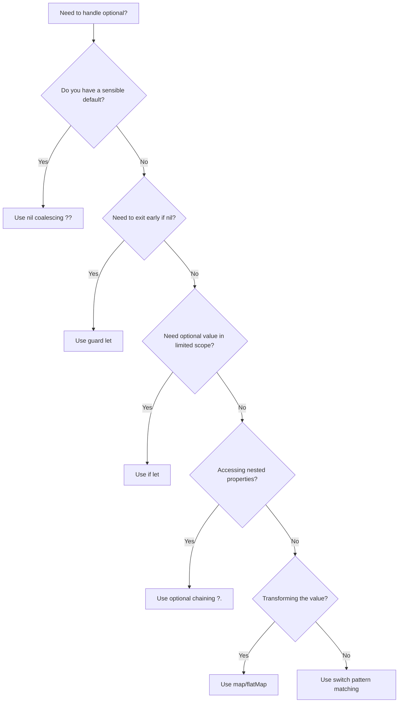

# How to Handle Optionals Safely in Swift

Author: [nawazdhandala](https://www.github.com/nawazdhandala)

Tags: Swift, Optionals, iOS, Safety, Best Practices

Description: Learn how to work with Swift optionals safely using optional binding, guard statements, nil coalescing, and other patterns to write crash-free code.

---

Optionals are one of Swift's most powerful features for handling the absence of values. They force you to think about nil cases at compile time rather than discovering crashes at runtime. However, working with optionals incorrectly can still lead to unexpected crashes or convoluted code.

In this guide, we'll cover all the safe patterns for handling optionals in Swift, from basic techniques to advanced patterns.

## What Are Optionals?

An optional in Swift represents a value that might or might not exist. Under the hood, it's an enum with two cases:

```swift
// This is roughly how Optional is defined internally
enum Optional<Wrapped> {
    case none      // nil
    case some(Wrapped)  // has a value
}
```

When you declare an optional, you're saying "this variable might contain a value of this type, or it might be nil."

Here's how you declare optional variables:

```swift
// Declaring optionals
var name: String? = "John"  // Optional with a value
var age: Int? = nil          // Optional without a value

// Non-optional - must always have a value
var requiredName: String = "Jane"
```

## The Danger: Force Unwrapping

Before we dive into safe patterns, let's understand what to avoid. Force unwrapping with `!` is the most common source of optional-related crashes.

The following code will crash your app if the value is nil:

```swift
// DANGEROUS - This will crash if username is nil
let username: String? = nil
let displayName = username!  // Fatal error: Unexpectedly found nil

// DANGEROUS - Force unwrapping dictionary values
let settings: [String: Int] = ["volume": 80]
let brightness = settings["brightness"]!  // Crash - key doesn't exist
```

There are very few legitimate uses for force unwrapping. Stick to the safe patterns below instead.

## Safe Pattern 1: Optional Binding with if let

Optional binding is the most common safe way to unwrap optionals. It creates a new constant or variable that holds the unwrapped value only within the scope of the if block.

Use `if let` when you want to execute code only when the optional has a value:

```swift
// Basic if let - safely unwrap and use the value
let email: String? = "user@example.com"

if let unwrappedEmail = email {
    // unwrappedEmail is a non-optional String here
    print("Email is: \(unwrappedEmail)")
    sendNotification(to: unwrappedEmail)
} else {
    print("No email provided")
}

// You can also use the same name (shadowing)
if let email = email {
    print("Email: \(email)")  // email is non-optional inside this block
}
```

You can unwrap multiple optionals in a single if let statement. The code block only executes if all optionals have values:

```swift
// Unwrapping multiple optionals at once
let firstName: String? = "John"
let lastName: String? = "Doe"
let age: Int? = 30

if let first = firstName,
   let last = lastName,
   let userAge = age {
    // All three values are available and non-optional
    print("\(first) \(last), age \(userAge)")
}

// Combining with boolean conditions
if let first = firstName,
   let last = lastName,
   first.count > 0,
   last.count > 0 {
    print("Valid name: \(first) \(last)")
}
```

## Safe Pattern 2: Guard Statements for Early Exit

Guard statements are great when you want to exit early if an optional is nil. This keeps your code's happy path un-nested and easy to read.

Use `guard let` when the rest of your function depends on the value being present:

```swift
// Guard let for early exit
func processUser(name: String?, email: String?) {
    // Exit early if requirements aren't met
    guard let userName = name else {
        print("Error: Name is required")
        return
    }

    guard let userEmail = email else {
        print("Error: Email is required")
        return
    }

    // userName and userEmail are non-optional for the rest of the function
    print("Processing user: \(userName) <\(userEmail)>")
    createAccount(name: userName, email: userEmail)
}
```

You can combine multiple guards or unwrap multiple values in one guard:

```swift
// Combining multiple optionals in one guard
func validateOrder(productId: String?, quantity: Int?, customerId: String?) {
    guard let product = productId,
          let qty = quantity,
          let customer = customerId,
          qty > 0 else {
        print("Invalid order parameters")
        return
    }

    // All values are available and validated
    submitOrder(product: product, quantity: qty, customer: customer)
}
```

## Safe Pattern 3: Nil Coalescing Operator

The nil coalescing operator `??` provides a default value when an optional is nil. This is perfect when you have a sensible fallback.

Use `??` to provide default values:

```swift
// Basic nil coalescing - provide a default value
let username: String? = nil
let displayName = username ?? "Guest"  // "Guest"

let savedVolume: Int? = 80
let volume = savedVolume ?? 50  // 80 (uses the actual value)

// Chaining nil coalescing for multiple fallbacks
let primaryColor: String? = nil
let secondaryColor: String? = nil
let defaultColor: String = "blue"

let activeColor = primaryColor ?? secondaryColor ?? defaultColor  // "blue"
```

This pattern works great with dictionaries and other collections:

```swift
// Common use case: Dictionary lookups with defaults
let userSettings: [String: Any] = ["theme": "dark"]

let theme = userSettings["theme"] as? String ?? "light"  // "dark"
let fontSize = userSettings["fontSize"] as? Int ?? 14     // 14 (default)

// User preferences with defaults
struct AppConfig {
    static func getValue(for key: String) -> String {
        let config: [String: String?] = [
            "apiUrl": "https://api.example.com",
            "timeout": nil
        ]
        return config[key] ?? "default" ?? "fallback"
    }
}
```

## Safe Pattern 4: Optional Chaining

Optional chaining lets you call properties, methods, and subscripts on optionals. If any link in the chain is nil, the entire expression returns nil.

Use optional chaining to safely access nested properties:

```swift
// Optional chaining with classes
class Address {
    var street: String?
    var city: String?
    var zipCode: String?
}

class Person {
    var name: String
    var address: Address?

    init(name: String) {
        self.name = name
    }
}

let person: Person? = Person(name: "Alice")
person?.address = Address()
person?.address?.city = "New York"

// Safe access - returns nil if any part is nil
let city = person?.address?.city  // Optional("New York")
let zip = person?.address?.zipCode  // nil (zipCode was never set)

// Combine with nil coalescing for default values
let displayCity = person?.address?.city ?? "Unknown"  // "New York"
```

Optional chaining also works with methods and subscripts:

```swift
// Optional chaining with methods
class DataManager {
    var items: [String]?

    func fetchFirstItem() -> String? {
        return items?.first
    }
}

let manager: DataManager? = DataManager()
manager?.items = ["Apple", "Banana", "Cherry"]

// Chain method calls
let firstItem = manager?.fetchFirstItem()  // Optional("Apple")
let uppercased = manager?.fetchFirstItem()?.uppercased()  // Optional("APPLE")

// Optional chaining with subscripts
let secondItem = manager?.items?[1]  // Optional("Banana")

// Safe array access pattern
extension Array {
    subscript(safe index: Int) -> Element? {
        return indices.contains(index) ? self[index] : nil
    }
}

let items = ["a", "b", "c"]
let safeItem = items[safe: 5]  // nil instead of crash
```

## Safe Pattern 5: Map and FlatMap for Optionals

Swift provides functional methods on optionals for transforming values. These are elegant alternatives to if-let in many cases.

Use `map` to transform an optional value if it exists:

```swift
// map - transform the value if it exists
let numberString: String? = "42"

// Without map
var parsedNumber: Int? = nil
if let str = numberString {
    parsedNumber = Int(str)
}

// With map - more concise
let mappedNumber = numberString.map { Int($0) }  // Optional(Optional(42))

// Use flatMap when the transformation also returns an optional
let flatMappedNumber = numberString.flatMap { Int($0) }  // Optional(42)
```

Here's a practical example showing the difference between `map` and `flatMap`:

```swift
// Practical example: Processing user input
struct User {
    var email: String?

    // Returns nil if email is invalid
    func validatedEmail() -> String? {
        guard let email = email,
              email.contains("@"),
              email.count > 3 else {
            return nil
        }
        return email.lowercased()
    }
}

let user: User? = User(email: "TEST@EXAMPLE.COM")

// map returns Optional<Optional<String>>
let mappedEmail = user.map { $0.validatedEmail() }  // Optional(Optional("test@example.com"))

// flatMap flattens to Optional<String>
let flatMappedEmail = user.flatMap { $0.validatedEmail() }  // Optional("test@example.com")

// compactMap for collections - removes nil values
let inputs: [String?] = ["1", nil, "2", "three", "4"]
let numbers = inputs.compactMap { $0.flatMap { Int($0) } }  // [1, 2, 4]
```

## Safe Pattern 6: Switch Statement Pattern Matching

You can use switch statements to handle optional values with pattern matching. This gives you clear, explicit handling of both cases.

```swift
// Switch on optional values
let responseCode: Int? = 404

switch responseCode {
case .none:
    print("No response received")
case .some(200):
    print("Success")
case .some(400..<500):
    print("Client error")
case .some(500..<600):
    print("Server error")
case .some(let code):
    print("Received code: \(code)")
}

// Pattern matching with where clauses
let temperature: Double? = 72.5

switch temperature {
case .none:
    print("Temperature unavailable")
case .some(let temp) where temp < 32:
    print("Freezing: \(temp)F")
case .some(let temp) where temp > 90:
    print("Hot: \(temp)F")
case .some(let temp):
    print("Comfortable: \(temp)F")
}
```

## Safe Pattern 7: Implicitly Unwrapped Optionals (Use Sparingly)

Implicitly unwrapped optionals (IUO) are declared with `!` instead of `?`. They're optionals that Swift automatically unwraps when you use them.

Only use IUOs when you're certain the value will be set before first use:

```swift
// IUO - use only when value is guaranteed after initialization
class ViewController {
    // IBOutlets are typically IUO because they're set by Interface Builder
    // before viewDidLoad runs
    var titleLabel: UILabel!
    var submitButton: UIButton!

    func viewDidLoad() {
        // Safe to use - Interface Builder has connected these
        titleLabel.text = "Welcome"
        submitButton.isEnabled = true
    }
}

// IUO for two-phase initialization
class NetworkClient {
    var baseURL: URL!  // Set immediately after init

    init() {
        // First phase: basic setup
    }

    func configure(with urlString: String) {
        // Second phase: IUO is set
        baseURL = URL(string: urlString)
    }
}
```

A warning about IUOs: they still crash if accessed when nil, so prefer regular optionals when possible.

## Real-World Example: Parsing JSON Safely

Let's put it all together with a realistic JSON parsing example:

```swift
import Foundation

// JSON response from an API
let jsonData = """
{
    "user": {
        "id": 12345,
        "name": "John Doe",
        "email": "john@example.com",
        "address": {
            "city": "San Francisco",
            "country": "USA"
        }
    },
    "metadata": {
        "requestId": "abc-123"
    }
}
""".data(using: .utf8)!

// Safe parsing function using multiple patterns
func parseUserInfo(from data: Data) -> (name: String, email: String, city: String)? {
    // Guard for JSON parsing
    guard let json = try? JSONSerialization.jsonObject(with: data) as? [String: Any] else {
        print("Failed to parse JSON")
        return nil
    }

    // Optional chaining to navigate nested structure
    guard let user = json["user"] as? [String: Any],
          let name = user["name"] as? String,
          let email = user["email"] as? String else {
        print("Missing required user fields")
        return nil
    }

    // Nil coalescing for optional fields
    let address = user["address"] as? [String: Any]
    let city = address?["city"] as? String ?? "Unknown"

    return (name: name, email: email, city: city)
}

// Using the parser
if let userInfo = parseUserInfo(from: jsonData) {
    print("Name: \(userInfo.name)")
    print("Email: \(userInfo.email)")
    print("City: \(userInfo.city)")
}
```

## Decision Flow: Choosing the Right Pattern

The following diagram shows how to choose the right optional handling pattern:



## Summary of Safe Patterns

| Pattern | Use When | Example |
|---------|----------|---------|
| `if let` | Need optional value in a limited scope | `if let x = optional { use(x) }` |
| `guard let` | Want to exit early if nil | `guard let x = optional else { return }` |
| `??` (nil coalescing) | Have a default value | `let x = optional ?? defaultValue` |
| `?.` (optional chaining) | Accessing nested optionals | `person?.address?.city` |
| `map` / `flatMap` | Transforming optional values | `optional.flatMap { transform($0) }` |
| `switch` | Need explicit handling of both cases | `switch optional { case .some(let x): ... }` |

## Best Practices Summary

1. **Avoid force unwrapping** - The `!` operator should be rare in your codebase
2. **Use guard for preconditions** - Exit early to keep code readable
3. **Prefer nil coalescing for defaults** - It's concise and clear
4. **Chain optionals for nested access** - Avoid nested if-let when possible
5. **Use compactMap to filter nil values** - Great for transforming collections
6. **Test edge cases** - Always consider what happens when values are nil

By following these patterns, you'll write Swift code that's both safe and elegant. Your app won't crash due to unexpected nil values, and your code will be easier to read and maintain.

---

*Looking for a reliable way to monitor your iOS app in production? [OneUptime](https://oneuptime.com) provides comprehensive application monitoring, error tracking, and alerting to help you catch issues before your users do. Start monitoring your app today.*
