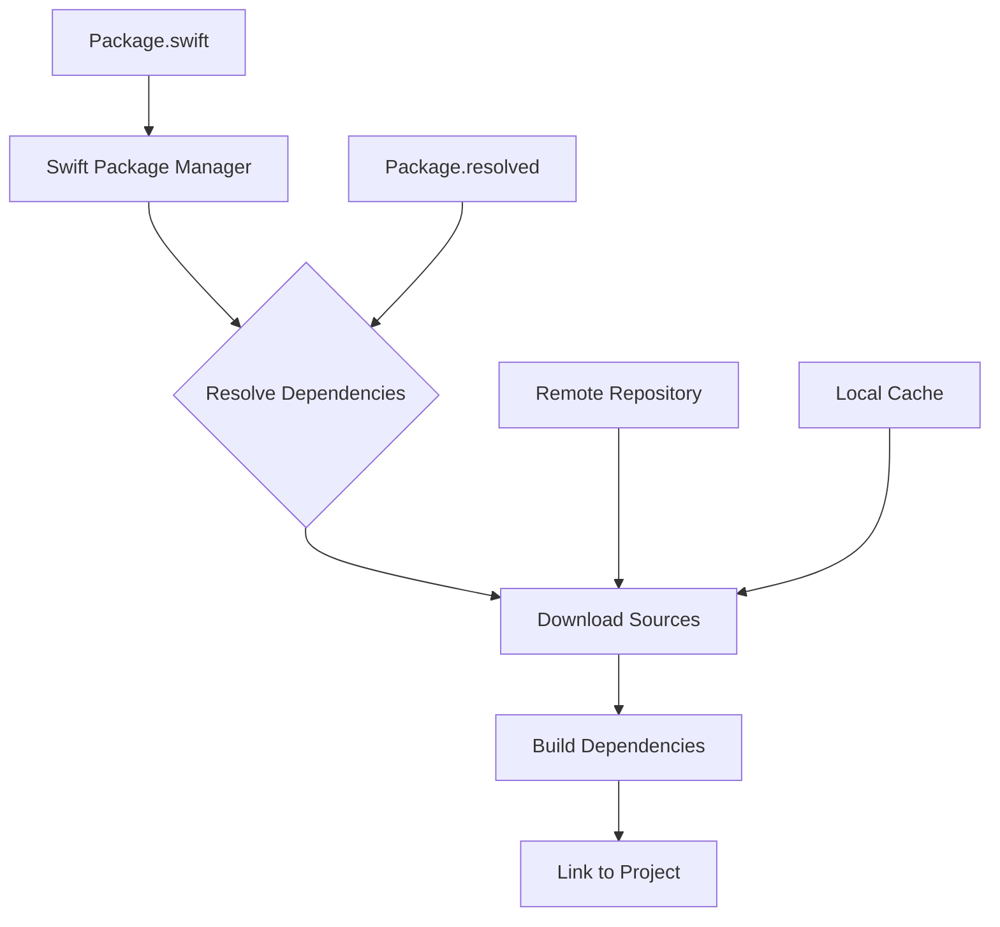

# How to Use Swift Package Manager

Author: [nawazdhandala](https://www.github.com/nawazdhandala)

Tags: Swift, SPM, Package Manager, iOS

Description: A comprehensive guide to using Swift Package Manager (SPM) for dependency management in Swift projects. Learn how to create packages, manage dependencies, and implement best practices for iOS and macOS development.

---

> Swift Package Manager (SPM) is Apple's official tool for managing Swift code distribution. It integrates seamlessly with Xcode and provides a powerful way to share and consume code across projects. This guide covers everything from basic usage to advanced patterns for production applications.

Swift Package Manager has become the de facto standard for dependency management in Swift projects. Unlike CocoaPods or Carthage, SPM is built directly into Swift and Xcode, making it the most streamlined option for modern Apple development.

---

## What is Swift Package Manager?

Swift Package Manager is a tool for managing the distribution of Swift code. It handles downloading, compiling, and linking dependencies automatically. Here are its key advantages:

| Feature | SPM | CocoaPods | Carthage |
|---------|-----|-----------|----------|
| **Built into Xcode** | Yes | No | No |
| **Decentralized** | Yes | No | Yes |
| **Binary support** | Yes | Yes | Yes |
| **Cross-platform** | Yes | No | No |
| **No extra files** | Yes | No | No |
| **Apple maintained** | Yes | No | No |

---

## How SPM Works

Understanding the SPM workflow helps you use it effectively.



The Package.swift file defines your package structure and dependencies. SPM reads this manifest, resolves version constraints, downloads source code, and builds everything into modules your project can import.

---

## Adding Dependencies to an Xcode Project

The simplest way to use SPM is adding packages directly in Xcode.

### Step 1: Open Package Dependencies

In Xcode, navigate to your project settings, select your project (not a target), and click the "Package Dependencies" tab.

### Step 2: Add a Package

Click the "+" button and enter the repository URL. For example, to add Alamofire:

```
https://github.com/Alamofire/Alamofire.git
```

### Step 3: Configure Version Rules

SPM supports several versioning strategies:


For most production apps, "Up to Next Major" provides the best balance between stability and receiving updates.

### Step 4: Select Target

Choose which targets should link the dependency. Click "Add Package" to complete the process.

---

## Creating a Swift Package

Creating your own package lets you share code across projects or with the community.

### Initialize a New Package

The following command creates a new package with the standard directory structure. SPM generates a Package.swift manifest and source directories automatically.

```bash
# Create a new directory for your package
mkdir MySwiftPackage
cd MySwiftPackage

# Initialize the package with library template
swift package init --type library

# For an executable package instead
swift package init --type executable
```

This creates the following structure:

```
MySwiftPackage/
|-- Package.swift
|-- Sources/
|   |-- MySwiftPackage/
|       |-- MySwiftPackage.swift
|-- Tests/
    |-- MySwiftPackageTests/
        |-- MySwiftPackageTests.swift
```

### Understanding Package.swift

The Package.swift manifest defines everything about your package. Here is a comprehensive example showing common configurations.

```swift
// swift-tools-version: 5.9
// The swift-tools-version declares the minimum version of Swift required to build this package.

import PackageDescription

let package = Package(
    // The name of your package - used for the module name by default
    name: "NetworkKit",

    // Supported platforms and minimum versions
    // This restricts where your package can be used
    platforms: [
        .iOS(.v15),
        .macOS(.v12),
        .tvOS(.v15),
        .watchOS(.v8)
    ],

    // Products define the executables and libraries a package produces
    // These are what consumers of your package can import
    products: [
        // A library product exposes modules to clients
        .library(
            name: "NetworkKit",
            targets: ["NetworkKit"]
        ),
        // You can create multiple products from different targets
        .library(
            name: "NetworkKitMocks",
            targets: ["NetworkKitMocks"]
        )
    ],

    // Dependencies declare other packages that this package depends on
    dependencies: [
        // Version-based dependency - most common for production
        .package(
            url: "https://github.com/Alamofire/Alamofire.git",
            from: "5.8.0"
        ),
        // Exact version - use when you need precise control
        .package(
            url: "https://github.com/apple/swift-log.git",
            exact: "1.5.3"
        ),
        // Version range - specify minimum and maximum
        .package(
            url: "https://github.com/apple/swift-collections.git",
            "1.0.0"..<"2.0.0"
        ),
        // Branch-based - useful during development
        .package(
            url: "https://github.com/pointfreeco/swift-snapshot-testing.git",
            branch: "main"
        )
    ],

    // Targets are the basic building blocks of a package
    targets: [
        // Main target containing your library code
        .target(
            name: "NetworkKit",
            dependencies: [
                // Reference external package products
                .product(name: "Alamofire", package: "Alamofire"),
                .product(name: "Logging", package: "swift-log")
            ],
            // Specify the source files location (optional if following convention)
            path: "Sources/NetworkKit",
            // Exclude specific files from compilation
            exclude: ["Resources/README.md"],
            // Include resources in the bundle
            resources: [
                .process("Resources/")
            ],
            // Swift settings for this target
            swiftSettings: [
                .define("DEBUG", .when(configuration: .debug)),
                .enableUpcomingFeature("StrictConcurrency")
            ]
        ),
        // Mock target for testing support
        .target(
            name: "NetworkKitMocks",
            dependencies: ["NetworkKit"]
        ),
        // Test target
        .testTarget(
            name: "NetworkKitTests",
            dependencies: [
                "NetworkKit",
                "NetworkKitMocks",
                .product(name: "SnapshotTesting", package: "swift-snapshot-testing")
            ],
            resources: [
                .copy("Fixtures/")
            ]
        )
    ],

    // Swift language version
    swiftLanguageVersions: [.v5]
)
```

---

## Working with Package Dependencies

### Updating Dependencies

Keep your dependencies current with these commands. The update command fetches the latest versions that satisfy your version requirements.

```bash
# Update all packages to their latest allowed versions
swift package update

# Update a specific package only
swift package update Alamofire

# Resolve dependencies without updating (uses Package.resolved)
swift package resolve
```

### Viewing Dependency Graph

Understanding your dependency tree helps identify bloat and conflicts. The show-dependencies command displays all transitive dependencies.

```bash
# Show dependency tree in text format
swift package show-dependencies

# Output in JSON format for tooling integration
swift package show-dependencies --format json

# Output in DOT format for visualization
swift package show-dependencies --format dot > deps.dot
dot -Tpng deps.dot -o deps.png
```

### Cleaning Build Artifacts

Sometimes you need to clean cached data to resolve issues. SPM stores build artifacts in the .build directory.

```bash
# Clean build artifacts
swift package clean

# Reset the complete package state (removes .build and Package.resolved)
swift package reset

# Purge the shared package cache
swift package purge-cache
```

---

## Package Resources

SPM supports bundling resources like images, JSON files, and localized strings with your package.

### Declaring Resources

Resources must be explicitly declared in your target. SPM supports two processing modes with different behaviors.

```swift
// In Package.swift
.target(
    name: "MyFeature",
    dependencies: [],
    resources: [
        // Process resources - SPM optimizes for the platform
        // Images are compiled into asset catalogs
        // Strings are compiled into .strings files
        .process("Resources/"),

        // Copy resources as-is without processing
        // Use for JSON, XML, or other data files
        .copy("Fixtures/MockData.json"),

        // You can mix both approaches
        .process("Images/"),
        .copy("Configuration/")
    ]
)
```

### Accessing Resources in Code

Access bundled resources using the auto-generated Bundle extension. SPM creates a module property that points to the correct bundle.

```swift
import Foundation

public struct ResourceLoader {
    // Access the bundle containing package resources
    // SPM generates Bundle.module automatically
    private static let bundle = Bundle.module

    // Load a JSON file from the package bundle
    public static func loadJSON<T: Decodable>(named filename: String) throws -> T {
        // Locate the resource in the package bundle
        guard let url = bundle.url(forResource: filename, withExtension: "json") else {
            throw ResourceError.fileNotFound(filename)
        }

        // Read and decode the JSON data
        let data = try Data(contentsOf: url)
        let decoder = JSONDecoder()
        decoder.keyDecodingStrategy = .convertFromSnakeCase

        return try decoder.decode(T.self, from: data)
    }

    // Load a localized string from the package
    public static func localizedString(key: String) -> String {
        return NSLocalizedString(key, bundle: bundle, comment: "")
    }

    // Load an image from the package bundle
    #if canImport(UIKit)
    public static func loadImage(named name: String) -> UIImage? {
        return UIImage(named: name, in: bundle, compatibleWith: nil)
    }
    #endif
}

// Custom error type for resource loading failures
public enum ResourceError: Error {
    case fileNotFound(String)
    case invalidData
}
```

---

## Binary Dependencies

SPM supports XCFramework binaries for distributing precompiled code. This is useful for closed-source SDKs or improving build times.

### Creating an XCFramework

Build your library for all supported platforms and architectures, then combine them into a single XCFramework.

```bash
# Build for iOS device
xcodebuild archive \
    -scheme MyLibrary \
    -destination "generic/platform=iOS" \
    -archivePath ./build/iOS \
    SKIP_INSTALL=NO \
    BUILD_LIBRARY_FOR_DISTRIBUTION=YES

# Build for iOS Simulator
xcodebuild archive \
    -scheme MyLibrary \
    -destination "generic/platform=iOS Simulator" \
    -archivePath ./build/iOS-Simulator \
    SKIP_INSTALL=NO \
    BUILD_LIBRARY_FOR_DISTRIBUTION=YES

# Build for macOS
xcodebuild archive \
    -scheme MyLibrary \
    -destination "generic/platform=macOS" \
    -archivePath ./build/macOS \
    SKIP_INSTALL=NO \
    BUILD_LIBRARY_FOR_DISTRIBUTION=YES

# Create XCFramework combining all architectures
xcodebuild -create-xcframework \
    -framework ./build/iOS.xcarchive/Products/Library/Frameworks/MyLibrary.framework \
    -framework ./build/iOS-Simulator.xcarchive/Products/Library/Frameworks/MyLibrary.framework \
    -framework ./build/macOS.xcarchive/Products/Library/Frameworks/MyLibrary.framework \
    -output ./MyLibrary.xcframework
```

### Declaring Binary Dependencies

Reference XCFrameworks in your Package.swift using either a URL with checksum or a local path.

```swift
// swift-tools-version: 5.9
import PackageDescription

let package = Package(
    name: "MyApp",
    platforms: [.iOS(.v15)],
    products: [
        .library(name: "MyApp", targets: ["MyApp"])
    ],
    dependencies: [],
    targets: [
        .target(
            name: "MyApp",
            dependencies: ["MyLibraryBinary"]
        ),
        // Remote binary dependency with checksum verification
        .binaryTarget(
            name: "MyLibraryBinary",
            url: "https://example.com/MyLibrary-1.0.0.xcframework.zip",
            checksum: "abc123def456..." // Generate with: swift package compute-checksum
        ),
        // Local binary dependency for development
        .binaryTarget(
            name: "LocalBinary",
            path: "Frameworks/LocalLibrary.xcframework"
        )
    ]
)
```

Generate the checksum for a zip file using the SPM command.

```bash
# Compute checksum for remote binary distribution
swift package compute-checksum MyLibrary-1.0.0.xcframework.zip
```

---

## Conditional Dependencies

SPM allows platform-specific dependencies and conditional compilation for cross-platform packages.

### Platform-Specific Dependencies

Configure different dependencies based on the target platform. This is essential for packages that support both Apple platforms and Linux.

```swift
// swift-tools-version: 5.9
import PackageDescription

let package = Package(
    name: "CrossPlatformKit",
    platforms: [
        .iOS(.v15),
        .macOS(.v12)
    ],
    products: [
        .library(name: "CrossPlatformKit", targets: ["CrossPlatformKit"])
    ],
    dependencies: [
        // Shared dependencies
        .package(url: "https://github.com/apple/swift-log.git", from: "1.5.0"),
        // Apple-only dependency
        .package(url: "https://github.com/apple/swift-crypto.git", from: "3.0.0")
    ],
    targets: [
        .target(
            name: "CrossPlatformKit",
            dependencies: [
                .product(name: "Logging", package: "swift-log"),
                // Conditional dependency - only link on Apple platforms
                .product(
                    name: "Crypto",
                    package: "swift-crypto",
                    condition: .when(platforms: [.iOS, .macOS, .tvOS, .watchOS])
                )
            ]
        )
    ]
)
```

### Conditional Compilation in Code

Use compiler directives to handle platform differences in your implementation.

```swift
import Foundation

#if canImport(UIKit)
import UIKit
public typealias PlatformColor = UIColor
public typealias PlatformImage = UIImage
#elseif canImport(AppKit)
import AppKit
public typealias PlatformColor = NSColor
public typealias PlatformImage = NSImage
#endif

public struct PlatformUtilities {
    // Platform-specific implementation using conditional compilation
    public static func createColor(red: CGFloat, green: CGFloat, blue: CGFloat) -> PlatformColor {
        #if canImport(UIKit)
        return UIColor(red: red, green: green, blue: blue, alpha: 1.0)
        #elseif canImport(AppKit)
        return NSColor(red: red, green: green, blue: blue, alpha: 1.0)
        #endif
    }

    // Check available features at runtime
    public static var supportsHaptics: Bool {
        #if os(iOS)
        if #available(iOS 13.0, *) {
            return true
        }
        #endif
        return false
    }

    // Linux-specific functionality
    #if os(Linux)
    public static func linuxSpecificFunction() {
        // Linux-only implementation
    }
    #endif
}
```

---

## Plugin System

SPM supports plugins that can generate source code or run custom build commands.

### Build Tool Plugins

Build tool plugins run during compilation to generate source code or process resources.

```swift
// swift-tools-version: 5.9
import PackageDescription

let package = Package(
    name: "MyApp",
    dependencies: [
        // SwiftGen generates type-safe resource accessors
        .package(url: "https://github.com/SwiftGen/SwiftGenPlugin", from: "6.6.0")
    ],
    targets: [
        .target(
            name: "MyApp",
            dependencies: [],
            plugins: [
                // Apply the SwiftGen plugin to this target
                .plugin(name: "SwiftGenPlugin", package: "SwiftGenPlugin")
            ]
        )
    ]
)
```

### Command Plugins

Command plugins provide custom Swift package commands you can run manually.

```swift
// swift-tools-version: 5.9
import PackageDescription

let package = Package(
    name: "MyPackage",
    targets: [
        .target(name: "MyLibrary"),
        // Define a command plugin
        .plugin(
            name: "FormatCode",
            capability: .command(
                intent: .custom(
                    verb: "format-code",
                    description: "Formats Swift source code"
                ),
                permissions: [
                    .writeToPackageDirectory(reason: "Formats source files in place")
                ]
            )
        )
    ]
)
```

Run command plugins using the swift package command.

```bash
# Run a command plugin
swift package format-code

# Run with specific options
swift package plugin --allow-writing-to-package-directory format-code
```

---

## Local Package Development

During development, you can work with local packages before publishing them.

### Adding a Local Package

Reference a package by its file path instead of a URL for local development. This allows you to make changes and see them immediately.

```swift
// swift-tools-version: 5.9
import PackageDescription

let package = Package(
    name: "MyApp",
    dependencies: [
        // Local package reference using path
        .package(path: "../MyLocalPackage"),
        // You can also use name for clarity
        .package(name: "SharedKit", path: "../../SharedKit")
    ],
    targets: [
        .target(
            name: "MyApp",
            dependencies: [
                .product(name: "MyLocalPackage", package: "MyLocalPackage"),
                .product(name: "SharedKit", package: "SharedKit")
            ]
        )
    ]
)
```

### Workspace Organization

Organize related packages in a directory structure that makes local development efficient.

```
MyProject/
|-- MyApp/
|   |-- Package.swift
|   |-- Sources/
|-- Packages/
|   |-- NetworkKit/
|   |   |-- Package.swift
|   |   |-- Sources/
|   |-- UIComponents/
|       |-- Package.swift
|       |-- Sources/
```

In Xcode, you can drag local packages into your project navigator. Xcode will automatically detect changes and rebuild as needed.

---

## Testing Packages

SPM includes built-in support for XCTest-based testing.

### Writing Tests

Create test targets that depend on your main target. Test files live in the Tests directory by convention.

```swift
import XCTest
@testable import NetworkKit

final class NetworkClientTests: XCTestCase {
    // Test property initialized before each test
    var sut: NetworkClient!
    var mockSession: MockURLSession!

    override func setUp() {
        super.setUp()
        mockSession = MockURLSession()
        sut = NetworkClient(session: mockSession)
    }

    override func tearDown() {
        sut = nil
        mockSession = nil
        super.tearDown()
    }

    // Test successful API response handling
    func testFetchDataSuccess() async throws {
        // Arrange - configure mock response
        let expectedData = """
        {"id": 1, "name": "Test"}
        """.data(using: .utf8)!
        mockSession.mockData = expectedData
        mockSession.mockResponse = HTTPURLResponse(
            url: URL(string: "https://api.example.com")!,
            statusCode: 200,
            httpVersion: nil,
            headerFields: nil
        )

        // Act - perform the request
        let result: TestModel = try await sut.fetch(from: "https://api.example.com/test")

        // Assert - verify the result
        XCTAssertEqual(result.id, 1)
        XCTAssertEqual(result.name, "Test")
    }

    // Test error handling for network failures
    func testFetchDataNetworkError() async {
        // Arrange - configure mock to return error
        mockSession.mockError = URLError(.notConnectedToInternet)

        // Act and Assert - verify error is thrown
        do {
            let _: TestModel = try await sut.fetch(from: "https://api.example.com/test")
            XCTFail("Expected error to be thrown")
        } catch {
            XCTAssertTrue(error is URLError)
        }
    }
}

// Test model for decoding responses
struct TestModel: Decodable, Equatable {
    let id: Int
    let name: String
}
```

### Running Tests

Execute tests from the command line or Xcode.

```bash
# Run all tests
swift test

# Run tests with verbose output
swift test --verbose

# Run specific test target
swift test --filter NetworkKitTests

# Run specific test case
swift test --filter NetworkKitTests.NetworkClientTests

# Run specific test method
swift test --filter NetworkKitTests.NetworkClientTests/testFetchDataSuccess

# Run tests in parallel
swift test --parallel

# Generate code coverage
swift test --enable-code-coverage
```

---

## Publishing a Package

Share your package by hosting it on GitHub or another Git provider.

### Versioning with Git Tags

SPM uses Git tags for versioning. Follow semantic versioning for predictable updates.

```bash
# Commit all changes
git add .
git commit -m "Prepare version 1.0.0 release"

# Create an annotated tag
git tag -a 1.0.0 -m "Version 1.0.0 - Initial release"

# Push the tag to remote
git push origin 1.0.0

# Push all tags at once
git push origin --tags
```

### Semantic Versioning Guidelines

Follow these conventions for version numbers:


- **MAJOR**: Breaking changes that require client code updates
- **MINOR**: New features that are backward compatible
- **PATCH**: Bug fixes that are backward compatible

---

## Best Practices

### 1. Pin Dependencies in Applications

For applications (not libraries), pin exact versions to ensure reproducible builds.

```swift
// For applications - use exact versions
.package(url: "https://github.com/Alamofire/Alamofire.git", exact: "5.8.1")

// For libraries - use version ranges to allow flexibility
.package(url: "https://github.com/Alamofire/Alamofire.git", from: "5.8.0")
```

### 2. Commit Package.resolved

Always commit the Package.resolved file for applications. This locks exact versions for your team.

```bash
# Add Package.resolved to version control
git add Package.resolved
git commit -m "Lock dependency versions"
```

### 3. Minimize Public API Surface

Export only what consumers need. Keep implementation details internal.

```swift
// Public API - visible to package consumers
public struct NetworkClient {
    public init(configuration: Configuration = .default) {
        self.configuration = configuration
        self.session = URLSession(configuration: configuration.urlSessionConfiguration)
    }

    public func fetch<T: Decodable>(from url: String) async throws -> T {
        // Implementation
    }
}

// Internal - visible within the package only
internal struct RequestBuilder {
    func build(url: String, method: HTTPMethod) -> URLRequest {
        // Implementation
    }
}

// Private - visible only in this file
private func validateResponse(_ response: URLResponse) throws {
    // Implementation
}
```

### 4. Use Access Control Intentionally

Apply the principle of least privilege to your package API.

```swift
// Configuration exposed as public struct
public struct Configuration {
    public let timeout: TimeInterval
    public let retryCount: Int

    public static let `default` = Configuration(timeout: 30, retryCount: 3)

    public init(timeout: TimeInterval, retryCount: Int) {
        self.timeout = timeout
        self.retryCount = retryCount
    }
}
```

### 5. Support Multiple Swift Versions

Set the minimum Swift tools version that supports all features you use.

```swift
// swift-tools-version: 5.7
// Supports Swift 5.7 and later while using async/await features
```

### 6. Document Your Package

Add a comprehensive README and use DocC for API documentation.

```swift
/// A client for making network requests with automatic retry and error handling.
///
/// Use `NetworkClient` to fetch data from remote APIs. The client handles
/// JSON decoding, error mapping, and request retries automatically.
///
/// ## Example
///
/// ```swift
/// let client = NetworkClient()
/// let user: User = try await client.fetch(from: "https://api.example.com/user/1")
/// ```
///
/// ## Topics
///
/// ### Creating a Client
/// - ``init(configuration:)``
///
/// ### Making Requests
/// - ``fetch(from:)``
public struct NetworkClient {
    // Implementation
}
```

---

## Common Issues and Solutions

### Dependency Resolution Failures

When SPM cannot resolve dependencies, try these steps.

```bash
# Reset package state completely
swift package reset

# Clean Xcode derived data
rm -rf ~/Library/Developer/Xcode/DerivedData

# Delete Package.resolved and re-resolve
rm Package.resolved
swift package resolve
```

### Version Conflicts

If two dependencies require incompatible versions of a shared dependency, you may need to update one of them.

```bash
# Show why a specific version was chosen
swift package show-dependencies --format json | jq '.dependencies'

# Update to latest compatible versions
swift package update
```

### Build Failures After Xcode Update

After updating Xcode, you may need to reset cached data.

```bash
# Clean SPM caches
swift package purge-cache

# Reset package checkouts
swift package reset

# Clean Xcode caches
xcodebuild clean
```

---

## Conclusion

Swift Package Manager has matured into a powerful dependency management solution. Key takeaways:

- **Native integration** with Xcode makes SPM the easiest option for Apple development
- **Semantic versioning** ensures predictable dependency updates
- **Resource bundling** enables distributing assets with your code
- **Binary targets** support closed-source distribution and faster builds
- **Plugins** extend SPM with code generation and custom commands
- **Cross-platform** support makes SPM suitable for server-side Swift

Start with simple dependencies in your Xcode project, then graduate to creating your own packages as you identify reusable code. SPM's straightforward design makes it accessible for beginners while providing the power needed for complex projects.

---

*Need to monitor your Swift applications in production? [OneUptime](https://oneuptime.com) provides comprehensive monitoring for iOS and macOS applications with crash reporting and performance tracking.*

**Related Reading:**
- [Apple's Official Swift Package Manager Documentation](https://swift.org/package-manager/)
- [Creating Swift Packages with Xcode](https://developer.apple.com/documentation/xcode/creating_a_standalone_swift_package_with_xcode)
