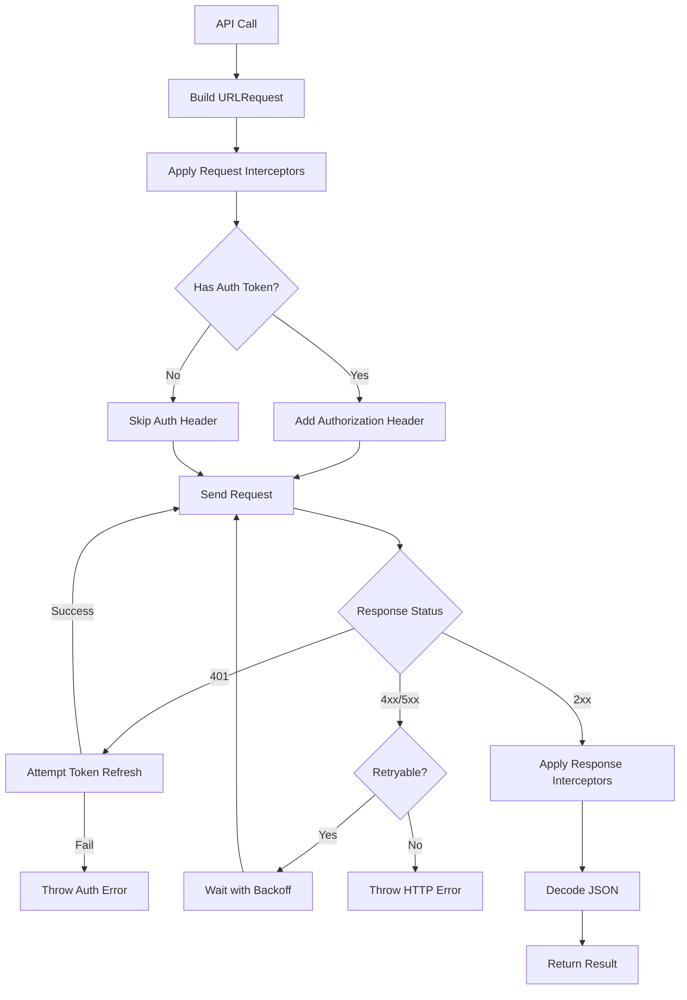

# How to Build REST API Clients in Swift

Author: [nawazdhandala](https://github.com/nawazdhandala)

Tags: Swift, iOS, REST API, Networking, URLSession

Description: Learn how to build robust REST API clients in Swift using URLSession, covering request building, response handling, error management, and modern async/await patterns.

---

Building a REST API client is one of the most common tasks in iOS development. Whether you're fetching user data, posting orders, or syncing with a backend, you need a solid networking layer. Swift's URLSession combined with Codable and async/await makes this surprisingly pleasant to implement.

This guide walks through building a production-ready API client from scratch, covering everything from basic requests to advanced patterns like retry logic and request interceptors.

## Basic URLSession Requests

### Simple GET Request

Let's start with the fundamentals. This example shows how to make a basic GET request and decode JSON into a Swift struct.

```swift
import Foundation

// Define the model that matches your API response
struct User: Codable {
    let id: Int
    let name: String
    let email: String
}

// Simple function to fetch a user by ID
func fetchUser(id: Int) async throws -> User {
    // Build the URL - always validate it exists
    guard let url = URL(string: "https://api.example.com/users/\(id)") else {
        throw URLError(.badURL)
    }

    // URLSession.shared is fine for simple cases
    let (data, response) = try await URLSession.shared.data(from: url)

    // Check for successful HTTP status code
    guard let httpResponse = response as? HTTPURLResponse,
          (200...299).contains(httpResponse.statusCode) else {
        throw URLError(.badServerResponse)
    }

    // Decode JSON into our User struct
    let decoder = JSONDecoder()
    decoder.keyDecodingStrategy = .convertFromSnakeCase
    return try decoder.decode(User.self, from: data)
}

// Usage
Task {
    do {
        let user = try await fetchUser(id: 123)
        print("Fetched user: \(user.name)")
    } catch {
        print("Failed to fetch user: \(error)")
    }
}
```

### POST Request with Body

Sending data to the server requires configuring the request method and body. Here's how to create a new resource.

```swift
struct CreateUserRequest: Codable {
    let name: String
    let email: String
}

struct CreateUserResponse: Codable {
    let id: Int
    let name: String
    let email: String
    let createdAt: Date
}

func createUser(name: String, email: String) async throws -> CreateUserResponse {
    guard let url = URL(string: "https://api.example.com/users") else {
        throw URLError(.badURL)
    }

    // Create and configure the request
    var request = URLRequest(url: url)
    request.httpMethod = "POST"
    request.setValue("application/json", forHTTPHeaderField: "Content-Type")

    // Encode the request body
    let body = CreateUserRequest(name: name, email: email)
    let encoder = JSONEncoder()
    request.httpBody = try encoder.encode(body)

    // Send the request
    let (data, response) = try await URLSession.shared.data(for: request)

    guard let httpResponse = response as? HTTPURLResponse,
          (200...299).contains(httpResponse.statusCode) else {
        throw URLError(.badServerResponse)
    }

    // Decode the response
    let decoder = JSONDecoder()
    decoder.keyDecodingStrategy = .convertFromSnakeCase
    decoder.dateDecodingStrategy = .iso8601
    return try decoder.decode(CreateUserResponse.self, from: data)
}
```

## Building a Reusable API Client

For anything beyond a simple app, you'll want a structured API client that handles common concerns like base URL configuration, authentication, and error handling.

### The API Client Structure

```swift
import Foundation

// Custom error type for API-specific errors
enum APIError: Error {
    case invalidURL
    case invalidResponse
    case httpError(statusCode: Int, data: Data?)
    case decodingError(Error)
    case networkError(Error)
}

// HTTP methods supported by the client
enum HTTPMethod: String {
    case get = "GET"
    case post = "POST"
    case put = "PUT"
    case patch = "PATCH"
    case delete = "DELETE"
}

// Main API client class
class APIClient {
    private let baseURL: String
    private let session: URLSession
    private let decoder: JSONDecoder
    private let encoder: JSONEncoder

    // Optional auth token - set after login
    var authToken: String?

    init(baseURL: String, session: URLSession = .shared) {
        self.baseURL = baseURL
        self.session = session

        // Configure decoder with common settings
        self.decoder = JSONDecoder()
        decoder.keyDecodingStrategy = .convertFromSnakeCase
        decoder.dateDecodingStrategy = .iso8601

        // Configure encoder
        self.encoder = JSONEncoder()
        encoder.keyEncodingStrategy = .convertToSnakeCase
        encoder.dateEncodingStrategy = .iso8601
    }

    // Generic request method that handles all HTTP operations
    func request<T: Decodable>(
        path: String,
        method: HTTPMethod = .get,
        body: Encodable? = nil,
        queryItems: [URLQueryItem]? = nil
    ) async throws -> T {
        // Build the URL with path and query parameters
        guard var urlComponents = URLComponents(string: baseURL + path) else {
            throw APIError.invalidURL
        }
        urlComponents.queryItems = queryItems

        guard let url = urlComponents.url else {
            throw APIError.invalidURL
        }

        // Configure the request
        var request = URLRequest(url: url)
        request.httpMethod = method.rawValue
        request.setValue("application/json", forHTTPHeaderField: "Content-Type")
        request.setValue("application/json", forHTTPHeaderField: "Accept")

        // Add auth header if we have a token
        if let token = authToken {
            request.setValue("Bearer \(token)", forHTTPHeaderField: "Authorization")
        }

        // Encode body if provided
        if let body = body {
            request.httpBody = try encoder.encode(body)
        }

        // Make the request
        let data: Data
        let response: URLResponse

        do {
            (data, response) = try await session.data(for: request)
        } catch {
            throw APIError.networkError(error)
        }

        // Validate the response
        guard let httpResponse = response as? HTTPURLResponse else {
            throw APIError.invalidResponse
        }

        // Check for HTTP errors
        guard (200...299).contains(httpResponse.statusCode) else {
            throw APIError.httpError(statusCode: httpResponse.statusCode, data: data)
        }

        // Decode the response
        do {
            return try decoder.decode(T.self, from: data)
        } catch {
            throw APIError.decodingError(error)
        }
    }

    // Convenience method for requests that don't return data
    func requestNoContent(
        path: String,
        method: HTTPMethod = .delete,
        body: Encodable? = nil
    ) async throws {
        guard let url = URL(string: baseURL + path) else {
            throw APIError.invalidURL
        }

        var request = URLRequest(url: url)
        request.httpMethod = method.rawValue

        if let token = authToken {
            request.setValue("Bearer \(token)", forHTTPHeaderField: "Authorization")
        }

        if let body = body {
            request.setValue("application/json", forHTTPHeaderField: "Content-Type")
            request.httpBody = try encoder.encode(body)
        }

        let (_, response) = try await session.data(for: request)

        guard let httpResponse = response as? HTTPURLResponse,
              (200...299).contains(httpResponse.statusCode) else {
            throw APIError.invalidResponse
        }
    }
}
```

### Using the API Client

Now we can define type-safe API endpoints. This keeps all API calls organized and easy to test.

```swift
// Define your data models
struct Post: Codable {
    let id: Int
    let title: String
    let body: String
    let userId: Int
}

struct CreatePostRequest: Codable {
    let title: String
    let body: String
    let userId: Int
}

struct PaginatedResponse<T: Codable>: Codable {
    let data: [T]
    let page: Int
    let totalPages: Int
    let totalCount: Int
}

// Extend the API client with specific endpoints
extension APIClient {

    // Fetch a single post
    func getPost(id: Int) async throws -> Post {
        try await request(path: "/posts/\(id)")
    }

    // Fetch paginated posts
    func getPosts(page: Int = 1, limit: Int = 20) async throws -> PaginatedResponse<Post> {
        try await request(
            path: "/posts",
            queryItems: [
                URLQueryItem(name: "page", value: String(page)),
                URLQueryItem(name: "limit", value: String(limit))
            ]
        )
    }

    // Create a new post
    func createPost(title: String, body: String, userId: Int) async throws -> Post {
        let requestBody = CreatePostRequest(title: title, body: body, userId: userId)
        return try await request(path: "/posts", method: .post, body: requestBody)
    }

    // Update an existing post
    func updatePost(id: Int, title: String, body: String) async throws -> Post {
        struct UpdateRequest: Codable {
            let title: String
            let body: String
        }
        return try await request(
            path: "/posts/\(id)",
            method: .put,
            body: UpdateRequest(title: title, body: body)
        )
    }

    // Delete a post
    func deletePost(id: Int) async throws {
        try await requestNoContent(path: "/posts/\(id)", method: .delete)
    }
}
```

### Example Usage in a ViewModel

```swift
import SwiftUI

@MainActor
class PostsViewModel: ObservableObject {
    @Published var posts: [Post] = []
    @Published var isLoading = false
    @Published var errorMessage: String?

    private let api = APIClient(baseURL: "https://api.example.com")

    func loadPosts() async {
        isLoading = true
        errorMessage = nil

        do {
            let response = try await api.getPosts(page: 1)
            posts = response.data
        } catch let error as APIError {
            errorMessage = handleAPIError(error)
        } catch {
            errorMessage = "An unexpected error occurred"
        }

        isLoading = false
    }

    func createPost(title: String, body: String) async {
        do {
            let newPost = try await api.createPost(
                title: title,
                body: body,
                userId: 1
            )
            posts.insert(newPost, at: 0)
        } catch let error as APIError {
            errorMessage = handleAPIError(error)
        } catch {
            errorMessage = "Failed to create post"
        }
    }

    private func handleAPIError(_ error: APIError) -> String {
        switch error {
        case .invalidURL:
            return "Invalid request URL"
        case .invalidResponse:
            return "Invalid server response"
        case .httpError(let statusCode, _):
            return "Server error: \(statusCode)"
        case .decodingError:
            return "Failed to parse response"
        case .networkError:
            return "Network connection failed"
        }
    }
}
```

## Advanced Patterns

### Request Interceptors

Interceptors let you modify requests before they're sent and responses before they're processed. This is useful for logging, adding headers, or handling token refresh.

```swift
// Protocol for request interceptors
protocol RequestInterceptor {
    func intercept(request: URLRequest) async throws -> URLRequest
}

// Protocol for response interceptors
protocol ResponseInterceptor {
    func intercept(data: Data, response: URLResponse) async throws -> (Data, URLResponse)
}

// Logging interceptor - great for debugging
class LoggingInterceptor: RequestInterceptor, ResponseInterceptor {
    func intercept(request: URLRequest) async throws -> URLRequest {
        print(">>> \(request.httpMethod ?? "GET") \(request.url?.absoluteString ?? "")")
        if let body = request.httpBody,
           let bodyString = String(data: body, encoding: .utf8) {
            print("Body: \(bodyString)")
        }
        return request
    }

    func intercept(data: Data, response: URLResponse) async throws -> (Data, URLResponse) {
        if let httpResponse = response as? HTTPURLResponse {
            print("<<< \(httpResponse.statusCode)")
        }
        if let responseString = String(data: data, encoding: .utf8) {
            print("Response: \(responseString.prefix(500))")
        }
        return (data, response)
    }
}

// Auth interceptor that adds tokens and handles refresh
class AuthInterceptor: RequestInterceptor {
    private let tokenProvider: () -> String?

    init(tokenProvider: @escaping () -> String?) {
        self.tokenProvider = tokenProvider
    }

    func intercept(request: URLRequest) async throws -> URLRequest {
        var request = request
        if let token = tokenProvider() {
            request.setValue("Bearer \(token)", forHTTPHeaderField: "Authorization")
        }
        return request
    }
}
```

### Enhanced API Client with Interceptors

```swift
class EnhancedAPIClient {
    private let baseURL: String
    private let session: URLSession
    private let decoder: JSONDecoder
    private let encoder: JSONEncoder
    private var requestInterceptors: [RequestInterceptor] = []
    private var responseInterceptors: [ResponseInterceptor] = []

    init(baseURL: String) {
        self.baseURL = baseURL
        self.session = URLSession.shared

        self.decoder = JSONDecoder()
        decoder.keyDecodingStrategy = .convertFromSnakeCase
        decoder.dateDecodingStrategy = .iso8601

        self.encoder = JSONEncoder()
        encoder.keyEncodingStrategy = .convertToSnakeCase
    }

    func addRequestInterceptor(_ interceptor: RequestInterceptor) {
        requestInterceptors.append(interceptor)
    }

    func addResponseInterceptor(_ interceptor: ResponseInterceptor) {
        responseInterceptors.append(interceptor)
    }

    func request<T: Decodable>(
        path: String,
        method: HTTPMethod = .get,
        body: Encodable? = nil,
        queryItems: [URLQueryItem]? = nil
    ) async throws -> T {
        guard var urlComponents = URLComponents(string: baseURL + path) else {
            throw APIError.invalidURL
        }
        urlComponents.queryItems = queryItems

        guard let url = urlComponents.url else {
            throw APIError.invalidURL
        }

        var request = URLRequest(url: url)
        request.httpMethod = method.rawValue
        request.setValue("application/json", forHTTPHeaderField: "Content-Type")

        if let body = body {
            request.httpBody = try encoder.encode(body)
        }

        // Apply request interceptors
        for interceptor in requestInterceptors {
            request = try await interceptor.intercept(request: request)
        }

        var (data, response) = try await session.data(for: request)

        // Apply response interceptors
        for interceptor in responseInterceptors {
            (data, response) = try await interceptor.intercept(data: data, response: response)
        }

        guard let httpResponse = response as? HTTPURLResponse,
              (200...299).contains(httpResponse.statusCode) else {
            throw APIError.invalidResponse
        }

        return try decoder.decode(T.self, from: data)
    }
}

// Usage
let client = EnhancedAPIClient(baseURL: "https://api.example.com")
client.addRequestInterceptor(LoggingInterceptor())
client.addRequestInterceptor(AuthInterceptor { UserDefaults.standard.string(forKey: "authToken") })
client.addResponseInterceptor(LoggingInterceptor())
```

### Retry Logic with Exponential Backoff

Network requests fail. A good API client handles transient failures gracefully with automatic retries.

```swift
struct RetryConfiguration {
    let maxRetries: Int
    let baseDelay: TimeInterval
    let maxDelay: TimeInterval
    let retryableStatusCodes: Set<Int>

    static let `default` = RetryConfiguration(
        maxRetries: 3,
        baseDelay: 1.0,
        maxDelay: 30.0,
        retryableStatusCodes: [408, 429, 500, 502, 503, 504]
    )
}

extension APIClient {
    func requestWithRetry<T: Decodable>(
        path: String,
        method: HTTPMethod = .get,
        body: Encodable? = nil,
        queryItems: [URLQueryItem]? = nil,
        retryConfig: RetryConfiguration = .default
    ) async throws -> T {
        var lastError: Error?

        for attempt in 0..<retryConfig.maxRetries {
            do {
                return try await request(
                    path: path,
                    method: method,
                    body: body,
                    queryItems: queryItems
                )
            } catch let error as APIError {
                lastError = error

                // Check if we should retry
                if case .httpError(let statusCode, _) = error,
                   retryConfig.retryableStatusCodes.contains(statusCode) {
                    // Calculate delay with exponential backoff and jitter
                    let delay = min(
                        retryConfig.baseDelay * pow(2.0, Double(attempt)),
                        retryConfig.maxDelay
                    )
                    let jitter = Double.random(in: 0...0.3) * delay

                    print("Retry attempt \(attempt + 1) after \(delay + jitter)s")
                    try await Task.sleep(nanoseconds: UInt64((delay + jitter) * 1_000_000_000))
                    continue
                }

                // Non-retryable error, throw immediately
                throw error
            } catch {
                // Network errors are retryable
                lastError = error
                let delay = min(
                    retryConfig.baseDelay * pow(2.0, Double(attempt)),
                    retryConfig.maxDelay
                )
                try await Task.sleep(nanoseconds: UInt64(delay * 1_000_000_000))
            }
        }

        throw lastError ?? APIError.networkError(URLError(.timedOut))
    }
}
```

### Request Cancellation

Long-running requests should be cancellable. Swift's Task cancellation works seamlessly with URLSession.

```swift
class SearchViewModel: ObservableObject {
    @Published var results: [SearchResult] = []
    @Published var isSearching = false

    private var searchTask: Task<Void, Never>?
    private let api: APIClient

    init(api: APIClient) {
        self.api = api
    }

    func search(query: String) {
        // Cancel any existing search
        searchTask?.cancel()

        guard !query.isEmpty else {
            results = []
            return
        }

        isSearching = true

        searchTask = Task {
            // Debounce - wait a bit before searching
            try? await Task.sleep(nanoseconds: 300_000_000)

            // Check if cancelled during debounce
            guard !Task.isCancelled else { return }

            do {
                let response: [SearchResult] = try await api.request(
                    path: "/search",
                    queryItems: [URLQueryItem(name: "q", value: query)]
                )

                // Check again before updating UI
                guard !Task.isCancelled else { return }

                await MainActor.run {
                    self.results = response
                    self.isSearching = false
                }
            } catch {
                guard !Task.isCancelled else { return }
                await MainActor.run {
                    self.isSearching = false
                }
            }
        }
    }
}
```

## Handling Authentication

Most APIs require authentication. Here's a pattern for handling login, token storage, and automatic refresh.

```swift
// Auth models
struct LoginRequest: Codable {
    let email: String
    let password: String
}

struct AuthResponse: Codable {
    let accessToken: String
    let refreshToken: String
    let expiresIn: Int
}

// Auth manager handles token lifecycle
class AuthManager: ObservableObject {
    @Published var isAuthenticated = false

    private let api: APIClient
    private let keychain: KeychainService

    private var accessToken: String? {
        didSet {
            api.authToken = accessToken
            isAuthenticated = accessToken != nil
        }
    }
    private var refreshToken: String?

    init(api: APIClient, keychain: KeychainService) {
        self.api = api
        self.keychain = keychain
        loadStoredTokens()
    }

    private func loadStoredTokens() {
        accessToken = keychain.get("accessToken")
        refreshToken = keychain.get("refreshToken")
    }

    func login(email: String, password: String) async throws {
        let request = LoginRequest(email: email, password: password)
        let response: AuthResponse = try await api.request(
            path: "/auth/login",
            method: .post,
            body: request
        )

        storeTokens(response)
    }

    func logout() async {
        // Optionally notify the server
        try? await api.requestNoContent(path: "/auth/logout", method: .post)

        // Clear local state
        accessToken = nil
        refreshToken = nil
        keychain.delete("accessToken")
        keychain.delete("refreshToken")
    }

    func refreshAccessToken() async throws {
        guard let refresh = refreshToken else {
            throw APIError.invalidResponse
        }

        struct RefreshRequest: Codable {
            let refreshToken: String
        }

        // Temporarily clear auth token to avoid using expired one
        let oldToken = accessToken
        api.authToken = nil

        do {
            let response: AuthResponse = try await api.request(
                path: "/auth/refresh",
                method: .post,
                body: RefreshRequest(refreshToken: refresh)
            )
            storeTokens(response)
        } catch {
            // Refresh failed - user needs to log in again
            api.authToken = oldToken
            throw error
        }
    }

    private func storeTokens(_ response: AuthResponse) {
        accessToken = response.accessToken
        refreshToken = response.refreshToken
        keychain.set(response.accessToken, forKey: "accessToken")
        keychain.set(response.refreshToken, forKey: "refreshToken")
    }
}
```

## Request Flow Overview

Here's how a typical request flows through the API client.



## Error Handling Best Practices

Map API errors to user-friendly messages and actionable states.

```swift
// Extended error type with more context
enum DetailedAPIError: Error {
    case network(underlying: Error)
    case unauthorized
    case forbidden
    case notFound
    case validationFailed(errors: [ValidationError])
    case serverError(message: String?)
    case rateLimited(retryAfter: TimeInterval?)
    case unknown(statusCode: Int)
}

struct ValidationError: Codable {
    let field: String
    let message: String
}

struct ErrorResponse: Codable {
    let message: String?
    let errors: [ValidationError]?
}

extension APIClient {
    func parseError(statusCode: Int, data: Data?) -> DetailedAPIError {
        // Try to decode error response
        var errorResponse: ErrorResponse?
        if let data = data {
            errorResponse = try? decoder.decode(ErrorResponse.self, from: data)
        }

        switch statusCode {
        case 401:
            return .unauthorized
        case 403:
            return .forbidden
        case 404:
            return .notFound
        case 422:
            return .validationFailed(errors: errorResponse?.errors ?? [])
        case 429:
            return .rateLimited(retryAfter: nil)
        case 500...599:
            return .serverError(message: errorResponse?.message)
        default:
            return .unknown(statusCode: statusCode)
        }
    }
}

// User-friendly error messages
extension DetailedAPIError: LocalizedError {
    var errorDescription: String? {
        switch self {
        case .network:
            return "Unable to connect. Please check your internet connection."
        case .unauthorized:
            return "Your session has expired. Please log in again."
        case .forbidden:
            return "You don't have permission to perform this action."
        case .notFound:
            return "The requested item could not be found."
        case .validationFailed(let errors):
            let messages = errors.map { "\($0.field): \($0.message)" }
            return messages.joined(separator: "\n")
        case .serverError:
            return "Something went wrong on our end. Please try again later."
        case .rateLimited:
            return "Too many requests. Please wait a moment."
        case .unknown:
            return "An unexpected error occurred."
        }
    }
}
```

## Testing Your API Client

Write tests for your API client using URLProtocol to mock network responses.

```swift
import XCTest

// Mock URL Protocol for testing
class MockURLProtocol: URLProtocol {
    static var mockResponses: [String: (Data, HTTPURLResponse)] = [:]
    static var mockErrors: [String: Error] = [:]

    override class func canInit(with request: URLRequest) -> Bool {
        return true
    }

    override class func canonicalRequest(for request: URLRequest) -> URLRequest {
        return request
    }

    override func startLoading() {
        guard let url = request.url?.absoluteString else {
            client?.urlProtocolDidFinishLoading(self)
            return
        }

        if let error = MockURLProtocol.mockErrors[url] {
            client?.urlProtocol(self, didFailWithError: error)
            return
        }

        if let (data, response) = MockURLProtocol.mockResponses[url] {
            client?.urlProtocol(self, didReceive: response, cacheStoragePolicy: .notAllowed)
            client?.urlProtocol(self, didLoad: data)
        }

        client?.urlProtocolDidFinishLoading(self)
    }

    override func stopLoading() {}
}

class APIClientTests: XCTestCase {
    var client: APIClient!
    var session: URLSession!

    override func setUp() {
        super.setUp()

        let config = URLSessionConfiguration.ephemeral
        config.protocolClasses = [MockURLProtocol.self]
        session = URLSession(configuration: config)
        client = APIClient(baseURL: "https://api.example.com", session: session)
    }

    override func tearDown() {
        MockURLProtocol.mockResponses.removeAll()
        MockURLProtocol.mockErrors.removeAll()
        super.tearDown()
    }

    func testFetchUserSuccess() async throws {
        // Arrange
        let userData = """
        {"id": 1, "name": "John Doe", "email": "john@example.com"}
        """.data(using: .utf8)!

        let url = "https://api.example.com/users/1"
        let response = HTTPURLResponse(
            url: URL(string: url)!,
            statusCode: 200,
            httpVersion: nil,
            headerFields: nil
        )!

        MockURLProtocol.mockResponses[url] = (userData, response)

        // Act
        let user: User = try await client.request(path: "/users/1")

        // Assert
        XCTAssertEqual(user.id, 1)
        XCTAssertEqual(user.name, "John Doe")
        XCTAssertEqual(user.email, "john@example.com")
    }

    func testFetchUserNotFound() async {
        // Arrange
        let url = "https://api.example.com/users/999"
        let response = HTTPURLResponse(
            url: URL(string: url)!,
            statusCode: 404,
            httpVersion: nil,
            headerFields: nil
        )!

        MockURLProtocol.mockResponses[url] = (Data(), response)

        // Act & Assert
        do {
            let _: User = try await client.request(path: "/users/999")
            XCTFail("Expected error to be thrown")
        } catch let error as APIError {
            if case .httpError(let statusCode, _) = error {
                XCTAssertEqual(statusCode, 404)
            } else {
                XCTFail("Expected httpError")
            }
        } catch {
            XCTFail("Unexpected error type")
        }
    }
}
```

## Summary

| Component | Purpose |
|-----------|---------|
| **URLSession** | Foundation for all network requests |
| **Codable** | JSON encoding/decoding |
| **async/await** | Clean asynchronous code |
| **Interceptors** | Modify requests/responses (auth, logging) |
| **Retry logic** | Handle transient failures gracefully |
| **Error handling** | Convert HTTP errors to user-friendly messages |
| **Testing** | MockURLProtocol for unit tests |

Building a solid API client takes some upfront investment, but it pays off quickly. You get consistent error handling, easy debugging with logging, automatic retries, and a clean interface that makes your ViewModels much simpler.

The patterns shown here scale from simple apps to complex enterprise applications. Start with the basic client, then add interceptors and retry logic as your needs grow.

---

*Need to monitor your iOS app's API performance in production? [OneUptime](https://oneuptime.com) provides end-to-end monitoring for your mobile applications, including API response times, error rates, and availability tracking. Get insights into how your REST APIs perform for real users.*
